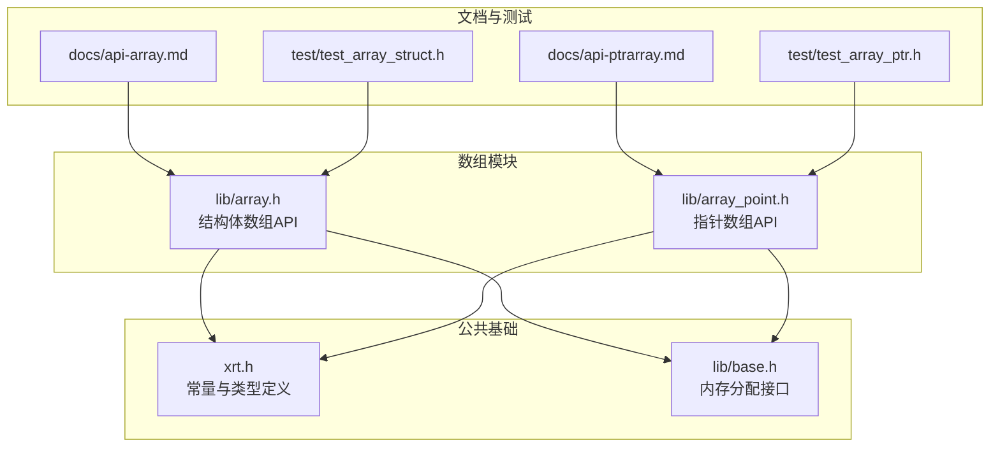
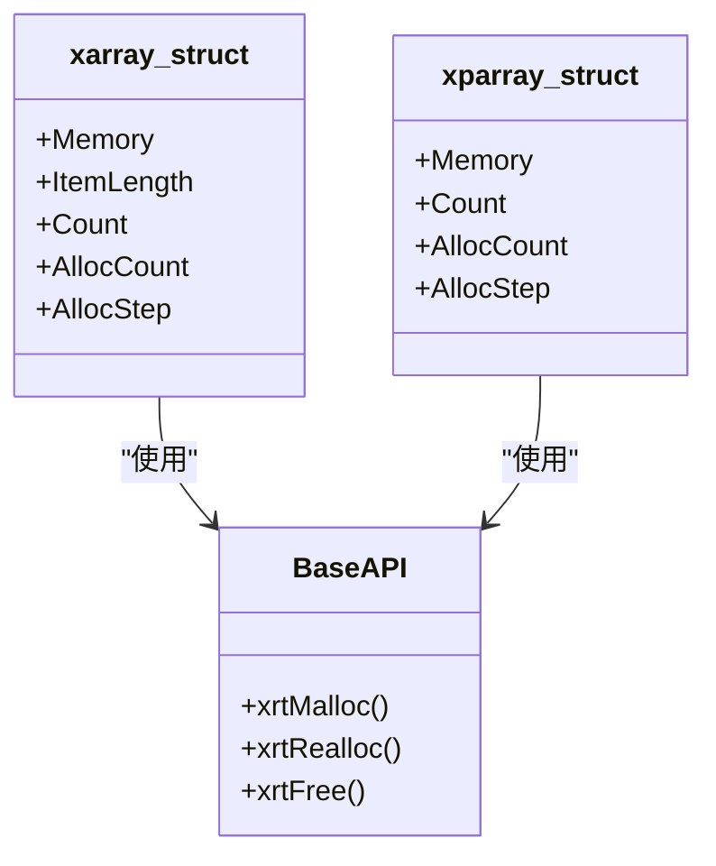
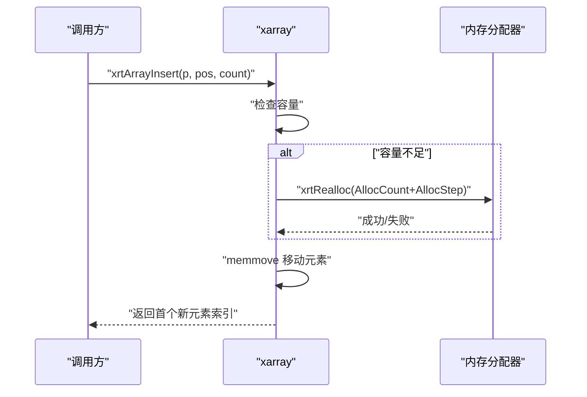
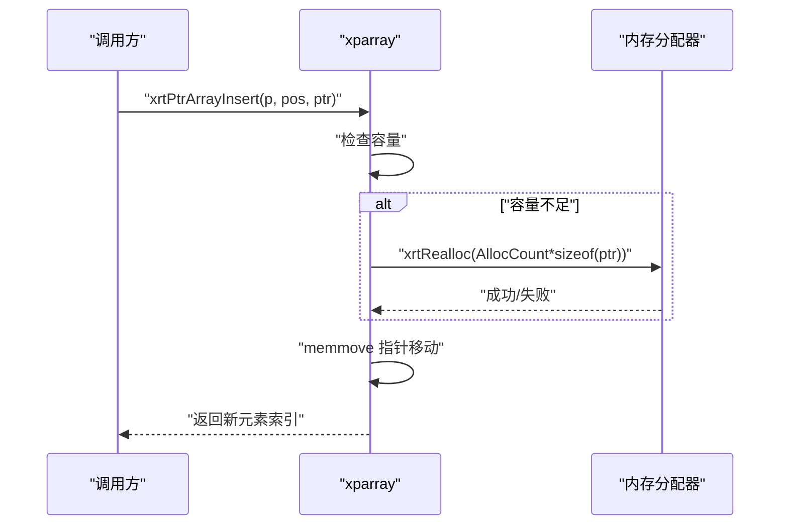
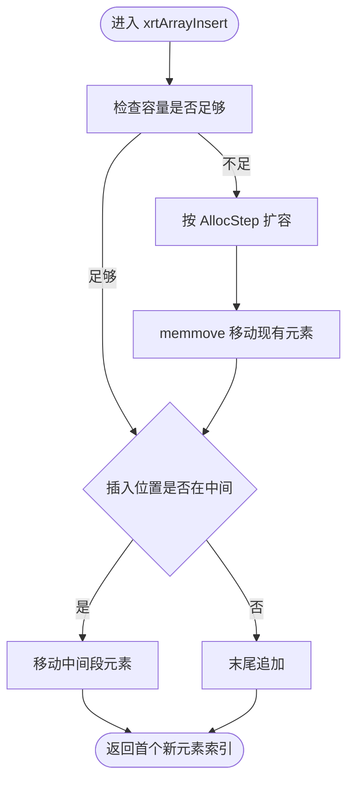
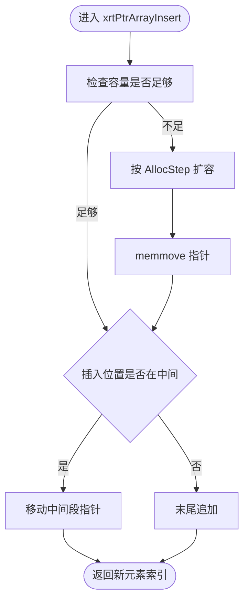
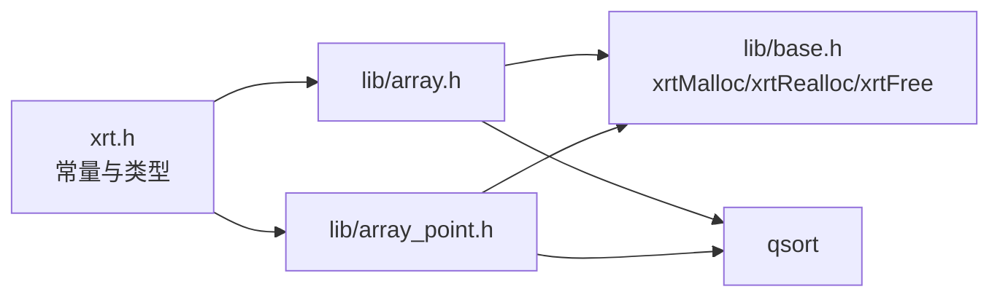

# 数组模块

<cite>
**本文引用的文件**
- [lib/array.h](file://lib/array.h)
- [lib/array_point.h](file://lib/array_point.h)
- [docs/api-array.md](file://docs/api-array.md)
- [docs/api-ptrarray.md](file://docs/api-ptrarray.md)
- [test/test_array_struct.h](file://test/test_array_struct.h)
- [test/test_array_ptr.h](file://test/test_array_ptr.h)
- [xrt.h](file://xrt.h)
- [lib/base.h](file://lib/base.h)
</cite>

## 目录
1. [简介](#简介)
2. [项目结构](#项目结构)
3. [核心组件](#核心组件)
4. [架构总览](#架构总览)
5. [详细组件分析](#详细组件分析)
6. [依赖关系分析](#依赖关系分析)
7. [性能考量](#性能考量)
8. [故障排查指南](#故障排查指南)
9. [结论](#结论)
10. [附录](#附录)

## 简介
本文件系统性梳理XRT数组模块，重点对比“结构体数组”（array）与“指针数组”（array_point）两种实现方式的差异、适用场景与性能特征；深入解析动态扩容机制、内存分配策略与访问模式；并给出创建、销毁、插入、删除、查找、排序等核心API的使用方法与最佳实践。同时通过测试样例路径与图示帮助读者快速掌握在数据存储、对象管理、动态集合等场景中的正确用法。

## 项目结构
数组模块位于lib目录下，分别提供结构体数组与指针数组两类API，并配套官方文档与测试用例：
- 结构体数组：lib/array.h 提供xarray接口族，元素为连续内存块内的原始结构体
- 指针数组：lib/array_point.h 提供xparray接口族，元素为指针，指向外部对象或数据
- 文档：docs/api-array.md 与 docs/api-ptrarray.md 提供完整API说明与示例
- 测试：test/test_array_struct.h 与 test/test_array_ptr.h 展示典型用法与行为验证
- 常量与类型：xrt.h 中定义默认预分配步长与数据结构
- 内存基础：lib/base.h 提供xrtMalloc/xrtRealloc/xrtFree等底层内存接口

图表来源
- [lib/array.h](file://lib/array.h#L1-L180)
- [lib/array_point.h](file://lib/array_point.h#L1-L199)
- [docs/api-array.md](file://docs/api-array.md#L1-L800)
- [docs/api-ptrarray.md](file://docs/api-ptrarray.md#L1-L800)
- [test/test_array_struct.h](file://test/test_array_struct.h#L1-L374)
- [test/test_array_ptr.h](file://test/test_array_ptr.h#L1-L371)
- [xrt.h](file://xrt.h#L1064-L1196)
- [lib/base.h](file://lib/base.h#L1-L132)

章节来源
- [lib/array.h](file://lib/array.h#L1-L180)
- [lib/array_point.h](file://lib/array_point.h#L1-L199)
- [docs/api-array.md](file://docs/api-array.md#L1-L800)
- [docs/api-ptrarray.md](file://docs/api-ptrarray.md#L1-L800)
- [test/test_array_struct.h](file://test/test_array_struct.h#L1-L374)
- [test/test_array_ptr.h](file://test/test_array_ptr.h#L1-L371)
- [xrt.h](file://xrt.h#L1064-L1196)
- [lib/base.h](file://lib/base.h#L1-L132)

## 核心组件
- 结构体数组（xarray）
  - 数据结构：xarray_struct，包含连续内存块、元素大小、计数、已分配容量、预分配步长
  - 关键API：创建/销毁、初始化/释放、预分配/扩容、插入/追加/删除、交换、访问、排序
- 指针数组（xparray）
  - 数据结构：xparray_struct，包含指针数组、计数、已分配容量、预分配步长
  - 关键API：创建/销毁、初始化/释放、预分配/扩容、插入/追加/删除、交换、访问、排序、替代添加（AddAlt）

章节来源
- [docs/api-array.md](file://docs/api-array.md#L41-L62)
- [docs/api-ptrarray.md](file://docs/api-ptrarray.md#L41-L60)
- [lib/array.h](file://lib/array.h#L25-L40)
- [lib/array_point.h](file://lib/array_point.h#L23-L37)

## 架构总览
两种数组共享相同的扩容策略与索引规则（1-based），但在内存布局与访问模式上有本质区别：
- 结构体数组：元素直接存储在连续内存块中，适合定长或可预估大小的结构体
- 指针数组：元素为指针，适合异构对象、动态对象、或需要灵活管理生命周期的场景

图表来源
- [lib/array.h](file://lib/array.h#L47-L53)
- [lib/array_point.h](file://lib/array_point.h#L48-L52)
- [lib/base.h](file://lib/base.h#L5-L45)

## 详细组件分析

### 结构体数组（xarray）分析
- 数据结构与默认步长
  - 默认预分配步长：XARRAY_PREASSIGNSTEP（见xrt.h）
  - 关键字段：Memory（连续内存块）、ItemLength（元素字节大小）、Count、AllocCount、AllocStep
- 动态扩容与内存分配
  - 预分配/扩容：xrtArrayAlloc根据目标容量与当前AllocCount决定增长或收缩
  - 插入/追加：xrtArrayInsert/xrtArrayAppend在容量不足时按AllocStep递增扩容
  - 删除：xrtArrayRemove通过memmove压缩后续元素，保持连续内存特性
- 访问与排序
  - 访问：xrtArrayGet（安全）、xrtArrayGet_Unsafe（不安全）、xrtArrayGet_Inline（内联）
  - 排序：xrtArraySort基于qsort，比较函数需遵循qsort签名
- 索引规则
  - 索引从1开始，0表示不存在的元素（文档明确说明）

图表来源
- [lib/array.h](file://lib/array.h#L77-L99)
- [lib/array.h](file://lib/array.h#L43-L74)
- [lib/base.h](file://lib/base.h#L29-L37)

章节来源
- [docs/api-array.md](file://docs/api-array.md#L20-L62)
- [lib/array.h](file://lib/array.h#L25-L40)
- [lib/array.h](file://lib/array.h#L43-L74)
- [lib/array.h](file://lib/array.h#L77-L99)
- [lib/array.h](file://lib/array.h#L153-L177)
- [xrt.h](file://xrt.h#L1141-L1151)

### 指针数组（xparray）分析
- 数据结构与默认步长
  - 默认预分配步长：XPARRAY_PREASSIGNSTEP（见xrt.h）
  - 关键字段：Memory（指针数组）、Count、AllocCount、AllocStep
- 动态扩容与内存分配
  - 预分配/扩容：xrtPtrArrayMalloc按指针数量进行realloc
  - 插入/追加：xrtPtrArrayInsert在容量不足时按AllocStep递增扩容
  - 替代添加：xrtPtrArrayAddAlt优先复用已删除位置（NULL槽位），否则追加
  - 删除：xrtPtrArrayRemove通过memmove压缩指针，保持连续指针序列
- 访问与排序
  - 访问：xrtPtrArrayGet/Set（安全/不安全/内联）
  - 排序：xrtPtrArraySort基于qsort，比较函数需接受void**签名
- 索引规则
  - 索引从1开始，0表示不存在的元素（文档明确说明）

图表来源
- [lib/array_point.h](file://lib/array_point.h#L74-L95)
- [lib/array_point.h](file://lib/array_point.h#L40-L71)
- [lib/base.h](file://lib/base.h#L29-L37)

章节来源
- [docs/api-ptrarray.md](file://docs/api-ptrarray.md#L20-L60)
- [lib/array_point.h](file://lib/array_point.h#L23-L37)
- [lib/array_point.h](file://lib/array_point.h#L40-L71)
- [lib/array_point.h](file://lib/array_point.h#L74-L95)
- [lib/array_point.h](file://lib/array_point.h#L155-L185)
- [xrt.h](file://xrt.h#L1064-L1073)

### 两种实现的对比与选择
- 内存布局
  - 结构体数组：元素连续存储，缓存友好，适合定长或紧凑结构
  - 指针数组：元素为指针，元素本身可能分散在不同内存区域，缓存局部性取决于指针分布
- 生命周期管理
  - 结构体数组：元素生命周期与数组一致，销毁时需自行释放元素内部动态资源
  - 指针数组：元素生命周期独立于数组，适合管理外部对象或动态分配的资源
- 性能特征
  - 结构体数组：随机访问O(1)，插入/删除涉及memmove，平均成本与元素大小相关
  - 指针数组：随机访问O(1)，插入/删除仅移动指针，通常更高效
- 适用场景
  - 结构体数组：固定大小结构体集合、批处理、需要连续内存的场景
  - 指针数组：对象集合、动态对象、需要灵活替换/回收的场景

章节来源
- [docs/api-array.md](file://docs/api-array.md#L698-L800)
- [docs/api-ptrarray.md](file://docs/api-ptrarray.md#L698-L784)

### API使用要点与最佳实践
- 创建与销毁
  - 结构体数组：xrtArrayCreate + xrtArrayDestroy；如需内嵌结构体，使用xrtArrayInit/xrtArrayUnit
  - 指针数组：xrtPtrArrayCreate + xrtPtrArrayDestroy；如需内嵌结构体，使用xrtPtrArrayInit/xrtPtrArrayUnit
- 批量操作与容量预估
  - 预分配：xrtArrayAlloc / xrtPtrArrayMalloc，减少多次realloc
  - 批量插入：xrtArrayAppend / xrtPtrArrayAppend传入count，避免多次调用
- 访问模式
  - 安全访问：xrtArrayGet / xrtPtrArrayGet
  - 高性能遍历：xrtArrayGet_Inline / xrtPtrArrayGet_Inline（确保索引有效）
- 排序与比较
  - 结构体数组：比较函数接收元素指针（void*）
  - 指针数组：比较函数接收void**（指向指针的指针）
- 内存管理
  - 结构体数组：销毁前需释放元素内部动态资源
  - 指针数组：销毁前需释放指针指向的对象与字符串等资源

章节来源
- [docs/api-array.md](file://docs/api-array.md#L67-L265)
- [docs/api-ptrarray.md](file://docs/api-ptrarray.md#L65-L207)

### 典型流程与算法可视化

#### 结构体数组插入流程

图表来源
- [lib/array.h](file://lib/array.h#L77-L99)
- [lib/array.h](file://lib/array.h#L43-L74)

#### 指针数组插入流程

图表来源
- [lib/array_point.h](file://lib/array_point.h#L74-L95)
- [lib/array_point.h](file://lib/array_point.h#L40-L71)

## 依赖关系分析
- 常量与类型
  - XARRAY_PREASSIGNSTEP / XPARRAY_PREASSIGNSTEP：默认预分配步长
  - xarray_struct / xparray_struct：数组管理器数据结构
- 内存分配
  - xrtArrayAlloc / xrtPtrArrayMalloc：基于xrtRealloc进行扩容/收缩
  - xrtArrayUnit / xrtPtrArrayUnit：释放内部内存并清零计数
- API依赖
  - 结构体数组：依赖qsort进行排序
  - 指针数组：依赖qsort进行排序（void**比较）

图表来源
- [xrt.h](file://xrt.h#L1064-L1196)
- [lib/array.h](file://lib/array.h#L43-L74)
- [lib/array_point.h](file://lib/array_point.h#L40-L71)
- [lib/base.h](file://lib/base.h#L5-L45)

章节来源
- [xrt.h](file://xrt.h#L1064-L1196)
- [lib/array.h](file://lib/array.h#L43-L74)
- [lib/array_point.h](file://lib/array_point.h#L40-L71)
- [lib/base.h](file://lib/base.h#L5-L45)

## 性能考量
- 扩容策略
  - 两种数组均采用“步长递增”的扩容策略，避免频繁realloc带来的高成本
  - 结构体数组每次扩容按元素个数×元素大小计算；指针数组按指针个数×sizeof(ptr)计算
- 缓存局部性
  - 结构体数组：元素连续存储，顺序访问具有良好的缓存局部性
  - 指针数组：元素为指针，顺序访问的缓存局部性取决于指针所指对象的分布
- 插入/删除复杂度
  - 结构体数组：插入/删除涉及memmove，时间复杂度O(n)
  - 指针数组：仅移动指针，通常更高效，时间复杂度O(n)
- 访问模式
  - 安全访问（带边界检查）与不安全/内联访问在性能上有明显差异，应按场景选择

章节来源
- [docs/api-array.md](file://docs/api-array.md#L665-L670)
- [docs/api-ptrarray.md](file://docs/api-ptrarray.md#L565-L574)

## 故障排查指南
- 索引越界
  - 结构体数组：xrtArrayGet返回NULL表示越界；使用xrtArrayGet_Unsafe或xrtArrayGet_Inline前需确保索引有效
  - 指针数组：xrtPtrArrayGet返回NULL表示越界；使用xrtPtrArrayGet_Unsafe或xrtPtrArrayGet_Inline前需确保索引有效
- 内存泄漏
  - 结构体数组：销毁前需释放元素内部动态资源（如字符串、子结构体）
  - 指针数组：销毁前需释放指针指向的对象与字符串等资源
- 扩容失败
  - xrtArrayAlloc / xrtPtrArrayMalloc返回FALSE表示内存分配失败；应检查系统可用内存与错误回调
- 排序异常
  - 结构体数组：比较函数需遵循qsort签名（void* vs void*）
  - 指针数组：比较函数需接受void**（指向指针的指针）

章节来源
- [lib/array.h](file://lib/array.h#L153-L166)
- [lib/array_point.h](file://lib/array_point.h#L155-L185)
- [lib/base.h](file://lib/base.h#L88-L101)

## 结论
XRT数组模块提供了两种互补的动态数组实现：结构体数组适合定长/紧凑结构体的连续存储与批处理；指针数组适合异构对象与灵活生命周期管理。两者共享统一的扩容策略与索引规则，但在内存布局、缓存局部性与生命周期管理方面存在显著差异。通过合理使用预分配、批量操作与正确的访问模式，可在保证性能的同时提升代码的健壮性与可维护性。

## 附录
- 示例参考路径
  - 结构体数组：[docs/api-array.md 示例](file://docs/api-array.md#L85-L114)、[test/test_array_struct.h](file://test/test_array_struct.h#L20-L374)
  - 指针数组：[docs/api-ptrarray.md 示例](file://docs/api-ptrarray.md#L80-L99)、[test/test_array_ptr.h](file://test/test_array_ptr.h#L11-L371)