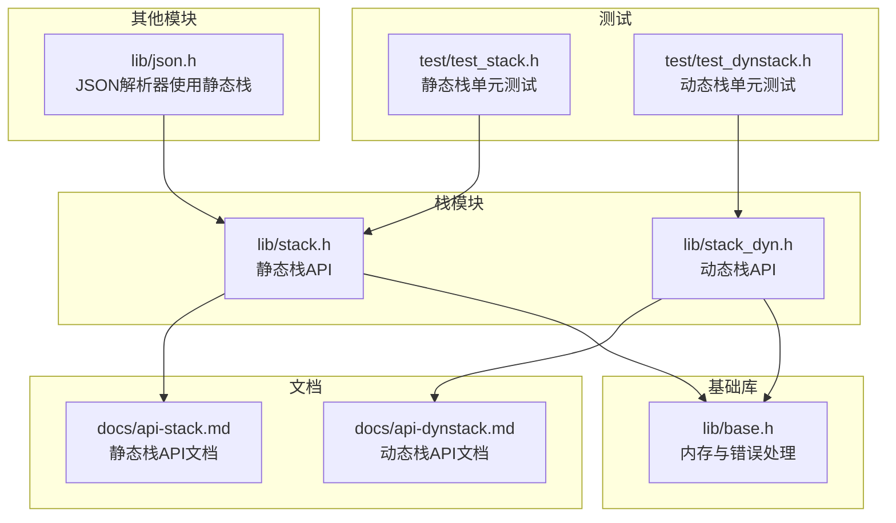
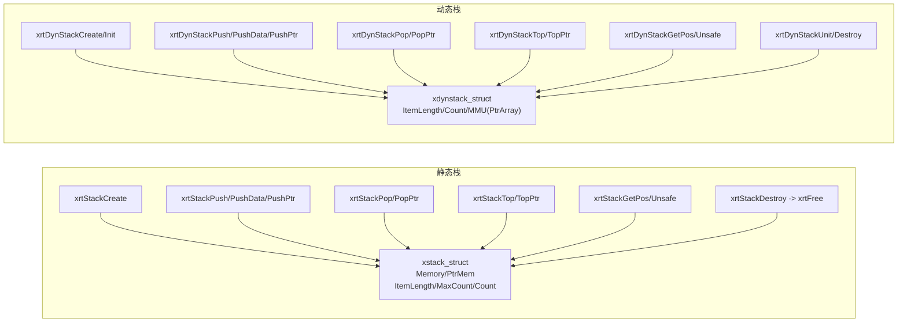
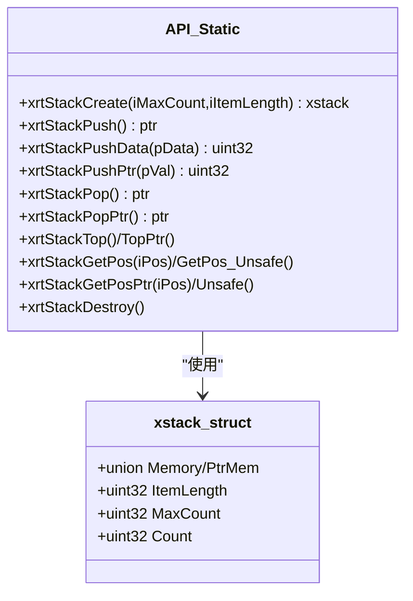
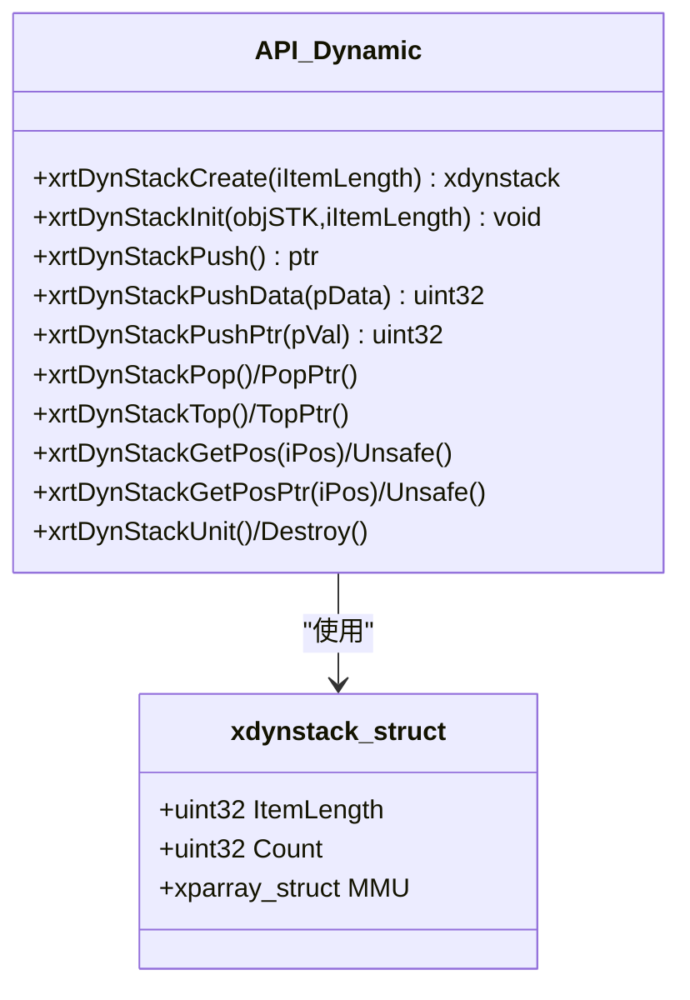
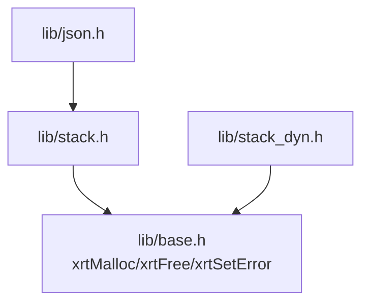

# 栈模块

<cite>
**本文引用的文件列表**
- [lib/stack.h](file://lib/stack.h)
- [lib/stack_dyn.h](file://lib/stack_dyn.h)
- [docs/api-stack.md](file://docs/api-stack.md)
- [docs/api-dynstack.md](file://docs/api-dynstack.md)
- [test/test_stack.h](file://test/test_stack.h)
- [test/test_dynstack.h](file://test/test_dynstack.h)
- [lib/base.h](file://lib/base.h)
- [lib/json.h](file://lib/json.h)
</cite>

## 目录
1. [简介](#简介)
2. [项目结构](#项目结构)
3. [核心组件](#核心组件)
4. [架构总览](#架构总览)
5. [详细组件分析](#详细组件分析)
6. [依赖关系分析](#依赖关系分析)
7. [性能考量](#性能考量)
8. [故障排查指南](#故障排查指南)
9. [结论](#结论)
10. [附录](#附录)

## 简介
本文件系统化梳理XRT栈模块，涵盖静态栈（Stack）与动态栈（DynStack）两类实现，重点说明：
- LIFO后进先出特性与基本操作（push、pop、top、isEmpty等）
- 内存管理策略（静态分配 vs 动态扩容）
- 性能差异与适用场景
- 最佳实践（溢出防护、内存复用、异常处理）
- 实战应用（表达式求值、括号匹配、函数调用、回溯算法）

## 项目结构
栈模块位于lib目录下，配套文档在docs目录，测试样例在test目录；部分其他模块（如JSON解析器）内部也使用了静态栈。

图表来源
- [lib/stack.h](file://lib/stack.h#L1-L135)
- [lib/stack_dyn.h](file://lib/stack_dyn.h#L1-L162)
- [docs/api-stack.md](file://docs/api-stack.md#L1-L718)
- [docs/api-dynstack.md](file://docs/api-dynstack.md#L1-L887)
- [test/test_stack.h](file://test/test_stack.h#L1-L253)
- [test/test_dynstack.h](file://test/test_dynstack.h#L1-L289)
- [lib/base.h](file://lib/base.h#L1-L132)
- [lib/json.h](file://lib/json.h#L1620-L1860)

章节来源
- [lib/stack.h](file://lib/stack.h#L1-L135)
- [lib/stack_dyn.h](file://lib/stack_dyn.h#L1-L162)
- [docs/api-stack.md](file://docs/api-stack.md#L1-L718)
- [docs/api-dynstack.md](file://docs/api-dynstack.md#L1-L887)
- [test/test_stack.h](file://test/test_stack.h#L1-L253)
- [test/test_dynstack.h](file://test/test_dynstack.h#L1-L289)
- [lib/base.h](file://lib/base.h#L1-L132)
- [lib/json.h](file://lib/json.h#L1620-L1860)

## 核心组件
- 静态栈（Stack）
  - 固定容量，创建时确定最大深度
  - 支持结构体模式与指针模式
  - 内存连续分配，销毁即释放
- 动态栈（DynStack）
  - 无上限容量，按需分块扩容
  - 每块存储256个元素，延迟释放策略避免频繁分配/释放
  - 提供栈上初始化/释放接口

章节来源
- [lib/stack.h](file://lib/stack.h#L4-L15)
- [lib/stack_dyn.h](file://lib/stack_dyn.h#L5-L41)
- [docs/api-stack.md](file://docs/api-stack.md#L21-L58)
- [docs/api-dynstack.md](file://docs/api-dynstack.md#L23-L95)

## 架构总览
静态栈与动态栈共享统一的LIFO语义，但在内存组织与容量控制上差异显著。静态栈通过一次分配承载全部元素；动态栈通过“块数组”管理器按需分配内存块，并在出栈时采用延迟释放策略优化性能。

图表来源
- [lib/stack.h](file://lib/stack.h#L24-L135)
- [lib/stack_dyn.h](file://lib/stack_dyn.h#L5-L162)

## 详细组件分析

### 静态栈（Stack）
- 数据结构
  - 联合体字段Memory/PtrMem根据模式切换访问方式
  - ItemLength、MaxCount、Count分别表示元素大小、最大容量、当前计数
- 基本操作
  - 创建：xrtStackCreate
  - 压栈：xrtStackPush（分配空间）、xrtStackPushData（复制数据）、xrtStackPushPtr（指针模式）
  - 出栈：xrtStackPop（结构体模式）、xrtStackPopPtr（指针模式）
  - 访问：xrtStackTop/TopPtr、xrtStackGetPos/GetPos_Unsafe、xrtStackGetPosPtr/Unsafe
  - 销毁：xrtStackDestroy（宏定义为xrtFree）
- 内存管理
  - 一次性分配：结构体后跟连续内存块，容量由MaxCount决定
  - 销毁即释放，无需额外管理器
- 使用要点
  - 栈满检查：Count >= MaxCount时push失败
  - Pop返回的指针在下一次Push前有效，避免悬挂指针

图表来源
- [lib/stack.h](file://lib/stack.h#L24-L135)
- [docs/api-stack.md](file://docs/api-stack.md#L21-L121)

章节来源
- [lib/stack.h](file://lib/stack.h#L4-L135)
- [docs/api-stack.md](file://docs/api-stack.md#L21-L121)

### 动态栈（DynStack）
- 数据结构
  - xdynstack_struct包含ItemLength、Count与MMU（PtrArray）作为内存块管理器
  - 每块存储256个元素，按需分配新块
- 基本操作
  - 创建/初始化：xrtDynStackCreate、xrtDynStackInit
  - 压栈：xrtDynStackPush、xrtDynStackPushData、xrtDynStackPushPtr
  - 出栈：xrtDynStackPop、xrtDynStackPopPtr（带延迟释放）
  - 访问：xrtDynStackTop/TopPtr、xrtDynStackGetPos/Unsafe、xrtDynStackGetPosPtr/Unsafe
  - 资源释放：xrtDynStackUnit（仅释放资源，不释放栈结构体本身）、xrtDynStackDestroy（释放资源并释放结构体）
- 内存管理
  - 分块管理：iBlock = Count >> 8；iPos = Count & 0xFF
  - 延迟释放：当空闲容量超过阈值（Count + 288）时释放最后1块
  - MMU.AllocStep默认64，用于块数组增长步长
- 使用要点
  - 深度不可预知时优先使用动态栈
  - 注意越界访问，安全版本返回NULL，不安全版本可能导致未定义行为

图表来源
- [lib/stack_dyn.h](file://lib/stack_dyn.h#L68-L162)
- [docs/api-dynstack.md](file://docs/api-dynstack.md#L66-L222)

章节来源
- [lib/stack_dyn.h](file://lib/stack_dyn.h#L5-L162)
- [docs/api-dynstack.md](file://docs/api-dynstack.md#L66-L222)

### 基本操作与LIFO特性
- push：将元素放入栈顶，时间复杂度O(1)
- pop：取出栈顶元素，时间复杂度O(1)
- top：查看栈顶元素但不移除，时间复杂度O(1)
- isEmpty：基于Count判断，时间复杂度O(1)
- 静态栈的push/pop/top均通过直接偏移访问，动态栈通过两级寻址（块号+块内偏移）

章节来源
- [lib/stack.h](file://lib/stack.h#L17-L92)
- [lib/stack_dyn.h](file://lib/stack_dyn.h#L43-L121)

### 内存管理策略
- 静态栈
  - 优点：内存连续、访问速度快、无额外管理器开销
  - 缺点：容量固定，易发生栈溢出
- 动态栈
  - 优点：容量无限、按需分配、延迟释放减少抖动
  - 缺点：多级寻址带来轻微开销、需要管理器与块数组

章节来源
- [lib/stack.h](file://lib/stack.h#L4-L15)
- [lib/stack_dyn.h](file://lib/stack_dyn.h#L5-L41)
- [docs/api-dynstack.md](file://docs/api-dynstack.md#L27-L33)

### 典型应用场景与示例路径
- 表达式求值
  - 静态栈：[示例路径](file://docs/api-stack.md#L487-L518)
  - 动态栈：[示例路径](file://docs/api-dynstack.md#L638-L684)
- 括号匹配
  - 静态栈：[示例路径](file://docs/api-stack.md#L522-L566)
- 路径回溯
  - 静态栈：[示例路径](file://docs/api-stack.md#L569-L605)
- DFS与撤销/重做
  - 动态栈：[示例路径](file://docs/api-dynstack.md#L590-L758)

章节来源
- [docs/api-stack.md](file://docs/api-stack.md#L482-L605)
- [docs/api-dynstack.md](file://docs/api-dynstack.md#L590-L758)

### 静态栈与动态栈对比
- 容量：静态栈固定，动态栈无上限
- 内存布局：静态栈连续，动态栈分块
- 访问速度：静态栈O(1)直接偏移，动态栈O(1)两级寻址
- 内存开销：静态栈较小，动态栈较大（MMU管理器）
- 适用场景：静态栈用于深度可预知且追求极致性能；动态栈用于深度不可预知或递归深度大

章节来源
- [docs/api-dynstack.md](file://docs/api-dynstack.md#L762-L777)
- [docs/api-stack.md](file://docs/api-stack.md#L609-L633)

## 依赖关系分析
- 静态栈
  - 依赖基础内存分配与释放（xrtMalloc/xrtFree）
  - 销毁即释放，无额外依赖
- 动态栈
  - 依赖基础内存分配与错误上报（xrtMalloc/xrtSetError）
  - 依赖PtrArray（通过MMU）进行块数组管理
- 其他模块使用
  - JSON解析器内部使用静态栈进行上下文管理（如堆栈指针）

图表来源
- [lib/stack.h](file://lib/stack.h#L7-L14)
- [lib/stack_dyn.h](file://lib/stack_dyn.h#L7-L20)
- [lib/base.h](file://lib/base.h#L4-L45)
- [lib/json.h](file://lib/json.h#L1620-L1860)

章节来源
- [lib/stack.h](file://lib/stack.h#L7-L14)
- [lib/stack_dyn.h](file://lib/stack_dyn.h#L7-L20)
- [lib/base.h](file://lib/base.h#L4-L45)
- [lib/json.h](file://lib/json.h#L1620-L1860)

## 性能考量
- 时间复杂度
  - push/pop/top/isEmpty均为O(1)
- 空间复杂度
  - 静态栈：O(MaxCount×ItemLength)
  - 动态栈：O(Count×ItemLength)，外加MMU管理开销
- 访问模式
  - 静态栈：连续内存，局部性好，缓存命中率高
  - 动态栈：分块访问，局部性受块大小影响
- 扩容与释放
  - 静态栈：无扩容，避免碎片与分配成本
  - 动态栈：延迟释放减少抖动，阈值设计平衡内存与性能

章节来源
- [lib/stack.h](file://lib/stack.h#L17-L92)
- [lib/stack_dyn.h](file://lib/stack_dyn.h#L43-L110)
- [docs/api-dynstack.md](file://docs/api-dynstack.md#L27-L33)

## 故障排查指南
- 栈溢出
  - 静态栈：push前检查Count与MaxCount
  - 动态栈：push返回NULL时需处理失败
- 悬挂指针
  - Pop返回的指针在下一次Push前有效，应立即使用或复制
- 越界访问
  - 动态栈安全版本返回NULL，不安全版本可能导致未定义行为
- 错误上报
  - 动态栈在添加内存块失败时会设置错误信息，可通过错误回调获取

章节来源
- [docs/api-stack.md](file://docs/api-stack.md#L637-L700)
- [docs/api-dynstack.md](file://docs/api-dynstack.md#L565-L575)
- [lib/stack_dyn.h](file://lib/stack_dyn.h#L58-L62)
- [lib/base.h](file://lib/base.h#L88-L101)

## 结论
- 若深度可预知且追求极致性能，优先选择静态栈
- 若深度不可预知、递归深度大或需要灵活扩展，选择动态栈
- 在实际工程中，结合业务场景合理选择，并遵循最佳实践以规避常见问题

## 附录
- 测试参考
  - 静态栈测试：[test/test_stack.h](file://test/test_stack.h#L13-L253)
  - 动态栈测试：[test/test_dynstack.h](file://test/test_dynstack.h#L13-L289)
- 文档参考
  - 静态栈API文档：[docs/api-stack.md](file://docs/api-stack.md#L1-L718)
  - 动态栈API文档：[docs/api-dynstack.md](file://docs/api-dynstack.md#L1-L887)