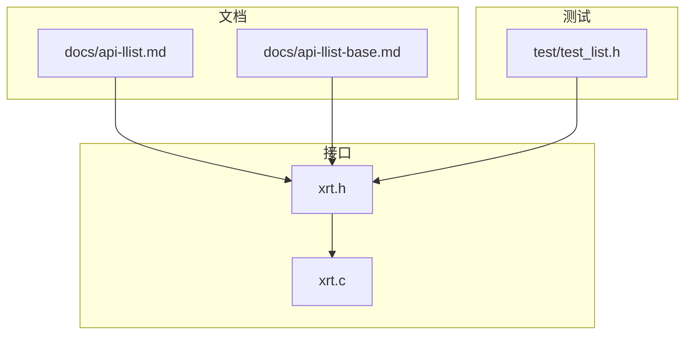
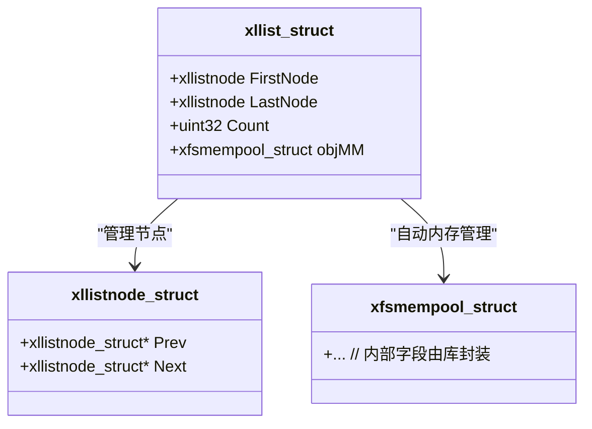
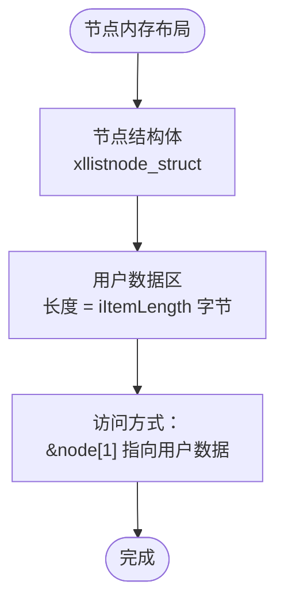
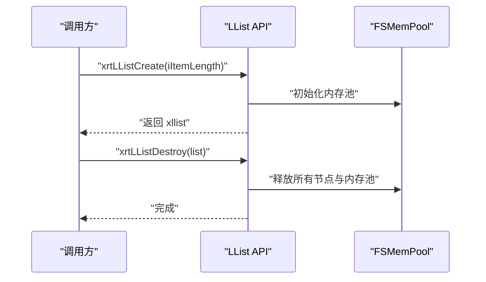
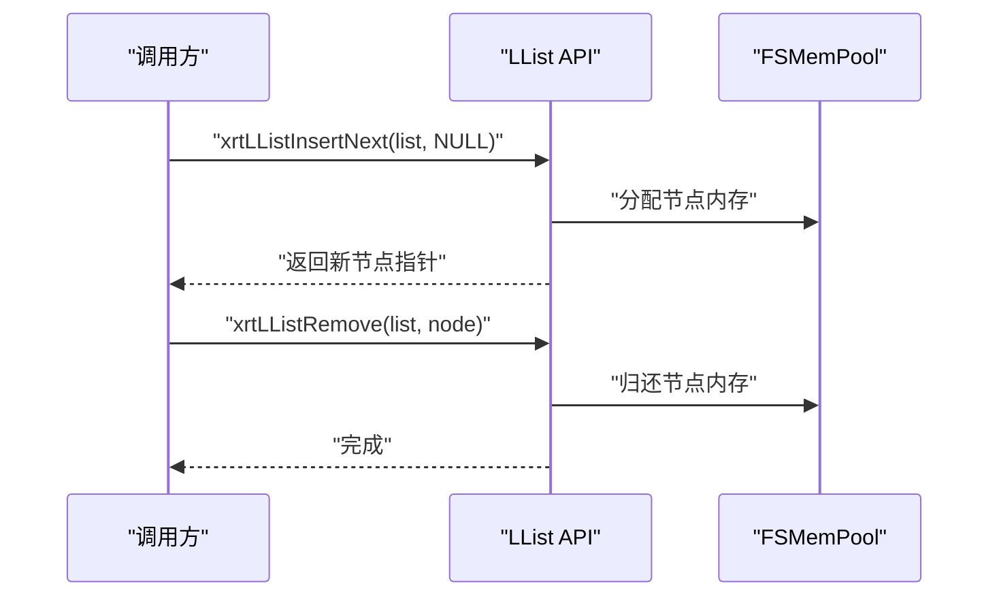
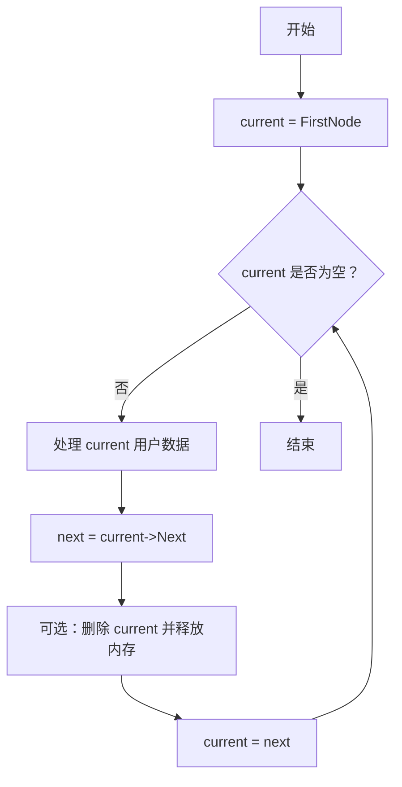
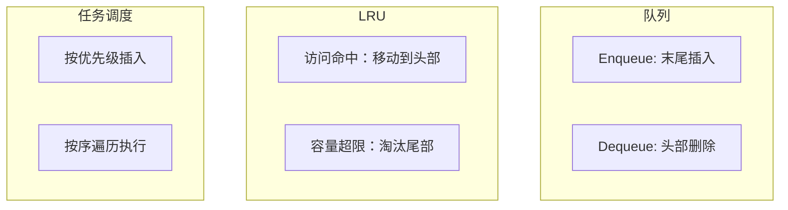
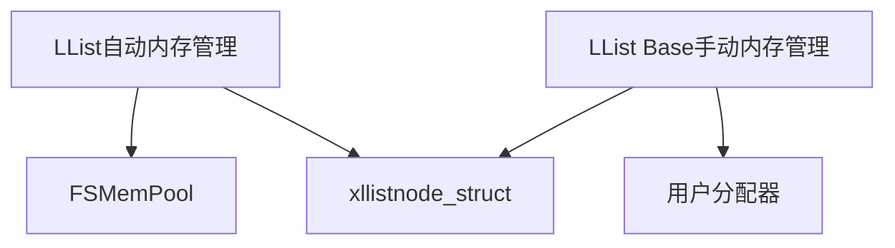

# 链表模块

<cite>
**本文引用的文件**
- [api-llist.md](file://docs/api-llist.md)
- [api-llist-base.md](file://docs/api-llist-base.md)
- [test_list.h](file://test/test_list.h)
- [xrt.c](file://xrt.c)
- [xrt.h](file://xrt.h)
</cite>

## 目录
1. [简介](#简介)
2. [项目结构](#项目结构)
3. [核心组件](#核心组件)
4. [架构总览](#架构总览)
5. [详细组件分析](#详细组件分析)
6. [依赖关系分析](#依赖关系分析)
7. [性能考量](#性能考量)
8. [故障排查指南](#故障排查指南)
9. [结论](#结论)
10. [附录](#附录)

## 简介
本文件系统化梳理 XRT 提供的“链表模块”，重点围绕双向链表（LList）与链表基础库（LList Base）两大能力，阐述其数据结构设计、节点内存布局、基本操作（插入/删除/查找/遍历）、内存管理策略（FSMemPool 自动管理 vs 用户手动管理）、迭代与遍历模式、性能特征与最佳实践，并给出在队列、LRU 缓存、任务调度等典型场景中的使用范式与对比分析。

## 项目结构
- 文档侧：链表相关 API 与使用说明集中在 docs 目录下的两份文档中，分别面向“LList（自动内存管理）”和“LList Base（底层手动管理）”。
- 测试侧：通过 test/test_list.h 展示了与链表相关的其他数据结构（如 AVLTree）的测试流程，可辅助理解链表在整体库中的定位。
- 接口侧：链表 API 的声明与实现入口通常位于 xrt.h/xrt.c 中，对外暴露统一的 XXAPI 接口风格。

**图示来源**
- [api-llist.md](file://docs/api-llist.md#L1-L120)
- [api-llist-base.md](file://docs/api-llist-base.md#L1-L120)
- [xrt.h](file://xrt.h#L1-L200)
- [xrt.c](file://xrt.c#L1-L200)

**章节来源**
- [api-llist.md](file://docs/api-llist.md#L1-L120)
- [api-llist-base.md](file://docs/api-llist-base.md#L1-L120)
- [xrt.h](file://xrt.h#L1-L200)

## 核心组件
- LList（自动内存管理的双向链表）
  - 管理结构：xllist_struct，包含首尾节点指针、计数器与 FSMemPool 内存池。
  - 节点内存布局：节点结构体（xllistnode_struct）+ 用户数据（iItemLength 字节），用户数据位于 node[1]。
  - API：创建/销毁、初始化/释放、插入（前/后）、删除、遍历等。
- LList Base（底层手动管理的双向链表）
  - 管理结构：xllistbase_struct，仅包含首尾节点与计数。
  - 节点结构：xllistnode_struct，要求用户自定义节点结构的第一个成员必须是该结构体。
  - API：初始化/清空、插入（前/后）、删除等，均由用户负责节点内存生命周期。

**章节来源**
- [api-llist.md](file://docs/api-llist.md#L33-L84)
- [api-llist.md](file://docs/api-llist.md#L82-L150)
- [api-llist.md](file://docs/api-llist.md#L232-L425)
- [api-llist.md](file://docs/api-llist.md#L429-L551)
- [api-llist-base.md](file://docs/api-llist-base.md#L32-L110)
- [api-llist-base.md](file://docs/api-llist-base.md#L114-L221)
- [api-llist-base.md](file://docs/api-llist-base.md#L225-L463)

## 架构总览
下图展示了 LList 的高层架构：管理结构体持有首尾节点与计数，同时内置内存池以自动管理节点内存；用户通过 API 对节点进行插入/删除，遍历时访问 node[1] 获取用户数据。

**图示来源**
- [api-llist.md](file://docs/api-llist.md#L55-L77)
- [api-llist.md](file://docs/api-llist.md#L68-L77)

**章节来源**
- [api-llist.md](file://docs/api-llist.md#L55-L77)

## 详细组件分析

### 数据结构与内存布局
- LList
  - 节点内存布局：节点结构体（xllistnode_struct）+ 用户数据（iItemLength 字节）。用户数据位于 node[1]，这是访问用户数据的标准偏移。
  - 管理结构：xllist_struct 包含 FirstNode、LastNode、Count 与 objMM（FSMemPool）。
- LList Base
  - 节点结构：xllistnode_struct，要求用户自定义节点结构体的第一个成员必须是该结构体，以便直接在节点指针与用户结构之间进行安全转换。

**图示来源**
- [api-llist.md](file://docs/api-llist.md#L33-L50)
- [api-llist-base.md](file://docs/api-llist-base.md#L50-L62)

**章节来源**
- [api-llist.md](file://docs/api-llist.md#L33-L50)
- [api-llist-base.md](file://docs/api-llist-base.md#L50-L62)

### 链表管理 API
- LList
  - 创建/销毁：xrtLListCreate、xrtLListDestroy
  - 初始化/释放：xrtLListInit、xrtLListUnit（与 Init/Unit 配对）
  - 清空：xrtLListRemoveAll / xrtLListClear（宏别名）
- LList Base
  - 初始化/清空：xrtLLB_Init、xrtLLB_Unit（宏别名）
  - 清空：xrtLLB_RemoveAll / xrtLLB_Clear（宏别名）

**图示来源**
- [api-llist.md](file://docs/api-llist.md#L82-L150)
- [api-llist.md](file://docs/api-llist.md#L133-L150)

**章节来源**
- [api-llist.md](file://docs/api-llist.md#L82-L150)
- [api-llist.md](file://docs/api-llist.md#L133-L150)
- [api-llist-base.md](file://docs/api-llist-base.md#L114-L162)
- [api-llist-base.md](file://docs/api-llist-base.md#L209-L221)

### 节点操作 API
- LList
  - 插入：xrtLListInsertNext、xrtLListInsertPrev（支持在 NULL 位置插入到末尾/开头）
  - 删除：xrtLListRemove（自动释放节点内存）
- LList Base
  - 插入：xrtLLB_InsertNext、xrtLLB_InsertPrev（需用户提供已分配的节点）
  - 删除：xrtLLB_Remove（仅移除，不释放节点内存）

**图示来源**
- [api-llist.md](file://docs/api-llist.md#L232-L378)
- [api-llist.md](file://docs/api-llist.md#L362-L378)

**章节来源**
- [api-llist.md](file://docs/api-llist.md#L232-L378)
- [api-llist.md](file://docs/api-llist.md#L362-L378)
- [api-llist-base.md](file://docs/api-llist-base.md#L225-L463)

### 遍历与迭代
- 正向遍历：从 FirstNode 开始，沿 Next 链移动。
- 反向遍历：从 LastNode 开始，沿 Prev 链移动。
- 安全遍历：在遍历过程中删除节点时，先保存下一个节点指针，再执行删除，避免破坏链表结构。

**图示来源**
- [api-llist.md](file://docs/api-llist.md#L429-L551)

**章节来源**
- [api-llist.md](file://docs/api-llist.md#L429-L551)

### 内存分配策略与节点缓存机制
- LList
  - 使用 FSMemPool 管理节点内存，插入时自动分配，删除时自动释放，降低碎片并提升吞吐。
  - 通过内存池的页式分配与批量管理，减少频繁系统调用带来的开销。
- LList Base
  - 用户自行管理节点内存，可结合自定义分配器（如 Bsmm）实现更灵活的缓存策略。
  - 适用于多链表共享同一节点、嵌入式系统等场景。

**章节来源**
- [api-llist.md](file://docs/api-llist.md#L26-L32)
- [api-llist-base.md](file://docs/api-llist-base.md#L23-L31)
- [api-llist-base.md](file://docs/api-llist-base.md#L469-L531)

### 性能特征
- 时间复杂度
  - 插入/删除（已知节点）：O(1)
  - 查找（无序）：O(n)
  - 遍历：O(n)
- 空间复杂度：O(n)
- 优势
  - 常数时间插入/删除，适合频繁变更的动态集合。
  - 双向遍历支持灵活的数据扫描。
- 注意
  - 随机访问弱，不适合大量随机读取场景。
  - 与数组相比，缓存局部性较差。

**章节来源**
- [api-llist.md](file://docs/api-llist.md#L30-L31)

### 迭代器模式
- LList
  - 提供遍历回调（xrtListWalk）与手动遍历两种方式，满足不同场景的迭代需求。
- LList Base
  - 以原生指针遍历为主，适合需要细粒度控制的场景。

**章节来源**
- [api-llist.md](file://docs/api-llist.md#L158-L185)
- [api-llist-base.md](file://docs/api-llist-base.md#L225-L463)

### 最佳实践
- 正确访问用户数据：始终使用 node[1] 获取用户数据，避免直接把 node 当作用户数据结构使用。
- 安全删除遍历：先保存 next 指针，再删除当前节点，防止遍历中断。
- 选择合适的实现：一般场景使用 LList（自动内存管理），需要自定义内存策略或嵌入式部署时使用 LList Base。

**章节来源**
- [api-llist.md](file://docs/api-llist.md#L761-L792)
- [api-llist.md](file://docs/api-llist.md#L796-L800)
- [api-llist-base.md](file://docs/api-llist-base.md#L711-L750)

### 典型应用场景
- 队列实现
  - 使用 LList 作为队列容器，入队在末尾插入，出队在头部删除。
- LRU 缓存
  - 使用 LList 维护访问顺序，最近使用移动至头部，超出容量时淘汰尾部。
- 任务调度
  - 按优先级插入到合适位置，保证遍历时天然有序。

**图示来源**
- [api-llist.md](file://docs/api-llist.md#L557-L614)
- [api-llist.md](file://docs/api-llist.md#L618-L666)
- [api-llist.md](file://docs/api-llist.md#L670-L736)

**章节来源**
- [api-llist.md](file://docs/api-llist.md#L557-L614)
- [api-llist.md](file://docs/api-llist.md#L618-L666)
- [api-llist.md](file://docs/api-llist.md#L670-L736)

### 与其他数据结构的对比
- 与数组对比
  - 插入/删除：链表 O(1)，数组 O(n)（需搬移）。
  - 随机访问：数组 O(1)，链表 O(n)。
- 与哈希表对比
  - 查找：哈希表平均 O(1)，链表 O(n)。
  - 保持顺序：链表可自然维持插入/优先级顺序，哈希表通常不保证。
- 与 AVL/红黑树对比
  - LList 无排序保证；若需有序且高效查找/插入/删除，可考虑 AVL/平衡树。

**章节来源**
- [api-llist.md](file://docs/api-llist.md#L740-L757)
- [api-llist-base.md](file://docs/api-llist-base.md#L693-L708)

## 依赖关系分析
- LList 依赖 FSMemPool 实现节点内存的自动管理。
- LList Base 依赖用户提供的节点内存，可与自定义分配器（如 Bsmm）组合使用。
- 两者均依赖 xllistnode_struct 作为节点基础结构。

**图示来源**
- [api-llist.md](file://docs/api-llist.md#L26-L32)
- [api-llist-base.md](file://docs/api-llist-base.md#L23-L31)
- [api-llist.md](file://docs/api-llist.md#L68-L77)
- [api-llist-base.md](file://docs/api-llist-base.md#L89-L109)

**章节来源**
- [api-llist.md](file://docs/api-llist.md#L26-L32)
- [api-llist-base.md](file://docs/api-llist-base.md#L23-L31)
- [api-llist.md](file://docs/api-llist.md#L68-L77)
- [api-llist-base.md](file://docs/api-llist-base.md#L89-L109)

## 性能考量
- 插入/删除的常数时间特性使链表非常适合频繁变更的场景。
- 遍历线性时间，适合顺序处理；若需要随机访问，应考虑数组或索引结构。
- 内存池的使用显著降低碎片与系统调用次数，提高吞吐量。
- 在高并发场景下，注意外部加锁策略以保证链表操作的原子性。

[本节为通用性能讨论，无需特定文件引用]

## 故障排查指南
- 访问用户数据错误
  - 症状：数据错位或崩溃。
  - 原因：直接将 node 当作用户数据结构使用。
  - 解决：始终使用 node[1] 访问用户数据。
- 遍历时删除导致崩溃
  - 症状：遍历中断或段错误。
  - 原因：删除当前节点后未保存 next 指针。
  - 解决：先保存 next，再删除当前节点。
- 内存泄漏
  - 症状：进程占用持续增长。
  - 原因：LList Base 场景下未释放节点内存；或 LList 场景下未正确销毁链表。
  - 解决：确保调用 xrtLListUnit/xrtLListDestroy 或用户自行释放节点。

**章节来源**
- [api-llist.md](file://docs/api-llist.md#L761-L792)
- [api-llist.md](file://docs/api-llist.md#L796-L800)
- [api-llist.md](file://docs/api-llist.md#L133-L150)
- [api-llist-base.md](file://docs/api-llist-base.md#L150-L205)

## 结论
XRT 的链表模块提供了两条路径：LList（自动内存管理）与 LList Base（底层手动管理）。前者以 FSMemPool 为核心，简化了内存管理，适合大多数通用场景；后者将控制权交给用户，便于自定义内存策略与嵌入式部署。二者均采用双向链表结构，具备 O(1) 插入/删除与双向遍历能力。在实际工程中，应根据内存策略、性能目标与使用场景选择合适的实现，并遵循正确的数据访问与遍历实践。

[本节为总结性内容，无需特定文件引用]

## 附录
- 示例参考
  - 队列实现：见“使用场景/队列实现”示例。
  - LRU 缓存：见“使用场景/LRU缓存”示例。
  - 任务调度：见“使用场景/任务调度器”示例。
- 测试参考
  - test_list.h 展示了库中其他数据结构（如 AVLTree）的测试流程，有助于理解链表在整体库中的定位与使用方式。

**章节来源**
- [api-llist.md](file://docs/api-llist.md#L557-L736)
- [test_list.h](file://test/test_list.h#L21-L274)