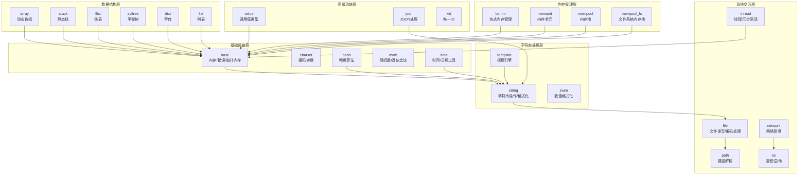
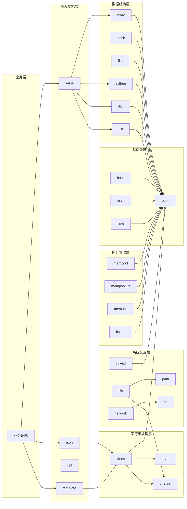
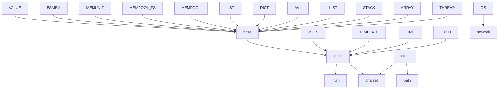

# 核心功能模块

<cite>
**本文档引用的文件**
- [lib/base.h](file://lib/base.h)
- [lib/charset.h](file://lib/charset.h)
- [lib/hash.h](file://lib/hash.h)
- [lib/math.h](file://lib/math.h)
- [lib/time.h](file://lib/time.h)
- [lib/os.h](file://lib/os.h)
- [lib/file.h](file://lib/file.h)
- [lib/path.h](file://lib/path.h)
- [lib/network.h](file://lib/network.h)
- [lib/thread.h](file://lib/thread.h)
- [lib/string.h](file://lib/string.h)
- [lib/jnum.h](file://lib/jnum.h)
- [lib/template.h](file://lib/template.h)
- [lib/array.h](file://lib/array.h)
- [lib/stack.h](file://lib/stack.h)
- [lib/llist.h](file://lib/llist.h)
- [lib/avltree.h](file://lib/avltree.h)
- [lib/dict.h](file://lib/dict.h)
- [lib/list.h](file://lib/list.h)
- [lib/bsmm.h](file://lib/bsmm.h)
- [lib/memunit.h](file://lib/memunit.h)
- [lib/mempool.h](file://lib/mempool.h)
- [lib/mempool_fs.h](file://lib/mempool_fs.h)
- [lib/value.h](file://lib/value.h)
- [lib/json.h](file://lib/json.h)
- [lib/xid.h](file://lib/xid.h)
</cite>

## 目录
1. [简介](#简介)
2. [项目结构](#项目结构)
3. [核心组件](#核心组件)
4. [架构总览](#架构总览)
5. [详细组件分析](#详细组件分析)
6. [依赖分析](#依赖分析)
7. [性能考虑](#性能考虑)
8. [故障排除指南](#故障排除指南)
9. [结论](#结论)

## 简介
本文件面向XRT核心功能模块，系统梳理32个功能模块的分类、职责、主要API、特色功能与典型使用场景，并给出模块间的协作关系与依赖分析，辅以性能特性与最佳实践建议，帮助开发者快速理解与高效使用该库。

## 项目结构
XRT采用按功能域分层的模块化设计，分为以下层次：
- 基础设施层：提供内存、错误、随机数、时间等基础能力
- 系统交互层：封装操作系统、文件系统、网络、线程等跨平台接口
- 字符串处理层：提供字符串操作、编码转换、数值格式化等
- 数据结构层：提供数组、栈、链表、字典、树等容器与算法
- 内存管理层：提供内存池、内存单元管理等高性能内存机制
- 高级功能层：提供JSON、模板引擎、唯一ID等高级能力

图表来源
- [lib/base.h](file://lib/base.h#L1-L132)
- [lib/string.h](file://lib/string.h#L1-L800)
- [lib/file.h](file://lib/file.h#L1-L800)
- [lib/path.h](file://lib/path.h#L1-L190)
- [lib/network.h](file://lib/network.h#L1-L214)
- [lib/os.h](file://lib/os.h#L1-L90)
- [lib/thread.h](file://lib/thread.h#L1-L749)
- [lib/array.h](file://lib/array.h#L1-L180)
- [lib/stack.h](file://lib/stack.h#L1-L135)
- [lib/llist.h](file://lib/llist.h)
- [lib/avltree.h](file://lib/avltree.h)
- [lib/dict.h](file://lib/dict.h)
- [lib/list.h](file://lib/list.h)
- [lib/bsmm.h](file://lib/bsmm.h)
- [lib/memunit.h](file://lib/memunit.h)
- [lib/mempool.h](file://lib/mempool.h)
- [lib/mempool_fs.h](file://lib/mempool_fs.h)
- [lib/value.h](file://lib/value.h)
- [lib/json.h](file://lib/json.h)
- [lib/xid.h](file://lib/xid.h)

章节来源
- [lib/base.h](file://lib/base.h#L1-L132)
- [lib/string.h](file://lib/string.h#L1-L800)
- [lib/file.h](file://lib/file.h#L1-L800)
- [lib/path.h](file://lib/path.h#L1-L190)
- [lib/network.h](file://lib/network.h#L1-L214)
- [lib/os.h](file://lib/os.h#L1-L90)
- [lib/thread.h](file://lib/thread.h#L1-L749)
- [lib/array.h](file://lib/array.h#L1-L180)
- [lib/stack.h](file://lib/stack.h#L1-L135)

## 核心组件

### 基础设施层
- base：统一内存分配/释放、临时内存、错误设置与清理
- charset：UTF-8/UTF-16/UTF-32互转、字节序转换、编码探测
- hash：高性能32/64位哈希（NMHASH32X、rapidhash）
- math：PCG随机数、整数/浮点近似比较
- time：高精度计时、日期时间运算、时区转换

章节来源
- [lib/base.h](file://lib/base.h#L1-L132)
- [lib/charset.h](file://lib/charset.h#L1-L908)
- [lib/hash.h](file://lib/hash.h#L1-L1234)
- [lib/math.h](file://lib/math.h#L1-L175)
- [lib/time.h](file://lib/time.h#L1-L1403)

### 系统交互层
- os：跨平台运行程序/打开文件
- file：跨平台文件读写、编码处理、BOM管理
- path：路径解析、拼接、随机路径生成
- network：本机IP/MAC/名称获取
- thread：线程生命周期、互斥/信号量/条件变量

章节来源
- [lib/os.h](file://lib/os.h#L1-L90)
- [lib/file.h](file://lib/file.h#L1-L1743)
- [lib/path.h](file://lib/path.h#L1-L190)
- [lib/network.h](file://lib/network.h#L1-L214)
- [lib/thread.h](file://lib/thread.h#L1-L749)

### 字符串处理层
- string：字符串复制/比较/裁剪/过滤/替换/分割、格式化
- jnum：高性能整数/十六进制到字符串转换、科学计数预计算表
- template：模板引擎（变量、数组、条件、循环、子模板、脚本块）

章节来源
- [lib/string.h](file://lib/string.h#L1-L1552)
- [lib/jnum.h](file://lib/jnum.h#L1-L1667)
- [lib/template.h](file://lib/template.h#L1-L2989)

### 数据结构层
- array：动态数组（扩容/插入/删除/排序）
- stack：静态栈（压栈/出栈/取栈顶/任意位置访问）
- llist：链表（节点/迭代器）
- avltree：平衡二叉搜索树（增删改查/遍历）
- dict：字典（键值映射）
- list：列表（顺序容器）

章节来源
- [lib/array.h](file://lib/array.h#L1-L180)
- [lib/stack.h](file://lib/stack.h#L1-L135)
- [lib/llist.h](file://lib/llist.h)
- [lib/avltree.h](file://lib/avltree.h)
- [lib/dict.h](file://lib/dict.h)
- [lib/list.h](file://lib/list.h)

### 内存管理层
- bsmm：块式内存管理
- memunit：内存单元抽象
- mempool：通用内存池
- mempool_fs：基于文件系统的内存池

章节来源
- [lib/bsmm.h](file://lib/bsmm.h)
- [lib/memunit.h](file://lib/memunit.h)
- [lib/mempool.h](file://lib/mempool.h)
- [lib/mempool_fs.h](file://lib/mempool_fs.h)

### 高级功能层
- value：通用值类型（表/数组/列表/标量）
- json：JSON解析/序列化
- xid：分布式唯一ID生成

章节来源
- [lib/value.h](file://lib/value.h)
- [lib/json.h](file://lib/json.h)
- [lib/xid.h](file://lib/xid.h)

## 架构总览
XRT通过“基础设施层”提供统一的内存/错误/随机/时间等底层能力；“系统交互层”封装OS/文件/网络/线程等跨平台接口；“字符串处理层”提供编码转换与模板引擎；“数据结构层”提供容器与算法；“内存管理层”提供高性能内存机制；“高级功能层”提供JSON、模板与唯一ID等。

图表来源
- [lib/base.h](file://lib/base.h#L1-L132)
- [lib/string.h](file://lib/string.h#L1-L800)
- [lib/charset.h](file://lib/charset.h#L1-L908)
- [lib/jnum.h](file://lib/jnum.h#L1-L1667)
- [lib/file.h](file://lib/file.h#L1-L1743)
- [lib/path.h](file://lib/path.h#L1-L190)
- [lib/network.h](file://lib/network.h#L1-L214)
- [lib/os.h](file://lib/os.h#L1-L90)
- [lib/thread.h](file://lib/thread.h#L1-L749)
- [lib/array.h](file://lib/array.h#L1-L180)
- [lib/stack.h](file://lib/stack.h#L1-L135)
- [lib/llist.h](file://lib/llist.h)
- [lib/avltree.h](file://lib/avltree.h)
- [lib/dict.h](file://lib/dict.h)
- [lib/list.h](file://lib/list.h)
- [lib/bsmm.h](file://lib/bsmm.h)
- [lib/memunit.h](file://lib/memunit.h)
- [lib/mempool.h](file://lib/mempool.h)
- [lib/mempool_fs.h](file://lib/mempool_fs.h)
- [lib/value.h](file://lib/value.h)
- [lib/json.h](file://lib/json.h)
- [lib/xid.h](file://lib/xid.h)

## 详细组件分析

### 基础设施层

#### base（内存/错误/临时内存）
- 主要API：xrtMalloc/xrtCalloc/xrtRealloc/xrtFree、xrtTempMemory/xrtFreeTempMemory、xrtSetError/xrtClearError
- 特色功能：线程不安全的临时内存环形池，适合短生命周期对象
- 使用场景：全局内存申请、错误传播、临时缓冲区管理

章节来源
- [lib/base.h](file://lib/base.h#L1-L132)

#### charset（编码转换）
- 主要API：UTF8/16/32互转、字节序转换、编码探测、ConvCharset
- 特色功能：内置多种编码组合转换路径，Windows下可调用系统API
- 使用场景：跨平台文本处理、文件编码自动识别与转换

章节来源
- [lib/charset.h](file://lib/charset.h#L1-L908)

#### hash（哈希算法）
- 主要API：xrtHash32/xrtHash32_WithSeed（NMHASH32X）、xrtHash64（rapidhash）
- 特色功能：针对不同输入长度的优化路径，支持SIMD加速
- 使用场景：散列索引、一致性哈希、去重

章节来源
- [lib/hash.h](file://lib/hash.h#L1-L1234)

#### math（随机数/近似比较）
- 主要API：xrtRand32/xrtRand64/xrtRandRange、xrtRand32Ex/xrtRand64Ex/xrtRandRangeEx、xrtIntApprox/xrtNumApprox
- 特色功能：PCG随机数生成器，支持线程安全与非线程安全两种模式
- 使用场景：采样、测试、概率算法、数值比较

章节来源
- [lib/math.h](file://lib/math.h#L1-L175)

#### time（时间/日期工具）
- 主要API：xrtTimer、xrtSleep、xrtNow/xrtDate/xrtTime、xrtTimeToStr、xrtDateAdd/xrtDateDiff、xrtTimeInRange/xrtTimeRangeOverlap、xrtTimezoneOffset
- 特色功能：高精度计时、闰年/月份天数计算、ISO周数计算
- 使用场景：性能测量、定时任务、日志时间戳、业务日期计算

章节来源
- [lib/time.h](file://lib/time.h#L1-L1403)

### 系统交互层

#### os（进程/启动）
- 主要API：xrtRun、xrtStart、xrtChain
- 特色功能：跨平台运行外部程序/打开文件，Windows使用CreateProcess/ShellExecute，Linux使用fork/execlp
- 使用场景：命令行集成、文件关联打开

章节来源
- [lib/os.h](file://lib/os.h#L1-L90)

#### file（文件读写/编码）
- 主要API：xrtOpen/xrtClose、xrtRead/xrtWrite/xrtGet/xrtPut、xrtSeek/xrtTell/xrtGetEOF/xrtSetEOF、xrtFileReadAll/xrtFileWriteAll/xrtFileAppend
- 特色功能：自动编码探测与BOM处理、跨平台句柄封装
- 使用场景：配置文件读写、日志输出、二进制/文本混合处理

章节来源
- [lib/file.h](file://lib/file.h#L1-L1743)

#### path（路径解析/拼接）
- 主要API：xrtPathGetNameExt/xrtPathGetName/xrtPathGetExt/xrtPathGetDir、xrtPathIsAbs、xrtPathRandom、xrtPathJoin
- 特色功能：跨平台路径分隔符处理、随机路径生成
- 使用场景：文件定位、临时目录构建、路径拼装

章节来源
- [lib/path.h](file://lib/path.h#L1-L190)

#### network（网络信息）
- 主要API：xrtGetLocalIP/xrtGetLocalRawIP、xrtGetLocalMAC、xrtGetLocalName
- 特色功能：跨平台主机名/IP/MAC获取，Windows使用IP_ADAPTER_INFO
- 使用场景：设备识别、网络诊断、日志标识

章节来源
- [lib/network.h](file://lib/network.h#L1-L214)

#### thread（线程/同步原语）
- 主要API：线程：xrtThreadCreate/xrtThreadDestroy/xrtThreadWait/xrtThreadWaitTimeout/xrtThreadStop/xrtThreadKill/xrtThreadSuspend/xrtThreadResume/xrtThreadGetState/xrtThreadGetExitCode/xrtThreadGetCurrentId/xrtThreadYield；互斥/信号量/条件变量：xrtMutex*/xrtSem*/xrtCond*
- 特色功能：跨平台兼容（Windows/POSIX）、条件变量超时等待、信号量批量释放
- 使用场景：并发控制、生产者消费者、线程池

章节来源
- [lib/thread.h](file://lib/thread.h#L1-L749)

### 字符串处理层

#### string（字符串操作/格式化）
- 主要API：xrtCopyStr/U16/U32/xrtCopyMem、xrtStrComp、xrtLCase/xrtUCase、xrtFindStr/xrtInStr、xrtCheckStr、xrtLTrim/xrtRTrim/xrtTrim/xrtFilterStr、xrtFormat、xrtReplace、xrtSplit
- 特色功能：UTF-8多字节字符感知、大小写转换、裁剪/过滤、格式化
- 使用场景：文本处理、模板变量替换、日志格式化

章节来源
- [lib/string.h](file://lib/string.h#L1-L1552)

#### jnum（数值格式化）
- 主要API：xrtI32ToStr、xrtI64ToStr、xrtU32ToStr、xrtU64ToStr
- 特色功能：查表+快速除法优化、零尾部压缩、十六进制格式
- 使用场景：高性能数值打印、日志/报告

章节来源
- [lib/jnum.h](file://lib/jnum.h#L1-L1667)

#### template（模板引擎）
- 主要API：xteLexer（词法分析）、xteResolvePath（路径解析）、简单模板渲染
- 特色功能：支持define/if/for/foreach/script/include等高级语法；防无限循环；关键字注册
- 使用场景：页面渲染、配置模板、日志模板

章节来源
- [lib/template.h](file://lib/template.h#L1-L2989)

### 数据结构层

#### array（动态数组）
- 主要API：xrtArrayCreate/xrtArrayDestroy、xrtArrayInit/xrtArrayUnit、xrtArrayAlloc、xrtArrayInsert/xrtArrayAppend/xrtArrayRemove、xrtArrayGet/xrtArrayGet_Unsafe、xrtArraySwap、xrtArraySort
- 特色功能：增量分配、安全边界检查、快速排序
- 使用场景：动态集合、缓存、队列

章节来源
- [lib/array.h](file://lib/array.h#L1-L180)

#### stack（静态栈）
- 主要API：xrtStackCreate、xrtStackPush/PushData/PushPtr、xrtStackPop/PopPtr、xrtStackTop/TopPtr、xrtStackGetPos/GetPosPtr
- 特色功能：内存连续、固定容量、指针栈优化
- 使用场景：表达式求值、递归模拟、LRU缓存

章节来源
- [lib/stack.h](file://lib/stack.h#L1-L135)

#### llist/avltree/dict/list（链表/平衡树/字典/列表）
- 主要API：节点/迭代器、插入/删除/查找、遍历
- 特色功能：平衡树保证O(logN)复杂度；字典键值映射
- 使用场景：索引、缓存、事件队列

章节来源
- [lib/llist.h](file://lib/llist.h)
- [lib/avltree.h](file://lib/avltree.h)
- [lib/dict.h](file://lib/dict.h)
- [lib/list.h](file://lib/list.h)

### 内存管理层

#### bsmm/memunit/mempool/mempool_fs
- 主要API：块式内存管理、内存单元抽象、通用内存池、文件系统内存池
- 特色功能：低碎片、快速分配/回收、可扩展的池化策略
- 使用场景：高频小对象分配、网络缓冲池、数据库页缓存

章节来源
- [lib/bsmm.h](file://lib/bsmm.h)
- [lib/memunit.h](file://lib/memunit.h)
- [lib/mempool.h](file://lib/mempool.h)
- [lib/mempool_fs.h](file://lib/mempool_fs.h)

### 高级功能层

#### value（通用值类型）
- 主要API：表/数组/列表/标量值操作
- 特色功能：统一的多态值模型
- 使用场景：JSON中间表示、配置存储、模板上下文

章节来源
- [lib/value.h](file://lib/value.h)

#### json（JSON处理）
- 主要API：解析/序列化
- 特色功能：与value配合，提供完整的JSON生态
- 使用场景：API数据交换、配置文件

章节来源
- [lib/json.h](file://lib/json.h)

#### xid（唯一ID）
- 主要API：分布式唯一ID生成
- 特色功能：时间戳+机器标识+序列号
- 使用场景：订单号、日志ID、分布式事务

章节来源
- [lib/xid.h](file://lib/xid.h)

## 依赖分析

图表来源
- [lib/base.h](file://lib/base.h#L1-L132)
- [lib/string.h](file://lib/string.h#L1-L800)
- [lib/charset.h](file://lib/charset.h#L1-L908)
- [lib/jnum.h](file://lib/jnum.h#L1-L1667)
- [lib/file.h](file://lib/file.h#L1-L1743)
- [lib/path.h](file://lib/path.h#L1-L190)
- [lib/network.h](file://lib/network.h#L1-L214)
- [lib/thread.h](file://lib/thread.h#L1-L749)
- [lib/array.h](file://lib/array.h#L1-L180)
- [lib/stack.h](file://lib/stack.h#L1-L135)
- [lib/llist.h](file://lib/llist.h)
- [lib/avltree.h](file://lib/avltree.h)
- [lib/dict.h](file://lib/dict.h)
- [lib/list.h](file://lib/list.h)
- [lib/bsmm.h](file://lib/bsmm.h)
- [lib/memunit.h](file://lib/memunit.h)
- [lib/mempool.h](file://lib/mempool.h)
- [lib/mempool_fs.h](file://lib/mempool_fs.h)
- [lib/value.h](file://lib/value.h)
- [lib/json.h](file://lib/json.h)
- [lib/xid.h](file://lib/xid.h)

## 性能考虑
- 内存管理
  - 优先使用临时内存池处理短生命周期对象，减少频繁分配
  - 对高频小对象使用内存池/块式管理降低碎片
- 编码处理
  - 文件读写尽量一次性读取，避免多次编码转换
  - 大文本处理使用流式接口，减少中间拷贝
- 字符串与数值
  - 高频打印使用jnum的快速转换
  - 模板渲染时避免深层嵌套，控制循环次数
- 并发
  - 线程间共享数据使用互斥保护，避免竞态
  - 信号量/条件变量配合使用，避免忙等
- 哈希与排序
  - 选择合适的哈希种子，避免碰撞
  - 数组排序使用qsort，注意比较函数的稳定性

## 故障排除指南
- 文件相关错误
  - 打开失败：检查路径与权限，确认编码BOM正确
  - 读写失败：检查句柄有效性与磁盘空间
- 线程相关问题
  - 死锁：检查锁的获取顺序与释放时机
  - 线程崩溃：使用xrtThreadKill谨慎终止，优先优雅退出
- 编码问题
  - 文本乱码：确认文件编码与读取模式一致，必要时使用xrtConvCharset
- 模板语法
  - 语法错误：核对{#end}匹配、参数数量、关键字注册

章节来源
- [lib/file.h](file://lib/file.h#L1-L800)
- [lib/thread.h](file://lib/thread.h#L1-L749)
- [lib/charset.h](file://lib/charset.h#L1-L908)
- [lib/template.h](file://lib/template.h#L1-L2989)

## 结论
XRT通过清晰的分层设计与跨平台抽象，提供了从基础内存/时间/随机数到高级模板/JSON/唯一ID的完整能力集。合理利用各层模块，可在保证性能的同时提升开发效率与可维护性。建议在实际项目中结合业务特点选择合适的数据结构与内存管理策略，并严格遵循线程安全与错误处理规范。