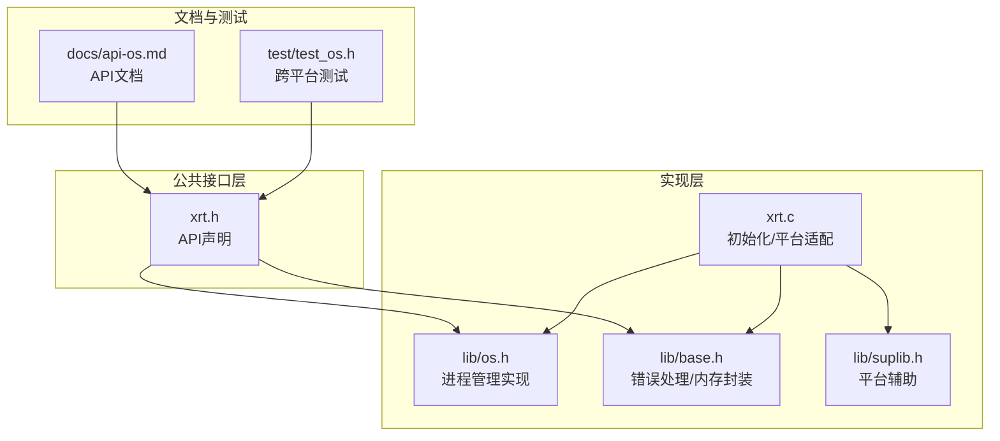
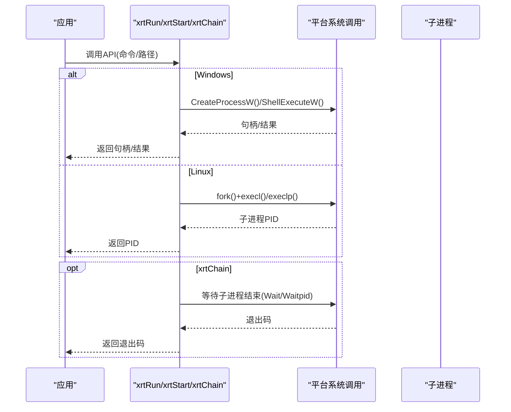
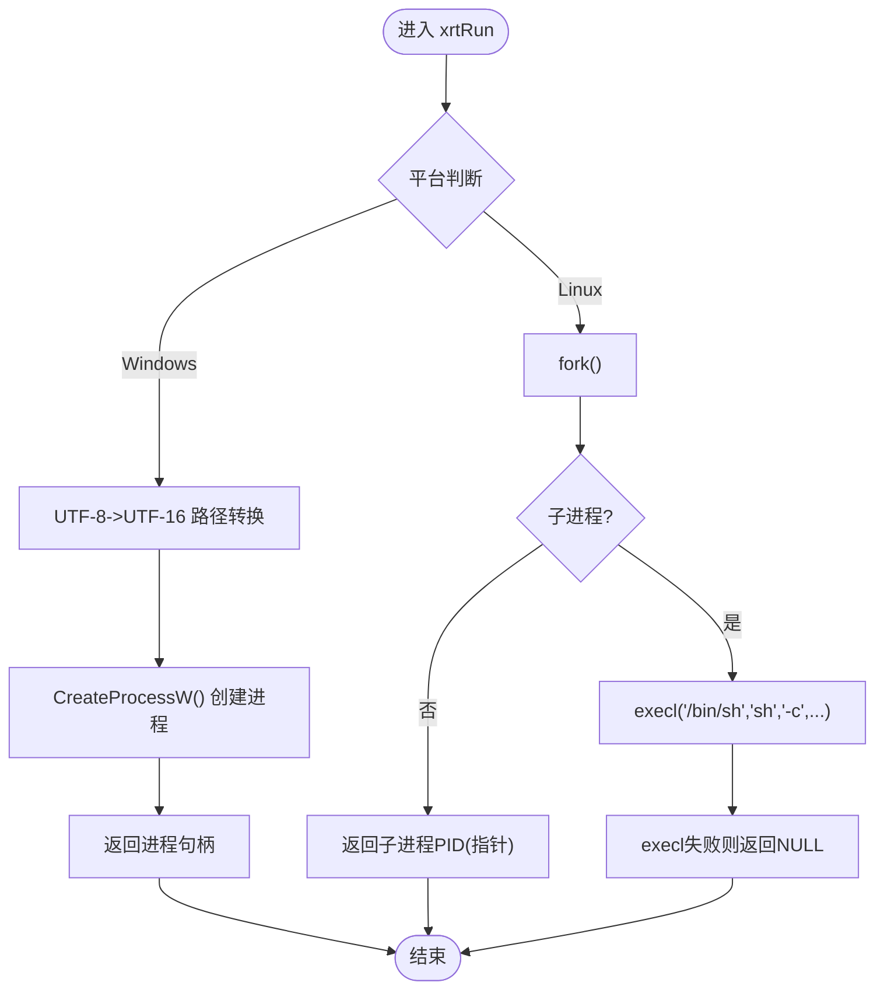
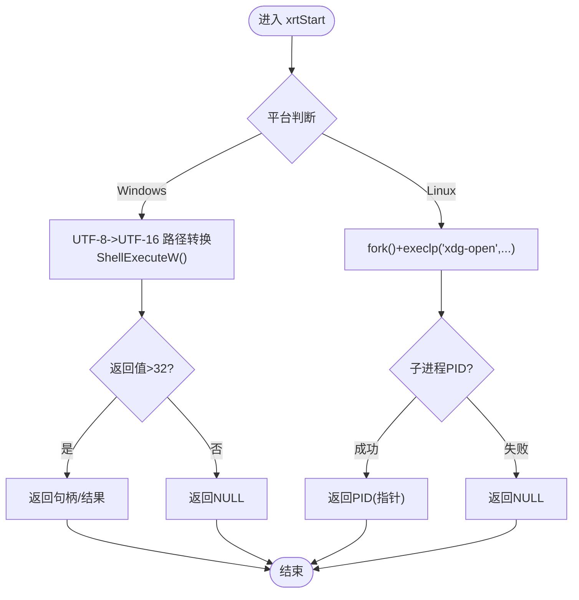
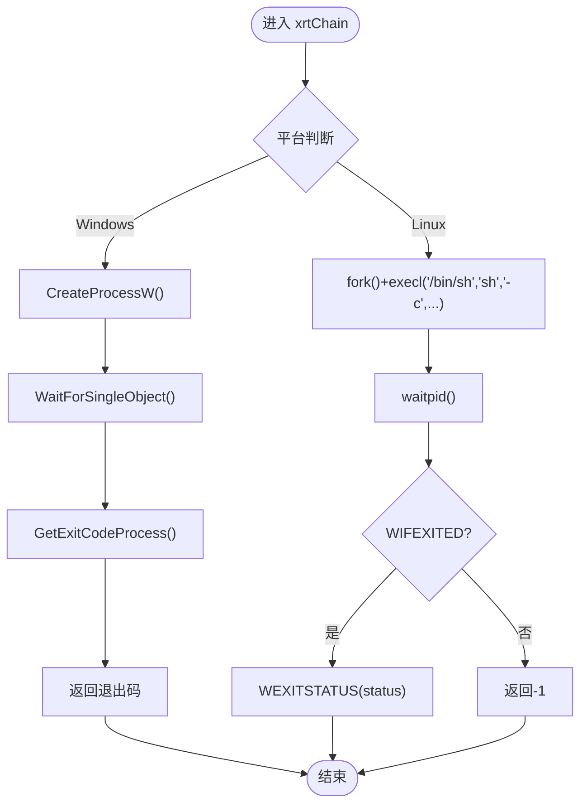
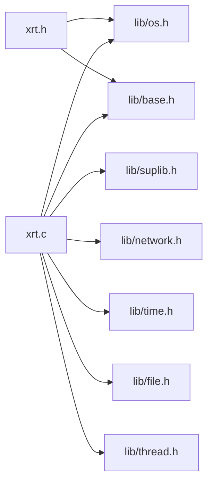

# 操作系统模块

<cite>
**本文档引用的文件**
- [lib/os.h](file://lib/os.h)
- [xrt.h](file://xrt.h)
- [xrt.c](file://xrt.c)
- [test/test_os.h](file://test/test_os.h)
- [docs/api-os.md](file://docs/api-os.md)
- [lib/base.h](file://lib/base.h)
- [lib/suplib.h](file://lib/suplib.h)
</cite>

## 目录
1. [简介](#简介)
2. [项目结构](#项目结构)
3. [核心组件](#核心组件)
4. [架构总览](#架构总览)
5. [详细组件分析](#详细组件分析)
6. [依赖关系分析](#依赖关系分析)
7. [性能考量](#性能考量)
8. [故障排查指南](#故障排查指南)
9. [结论](#结论)
10. [附录](#附录)

## 简介
本文件面向XRT操作系统模块，聚焦进程管理能力，系统阐述以下API的实现细节与跨平台抽象：
- xrtRun()：异步运行程序
- xrtStart()：打开文件或URL（跨平台）
- xrtChain()：运行并等待程序结束（同步）

同时，文档深入解释Windows平台使用CreateProcessW()/ShellExecuteW()与Linux平台使用fork()/execl()/waitpid()的实现差异，总结系统调用封装的设计理念、错误处理策略与平台兼容性处理，并提供使用示例与最佳实践，涵盖参数传递、权限控制与资源管理。

## 项目结构
XRT采用“头文件声明 + 实现文件 + 文档 + 测试”的组织方式。操作系统模块位于lib/os.h中，对外通过xrt.h暴露API；xrt.c负责初始化与平台适配；docs/api-os.md提供详尽的API说明与示例；test/test_os.h展示跨平台测试用例。

图表来源
- [xrt.h](file://xrt.h#L291-L301)
- [lib/os.h](file://lib/os.h#L1-L90)
- [xrt.c](file://xrt.c#L54-L84)
- [docs/api-os.md](file://docs/api-os.md#L1-L16)
- [test/test_os.h](file://test/test_os.h#L1-L52)

章节来源
- [xrt.h](file://xrt.h#L291-L301)
- [lib/os.h](file://lib/os.h#L1-L90)
- [xrt.c](file://xrt.c#L54-L84)
- [docs/api-os.md](file://docs/api-os.md#L1-L16)
- [test/test_os.h](file://test/test_os.h#L1-L52)

## 核心组件
- 进程管理API族：xrtRun(), xrtStart(), xrtChain()
- 跨平台抽象：通过条件编译在Windows与Linux/macOS之间切换底层系统调用
- 错误处理：统一通过xCore.LastError记录错误，支持回调通知
- 平台适配：Windows使用Win32 API，Linux使用POSIX API

章节来源
- [lib/os.h](file://lib/os.h#L4-L90)
- [xrt.h](file://xrt.h#L291-L301)
- [lib/base.h](file://lib/base.h#L88-L132)

## 架构总览
XRT在初始化阶段设置全局数据结构xCore，包含内存分配器、错误回调、应用路径等；进程管理API在lib/os.h中实现，内部根据平台选择不同的系统调用路径，并在Linux上通过waitpid()统一返回退出码语义。

图表来源
- [lib/os.h](file://lib/os.h#L4-L90)
- [xrt.c](file://xrt.c#L88-L186)

章节来源
- [lib/os.h](file://lib/os.h#L4-L90)
- [xrt.c](file://xrt.c#L88-L186)

## 详细组件分析

### xrtRun()：异步运行程序
- 功能：启动外部程序或命令，立即返回句柄/PID，不等待结束
- Windows实现要点：
  - 将UTF-8路径转换为UTF-16
  - 使用CreateProcessW()创建进程，返回进程句柄
- Linux实现要点：
  - fork()创建子进程，子进程中execl("/bin/sh","sh","-c",...)执行命令
  - 父进程返回子进程PID（转换为指针）
- 返回值：
  - Windows：进程句柄
  - Linux：pid_t转换为指针

图表来源
- [lib/os.h](file://lib/os.h#L4-L28)

章节来源
- [lib/os.h](file://lib/os.h#L4-L28)
- [docs/api-os.md](file://docs/api-os.md#L19-L79)

### xrtStart()：打开文件或URL（跨平台）
- 功能：使用系统默认程序打开文件/URL，跨平台统一入口
- Windows实现要点：
  - 将UTF-8路径转换为UTF-16
  - 使用ShellExecuteW()打开，返回值>32视为成功
- Linux实现要点：
  - fork()+execlp("xdg-open",...)，返回子进程PID或NULL
- 注意事项：
  - Linux需安装xdg-utils包（多数发行版默认包含）
  - Windows支持mailto:, file://, http://, https://等协议

图表来源
- [lib/os.h](file://lib/os.h#L32-L51)

章节来源
- [lib/os.h](file://lib/os.h#L32-L51)
- [docs/api-os.md](file://docs/api-os.md#L82-L152)

### xrtChain()：运行并等待程序结束（同步）
- 功能：同步执行命令/程序，阻塞当前线程直到结束，返回退出码
- Windows实现要点：
  - CreateProcessW()创建进程
  - WaitForSingleObject()等待进程结束
  - GetExitCodeProcess()获取退出码
- Linux实现要点：
  - fork()+execl("/bin/sh","sh","-c",...)
  - waitpid()等待子进程结束
  - 统一返回WEXITSTATUS(status)，异常退出返回-1

图表来源
- [lib/os.h](file://lib/os.h#L55-L90)

章节来源
- [lib/os.h](file://lib/os.h#L55-L90)
- [docs/api-os.md](file://docs/api-os.md#L155-L222)

### 跨平台抽象机制与系统调用封装
- 条件编译：通过#if defined(_WIN32) || defined(_WIN64)在Windows与Linux/macOS之间切换
- Windows侧：
  - 使用Win32 API：CreateProcessW()、ShellExecuteW()、WaitForSingleObject()、GetExitCodeProcess()
  - 需要包含windows.h、shellapi.h等头文件，并链接相应库
- Linux侧：
  - 使用POSIX API：fork()、execl()/execlp()、waitpid()、sys/wait.h
  - 通过/bin/sh执行命令字符串
- 设计理念：
  - 对外统一API，内部按平台选择最优实现
  - 在Linux上统一退出码语义，屏蔽平台差异
  - 资源管理：Windows侧由调用方负责关闭句柄；Linux侧waitpid()回收子进程

章节来源
- [lib/os.h](file://lib/os.h#L7-L27)
- [lib/os.h](file://lib/os.h#L35-L50)
- [lib/os.h](file://lib/os.h#L58-L89)
- [xrt.c](file://xrt.c#L8-L38)

### 错误处理策略与平台兼容性
- 错误处理：
  - 统一通过xrtSetError()/xrtSetErrorU16()/xrtSetErrorU32()设置xCore.LastError
  - 支持自定义错误回调xCore.OnError
  - Linux在execl失败时返回NULL，便于上层判断
- 平台兼容性：
  - Windows：UTF-8路径转换为UTF-16，确保宽字符API正确处理
  - Linux：通过/bin/sh执行命令字符串，保证跨Shell兼容
  - xrtStart在Linux上依赖xdg-open，需确保环境可用

章节来源
- [lib/base.h](file://lib/base.h#L88-L132)
- [lib/os.h](file://lib/os.h#L12-L14)
- [lib/os.h](file://lib/os.h#L36-L38)
- [lib/os.h](file://lib/os.h#L72-L75)

### 使用示例与最佳实践
- 示例参考：
  - xrtRun：启动后台任务、启动带参数程序
  - xrtStart：打开文件/URL、使用默认程序
  - xrtChain：执行系统命令并等待结果
- 最佳实践：
  - 命令参数转义：Windows使用双引号，Linux使用单引号或更复杂转义
  - 检查执行结果：跨平台统一以返回0为成功
  - 异步执行管理：保存句柄/PID，必要时等待结束并释放资源
  - 安全注意事项：避免命令注入，校验输入与可执行权限

章节来源
- [docs/api-os.md](file://docs/api-os.md#L42-L80)
- [docs/api-os.md](file://docs/api-os.md#L109-L152)
- [docs/api-os.md](file://docs/api-os.md#L178-L222)
- [docs/api-os.md](file://docs/api-os.md#L472-L545)
- [docs/api-os.md](file://docs/api-os.md#L615-L744)

## 依赖关系分析
- 头文件依赖：
  - xrt.h声明API与基础类型
  - lib/os.h实现进程管理API
  - lib/base.h提供错误处理与内存封装
  - xrt.c引入各子库并完成初始化
- 平台依赖：
  - Windows：winsock2.h、windows.h、shellapi.h、iphlpapi
  - Linux：fcntl.h、sys/stat.h、dirent.h、sys/wait.h、errno.h

图表来源
- [xrt.h](file://xrt.h#L291-L301)
- [xrt.c](file://xrt.c#L54-L84)

章节来源
- [xrt.h](file://xrt.h#L291-L301)
- [xrt.c](file://xrt.c#L54-L84)

## 性能考量
- 异步启动：xrtRun()立即返回，适合后台任务与并发场景
- 同步等待：xrtChain()阻塞当前线程，适合需要顺序控制的任务
- 资源占用：Linux在fork/exec后应尽快waitpid()回收子进程，避免僵尸进程
- 路径转换：Windows侧UTF-8到UTF-16转换带来额外开销，建议复用或减少频繁转换

## 故障排查指南
- 常见问题
  - 程序路径问题：优先使用绝对路径，避免相对路径导致找不到可执行文件
  - 工作目录：子进程继承父进程工作目录，必要时在命令中显式cd
  - 权限控制：Linux需确保目标文件具备可执行权限
- 安全注意事项
  - 命令注入防护：严格校验与转义用户输入
  - 路径验证：在Windows检查扩展名，在Linux检查X_OK权限
- 错误定位
  - 通过xCore.LastError获取最近错误描述
  - 在Linux上execl失败返回NULL，可用于快速判断

章节来源
- [docs/api-os.md](file://docs/api-os.md#L748-L777)
- [docs/api-os.md](file://docs/api-os.md#L615-L744)
- [lib/base.h](file://lib/base.h#L88-L132)

## 结论
XRT操作系统模块通过清晰的API设计与严格的跨平台抽象，实现了进程管理能力的统一入口。Windows与Linux/macOS分别采用最合适的系统调用，配合统一的错误处理与资源管理策略，既保证了易用性，也兼顾了性能与安全性。建议在实际工程中遵循参数转义、权限校验与资源回收的最佳实践，以获得稳定可靠的跨平台体验。

## 附录
- 测试用例参考：test/test_os.h展示了Windows与Linux下的典型用法
- 文档参考：docs/api-os.md提供了完整的API说明与示例

章节来源
- [test/test_os.h](file://test/test_os.h#L1-L52)
- [docs/api-os.md](file://docs/api-os.md#L1-L859)