# 文件操作模块

<cite>
**本文档引用的文件**
- [lib/file.h](file://lib/file.h)
- [test/test_file.h](file://test/test_file.h)
- [docs/api-file.md](file://docs/api-file.md)
- [docs/api-path.md](file://docs/api-path.md)
- [docs/api-os.md](file://docs/api-os.md)
- [lib/path.h](file://lib/path.h)
- [lib/base.h](file://lib/base.h)
- [xrt.h](file://xrt.h)
</cite>

## 目录
1. [简介](#简介)
2. [项目结构](#项目结构)
3. [核心组件](#核心组件)
4. [架构概览](#架构概览)
5. [详细组件分析](#详细组件分析)
6. [依赖关系分析](#依赖关系分析)
7. [性能考虑](#性能考虑)
8. [故障排除指南](#故障排除指南)
9. [结论](#结论)
10. [附录](#附录)

## 简介
XRT文件操作模块是一个跨平台的文件系统抽象层，提供了统一的文件读写接口，支持文本文件和二进制文件的操作。该模块实现了完整的文件生命周期管理，包括文件打开、读写、定位、关闭以及目录管理功能。模块特别注重字符编码处理，支持多种编码格式的自动检测和转换，包括UTF-8、UTF-16、UTF-32以及BOM标记处理。

## 项目结构
XRT文件操作模块位于项目的lib目录下，主要实现文件为file.h，配套的文档在docs目录中，测试代码在test目录中。

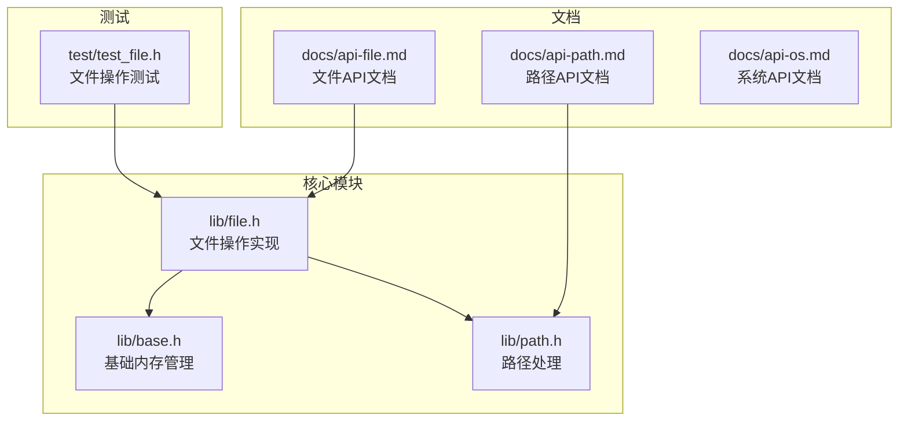

**图表来源**
- [lib/file.h](file://lib/file.h#L1-L800)
- [lib/base.h](file://lib/base.h#L1-L132)
- [lib/path.h](file://lib/path.h#L1-L190)

**章节来源**
- [lib/file.h](file://lib/file.h#L1-L800)
- [docs/api-file.md](file://docs/api-file.md#L1-L200)

## 核心组件
文件操作模块的核心由以下组件构成：

### 文件对象结构
模块定义了统一的文件对象结构，支持Windows和Unix系统的不同实现：
- Windows平台使用文件句柄(HANDLE)
- Unix/Linux平台使用文件描述符(int)
- 统一包含字符集和BOM信息

### 编码处理系统
- 支持UTF-8、UTF-16、UTF-32等多种编码格式
- 自动BOM检测和处理
- 编码自动识别功能
- 跨编码转换机制

### 跨平台抽象
- 统一的API接口设计
- 平台特定的实现细节封装
- 条件编译支持多平台

**章节来源**
- [lib/file.h](file://lib/file.h#L38-L61)
- [docs/api-file.md](file://docs/api-file.md#L36-L62)

## 架构概览
文件操作模块采用分层架构设计，实现了清晰的抽象层次：

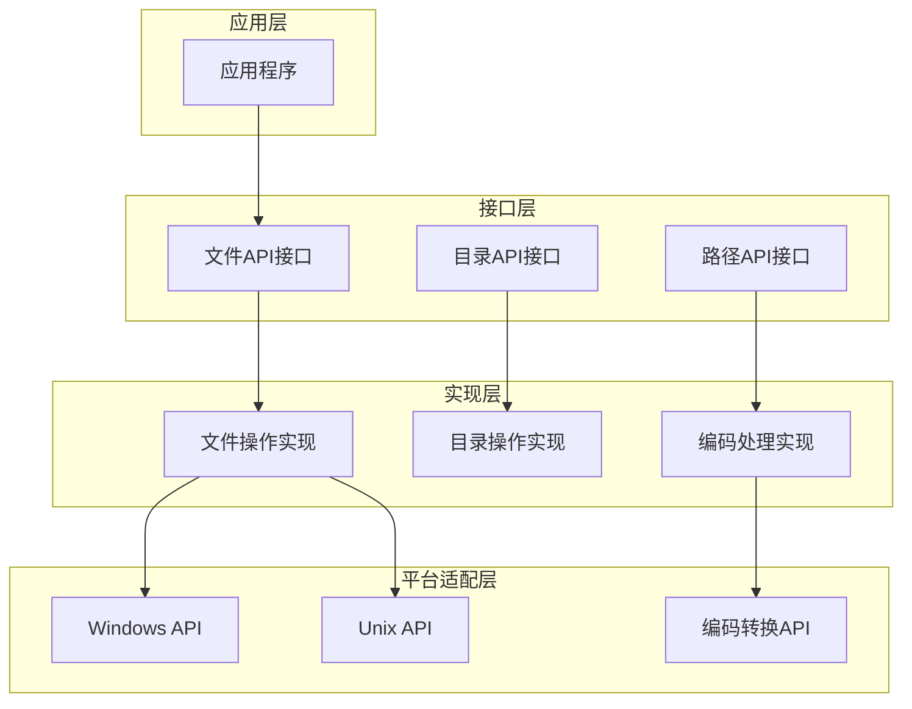

**图表来源**
- [lib/file.h](file://lib/file.h#L17-L278)
- [lib/file.h](file://lib/file.h#L1605-L1743)

## 详细组件分析

### 文件读写组件

#### 文本文件读取
文本文件读取功能提供了灵活的字符集处理机制：

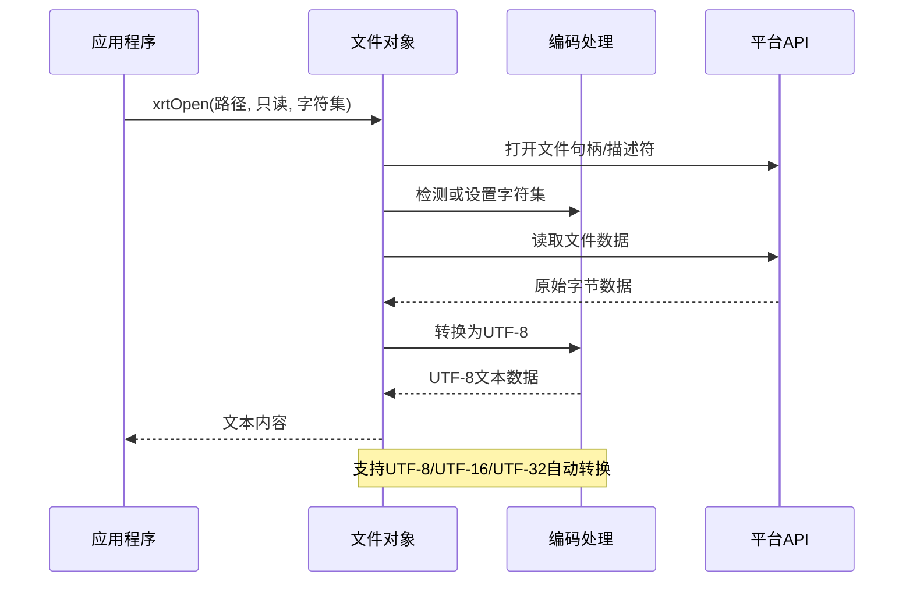

**图表来源**
- [lib/file.h](file://lib/file.h#L476-L559)
- [lib/file.h](file://lib/file.h#L496-L506)

#### 二进制文件读取
二进制文件读取保持原始数据格式，不进行字符集转换：

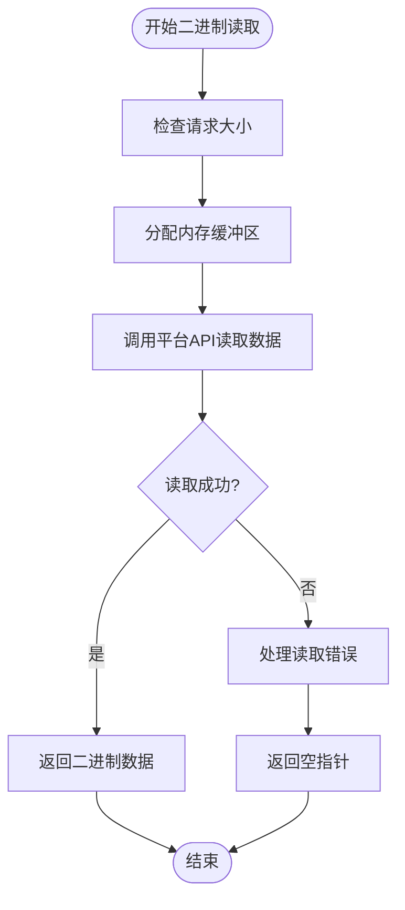

**图表来源**
- [lib/file.h](file://lib/file.h#L638-L691)

#### 文件写入功能
文件写入功能支持UTF-8到目标编码的自动转换：

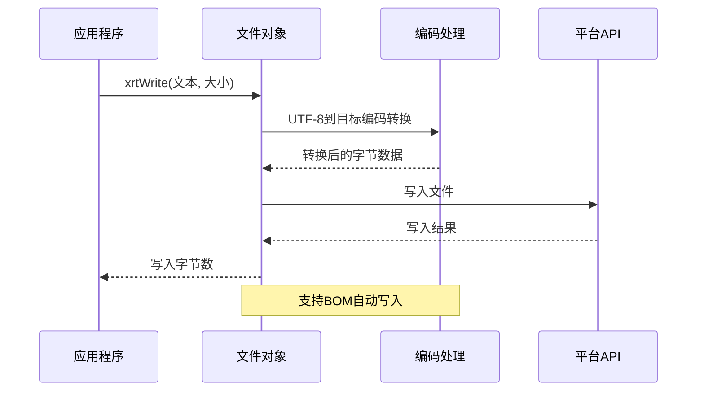

**图表来源**
- [lib/file.h](file://lib/file.h#L564-L633)
- [lib/file.h](file://lib/file.h#L576-L586)

**章节来源**
- [lib/file.h](file://lib/file.h#L476-L633)
- [docs/api-file.md](file://docs/api-file.md#L338-L520)

### 目录管理组件

#### 目录扫描功能
目录扫描提供了递归遍历能力，支持自定义回调处理：

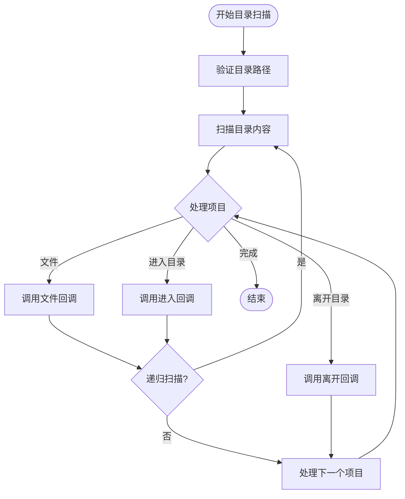

**图表来源**
- [lib/file.h](file://lib/file.h#L1691-L1743)

#### 目录复制移动
目录复制和移动功能支持完整的文件树操作：

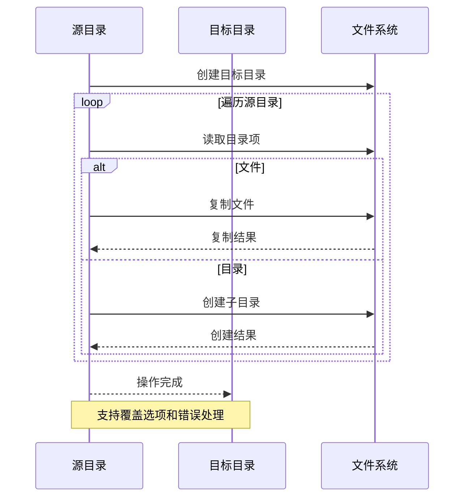

**图表来源**
- [lib/file.h](file://lib/file.h#L1605-L1640)
- [lib/file.h](file://lib/file.h#L1645-L1686)

**章节来源**
- [lib/file.h](file://lib/file.h#L1535-L1743)
- [docs/api-file.md](file://docs/api-file.md#L731-L800)

### 文件属性处理组件

#### 文件信息查询
文件属性查询提供了全面的文件元数据访问：

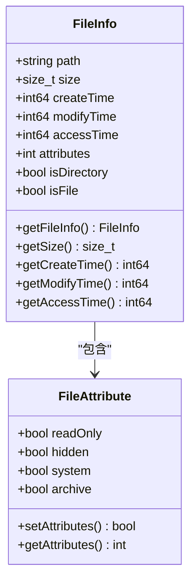

**图表来源**
- [xrt.h](file://xrt.h#L718-L750)

#### 路径处理功能
路径处理功能提供了跨平台的路径操作：

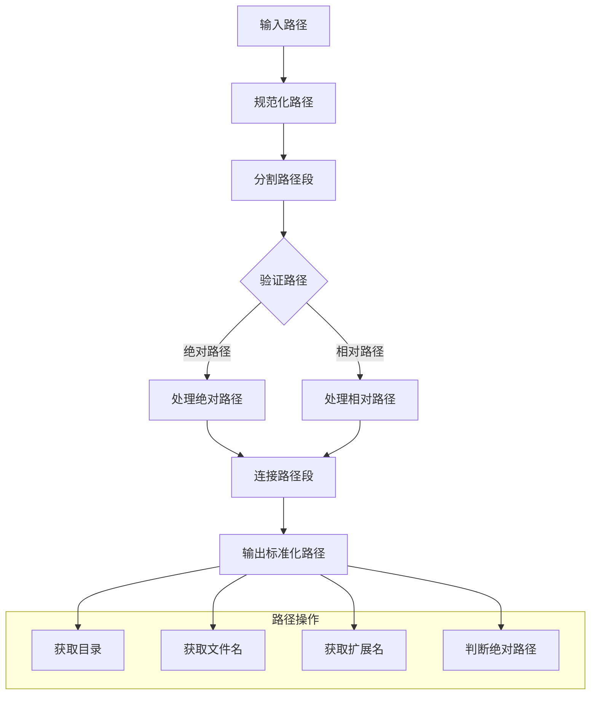

**图表来源**
- [lib/path.h](file://lib/path.h#L142-L190)

**章节来源**
- [lib/file.h](file://lib/file.h#L1500-L1531)
- [lib/path.h](file://lib/path.h#L1-L190)

### 跨平台抽象组件

#### 平台适配层
模块通过条件编译实现跨平台兼容：

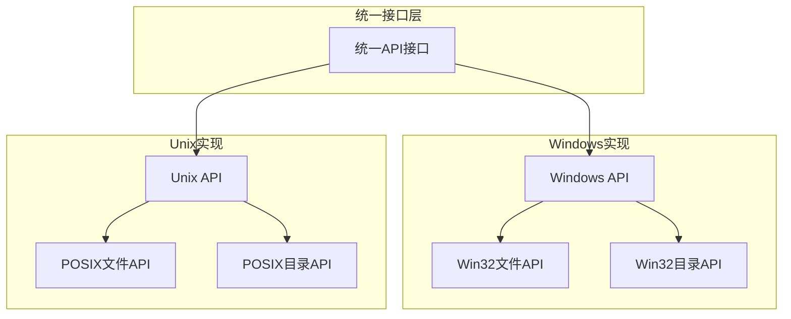

**图表来源**
- [lib/file.h](file://lib/file.h#L19-L278)
- [lib/file.h](file://lib/file.h#L1507-L1531)

#### 字符编码转换
编码转换系统支持多种编码格式的自动检测和转换：

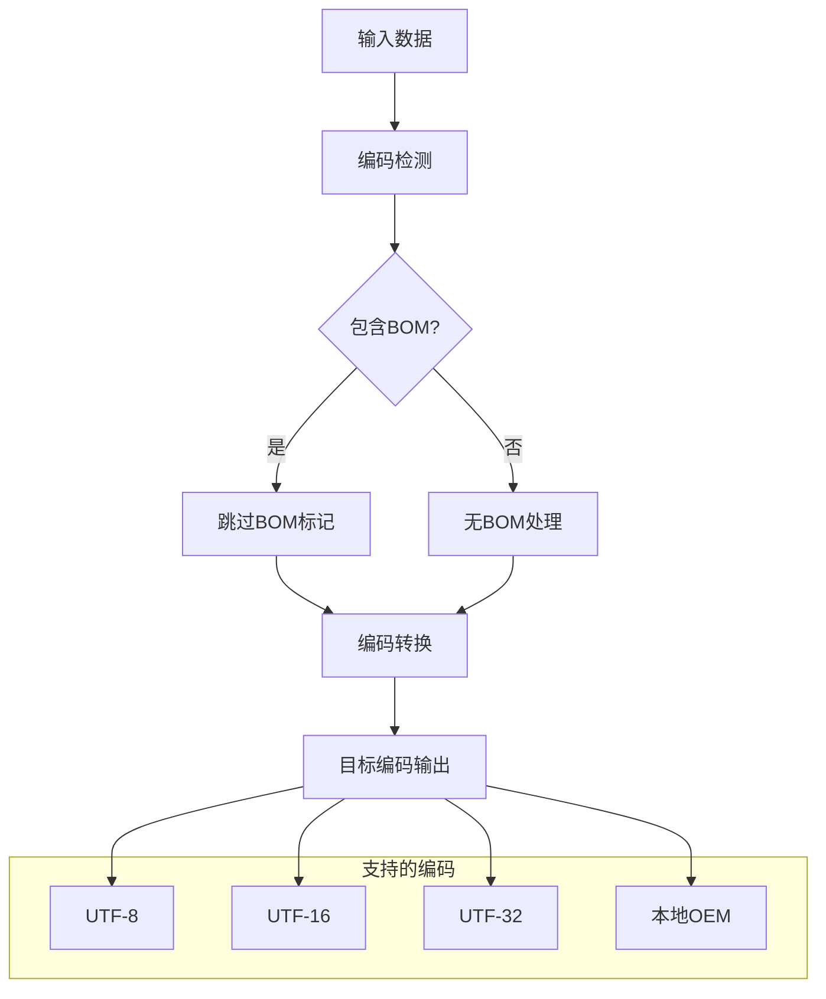

**图表来源**
- [docs/api-charset.md](file://docs/api-charset.md#L20-L50)

**章节来源**
- [lib/file.h](file://lib/file.h#L41-L147)
- [docs/api-charset.md](file://docs/api-charset.md#L1-L100)

## 依赖关系分析

### 内部依赖关系
文件操作模块的内部依赖关系如下：

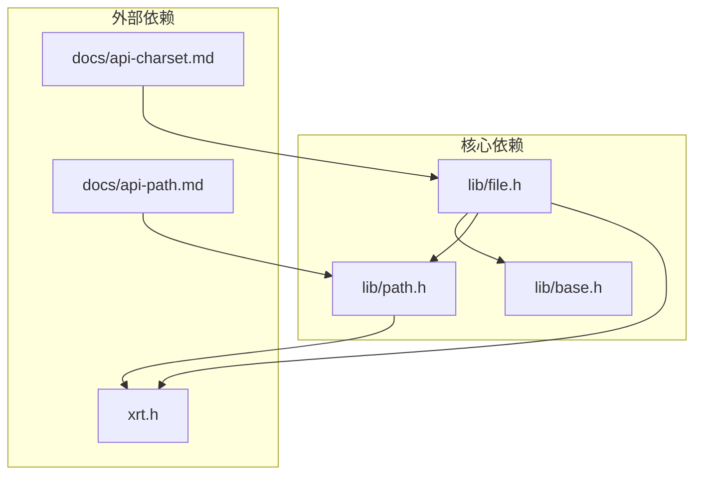

**图表来源**
- [lib/file.h](file://lib/file.h#L1-L50)
- [lib/base.h](file://lib/base.h#L1-L50)
- [lib/path.h](file://lib/path.h#L1-L50)

### 外部依赖分析
模块对外部依赖的处理：

| 依赖类型 | 依赖内容 | 用途 | 处理方式 |
|---------|---------|------|----------|
| 平台API | Windows API | 文件系统操作 | 条件编译 |
| 平台API | POSIX API | 文件系统操作 | 条件编译 |
| 编码库 | 字符集转换 | 编码处理 | 内置实现 |
| 路径库 | 路径解析 | 路径处理 | 内置实现 |

**章节来源**
- [lib/file.h](file://lib/file.h#L1-L100)
- [lib/base.h](file://lib/base.h#L1-L100)

## 性能考虑

### 内存管理优化
- 使用统一的内存分配接口，避免内存泄漏
- 提供临时内存池，减少频繁分配开销
- 支持批量内存释放机制

### I/O操作优化
- 文件读写采用缓冲机制，减少系统调用次数
- 支持二进制模式，避免不必要的编码转换
- 提供批量操作接口，提高处理效率

### 编码处理优化
- 编码检测限制最大读取字节数(64KB)，平衡准确性和性能
- 支持BOM快速跳过，避免重复检测
- 缓存字符集信息，减少重复计算

### 平台特定优化
- Windows平台使用异步I/O特性
- Unix平台使用sendfile等高效系统调用
- 目录扫描支持并发处理

## 故障排除指南

### 常见错误类型

#### 文件操作错误
- 文件打开失败：检查文件路径和权限
- 读写权限不足：确认文件属性和访问权限
- 编码转换错误：验证BOM标记和字符集设置

#### 目录操作错误
- 目录不存在：使用创建函数预先创建
- 权限不足：检查父目录权限
- 路径格式错误：使用路径处理函数

#### 编码处理错误
- BOM检测失败：手动指定字符集
- 编码转换异常：检查输入数据完整性
- 内存分配失败：释放内存或增加系统内存

### 调试建议
1. 启用详细错误报告
2. 使用调试版本进行测试
3. 检查平台兼容性
4. 验证输入数据格式

**章节来源**
- [lib/file.h](file://lib/file.h#L4-L12)
- [lib/base.h](file://lib/base.h#L88-L132)

## 结论
XRT文件操作模块提供了完整的跨平台文件系统抽象，具有以下特点：

### 优势
- 统一的API接口，简化开发复杂度
- 完善的编码处理机制，支持多种字符集
- 跨平台兼容性，支持Windows和Unix系统
- 丰富的功能集合，涵盖文件系统所有基本操作

### 应用场景
- 跨平台应用程序开发
- 多语言文本处理
- 文件批量处理任务
- 跨平台数据迁移

### 发展方向
- 进一步优化性能表现
- 增强错误处理和恢复能力
- 扩展更多文件系统特性支持
- 改进内存使用效率

## 附录

### API参考
模块提供完整的API接口，包括文件操作、目录管理、路径处理等功能。

### 最佳实践
- 始终检查函数返回值
- 正确处理内存分配和释放
- 使用适当的字符集设置
- 遵循平台特定的路径规范

### 示例代码
模块包含完整的测试代码，展示了各种功能的使用方法和最佳实践。

**章节来源**
- [test/test_file.h](file://test/test_file.h#L1-L255)
- [docs/api-file.md](file://docs/api-file.md#L1467-L1497)