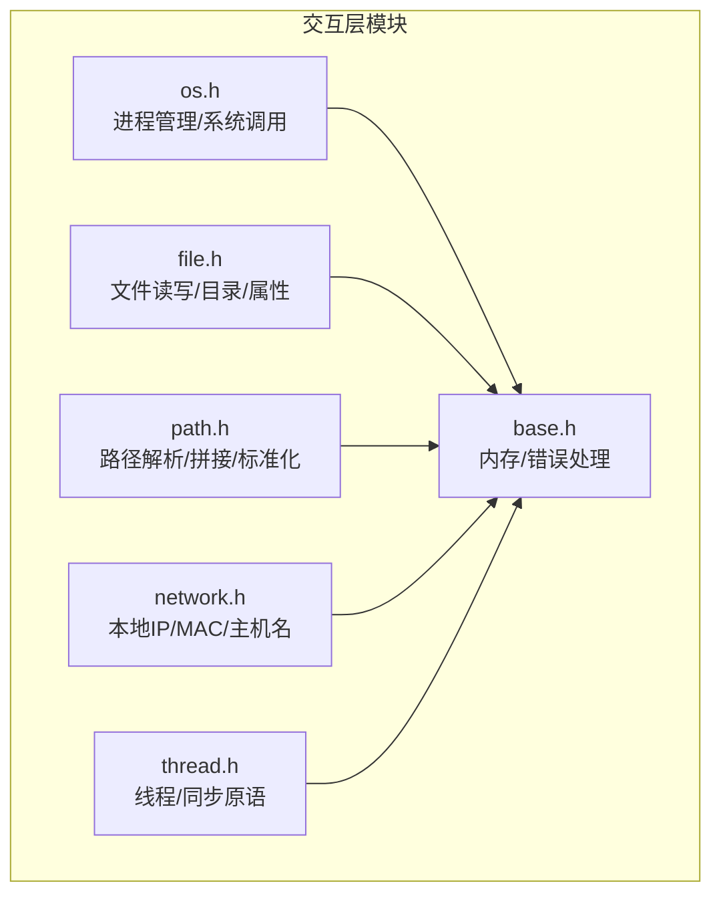
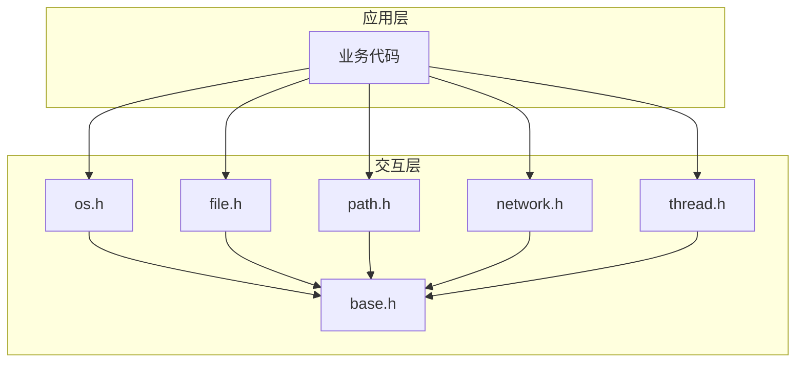
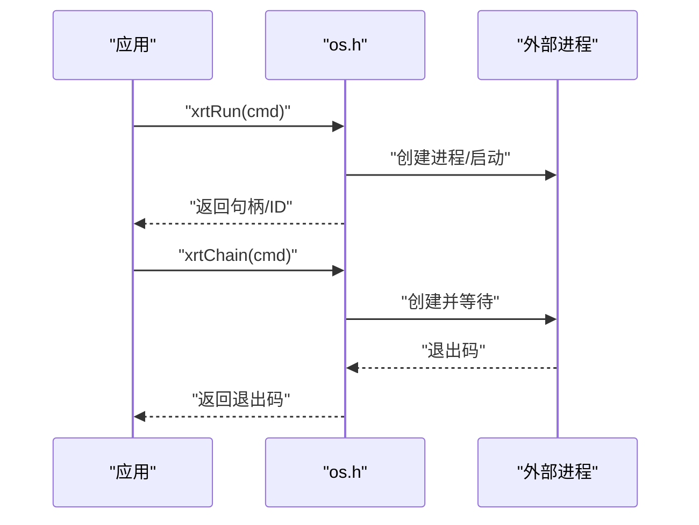
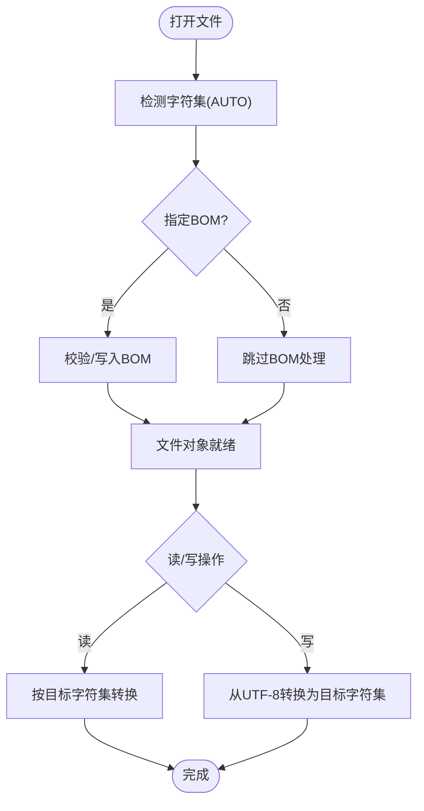
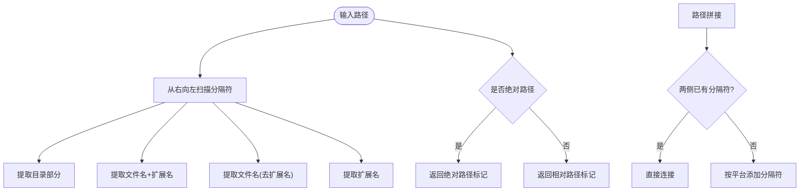
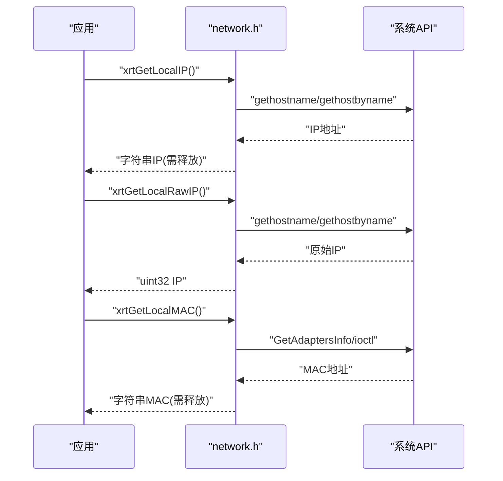
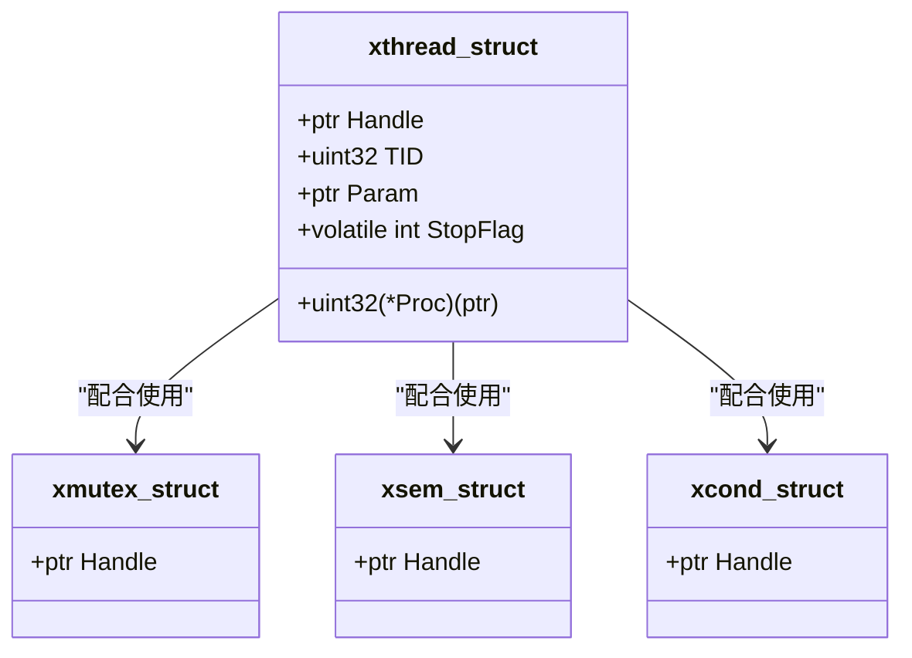
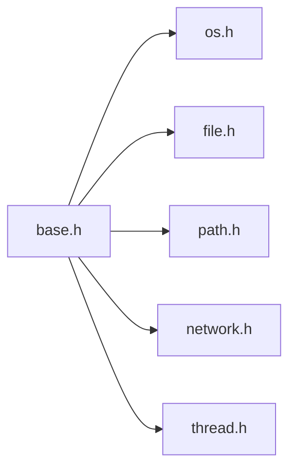

# 系统交互层

<cite>
**本文引用的文件**
- [lib/os.h](file://lib/os.h)
- [lib/file.h](file://lib/file.h)
- [lib/path.h](file://lib/path.h)
- [lib/network.h](file://lib/network.h)
- [lib/thread.h](file://lib/thread.h)
- [lib/base.h](file://lib/base.h)
- [docs/api-os.md](file://docs/api-os.md)
- [docs/api-file.md](file://docs/api-file.md)
- [docs/api-path.md](file://docs/api-path.md)
- [docs/api-network.md](file://docs/api-network.md)
- [docs/api-thread.md](file://docs/api-thread.md)
- [test/test_os.h](file://test/test_os.h)
- [test/test_file.h](file://test/test_file.h)
- [test/test_path.h](file://test/test_path.h)
- [test/test_network.h](file://test/test_network.h)
- [test/test_thread.h](file://test/test_thread.h)
</cite>

## 目录
1. [简介](#简介)
2. [项目结构](#项目结构)
3. [核心组件](#核心组件)
4. [架构总览](#架构总览)
5. [详细组件分析](#详细组件分析)
6. [依赖关系分析](#依赖关系分析)
7. [性能考量](#性能考量)
8. [故障排查指南](#故障排查指南)
9. [结论](#结论)
10. [附录](#附录)

## 简介
本文件面向XRT系统交互层模块，围绕以下五大模块展开：操作系统模块(os)、文件操作模块(file)、路径处理模块(path)、网络信息模块(network)、线程管理模块(thread)。文档重点阐述：
- 各模块的API设计与职责边界
- 跨平台抽象与平台差异处理
- 性能优化策略与最佳实践
- 常见使用场景与错误处理

## 项目结构
交互层模块位于lib目录下，配套文档位于docs目录，测试样例位于test目录。核心文件如下：
- os.h：进程管理、系统调用封装、跨平台抽象
- file.h：文件读写、目录管理、文件属性处理、编码与BOM处理
- path.h：路径解析、路径拼接、路径标准化
- network.h：本机网络信息获取（IP/MAC/主机名）
- thread.h：线程创建/等待/停止、互斥体/信号量/条件变量
- base.h：基础内存与错误处理设施（被各模块广泛使用）

**图表来源**
- [lib/os.h](file://lib/os.h#L1-L90)
- [lib/file.h](file://lib/file.h#L1-L1743)
- [lib/path.h](file://lib/path.h#L1-L190)
- [lib/network.h](file://lib/network.h#L1-L214)
- [lib/thread.h](file://lib/thread.h#L1-L749)
- [lib/base.h](file://lib/base.h#L1-L132)

**章节来源**
- [lib/os.h](file://lib/os.h#L1-L90)
- [lib/file.h](file://lib/file.h#L1-L1743)
- [lib/path.h](file://lib/path.h#L1-L190)
- [lib/network.h](file://lib/network.h#L1-L214)
- [lib/thread.h](file://lib/thread.h#L1-L749)
- [lib/base.h](file://lib/base.h#L1-L132)

## 核心组件
- 进程与系统调用：跨平台封装外部程序运行、打开文件/URL、同步等待退出码
- 文件系统：统一的文件对象模型，支持多种字符集与BOM处理，提供便捷的读写与快捷函数
- 路径处理：跨平台路径解析、拼接与判断，支持随机路径生成
- 网络信息：获取本机IP、MAC、主机名，支持原始IP格式
- 线程与同步：线程生命周期管理与停止信号、互斥体、信号量、条件变量

**章节来源**
- [docs/api-os.md](file://docs/api-os.md#L1-L859)
- [docs/api-file.md](file://docs/api-file.md#L1-L1552)
- [docs/api-path.md](file://docs/api-path.md#L1-L621)
- [docs/api-network.md](file://docs/api-network.md#L1-L423)
- [docs/api-thread.md](file://docs/api-thread.md#L1-L779)

## 架构总览
交互层采用“跨平台抽象 + 统一API + 平台适配”的设计。各模块均通过宏条件编译实现Windows/Linux差异处理，并通过base.h提供的内存与错误处理设施保证一致性。

**图表来源**
- [lib/os.h](file://lib/os.h#L1-L90)
- [lib/file.h](file://lib/file.h#L1-L1743)
- [lib/path.h](file://lib/path.h#L1-L190)
- [lib/network.h](file://lib/network.h#L1-L214)
- [lib/thread.h](file://lib/thread.h#L1-L749)
- [lib/base.h](file://lib/base.h#L1-L132)

## 详细组件分析

### 操作系统模块(os)
- 职责
  - 异步运行外部程序（xrtRun）
  - 使用系统默认程序打开文件或URL（xrtStart）
  - 同步运行并等待退出（xrtChain）
- 跨平台差异
  - Windows：使用CreateProcess/ShellExecute/WaitForSingleObject
  - Linux/macOS：使用fork+exec系列与waitpid/xdg-open
- API设计要点
  - 返回值与平台一致：句柄/ID统一为指针类型
  - 命令参数需注意转义与安全性
- 使用场景
  - 启动外部工具、执行系统命令、打开文档/网页

**图表来源**
- [lib/os.h](file://lib/os.h#L5-L90)
- [docs/api-os.md](file://docs/api-os.md#L19-L221)

**章节来源**
- [lib/os.h](file://lib/os.h#L1-L90)
- [docs/api-os.md](file://docs/api-os.md#L1-L859)
- [test/test_os.h](file://test/test_os.h#L1-L52)

### 文件操作模块(file)
- 职责
  - 文件打开/关闭、定位、读写、截断
  - 快捷读写（一次性读取/写入）
  - 目录扫描、复制/移动/删除、属性查询
- 字符集与BOM
  - 支持AUTO/UTF-8/UTF-16/UTF-32及BE/LE/BOM组合
  - 自动检测与写入BOM，避免乱码
- API设计要点
  - 统一的xfile对象封装平台差异
  - 读写接口自动进行字符集转换
  - 二进制读取/写入接口保持原样
- 性能与可靠性
  - 读取时最多探测64KB以平衡准确性和速度
  - 写入UTF-8到非UTF-8时进行转换，减少跨平台字符问题

**图表来源**
- [lib/file.h](file://lib/file.h#L17-L277)
- [docs/api-file.md](file://docs/api-file.md#L66-L162)

**章节来源**
- [lib/file.h](file://lib/file.h#L1-L1743)
- [docs/api-file.md](file://docs/api-file.md#L1-L1552)
- [test/test_file.h](file://test/test_file.h#L1-L255)

### 路径处理模块(path)
- 职责
  - 提取文件名/扩展名/目录
  - 绝对路径判断
  - 路径拼接（自动处理分隔符）
  - 随机路径生成（模板化）
- 跨平台
  - 同时支持/与\分隔符
  - 绝对路径判断兼容Windows的盘符与Unix的根路径
- 使用建议
  - 优先使用xrtPathJoin进行路径拼接，避免手拼字符串
  - 对外暴露路径时使用xrtPathIsAbs进行合法性检查

**图表来源**
- [lib/path.h](file://lib/path.h#L5-L187)
- [docs/api-path.md](file://docs/api-path.md#L21-L363)

**章节来源**
- [lib/path.h](file://lib/path.h#L1-L190)
- [docs/api-path.md](file://docs/api-path.md#L1-L621)
- [test/test_path.h](file://test/test_path.h#L1-L19)

### 网络信息模块(network)
- 职责
  - 获取本机IP（字符串/原始32位整数）
  - 获取本机MAC地址
  - 获取本机主机名
- 跨平台
  - Windows：GetAdaptersInfo + gethostname
  - Linux：ioctl(SIOCGIFHWADDR)/gethostbyname + gethostname
- 注意事项
  - 多网卡环境可能返回非预期网卡
  - 网络未连接时可能返回回环地址或失败
  - 返回的字符串需释放，原始整数无需释放

**图表来源**
- [lib/network.h](file://lib/network.h#L5-L139)
- [docs/api-network.md](file://docs/api-network.md#L24-L171)

**章节来源**
- [lib/network.h](file://lib/network.h#L1-L214)
- [docs/api-network.md](file://docs/api-network.md#L1-L423)
- [test/test_network.h](file://test/test_network.h#L1-L17)

### 线程管理模块(thread)
- 职责
  - 线程创建/销毁/等待/停止信号
  - 互斥体、信号量、条件变量
- 跨平台
  - Windows：CRITICAL_SECTION/CONDITION_VARIABLE/Win32线程
  - POSIX：pthread/sem_t/条件变量
- 同步原语
  - 互斥体：锁定/尝试锁定/解锁
  - 信号量：等待/带超时等待/释放/多释放
  - 条件变量：等待/带超时等待/单播/广播
- 最佳实践
  - 推荐使用停止信号而非强制终止
  - 资源释放顺序：先等待线程结束，再销毁线程对象
  - Linux/macOS需链接pthread库

**图表来源**
- [lib/thread.h](file://lib/thread.h#L44-L86)
- [docs/api-thread.md](file://docs/api-thread.md#L42-L87)

**章节来源**
- [lib/thread.h](file://lib/thread.h#L1-L749)
- [docs/api-thread.md](file://docs/api-thread.md#L1-L779)
- [test/test_thread.h](file://test/test_thread.h#L1-L276)

## 依赖关系分析
- 模块内聚与耦合
  - 各模块相对独立，通过base.h的全局设施（内存分配、错误设置）进行松耦合
  - file/path/network/thread在各自领域内提供完整能力，避免跨域依赖
- 外部依赖
  - os：Windows API/Linux系统调用
  - file：Windows文件API/Linux文件系统调用
  - network：Windows网络API/Linux网络ioctl
  - thread：Windows线程API/POSIX线程库
- 潜在循环依赖
  - 未发现模块间直接循环依赖；若上层业务代码跨模块调用，应遵循单一职责原则

**图表来源**
- [lib/base.h](file://lib/base.h#L1-L132)
- [lib/os.h](file://lib/os.h#L1-L90)
- [lib/file.h](file://lib/file.h#L1-L1743)
- [lib/path.h](file://lib/path.h#L1-L190)
- [lib/network.h](file://lib/network.h#L1-L214)
- [lib/thread.h](file://lib/thread.h#L1-L749)

**章节来源**
- [lib/base.h](file://lib/base.h#L1-L132)
- [lib/os.h](file://lib/os.h#L1-L90)
- [lib/file.h](file://lib/file.h#L1-L1743)
- [lib/path.h](file://lib/path.h#L1-L190)
- [lib/network.h](file://lib/network.h#L1-L214)
- [lib/thread.h](file://lib/thread.h#L1-L749)

## 性能考量
- 文件I/O
  - 自动编码检测限制读取上限（约64KB），兼顾准确性与性能
  - 读写时进行字符集转换，建议在高频路径使用二进制接口或预转换
- 线程与同步
  - 互斥体/信号量/条件变量在不同平台实现差异较大，尽量使用统一接口
  - 条件变量等待建议使用带超时版本，避免无限等待
- 路径与网络
  - 路径拼接避免重复分配，优先使用可变参数接口
  - 网络信息获取可能受DNS/系统API影响，建议缓存必要结果

[本节为通用指导，无需具体文件引用]

## 故障排查指南
- 错误处理
  - 所有模块通过base.h设置错误信息，调用方可通过LastError获取
  - 字符串返回值需在使用后释放，原始类型无需释放
- 常见问题
  - 文件BOM不匹配：确认目标字符集与BOM标志是否一致
  - 路径分隔符：优先使用xrtPathJoin，避免硬编码分隔符
  - 线程强制终止：可能导致资源泄漏，优先使用停止信号
  - 多网卡IP：可能返回非预期网卡，必要时枚举设备
- 定位方法
  - 使用测试用例对照行为
  - 在关键路径打印LastError与返回值

**章节来源**
- [lib/base.h](file://lib/base.h#L88-L132)
- [docs/api-file.md](file://docs/api-file.md#L1-L1552)
- [docs/api-network.md](file://docs/api-network.md#L326-L407)
- [docs/api-thread.md](file://docs/api-thread.md#L691-L779)

## 结论
XRT交互层通过清晰的模块划分与跨平台抽象，提供了稳定、易用且高性能的系统交互能力。遵循本文的最佳实践与故障排查建议，可在多平台上获得一致的行为与良好的性能表现。

[本节为总结，无需具体文件引用]

## 附录
- 跨平台开发建议
  - 使用统一的API命名与返回约定
  - 明确内存所有权与释放责任
  - 在关键路径进行平台差异测试
- 相关文档索引
  - [OS API文档](file://docs/api-os.md#L1-L859)
  - [File API文档](file://docs/api-file.md#L1-L1552)
  - [Path API文档](file://docs/api-path.md#L1-L621)
  - [Network API文档](file://docs/api-network.md#L1-L423)
  - [Thread API文档](file://docs/api-thread.md#L1-L779)

[本节为补充信息，无需具体文件引用]