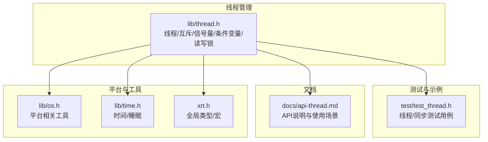
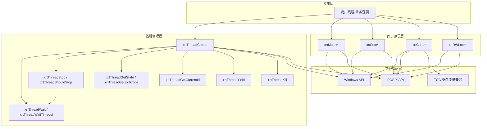
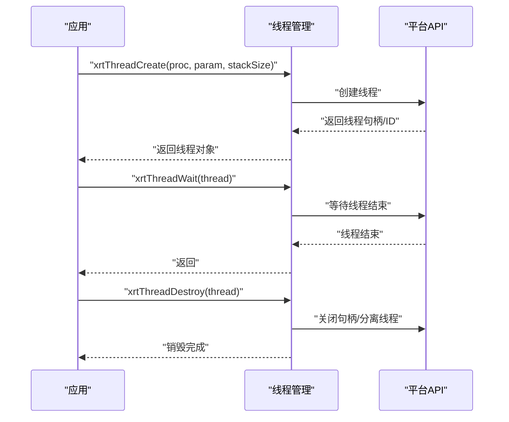
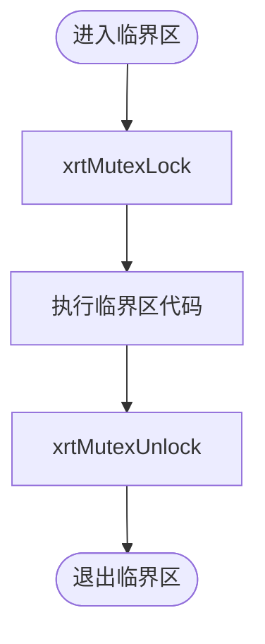
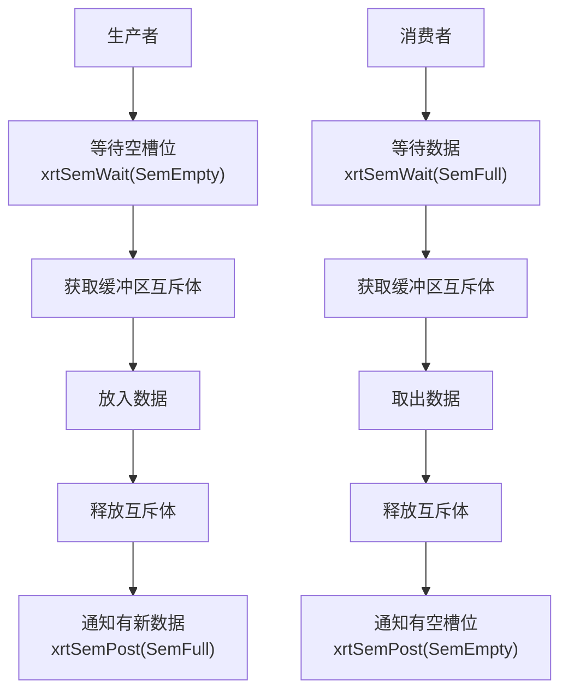
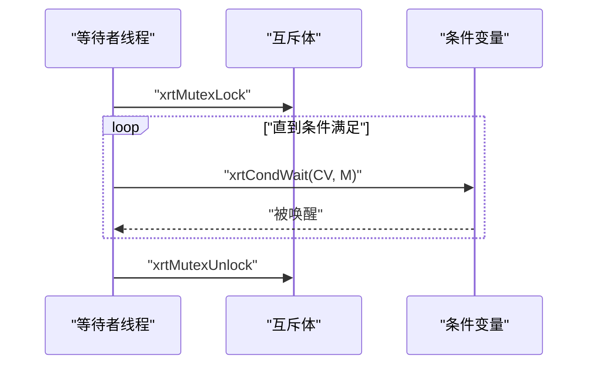
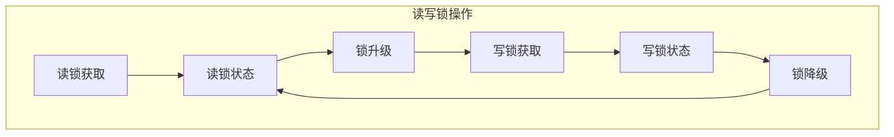
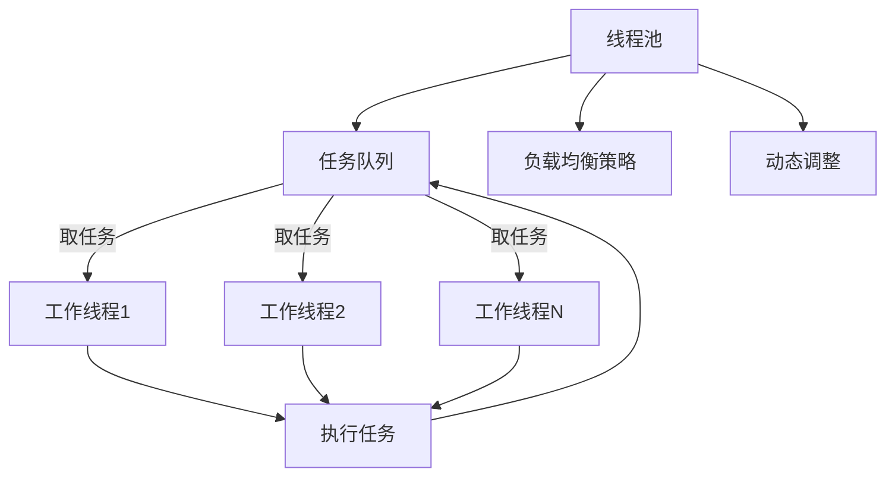
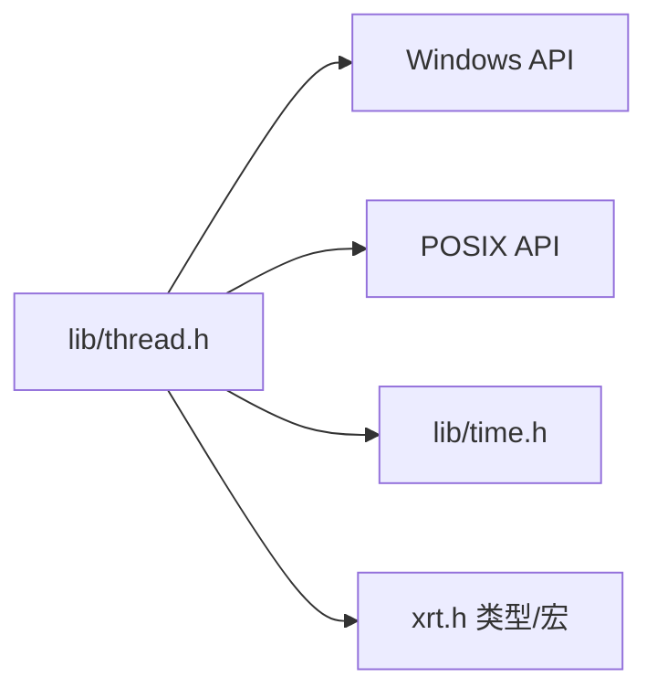

# 线程管理模块

<cite>
**本文引用的文件列表**
- [lib/thread.h](file://lib/thread.h)
- [test/test_thread.h](file://test/test_thread.h)
- [docs/api-thread.md](file://docs/api-thread.md)
- [lib/os.h](file://lib/os.h)
- [lib/time.h](file://lib/time.h)
- [xrt.h](file://xrt.h)
</cite>

## 更新摘要
**变更内容**
- 新增读写锁系统，包含完整的读锁、写锁、升级降级机制
- 扩展线程池管理能力，增加高级同步原语支持
- 改进资源管理机制，增强线程生命周期管理
- 完善跨平台抽象，统一Windows SRWLock和POSIX pthread_rwlock接口

## 目录
1. [简介](#简介)
2. [项目结构](#项目结构)
3. [核心组件](#核心组件)
4. [架构总览](#架构总览)
5. [详细组件分析](#详细组件分析)
6. [依赖关系分析](#依赖关系分析)
7. [性能考量](#性能考量)
8. [故障排查指南](#故障排查指南)
9. [结论](#结论)
10. [附录](#附录)

## 简介
本文档系统化梳理 XRT 线程管理模块，该模块经历了重大架构重构，从简单的线程包装器发展为复杂的多线程框架。新版本不仅保留了原有的线程创建与生命周期管理、参数传递、线程同步原语（互斥锁、条件变量、信号量），还新增了高级同步机制——读写锁系统，以及改进的资源管理能力。文档涵盖跨平台差异处理（Windows CreateThread vs POSIX pthread_create），并提供基于现有接口的扩展实践建议。

## 项目结构
线程管理模块主要由以下部分组成：
- 线程管理接口与实现：lib/thread.h（新增279行代码）
- 线程同步原语：互斥体、信号量、条件变量、读写锁
- 示例与测试：test/test_thread.h
- API 文档：docs/api-thread.md
- 平台差异与工具：lib/os.h、lib/time.h、xrt.h（全局类型与宏）

**图表来源**
- [lib/thread.h](file://lib/thread.h#L1-L886)
- [test/test_thread.h](file://test/test_thread.h#L1-L276)
- [docs/api-thread.md](file://docs/api-thread.md#L1-L779)
- [lib/os.h](file://lib/os.h#L1-L90)
- [lib/time.h](file://lib/time.h#L1-L200)
- [xrt.h](file://xrt.h#L114-L118)

## 核心组件
- **线程对象与生命周期管理**：创建、等待、销毁、停止信号、强制终止、挂起/恢复、状态查询、退出码、当前线程ID、让出时间片
- **同步原语**：互斥体（CRITICAL_SECTION/pthread_mutex_t）、信号量（Windows Semaphore/POSIX sem_t）、条件变量（Windows CONDITION_VARIABLE/POSIX pthread_cond_t）、**读写锁（Windows SRWLock/POSIX pthread_rwlock_t）**
- **跨平台适配**：Windows 与 POSIX 的差异化实现与兼容处理（含 TCC 编译器条件变量声明）
- **高级同步机制**：读写锁的读锁/写锁获取、升级降级、非阻塞获取等完整功能

**章节来源**
- [lib/thread.h](file://lib/thread.h#L1-L886)
- [docs/api-thread.md](file://docs/api-thread.md#L22-L86)

## 架构总览
下图展示线程管理模块的高层架构与关键交互：

**图表来源**
- [lib/thread.h](file://lib/thread.h#L1-L886)
- [docs/api-thread.md](file://docs/api-thread.md#L90-L476)

## 详细组件分析

### 线程创建与生命周期管理
- **线程创建**：支持指定栈大小；Windows 使用 CreateThread，POSIX 使用 pthread_create，并设置线程属性（如栈大小）
- **线程等待**：阻塞等待与带超时等待；POSIX 在 glibc 较新版本提供 pthread_timedjoin_np，否则采用轮询策略
- **线程停止**：通过停止标志位与 xrtThreadShouldStop 主动检查；不建议使用强制终止（xrtThreadKill）
- **线程控制**：挂起/恢复（仅 Windows）、状态查询、退出码获取、当前线程ID、让出时间片
- **资源回收**：销毁线程对象（不终止线程），Windows 关闭句柄，POSIX detach

**图表来源**
- [lib/thread.h](file://lib/thread.h#L22-L61)
- [lib/thread.h](file://lib/thread.h#L86-L95)

**章节来源**
- [lib/thread.h](file://lib/thread.h#L22-L61)
- [lib/thread.h](file://lib/thread.h#L86-L95)
- [lib/thread.h](file://lib/thread.h#L149-L165)
- [lib/thread.h](file://lib/thread.h#L170-L179)
- [lib/thread.h](file://lib/thread.h#L214-L246)
- [lib/thread.h](file://lib/thread.h#L251-L263)

### 参数传递与线程入口
- **线程入口函数**接收 void* 参数，可通过线程对象的 Param 字段传递任意数据
- **测试用例**展示了如何在线程内部读取参数并进行工作循环

**章节来源**
- [lib/thread.h](file://lib/thread.h#L27-L28)
- [test/test_thread.h](file://test/test_thread.h#L12-L35)

### 线程同步机制

#### 互斥体（Mutex）
- **创建/销毁/初始化/释放**：Windows 使用 SRWLock（轻量级），POSIX 使用 pthread_mutex_t
- **锁定/尝试锁定/解锁**：封装跨平台 API，Windows 使用 AcquireSRWLockExclusive/SRWLock
- **使用建议**：保护共享数据，避免死锁；遵循"谁持有谁释放"的原则

**图表来源**
- [lib/thread.h](file://lib/thread.h#L294-L401)

**章节来源**
- [lib/thread.h](file://lib/thread.h#L294-L401)

#### 信号量（Semaphore）
- **创建/销毁/初始化/释放**：Windows 使用 Semaphore，POSIX 使用 sem_t
- **等待/尝试等待/带超时等待/释放**：封装跨平台 API
- **批量释放**：Windows 支持一次释放多个，POSIX 循环调用 sem_post

**图表来源**
- [test/test_thread.h](file://test/test_thread.h#L46-L82)
- [lib/thread.h](file://lib/thread.h#L408-L560)

**章节来源**
- [lib/thread.h](file://lib/thread.h#L408-L560)
- [test/test_thread.h](file://test/test_thread.h#L208-L230)

#### 条件变量（Condition Variable）
- **创建/销毁/初始化/释放**：Windows 使用 CONDITION_VARIABLE，POSIX 使用 pthread_cond_t
- **等待/带超时等待/单播/广播**：封装跨平台 API
- **使用建议**：先锁定互斥体，再在 while 循环中等待，被唤醒后再次检查条件

**图表来源**
- [test/test_thread.h](file://test/test_thread.h#L89-L102)
- [lib/thread.h](file://lib/thread.h#L567-L704)

**章节来源**
- [lib/thread.h](file://lib/thread.h#L567-L704)
- [test/test_thread.h](file://test/test_thread.h#L233-L263)

#### 读写锁（Read-Write Lock）- 新增功能
- **创建/销毁/初始化/释放**：Windows 使用 SRWLock，POSIX 使用 pthread_rwlock_t
- **读锁获取**：xrtRWLockReadLock（共享锁），支持 TryLock 和 Upgrade
- **写锁获取**：xrtRWLockWriteLock（独占锁），支持 TryLock 和 Downgrade
- **锁升级降级**：xrtRWLockUpgrade（读锁升级为写锁），xrtRWLockDowngrade（写锁降级为读锁）
- **使用场景**：读多写少的并发场景，提高并发性能

**图表来源**
- [lib/thread.h](file://lib/thread.h#L711-L883)

**章节来源**
- [lib/thread.h](file://lib/thread.h#L711-L883)

### 跨平台线程抽象
- **Windows**：CreateThread、WaitForSingleObject、TerminateThread、SuspendThread/ResumeThread、SRWLock、CONDITION_VARIABLE、SEMAPHORE
- **POSIX**：pthread_create/pthread_join/pthread_cancel、pthread_mutex_t/pthread_cond_t/pthread_rwlock_t/sem_t、sched_yield、SwitchToThread（Windows）
- **TCC 编译器兼容**：在 Windows 下为 CONDITION_VARIABLE 提供声明与加载函数

**章节来源**
- [lib/thread.h](file://lib/thread.h#L7-L18)
- [lib/thread.h](file://lib/thread.h#L31-L58)
- [lib/thread.h](file://lib/thread.h#L184-L209)
- [lib/thread.h](file://lib/thread.h#L268-L287)
- [xrt.h](file://xrt.h#L50-L80)

### 线程池管理（扩展建议）
现有模块未提供内置线程池，但可基于现有接口实现：
- **线程池创建**：固定/可变大小，初始化工作线程集合
- **任务队列**：无界/有界队列，支持生产者-消费者模式
- **负载均衡**：轮询、最少连接、随机等策略
- **动态调整**：根据 CPU 使用率、队列长度动态增减线程
- **同步与停止**：使用互斥体保护队列，条件变量唤醒/休眠，停止信号优雅退出

**图表来源**
- [lib/thread.h](file://lib/thread.h#L294-L704)
- [test/test_thread.h](file://test/test_thread.h#L46-L82)

## 依赖关系分析
- **线程管理依赖平台 API**：Windows API 或 POSIX API
- **同步原语依赖对应平台的原生对象**：SRWLock/pthread_mutex_t、CONDITION_VARIABLE/pthread_cond_t、SEMAPHORE/sem_t、pthread_rwlock_t
- **时间与睡眠**：xrtSleep 用于线程让步与等待
- **全局类型与宏**：XXAPI、ptr、uint32 等

**图表来源**
- [lib/thread.h](file://lib/thread.h#L49-L90)
- [lib/time.h](file://lib/time.h#L27-L36)
- [xrt.h](file://xrt.h#L114-L118)

**章节来源**
- [lib/thread.h](file://lib/thread.h#L49-L90)
- [lib/time.h](file://lib/time.h#L27-L36)
- [xrt.h](file://xrt.h#L114-L118)

## 性能考量
- **栈大小**：合理设置线程栈大小，避免过大浪费内存或过小导致栈溢出
- **等待策略**：优先使用带超时的等待，避免无限阻塞；POSIX 在较新 glibc 下可用 pthread_timedjoin_np
- **互斥体选择**：尽量减少持有时间，避免在临界区内执行耗时操作；Windows SRWLock 比传统互斥体性能更好
- **信号量批量释放**：Windows 支持一次释放多个，POSIX 可通过循环优化
- **读写锁优势**：在读多写少场景下，读写锁比互斥体提供更好的并发性能
- **让出时间片**：在忙等场景使用 xrtThreadYield/sched_yield，降低 CPU 占用
- **跨平台编译**：Linux/macOS 需链接 pthread 库

**章节来源**
- [lib/thread.h](file://lib/thread.h#L46-L57)
- [lib/thread.h](file://lib/thread.h#L115-L143)
- [docs/api-thread.md](file://docs/api-thread.md#L756-L762)

## 故障排查指南
- **线程无法结束**：检查是否正确调用 xrtThreadWait；POSIX 下确保主线程等待 join，避免僵尸线程
- **停止信号无效**：确认线程内部定期检查 xrtThreadShouldStop 并及时退出
- **超时等待异常**：POSIX glibc 版本较低时回退到轮询策略，注意轮询开销
- **强制终止风险**：xrtThreadKill/TerminateThread/pthread_cancel 存在资源泄漏风险，应避免使用
- **平台差异**：Windows 支持挂起/恢复，POSIX 不支持；条件变量在 TCC 下需特殊处理
- **资源释放顺序**：先等待线程结束，再销毁线程对象；互斥体/信号量/条件变量按需销毁
- **读写锁死锁**：避免在持有读锁时尝试升级，或在持有写锁时尝试降级
- **锁升级失败**：读锁升级为写锁可能失败，需要释放读锁后重新获取写锁

**章节来源**
- [lib/thread.h](file://lib/thread.h#L149-L179)
- [lib/thread.h](file://lib/thread.h#L214-L246)
- [lib/thread.h](file://lib/thread.h#L845-L883)
- [docs/api-thread.md](file://docs/api-thread.md#L691-L746)

## 结论
XRT 线程管理模块经过重大架构重构，现已发展为功能完备的多线程框架。新版本不仅提供了跨平台的一致性抽象，覆盖线程生命周期管理与四大同步原语，还新增了高性能的读写锁系统，显著提升了并发性能。通过合理的参数传递、同步策略与平台适配，可在 Windows 与 POSIX 系统上稳定运行。对于更复杂的线程池与任务调度需求，可基于现有接口进行扩展实现。

## 附录

### API 快速参考（摘自文档）
- **线程管理**：创建、等待、销毁、停止、强制终止、挂起/恢复、状态/退出码、当前线程ID、让出时间片
- **互斥体**：创建/销毁/初始化/释放、锁定/尝试锁定/解锁
- **信号量**：创建/销毁/初始化/释放、等待/尝试等待/带超时等待、释放/批量释放
- **条件变量**：创建/销毁/初始化/释放、等待/带超时等待、单播/广播
- **读写锁**：创建/销毁/初始化/释放、读锁获取/释放、写锁获取/释放、锁升级/降级

**章节来源**
- [docs/api-thread.md](file://docs/api-thread.md#L90-L476)