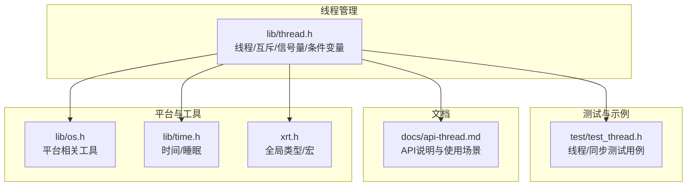
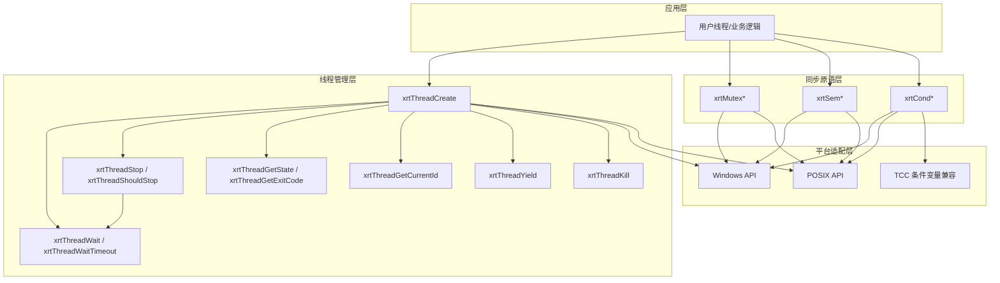
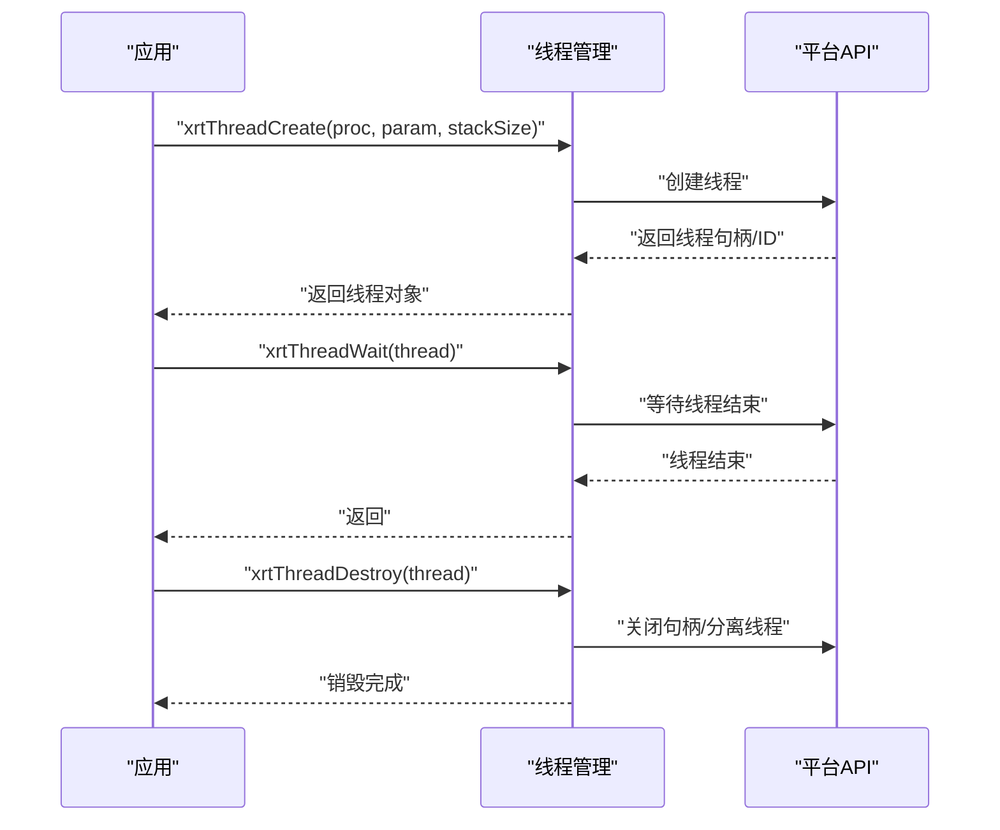
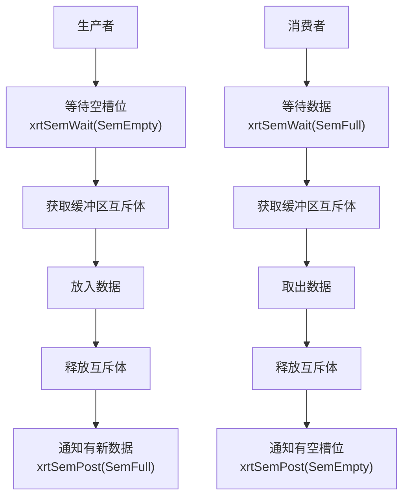
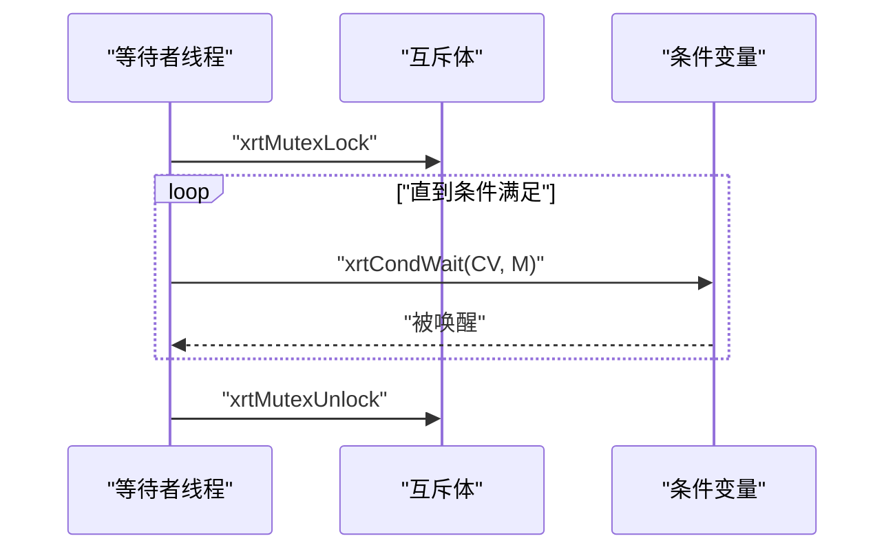
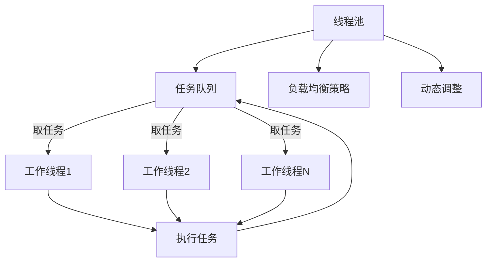
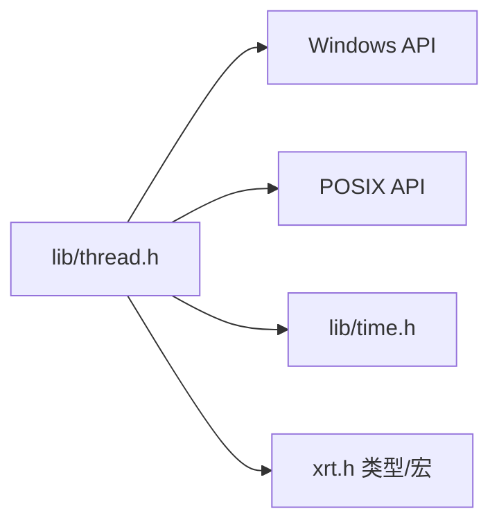

# 线程管理模块

<cite>
**本文引用的文件列表**
- [lib/thread.h](file://lib/thread.h)
- [test/test_thread.h](file://test/test_thread.h)
- [docs/api-thread.md](file://docs/api-thread.md)
- [lib/os.h](file://lib/os.h)
- [lib/time.h](file://lib/time.h)
- [xrt.h](file://xrt.h)
</cite>

## 目录
1. [简介](#简介)
2. [项目结构](#项目结构)
3. [核心组件](#核心组件)
4. [架构总览](#架构总览)
5. [详细组件分析](#详细组件分析)
6. [依赖关系分析](#依赖关系分析)
7. [性能考量](#性能考量)
8. [故障排查指南](#故障排查指南)
9. [结论](#结论)
10. [附录](#附录)

## 简介
本文件系统化梳理 XRT 线程管理模块，覆盖线程创建与生命周期管理、参数传递、线程同步原语（互斥锁、条件变量、信号量）、跨平台差异处理（Windows CreateThread vs POSIX pthread_create），以及基于现有接口的扩展实践建议（如线程池、任务队列、负载均衡与动态调整）。文档同时提供最佳实践、性能优化策略与常见陷阱规避，帮助开发者在多平台上构建稳定高效的并发程序。

## 项目结构
线程管理模块主要由以下部分组成：
- 线程管理接口与实现：lib/thread.h
- 线程同步原语：lib/thread.h 中的互斥体、信号量、条件变量
- 示例与测试：test/test_thread.h
- API 文档：docs/api-thread.md
- 平台差异与工具：lib/os.h、lib/time.h、xrt.h（全局类型与宏）

图表来源
- [lib/thread.h](file://lib/thread.h#L34-L749)
- [test/test_thread.h](file://test/test_thread.h#L105-L276)
- [docs/api-thread.md](file://docs/api-thread.md#L1-L779)
- [lib/os.h](file://lib/os.h#L1-L90)
- [lib/time.h](file://lib/time.h#L26-L36)
- [xrt.h](file://xrt.h#L114-L118)

章节来源
- [lib/thread.h](file://lib/thread.h#L1-L749)
- [test/test_thread.h](file://test/test_thread.h#L1-L276)
- [docs/api-thread.md](file://docs/api-thread.md#L1-L779)
- [lib/os.h](file://lib/os.h#L1-L90)
- [lib/time.h](file://lib/time.h#L1-L200)
- [xrt.h](file://xrt.h#L114-L118)

## 核心组件
- 线程对象与生命周期管理：创建、等待、销毁、停止信号、强制终止、挂起/恢复、状态查询、退出码、当前线程ID、让出时间片
- 同步原语：互斥体（CRITICAL_SECTION/pthread_mutex_t）、信号量（Windows Semaphore/POSIX sem_t）、条件变量（Windows CONDITION_VARIABLE/POSIX pthread_cond_t）
- 跨平台适配：Windows 与 POSIX 的差异化实现与兼容处理（含 TCC 编译器条件变量声明）

章节来源
- [lib/thread.h](file://lib/thread.h#L34-L749)
- [docs/api-thread.md](file://docs/api-thread.md#L22-L86)

## 架构总览
下图展示线程管理模块的高层架构与关键交互：

图表来源
- [lib/thread.h](file://lib/thread.h#L34-L749)
- [docs/api-thread.md](file://docs/api-thread.md#L90-L476)

## 详细组件分析

### 线程创建与生命周期管理
- 线程创建：支持指定栈大小；Windows 使用 CreateThread，POSIX 使用 pthread_create，并设置线程属性（如栈大小）
- 线程等待：阻塞等待与带超时等待；POSIX 在 glibc 较新版本提供 pthread_timedjoin_np，否则采用轮询策略
- 线程停止：通过停止标志位与 xrtThreadShouldStop 主动检查；不建议使用强制终止（xrtThreadKill）
- 线程控制：挂起/恢复（仅 Windows）、状态查询、退出码获取、当前线程ID、让出时间片
- 资源回收：销毁线程对象（不终止线程），Windows 关闭句柄，POSIX detach

图表来源
- [lib/thread.h](file://lib/thread.h#L37-L108)
- [lib/thread.h](file://lib/thread.h#L183-L223)

章节来源
- [lib/thread.h](file://lib/thread.h#L37-L108)
- [lib/thread.h](file://lib/thread.h#L113-L157)
- [lib/thread.h](file://lib/thread.h#L162-L192)
- [lib/thread.h](file://lib/thread.h#L197-L223)
- [lib/thread.h](file://lib/thread.h#L228-L277)
- [lib/thread.h](file://lib/thread.h#L282-L301)

### 参数传递与线程入口
- 线程入口函数接收 void* 参数，可通过线程对象的 Param 字段传递任意数据
- 测试用例展示了如何在线程内部读取参数并进行工作循环

章节来源
- [lib/thread.h](file://lib/thread.h#L37-L44)
- [test/test_thread.h](file://test/test_thread.h#L11-L35)

### 线程同步机制

#### 互斥体（Mutex）
- 创建/销毁/初始化/释放：Windows 使用 CRITICAL_SECTION，POSIX 使用 pthread_mutex_t
- 锁定/尝试锁定/解锁：封装跨平台 API
- 使用建议：保护共享数据，避免死锁；遵循“谁持有谁释放”的原则

图表来源
- [lib/thread.h](file://lib/thread.h#L308-L420)

章节来源
- [lib/thread.h](file://lib/thread.h#L308-L420)

#### 信号量（Semaphore）
- 创建/销毁/初始化/释放：Windows 使用 Semaphore，POSIX 使用 sem_t
- 等待/尝试等待/带超时等待/释放：封装跨平台 API
- 批量释放：Windows 支持一次释放多个，POSIX 循环调用 sem_post

图表来源
- [test/test_thread.h](file://test/test_thread.h#L46-L82)
- [lib/thread.h](file://lib/thread.h#L427-L590)

章节来源
- [lib/thread.h](file://lib/thread.h#L427-L590)
- [test/test_thread.h](file://test/test_thread.h#L208-L230)

#### 条件变量（Condition Variable）
- 创建/销毁/初始化/释放：Windows 使用 CONDITION_VARIABLE，POSIX 使用 pthread_cond_t
- 等待/带超时等待/单播/广播：封装跨平台 API
- 使用建议：先锁定互斥体，再在 while 循环中等待，被唤醒后再次检查条件

图表来源
- [test/test_thread.h](file://test/test_thread.h#L89-L102)
- [lib/thread.h](file://lib/thread.h#L597-L746)

章节来源
- [lib/thread.h](file://lib/thread.h#L597-L746)
- [test/test_thread.h](file://test/test_thread.h#L233-L263)

### 跨平台线程抽象
- Windows：CreateThread、WaitForSingleObject、TerminateThread、SuspendThread/ResumeThread、CONDITION_VARIABLE、SEMAPHORE
- POSIX：pthread_create/pthread_join/pthread_cancel、pthread_mutex_t/pthread_cond_t/sem_t、sched_yield、SwitchToThread（Windows）
- TCC 编译器兼容：在 Windows 下为 CONDITION_VARIABLE 提供声明与加载函数

章节来源
- [lib/thread.h](file://lib/thread.h#L5-L30)
- [lib/thread.h](file://lib/thread.h#L46-L71)
- [lib/thread.h](file://lib/thread.h#L117-L122)
- [lib/thread.h](file://lib/thread.h#L197-L223)
- [lib/thread.h](file://lib/thread.h#L232-L259)
- [lib/thread.h](file://lib/thread.h#L284-L289)

### 线程池管理（扩展建议）
现有模块未提供内置线程池，但可基于现有接口实现：
- 线程池创建：固定/可变大小，初始化工作线程集合
- 任务队列：无界/有界队列，支持生产者-消费者模式
- 负载均衡：轮询、最少连接、随机等策略
- 动态调整：根据 CPU 使用率、队列长度动态增减线程
- 同步与停止：使用互斥体保护队列，条件变量唤醒/休眠，停止信号优雅退出

图表来源
- [lib/thread.h](file://lib/thread.h#L308-L746)
- [test/test_thread.h](file://test/test_thread.h#L46-L82)

## 依赖关系分析
- 线程管理依赖平台 API：Windows API 或 POSIX API
- 同步原语依赖对应平台的原生对象：CRITICAL_SECTION/pthread_mutex_t、CONDITION_VARIABLE/pthread_cond_t、SEMAPHORE/sem_t
- 时间与睡眠：xrtSleep 用于线程让步与等待
- 全局类型与宏：XXAPI、ptr、uint32 等

图表来源
- [lib/thread.h](file://lib/thread.h#L5-L9)
- [lib/time.h](file://lib/time.h#L26-L36)
- [xrt.h](file://xrt.h#L114-L118)

章节来源
- [lib/thread.h](file://lib/thread.h#L5-L9)
- [lib/time.h](file://lib/time.h#L26-L36)
- [xrt.h](file://xrt.h#L114-L118)

## 性能考量
- 栈大小：合理设置线程栈大小，避免过大浪费内存或过小导致栈溢出
- 等待策略：优先使用带超时的等待，避免无限阻塞；POSIX 在较新 glibc 下可用 pthread_timedjoin_np
- 互斥体选择：尽量减少持有时间，避免在临界区内执行耗时操作
- 信号量批量释放：Windows 支持一次释放多个，POSIX 可通过循环优化
- 让出时间片：在忙等场景使用 xrtThreadYield/sched_yield，降低 CPU 占用
- 跨平台编译：Linux/macOS 需链接 pthread 库

章节来源
- [lib/thread.h](file://lib/thread.h#L60-L62)
- [lib/thread.h](file://lib/thread.h#L128-L144)
- [docs/api-thread.md](file://docs/api-thread.md#L756-L762)

## 故障排查指南
- 线程无法结束：检查是否正确调用 xrtThreadWait；POSIX 下确保主线程等待 join，避免僵尸线程
- 停止信号无效：确认线程内部定期检查 xrtThreadShouldStop 并及时退出
- 超时等待异常：POSIX glibc 版本较低时回退到轮询策略，注意轮询开销
- 强制终止风险：xrtThreadKill/TerminateThread/pthread_cancel 存在资源泄漏风险，应避免使用
- 平台差异：Windows 支持挂起/恢复，POSIX 不支持；条件变量在 TCC 下需特殊处理
- 资源释放顺序：先等待线程结束，再销毁线程对象；互斥体/信号量/条件变量按需销毁

章节来源
- [lib/thread.h](file://lib/thread.h#L162-L192)
- [lib/thread.h](file://lib/thread.h#L113-L157)
- [lib/thread.h](file://lib/thread.h#L197-L223)
- [docs/api-thread.md](file://docs/api-thread.md#L691-L746)

## 结论
XRT 线程管理模块提供了跨平台的一致性抽象，覆盖线程生命周期管理与三大同步原语，满足大多数并发场景需求。通过合理的参数传递、同步策略与平台适配，可在 Windows 与 POSIX 系统上稳定运行。对于更复杂的线程池与任务调度需求，可基于现有接口进行扩展实现。

## 附录

### API 快速参考（摘自文档）
- 线程管理：创建、等待、销毁、停止、强制终止、挂起/恢复、状态/退出码、当前线程ID、让出时间片
- 互斥体：创建/销毁/初始化/释放、锁定/尝试锁定/解锁
- 信号量：创建/销毁/初始化/释放、等待/尝试等待/带超时等待、释放/批量释放
- 条件变量：创建/销毁/初始化/释放、等待/带超时等待、单播/广播

章节来源
- [docs/api-thread.md](file://docs/api-thread.md#L90-L476)