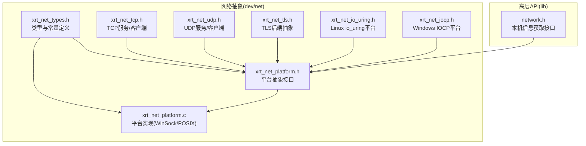
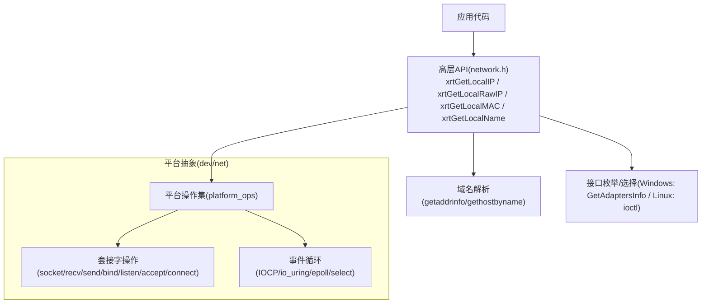
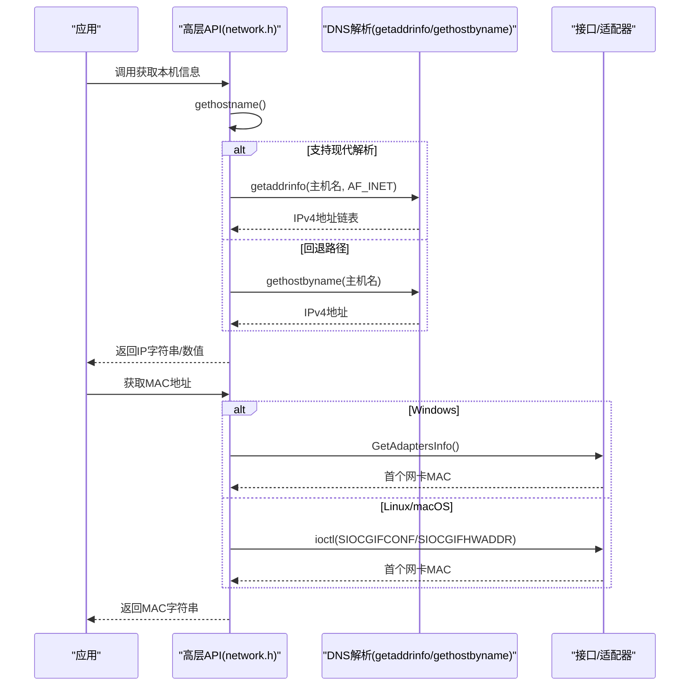
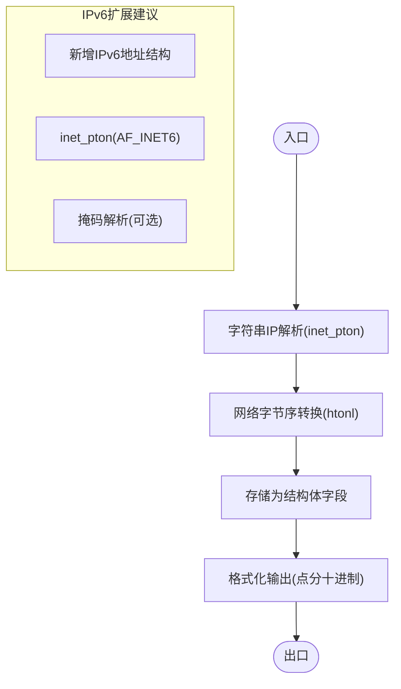
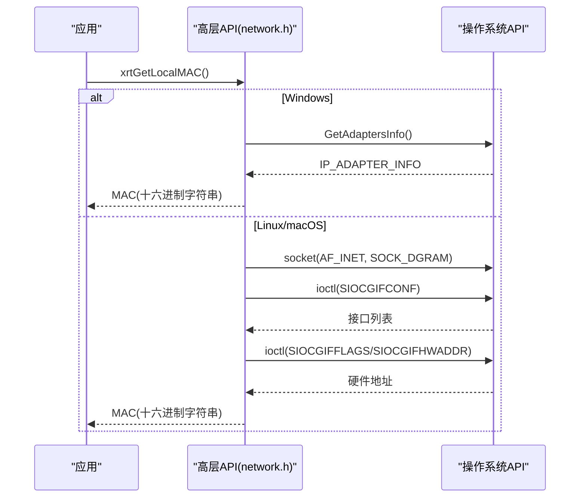
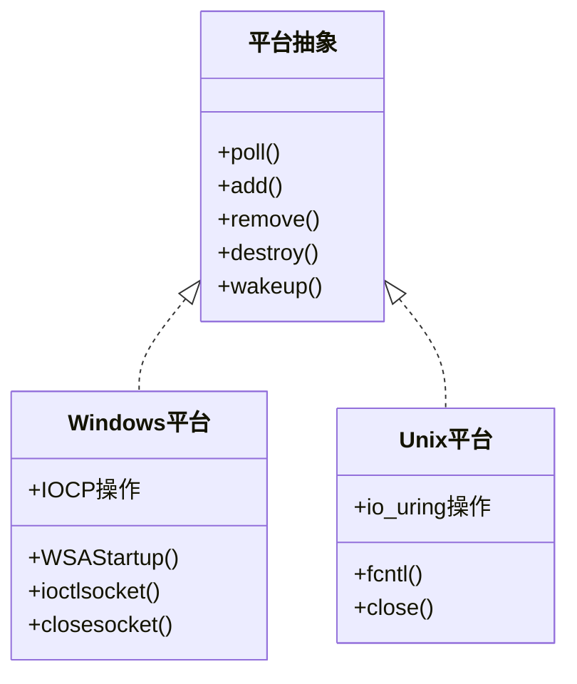
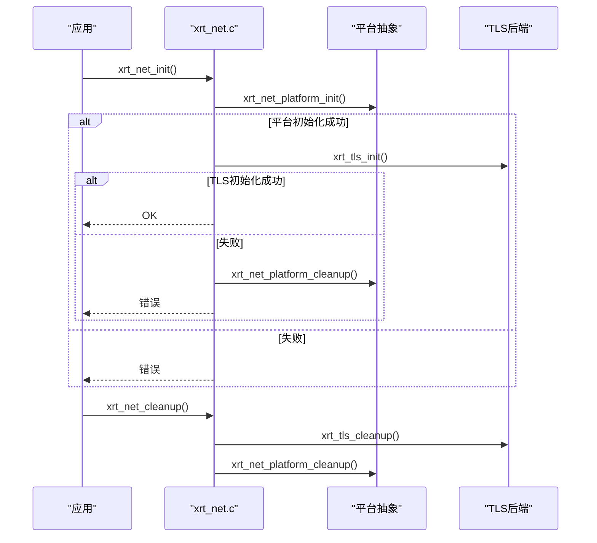
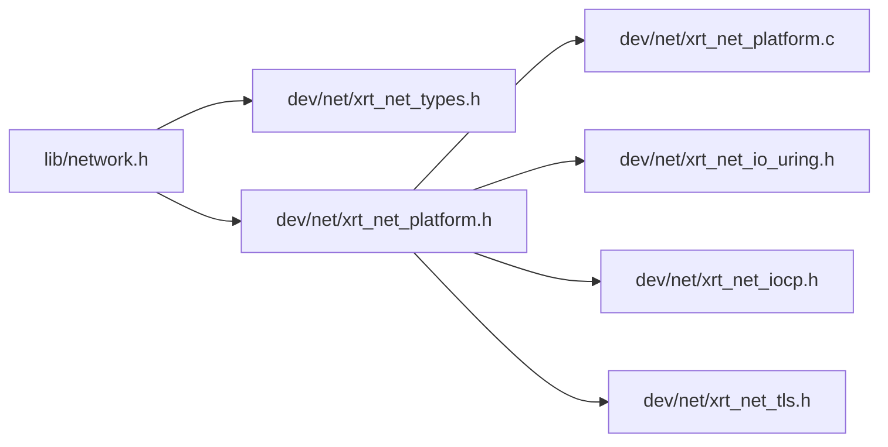

# 网络信息模块

<cite>
**本文引用的文件**
- [xrt_net.h](file://dev/net/xrt_net.h)
- [xrt_net.c](file://dev/net/xrt_net.c)
- [xrt_net_platform.h](file://dev/net/xrt_net_platform.h)
- [xrt_net_platform.c](file://dev/net/xrt_net_platform.c)
- [xrt_net_types.h](file://dev/net/xrt_net_types.h)
- [xrt_net_tcp.h](file://dev/net/xrt_net_tcp.h)
- [xrt_net_udp.h](file://dev/net/xrt_net_udp.h)
- [xrt_net_tls.h](file://dev/net/xrt_net_tls.h)
- [xrt_net_io_uring.h](file://dev/net/xrt_net_io_uring.h)
- [xrt_net_iocp.h](file://dev/net/xrt_net_iocp.h)
- [network.h](file://lib/network.h)
- [api-network.md](file://docs/api-network.md)
- [test_network.h](file://test/test_network.h)
</cite>

## 更新摘要
**所做更改**
- 更新了跨平台网络抽象层的架构说明，反映完整的dev/net实现
- 新增了平台抽象层的详细组件分析
- 更新了网络初始化和生命周期管理的实现细节
- 增强了IPv4/IPv6地址处理和MAC地址获取的功能说明
- 补充了TLS后端集成和事件循环机制的说明

## 目录
1. [简介](#简介)
2. [项目结构](#项目结构)
3. [核心组件](#核心组件)
4. [架构总览](#架构总览)
5. [详细组件分析](#详细组件分析)
6. [依赖关系分析](#依赖关系分析)
7. [性能考量](#性能考量)
8. [故障排查指南](#故障排查指南)
9. [结论](#结论)
10. [附录](#附录)

## 简介
本文件面向XRT网络信息模块，系统性梳理并解释以下能力与实现要点：
- 本机网络信息获取：主机名获取、域名解析、网络接口枚举
- IP地址处理：IPv4地址识别、地址格式转换、网络掩码处理
- MAC地址获取：网卡信息查询、硬件地址提取、设备标识
- 跨平台网络抽象：Windows平台的IPHLPAPI/Winsock调用、Linux平台的ioctl系统调用与网络配置读取
- 实际应用场景与安全考虑

该模块既包含高层API（位于lib/network.h），也包含底层网络抽象（dev/net目录下的平台无关与平台相关实现），并通过统一的初始化/清理流程对外暴露。

## 项目结构
网络信息模块由"高层API + 底层平台抽象 + 网络传输层"三层组成：
- 高层API：提供本机IP/MAC/主机名等信息获取接口
- 底层平台抽象：封装跨平台套接字操作、事件循环与平台差异
- 网络传输层：TCP/UDP/TLS等传输能力，作为网络信息模块的扩展能力

**图表来源**
- [network.h](file://lib/network.h#L1-L214)
- [xrt_net_types.h](file://dev/net/xrt_net_types.h#L1-L208)
- [xrt_net_platform.h](file://dev/net/xrt_net_platform.h#L1-L44)
- [xrt_net_platform.c](file://dev/net/xrt_net_platform.c#L1-L351)
- [xrt_net_tcp.h](file://dev/net/xrt_net_tcp.h#L1-L50)
- [xrt_net_udp.h](file://dev/net/xrt_net_udp.h#L1-L38)
- [xrt_net_tls.h](file://dev/net/xrt_net_tls.h#L1-L85)
- [xrt_net_io_uring.h](file://dev/net/xrt_net_io_uring.h#L1-L35)
- [xrt_net_iocp.h](file://dev/net/xrt_net_iocp.h#L1-L39)

**章节来源**
- [xrt_net.h](file://dev/net/xrt_net.h#L1-L14)
- [xrt_net.c](file://dev/net/xrt_net.c#L1-L26)
- [xrt_net_platform.h](file://dev/net/xrt_net_platform.h#L1-L44)
- [xrt_net_platform.c](file://dev/net/xrt_net_platform.c#L1-L351)
- [xrt_net_types.h](file://dev/net/xrt_net_types.h#L1-L208)
- [network.h](file://lib/network.h#L1-L214)

## 核心组件
- 初始化与清理
  - 网络模块初始化：调用平台初始化与TLS初始化，失败时回滚
  - 清理：先TLS后平台
- 平台抽象
  - 统一的套接字生命周期管理（创建/关闭/非阻塞/复用/绑定/监听/接受/连接）
  - 统一的收发接口（send/recv/sendto/recvfrom）
  - 平台事件循环接口（轮询/添加/移除/销毁/唤醒）
- 类型与地址处理
  - IPv4地址结构与转换（网络字节序/主机字节序）
  - 字符串与数值IP互转
  - 缓冲区管理（动态扩容、追加、消费）

**章节来源**
- [xrt_net.c](file://dev/net/xrt_net.c#L1-L26)
- [xrt_net_platform.c](file://dev/net/xrt_net_platform.c#L38-L351)
- [xrt_net_types.h](file://dev/net/xrt_net_types.h#L50-L143)

## 架构总览
下图展示高层API如何通过平台抽象访问底层网络能力，并说明跨平台差异：

**图表来源**
- [network.h](file://lib/network.h#L4-L214)
- [xrt_net_platform.h](file://dev/net/xrt_net_platform.h#L12-L28)
- [xrt_net_platform.c](file://dev/net/xrt_net_platform.c#L38-L351)
- [xrt_net_io_uring.h](file://dev/net/xrt_net_io_uring.h#L30-L35)
- [xrt_net_iocp.h](file://dev/net/xrt_net_iocp.h#L34-L39)

## 详细组件分析

### 1) 本机网络信息获取（主机名、域名解析、接口枚举）
- 主机名获取
  - 使用系统调用获取主机名，随后进行域名解析以获得IPv4地址
  - 在部分编译器环境下回退到较老的解析函数
- 域名解析
  - 使用现代解析API优先，兼容旧式解析路径
  - 仅选择IPv4地址并格式化为字符串
- 接口枚举
  - Windows：通过适配器信息API获取首个网卡的MAC地址
  - Linux/macOS：通过ioctl系统调用获取接口列表与硬件地址

**图表来源**
- [network.h](file://lib/network.h#L4-L214)
- [api-network.md](file://docs/api-network.md#L315-L323)

**章节来源**
- [network.h](file://lib/network.h#L4-L214)
- [api-network.md](file://docs/api-network.md#L22-L214)

### 2) IP地址处理（IPv4/IPv6识别、格式转换、掩码处理）
- IPv4识别与转换
  - 地址结构包含32位IPv4地址与端口字段
  - 提供从字符串到数值的转换与反向格式化
  - 网络字节序与主机字节序转换
- IPv6支持现状
  - 当前类型与转换函数集中于IPv4；IPv6扩展可按需在现有框架内增加
- 掩码处理
  - 现有API未直接提供掩码解析；可通过系统调用或第三方库扩展

**图表来源**
- [xrt_net_types.h](file://dev/net/xrt_net_types.h#L136-L143)
- [xrt_net_types.h](file://dev/net/xrt_net_types.h#L112-L134)

**章节来源**
- [xrt_net_types.h](file://dev/net/xrt_net_types.h#L50-L143)

### 3) MAC地址获取（网卡信息查询、硬件地址提取、设备标识）
- Windows
  - 使用适配器信息API获取首个网卡的MAC地址
  - 可扩展为遍历所有适配器以支持多网卡场景
- Linux/macOS
  - 使用ioctl系统调用获取接口配置与硬件地址
  - 通过接口标志过滤有效接口
- 设备标识
  - MAC地址可用于设备唯一标识，结合IP用于分布式场景

**图表来源**
- [network.h](file://lib/network.h#L74-L139)

**章节来源**
- [network.h](file://lib/network.h#L74-L139)
- [api-network.md](file://docs/api-network.md#L124-L171)

### 4) 跨平台网络抽象（Windows/Unix）
- Windows
  - Winsock初始化/清理
  - 套接字非阻塞设置采用ioctlsocket
  - 连接/发送/接收错误码映射至统一结果枚举
  - IOCP平台数据结构与重叠I/O模型
- Linux/macOS
  - POSIX套接字API
  - 非阻塞设置采用fcntl
  - io_uring平台数据结构与异步队列
- 统一结果枚举
  - 成功/错误/再次尝试/超时/关闭/TLS错误

**图表来源**
- [xrt_net_platform.h](file://dev/net/xrt_net_platform.h#L12-L28)
- [xrt_net_platform.c](file://dev/net/xrt_net_platform.c#L15-L36)
- [xrt_net_platform.c](file://dev/net/xrt_net_platform.c#L77-L90)
- [xrt_net_iocp.h](file://dev/net/xrt_net_iocp.h#L25-L34)
- [xrt_net_io_uring.h](file://dev/net/xrt_net_io_uring.h#L22-L28)

**章节来源**
- [xrt_net_platform.c](file://dev/net/xrt_net_platform.c#L1-L351)
- [xrt_net_iocp.h](file://dev/net/xrt_net_iocp.h#L1-L39)
- [xrt_net_io_uring.h](file://dev/net/xrt_net_io_uring.h#L1-L35)
- [xrt_net_types.h](file://dev/net/xrt_net_types.h#L27-L48)

### 5) 网络信息模块初始化与生命周期
- 初始化顺序
  - 平台初始化（Windows Winsock/Unix FD）
  - TLS初始化（可选）
- 清理顺序
  - TLS清理
  - 平台清理

**图表来源**
- [xrt_net.c](file://dev/net/xrt_net.c#L3-L25)
- [xrt_net_platform.c](file://dev/net/xrt_net_platform.c#L9-L36)

**章节来源**
- [xrt_net.c](file://dev/net/xrt_net.c#L1-L26)
- [xrt_net_platform.c](file://dev/net/xrt_net_platform.c#L1-L36)

### 6) 平台抽象层详细分析
- 平台操作接口
  - 事件循环接口：poll、add、remove、destroy、wakeup
  - 套接字操作接口：创建、关闭、非阻塞设置、复用、绑定、监听、接受、连接
  - 收发接口：send、recv、sendto、recvfrom
- 平台实现
  - Windows：Winsock2 API，支持IOCP事件模型
  - Unix：POSIX套接字API，支持epoll、select等事件模型
- 类型系统
  - 统一的网络结果枚举和事件类型
  - 地址结构体和缓冲区管理
  - 连接状态管理和TLS集成

**章节来源**
- [xrt_net_platform.h](file://dev/net/xrt_net_platform.h#L12-L42)
- [xrt_net_platform.c](file://dev/net/xrt_net_platform.c#L38-L351)
- [xrt_net_types.h](file://dev/net/xrt_net_types.h#L27-L208)

## 依赖关系分析
- 模块内聚与耦合
  - 高层API仅依赖平台抽象接口，保持良好内聚
  - 平台抽象对系统API有直接依赖，但通过统一接口屏蔽差异
- 外部依赖
  - Windows：WinSock/IP Helper API
  - Linux：ioctl系统调用、/proc/net等（可选）
- 循环依赖
  - 未发现直接循环；平台抽象被高层API单向依赖

**图表来源**
- [network.h](file://lib/network.h#L1-L214)
- [xrt_net_types.h](file://dev/net/xrt_net_types.h#L1-L208)
- [xrt_net_platform.h](file://dev/net/xrt_net_platform.h#L1-L44)
- [xrt_net_platform.c](file://dev/net/xrt_net_platform.c#L1-L351)
- [xrt_net_io_uring.h](file://dev/net/xrt_net_io_uring.h#L1-L35)
- [xrt_net_iocp.h](file://dev/net/xrt_net_iocp.h#L1-L39)
- [xrt_net_tls.h](file://dev/net/xrt_net_tls.h#L1-L85)

**章节来源**
- [xrt_net.h](file://dev/net/xrt_net.h#L1-L14)
- [xrt_net_platform.h](file://dev/net/xrt_net_platform.h#L1-L44)

## 性能考量
- 解析策略
  - 优先使用现代解析API，避免多次系统调用
  - 在不支持的编译器上使用回退路径，确保可用性
- 非阻塞与事件循环
  - 平台抽象提供非阻塞套接字与事件循环接口，适合高并发场景
  - Windows推荐IOCP，Linux推荐io_uring，减少上下文切换
- 缓冲区管理
  - 类型层提供动态缓冲区扩容策略，降低频繁分配成本

## 故障排查指南
- 常见问题
  - 多网卡环境：可能返回非预期网卡的IP/MAC
  - 网络未连接：可能返回回环地址或解析失败
  - 内存释放：字符串返回值需释放，数值返回值无需释放
- 定位方法
  - 检查系统解析API返回值与错误码
  - 在Windows确认Winsock初始化成功
  - 在Linux确认具备网络接口且具备权限执行ioctl

**章节来源**
- [api-network.md](file://docs/api-network.md#L326-L376)
- [network.h](file://lib/network.h#L320-L376)

## 结论
XRT网络信息模块通过清晰的分层设计，在高层API与底层平台之间建立了稳定的抽象边界。其特性包括：
- 跨平台一致性：统一的接口与错误码
- 易用性：提供本机IP/MAC/主机名等常用信息
- 可扩展性：平台抽象便于接入新的事件模型与TLS后端

建议后续增强方向：
- 扩展IPv6支持与掩码解析
- 增强接口枚举能力，支持多网卡选择
- 引入更完善的日志与错误报告机制

## 附录

### A. 实际应用场景
- 分布式ID生成：利用本地IP作为机器标识
- 设备信息采集：统一获取主机名、IP、MAC
- 日志标识：在日志中附加本机IP，便于定位

**章节来源**
- [api-network.md](file://docs/api-network.md#L216-L311)
- [test_network.h](file://test/test_network.h#L4-L17)

### B. 安全考虑
- 信息泄露：IP/MAC可作为设备标识，需控制传播范围
- 权限要求：Linux ioctl需要适当权限
- 多网卡风险：在多网卡环境中需明确选择目标接口

**章节来源**
- [api-network.md](file://docs/api-network.md#L326-L376)
- [network.h](file://lib/network.h#L105-L139)