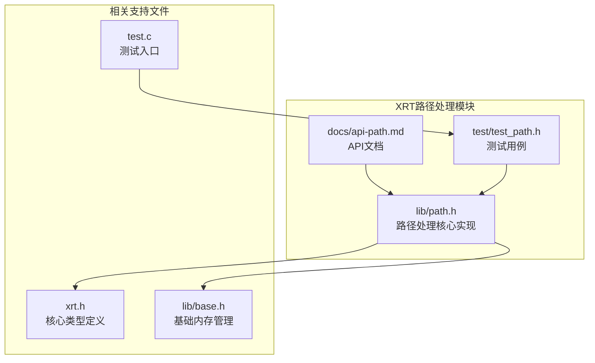
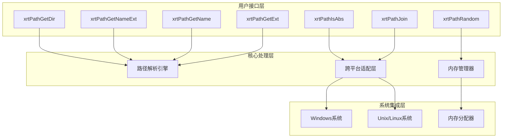
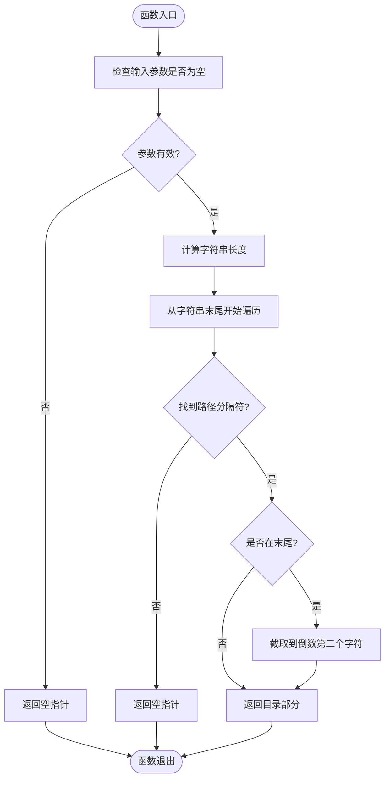
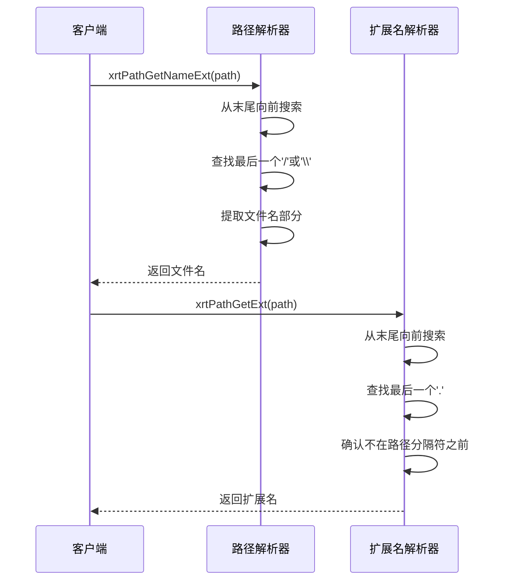
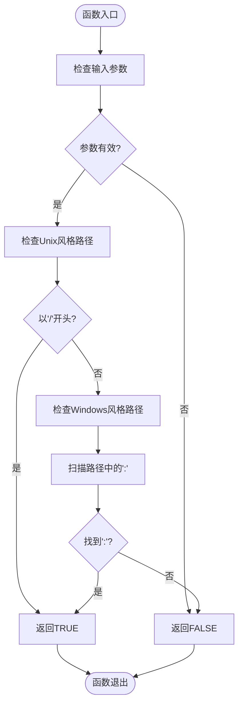
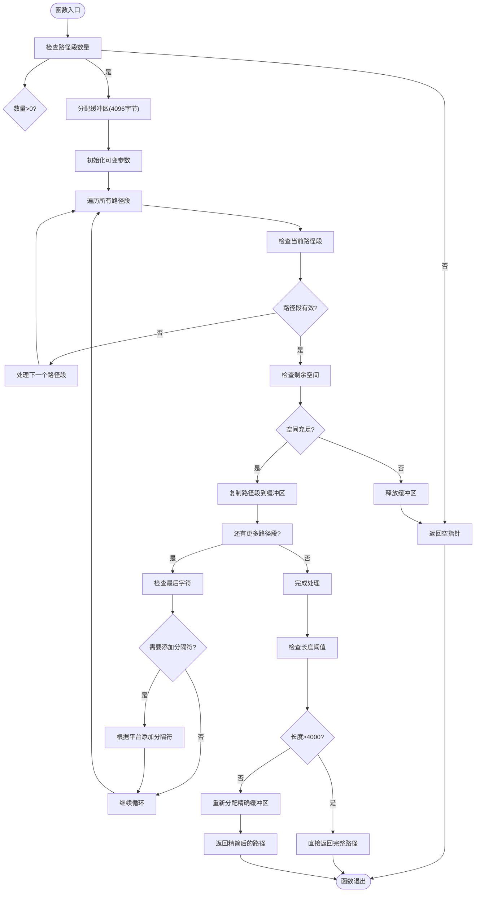
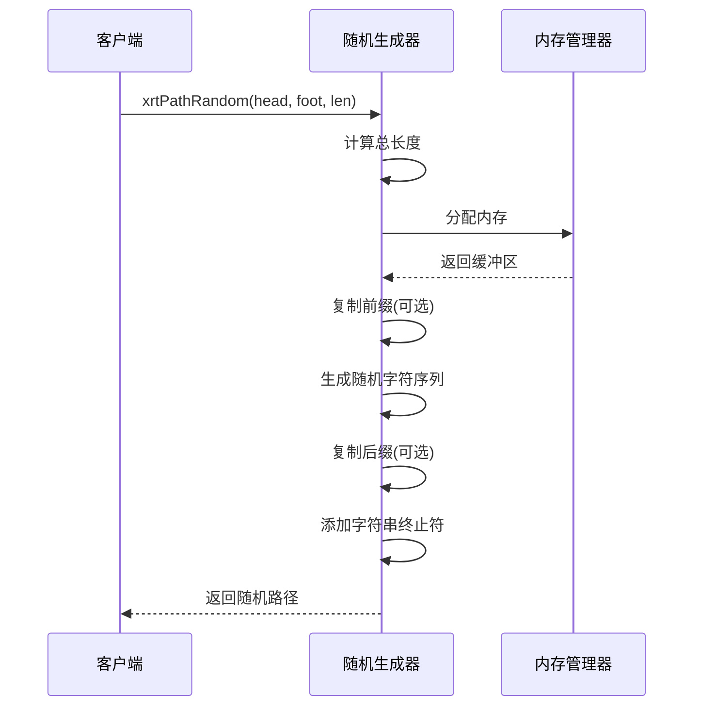

# 路径处理模块

<cite>
**本文档引用的文件**
- [lib/path.h](file://lib/path.h)
- [docs/api-path.md](file://docs/api-path.md)
- [test/test_path.h](file://test/test_path.h)
- [xrt.h](file://xrt.h)
- [lib/base.h](file://lib/base.h)
- [test.c](file://test.c)
</cite>

## 目录
1. [简介](#简介)
2. [项目结构](#项目结构)
3. [核心组件](#核心组件)
4. [架构概览](#架构概览)
5. [详细组件分析](#详细组件分析)
6. [依赖关系分析](#依赖关系分析)
7. [性能考虑](#性能考虑)
8. [故障排除指南](#故障排除指南)
9. [结论](#结论)

## 简介

XRT路径处理模块是一个轻量级的跨平台路径操作库，提供了文件路径解析、路径判断、路径拼接和随机路径生成等功能。该模块设计简洁，专注于提供最常用的路径处理操作，支持Windows和Unix风格的路径格式。

该模块的主要特点包括：
- 跨平台兼容性（Windows反斜杠 vs Unix正斜杠）
- 支持绝对路径和相对路径识别
- 提供路径信息提取功能（目录、文件名、扩展名）
- 自动路径拼接和分隔符处理
- 随机路径生成能力

## 项目结构

XRT路径处理模块位于项目的lib目录下，主要文件结构如下：



**图表来源**
- [lib/path.h](file://lib/path.h#L1-L190)
- [docs/api-path.md](file://docs/api-path.md#L1-L621)
- [test/test_path.h](file://test/test_path.h#L1-L19)

**章节来源**
- [lib/path.h](file://lib/path.h#L1-L190)
- [docs/api-path.md](file://docs/api-path.md#L1-L621)

## 核心组件

XRT路径处理模块包含以下核心功能组件：

### 1. 路径信息提取组件
- `xrtPathGetDir`: 提取路径的目录部分
- `xrtPathGetNameExt`: 获取文件名（含扩展名）
- `xrtPathGetName`: 获取文件名（不含扩展名）
- `xrtPathGetExt`: 获取文件扩展名

### 2. 路径判断组件
- `xrtPathIsAbs`: 判断路径是否为绝对路径

### 3. 路径操作组件
- `xrtPathJoin`: 拼接多个路径段
- `xrtPathRandom`: 生成随机路径字符串

### 4. 内存管理组件
- 所有返回字符串都需要使用`xrtFree`进行释放

**章节来源**
- [lib/path.h](file://lib/path.h#L4-L189)
- [docs/api-path.md](file://docs/api-path.md#L19-L421)

## 架构概览

XRT路径处理模块采用简洁的函数式架构设计，每个功能都是独立的函数，具有明确的职责分工：



**图表来源**
- [lib/path.h](file://lib/path.h#L4-L189)
- [xrt.h](file://xrt.h#L131-L184)

## 详细组件分析

### 路径信息提取组件

#### 目录提取功能 (`xrtPathGetDir`)
该函数负责从完整路径中提取目录部分，支持Windows和Unix两种路径格式。



**图表来源**
- [lib/path.h](file://lib/path.h#L66-L81)

#### 文件名提取功能 (`xrtPathGetNameExt`, `xrtPathGetName`, `xrtPathGetExt`)
这三个函数提供了不同粒度的文件名信息提取：

- `xrtPathGetNameExt`: 返回完整的文件名（包含扩展名）
- `xrtPathGetName`: 返回不包含扩展名的文件名
- `xrtPathGetExt`: 返回扩展名（不包含点号）



**图表来源**
- [lib/path.h](file://lib/path.h#L5-L61)

**章节来源**
- [lib/path.h](file://lib/path.h#L5-L61)
- [docs/api-path.md](file://docs/api-path.md#L21-L245)

### 路径判断组件

#### 绝对路径判断 (`xrtPathIsAbs`)
该函数实现了跨平台的绝对路径判断逻辑：



**图表来源**
- [lib/path.h](file://lib/path.h#L86-L100)

**章节来源**
- [lib/path.h](file://lib/path.h#L86-L100)
- [docs/api-path.md](file://docs/api-path.md#L250-L296)

### 路径操作组件

#### 路径拼接 (`xrtPathJoin`)
这是模块中最复杂的函数，负责跨平台的路径拼接：



**图表来源**
- [lib/path.h](file://lib/path.h#L142-L187)

**章节来源**
- [lib/path.h](file://lib/path.h#L142-L187)
- [docs/api-path.md](file://docs/api-path.md#L305-L364)

#### 随机路径生成 (`xrtPathRandom`)
该函数用于生成随机的路径字符串，常用于临时文件命名：



**图表来源**
- [lib/path.h](file://lib/path.h#L105-L137)

**章节来源**
- [lib/path.h](file://lib/path.h#L105-L137)
- [docs/api-path.md](file://docs/api-path.md#L367-L421)

## 依赖关系分析

XRT路径处理模块的依赖关系相对简单，主要依赖于核心运行时环境：

```mermaid
graph TB
subgraph "外部依赖"
A[标准C库<br/>stdio.h, stdlib.h, string.h]
B[平台特定库<br/>windows.h (Windows)]
end
subgraph "XRT核心"
C[xrt.h<br/>类型定义和全局数据]
D[xrtMalloc<br/>内存分配]
E[xrtFree<br/>内存释放]
F[xCore<br/>全局状态]
end
subgraph "路径处理模块"
G[xrtPathGetDir]
H[xrtPathGetNameExt]
I[xrtPathGetName]
J[xrtPathGetExt]
K[xrtPathIsAbs]
L[xrtPathJoin]
M[xrtPathRandom]
end
A --> G
A --> H
A --> I
A --> J
A --> K
A --> L
A --> M
B --> L
C --> D
C --> E
C --> F
D --> G
D --> H
D --> I
D --> J
D --> K
D --> L
D --> M
E --> G
E --> H
E --> I
E --> J
E --> K
E --> L
E --> M
```

**图表来源**
- [lib/path.h](file://lib/path.h#L1-L190)
- [xrt.h](file://xrt.h#L32-L44)

**章节来源**
- [lib/path.h](file://lib/path.h#L1-L190)
- [xrt.h](file://xrt.h#L32-L44)

## 性能考虑

### 时间复杂度分析
- **路径解析函数**: O(n)，其中n是路径字符串的长度
- **绝对路径判断**: O(n)，需要扫描整个字符串
- **路径拼接**: O(m)，其中m是所有路径段的总长度
- **随机路径生成**: O(k)，其中k是随机部分的长度

### 空间复杂度分析
- **所有返回字符串**: O(n)，需要额外的内存空间
- **路径拼接**: 最多需要4096字节的临时缓冲区
- **内存管理**: 需要调用者负责释放返回的内存

### 性能优化建议
1. **避免重复分配**: 对于频繁使用的路径，考虑缓存中间结果
2. **批量处理**: 当需要处理大量路径时，考虑使用预分配的缓冲区
3. **及时释放**: 确保及时调用`xrtFree`释放内存，避免内存泄漏
4. **参数验证**: 在调用前验证输入参数的有效性

## 故障排除指南

### 常见问题及解决方案

#### 1. 内存泄漏问题
**症状**: 程序运行一段时间后内存使用量持续增长
**原因**: 忘记调用`xrtFree`释放返回的字符串
**解决方案**: 确保对所有返回字符串调用`xrtFree`

#### 2. 路径格式不兼容
**症状**: 在不同平台上得到不同的路径结果
**原因**: 手动拼接路径而不是使用`xrtPathJoin`
**解决方案**: 使用`xrtPathJoin`函数自动处理平台差异

#### 3. 绝对路径判断错误
**症状**: Windows驱动器号路径被错误识别为相对路径
**原因**: 路径格式不符合预期
**解决方案**: 确保Windows路径使用正确的格式（如"C:\"）

#### 4. 路径过长错误
**症状**: `xrtPathJoin`返回空指针
**原因**: 拼接后的路径超过4094字符限制
**解决方案**: 检查路径长度或分批处理

**章节来源**
- [lib/path.h](file://lib/path.h#L142-L187)
- [docs/api-path.md](file://docs/api-path.md#L305-L364)

## 结论

XRT路径处理模块是一个设计简洁、功能明确的跨平台路径操作库。它提供了路径解析、路径判断、路径拼接和随机路径生成等核心功能，满足了大多数应用程序的路径处理需求。

### 主要优势
1. **跨平台兼容**: 自动处理Windows和Unix路径格式差异
2. **简单易用**: API设计直观，易于理解和使用
3. **内存安全**: 明确的内存管理要求，避免隐式内存管理
4. **性能良好**: 线性时间复杂度，适合大规模路径处理

### 使用建议
1. 始终检查函数返回值，特别是可能返回空指针的情况
2. 及时释放所有返回的字符串内存
3. 使用`xrtPathJoin`而不是手动拼接路径
4. 在跨平台环境中统一使用XRT提供的路径处理函数

该模块为XRT框架提供了坚实的基础，使得上层应用能够专注于业务逻辑而非底层的路径处理细节。