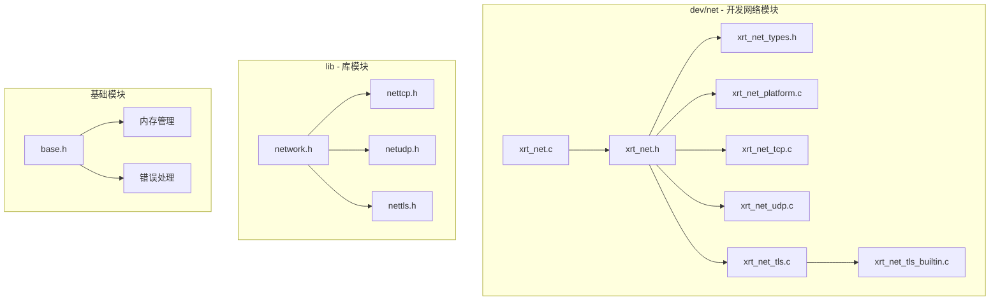
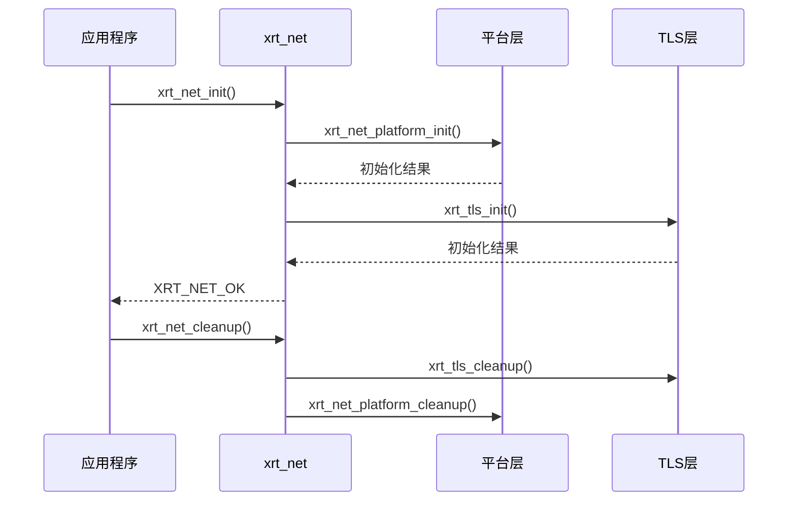
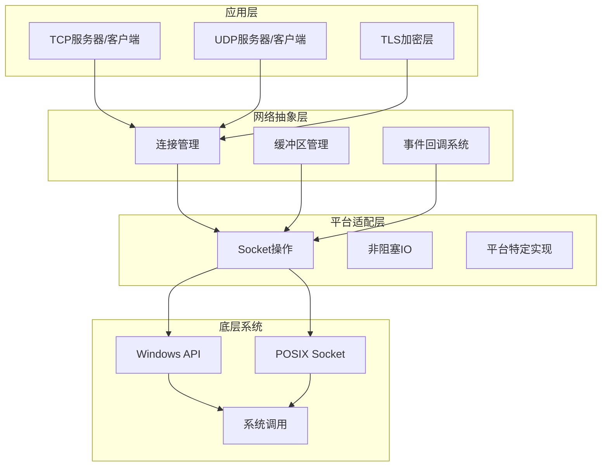
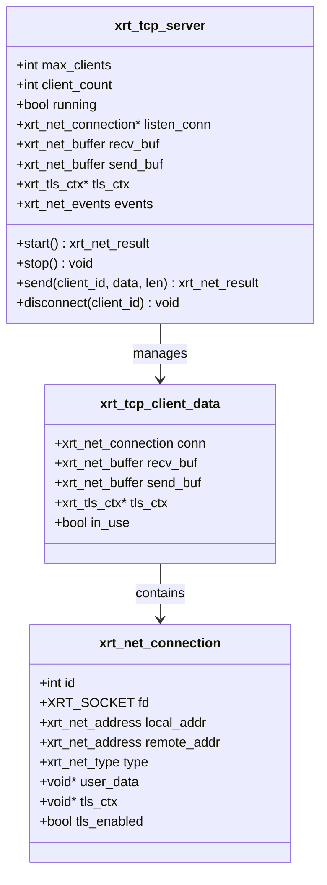
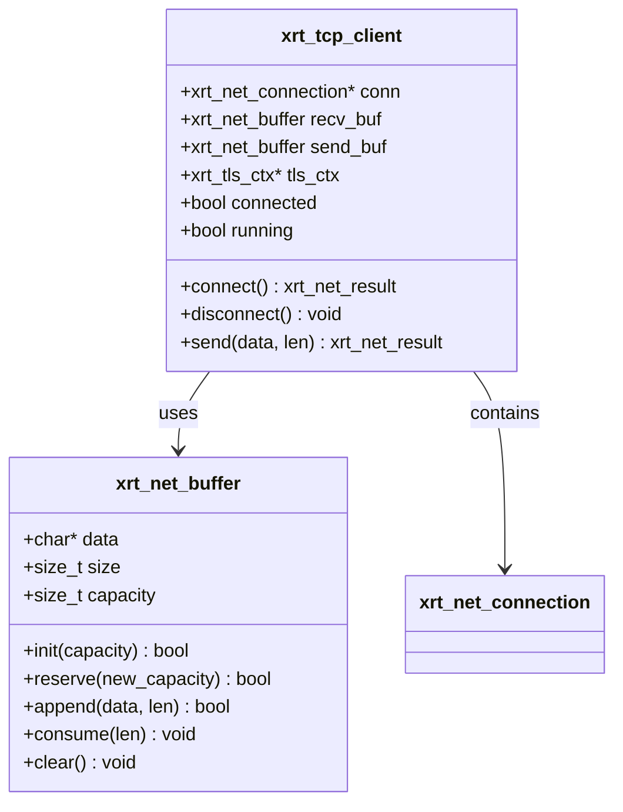
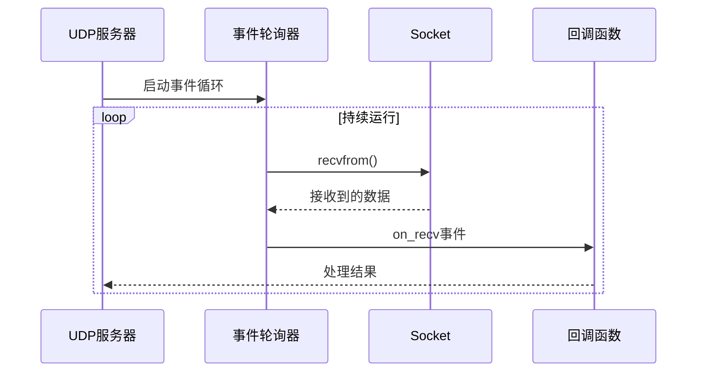
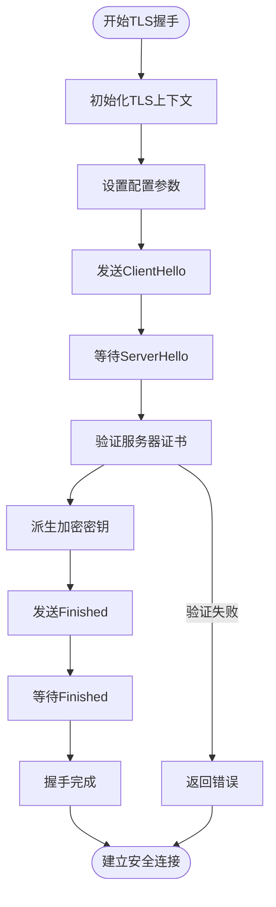
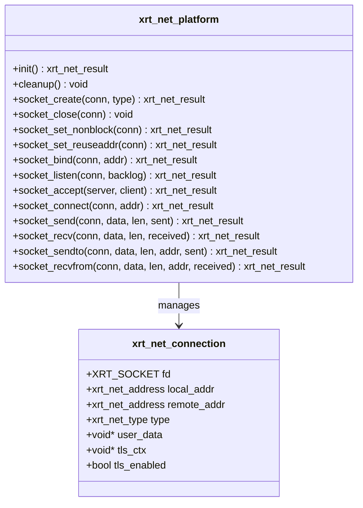
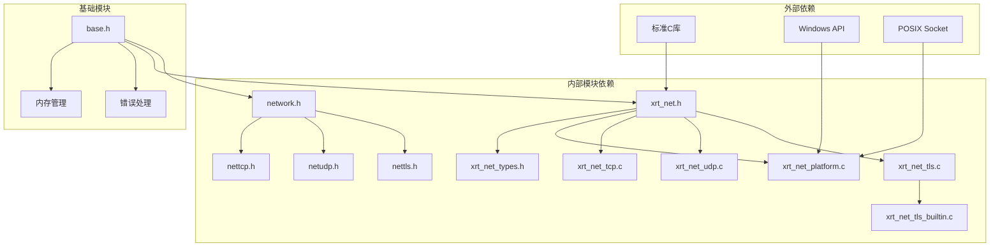
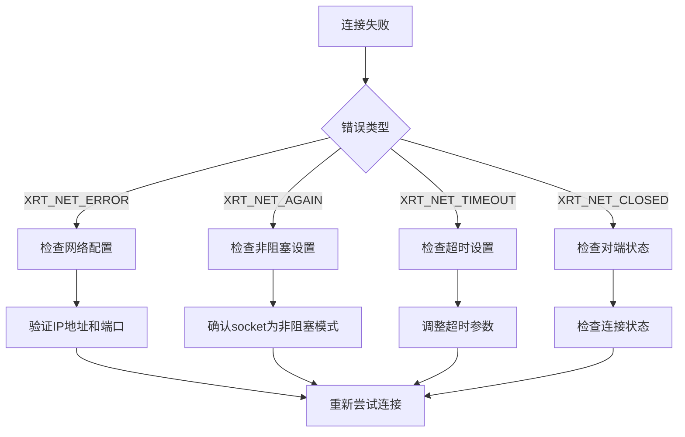

# 网络基础设施

<cite>
**本文档引用的文件**
- [xrt_net.c](file://dev/net/xrt_net.c)
- [xrt_net.h](file://dev/net/xrt_net.h)
- [xrt_net_types.h](file://dev/net/xrt_net_types.h)
- [xrt_net_platform.c](file://dev/net/xrt_net_platform.c)
- [xrt_net_tcp.c](file://dev/net/xrt_net_tcp.c)
- [xrt_net_udp.c](file://dev/net/xrt_net_udp.c)
- [xrt_net_tls.c](file://dev/net/xrt_net_tls.c)
- [xrt_net_tls_builtin.c](file://dev/net/xrt_net_tls_builtin.c)
- [network.h](file://lib/network.h)
- [nettcp.h](file://lib/nettcp.h)
- [netudp.h](file://lib/netudp.h)
- [nettls.h](file://lib/nettls.h)
- [base.h](file://lib/base.h)
- [README.md](file://README.md)
</cite>

## 目录
1. [简介](#简介)
2. [项目结构](#项目结构)
3. [核心组件](#核心组件)
4. [架构概览](#架构概览)
5. [详细组件分析](#详细组件分析)
6. [依赖关系分析](#依赖关系分析)
7. [性能考虑](#性能考虑)
8. [故障排除指南](#故障排除指南)
9. [结论](#结论)

## 简介

XRT网络基础设施是一个跨平台的C语言网络库，提供了统一的TCP/UDP/TLS网络编程接口。该库采用模块化设计，支持Windows和Linux平台，实现了高性能的网络通信能力。

该网络库的核心特点包括：
- 跨平台支持（Windows/Linux）
- 统一的API接口
- 多种传输协议支持（TCP/UDP）
- 内置TLS加密支持
- 零外部依赖设计
- 高性能内存管理

## 项目结构

网络基础设施主要分布在以下目录结构中：

**图表来源**
- [xrt_net.c](file://dev/net/xrt_net.c#L1-L26)
- [xrt_net.h](file://dev/net/xrt_net.h#L1-L14)
- [network.h](file://lib/network.h#L1-L214)

**章节来源**
- [xrt_net.c](file://dev/net/xrt_net.c#L1-L26)
- [xrt_net.h](file://dev/net/xrt_net.h#L1-L14)
- [network.h](file://lib/network.h#L1-L214)

## 核心组件

### 网络初始化系统

网络库提供了统一的初始化和清理接口：

**图表来源**
- [xrt_net.c](file://dev/net/xrt_net.c#L3-L19)
- [xrt_net_platform.c](file://dev/net/xrt_net_platform.c#L9-L36)
- [xrt_net_tls.c](file://dev/net/xrt_net_tls.c#L42-L74)

### 数据结构定义

网络库定义了核心的数据结构来表示网络连接和配置：

**章节来源**
- [xrt_net_types.h](file://dev/net/xrt_net_types.h#L27-L71)
- [xrt_net_types.h](file://dev/net/xrt_net_types.h#L89-L97)

## 架构概览

网络基础设施采用了分层架构设计，确保了良好的模块化和可维护性：

**图表来源**
- [xrt_net_platform.c](file://dev/net/xrt_net_platform.c#L38-L143)
- [xrt_net_types.h](file://dev/net/xrt_net_types.h#L50-L71)

## 详细组件分析

### TCP网络组件

TCP组件提供了完整的客户端-服务器模型实现：

#### TCP服务器架构

**图表来源**
- [xrt_net_tcp.c](file://dev/net/xrt_net_tcp.c#L20-L23)
- [xrt_net_tcp.c](file://dev/net/xrt_net_tcp.c#L28-L135)

#### TCP客户端架构

**图表来源**
- [xrt_net_tcp.c](file://dev/net/xrt_net_tcp.c#L314-L364)
- [xrt_net_types.h](file://dev/net/xrt_net_types.h#L145-L205)

**章节来源**
- [xrt_net_tcp.c](file://dev/net/xrt_net_tcp.c#L28-L313)
- [xrt_net_tcp.c](file://dev/net/xrt_net_tcp.c#L314-L534)

### UDP网络组件

UDP组件提供了无连接的网络通信能力：

#### UDP服务器实现

**图表来源**
- [xrt_net_udp.c](file://dev/net/xrt_net_udp.c#L98-L124)

**章节来源**
- [xrt_net_udp.c](file://dev/net/xrt_net_udp.c#L15-L152)

### TLS加密组件

TLS组件提供了安全的网络通信能力：

#### TLS握手流程

**图表来源**
- [xrt_net_tls_builtin.c](file://dev/net/xrt_net_tls_builtin.c#L393-L430)

**章节来源**
- [xrt_net_tls.c](file://dev/net/xrt_net_tls.c#L101-L128)
- [xrt_net_tls_builtin.c](file://dev/net/xrt_net_tls_builtin.c#L160-L240)

### 平台适配层

平台适配层确保了网络库在不同操作系统上的兼容性：

#### Socket操作抽象

**图表来源**
- [xrt_net_platform.c](file://dev/net/xrt_net_platform.c#L38-L351)

**章节来源**
- [xrt_net_platform.c](file://dev/net/xrt_net_platform.c#L9-L36)
- [xrt_net_platform.c](file://dev/net/xrt_net_platform.c#L38-L351)

## 依赖关系分析

网络基础设施的依赖关系体现了清晰的层次化设计：

**图表来源**
- [xrt_net.h](file://dev/net/xrt_net.h#L1-L14)
- [network.h](file://lib/network.h#L1-L214)

**章节来源**
- [xrt_net.h](file://dev/net/xrt_net.h#L1-L14)
- [network.h](file://lib/network.h#L1-L214)

## 性能考虑

网络基础设施在设计时充分考虑了性能优化：

### 内存管理优化

- **零拷贝设计**：TLS组件使用内置的加密原语，避免额外的内存分配
- **缓冲区预分配**：网络缓冲区采用指数增长策略，减少内存重分配次数
- **内存池架构**：利用XRT的内存池系统，提高内存分配效率

### I/O性能优化

- **非阻塞IO**：所有网络操作都使用非阻塞模式，避免阻塞线程
- **事件驱动**：采用事件轮询机制，支持高并发连接
- **平台优化**：Windows使用IOCP，Linux使用epoll/io_uring

### TLS性能优化

- **内置实现**：提供零依赖的TLS实现，避免外部库加载开销
- **硬件加速**：支持多种加密算法，可根据平台选择最优实现
- **连接复用**：支持TLS会话复用，减少握手开销

## 故障排除指南

### 常见问题诊断

#### 网络初始化失败

当网络初始化失败时，通常有以下原因：
1. 平台初始化失败（Windows: WSAStartup失败）
2. TLS库初始化失败
3. 内存分配失败

#### 连接问题排查

#### TLS握手失败

TLS握手失败的常见原因：
1. 证书验证失败
2. 加密套件不匹配
3. 协议版本不兼容
4. 密钥交换失败

**章节来源**
- [xrt_net_platform.c](file://dev/net/xrt_net_platform.c#L156-L206)
- [xrt_net_types.h](file://dev/net/xrt_net_types.h#L27-L48)

## 结论

XRT网络基础设施提供了一个功能完整、性能优异的跨平台网络编程解决方案。其设计特点包括：

### 主要优势

1. **跨平台兼容**：统一的API在Windows和Linux上提供一致的行为
2. **模块化设计**：清晰的层次结构便于维护和扩展
3. **高性能实现**：采用多种优化技术确保最佳性能
4. **零依赖设计**：减少部署复杂性和潜在的兼容性问题

### 技术特色

- **统一的事件模型**：TCP/UDP/TLS使用相同的事件回调机制
- **灵活的配置系统**：支持运行时配置和动态调整
- **完善的错误处理**：提供详细的错误信息和状态反馈
- **内存安全**：利用XRT的内存管理系统确保内存安全

### 适用场景

该网络库特别适用于：
- 需要高性能网络通信的应用程序
- 跨平台部署的网络服务
- 对安全性有要求的企业应用
- 资源受限环境下的网络解决方案

通过合理的设计和实现，XRT网络基础设施为C语言开发者提供了一个强大而易用的网络编程工具包。