# 网络事件循环管理

<cite>
**本文档引用的文件**
- [lib/netloop.h](file://lib/netloop.h)
- [lib/netpoll.h](file://lib/netpoll.h)
- [dev/net/xrt_net_types.h](file://dev/net/xrt_net_types.h)
- [dev/net/xrt_net_platform.h](file://dev/net/xrt_net_platform.h)
- [dev/net/xrt_net_platform.c](file://dev/net/xrt_net_platform.c)
- [dev/net/xrt_net_io_uring.h](file://dev/net/xrt_net_io_uring.h)
- [dev/net/xrt_net_iocp.h](file://dev/net/xrt_net_iocp.h)
- [dev/net/xrt_net_tcp.h](file://dev/net/xrt_net_tcp.h)
- [dev/net/xrt_net_udp.h](file://dev/net/xrt_net_udp.h)
- [test/test_netloop.h](file://test/test_netloop.h)
- [lib/network.h](file://lib/network.h)
</cite>

## 目录
1. [简介](#简介)
2. [项目结构](#项目结构)
3. [核心组件](#核心组件)
4. [架构概览](#架构概览)
5. [详细组件分析](#详细组件分析)
6. [依赖关系分析](#依赖关系分析)
7. [性能考虑](#性能考虑)
8. [故障排除指南](#故障排除指南)
9. [结论](#结论)

## 简介

网络事件循环管理系统是一个高性能的异步网络I/O框架，采用统一的事件循环机制管理TCP和UDP的服务器和客户端。该系统通过平台无关的抽象层，为Windows的IOCP（I/O Completion Port）和Linux的io_uring提供统一的API接口。

系统的核心设计理念是：
- **统一事件路由**：通过连接处理器实现事件的统一路由
- **平台无关性**：隐藏底层I/O模型差异
- **高性能异步I/O**：利用现代操作系统提供的高效I/O机制
- **资源池化**：优化操作对象的分配和回收

## 项目结构

该项目采用模块化的组织方式，主要分为以下几个层次：

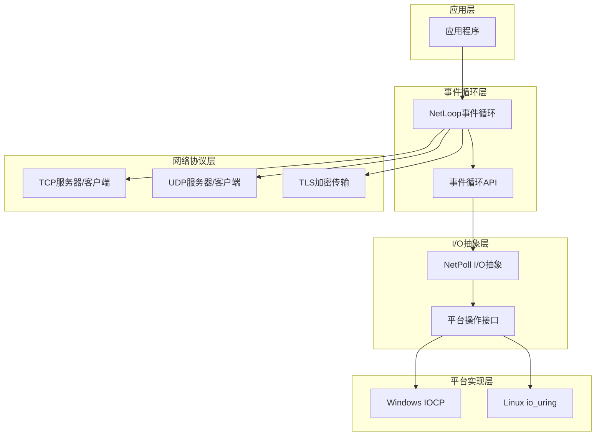

**图表来源**
- [lib/netloop.h](file://lib/netloop.h#L1-L119)
- [lib/netpoll.h](file://lib/netpoll.h#L1-L800)
- [dev/net/xrt_net_platform.h](file://dev/net/xrt_net_platform.h#L1-L44)

**章节来源**
- [lib/netloop.h](file://lib/netloop.h#L1-L119)
- [lib/netpoll.h](file://lib/netpoll.h#L1-L800)

## 核心组件

### 事件循环核心结构

事件循环系统的核心由以下关键组件构成：

#### 事件处理器结构
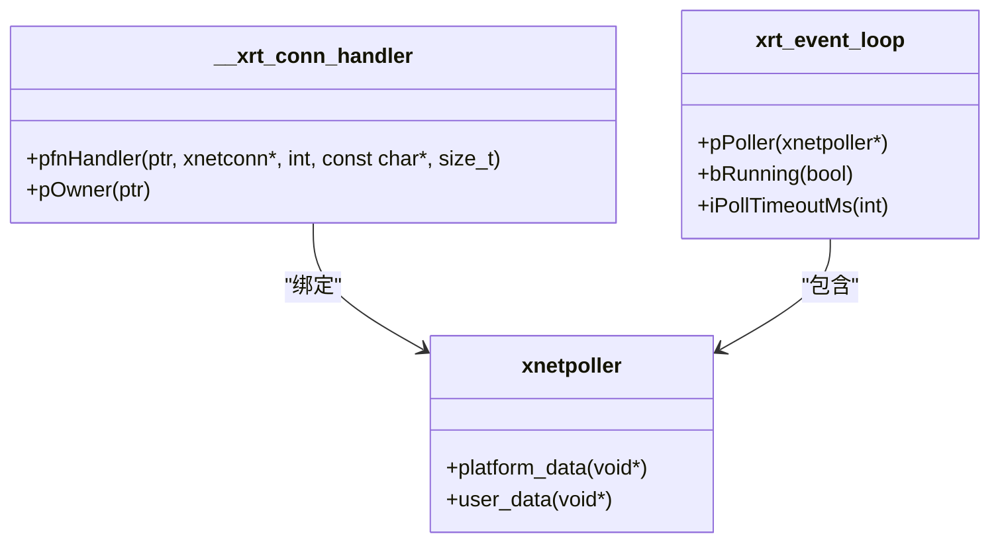

**图表来源**
- [lib/netloop.h](file://lib/netloop.h#L19-L48)

#### I/O轮询器结构
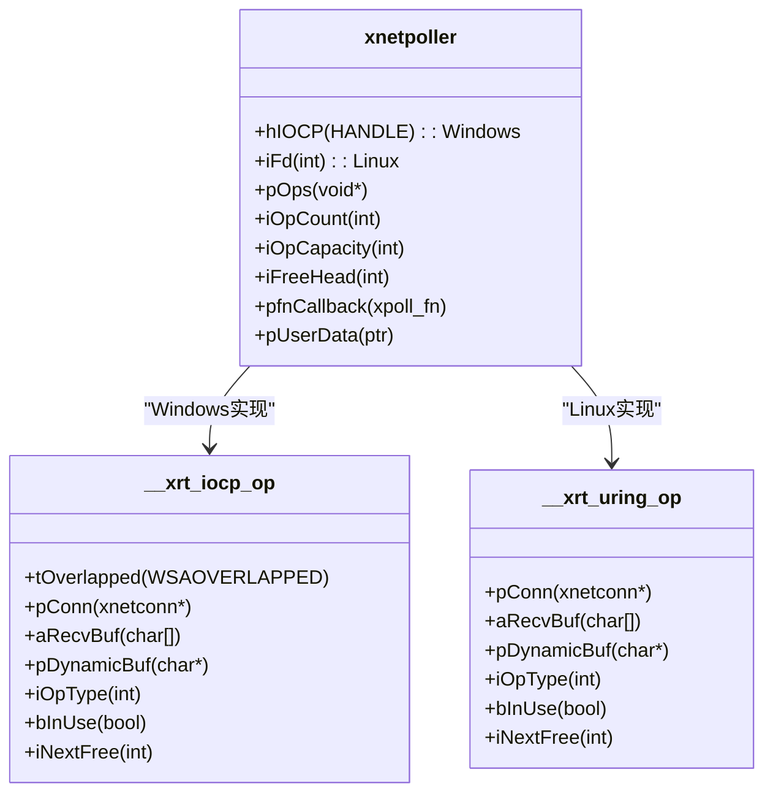

**图表来源**
- [lib/netpoll.h](file://lib/netpoll.h#L61-L73)
- [lib/netpoll.h](file://lib/netpoll.h#L43-L58)
- [lib/netpoll.h](file://lib/netpoll.h#L558-L570)

**章节来源**
- [lib/netloop.h](file://lib/netloop.h#L19-L48)
- [lib/netpoll.h](file://lib/netpoll.h#L61-L73)

## 架构概览

### 整体架构设计

系统采用分层架构设计，确保了高度的模块化和可维护性：

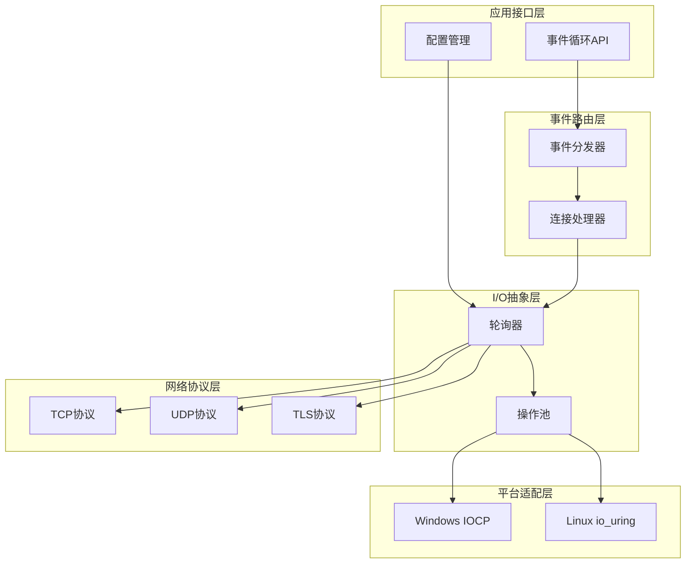

**图表来源**
- [lib/netloop.h](file://lib/netloop.h#L39-L48)
- [lib/netpoll.h](file://lib/netpoll.h#L188-L219)
- [dev/net/xrt_net_platform.h](file://dev/net/xrt_net_platform.h#L12-L18)

### 事件处理流程

```mermaid
sequenceDiagram
participant App as 应用程序
participant Loop as 事件循环
participant Poller as I/O轮询器
participant Platform as 平台实现
participant Handler as 连接处理器
App->>Loop : 创建事件循环
Loop->>Poller : 初始化轮询器
Poller->>Platform : 配置平台特定参数
loop 事件循环
App->>Loop : 运行事件循环
Loop->>Poller : 等待I/O事件
Poller->>Platform : 查询完成状态
Platform-->>Poller : 返回完成事件
Poller->>Handler : 分发事件到处理器
Handler-->>App : 调用用户回调函数
end
App->>Loop : 停止事件循环
Loop->>Poller : 唤醒轮询器
Poller->>Platform : 清理资源
```

**图表来源**
- [lib/netloop.h](file://lib/netloop.h#L83-L98)
- [lib/netpoll.h](file://lib/netpoll.h#L378-L490)

**章节来源**
- [lib/netloop.h](file://lib/netloop.h#L83-L98)
- [lib/netpoll.h](file://lib/netpoll.h#L378-L490)

## 详细组件分析

### 事件循环管理器

#### 核心API设计

事件循环管理器提供了简洁而强大的API接口：

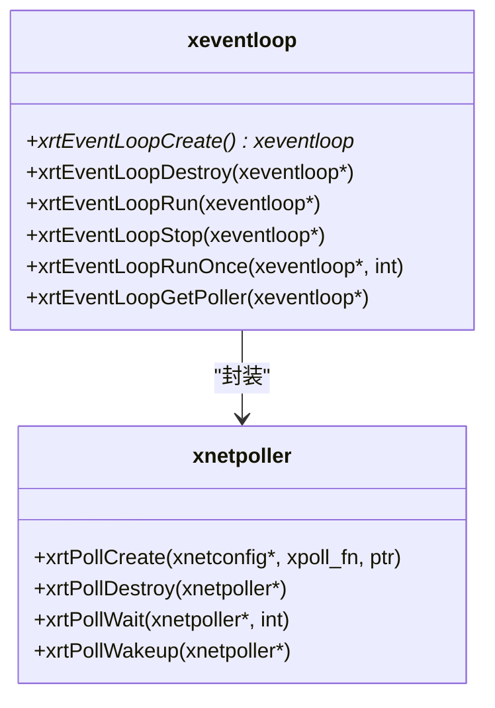

**图表来源**
- [lib/netloop.h](file://lib/netloop.h#L54-L117)

#### 事件循环生命周期

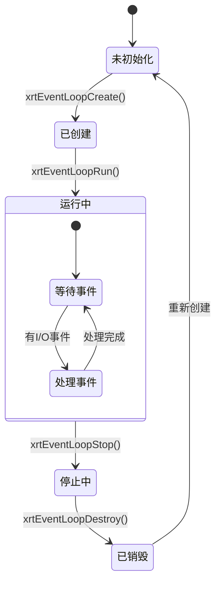

**图表来源**
- [lib/netloop.h](file://lib/netloop.h#L83-L105)

**章节来源**
- [lib/netloop.h](file://lib/netloop.h#L54-L117)

### I/O轮询器实现

#### Windows IOCP实现

Windows平台使用IOCP提供高性能的异步I/O：

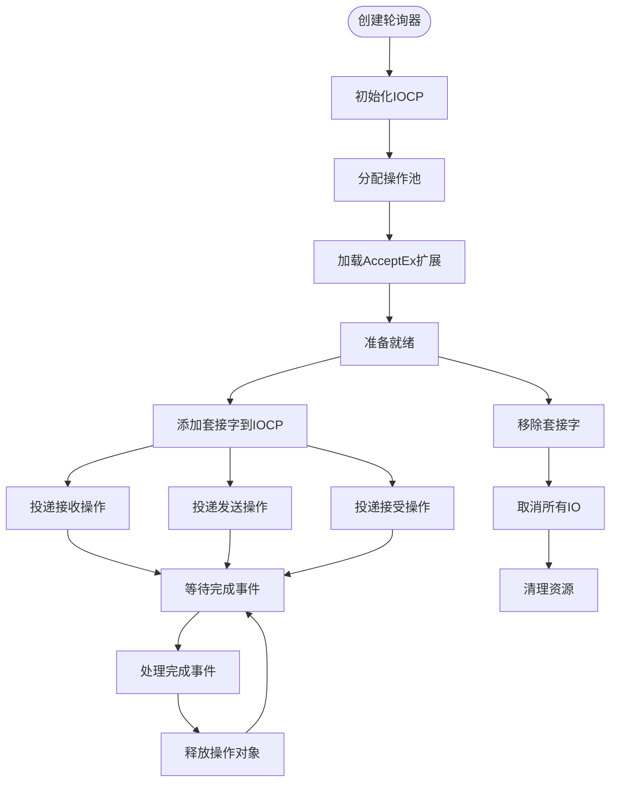

**图表来源**
- [lib/netpoll.h](file://lib/netpoll.h#L188-L242)
- [lib/netpoll.h](file://lib/netpoll.h#L266-L376)

#### Linux io_uring实现

Linux平台使用io_uring提供零拷贝的异步I/O：

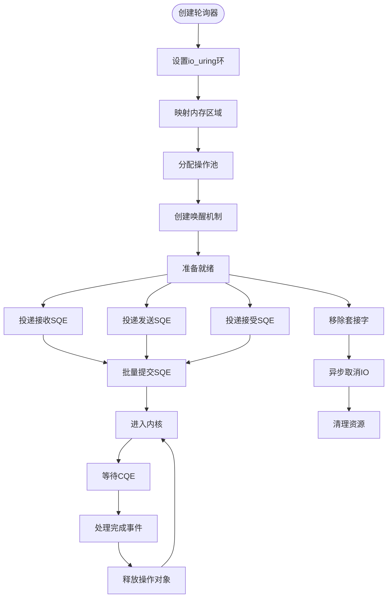

**图表来源**
- [lib/netpoll.h](file://lib/netpoll.h#L727-L816)
- [lib/netpoll.h](file://lib/netpoll.h#L991-L1095)

**章节来源**
- [lib/netpoll.h](file://lib/netpoll.h#L188-L242)
- [lib/netpoll.h](file://lib/netpoll.h#L727-L816)

### 平台抽象层

#### 平台操作接口

平台抽象层提供了统一的操作接口：

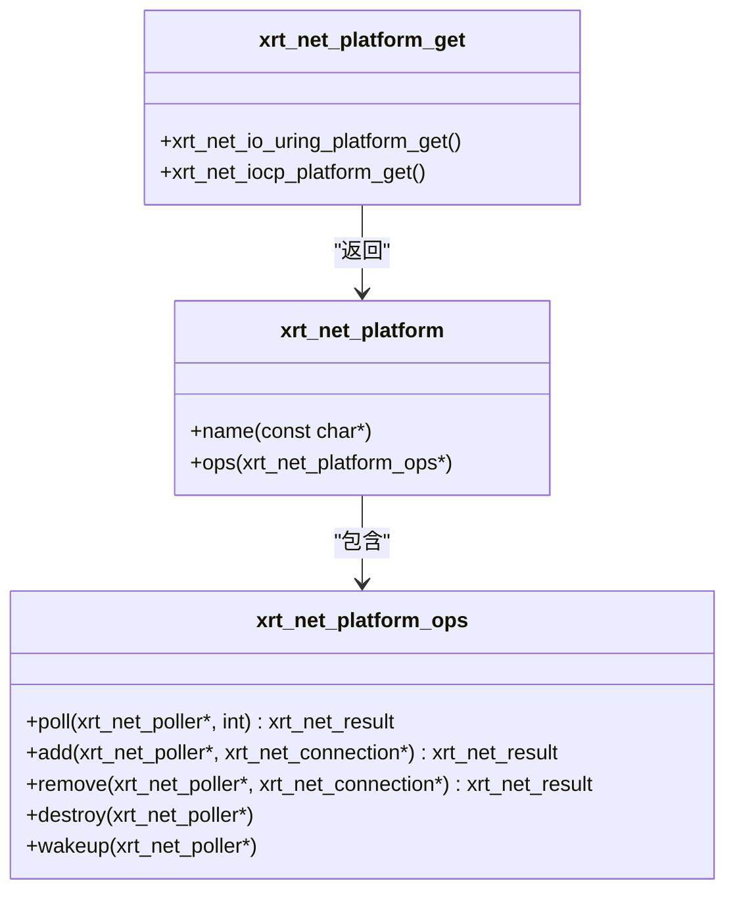

**图表来源**
- [dev/net/xrt_net_platform.h](file://dev/net/xrt_net_platform.h#L12-L28)

#### 套接字操作实现

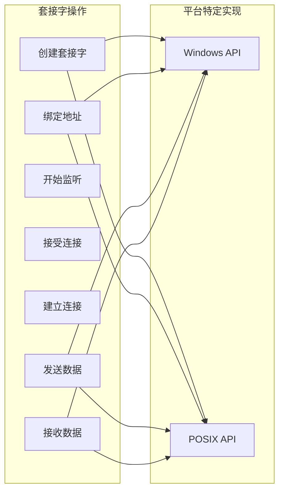

**图表来源**
- [dev/net/xrt_net_platform.c](file://dev/net/xrt_net_platform.c#L38-L351)

**章节来源**
- [dev/net/xrt_net_platform.h](file://dev/net/xrt_net_platform.h#L12-L28)
- [dev/net/xrt_net_platform.c](file://dev/net/xrt_net_platform.c#L38-L351)

### 网络协议支持

#### TCP服务器/客户端

TCP协议提供了完整的服务器和客户端实现：

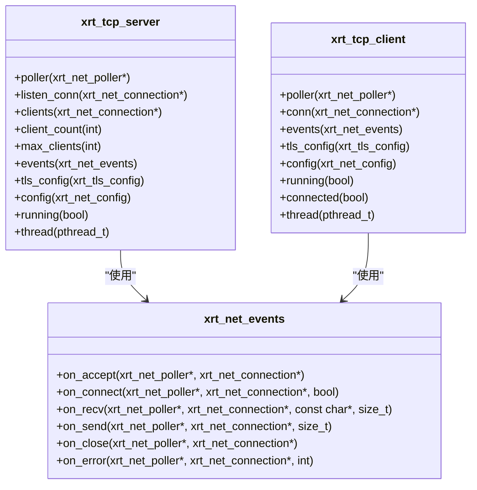

**图表来源**
- [dev/net/xrt_net_tcp.h](file://dev/net/xrt_net_tcp.h#L8-L30)

#### UDP服务器/客户端

UDP协议提供了轻量级的无连接通信：

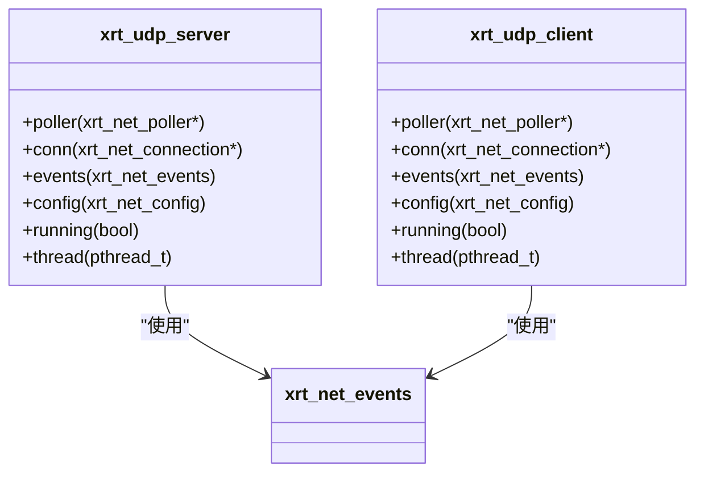

**图表来源**
- [dev/net/xrt_net_udp.h](file://dev/net/xrt_net_udp.h#L7-L23)

**章节来源**
- [dev/net/xrt_net_tcp.h](file://dev/net/xrt_net_tcp.h#L8-L30)
- [dev/net/xrt_net_udp.h](file://dev/net/xrt_net_udp.h#L7-L23)

## 依赖关系分析

### 组件依赖图

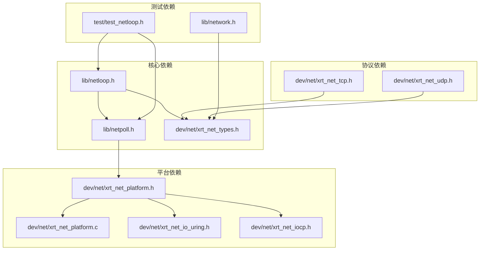

**图表来源**
- [lib/netloop.h](file://lib/netloop.h#L1-L119)
- [lib/netpoll.h](file://lib/netpoll.h#L1-L800)
- [dev/net/xrt_net_platform.h](file://dev/net/xrt_net_platform.h#L1-L44)

### 关键依赖关系

系统的关键依赖关系包括：

1. **事件循环依赖I/O轮询器**：事件循环管理器完全依赖于I/O轮询器的实现
2. **平台抽象依赖具体实现**：平台抽象层定义接口，具体平台实现提供功能
3. **协议层依赖基础类型**：TCP/UDP协议实现依赖统一的数据类型定义
4. **测试依赖核心功能**：测试模块依赖事件循环和I/O轮询器的核心功能

**章节来源**
- [lib/netloop.h](file://lib/netloop.h#L1-L119)
- [lib/netpoll.h](file://lib/netpoll.h#L1-L800)
- [dev/net/xrt_net_platform.h](file://dev/net/xrt_net_platform.h#L1-L44)

## 性能考虑

### 内存管理优化

系统采用了多种内存管理策略来优化性能：

#### 操作池设计
- **O(1)分配/释放**：使用空闲链表实现操作对象的快速分配和回收
- **动态扩容**：支持操作池的动态扩容，最大支持4096个操作对象
- **内存池化**：减少频繁的内存分配和释放开销

#### 缓冲区管理
- **固定大小缓冲区**：默认8KB的接收缓冲区，平衡内存使用和性能
- **动态缓冲区**：对于大于8KB的消息使用动态分配的缓冲区
- **零拷贝优化**：io_uring实现支持零拷贝的I/O操作

### 并发性能优化

#### 批量处理
- **Windows批处理**：使用GetQueuedCompletionStatusEx批量处理完成事件（最多64个）
- **Linux批处理**：批量提交SQE（最多256个），减少系统调用次数
- **批量唤醒**：支持批量唤醒操作，提高多线程环境下的响应性

#### 线程安全
- **互斥锁保护**：Linux实现使用pthread_mutex保护共享资源
- **原子操作**：使用原子操作保证环形缓冲区的并发访问
- **临界区保护**：Windows使用CRITICAL_SECTION保护共享状态

### 平台特定优化

#### Windows优化
- **AcceptEx扩展**：使用AcceptEx实现异步接受连接
- **重叠I/O**：充分利用Windows的重叠I/O机制
- **完成端口**：使用IOCP提供高效的事件通知

#### Linux优化
- **io_uring**：直接使用syscall调用内核接口，避免额外的库依赖
- **mmap环**：使用mmap映射ring缓冲区，提高内存访问效率
- **eventfd**：使用eventfd实现高效的线程间唤醒

## 故障排除指南

### 常见问题诊断

#### 事件循环无法停止

**症状**：调用`xrtEventLoopStop()`后事件循环仍然运行

**可能原因**：
1. 线程同步问题导致停止标志未正确设置
2. I/O轮询器未正确响应唤醒请求
3. 事件循环处于busy-wait状态

**解决方案**：
- 确保在正确的线程上调用停止函数
- 检查`xrtPollWakeup()`的调用是否成功
- 验证事件循环的运行标志状态

#### I/O操作超时

**症状**：`xrtPollWait()`返回超时或错误

**可能原因**：
1. 超时时间设置过短
2. 网络连接异常
3. 平台特定的I/O问题

**解决方案**：
- 调整超时参数
- 检查网络连接状态
- 查看平台特定的错误码

#### 内存泄漏问题

**症状**：长时间运行后内存使用持续增长

**可能原因**：
1. 操作对象未正确释放
2. 动态缓冲区未释放
3. 线程资源未正确清理

**解决方案**：
- 确保在销毁轮询器时释放所有资源
- 检查动态缓冲区的释放逻辑
- 使用调试工具检测内存泄漏

### 调试技巧

#### 启用详细日志
- 在开发环境中启用详细的日志输出
- 监控事件循环的状态变化
- 记录I/O操作的执行时间和结果

#### 性能监控
- 监控操作池的使用率
- 跟踪内存分配和释放模式
- 分析事件处理的延迟

**章节来源**
- [test/test_netloop.h](file://test/test_netloop.h#L21-L86)

## 结论

网络事件循环管理系统是一个设计精良的高性能异步I/O框架，具有以下特点：

### 主要优势

1. **平台无关性**：通过抽象层实现了Windows和Linux平台的统一支持
2. **高性能设计**：采用现代操作系统提供的高效I/O机制
3. **内存优化**：通过操作池和零拷贝技术优化内存使用
4. **易于使用**：提供了简洁的API接口，降低了使用复杂度

### 技术创新

1. **统一事件路由**：通过连接处理器实现事件的统一管理和分发
2. **智能资源管理**：自动管理操作对象的生命周期
3. **平台特定优化**：针对不同平台的特点进行专门优化

### 应用场景

该系统适用于需要高性能网络通信的应用场景，包括：
- 高并发Web服务器
- 实时通信系统
- 分布式应用服务
- 游戏服务器
- 物联网设备通信

通过合理的设计和优化，该系统能够满足各种高性能网络应用的需求，为开发者提供了一个可靠、高效的网络编程基础框架。