# 网络基础设施

<cite>
**本文档引用的文件**
- [xrt_net.c](file://dev/net/xrt_net.c)
- [xrt_net.h](file://dev/net/xrt_net.h)
- [xrt_net.h](file://xrt.h)
- [xrt_net_types.h](file://dev/net/xrt_net_types.h)
- [xrt_net_platform.c](file://dev/net/xrt_net_platform.c)
- [xrt_net_tcp.c](file://dev/net/xrt_net_tcp.c)
- [xrt_net_udp.c](file://dev/net/xrt_net_udp.c)
- [xrt_net_tls.c](file://dev/net/xrt_net_tls.c)
- [xrt_net_tls_builtin.c](file://dev/net/xrt_net_tls_builtin.c)
- [netpoll.h](file://lib/netpoll.h)
- [netsock.h](file://lib/netsock.h)
- [netloop.h](file://lib/netloop.h)
- [nettcp.h](file://lib/nettcp.h)
- [netudp.h](file://lib/netudp.h)
- [nettls.h](file://lib/nettls.h)
- [nethttp.h](file://lib/nethttp.h)
- [network.h](file://lib/network.h)
- [base.h](file://lib/base.h)
- [README.md](file://README.md)
- [network_optimization_round2_spec.md](file://network_optimization_round2_spec.md)
- [test_nethttp.h](file://test/test_nethttp.h)
</cite>

## 更新摘要
**所做更改**
- 更新了netpoll轮询子系统的动态操作池实现
- 新增了io_uring唤醒机制的重新设计
- 优化了PollRemove操作为O(1)直接取消
- 添加了TCP连接默认启用TCP_NODELAY的配置
- 重构了TLS握手过程，消除轮询睡眠循环
- 引入了完整的HTTP/HTTPS客户端实现模块
- 更新了Windows KeepAlive参数配置

## 目录
1. [简介](#简介)
2. [项目结构](#项目结构)
3. [核心组件](#核心组件)
4. [架构概览](#架构概览)
5. [详细组件分析](#详细组件分析)
6. [依赖关系分析](#依赖关系分析)
7. [性能考虑](#性能考虑)
8. [故障排除指南](#故障排除指南)
9. [结论](#结论)

## 简介

XRT网络基础设施是一个跨平台的C语言网络库，提供了统一的TCP/UDP/TLS网络编程接口。该库采用模块化设计，支持Windows和Linux平台，实现了高性能的网络通信能力。

**更新** 第二轮网络优化引入了多项重要改进：动态操作池系统、优化的io_uring唤醒机制、PollRemove的O(1)直接取消、TCP_NODELAY默认启用、TLS握手重构以及完整的HTTP客户端实现。

该网络库的核心特点包括：
- 跨平台支持（Windows/Linux）
- 统一的API接口
- 多种传输协议支持（TCP/UDP）
- 内置TLS加密支持
- 零外部依赖设计
- 高性能内存管理
- **新增** 完整的HTTP/HTTPS客户端实现
- **新增** 动态优化的轮询子系统

## 项目结构

网络基础设施主要分布在以下目录结构中：

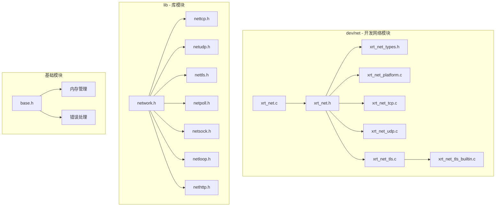

**图表来源**
- [xrt_net.c](file://dev/net/xrt_net.c#L1-L26)
- [xrt_net.h](file://dev/net/xrt_net.h#L1-L14)
- [network.h](file://lib/network.h#L1-L214)

**章节来源**
- [xrt_net.c](file://dev/net/xrt_net.c#L1-L26)
- [xrt_net.h](file://dev/net/xrt_net.h#L1-L14)
- [network.h](file://lib/network.h#L1-L214)

## 核心组件

### 网络初始化系统

网络库提供了统一的初始化和清理接口：

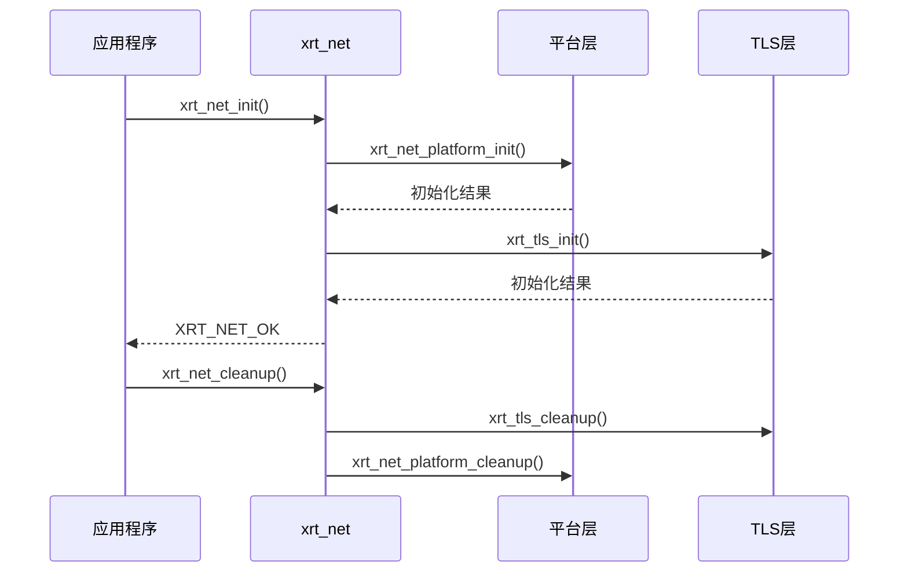

**图表来源**
- [xrt_net.c](file://dev/net/xrt_net.c#L3-L19)
- [xrt_net_platform.c](file://dev/net/xrt_net_platform.c#L9-L36)
- [xrt_net_tls.c](file://dev/net/xrt_net_tls.c#L42-L74)

### 数据结构定义

网络库定义了核心的数据结构来表示网络连接和配置：

**章节来源**
- [xrt_net_types.h](file://dev/net/xrt_net_types.h#L27-L71)
- [xrt_net_types.h](file://dev/net/xrt_net_types.h#L89-L97)

### 配置系统更新

**新增** 配置系统现在支持更多网络优化选项：

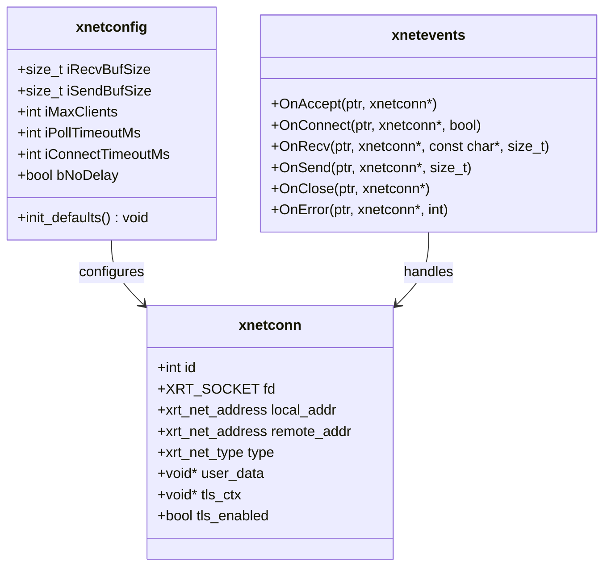

**图表来源**
- [xrt.h](file://xrt.h#L1436-L1443)
- [xrt.h](file://xrt.h#L1420-L1422)

**章节来源**
- [xrt.h](file://xrt.h#L1436-L1454)

## 架构概览

网络基础设施采用了分层架构设计，确保了良好的模块化和可维护性：

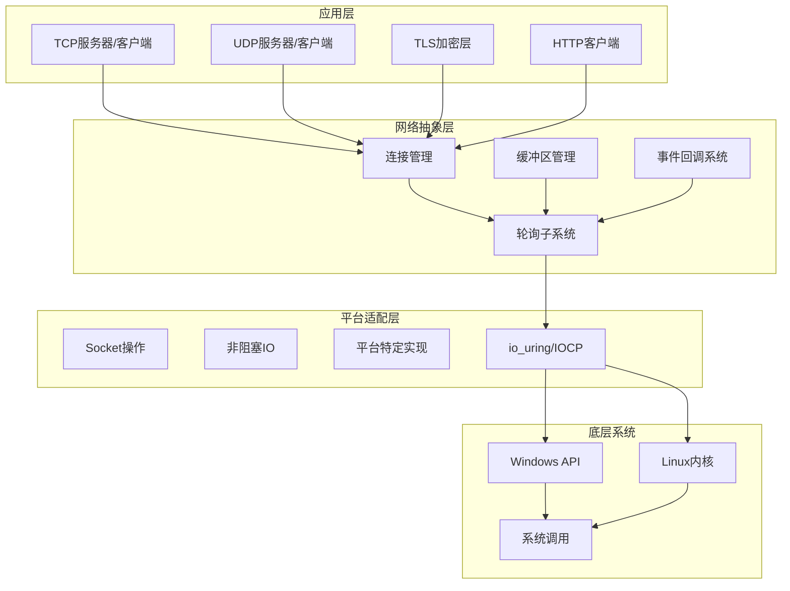

**图表来源**
- [xrt_net_platform.c](file://dev/net/xrt_net_platform.c#L38-L143)
- [xrt_net_types.h](file://dev/net/xrt_net_types.h#L50-L71)

## 详细组件分析

### TCP网络组件

TCP组件提供了完整的客户端-服务器模型实现：

#### TCP服务器架构

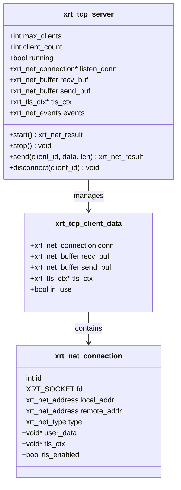

**图表来源**
- [xrt_net_tcp.c](file://dev/net/xrt_net_tcp.c#L20-L23)
- [xrt_net_tcp.c](file://dev/net/xrt_net_tcp.c#L28-L135)

#### TCP客户端架构

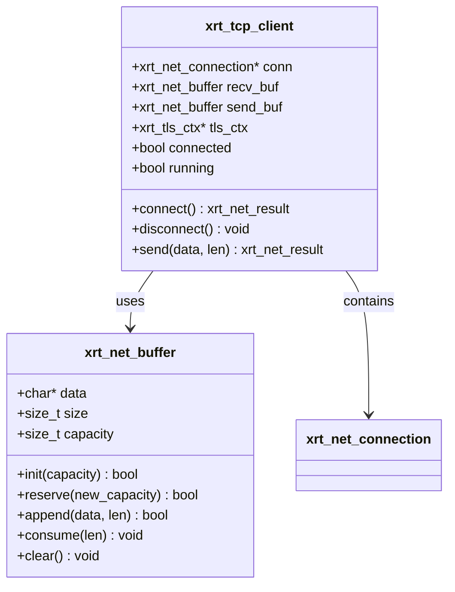

**图表来源**
- [xrt_net_tcp.c](file://dev/net/xrt_net_tcp.c#L314-L364)
- [xrt_net_types.h](file://dev/net/xrt_net_types.h#L145-L205)

**章节来源**
- [xrt_net_tcp.c](file://dev/net/xrt_net_tcp.c#L28-L313)
- [xrt_net_tcp.c](file://dev/net/xrt_net_tcp.c#L314-L534)

### UDP网络组件

UDP组件提供了无连接的网络通信能力：

#### UDP服务器实现

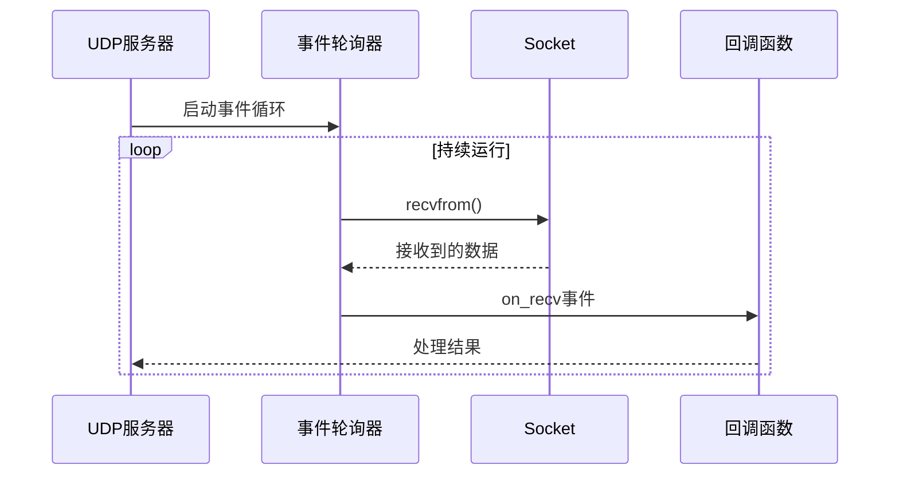

**图表来源**
- [xrt_net_udp.c](file://dev/net/xrt_net_udp.c#L98-L124)

**章节来源**
- [xrt_net_udp.c](file://dev/net/xrt_net_udp.c#L15-L152)

### TLS加密组件

TLS组件提供了安全的网络通信能力：

#### TLS握手流程

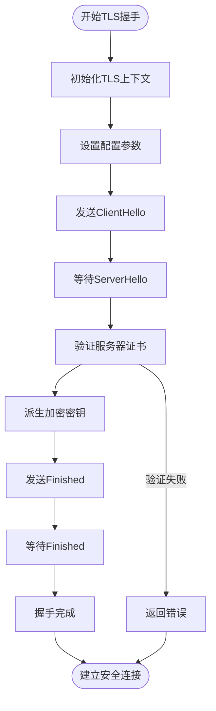

**图表来源**
- [xrt_net_tls_builtin.c](file://dev/net/xrt_net_tls_builtin.c#L393-L430)

**章节来源**
- [xrt_net_tls.c](file://dev/net/xrt_net_tls.c#L101-L128)
- [xrt_net_tls_builtin.c](file://dev/net/xrt_net_tls_builtin.c#L160-L240)

### 平台适配层

平台适配层确保了网络库在不同操作系统上的兼容性：

#### Socket操作抽象

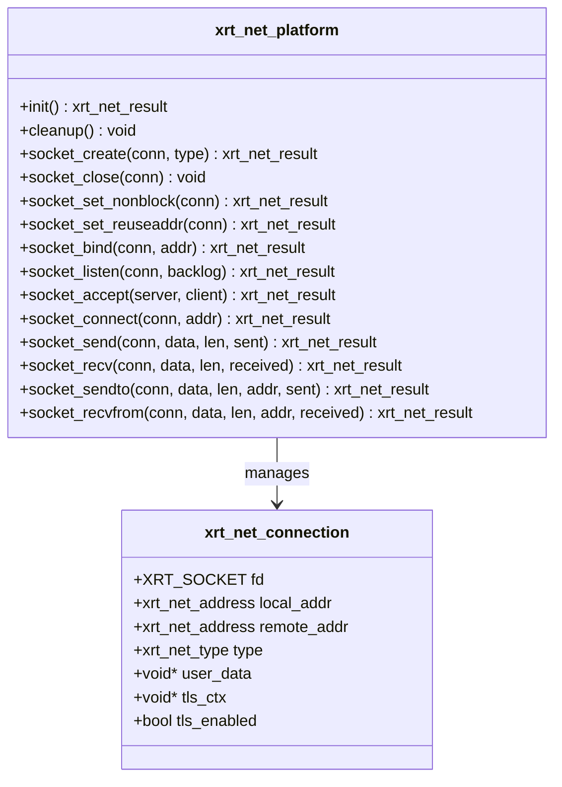

**图表来源**
- [xrt_net_platform.c](file://dev/net/xrt_net_platform.c#L38-L351)

**章节来源**
- [xrt_net_platform.c](file://dev/net/xrt_net_platform.c#L9-L36)
- [xrt_net_platform.c](file://dev/net/xrt_net_platform.c#L38-L351)

### 轮询子系统优化

**新增** 轮询子系统经过重大优化，引入了动态操作池和改进的唤醒机制：

#### 动态操作池架构

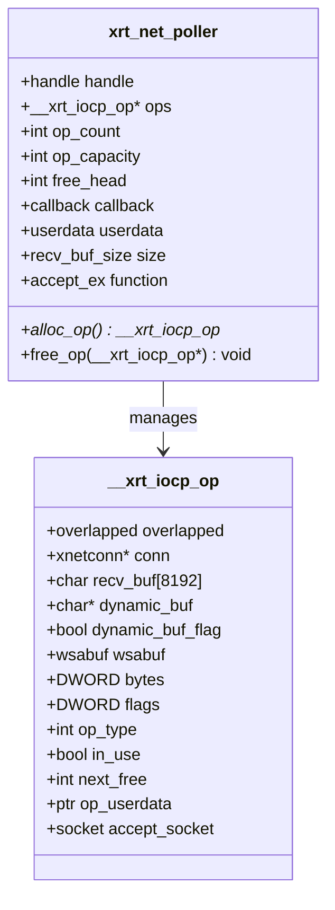

**图表来源**
- [netpoll.h](file://lib/netpoll.h#L61-L73)
- [netpoll.h](file://lib/netpoll.h#L76-L160)

#### io_uring唤醒机制

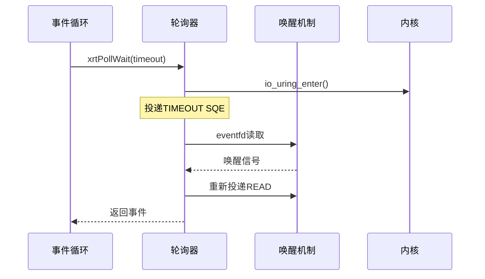

**图表来源**
- [netpoll.h](file://lib/netpoll.h#L658-L669)
- [netpoll.h](file://lib/netpoll.h#L1035-L1040)

**章节来源**
- [netpoll.h](file://lib/netpoll.h#L30-L32)
- [netpoll.h](file://lib/netpoll.h#L106-L160)
- [netpoll.h](file://lib/netpoll.h#L658-L725)
- [netpoll.h](file://lib/netpoll.h#L861-L878)
- [netpoll.h](file://lib/netpoll.h#L991-L1095)

### HTTP客户端模块

**新增** 完整的HTTP/HTTPS客户端实现：

#### HTTP请求执行流程

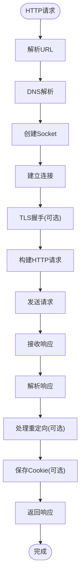

**图表来源**
- [nethttp.h](file://lib/nethttp.h#L653-L737)

**章节来源**
- [nethttp.h](file://lib/nethttp.h#L1-L15)
- [nethttp.h](file://lib/nethttp.h#L115-L227)
- [nethttp.h](file://lib/nethttp.h#L653-L800)

### TCP连接优化

**更新** TCP连接现在默认启用TCP_NODELAY，并支持连接超时配置：

#### TCP连接建立流程

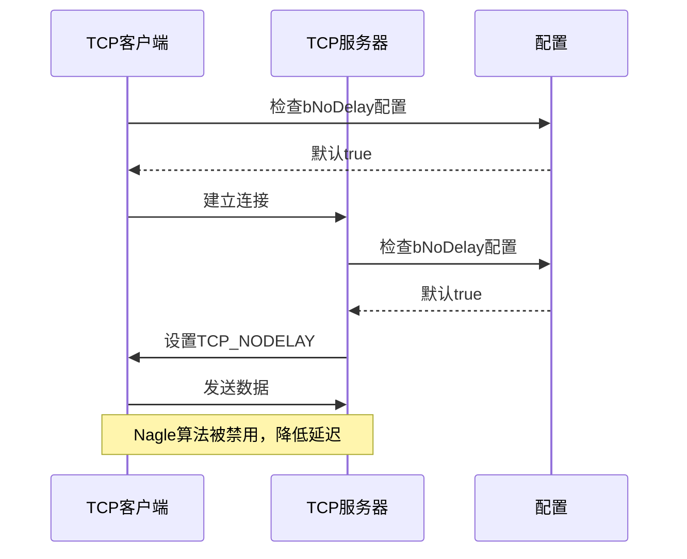

**图表来源**
- [nettcp.h](file://lib/nettcp.h#L254-L257)
- [xrt.h](file://xrt.h#L1442)

**章节来源**
- [nettcp.h](file://lib/nettcp.h#L254-L257)
- [xrt.h](file://xrt.h#L1442)

## 依赖关系分析

网络基础设施的依赖关系体现了清晰的层次化设计：

```mermaid
graph TB
subgraph "外部依赖"
A[标准C库]
B[Windows API]
C[POSIX Socket]
D[Linux内核(io_uring)]
E[系统调用]
end
subgraph "内部模块依赖"
F[xrt_net.h] --> G[xrt_net_types.h]
F --> H[xrt_net_platform.c]
F --> I[xrt_net_tcp.c]
F --> J[xrt_net_udp.c]
F --> K[xrt_net_tls.c]
K --> L[xrt_net_tls_builtin.c]
M[network.h] --> N[nettcp.h]
M --> O[netudp.h]
M --> P[nettls.h]
M --> Q[netpoll.h]
M --> R[netsock.h]
M --> S[netloop.h]
M --> T[nethttp.h]
end
subgraph "基础模块"
U[base.h] --> V[内存管理]
U --> W[错误处理]
end
A --> F
B --> H
C --> H
D --> Q
E --> D
U --> F
U --> M
```

**图表来源**
- [xrt_net.h](file://dev/net/xrt_net.h#L1-L14)
- [network.h](file://lib/network.h#L1-L214)

**章节来源**
- [xrt_net.h](file://dev/net/xrt_net.h#L1-L14)
- [network.h](file://lib/network.h#L1-L214)

## 性能考虑

网络基础设施在设计时充分考虑了性能优化：

### 内存管理优化

**更新** 操作池现在采用动态扩容策略：

- **动态扩容**：初始64个槽位，满时2倍扩容至最大4096个槽位
- **内存节省**：相比固定32MB分配，按需分配减少内存浪费
- **页面触碰优化**：避免预分配导致的页面触碰开销

### I/O性能优化

**更新** 轮询子系统性能显著提升：

- **PollRemove优化**：从O(n)线性扫描优化为O(1)直接取消
  - Windows：使用CancelIoEx直接取消所有IO操作
  - Linux：使用IORING_OP_ASYNC_CANCEL异步取消
- **批量提交**：io_uring支持批量SQE提交，减少系统调用开销
- **优化的唤醒机制**：使用IORING_OP_READ将eventfd注册到io_uring

### TLS性能优化

**更新** TLS握手过程完全重构：

- **事件驱动握手**：替代原有的10ms轮询睡眠循环
- **select等待**：使用select等待socket可读事件推进状态机
- **CPU利用率提升**：避免CPU空转，握手延迟从5秒降至秒级

### HTTP客户端性能

**新增** HTTP客户端模块提供高效的数据传输：

- **同步阻塞模型**：简化API设计，适合简单应用场景
- **自动重定向**：支持HTTP 30x重定向处理
- **Cookie管理**：内置Cookie持久化和自动管理
- **Chunked传输**：支持HTTP分块传输编码

**章节来源**
- [network_optimization_round2_spec.md](file://network_optimization_round2_spec.md#L29-L32)
- [network_optimization_round2_spec.md](file://network_optimization_round2_spec.md#L34-L37)
- [network_optimization_round2_spec.md](file://network_optimization_round2_spec.md#L43-L45)

## 故障排除指南

### 常见问题诊断

#### 网络初始化失败

当网络初始化失败时，通常有以下原因：
1. 平台初始化失败（Windows: WSAStartup失败）
2. TLS库初始化失败
3. 内存分配失败

#### 连接问题排查

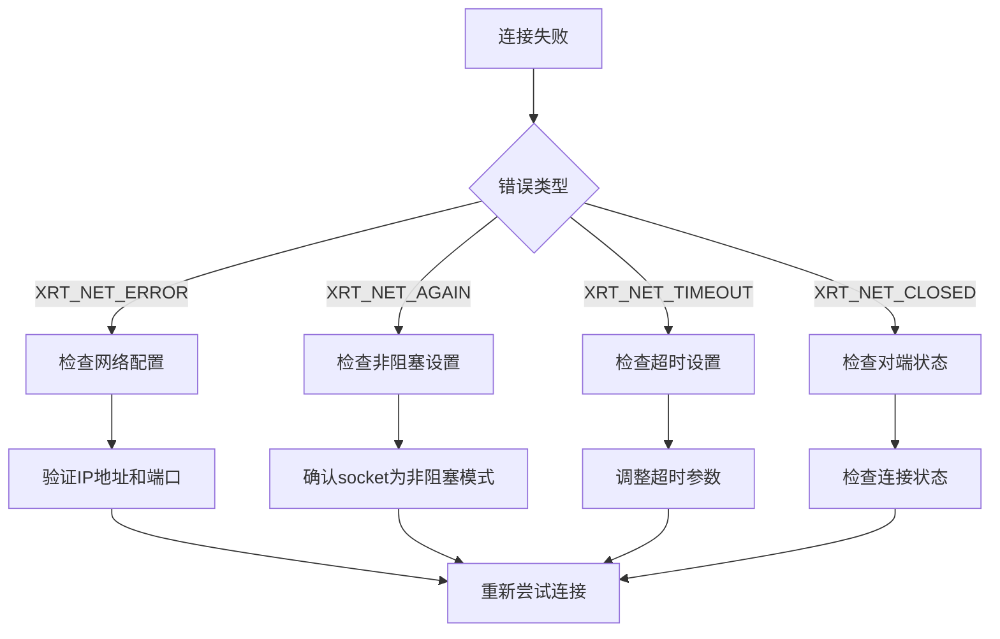

#### TLS握手失败

**更新** TLS握手失败的诊断方法：

1. **握手超时**：检查连接超时设置，确认网络延迟
2. **证书验证失败**：检查证书链和主机名验证
3. **加密套件不匹配**：确认客户端和服务端支持的套件
4. **轮询问题**：确认事件循环正常运行

#### 轮询子系统问题

**新增** 轮询子系统故障排除：

1. **PollRemove失效**：确认使用新的O(1)取消机制
2. **唤醒机制异常**：检查eventfd和wakeup read操作
3. **操作池溢出**：监控操作池使用情况，避免超过4096限制

**章节来源**
- [xrt_net_platform.c](file://dev/net/xrt_net_platform.c#L156-L206)
- [xrt_net_types.h](file://dev/net/xrt_net_types.h#L27-L48)

## 结论

XRT网络基础设施提供了一个功能完整、性能优异的跨平台网络编程解决方案。经过第二轮优化，系统在多个方面实现了重大改进：

### 主要优势

1. **跨平台兼容**：统一的API在Windows和Linux上提供一致的行为
2. **模块化设计**：清晰的层次结构便于维护和扩展
3. **高性能实现**：采用多种优化技术确保最佳性能
4. **零依赖设计**：减少部署复杂性和潜在的兼容性问题
5. **新增** 完整的HTTP客户端支持，满足现代Web应用需求

### 技术特色

- **统一的事件模型**：TCP/UDP/TLS使用相同的事件回调机制
- **灵活的配置系统**：支持运行时配置和动态调整
- **完善的错误处理**：提供详细的错误信息和状态反馈
- **内存安全**：利用XRT的内存管理系统确保内存安全
- **动态优化**：操作池按需扩容，避免内存浪费
- **事件驱动TLS**：消除轮询睡眠，提升握手效率

### 适用场景

该网络库特别适用于：
- 需要高性能网络通信的应用程序
- 跨平台部署的网络服务
- 对安全性有要求的企业应用
- 资源受限环境下的网络解决方案
- **新增** 需要HTTP/HTTPS客户端功能的应用

通过合理的设计和实现，XRT网络基础设施为C语言开发者提供了一个强大而易用的网络编程工具包，特别是在第二轮优化后，其性能和功能都得到了显著提升。