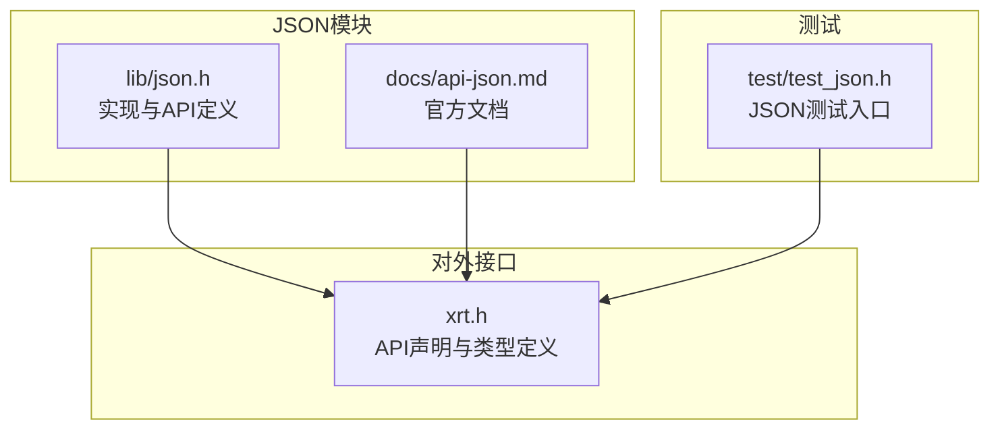
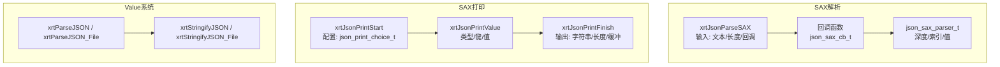
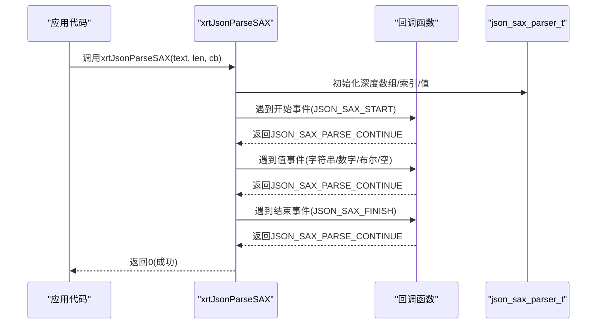
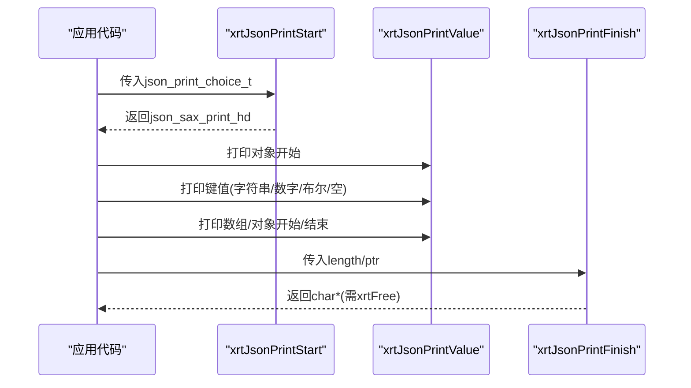
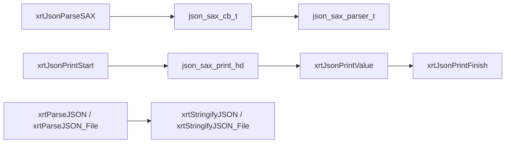

# API参考手册

<cite>
**本文引用的文件**
- [lib/json.h](file://lib/json.h)
- [docs/api-json.md](file://docs/api-json.md)
- [xrt.h](file://xrt.h)
- [test/test_json.h](file://test/test_json.h)
</cite>

## 目录
1. [简介](#简介)
2. [项目结构](#项目结构)
3. [核心组件](#核心组件)
4. [架构总览](#架构总览)
5. [详细组件分析](#详细组件分析)
6. [依赖关系分析](#依赖关系分析)
7. [性能考量](#性能考量)
8. [故障排查指南](#故障排查指南)
9. [结论](#结论)
10. [附录](#附录)

## 简介
本手册面向XRT JSON处理模块，提供完整的API参考与使用指南。涵盖：
- SAX解析API：xrtJsonParseSAX及其回调机制
- SAX打印API：xrtJsonPrint*系列，含句柄生命周期管理
- 辅助函数：字符串信息更新、便捷打印宏等
- 错误处理与最佳实践
- 性能配置参数与调优建议

## 项目结构
XRT JSON模块位于lib目录下的json.h，配套文档位于docs/api-json.md，对外API声明在xrt.h中。测试样例位于test/test_json.h。

图表来源
- [lib/json.h](file://lib/json.h#L1-L200)
- [docs/api-json.md](file://docs/api-json.md#L1-L50)
- [xrt.h](file://xrt.h#L2380-L2487)
- [test/test_json.h](file://test/test_json.h#L1-L105)

章节来源
- [lib/json.h](file://lib/json.h#L1-L200)
- [docs/api-json.md](file://docs/api-json.md#L1-L50)
- [xrt.h](file://xrt.h#L2380-L2487)
- [test/test_json.h](file://test/test_json.h#L1-L105)

## 核心组件
- JSON类型系统：JSON_NULL、JSON_BOOL、JSON_INT、JSON_HEX、JSON_LINT、JSON_LHEX、JSON_DOUBLE、JSON_STRING、JSON_ARRAY、JSON_OBJECT
- SAX解析器状态：json_sax_parser_t，包含深度数组、当前索引、当前值
- SAX回调返回值：JSON_SAX_PARSE_CONTINUE、JSON_SAX_PARSE_STOP
- SAX打印句柄：json_sax_print_t，封装打印缓冲、深度栈、格式化标志等
- 打印配置：json_print_choice_t，控制初始容量、扩容步长、格式化等

章节来源
- [lib/json.h](file://lib/json.h#L30-L120)
- [lib/json.h](file://lib/json.h#L547-L560)
- [docs/api-json.md](file://docs/api-json.md#L28-L116)

## 架构总览
XRT JSON采用“SAX流式解析 + Value动态类型”的双通道设计：
- SAX解析：逐事件回调，低内存占用，适合大文件与高性能场景
- Value系统：以xvalue为中心的树形结构，便于读写与修改

图表来源
- [lib/json.h](file://lib/json.h#L1557-L1596)
- [lib/json.h](file://lib/json.h#L741-L764)
- [lib/json.h](file://lib/json.h#L562-L739)
- [lib/json.h](file://lib/json.h#L1925-L1966)
- [docs/api-json.md](file://docs/api-json.md#L118-L251)

## 详细组件分析

### SAX解析API：xrtJsonParseSAX
- 函数原型
  - XXAPI int xrtJsonParseSAX(str text, size_t str_len, json_sax_cb_t cb)
- 参数
  - text：JSON字符串
  - str_len：字符串长度（0表示自动计算）
  - cb：回调函数，类型为json_sax_cb_t
- 返回值
  - 成功返回0；失败返回-1
- 回调时机与事件
  - 解析器在遇到对象/数组的开始与结束时触发回调
  - 回调中可通过parser->array[parser->index]获取当前键信息，通过parser->value获取当前值
  - 回调返回JSON_SAX_PARSE_CONTINUE继续解析，返回JSON_SAX_PARSE_STOP停止解析
- 使用示例
  - 参考文档中的示例，展示如何在回调中区分字符串、整数、浮点、布尔、空值以及数组/对象的开始与结束
- 注意事项
  - 若配置允许单值顶层，则可解析非对象/数组的顶层值
  - 若配置不允许尾随字符，则解析完成后若仍有未消费字符将报错

章节来源
- [docs/api-json.md](file://docs/api-json.md#L118-L174)
- [lib/json.h](file://lib/json.h#L1557-L1596)
- [lib/json.h](file://lib/json.h#L1383-L1537)
- [xrt.h](file://xrt.h#L2396-L2401)

### SAX解析回调机制详解
- 回调函数签名：json_sax_ret_t (*json_sax_cb_t)(json_sax_parser_t *parser)
- 回调返回值
  - JSON_SAX_PARSE_CONTINUE：继续解析
  - JSON_SAX_PARSE_STOP：停止解析
- 回调中可用的关键字段
  - parser->array：深度数组，记录每层的键与类型
  - parser->index：当前索引
  - parser->value：当前值，联合体包含数字、字符串、集合命令
- 数据传递机制
  - 字符串值可能在堆上分配（info.alloced），回调结束后需注意释放
  - 数字值通过vnum访问，字符串值通过vstr访问，集合通过vcmd访问（JSON_SAX_START/JSON_SAX_FINISH）

图表来源
- [lib/json.h](file://lib/json.h#L1383-L1537)
- [xrt.h](file://xrt.h#L2396-L2401)

章节来源
- [lib/json.h](file://lib/json.h#L1383-L1537)
- [xrt.h](file://xrt.h#L2396-L2401)

### SAX打印API：xrtJsonPrint*系列
- 启动打印器
  - XXAPI json_sax_print_hd xrtJsonPrintStart(json_print_choice_t *choice)
  - choice参数包含：str_len、plus_size、item_size、item_total、format_flag、ptr
- 打印值
  - XXAPI int xrtJsonPrintValue(json_sax_print_hd handle, json_type_t type, json_string_t *jkey, const void *value)
  - 便捷函数：xrtJsonPrintNull/Bool/Int/Hex/Int64/Hex64/Double/String/Array/Object
  - 宏：xrtJsonPrintArrayStart/Finish、xrtJsonPrintObjectStart/Finish
- 结束打印
  - XXAPI char* xrtJsonPrintFinish(json_sax_print_hd handle, size_t *length, json_print_ptr_t *ptr)
  - 返回的字符串需调用xrtFree释放
- 打印缓冲与复用
  - json_print_ptr_t可传入ptr以复用缓冲区，避免重复分配

图表来源
- [lib/json.h](file://lib/json.h#L741-L764)
- [lib/json.h](file://lib/json.h#L562-L739)
- [lib/json.h](file://lib/json.h#L766-L790)
- [docs/api-json.md](file://docs/api-json.md#L179-L251)

章节来源
- [lib/json.h](file://lib/json.h#L741-L764)
- [lib/json.h](file://lib/json.h#L562-L739)
- [lib/json.h](file://lib/json.h#L766-L790)
- [docs/api-json.md](file://docs/api-json.md#L179-L251)

### 辅助函数与工具
- 字符串信息更新
  - XXAPI json_strinfo_t xrtJsonGetStringInfo(const char *str, const json_strinfo_t *orig)
  - static inline void xrtJsonUpdateStringInfo(json_string_t *jstr)
- 便捷打印宏
  - xrtJsonPrintArrayStart/Finish、xrtJsonPrintObjectStart/Finish
- Value系统集成
  - xrtParseJSON / xrtParseJSON_File：将JSON解析为xvalue
  - xrtStringifyJSON / xrtStringifyJSON_File：将xvalue序列化为JSON

章节来源
- [docs/api-json.md](file://docs/api-json.md#L268-L298)
- [xrt.h](file://xrt.h#L2404-L2411)
- [lib/json.h](file://lib/json.h#L1925-L1966)

## 依赖关系分析
- SAX解析依赖于内部解析器状态机与回调机制，回调函数决定解析流程
- SAX打印依赖于打印句柄与打印缓冲，支持格式化与压缩输出
- Value系统通过SAX解析桥接，将SAX事件映射为xvalue树结构

图表来源
- [lib/json.h](file://lib/json.h#L1557-L1596)
- [lib/json.h](file://lib/json.h#L741-L764)
- [lib/json.h](file://lib/json.h#L562-L739)
- [lib/json.h](file://lib/json.h#L766-L790)
- [lib/json.h](file://lib/json.h#L1925-L1966)

章节来源
- [lib/json.h](file://lib/json.h#L1557-L1596)
- [lib/json.h](file://lib/json.h#L741-L764)
- [lib/json.h](file://lib/json.h#L562-L739)
- [lib/json.h](file://lib/json.h#L766-L790)
- [lib/json.h](file://lib/json.h#L1925-L1966)

## 性能考量
- 解析配置参数
  - JSON_PARSE_SKIP_COMMENT：是否允许C风格注释
  - JSON_PARSE_LAST_COMMA：是否允许数组/对象末尾逗号
  - JSON_PARSE_EMPTY_KEY：是否允许空键
  - JSON_PARSE_SPECIAL_CHAR：是否允许字符串内特殊字符
  - JSON_PARSE_SPECIAL_QUOTES：是否允许单引号与未加引号键
  - JSON_PARSE_HEX_NUM、JSON_PARSE_SPECIAL_NUM、JSON_PARSE_SPECIAL_DOUBLE：是否允许十六进制、特殊前缀数字与NaN/Inf
  - JSON_PARSE_SINGLE_VALUE、JSON_PARSE_FINISHED_CHAR：是否允许顶层单值与尾随字符
- 打印配置参数
  - json_print_choice_t：str_len、plus_size、item_size、item_total、format_flag、ptr
  - plus_size与item_total影响内存扩容策略与初始容量
  - format_flag控制格式化输出，影响生成字符串长度与可读性
- 性能建议
  - 大文件解析优先使用SAX解析，避免一次性加载至内存
  - 合理设置item_total与plus_size，减少多次扩容带来的拷贝开销
  - 使用ptr复用打印缓冲，降低频繁分配/释放成本
  - 在不需要格式化时关闭format_flag，提升生成速度

章节来源
- [lib/json.h](file://lib/json.h#L82-L135)
- [lib/json.h](file://lib/json.h#L189-L196)
- [docs/api-json.md](file://docs/api-json.md#L179-L197)

## 故障排查指南
- 常见错误与提示
  - “HEX can't be parsed in standard json!”：标准JSON不支持十六进制数字
  - “key is empty!”：配置不允许空键时出现
  - “key is not started with quotes!”：未加引号的键在严格模式下不被接受
  - “invalid next ptr!”：非法的值开头
  - “No more string!”、“last char is slash!”：字符串解析异常
  - “extra trailing characters”：解析完成后存在未消费字符
- 错误处理最佳实践
  - 在回调中检查返回值，遇到错误立即返回JSON_SAX_PARSE_STOP
  - 对字符串值的堆分配（info.alloced）在回调结束后及时释放
  - 使用xrtJsonPrintFinish后，务必调用xrtFree释放返回的字符串
  - 对于Value系统，解析失败时返回空值，序列化失败时返回NULL

章节来源
- [lib/json.h](file://lib/json.h#L809-L823)
- [lib/json.h](file://lib/json.h#L932-L935)
- [lib/json.h](file://lib/json.h#L958-L961)
- [lib/json.h](file://lib/json.h#L1034-L1037)
- [lib/json.h](file://lib/json.h#L1283-L1296)
- [lib/json.h](file://lib/json.h#L1574-L1577)
- [lib/json.h](file://lib/json.h#L766-L790)
- [lib/json.h](file://lib/json.h#L1833-L1836)

## 结论
XRT JSON模块提供了高性能的SAX解析与灵活的SAX打印能力，并通过Value系统简化了常见场景的数据处理。合理配置解析与打印参数，结合回调机制与句柄生命周期管理，可在保证正确性的前提下获得优异的性能表现。

## 附录

### API清单与要点

- SAX解析
  - xrtJsonParseSAX：SAX风格解析，回调驱动
  - 回调返回值：JSON_SAX_PARSE_CONTINUE/JSON_SAX_PARSE_STOP
  - 回调中通过parser->array与parser->value获取键与值
- SAX打印
  - xrtJsonPrintStart：启动打印器，传入json_print_choice_t
  - xrtJsonPrintValue：打印各类JSON值
  - 便捷函数：Null/Bool/Int/Hex/Int64/Hex64/Double/String/Array/Object
  - 宏：Array/Object的Start/Finish
  - xrtJsonPrintFinish：结束打印，返回字符串并释放句柄
- 辅助函数
  - xrtJsonGetStringInfo：计算字符串长度与转义标记
  - xrtJsonUpdateStringInfo：更新字符串信息（懒更新）
- Value系统
  - xrtParseJSON / xrtParseJSON_File：解析为xvalue
  - xrtStringifyJSON / xrtStringifyJSON_File：序列化为JSON

章节来源
- [docs/api-json.md](file://docs/api-json.md#L118-L251)
- [xrt.h](file://xrt.h#L2404-L2411)
- [lib/json.h](file://lib/json.h#L1925-L1966)