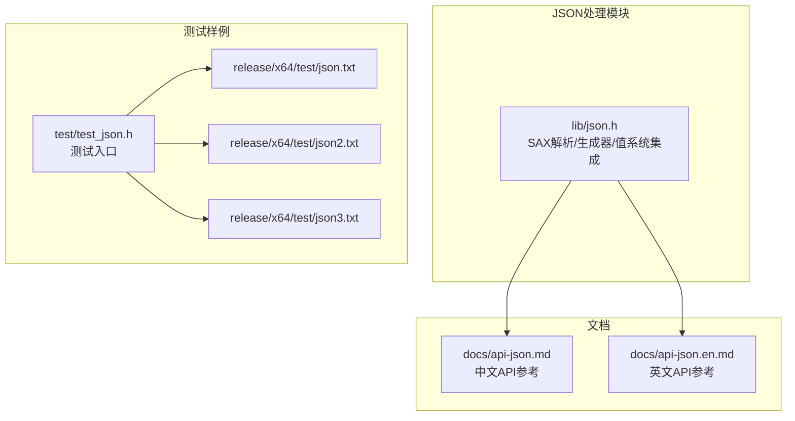
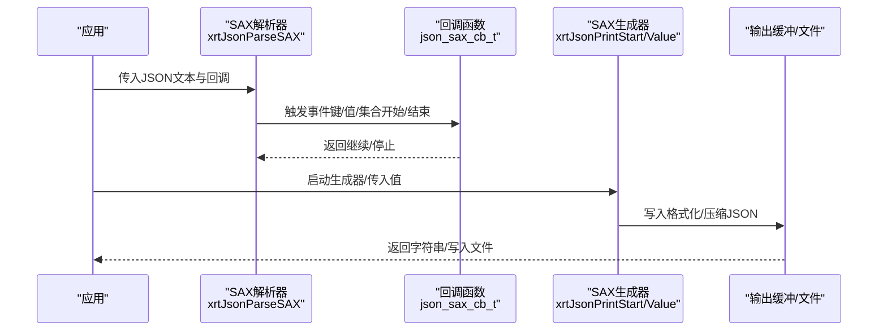
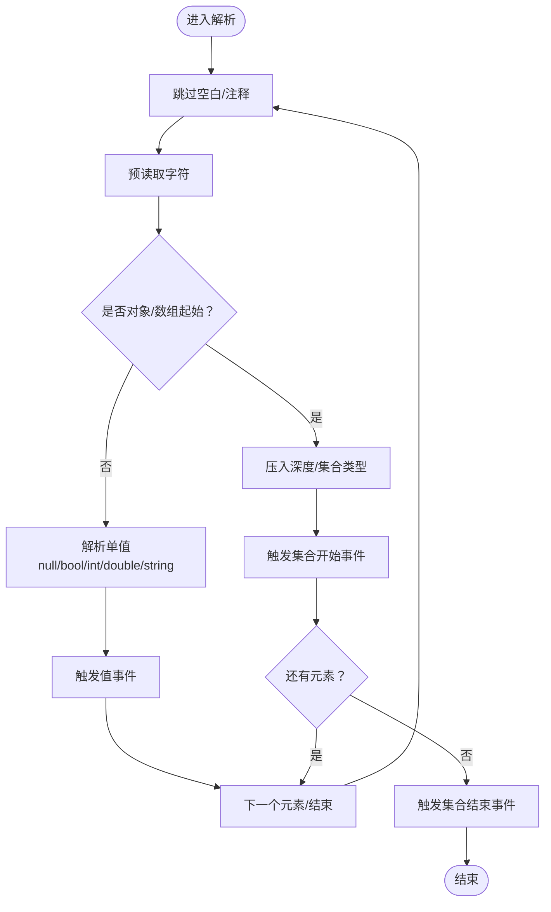
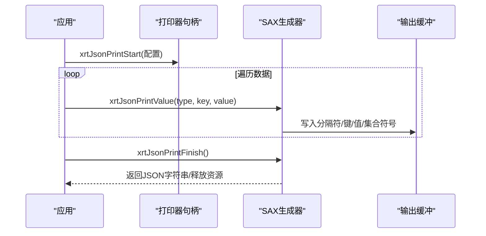
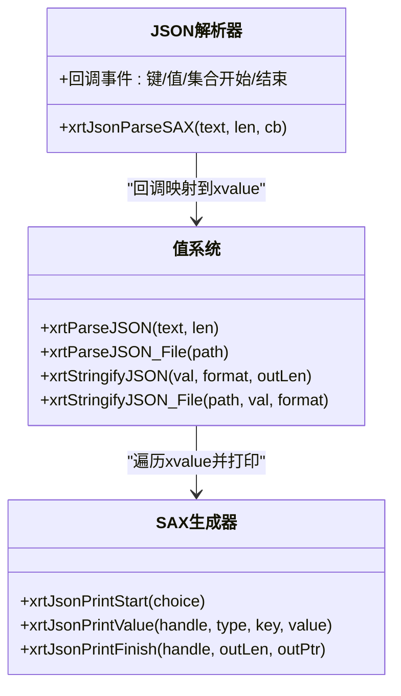
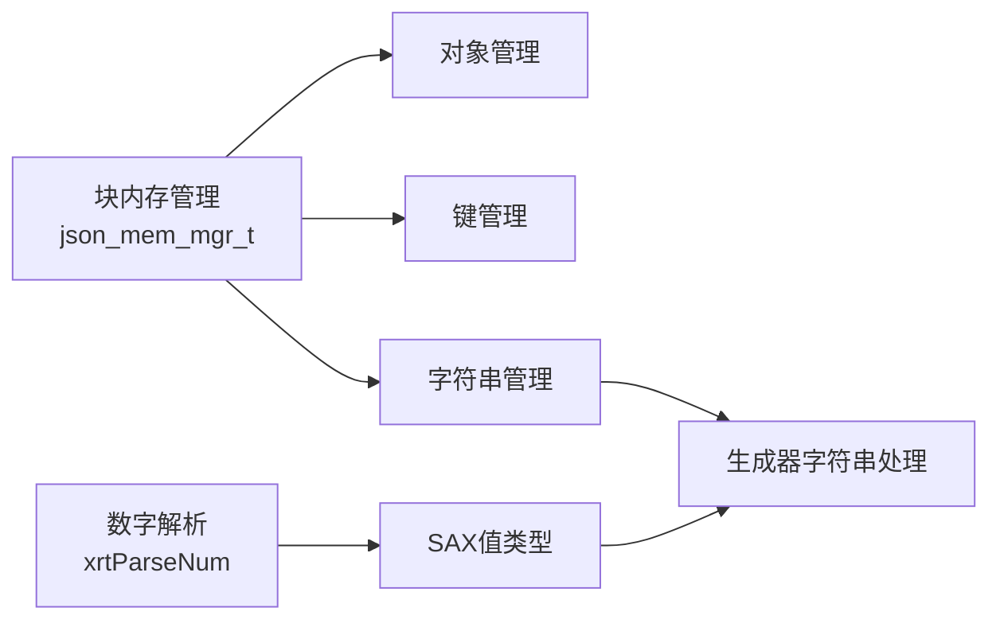

# JSON处理

<cite>
**本文引用的文件列表**
- [lib/json.h](file://lib/json.h)
- [docs/api-json.md](file://docs/api-json.md)
- [docs/api-json.en.md](file://docs/api-json.en.md)
- [test/test_json.h](file://test/test_json.h)
- [release/x64/test/json.txt](file://release/x64/test/json.txt)
- [release/x64/test/json2.txt](file://release/x64/test/json2.txt)
- [release/x64/test/json3.txt](file://release/x64/test/json3.txt)
</cite>

## 目录
1. [简介](#简介)
2. [项目结构](#项目结构)
3. [核心组件](#核心组件)
4. [架构总览](#架构总览)
5. [详细组件分析](#详细组件分析)
6. [依赖关系分析](#依赖关系分析)
7. [性能考量](#性能考量)
8. [故障排查指南](#故障排查指南)
9. [结论](#结论)
10. [附录](#附录)

## 简介
本文件面向XRT JSON处理模块，系统性阐述其SAX模式解析器的设计理念、事件驱动处理的优势与性能特征；解释无DOM开销的解析思路与内存优化策略；详述JSON生成器的数据类型映射、格式化选项与编码处理；给出完整API参考（解析回调、错误处理、状态管理）；并提供最佳实践、性能优化技巧与典型应用场景，以及与动态类型系统的集成与数据转换流程。

## 项目结构
XRT JSON处理位于lib/json.h，配套文档在docs/api-json.md（及英文版），测试样例位于release目录下的多份JSON文件，测试入口在test/test_json.h中。

图表来源
- [lib/json.h](file://lib/json.h#L1-L120)
- [docs/api-json.md](file://docs/api-json.md#L1-L40)
- [docs/api-json.en.md](file://docs/api-json.en.md#L1-L40)
- [test/test_json.h](file://test/test_json.h#L1-L105)
- [release/x64/test/json.txt](file://release/x64/test/json.txt#L1-L25)
- [release/x64/test/json2.txt](file://release/x64/test/json2.txt#L1-L27)
- [release/x64/test/json3.txt](file://release/x64/test/json3.txt#L1-L70)

章节来源
- [lib/json.h](file://lib/json.h#L1-L120)
- [docs/api-json.md](file://docs/api-json.md#L1-L40)
- [docs/api-json.en.md](file://docs/api-json.en.md#L1-L40)
- [test/test_json.h](file://test/test_json.h#L1-L105)

## 核心组件
- SAX解析器：基于事件驱动的流式解析，逐令牌触发回调，避免构建完整DOM树，降低内存峰值与分配次数。
- JSON生成器：以SAX风格的“打印器”输出，按需写入，支持格式化/压缩两种模式，具备字符串转义与UTF-8编码处理。
- 值系统集成：将SAX解析结果映射到XRT动态类型（xvalue），提供高级API（解析/序列化/文件读写）。
- 内存池与块分配：解析阶段采用块内存管理，减少频繁小块分配带来的碎片与开销。

章节来源
- [lib/json.h](file://lib/json.h#L23-L74)
- [lib/json.h](file://lib/json.h#L219-L235)
- [lib/json.h](file://lib/json.h#L547-L560)
- [lib/json.h](file://lib/json.h#L1823-L1860)
- [lib/json.h](file://lib/json.h#L1925-L1966)

## 架构总览
SAX解析器负责词法/语法扫描与事件分发；生成器负责按事件顺序输出JSON文本；值系统在二者之间提供桥接，既可直接使用SAX，也可通过值系统间接使用。

图表来源
- [lib/json.h](file://lib/json.h#L1557-L1596)
- [lib/json.h](file://lib/json.h#L562-L790)
- [lib/json.h](file://lib/json.h#L1925-L1966)

## 详细组件分析

### SAX解析器（事件驱动）
- 设计理念
  - 无DOM开销：不构建中间对象树，边解析边回调，适合大文件与低内存占用场景。
  - 事件驱动：以回调函数接收键名、值类型、集合起止等事件，便于快速过滤与选择性处理。
- 关键数据结构
  - 解析状态：包含深度数组、当前索引、当前值等，用于维护层级与键上下文。
  - 回调返回：支持继续解析或提前停止。
- 解析流程要点
  - 跳过空白与注释（可配置）、识别键/值、处理集合起止、维护父子关系与深度。
  - 支持多种数字格式（十进制、十六进制、长整型）、字符串转义与UTF-16到UTF-8转换。
- 错误处理
  - 统一的错误宏，定位解析位置，输出上下文片段，便于调试。

图表来源
- [lib/json.h](file://lib/json.h#L1383-L1537)
- [lib/json.h](file://lib/json.h#L1162-L1196)
- [lib/json.h](file://lib/json.h#L1427-L1511)

章节来源
- [lib/json.h](file://lib/json.h#L1162-L1196)
- [lib/json.h](file://lib/json.h#L1383-L1537)
- [lib/json.h](file://lib/json.h#L1557-L1596)

### JSON生成器（SAX风格打印）
- 功能特性
  - 类型映射：null/bool/int/hex/lint/lhex/double/string/array/object。
  - 格式化选项：格式化输出（换行/缩进）与压缩输出（紧凑）。
  - 编码处理：字符串转义、UTF-16字面量转UTF-8、长度与转义标记自动计算。
- 输出控制
  - 打印句柄：维护深度栈、逗号与键值分隔、格式化缩进。
  - 缓冲增长：按需扩容，避免重复分配。
- 使用方式
  - 直接SAX打印：逐事件调用打印API。
  - 值系统打印：遍历xvalue，自动映射到SAX事件并输出。

图表来源
- [lib/json.h](file://lib/json.h#L741-L790)
- [lib/json.h](file://lib/json.h#L562-L739)
- [lib/json.h](file://lib/json.h#L1925-L1966)

章节来源
- [lib/json.h](file://lib/json.h#L562-L739)
- [lib/json.h](file://lib/json.h#L741-L790)
- [lib/json.h](file://lib/json.h#L1925-L1966)

### 与动态类型系统的集成
- 解析到值：SAX回调将事件映射到xvalue（数组/对象/文本/整数/浮点/布尔/空），构建动态类型树。
- 值到JSON：遍历xvalue，将每种类型映射到SAX事件，交由生成器输出。
- 文件交互：提供从文件解析与写回文件的便捷API。

图表来源
- [lib/json.h](file://lib/json.h#L1617-L1782)
- [lib/json.h](file://lib/json.h#L1823-L1860)
- [lib/json.h](file://lib/json.h#L1925-L1966)

章节来源
- [lib/json.h](file://lib/json.h#L1617-L1782)
- [lib/json.h](file://lib/json.h#L1823-L1860)
- [lib/json.h](file://lib/json.h#L1925-L1966)

## 依赖关系分析
- 内存管理
  - 块内存节点与管理器：对象、键、字符串分别独立管理，满足对齐需求，减少碎片。
  - 生命周期：解析阶段统一释放，避免细粒度释放导致的碎片化。
- 字符串与转义
  - 字符串信息结构：记录长度、是否转义、是否堆分配等，便于生成器高效处理。
  - 转义与UTF-16：内置转义表与UTF-16到UTF-8转换逻辑，确保输出正确性。
- 数字解析
  - 通过通用数字解析函数支持多种数字格式，解析后按类型写入联合体。

图表来源
- [lib/json.h](file://lib/json.h#L23-L74)
- [lib/json.h](file://lib/json.h#L295-L324)
- [lib/json.h](file://lib/json.h#L809-L823)

章节来源
- [lib/json.h](file://lib/json.h#L23-L74)
- [lib/json.h](file://lib/json.h#L295-L324)
- [lib/json.h](file://lib/json.h#L809-L823)

## 性能考量
- 无DOM开销
  - SAX解析仅在回调中持有必要上下文，避免构建完整对象树，显著降低内存峰值与分配次数。
- 事件驱动
  - 通过回调快速决策，可在遇到目标键或条件满足时立即停止解析，缩短整体耗时。
- 内存池与块分配
  - 统一分配/释放，减少碎片与分配成本；字符串在需要时才复制，避免不必要的拷贝。
- 生成器优化
  - 按需扩容、批量写入、格式化/压缩双模式，兼顾可读性与体积。
- 循环展开与分支预测
  - 关键路径采用循环展开与likely/unlikely提示，提升CPU分支预测命中率。

章节来源
- [lib/json.h](file://lib/json.h#L81-L179)
- [lib/json.h](file://lib/json.h#L326-L358)
- [lib/json.h](file://lib/json.h#L1162-L1196)

## 故障排查指南
- 常见错误
  - 非标准字符：字符串内不允许换行/制表等特殊字符（可配置允许）。
  - 无效转义：遇到未知转义序列会报错。
  - 无效UTF-16：\u序列格式不合法时报错。
  - 额外字符：解析完成后仍有未消费字符会报错。
- 定位方法
  - 使用错误宏输出上下文片段，结合偏移定位问题位置。
  - 在回调中打印当前键与类型，确认事件序列是否符合预期。
- 建议
  - 对于大文件，优先使用SAX解析并尽早停止；对小文件可使用值系统简化开发。
  - 严格遵循JSON规范，避免非标准扩展（如注释、尾随逗号等）。

章节来源
- [lib/json.h](file://lib/json.h#L142-L163)
- [lib/json.h](file://lib/json.h#L1314-L1312)
- [lib/json.h](file://lib/json.h#L1580-L1589)

## 结论
XRT JSON处理模块以SAX为核心，结合无DOM开销与事件驱动机制，在保证高性能的同时提供了灵活的处理能力。通过与动态类型系统的无缝集成，既能满足高吞吐的流式处理需求，也能提供易用的高级API。配合完善的内存池与生成器优化，适用于从嵌入式到服务端的广泛场景。

## 附录

### API参考（节选）
- SAX解析
  - 函数：xrtJsonParseSAX
  - 参数：文本、长度、回调
  - 返回：0成功，-1失败
  - 回调：接收键、值、集合起止事件
- SAX生成
  - 启动：xrtJsonPrintStart(choice)
  - 打印：xrtJsonPrintValue(handle, type, key, value)
  - 结束：xrtJsonPrintFinish(handle, outLen, outPtr)
  - 辅助：便捷打印函数（null/bool/int/hex/lint/lhex/double/string/array/object）
- 值系统
  - 解析：xrtParseJSON / xrtParseJSON_File
  - 序列化：xrtStringifyJSON / xrtStringifyJSON_File
  - 类型：JSON_NULL/BOOL/INT/HEX/LINT/LHEX/DOUBLE/STRING/ARRAY/OBJECT

章节来源
- [docs/api-json.md](file://docs/api-json.md#L118-L174)
- [docs/api-json.md](file://docs/api-json.md#L199-L297)
- [docs/api-json.md](file://docs/api-json.md#L308-L364)

### 实际应用场景
- 大文件流式解析：日志/配置/协议消息的增量处理。
- 低内存占用：嵌入式设备或受限环境下的JSON处理。
- 快速过滤：仅提取特定键或满足条件的节点，解析完成后即停止。
- 配置与模板：通过值系统构建/修改结构，再序列化输出。

章节来源
- [test/test_json.h](file://test/test_json.h#L1-L105)
- [release/x64/test/json.txt](file://release/x64/test/json.txt#L1-L25)
- [release/x64/test/json2.txt](file://release/x64/test/json2.txt#L1-L27)
- [release/x64/test/json3.txt](file://release/x64/test/json3.txt#L1-L70)