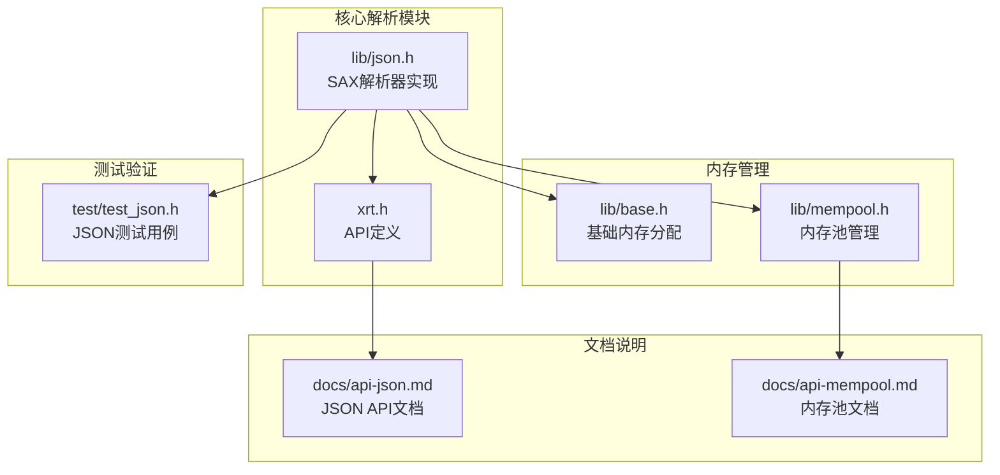
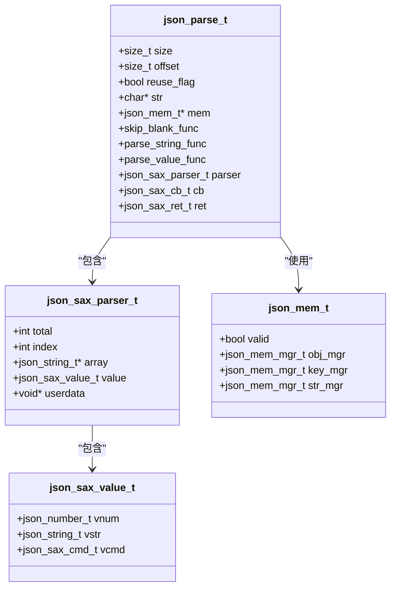
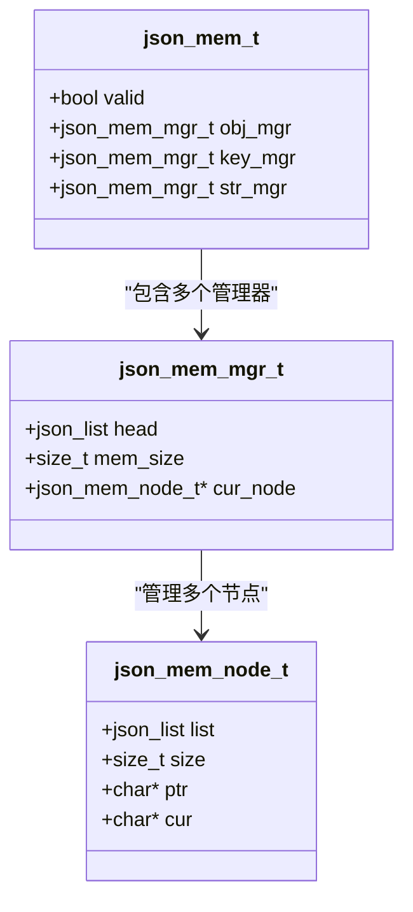
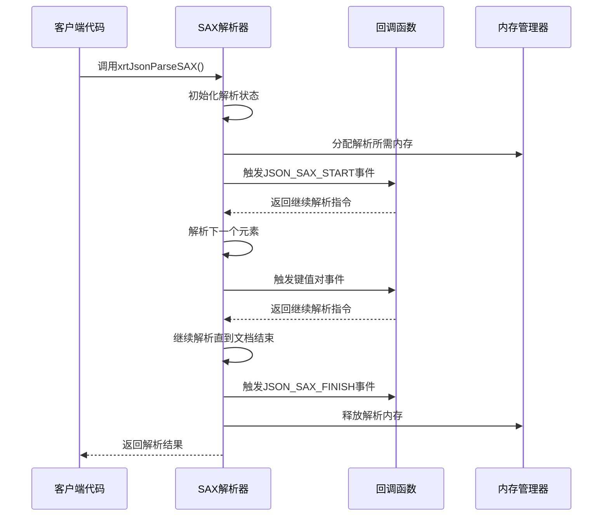
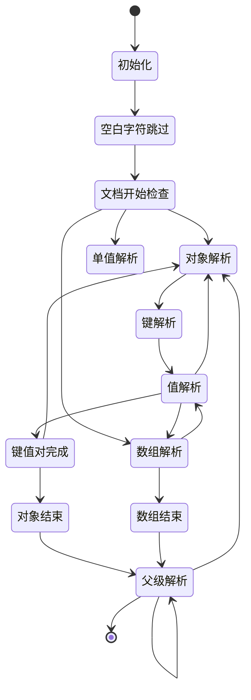
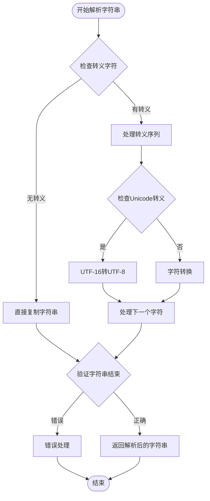
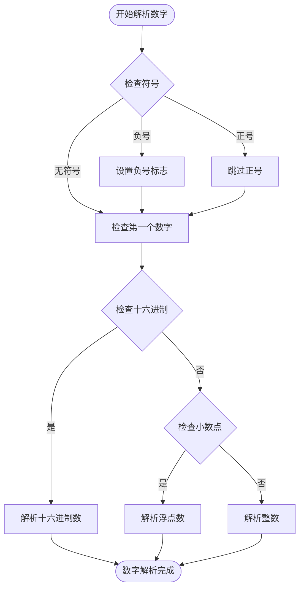
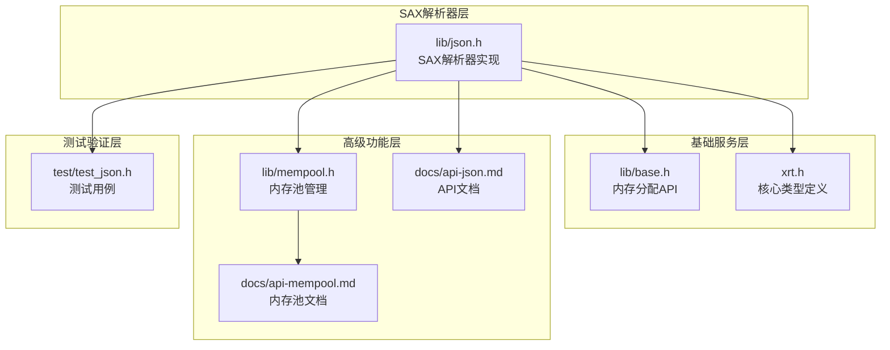

# SAX解析器设计

<cite>
**本文档引用的文件**
- [lib/json.h](file://lib/json.h)
- [xrt.h](file://xrt.h)
- [lib/base.h](file://lib/base.h)
- [lib/mempool.h](file://lib/mempool.h)
- [docs/api-json.md](file://docs/api-json.md)
- [docs/api-mempool.md](file://docs/api-mempool.md)
- [test/test_json.h](file://test/test_json.h)
</cite>

## 目录
1. [简介](#简介)
2. [项目结构](#项目结构)
3. [核心组件](#核心组件)
4. [架构概览](#架构概览)
5. [详细组件分析](#详细组件分析)
6. [依赖关系分析](#依赖关系分析)
7. [性能考虑](#性能考虑)
8. [故障排除指南](#故障排除指南)
9. [结论](#结论)
10. [附录](#附录)

## 简介

XRT库中的SAX解析器实现了事件驱动的JSON解析模式，采用流式处理方式直接解析JSON字符串。该解析器基于Simple API for XML（SAX）理念，通过回调函数机制向应用程序传递解析过程中的事件，从而实现高效的内存使用和快速的解析性能。

SAX解析器的核心优势在于其事件驱动的设计：解析器在扫描JSON文本时遇到特定结构（如对象开始、数组开始、键值对、字符串、数字等）时，立即触发相应的回调函数，应用程序可以在回调中处理这些事件而无需等待整个文档解析完成。这种设计特别适合处理大型JSON文档，因为它不需要将整个文档加载到内存中。

## 项目结构

XRT库的JSON解析功能主要集中在lib/json.h文件中，同时与基础内存管理、API定义和文档说明紧密配合：



**图表来源**
- [lib/json.h](file://lib/json.h#L1-L80)
- [xrt.h](file://xrt.h#L2310-L2466)
- [lib/base.h](file://lib/base.h#L1-L132)
- [lib/mempool.h](file://lib/mempool.h#L1-L120)

**章节来源**
- [lib/json.h](file://lib/json.h#L1-L200)
- [xrt.h](file://xrt.h#L2310-L2466)

## 核心组件

### SAX解析器核心数据结构

SAX解析器使用以下核心数据结构来管理解析状态和回调机制：



**图表来源**
- [lib/json.h](file://lib/json.h#L219-L235)
- [lib/json.h](file://lib/json.h#L1318-L1320)
- [lib/json.h](file://lib/json.h#L1383-L1390)

### 块内存管理系统

SAX解析器采用了高效的块内存管理模式，通过预分配的大块内存来减少频繁的系统调用：



**图表来源**
- [lib/json.h](file://lib/json.h#L23-L28)
- [lib/json.h](file://lib/json.h#L44-L48)
- [lib/json.h](file://lib/json.h#L69-L74)

**章节来源**
- [lib/json.h](file://lib/json.h#L23-L74)
- [lib/json.h](file://lib/json.h#L1318-L1381)

## 架构概览

SAX解析器的整体架构采用事件驱动模式，通过状态机控制解析流程：



**图表来源**
- [lib/json.h](file://lib/json.h#L1557-L1596)
- [lib/json.h](file://lib/json.h#L1383-L1537)

### 解析状态机设计

SAX解析器实现了完整的状态机来处理JSON文档的各种结构：



**图表来源**
- [lib/json.h](file://lib/json.h#L1383-L1537)

**章节来源**
- [lib/json.h](file://lib/json.h#L1557-L1596)
- [lib/json.h](file://lib/json.h#L1383-L1537)

## 详细组件分析

### 字符串解析器

字符串解析器负责处理JSON字符串的解析，包括转义字符处理和Unicode编码转换：



**图表来源**
- [lib/json.h](file://lib/json.h#L1249-L1312)
- [lib/json.h](file://lib/json.h#L1200-L1247)

### 数字解析器

数字解析器支持多种数字格式，包括整数、浮点数、十六进制数等：



**图表来源**
- [lib/json.h](file://lib/json.h#L809-L823)
- [lib/json.h](file://lib/json.h#L1015-L1094)

### 内存管理策略

SAX解析器采用了多层次的内存管理策略来优化性能：

#### 块内存分配器
- **预分配策略**：每次分配固定大小的内存块（默认8192字节）
- **节点管理**：通过链表管理多个内存节点
- **统一释放**：支持整个内存块的统一释放，提高释放效率

#### 内存池优化
- **多管理器分离**：为不同类型的JSON元素（对象、键、字符串）分别管理内存
- **对齐要求**：满足JSON对象的内存地址对齐需求
- **缓存机制**：支持频繁解析小型JSON文件的内存缓存

**章节来源**
- [lib/json.h](file://lib/json.h#L6-L74)
- [lib/json.h](file://lib/json.h#L1318-L1381)

### 性能优化技术

#### 循环展开优化
解析器使用编译器内置的循环展开技术来减少循环开销：

```c
// 手动循环展开示例
while (end - str >= 8) {
    c = *str++; ch = _is_escape_char((uint8_t)c); if (unlikely(ch > PRINT_STR_CMP_VAL)) goto next;
    c = *str++; ch = _is_escape_char((uint8_t)c); if (unlikely(ch > PRINT_STR_CMP_VAL)) goto next;
    // ... 重复多次以减少循环检查
}
```

#### 条件编译优化
通过条件编译启用或禁用特定功能：
- `JSON_MANUAL_LOOP_UNFOLD`：控制手动循环展开
- `JSON_PARSE_SKIP_COMMENT`：控制注释处理
- `JSON_PARSE_SPECIAL_CHAR`：控制特殊字符支持

#### 缓存友好的数据结构
- **连续内存布局**：使用数组存储解析状态，提高缓存命中率
- **局部性优化**：将频繁访问的数据放在相邻内存位置

**章节来源**
- [lib/json.h](file://lib/json.h#L82-L135)
- [lib/json.h](file://lib/json.h#L431-L442)

## 依赖关系分析

SAX解析器与其他XRT组件的依赖关系如下：



**图表来源**
- [lib/json.h](file://lib/json.h#L192-L196)
- [lib/base.h](file://lib/base.h#L5-L45)
- [xrt.h](file://xrt.h#L2315-L2466)

### 外部依赖

SAX解析器的主要外部依赖包括：
- **标准C库**：字符串处理、内存操作
- **编译器内置函数**：`__builtin_expect`用于分支预测优化
- **平台相关的内存管理**：通过xrtMalloc/xrtFree接口抽象

**章节来源**
- [lib/json.h](file://lib/json.h#L169-L179)
- [lib/base.h](file://lib/base.h#L5-L45)

## 性能考虑

### 内存使用优化

SAX解析器通过以下方式优化内存使用：
- **流式处理**：不需要将整个JSON文档加载到内存
- **块内存管理**：减少系统调用次数
- **智能释放**：支持批量内存释放

### CPU性能优化

- **分支预测优化**：使用`likely/unlikely`宏提示编译器
- **循环展开**：减少循环控制开销
- **SIMD友好**：优化数据访问模式

### 编译时优化

通过配置编译宏来启用特定优化：
- `-O2`或更高优化级别
- 启用内联函数扩展
- 启用循环优化

## 故障排除指南

### 常见错误类型

1. **语法错误**：JSON格式不正确
2. **内存不足**：解析过程中内存分配失败
3. **回调错误**：用户回调函数返回错误

### 调试技巧

1. **启用详细错误报告**：通过`JSON_ERROR_PRINT_ENABLE`宏启用
2. **检查回调返回值**：确保回调函数正确处理每个事件
3. **监控内存使用**：定期检查内存分配情况

**章节来源**
- [lib/json.h](file://lib/json.h#L142-L163)
- [lib/json.h](file://lib/json.h#L150-L163)

## 结论

XRT库的SAX解析器通过事件驱动的设计理念，实现了高效、灵活的JSON解析功能。其核心优势包括：

1. **高性能**：事件驱动模式和多种优化技术确保了优秀的解析性能
2. **低内存占用**：流式处理和块内存管理减少了内存使用
3. **灵活性**：通过回调机制允许应用程序自定义处理逻辑
4. **可扩展性**：模块化设计便于功能扩展和维护

该解析器特别适合处理大型JSON文档和实时数据流场景，在保证性能的同时提供了良好的开发体验。

## 附录

### 配置选项参考

| 选项名称 | 默认值 | 描述 |
|---------|--------|------|
| JSON_MANUAL_LOOP_UNFOLD | 1 | 启用手动循环展开优化 |
| JSON_PARSE_SKIP_COMMENT | 0 | 允许C风格注释 |
| JSON_PARSE_LAST_COMMA | 1 | 允许数组/对象末尾逗号 |
| JSON_PARSE_EMPTY_KEY | 0 | 允许空键名 |
| JSON_PARSE_SPECIAL_CHAR | 1 | 允许特殊字符 |
| JSON_PARSE_SPECIAL_QUOTES | 0 | 允许单引号和无引号键 |
| JSON_PARSE_HEX_NUM | 1 | 允许十六进制数 |
| JSON_PARSE_SPECIAL_NUM | 1 | 允许特殊数字格式 |
| JSON_PARSE_SPECIAL_DOUBLE | 1 | 允许NaN和无穷大 |

### 使用示例路径

完整的使用示例可以在以下文件中找到：
- [SAX解析示例](file://lib/json.h#L1557-L1596)
- [内存池使用示例](file://docs/api-mempool.md#L659-L718)
- [测试用例](file://test/test_json.h#L1-L105)