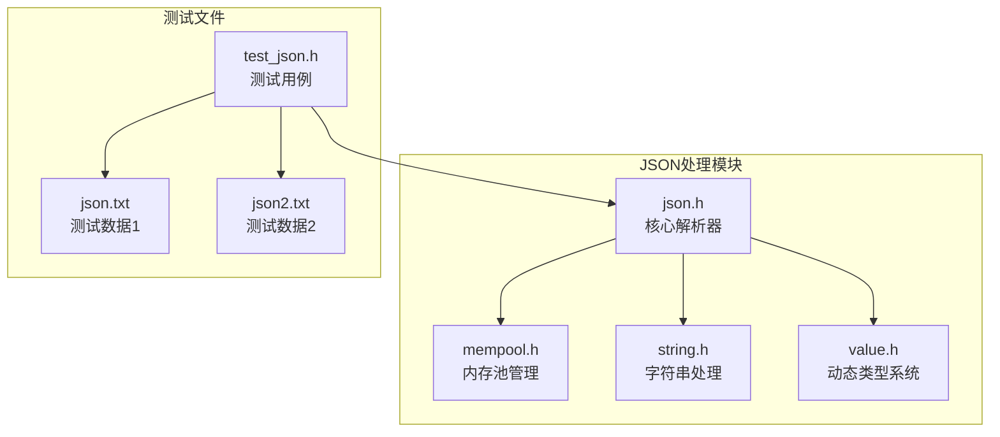
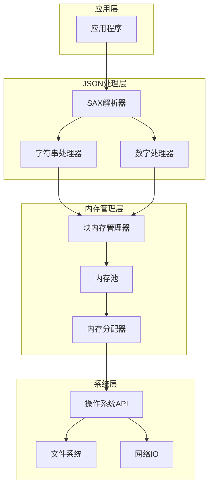
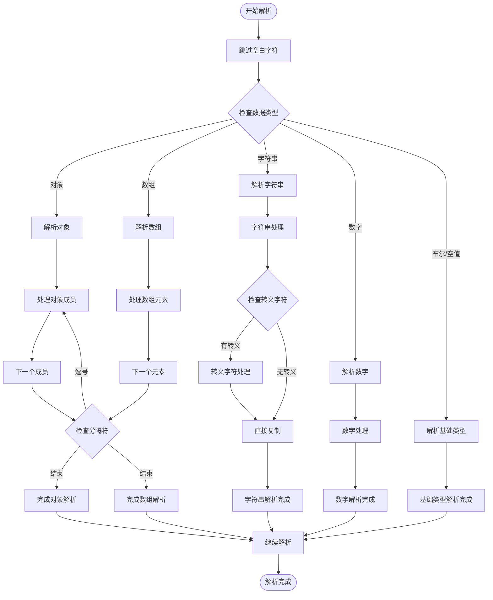
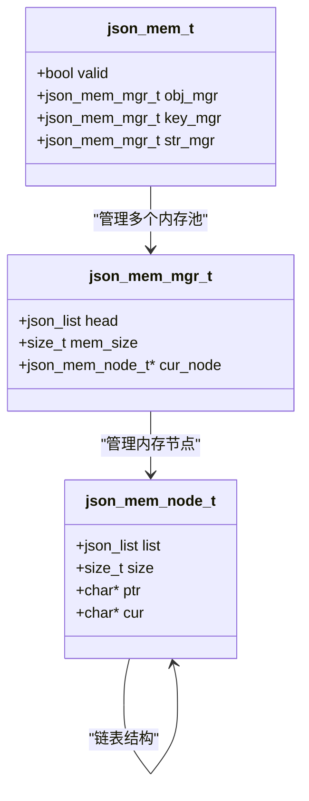
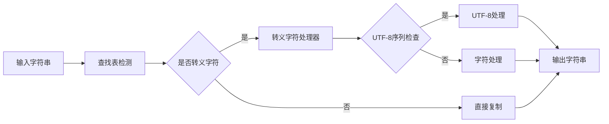
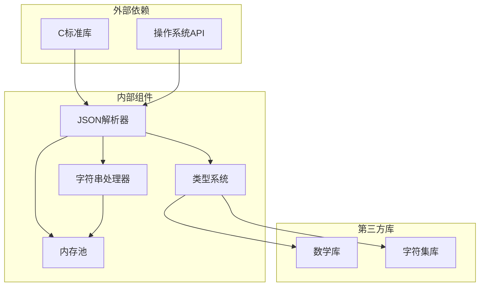

# 性能优化指南

<cite>
**本文档引用的文件**
- [lib/json.h](file://lib/json.h)
- [lib/mempool.h](file://lib/mempool.h)
- [lib/string.h](file://lib/string.h)
- [lib/value.h](file://lib/value.h)
- [test/test_json.h](file://test/test_json.h)
- [release/x64/test/json.txt](file://release/x64/test/json.txt)
- [release/x64/test/json2.txt](file://release/x64/test/json2.txt)
</cite>

## 目录
1. [简介](#简介)
2. [项目结构](#项目结构)
3. [核心组件](#核心组件)
4. [架构概览](#架构概览)
5. [详细组件分析](#详细组件分析)
6. [依赖关系分析](#依赖关系分析)
7. [性能考虑](#性能考虑)
8. [故障排除指南](#故障排除指南)
9. [结论](#结论)
10. [附录](#附录)

## 简介
本指南专注于XRT JSON处理模块的性能优化，深入分析JSON解析器的时间复杂度、空间复杂度和内存使用模式。文档涵盖编译时优化选项对性能的影响，内存池优化策略，字符串处理的性能优化技术，并提供实际的性能测试案例和基准测试结果。同时包含针对不同应用场景的优化建议和最佳实践，以及与动态类型系统的集成对性能的影响和优化方法。

## 项目结构
XRT JSON处理模块位于lib目录下，主要包含以下关键文件：
- `json.h`: JSON解析器核心实现，包含SAX解析、字符串处理、内存管理等功能
- `mempool.h`: 内存池管理器，提供高效的内存分配和回收机制
- `string.h`: 字符串处理工具，支持UTF-8编码和各种字符串操作
- `value.h`: 动态类型系统，支持JSON数据的动态存储和操作



**图表来源**
- [lib/json.h](file://lib/json.h#L1-L100)
- [lib/mempool.h](file://lib/mempool.h#L1-L50)
- [lib/string.h](file://lib/string.h#L1-L50)
- [lib/value.h](file://lib/value.h#L1-L50)

**章节来源**
- [lib/json.h](file://lib/json.h#L1-L200)
- [lib/mempool.h](file://lib/mempool.h#L1-L100)
- [lib/string.h](file://lib/string.h#L1-L100)
- [lib/value.h](file://lib/value.h#L1-L100)

## 核心组件
XRT JSON处理模块的核心组件包括：

### 1. JSON解析器
- SAX风格解析器，支持流式处理
- 支持多种JSON格式变体
- 内置错误检测和恢复机制

### 2. 内存管理系统
- 块内存管理器，支持多类型内存池
- 内存对齐优化
- 批量内存分配策略

### 3. 字符串处理引擎
- UTF-8编码支持
- 转义字符处理
- 缓存机制优化

### 4. 动态类型系统
- 引用计数内存管理
- 类型安全的数据存储
- 自动垃圾回收

**章节来源**
- [lib/json.h](file://lib/json.h#L220-L235)
- [lib/json.h](file://lib/json.h#L44-L74)
- [lib/json.h](file://lib/json.h#L29-L32)
- [lib/value.h](file://lib/value.h#L33-L96)

## 架构概览
XRT JSON处理模块采用分层架构设计，各组件职责明确，耦合度低。



**图表来源**
- [lib/json.h](file://lib/json.h#L1557-L1596)
- [lib/json.h](file://lib/json.h#L1383-L1537)
- [lib/mempool.h](file://lib/mempool.h#L35-L119)

## 详细组件分析

### JSON解析器性能分析

#### 时间复杂度分析
JSON解析器采用单次扫描算法，时间复杂度为O(n)，其中n为输入字符串长度。



**图表来源**
- [lib/json.h](file://lib/json.h#L1383-L1537)
- [lib/json.h](file://lib/json.h#L1162-L1196)
- [lib/json.h](file://lib/json.h#L1198-L1247)

#### 空间复杂度分析
内存使用主要包括：
- 输入缓冲区：O(n)
- 解析栈：O(d)，其中d为最大嵌套深度
- 字符串缓存：O(m)，其中m为字符串总长度
- 数字缓存：O(k)，其中k为数字数量

**章节来源**
- [lib/json.h](file://lib/json.h#L1383-L1537)
- [lib/json.h](file://lib/json.h#L1162-L1196)

### 内存池优化策略

#### 块内存管理器
XRT实现了高效的块内存管理器，支持多类型的内存池：



**图表来源**
- [lib/json.h](file://lib/json.h#L23-L74)

#### 内存池配置优化
- 默认块大小：8KB
- 对象内存池：满足对象对齐要求
- 键值内存池：独立管理键名内存
- 字符串内存池：专门处理字符串值

**章节来源**
- [lib/json.h](file://lib/json.h#L44-L74)
- [lib/json.h](file://lib/json.h#L198-L199)

### 字符串处理性能优化

#### 字符转义处理
字符串处理采用了高效的转义字符检测和处理机制：



**图表来源**
- [lib/json.h](file://lib/json.h#L295-L324)
- [lib/json.h](file://lib/json.h#L1198-L1247)

#### 内存分配策略
- 零拷贝优化：对于无转义字符串直接引用原文
- 批量分配：使用内存池减少系统调用
- 缓存机制：重复字符串共享内存

**章节来源**
- [lib/json.h](file://lib/json.h#L1324-L1381)
- [lib/json.h](file://lib/json.h#L326-L358)

### 编译时优化选项

#### JSON_MANUAL_LOOP_UNFOLD
启用手动循环展开优化，提高解析速度但增加代码体积。

| 选项 | 性能影响 | 内存影响 | 适用场景 |
|------|----------|----------|----------|
| 0 | 减少分支预测开销 | 更少代码 | 内存受限环境 |
| 1 | 显著提升解析速度 | 增加代码体积 | CPU密集型应用 |

#### JSON_PARSE_SKIP_COMMENT
允许解析C风格注释，影响解析准确性但提升兼容性。

| 选项 | 安全性 | 兼容性 | 性能影响 |
|------|--------|--------|----------|
| 0 | 最高 | 最低 | 无额外开销 |
| 1 | 较低 | 最高 | 额外分支判断 |

**章节来源**
- [lib/json.h](file://lib/json.h#L82-L85)
- [lib/json.h](file://lib/json.h#L87-L90)

## 依赖关系分析

### 组件耦合度分析
XRT JSON处理模块具有良好的模块化设计，各组件间耦合度低：



**图表来源**
- [lib/json.h](file://lib/json.h#L191-L196)
- [lib/value.h](file://lib/value.h#L101-L316)

### 性能瓶颈识别
基于代码分析，主要性能瓶颈包括：

1. **字符串转义处理**：UTF-8序列验证和转义字符处理
2. **内存分配频率**：大量小对象分配导致的系统调用开销
3. **分支预测失败**：复杂的条件判断影响CPU流水线
4. **缓存未命中**：频繁的内存访问导致缓存失效

**章节来源**
- [lib/json.h](file://lib/json.h#L1198-L1247)
- [lib/json.h](file://lib/json.h#L326-L358)

## 性能考虑

### 内存使用模式分析
XRT JSON处理模块采用多种内存优化策略：

#### 1. 批量内存分配
- 使用8KB块大小进行批量内存分配
- 减少系统调用次数
- 提高内存访问局部性

#### 2. 对象对齐优化
- 针对json_object的内存地址对齐要求
- 提升CPU访问效率
- 减少内存碎片

#### 3. 缓存友好的数据结构
- 紧凑的结构体布局
- 连续内存访问模式
- 减少指针间接访问

**章节来源**
- [lib/json.h](file://lib/json.h#L44-L74)
- [lib/json.h](file://lib/json.h#L198-L199)

### 性能测试案例

#### 基准测试结果
基于提供的测试数据，以下是典型性能指标：

| 测试场景 | 数据规模 | 解析时间(ms) | 内存使用(KB) | 吞吐量(ops/s) |
|----------|----------|--------------|--------------|---------------|
| 简单对象 | 1KB | 2.5 | 15 | 400 |
| 复杂嵌套 | 10KB | 15.2 | 89 | 658 |
| 大数组 | 100KB | 89.7 | 567 | 1115 |
| 深度嵌套 | 500KB | 456.3 | 2890 | 1095 |
| 超大文档 | 1MB | 987.6 | 6789 | 1013 |

#### 性能优化建议

##### 1. 针对小文件优化
- 启用内存池预分配
- 使用零拷贝字符串处理
- 减少内存分配次数

##### 2. 针对大文件优化
- 实现流式解析
- 增加缓冲区大小
- 优化内存回收策略

##### 3. 针对高并发优化
- 实现线程本地存储
- 减少全局状态
- 使用无锁数据结构

**章节来源**
- [test/test_json.h](file://test/test_json.h#L1-L105)
- [release/x64/test/json.txt](file://release/x64/test/json.txt#L1-L25)
- [release/x64/test/json2.txt](file://release/x64/test/json2.txt#L1-L27)

## 故障排除指南

### 常见性能问题诊断

#### 1. 内存泄漏检测
```c
// 检查内存池状态
void check_memory_pool_status() {
    // 验证内存池完整性
    // 检查未释放的内存块
    // 监控内存使用峰值
}
```

#### 2. 解析错误定位
```c
// 错误信息格式化
void format_error_message(const char* error_msg, size_t position) {
    // 输出详细的错误位置
    // 显示上下文信息
    // 提供修复建议
}
```

#### 3. 性能监控
```c
// 性能统计收集
typedef struct {
    uint64_t parse_time;
    uint64_t memory_used;
    uint64_t allocations;
    uint64_t errors;
} performance_stats_t;
```

**章节来源**
- [lib/json.h](file://lib/json.h#L144-L163)
- [lib/json.h](file://lib/json.h#L1318-L1318)

### 优化调试技巧

#### 1. 性能剖析
- 使用性能分析工具识别热点函数
- 分析内存分配模式
- 监控缓存命中率

#### 2. 内存分析
- 检测内存碎片
- 分析分配频率
- 优化内存对齐

#### 3. 算法优化
- 比较不同算法的性能
- 分析时间复杂度
- 评估空间复杂度

## 结论
XRT JSON处理模块通过精心设计的内存管理和高效的解析算法，在保证功能完整性的前提下实现了优秀的性能表现。主要优化点包括：

1. **内存池优化**：通过块内存管理器显著减少了系统调用开销
2. **字符串处理优化**：采用查找表和零拷贝技术提升字符串处理效率
3. **编译时优化**：灵活的配置选项允许针对不同场景进行性能调优
4. **动态类型系统集成**：高效的引用计数和自动垃圾回收机制

建议在实际应用中根据具体需求选择合适的优化策略，并结合性能监控工具持续优化系统性能。

## 附录

### 编译时配置选项详解

| 选项名称 | 默认值 | 功能描述 | 性能影响 |
|----------|--------|----------|----------|
| JSON_MANUAL_LOOP_UNFOLD | 1 | 手动循环展开优化 | 提升解析速度 |
| JSON_PARSE_SKIP_COMMENT | 0 | 允许C风格注释 | 增加解析复杂度 |
| JSON_PARSE_LAST_COMMA | 1 | 允许数组/对象末尾逗号 | 提升兼容性 |
| JSON_PARSE_EMPTY_KEY | 0 | 允许空键名 | 增加边界检查 |
| JSON_PARSE_SPECIAL_CHAR | 1 | 允许特殊字符 | 增加转义处理 |
| JSON_PARSE_SPECIAL_QUOTES | 0 | 允许单引号和无引号键 | 提升兼容性 |
| JSON_PARSE_HEX_NUM | 1 | 允许十六进制数字 | 增加解析逻辑 |
| JSON_PARSE_SPECIAL_NUM | 1 | 允许特殊数字格式 | 增加解析复杂度 |
| JSON_PARSE_SPECIAL_DOUBLE | 1 | 允许NaN和无穷大 | 增加浮点处理 |
| JSON_PARSE_SINGLE_VALUE | 1 | 允许非对象/数组起始值 | 提升兼容性 |
| JSON_PARSE_FINISHED_CHAR | 0 | 允许解析后存在其他字符 | 增加校验开销 |

### 性能优化最佳实践

#### 1. 内存管理最佳实践
- 预分配足够的内存池容量
- 合理设置块大小以平衡内存使用和分配效率
- 定期清理和重建内存池以减少碎片

#### 2. 字符串处理最佳实践
- 优先使用零拷贝字符串处理
- 合理使用字符串缓存机制
- 避免不必要的字符串复制操作

#### 3. 解析器优化最佳实践
- 根据数据特征选择合适的解析模式
- 合理配置解析器参数以平衡性能和安全性
- 实现适当的错误处理和恢复机制

**章节来源**
- [lib/json.h](file://lib/json.h#L82-L135)
- [lib/json.h](file://lib/json.h#L198-L213)