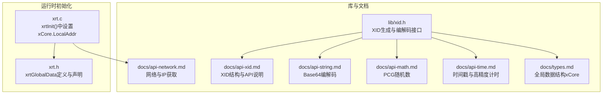
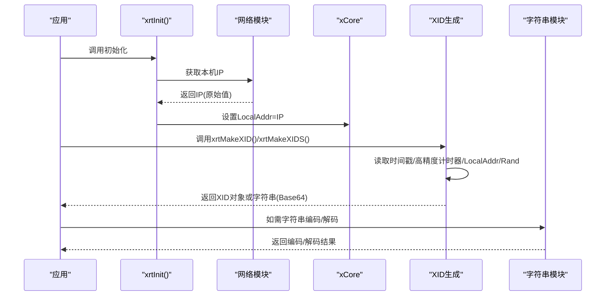
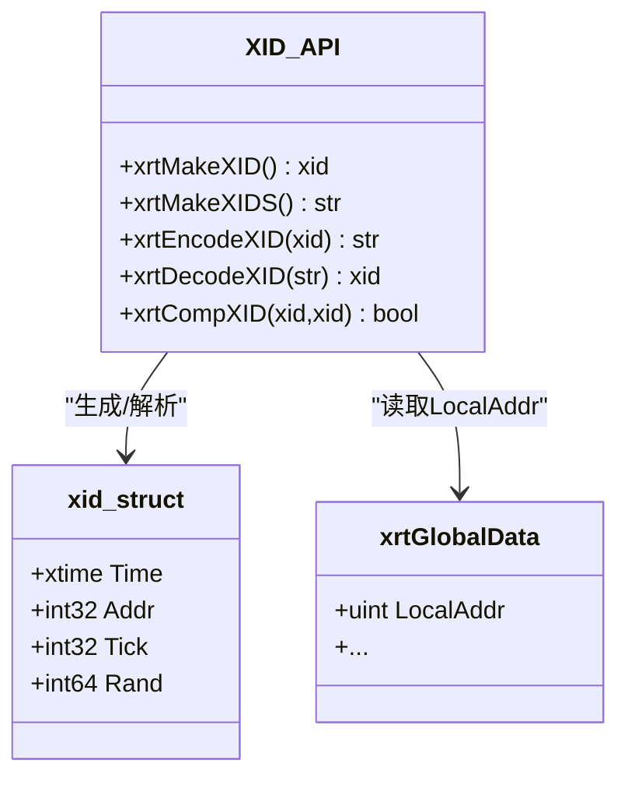
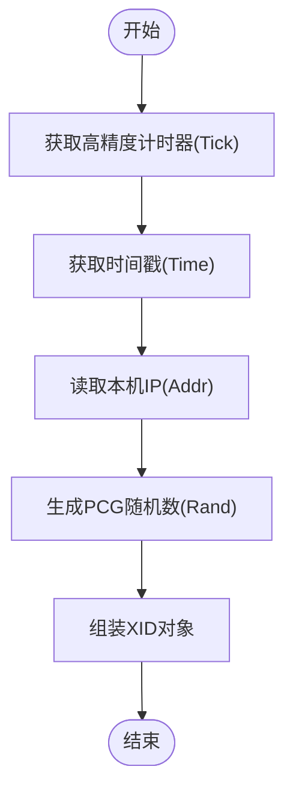
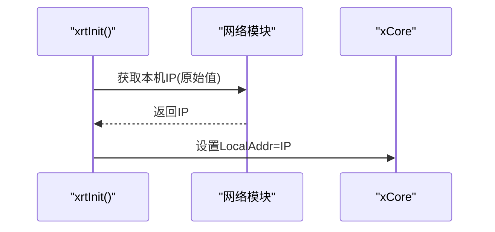
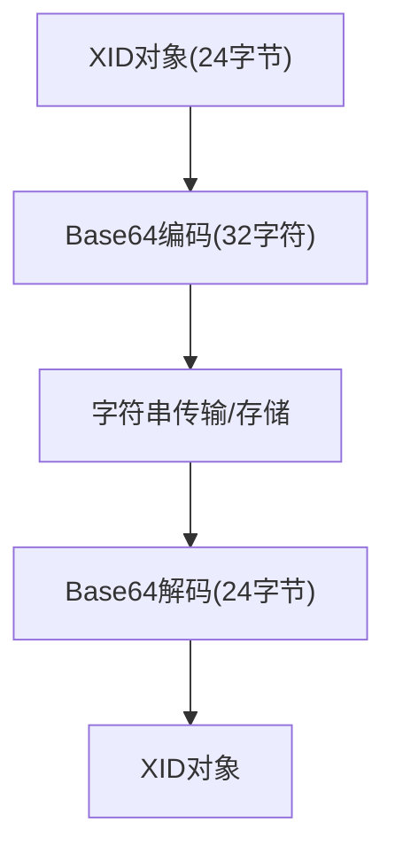
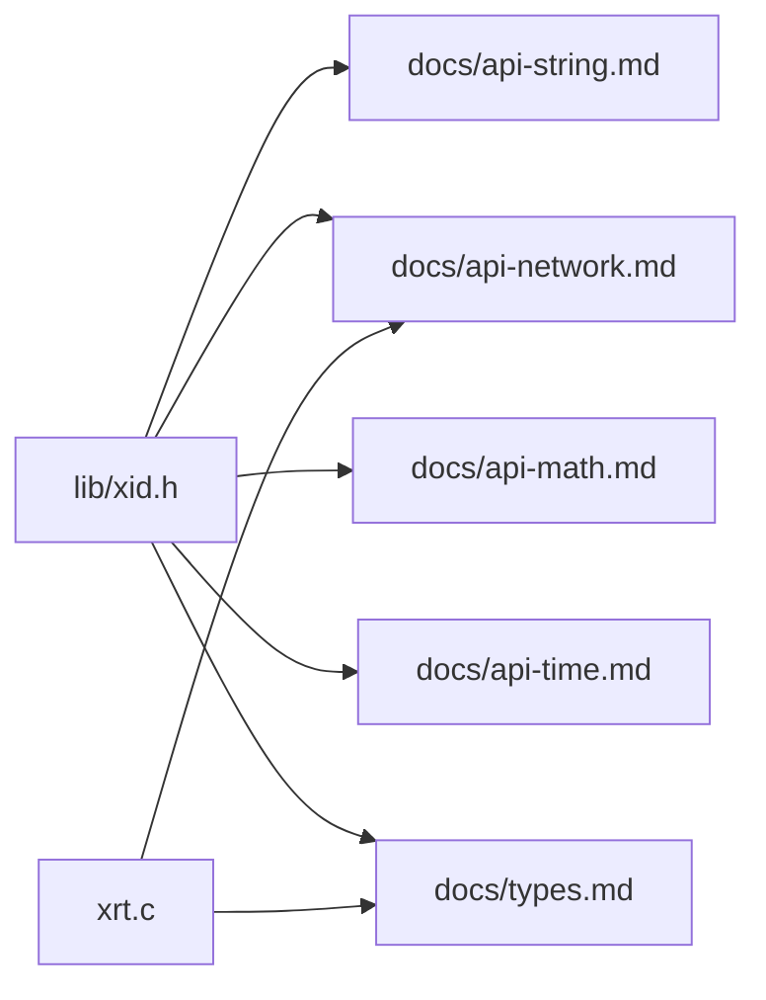

# 分布式ID

<cite>
**本文引用的文件列表**
- [lib/xid.h](file://lib/xid.h)
- [docs/api-xid.md](file://docs/api-xid.md)
- [docs/api-string.md](file://docs/api-string.md)
- [docs/api-network.md](file://docs/api-network.md)
- [docs/api-math.md](file://docs/api-math.md)
- [docs/api-time.md](file://docs/api-time.md)
- [docs/types.md](file://docs/types.md)
- [xrt.c](file://xrt.c)
- [xrt.h](file://xrt.h)
- [test/test_xid.h](file://test/test_xid.h)
</cite>

## 目录
1. [简介](#简介)
2. [项目结构](#项目结构)
3. [核心组件](#核心组件)
4. [架构总览](#架构总览)
5. [详细组件分析](#详细组件分析)
6. [依赖关系分析](#依赖关系分析)
7. [性能考量](#性能考量)
8. [故障排查指南](#故障排查指南)
9. [结论](#结论)
10. [附录](#附录)

## 简介
本文件系统性阐述XRT分布式ID模块的设计与实现，围绕192位唯一ID的生成算法与设计原理展开，重点覆盖以下方面：
- ID结构组成：时间戳、机器标识（IP）、高精度计时器、随机数四部分
- 时钟回拨与单调递增保障策略
- IP地址集成方式与网络标识获取流程
- 完整API使用指南：ID生成、字符串编解码、对象比较与解析
- 分布式ID的应用场景、性能考虑与最佳实践
- ID格式规范、排序特性与存储优化建议
- 与分布式系统集成注意事项与常见问题排查

## 项目结构
XID模块位于lib与docs两大区域，配合基础库（字符串、网络、数学、时间、类型定义）共同构成ID生成与使用的基础设施。

图表来源
- [lib/xid.h](file://lib/xid.h#L1-L75)
- [docs/api-xid.md](file://docs/api-xid.md#L20-L62)
- [docs/api-string.md](file://docs/api-string.md#L32-L56)
- [docs/api-network.md](file://docs/api-network.md#L315-L376)
- [docs/api-math.md](file://docs/api-math.md#L1096-L1166)
- [docs/api-time.md](file://docs/api-time.md#L301-L1067)
- [docs/types.md](file://docs/types.md#L285-L334)
- [xrt.c](file://xrt.c#L179-L180)
- [xrt.h](file://xrt.h#L122-L184)

章节来源
- [lib/xid.h](file://lib/xid.h#L1-L75)
- [docs/api-xid.md](file://docs/api-xid.md#L20-L62)
- [xrt.c](file://xrt.c#L179-L180)
- [xrt.h](file://xrt.h#L122-L184)

## 核心组件
- XID结构体：包含时间戳、机器标识（IP）、高精度计时器、随机数四部分，共192位（24字节），确保全局唯一性与时间有序性。
- ID生成函数：生成XID对象或直接返回Base64字符串；内部使用高精度计时器与PCG随机数。
- 字符串编解码：基于自定义Base64字符集进行24字节二进制与32字符字符串互转。
- 比较函数：逐字段比较两个XID对象是否完全一致。
- 全局数据：xCore在初始化时设置LocalAddr（本机IP），供XID生成使用。

章节来源
- [lib/xid.h](file://lib/xid.h#L20-L75)
- [docs/api-xid.md](file://docs/api-xid.md#L20-L62)
- [docs/api-string.md](file://docs/api-string.md#L32-L56)
- [docs/api-math.md](file://docs/api-math.md#L1096-L1166)
- [docs/api-time.md](file://docs/api-time.md#L301-L1067)
- [docs/types.md](file://docs/types.md#L285-L334)
- [xrt.c](file://xrt.c#L179-L180)

## 架构总览
XID生成的端到端流程如下：初始化阶段获取本机IP并写入全局数据；生成阶段读取当前时间戳、高精度计时器、本机IP与PCG随机数，组合成XID对象；随后可选择直接输出字符串（Base64编码）或继续以对象形式使用。

图表来源
- [xrt.c](file://xrt.c#L179-L180)
- [docs/api-network.md](file://docs/api-network.md#L315-L376)
- [lib/xid.h](file://lib/xid.h#L20-L75)
- [docs/api-string.md](file://docs/api-string.md#L32-L56)

## 详细组件分析

### XID结构与字段设计
- 结构体字段与大小：
  - Time：64位时间戳（秒级），用于排序与溯源
  - Addr：32位本机IP（xCore.LocalAddr），用于机器标识
  - Tick：32位高精度计时器（纳秒/高频计数），提升并发下唯一性
  - Rand：64位PCG随机数，进一步降低冲突概率
- 组合优势：
  - 全局唯一：时间+IP+计时+随机四要素组合
  - 时间有序：Time字段天然支持按时间排序
  - 无中心协调：各节点独立生成，适合分布式

图表来源
- [docs/api-xid.md](file://docs/api-xid.md#L20-L62)
- [docs/types.md](file://docs/types.md#L285-L334)
- [lib/xid.h](file://lib/xid.h#L20-L75)

章节来源
- [docs/api-xid.md](file://docs/api-xid.md#L20-L62)
- [docs/types.md](file://docs/types.md#L285-L334)

### ID生成算法与时序
- 生成步骤：
  1) 获取高精度计时器（Windows使用高性能计数器，Linux使用单调计时）
  2) 获取当前时间戳（秒）
  3) 读取xCore.LocalAddr（本机IP）
  4) 生成PCG 64位随机数
  5) 组装为XID对象
- 时钟回拨与单调递增：
  - 文档未提供显式的“时钟回拨补偿”逻辑；若系统时间回拨，Time字段可能倒退，导致排序异常
  - 建议：在时间回拨场景下，可通过外部策略（如拒绝旧时间戳或引入序列号）规避；当前实现未内置该机制

图表来源
- [lib/xid.h](file://lib/xid.h#L20-L75)
- [docs/api-time.md](file://docs/api-time.md#L301-L1067)
- [docs/api-math.md](file://docs/api-math.md#L1096-L1166)

章节来源
- [lib/xid.h](file://lib/xid.h#L20-L75)
- [docs/api-time.md](file://docs/api-time.md#L301-L1067)
- [docs/api-math.md](file://docs/api-math.md#L1096-L1166)

### IP地址集成与网络标识获取
- 初始化时设置：xrtInit()在启动时调用网络模块获取本机IP，并写入xCore.LocalAddr
- 多网卡与未连接场景：
  - 多网卡环境可能返回非预期网卡信息
  - 网络未连接时可能返回0或回环地址，此时Addr字段为0，影响唯一性保障
- 建议：在部署环境中确保网络可达，或在应用层选择固定网卡作为标识

图表来源
- [xrt.c](file://xrt.c#L179-L180)
- [docs/api-network.md](file://docs/api-network.md#L315-L376)

章节来源
- [xrt.c](file://xrt.c#L179-L180)
- [docs/api-network.md](file://docs/api-network.md#L315-L376)

### 字符串编解码与Base64字符集
- 编码：将24字节XID二进制数据按3字节一组映射为4字符，输出32字符字符串
- 字符集：使用自定义Base64字符集（包含数字、大小写字母、连字符、下划线），对URL与文件名友好
- 解码：将32字符字符串还原为24字节二进制，再解析为XID对象

图表来源
- [docs/api-string.md](file://docs/api-string.md#L32-L56)
- [lib/xid.h](file://lib/xid.h#L4-L16)

章节来源
- [docs/api-string.md](file://docs/api-string.md#L32-L56)
- [lib/xid.h](file://lib/xid.h#L4-L16)

### API使用指南
- 生成对象：xrtMakeXID() 返回XID对象，需调用xrtFree释放
- 生成字符串：xrtMakeXIDS() 直接返回32字符Base64字符串，同样需释放
- 编码/解码：xrtEncodeXID()/xrtDecodeXID() 在对象与字符串间互转
- 比较：xrtCompXID() 比较两个XID对象是否完全一致
- 测试参考：test_xid.h 展示了字段打印与编解码流程

章节来源
- [lib/xid.h](file://lib/xid.h#L20-L75)
- [docs/api-xid.md](file://docs/api-xid.md#L65-L323)
- [test/test_xid.h](file://test/test_xid.h#L5-L23)

### 排序特性与存储优化
- 排序：Time字段为64位秒级时间戳，天然支持按时间排序
- 存储：对象24字节，字符串32字符；字符串更利于跨语言/跨系统传输
- 建议：数据库主键可采用字符串字段存储，同时保留Time字段便于二次排序与统计

章节来源
- [docs/api-xid.md](file://docs/api-xid.md#L20-L62)

## 依赖关系分析
XID模块依赖于多个基础库：
- 字符串库：Base64编解码
- 网络库：IP地址获取与xCore.LocalAddr设置
- 数学库：PCG随机数生成
- 时间库：时间戳与高精度计时
- 类型定义：xrtGlobalData与xid结构体

图表来源
- [lib/xid.h](file://lib/xid.h#L1-L75)
- [docs/api-string.md](file://docs/api-string.md#L32-L56)
- [docs/api-network.md](file://docs/api-network.md#L315-L376)
- [docs/api-math.md](file://docs/api-math.md#L1096-L1166)
- [docs/api-time.md](file://docs/api-time.md#L301-L1067)
- [docs/types.md](file://docs/types.md#L285-L334)
- [xrt.c](file://xrt.c#L179-L180)

章节来源
- [lib/xid.h](file://lib/xid.h#L1-L75)
- [docs/api-string.md](file://docs/api-string.md#L32-L56)
- [docs/api-network.md](file://docs/api-network.md#L315-L376)
- [docs/api-math.md](file://docs/api-math.md#L1096-L1166)
- [docs/api-time.md](file://docs/api-time.md#L301-L1067)
- [docs/types.md](file://docs/types.md#L285-L334)
- [xrt.c](file://xrt.c#L179-L180)

## 性能考量
- 生成成本：每次生成涉及时间读取、高精度计时器读取、随机数生成与内存分配，整体开销较低
- 内存管理：返回的对象与字符串均需调用xrtFree释放，避免泄漏
- 并发安全：xCore.rand32等全局随机状态为线程不安全，建议在多线程场景使用Ex版本API或自行加锁
- I/O依赖：初始化阶段需要网络可达以获取IP，网络异常可能导致Addr为0，影响唯一性

章节来源
- [docs/api-math.md](file://docs/api-math.md#L1096-L1166)
- [docs/api-network.md](file://docs/api-network.md#L315-L376)
- [docs/api-xid.md](file://docs/api-xid.md#L465-L522)

## 故障排查指南
- 生成的XID字符串为空或异常：
  - 检查xrtInit()是否成功执行且网络可用
  - 若Addr为0，建议在应用启动时检测xCore.LocalAddr并提示网络状态
- 内存泄漏：
  - 确保对xrtMakeXID()/xrtMakeXIDS()/xrtEncodeXID()/xrtDecodeXID()返回值调用xrtFree
- 时间回拨导致排序异常：
  - 当前实现未内置回拨补偿；可在业务层限制时间戳回拨或引入序列号
- 多网卡/未连接：
  - 多网卡可能返回非预期IP；未连接时可能返回0或回环地址

章节来源
- [docs/api-xid.md](file://docs/api-xid.md#L465-L522)
- [docs/api-network.md](file://docs/api-network.md#L315-L376)
- [xrt.c](file://xrt.c#L179-L180)

## 结论
XRT的XID模块通过时间戳、机器标识（IP）、高精度计时器与PCG随机数的组合，实现了192位全局唯一ID，具备时间有序性与分布式无中心协调的优势。其Base64编码后的32字符字符串便于跨系统传输与存储。需要注意的是，当前实现未内置时钟回拨补偿与序列号机制，建议在关键业务场景结合外部策略保障单调递增与唯一性。

## 附录
- 应用场景示例（来自文档）：
  - 唯一订单号
  - 分布式追踪ID（trace_id/span_id）
  - 数据库主键
  - 临时文件名
- 最佳实践：
  - 启动时检测xCore.LocalAddr，确保网络可达
  - 严格遵循内存释放规则
  - 在多线程环境中谨慎使用全局随机状态，必要时使用Ex版本API
  - 对时间回拨场景制定业务策略（如拒绝旧时间戳）

章节来源
- [docs/api-xid.md](file://docs/api-xid.md#L326-L461)