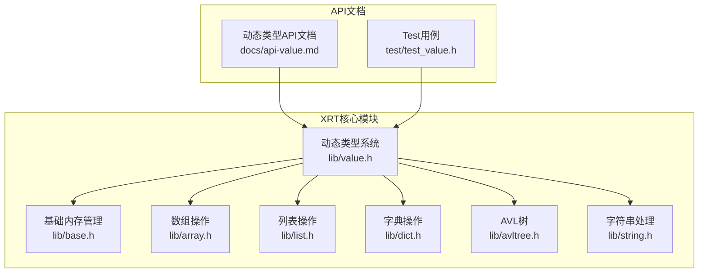
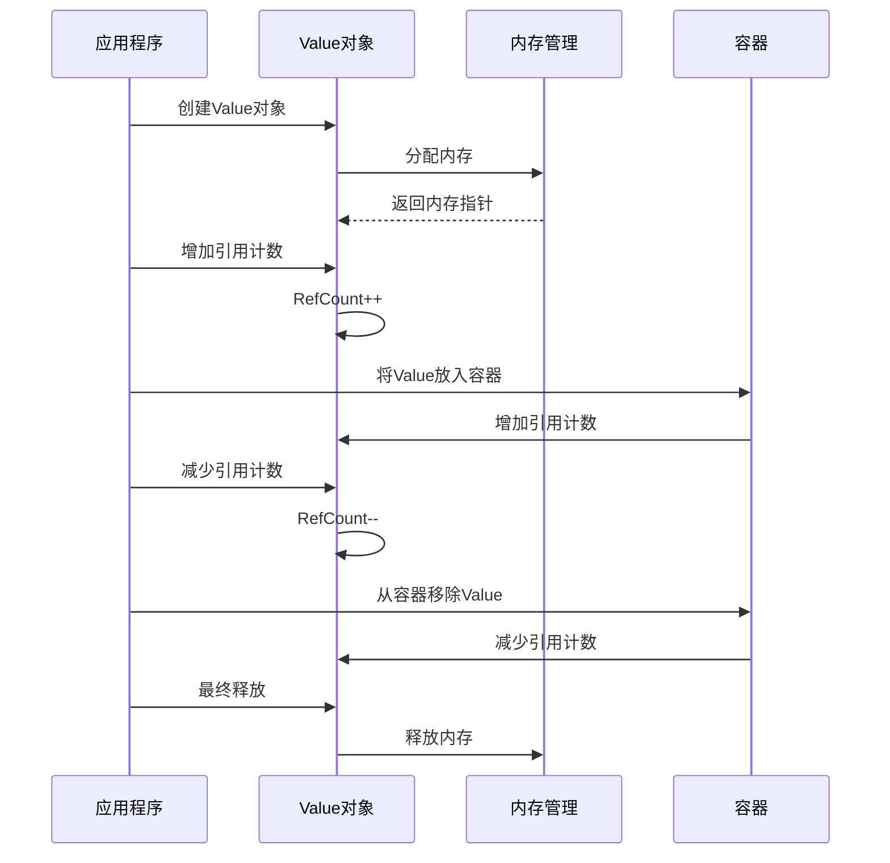
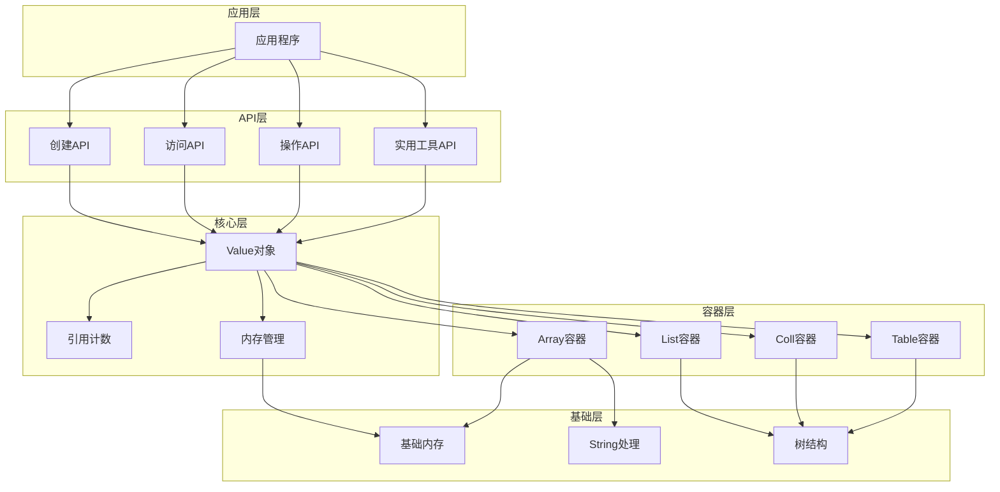
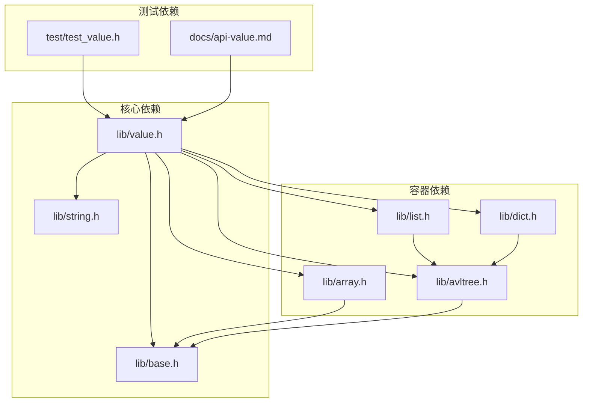
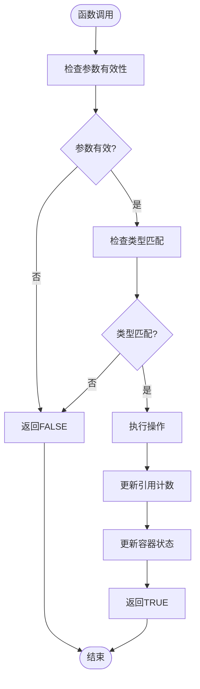

# API使用指南

<cite>
**本文档引用的文件**
- [lib/value.h](file://lib/value.h)
- [docs/api-value.md](file://docs/api-value.md)
- [test/test_value.h](file://test/test_value.h)
- [lib/base.h](file://lib/base.h)
- [lib/array.h](file://lib/array.h)
- [lib/list.h](file://lib/list.h)
- [lib/dict.h](file://lib/dict.h)
- [lib/avltree.h](file://lib/avltree.h)
- [lib/string.h](file://lib/string.h)
- [README.md](file://README.md)
</cite>

## 目录
1. [简介](#简介)
2. [项目结构](#项目结构)
3. [核心组件](#核心组件)
4. [架构概览](#架构概览)
5. [详细组件分析](#详细组件分析)
6. [依赖关系分析](#依赖关系分析)
7. [性能考虑](#性能考虑)
8. [故障排除指南](#故障排除指南)
9. [结论](#结论)
10. [附录](#附录)

## 简介

XRT动态类型系统是X Runtime Library的核心组件之一，提供了完整的C语言动态类型支持。该系统包含16种数据类型，采用26位引用计数自动管理内存，支持容器嵌套和智能内存回收。

### 核心特性
- **16种数据类型**：Empty、Null、Bool、Int、Float、Text、Time、Point、Func、Array、List、Coll、Table、Struct、Object、Custom
- **自动内存管理**：26位引用计数，最大支持6700万+引用
- **容器支持**：Array、List、Coll、Table四种容器类型
- **智能类型转换**：支持多种数据类型间的自动转换
- **调试友好**：提供完整的调试输出功能

## 项目结构

XRT动态类型系统位于lib/value.h文件中，采用模块化设计，与其他核心模块协同工作：



**图表来源**
- [lib/value.h](file://lib/value.h#L1-L1640)
- [docs/api-value.md](file://docs/api-value.md#L1-L1238)
- [test/test_value.h](file://test/test_value.h#L1-L1004)

**章节来源**
- [lib/value.h](file://lib/value.h#L1-L1640)
- [docs/api-value.md](file://docs/api-value.md#L1-L1238)
- [README.md](file://README.md#L135-L158)

## 核心组件

### 数据类型系统

XRT动态类型系统定义了16种数据类型，每种类型都有特定的用途和行为：

| 类型 | 说明 | 典型用途 |
|------|------|----------|
| Empty | 不存在的数据 | 初始化状态 |
| Null | 空值 | 明确的空值表示 |
| Bool | 布尔值 | 真假判断 |
| Int | 64位整数 | 数值计算 |
| Float | 双精度浮点数 | 精确计算 |
| Text | 字符串 | 文本处理 |
| Time | 时间戳 | 日期时间 |
| Point | 指针 | 通用指针存储 |
| Func | 函数指针 | 回调函数 |
| Array | 动态数组 | 有序集合 |
| List | 整数索引列表 | 稀疏数据存储 |
| Coll | 集合（去重） | 唯一元素集合 |
| Table | 字符串键值对字典 | 键值映射 |
| Struct | 结构体 | 自定义数据结构 |
| Object | 对象 | 面向对象封装 |
| Custom | 自定义类型 | 扩展类型 |

### 内存管理架构

动态类型系统采用26位引用计数机制，确保内存的自动管理：



**图表来源**
- [lib/value.h](file://lib/value.h#L33-L96)
- [lib/base.h](file://lib/base.h#L5-L45)

**章节来源**
- [lib/value.h](file://lib/value.h#L25-L74)
- [lib/value.h](file://lib/value.h#L33-L96)

## 架构概览

XRT动态类型系统采用分层架构设计，各层职责明确：



**图表来源**
- [lib/value.h](file://lib/value.h#L100-L1640)
- [lib/base.h](file://lib/base.h#L1-L132)
- [lib/array.h](file://lib/array.h#L1-L180)
- [lib/list.h](file://lib/list.h#L1-L188)
- [lib/dict.h](file://lib/dict.h#L1-L204)
- [lib/avltree.h](file://lib/avltree.h#L1-L126)

## 详细组件分析

### 值创建函数

#### 基础类型创建

**xvoCreateNull** - 创建空值
```c
XXAPI xvalue xvoCreateNull();
```
- **返回值**：返回静态单例的Null值
- **特点**：Null/true/false使用静态单例，无需释放
- **使用场景**：初始化变量、默认值设置

**xvoCreateBool** - 创建布尔值
```c
XXAPI xvalue xvoCreateBool(bool bVal);
```
- **参数**：bVal - 布尔值
- **返回值**：返回TRUE或FALSE的静态单例
- **特点**：布尔值也使用静态单例

**xvoCreateInt** - 创建整数值
```c
XXAPI xvalue xvoCreateInt(int64 iVal);
```
- **参数**：iVal - 64位整数值
- **返回值**：新创建的Int类型Value对象
- **内存管理**：需要调用xvoUnref释放

**xvoCreateFloat** - 创建浮点数值
```c
XXAPI xvalue xvoCreateFloat(double fVal);
```
- **参数**：fVal - 双精度浮点数
- **返回值**：新创建的Float类型Value对象

**xvoCreateText** - 创建字符串值
```c
XXAPI xvalue xvoCreateText(ptr sVal, uint32 iSize, bool bColloc);
```
- **参数**：
  - sVal：字符串指针
  - iSize：字符串长度（0表示自动计算）
  - bColloc：托管模式标志
- **托管模式**：
  - TRUE：直接托管字符串指针，不复制，释放时不释放字符串
  - FALSE：复制字符串内容，释放时释放复制的字符串
- **使用场景**：性能敏感场景使用托管模式，安全性要求使用复制模式

**章节来源**
- [lib/value.h](file://lib/value.h#L101-L167)
- [docs/api-value.md](file://docs/api-value.md#L125-L206)

#### 高级类型创建

**xvoCreateTime** - 创建时间值
```c
XXAPI xvalue xvoCreateTime(xtime tVal);
XXAPI xvalue xvoCreateTimeSerial(int64 iYear, int iMonth, int iDay, int iHour, int iMinute, int iSecond);
```

**xvoCreatePoint** - 创建指针值
```c
XXAPI xvalue xvoCreatePoint(ptr point);
```

**xvoCreateFunc** - 创建函数引用
```c
XXAPI xvalue xvoCreateFunc(xfunction pFunc);
```

**xvoCreateArray** - 创建数组容器
```c
XXAPI xvalue xvoCreateArray();
```

**xvoCreateList** - 创建列表容器
```c
XXAPI xvalue xvoCreateList();
```

**xvoCreateColl** - 创建集合容器
```c
XXAPI xvalue xvoCreateColl();
```

**xvoCreateTable** - 创建表容器
```c
XXAPI xvalue xvoCreateTable();
```

**xvoCreateClass** - 创建类容器
```c
XXAPI xvalue xvoCreateClass(uint32 iSize);
```

**xvoCreateCustom** - 创建自定义类型
```c
XXAPI xvalue xvoCreateCustom(ptr pObj);
```

**章节来源**
- [lib/value.h](file://lib/value.h#L168-L316)
- [docs/api-value.md](file://docs/api-value.md#L209-L358)

### 值访问函数

#### 基础类型访问

**xvoGetBool** - 获取布尔值
```c
XXAPI bool xvoGetBool(xvalue pVal);
```
- **类型转换规则**：
  - NULL → FALSE
  - BOOL → 返回原值
  - INT → 非0为TRUE
  - FLOAT → 非0.0为TRUE
  - 其他类型 → TRUE

**xvoGetInt** - 获取整数值
```c
XXAPI int64 xvoGetInt(xvalue pVal);
```
- **类型转换规则**：
  - NULL → 0
  - BOOL → 1或0
  - INT → 返回原值
  - FLOAT → 截断为整数
  - TEXT → 解析字符串
  - 其他 → 0

**xvoGetFloat** - 获取浮点数值
```c
XXAPI double xvoGetFloat(xvalue pVal);
```

**xvoGetText** - 获取字符串值
```c
XXAPI str xvoGetText(xvalue pVal);
```
- **特点**：非TEXT类型返回临时字符串，不需要释放
- **使用场景**：调试输出、格式化显示

**章节来源**
- [lib/value.h](file://lib/value.h#L321-L425)
- [docs/api-value.md](file://docs/api-value.md#L362-L421)

#### 高级类型访问

**xvoGetTime** - 获取时间值
```c
XXAPI xtime xvoGetTime(xvalue pVal);
```

**xvoGetPoint** - 获取指针值
```c
XXAPI ptr xvoGetPoint(xvalue pVal);
```

**xvoGetFunc** - 获取函数指针
```c
XXAPI xfunction xvoGetFunc(xvalue pVal);
```

**容器类型访问**
```c
XXAPI xparray xvoGetArray(xvalue pVal);
XXAPI xlist xvoGetList(xvalue pVal);
XXAPI xavltree xvoGetColl(xvalue pVal);
XXAPI xdict xvoGetTable(xvalue pVal);
XXAPI ptr xvoGetClass(xvalue pVal);
XXAPI ptr xvoGetCustom(xvalue pVal);
```

**章节来源**
- [lib/value.h](file://lib/value.h#L426-L517)
- [docs/api-value.md](file://docs/api-value.md#L423-L468)

### 数组操作函数

#### 数组基本操作

**xvoArrayGetValue** - 获取数组元素
```c
XXAPI xvalue xvoArrayGetValue(xvalue pArr, uint32 index);
```
- **参数**：index - 从0开始的索引
- **返回值**：元素Value，不存在则返回NULL

**xvoArrayAppendValue** - 追加元素到数组末尾
```c
XXAPI bool xvoArrayAppendValue(xvalue pArr, xvalue pVal, bool bColloc);
```
- **参数**：
  - pArr：数组Value
  - pVal：要追加的值
  - bColloc：TRUE=托管引用，FALSE=增加引用计数
- **返回值**：操作成功返回TRUE，失败返回FALSE

**xvoArrayInsertValue** - 在指定位置插入元素
```c
XXAPI bool xvoArrayInsertValue(xvalue pArr, uint32 index, xvalue pVal, bool bColloc);
```

**xvoArraySetValue** - 修改指定位置的元素
```c
XXAPI bool xvoArraySetValue(xvalue pArr, uint32 index, xvalue pVal, bool bColloc);
```
- **特点**：会自动释放旧值

**章节来源**
- [lib/value.h](file://lib/value.h#L522-L601)
- [docs/api-value.md](file://docs/api-value.md#L543-L621)

#### 数组高级操作

**xvoArrayMerge** - 合并数组
```c
XXAPI bool xvoArrayMerge(xvalue pArr1, xvalue pArr2);
```

**xvoArraySwap** - 交换元素位置
```c
XXAPI bool xvoArraySwap(xvalue pArr, uint32 index1, uint32 index2);
```

**xvoArrayRemove** - 删除元素
```c
XXAPI bool xvoArrayRemove(xvalue pArr, uint32 index, uint32 count);
```

**xvoArrayItemCount** - 获取元素数量
```c
XXAPI uint32 xvoArrayItemCount(xvalue pArr);
```

**xvoArrayClear** - 清空数组
```c
XXAPI bool xvoArrayClear(xvalue pArr);
```

**xvoArrayAlloc** - 预分配容量
```c
XXAPI bool xvoArrayAlloc(xvalue pArr, uint32 count);
```

**xvoArraySort** - 排序
```c
XXAPI bool xvoArraySort(xvalue pArr, ptr proc);
```

**章节来源**
- [lib/value.h](file://lib/value.h#L606-L700)
- [docs/api-value.md](file://docs/api-value.md#L664-L688)

### 列表操作函数

#### 列表基本操作

**xvoListGetValue** - 获取列表元素
```c
XXAPI xvalue xvoListGetValue(xvalue pList, int64 index);
```
- **特点**：索引可以是任意int64值（类似稀疏数组）

**xvoListSetValue** - 设置列表元素
```c
XXAPI bool xvoListSetValue(xvalue pList, int64 index, xvalue pVal, bool bColloc);
```

**章节来源**
- [lib/value.h](file://lib/value.h#L704-L743)
- [docs/api-value.md](file://docs/api-value.md#L709-L745)

#### 列表高级操作

**xvoListMerge** - 合并列表
```c
XXAPI bool xvoListMerge(xvalue pList1, xvalue pList2, bool bReWrite);
```

**xvoListExists** - 检查元素是否存在
```c
XXAPI bool xvoListExists(xvalue pList, int64 index);
```

**xvoListRemove** - 删除元素
```c
XXAPI bool xvoListRemove(xvalue pList, int64 index);
```

**xvoListItemCount** - 获取元素数量
```c
XXAPI uint32 xvoListItemCount(xvalue pList);
```

**xvoListClear** - 清空列表
```c
XXAPI bool xvoListClear(xvalue pList);
```

**xvoListSetParent** - 设置父列表
```c
XXAPI bool xvoListSetParent(xvalue pList, xvalue pParentList);
```

**章节来源**
- [lib/value.h](file://lib/value.h#L748-L857)
- [docs/api-value.md](file://docs/api-value.md#L750-L784)

### 集合操作函数

#### 集合基本操作

**xvoCollSetValue** - 添加元素到集合
```c
XXAPI bool xvoCollSetValue(xvalue pColl, xvalue pVal, bool bColloc);
```

**章节来源**
- [lib/value.h](file://lib/value.h#L899-L910)
- [docs/api-value.md](file://docs/api-value.md#L791-L811)

#### 集合运算

**xvoCollDifference** - 获取差集
```c
XXAPI xvalue xvoCollDifference(xvalue pSelf, xvalue pColl);
```

**xvoCollSymmetricDifference** - 获取对称差集
```c
XXAPI xvalue xvoCollSymmetricDifference(xvalue pSelf, xvalue pColl);
```

**xvoCollIntersection** - 获取交集
```c
XXAPI xvalue xvoCollIntersection(xvalue pSelf, xvalue pColl);
```

**xvoCollUnion** - 获取并集
```c
XXAPI xvalue xvoCollUnion(xvalue pSelf, xvalue pColl);
```

**xvoCollMerge** - 合并集合
```c
XXAPI bool xvoCollMerge(xvalue pSelf, xvalue pColl);
```

**章节来源**
- [lib/value.h](file://lib/value.h#L914-L1035)
- [docs/api-value.md](file://docs/api-value.md#L815-L832)

#### 集合高级操作

**xvoCollExists** - 检查元素是否存在
```c
XXAPI bool xvoCollExists(xvalue pColl, xvalue pVal);
```

**xvoCollRemove** - 删除元素
```c
XXAPI bool xvoCollRemove(xvalue pColl, xvalue pVal);
```

**xvoCollItemCount** - 获取元素数量
```c
XXAPI uint32 xvoCollItemCount(xvalue pColl);
```

**xvoCollClear** - 清空集合
```c
XXAPI bool xvoCollClear(xvalue pColl);
```

**xvoCollSetParent** - 设置父集合
```c
XXAPI bool xvoCollSetParent(xvalue pColl, xvalue pParentColl);
```

**章节来源**
- [lib/value.h](file://lib/value.h#L1040-L1109)
- [docs/api-value.md](file://docs/api-value.md#L838-L855)

### 表操作函数

#### 表基本操作

**xvoTableGetValue** - 获取表元素
```c
XXAPI xvalue xvoTableGetValue(xvalue pTbl, str key, uint32 kl);
```

**xvoTableSetValue** - 设置表元素
```c
XXAPI bool xvoTableSetValue(xvalue pTbl, str key, uint32 kl, xvalue pVal, bool bColloc);
```

**章节来源**
- [lib/value.h](file://lib/value.h#L1114-L1165)
- [docs/api-value.md](file://docs/api-value.md#L891-L951)

#### 表高级操作

**xvoTableMerge** - 合并表
```c
XXAPI bool xvoTableMerge(xvalue pTbl1, xvalue pTbl2, bool bReWrite);
```

**xvoTableExists** - 检查键是否存在
```c
XXAPI bool xvoTableExists(xvalue pTbl, str key, uint32 kl);
```

**xvoTableRemove** - 删除键
```c
XXAPI bool xvoTableRemove(xvalue pTbl, str key, uint32 kl);
```

**xvoTableItemCount** - 获取元素数量
```c
XXAPI uint32 xvoTableItemCount(xvalue pTbl);
```

**xvoTableClear** - 清空表
```c
XXAPI bool xvoTableClear(xvalue pTbl);
```

**xvoTableSetParent** - 设置父表
```c
XXAPI bool xvoTableSetParent(xvalue pTbl, xvalue pParentTable);
```

**章节来源**
- [lib/value.h](file://lib/value.h#L1169-L1286)
- [docs/api-value.md](file://docs/api-value.md#L955-L975)

### 类型判断和实用函数

**xvoIsNull** - 检查是否为NULL
```c
XXAPI bool xvoIsNull(xvalue pVal);
```

**xvoType** - 获取值的类型
```c
XXAPI int xvoType(xvalue pVal);
```

**xvoGetSize** - 获取数据大小
```c
XXAPI uint32 xvoGetSize(xvalue pVal);
```

**xvoCopy** - 浅拷贝
```c
XXAPI xvalue xvoCopy(xvalue pVal);
```

**xvoDeepCopy** - 深拷贝
```c
XXAPI xvalue xvoDeepCopy(xvalue pVal);
```

**xvoPrintValue** - 打印Value的结构和值
```c
XXAPI void xvoPrintValue(xvalue objVal, int iLevel, int iMode, int64 iKey, str sKey);
```

**章节来源**
- [lib/value.h](file://lib/value.h#L1291-L1518)
- [docs/api-value.md](file://docs/api-value.md#L472-L538)

## 依赖关系分析

XRT动态类型系统依赖于多个核心模块，形成了完整的依赖关系：



**图表来源**
- [lib/value.h](file://lib/value.h#L1-L1640)
- [lib/base.h](file://lib/base.h#L1-L132)
- [lib/array.h](file://lib/array.h#L1-L180)
- [lib/list.h](file://lib/list.h#L1-L188)
- [lib/dict.h](file://lib/dict.h#L1-L204)
- [lib/avltree.h](file://lib/avltree.h#L1-L126)

### 内存管理依赖

动态类型系统对内存管理有严格的要求：



**图表来源**
- [lib/value.h](file://lib/value.h#L541-L557)
- [lib/value.h](file://lib/value.h#L723-L742)

**章节来源**
- [lib/value.h](file://lib/value.h#L1-L1640)
- [test/test_value.h](file://test/test_value.h#L267-L564)

## 性能考虑

### 内存管理优化

XRT动态类型系统采用了多项性能优化技术：

1. **26位引用计数**：支持最多6700万+引用，避免频繁的内存分配和释放
2. **静态单例模式**：Null、True、False使用静态单例，减少内存分配
3. **托管模式**：字符串支持托管模式，避免不必要的字符串复制
4. **容器预分配**：数组支持预分配容量，减少动态扩容开销

### 算法复杂度

| 操作类型 | 时间复杂度 | 空间复杂度 | 说明 |
|----------|------------|------------|------|
| 基础类型创建 | O(1) | O(1) | 直接分配内存 |
| 基础类型访问 | O(1) | O(1) | 直接访问union字段 |
| 数组追加 | O(1)摊销 | O(1) | 动态扩容时O(n) |
| 数组访问 | O(1) | O(1) | 直接索引访问 |
| 列表访问 | O(log n) | O(1) | AVL树查找 |
| 集合操作 | O(log n) | O(1) | AVL树操作 |
| 表操作 | O(log n) | O(1) | AVL树操作 |

### 性能最佳实践

1. **批量操作**：使用xvoArrayAlloc预分配数组容量
2. **托管模式**：对于常量字符串使用托管模式
3. **引用管理**：及时调用xvoUnref释放不再使用的Value
4. **容器选择**：根据使用场景选择合适的容器类型

**章节来源**
- [docs/api-value.md](file://docs/api-value.md#L1202-L1218)
- [lib/value.h](file://lib/value.h#L800-L857)

## 故障排除指南

### 常见错误类型

#### 内存相关错误

**内存泄漏**：
- 症状：程序运行时间越长，内存使用量持续增长
- 原因：忘记调用xvoUnref或循环引用
- 解决方案：检查所有Value对象的引用计数，确保成对调用

**双重释放**：
- 症状：程序崩溃或访问违规
- 原因：同一个Value对象调用了多次xvoUnref
- 解决方案：使用调试版本检查引用计数

#### 类型相关错误

**类型不匹配**：
- 症状：访问函数返回意外值
- 原因：传入了错误类型的Value对象
- 解决方案：使用xvoType检查类型，或使用类型检查函数

**空指针访问**：
- 症状：程序崩溃
- 原因：传入了NULL参数
- 解决方案：始终检查参数的有效性

### 调试技巧

1. **使用xvoPrintValue**：打印Value的完整结构和值
2. **检查引用计数**：通过调试输出观察引用计数变化
3. **单元测试**：使用test_value.h中的测试用例验证功能

**章节来源**
- [docs/api-value.md](file://docs/api-value.md#L1052-L1090)
- [test/test_value.h](file://test/test_value.h#L14-L262)

## 结论

XRT动态类型系统为C语言提供了现代化的动态类型支持，具有以下优势：

1. **完整的类型系统**：16种数据类型满足各种使用场景
2. **自动内存管理**：26位引用计数确保内存安全
3. **高性能设计**：优化的算法和数据结构保证执行效率
4. **易于使用**：直观的API设计降低学习成本
5. **全面测试**：31个测试模块确保代码质量

该系统特别适用于需要动态数据处理的应用场景，如配置管理、数据序列化、模板引擎等。通过遵循本文档的最佳实践，开发者可以充分利用XRT动态类型系统的优势，构建高质量的C语言应用程序。

## 附录

### API使用示例

#### 基础使用示例

```c
// 创建数组并添加不同类型的元素
xvalue arr = xvoCreateArray();
xvoArrayAppendInt(arr, 123);
xvoArrayAppendText(arr, "Hello", 0, FALSE);
xvoArrayAppendFloat(arr, 3.14);

// 获取元素并进行类型转换
int64 intValue = xvoArrayGetInt(arr, 0);
str textValue = xvoArrayGetText(arr, 1);
double floatValue = xvoArrayGetFloat(arr, 2);

// 释放资源
xvoUnref(arr);
```

#### 高级使用示例

```c
// 创建嵌套结构
xvalue table = xvoCreateTable();
xvoTableSetText(table, "name", 0, "XRT", 0, FALSE);
xvoTableSetInt(table, "version", 0, 1);

xvalue array = xvoCreateArray();
xvoArrayAppendText(array, "fast", 0, FALSE);
xvoArrayAppendText(array, "simple", 0, FALSE);
xvoTableSetValue(table, "features", 0, array, FALSE);

// 深拷贝
xvalue copy = xvoDeepCopy(table);

// 释放资源
xvoUnref(table);
xvoUnref(copy);
```

### 版本兼容性和迁移指南

XRT动态类型系统在版本升级时保持向后兼容性，主要变更包括：

1. **新增API**：新增的API不影响现有代码的编译和运行
2. **性能优化**：内部实现优化，对外API保持不变
3. **错误处理**：改进的错误处理机制，增强程序稳定性

**迁移建议**：
- 升级时先运行现有的测试用例
- 检查是否有废弃API的替代方案
- 更新性能相关的代码以利用新的优化

**章节来源**
- [README.md](file://README.md#L135-L158)
- [docs/api-value.md](file://docs/api-value.md#L1222-L1231)