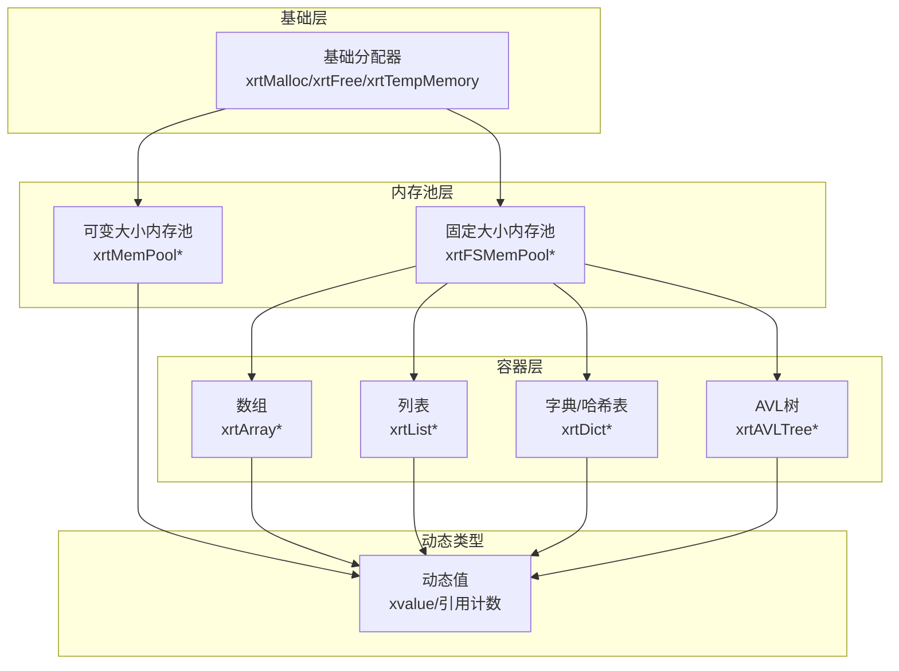
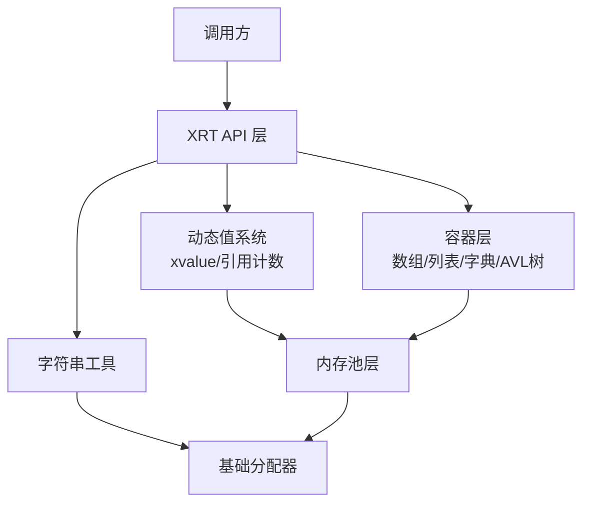
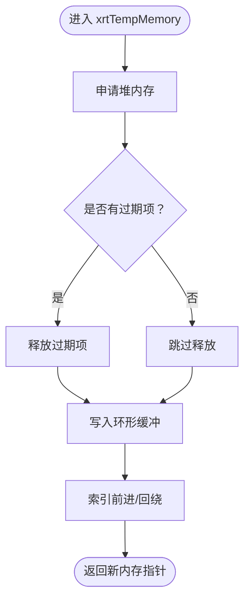
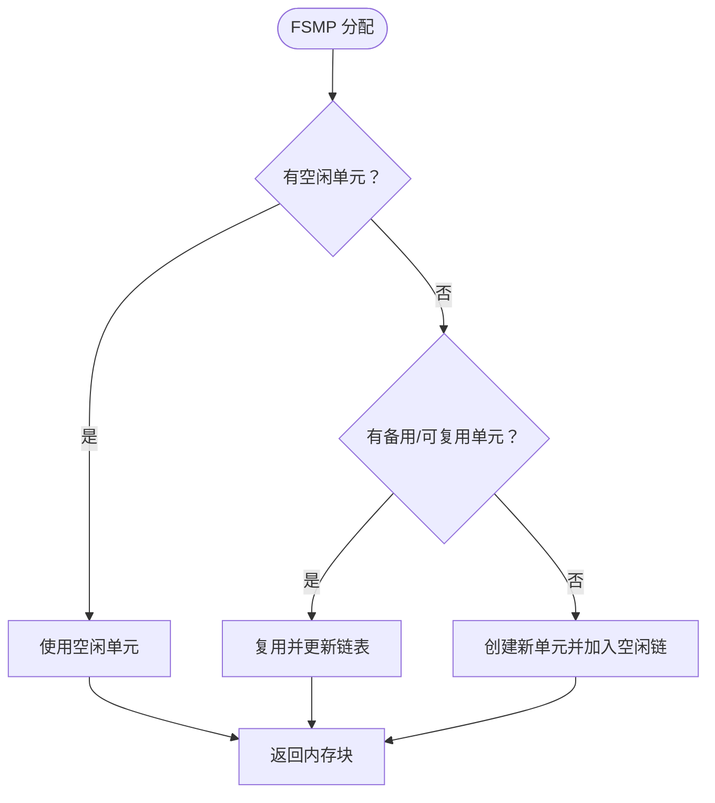
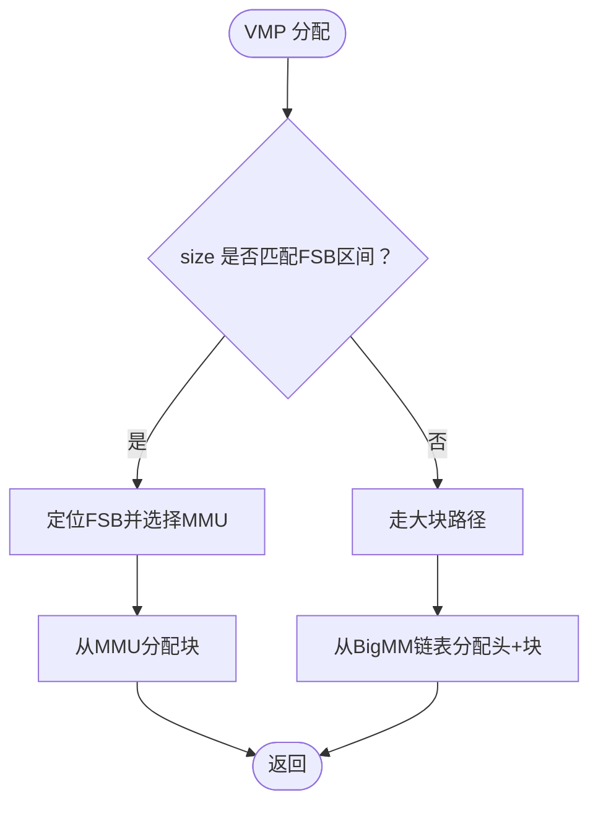
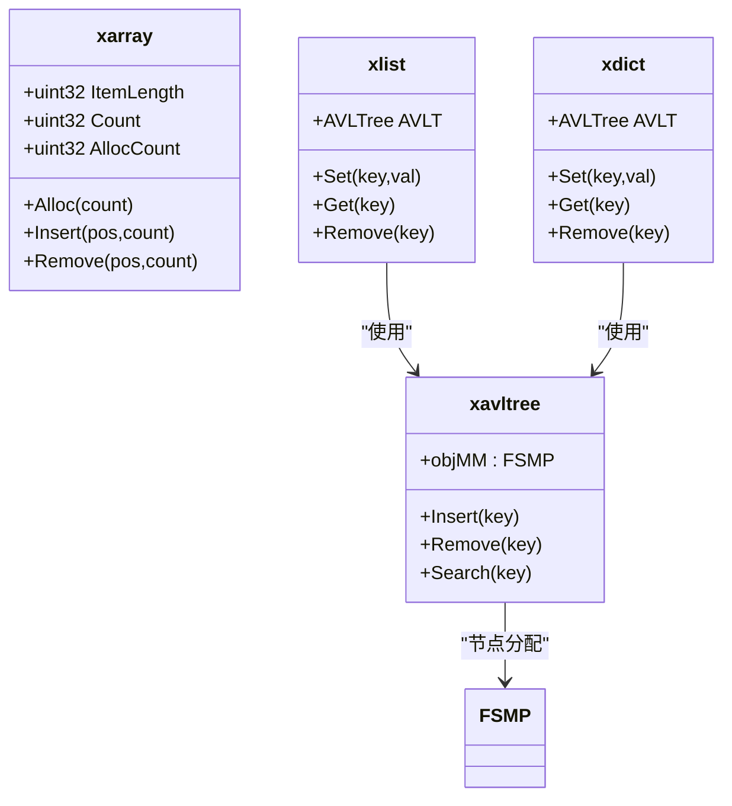
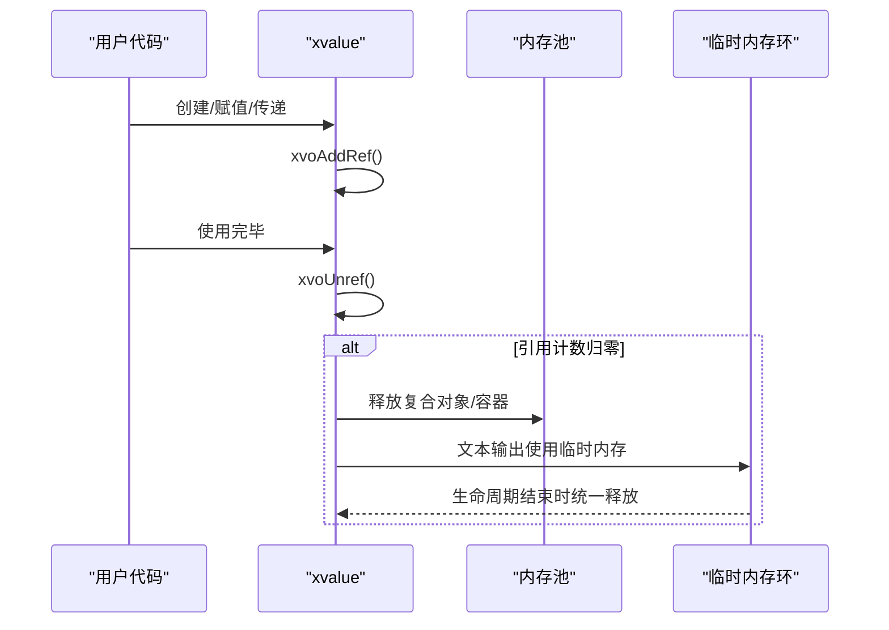
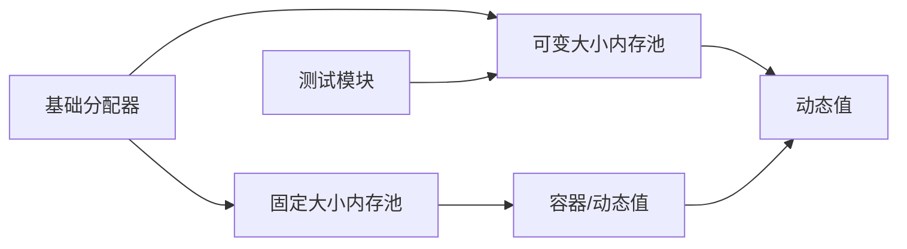

# 内存管理策略

<cite>
**本文引用的文件**
- [lib/value.h](file://lib/value.h)
- [lib/base.h](file://lib/base.h)
- [lib/mempool.h](file://lib/mempool.h)
- [lib/mempool_fs.h](file://lib/mempool_fs.h)
- [lib/bsmm.h](file://lib/bsmm.h)
- [lib/string.h](file://lib/string.h)
- [lib/array.h](file://lib/array.h)
- [lib/list.h](file://lib/list.h)
- [lib/dict.h](file://lib/dict.h)
- [lib/avltree.h](file://lib/avltree.h)
- [lib/stack.h](file://lib/stack.h)
- [test/test_mempool.h](file://test/test_mempool.h)
</cite>

## 目录
1. [引言](#引言)
2. [项目结构](#项目结构)
3. [核心组件](#核心组件)
4. [架构总览](#架构总览)
5. [详细组件分析](#详细组件分析)
6. [依赖关系分析](#依赖关系分析)
7. [性能考量](#性能考量)
8. [故障排查指南](#故障排查指南)
9. [结论](#结论)
10. [附录](#附录)

## 引言
本文件面向XRT动态类型系统的内存管理策略，系统性阐述其堆内存分配、栈内存优化与临时内存池的使用方式；解析不同数据类型的内存布局与存储策略（含小对象优化、大对象处理与字符串驻留思路）；说明引用计数回收、静态值优化与内存碎片处理机制；并提供内存使用监控与调试方法、内存泄漏检测与性能分析最佳实践，以及内存管理对系统整体性能的影响与优化技巧。

## 项目结构
XRT的内存管理由基础分配器、固定大小内存池、可变大小内存池、通用容器（数组/列表/字典/AVL树）与临时内存环组成。基础分配器负责最底层的堆内存申请与释放；固定大小内存池与可变大小内存池分别面向高频小块与大块内存需求；容器内部广泛使用固定大小内存池以减少碎片；临时内存环用于短期、高吞吐场景下的快速回收。

图表来源
- [lib/base.h](file://lib/base.h#L5-L132)
- [lib/mempool_fs.h](file://lib/mempool_fs.h#L5-L257)
- [lib/mempool.h](file://lib/mempool.h#L5-L468)
- [lib/array.h](file://lib/array.h#L5-L180)
- [lib/list.h](file://lib/list.h#L19-L188)
- [lib/dict.h](file://lib/dict.h#L30-L204)
- [lib/avltree.h](file://lib/avltree.h#L5-L126)
- [lib/value.h](file://lib/value.h#L33-L96)

章节来源
- [lib/base.h](file://lib/base.h#L5-L132)
- [lib/mempool_fs.h](file://lib/mempool_fs.h#L5-L257)
- [lib/mempool.h](file://lib/mempool.h#L5-L468)
- [lib/array.h](file://lib/array.h#L5-L180)
- [lib/list.h](file://lib/list.h#L19-L188)
- [lib/dict.h](file://lib/dict.h#L30-L204)
- [lib/avltree.h](file://lib/avltree.h#L5-L126)
- [lib/value.h](file://lib/value.h#L33-L96)

## 核心组件
- 基础分配器：封装系统malloc/calloc/realloc/free，并提供临时内存环与错误上报。
- 固定大小内存池：按固定块大小管理，适合频繁创建/销毁的小对象，降低碎片。
- 可变大小内存池：采用FSB（可变大小块）+ MMU（内存单元）两级组织，支持小块与大块混合管理。
- 通用容器：数组、列表、字典、AVL树均内置固定大小内存池，统一节点分配与回收。
- 动态值系统：xvalue采用引用计数，支持静态值优化与延迟销毁，配合全局临时内存环提升短期字符串输出效率。

章节来源
- [lib/base.h](file://lib/base.h#L5-L132)
- [lib/mempool_fs.h](file://lib/mempool_fs.h#L5-L257)
- [lib/mempool.h](file://lib/mempool.h#L5-L468)
- [lib/array.h](file://lib/array.h#L5-L180)
- [lib/list.h](file://lib/list.h#L19-L188)
- [lib/dict.h](file://lib/dict.h#L30-L204)
- [lib/avltree.h](file://lib/avltree.h#L5-L126)
- [lib/value.h](file://lib/value.h#L33-L96)

## 架构总览
XRT内存管理采用“基础分配器 + 内存池 + 容器/动态值”的分层设计。基础分配器提供统一入口；内存池层承担高频分配的热点路径；容器与动态值在各自生命周期内复用内存池，减少碎片与系统调用开销。

图表来源
- [lib/base.h](file://lib/base.h#L5-L132)
- [lib/mempool.h](file://lib/mempool.h#L5-L468)
- [lib/mempool_fs.h](file://lib/mempool_fs.h#L5-L257)
- [lib/string.h](file://lib/string.h#L5-L204)
- [lib/array.h](file://lib/array.h#L5-L180)
- [lib/list.h](file://lib/list.h#L19-L188)
- [lib/dict.h](file://lib/dict.h#L30-L204)
- [lib/avltree.h](file://lib/avltree.h#L5-L126)
- [lib/value.h](file://lib/value.h#L33-L96)

## 详细组件分析

### 基础分配器与临时内存环
- 堆内存分配：xrtMalloc/xrtCalloc/xrtRealloc封装系统接口，失败时设置错误。
- 临时内存环：xrtTempMemory按环形索引缓存最近N块临时内存，xrtFreeTempMemory一次性释放，适合短生命周期的中间结果。
- 错误处理：xrtSetError/xrtClearError统一错误上报与清理。

图表来源
- [lib/base.h](file://lib/base.h#L49-L84)

章节来源
- [lib/base.h](file://lib/base.h#L5-L132)

### 固定大小内存池（FSMP）
- 设计目标：为固定大小对象提供极低开销的分配/回收，避免频繁系统调用与碎片。
- 关键流程：空闲链表/满载链表/备用链表管理；首次无可用单元时创建新单元；回收后根据使用率迁移链表；清空后可进入备用或释放。
- GC：遍历空闲/满载单元执行标记回收，再按使用率归位。

图表来源
- [lib/mempool_fs.h](file://lib/mempool_fs.h#L52-L125)

章节来源
- [lib/mempool_fs.h](file://lib/mempool_fs.h#L5-L257)

### 可变大小内存池（VMP）
- 设计目标：兼顾小块与大块的高效管理，小块走FSB+MMU树，大块走独立链表。
- 关键流程：根据请求大小定位FSB区间，选择合适MMU；若无合适FSB则走大块路径；回收时区分大块与FSB块，分别处理。
- GC：递归遍历FSB树下所有空闲/满载单元，按标记回收；大块链表按标记位回收或保留。

图表来源
- [lib/mempool.h](file://lib/mempool.h#L148-L261)

章节来源
- [lib/mempool.h](file://lib/mempool.h#L5-L468)

### 通用容器的内存策略
- 数组：基于连续内存块，按步长增长；元素为指针时，容器不持有对象所有权，仅在集合操作中进行引用计数调整。
- 列表/字典/AVL树：内部使用固定大小内存池分配节点，删除时统一通过FSMP释放节点，避免碎片。
- 字典键：键空间可配置内存池，删除时可选择释放键内存或复用。

图表来源
- [lib/array.h](file://lib/array.h#L5-L180)
- [lib/list.h](file://lib/list.h#L19-L188)
- [lib/dict.h](file://lib/dict.h#L30-L204)
- [lib/avltree.h](file://lib/avltree.h#L5-L126)
- [lib/mempool_fs.h](file://lib/mempool_fs.h#L5-L257)

章节来源
- [lib/array.h](file://lib/array.h#L5-L180)
- [lib/list.h](file://lib/list.h#L19-L188)
- [lib/dict.h](file://lib/dict.h#L30-L204)
- [lib/avltree.h](file://lib/avltree.h#L5-L126)
- [lib/mempool_fs.h](file://lib/mempool_fs.h#L5-L257)

### 动态值系统与引用计数
- 静态值：null、true、false等常量值直接复用，避免重复分配与销毁。
- 引用计数：xvoAddRef/xvoUnref维护对象引用计数；超过阈值转为静态值；引用归零时触发销毁，递归释放复合类型字段。
- 文本输出：xvoGetText在非文本类型时使用临时内存环生成字符串，避免长期占用堆内存。

图表来源
- [lib/value.h](file://lib/value.h#L33-L96)
- [lib/base.h](file://lib/base.h#L49-L84)

章节来源
- [lib/value.h](file://lib/value.h#L33-L96)
- [lib/base.h](file://lib/base.h#L49-L84)

### 字符串驻留与复制策略
- 复制策略：xrtCopyStr等提供复制接口，返回堆内存，需显式释放。
- 驻留思路：当前未见集中式字符串驻留表；可通过上层业务逻辑缓存常用字符串以减少重复分配。
- 输出优化：xvoGetText在数值/时间等类型转字符串时使用临时内存环，避免堆分配。

章节来源
- [lib/string.h](file://lib/string.h#L5-L204)
- [lib/value.h](file://lib/value.h#L367-L425)

## 依赖关系分析
- 基础分配器被所有上层模块依赖，是唯一直接调用系统分配的模块。
- 内存池层向上提供统一分配接口，向下复用基础分配器。
- 容器与动态值系统通过内存池完成节点与对象的分配/回收，形成强耦合的稳定依赖链。
- 测试模块验证内存池树结构与分配/回收行为。

图表来源
- [lib/base.h](file://lib/base.h#L5-L132)
- [lib/mempool_fs.h](file://lib/mempool_fs.h#L5-L257)
- [lib/mempool.h](file://lib/mempool.h#L5-L468)
- [lib/array.h](file://lib/array.h#L5-L180)
- [lib/list.h](file://lib/list.h#L19-L188)
- [lib/dict.h](file://lib/dict.h#L30-L204)
- [lib/avltree.h](file://lib/avltree.h#L5-L126)
- [lib/value.h](file://lib/value.h#L33-L96)
- [test/test_mempool.h](file://test/test_mempool.h#L25-L187)

章节来源
- [test/test_mempool.h](file://test/test_mempool.h#L25-L187)

## 性能考量
- 小对象优化：固定大小内存池显著降低碎片与系统调用次数，建议优先使用FSMP承载高频小对象。
- 大对象处理：可变大小内存池通过FSB树与大块链表平衡小/大对象，避免单一策略的性能瓶颈。
- 临时内存环：短期中间结果集中释放，减少碎片与GC压力，适合批量处理场景。
- 引用计数：静态值优化与阈值控制避免过度引用计数带来的维护成本；复合类型销毁时的递归释放需注意深度与复杂度。
- 字符串输出：临时内存环用于非持久化字符串，避免堆分配；如需持久化，请使用复制接口并自行管理生命周期。

[本节为通用指导，无需列出章节来源]

## 故障排查指南
- 内存泄漏检测
  - 使用容器/动态值的销毁接口确保资源释放（数组/列表/字典/AVL树/动态值）。
  - 对于字符串，确认复制路径与释放路径一致，避免遗漏释放。
  - 使用可变大小内存池的GC接口进行周期性回收，减少碎片积累。
- 性能问题定位
  - 观察容器节点分配/回收频率，评估是否应切换到固定大小内存池。
  - 检查临时内存环使用是否合理，避免过长生命周期导致频繁释放。
  - 关注动态值的引用计数变化，避免不必要的拷贝与共享。
- 调试工具与方法
  - 通过测试模块打印内存池树结构与状态，验证FSB区间与单元链表状态。
  - 在关键路径记录分配/释放事件，结合日志定位异常。

章节来源
- [lib/mempool.h](file://lib/mempool.h#L427-L468)
- [lib/mempool_fs.h](file://lib/mempool_fs.h#L224-L257)
- [test/test_mempool.h](file://test/test_mempool.h#L25-L187)

## 结论
XRT通过“基础分配器 + 内存池 + 容器/动态值”的分层设计，在保证易用性的同时实现了高效的内存管理。固定大小内存池与可变大小内存池分别覆盖高频小对象与大对象场景；容器与动态值系统复用内存池，有效降低碎片；临时内存环进一步优化短期输出性能。结合引用计数与静态值优化，系统在正确性与性能之间取得良好平衡。建议在实际应用中遵循本文提供的最佳实践，持续监控与优化内存使用。

[本节为总结，无需列出章节来源]

## 附录
- 最佳实践清单
  - 高频小对象优先使用固定大小内存池。
  - 批量处理场景启用临时内存环，结束后统一释放。
  - 动态值与容器销毁时确保引用计数归零，避免悬挂引用。
  - 定期运行内存池GC，缓解碎片。
  - 字符串持久化使用复制接口并显式释放。

[本节为补充说明，无需列出章节来源]