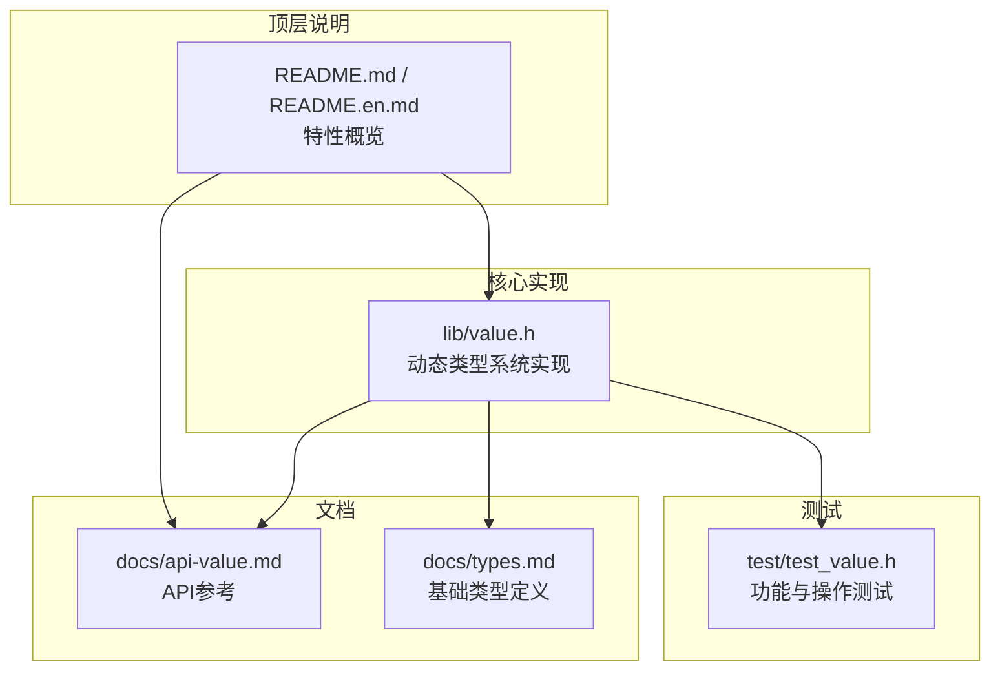
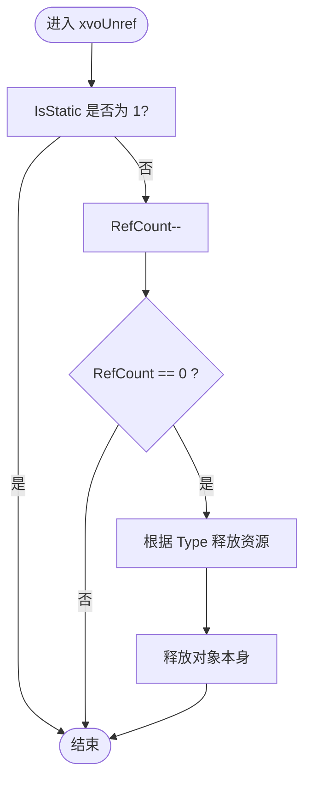
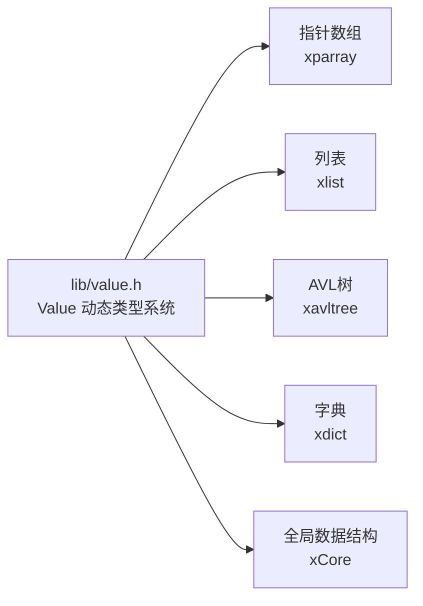

# 动态类型系统

<cite>
**本文档引用的文件**
- [lib/value.h](file://lib/value.h)
- [docs/api-value.md](file://docs/api-value.md)
- [docs/types.md](file://docs/types.md)
- [test/test_value.h](file://test/test_value.h)
- [README.md](file://README.md)
- [README.en.md](file://README.en.md)
</cite>

## 目录
1. [简介](#简介)
2. [项目结构](#项目结构)
3. [核心组件](#核心组件)
4. [架构总览](#架构总览)
5. [详细组件分析](#详细组件分析)
6. [依赖关系分析](#依赖关系分析)
7. [性能考量](#性能考量)
8. [故障排查指南](#故障排查指南)
9. [结论](#结论)
10. [附录](#附录)

## 简介
本文件系统性阐述 XRT 动态类型系统（Value）模块，围绕 16 种数据类型（null、bool、int、float、text、time、point、func、array、list、coll、table、class、custom）的完整实现进行深入解析，重点说明：
- 26 位引用计数机制的工作原理、静态值优化策略与垃圾回收行为
- 类型转换规则、内存管理与性能优化
- 完整 API 使用指南：值的创建、访问、修改与销毁
- 动态类型的使用示例、最佳实践与常见陷阱
- 与 C 语言原生类型的互操作性与性能考虑

## 项目结构
XRT 动态类型系统位于 lib/value.h，配套文档在 docs/api-value.md，类型定义与基础类型在 docs/types.md，测试样例在 test/test_value.h。整体采用“核心实现 + 文档 + 测试”的组织方式，便于理解与验证。



图表来源
- [lib/value.h](file://lib/value.h#L1-L1640)
- [docs/api-value.md](file://docs/api-value.md#L1-L1238)
- [docs/types.md](file://docs/types.md#L1-L725)
- [test/test_value.h](file://test/test_value.h#L1-L1004)
- [README.md](file://README.md#L135-L157)
- [README.en.md](file://README.en.md#L135-L157)

章节来源
- [lib/value.h](file://lib/value.h#L1-L1640)
- [docs/api-value.md](file://docs/api-value.md#L1-L1238)
- [docs/types.md](file://docs/types.md#L1-L725)
- [test/test_value.h](file://test/test_value.h#L1-L1004)
- [README.md](file://README.md#L135-L157)
- [README.en.md](file://README.en.md#L135-L157)

## 核心组件
- 值结构与类型常量：xvalue_struct、XVO_DT_* 类型常量、函数指针类型
- 值生命周期管理：xvoAddRef、xvoUnref、静态值优化
- 值创建与销毁：xvoCreateNull、xvoCreateBool、xvoCreateInt、xvoCreateFloat、xvoCreateText、xvoCreateTime、xvoCreatePoint、xvoCreateFunc、xvoCreateArray、xvoCreateList、xvoCreateColl、xvoCreateTable、xvoCreateClass、xvoCreateCustom
- 值读取与类型判断：xvoGetBool、xvoGetInt、xvoGetFloat、xvoGetText、xvoGetTime、xvoGetPoint、xvoGetFunc、xvoGetArray、xvoGetList、xvoGetColl、xvoGetTable、xvoGetClass、xvoGetCustom、xvoIsNull、xvoType、xvoGetSize
- 容器操作：数组、列表、集合、表的增删改查与合并、集合运算、父子关联
- 拷贝与调试：xvoCopy、xvoDeepCopy、xvoPrintValue
- 内存与性能：托管模式（bColloc）、预分配、临时内存、引用计数上限与静态值转换

章节来源
- [lib/value.h](file://lib/value.h#L1-L1640)
- [docs/api-value.md](file://docs/api-value.md#L25-L1238)
- [docs/types.md](file://docs/types.md#L28-L328)

## 架构总览
动态类型系统以紧凑的 16 字节值结构承载数据，通过类型字段区分 16 种数据类型，并以联合体存储具体值。复杂类型（数组、列表、集合、表）内部持有各自底层容器（指针数组、链表、AVL树、字典）。引用计数（26 位）与静态值优化共同实现自动内存管理与垃圾回收。

```mermaid
classDiagram
class xvalue_struct {
+uint32 Type : 4
+uint32 Reserve : 1
+uint32 IsStatic : 1
+uint32 RefCount : 26
+uint32 Size
+union v
}
class xvalue {
<<typedef *xvalue>>
}
class xfunction {
<<typedef xvalue (*)(xvalue,int)>
}
xvalue --> xvalue_struct : "指向"
xfunction --> xvalue : "函数指针返回值"
```

图表来源
- [lib/value.h](file://lib/value.h#L48-L74)

章节来源
- [lib/value.h](file://lib/value.h#L48-L74)
- [docs/api-value.md](file://docs/api-value.md#L46-L74)

## 详细组件分析

### 16 种数据类型与值结构
- 基础类型：null、bool、int、float、text、time、point、func
- 复杂类型：array、list、coll、table、class、custom
- 值结构字段含义：
  - Type：4 位类型标识
  - IsStatic：1 位，静态值标志
  - RefCount：26 位引用计数
  - Size：数据大小
  - v：联合体，按类型存放具体值

章节来源
- [docs/api-value.md](file://docs/api-value.md#L27-L44)
- [docs/api-value.md](file://docs/api-value.md#L46-L74)
- [docs/types.md](file://docs/types.md#L28-L328)

### 引用计数机制与静态值优化
- 引用计数（26 位）：上限约 6700 万次引用；当达到上限时，自动转为静态值（IsStatic=1），不再参与计数与释放
- 增加引用：xvoAddRef
- 减少引用：xvoUnref；当 RefCount 归零且非静态值时，释放该值及其子元素（容器类型递归释放）
- 静态值：null、true、false 使用静态单例，无需释放



图表来源
- [lib/value.h](file://lib/value.h#L59-L96)

章节来源
- [lib/value.h](file://lib/value.h#L32-L43)
- [lib/value.h](file://lib/value.h#L59-L96)
- [docs/api-value.md](file://docs/api-value.md#L78-L120)

### 类型转换规则
- 布尔转换：NULL→false；bool→原值；int/float 非零→true；其他→true
- 整数转换：NULL→0；bool→1/0；int→原值；float→截断；text→解析
- 浮点转换：NULL→0.0；bool→1.0/0.0；int→原值；text→解析
- 文本转换：NULL→空字符串；bool→"true"/"false"；int/float→临时字符串；time→格式化字符串；其他类型→"[type:ptr]"形式
- 时间转换：仅支持时间戳读取，字符串到时间暂未实现
- 指针/函数/容器：直接读取指针或容器句柄

章节来源
- [docs/api-value.md](file://docs/api-value.md#L360-L470)
- [lib/value.h](file://lib/value.h#L321-L425)

### 值的创建与销毁 API
- 创建：xvoCreateNull、xvoCreateBool、xvoCreateInt、xvoCreateFloat、xvoCreateText、xvoCreateTime、xvoCreateTimeSerial、xvoCreatePoint、xvoCreateFunc、xvoCreateArray、xvoCreateList、xvoCreateColl、xvoCreateTable、xvoCreateClass、xvoCreateCustom
- 销毁：xvoUnref（容器类型递归释放）
- 便捷宏：各类型 append/set/get 宏，简化常用操作

章节来源
- [docs/api-value.md](file://docs/api-value.md#L123-L358)
- [lib/value.h](file://lib/value.h#L101-L316)

### 容器类型与操作
- 数组（Array）：基于指针数组，支持追加、插入、设置、交换、移除、清空、预分配、排序
- 列表（List）：基于整数键的稀疏列表，支持合并（可选择覆盖）、存在性检查、删除、清空、设置父列表
- 集合（Coll）：基于 AVL 树，元素自动去重与排序，支持差集、对称差集、交集、并集、合并、存在性检查、删除、清空、设置父集合
- 表（Table）：基于字典，字符串键，支持合并（可选择覆盖）、存在性检查、删除、清空、设置父表

章节来源
- [docs/api-value.md](file://docs/api-value.md#L541-L998)
- [lib/value.h](file://lib/value.h#L521-L1286)

### 拷贝与调试
- 浅拷贝（xvoCopy）：基础类型创建新值；复杂类型复制容器结构，子元素增加引用；NULL/bool 返回静态单例；class/custom 返回 NULL
- 深拷贝（xvoDeepCopy）：递归复制所有子元素，完全独立副本
- 调试输出（xvoPrintValue）：递归打印结构与值，支持数组、列表、表、集合不同模式

章节来源
- [docs/api-value.md](file://docs/api-value.md#L1001-L1090)
- [lib/value.h](file://lib/value.h#L1370-L1599)

### 与 C 语言原生类型的互操作性
- 指针与函数：point/func 类型直接持有 C 指针或函数指针，便于与 C 回调、外部库交互
- 字符串：text 类型支持托管模式（bColloc），可直接托管外部字符串指针或复制字符串内容
- 结构体：class 类型提供自定义结构体容器，通过 xvoGetClass 获取原始指针进行直接读写
- 时间：time 类型为 64 位整数时间戳，与 C 时间 API 可无缝配合

章节来源
- [docs/api-value.md](file://docs/api-value.md#L178-L358)
- [docs/types.md](file://docs/types.md#L237-L243)

## 依赖关系分析
动态类型系统依赖于底层容器库（指针数组、列表、AVL树、字典）与全局内存管理器（xCore），并通过统一的引用计数与静态值机制实现自动内存管理。



图表来源
- [lib/value.h](file://lib/value.h#L216-L316)
- [lib/value.h](file://lib/value.h#L862-L1035)
- [lib/value.h](file://lib/value.h#L1114-L1286)
- [docs/types.md](file://docs/types.md#L286-L328)

章节来源
- [lib/value.h](file://lib/value.h#L216-L316)
- [lib/value.h](file://lib/value.h#L862-L1286)
- [docs/types.md](file://docs/types.md#L286-L328)

## 性能考量
- 引用计数上限与静态值转换：避免超大引用计数导致的溢出与额外开销
- 托管模式（bColloc）：常量字符串使用托管模式可避免复制，提升性能
- 预分配：数组预分配容量可减少多次扩容带来的复制成本
- 临时内存：xrtTempMemory 提供环形临时内存，适合函数内临时返回值，减少频繁分配释放
- 深浅拷贝：根据需求选择浅拷贝（共享子元素引用）或深拷贝（完全独立副本）

章节来源
- [docs/api-value.md](file://docs/api-value.md#L1166-L1218)
- [docs/api-value.md](file://docs/api-value.md#L1202-L1218)
- [docs/types.md](file://docs/types.md#L447-L486)

## 故障排查指南
- 引用计数管理不当：确保每次创建的值最终都会被释放；避免循环引用导致泄漏
- 容器操作边界：注意数组/列表索引越界、集合/表键名为空等情况
- 类型判断与转换：使用 xvoIsNull、xvoType、xvoGetSize 等辅助函数进行类型确认
- 调试输出：使用 xvoPrintValue 输出完整结构，定位问题
- 测试参考：test/test_value.h 包含全面的功能与操作测试，可对照验证

章节来源
- [docs/api-value.md](file://docs/api-value.md#L1052-L1090)
- [test/test_value.h](file://test/test_value.h#L14-L1004)

## 结论
XRT 动态类型系统以紧凑的值结构与 26 位引用计数为核心，结合静态值优化与容器递归释放机制，实现了高效、安全的自动内存管理。16 种数据类型覆盖了从基础标量到复杂容器的广泛场景，配合丰富的 API 与完善的测试，既满足高性能需求，又保持良好的易用性与可维护性。

## 附录

### API 使用速查
- 创建与销毁：xvoCreate* / xvoUnref
- 读取与判断：xvoGet* / xvoIsNull / xvoType / xvoGetSize
- 容器操作：xvoArray*/xvoList*/xvoColl*/xvoTable*
- 拷贝与调试：xvoCopy / xvoDeepCopy / xvoPrintValue

章节来源
- [docs/api-value.md](file://docs/api-value.md#L123-L1238)