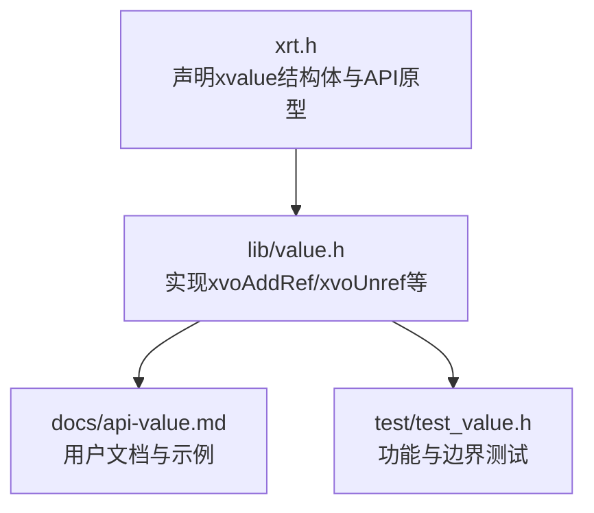
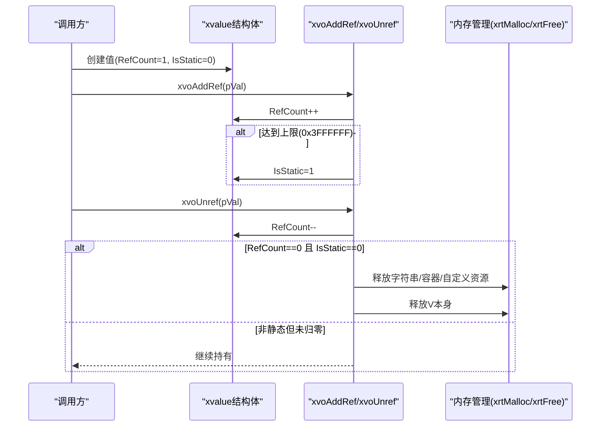
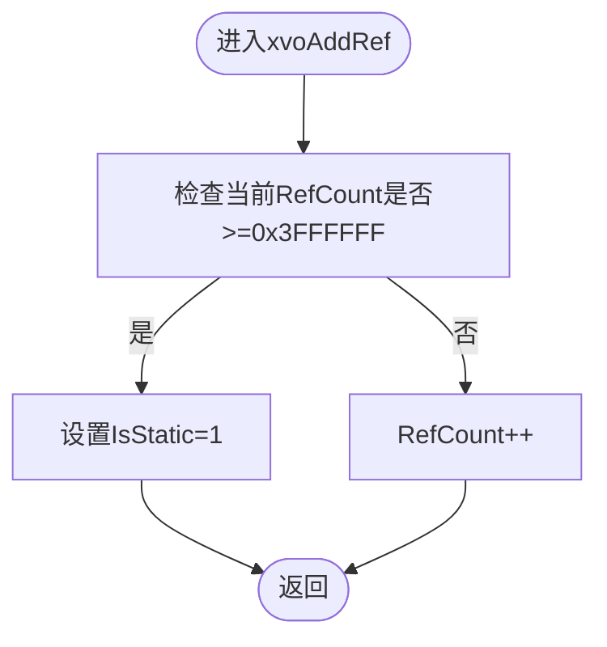
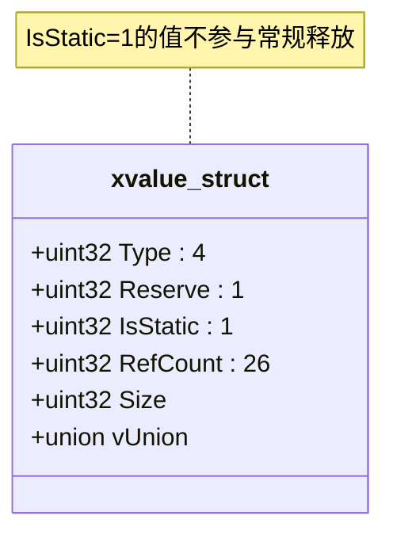
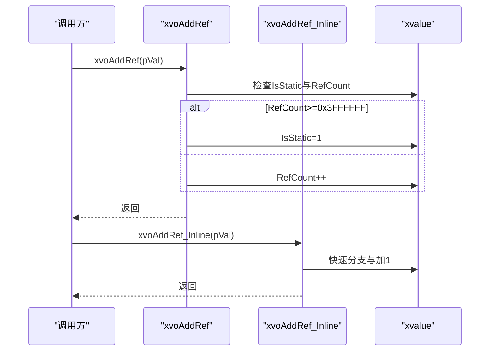
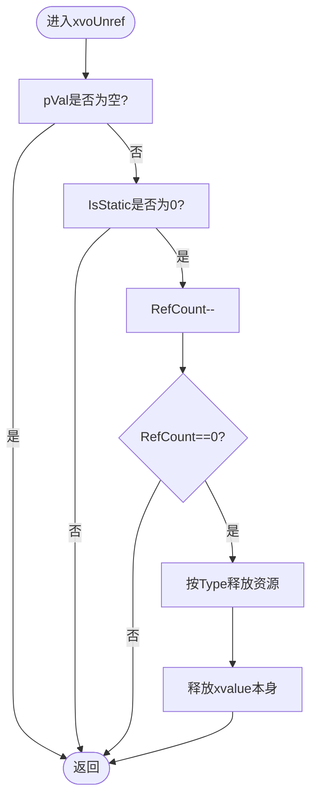
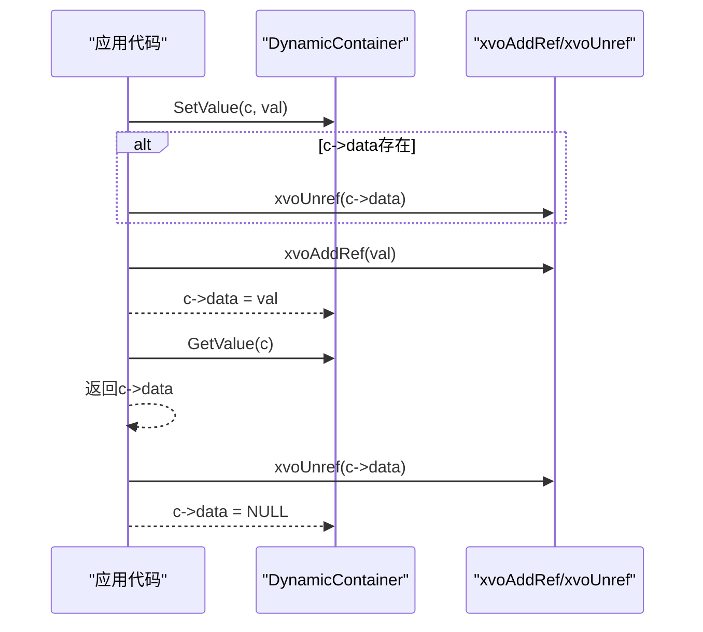
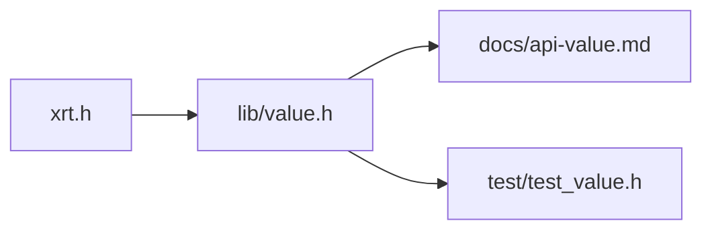

# 引用计数机制

<cite>
**本文引用的文件**
- [xrt.h](file://xrt.h)
- [value.h](file://lib/value.h)
- [api-value.md](file://docs/api-value.md)
- [api-value.en.md](file://docs/api-value.en.md)
- [test_value.h](file://test/test_value.h)
</cite>

## 目录
1. [简介](#简介)
2. [项目结构](#项目结构)
3. [核心组件](#核心组件)
4. [架构总览](#架构总览)
5. [详细组件分析](#详细组件分析)
6. [依赖关系分析](#依赖关系分析)
7. [性能考量](#性能考量)
8. [故障排查指南](#故障排查指南)
9. [结论](#结论)
10. [附录](#附录)

## 简介
本文件聚焦于XRT动态类型系统中的引用计数机制，系统性阐述26位引用计数的设计与实现、溢出处理策略、静态值优化、以及xvoAddRef与xvoUnref的执行流程。同时给出循环引用的处理建议、最佳实践与性能优化要点，并通过具体示例路径展示实际应用场景。

## 项目结构
围绕引用计数机制的关键文件与职责如下：
- xrt.h：声明xvalue结构体布局（含Type、IsStatic、RefCount等字段），并提供API原型与内联函数xvoAddRef_Inline。
- lib/value.h：实现xvoAddRef、xvoUnref、各类创建函数及容器操作；包含静态值单例（null、true、false）初始化。
- docs/api-value.md / api-value.en.md：官方文档，说明结构体字段、API行为、最佳实践与示例。
- test/test_value.h：测试用例，验证引用计数、容器操作、拷贝/深拷贝等行为。

图表来源
- [xrt.h](file://xrt.h#L1910-L1931)
- [value.h](file://lib/value.h#L33-L96)
- [api-value.md](file://docs/api-value.md#L46-L120)
- [test_value.h](file://test/test_value.h#L1-L100)

章节来源
- [xrt.h](file://xrt.h#L1910-L1931)
- [value.h](file://lib/value.h#L33-L96)
- [api-value.md](file://docs/api-value.md#L46-L120)
- [test_value.h](file://test/test_value.h#L1-L100)

## 核心组件
- xvalue结构体：承载类型、静态标记、引用计数、数据大小与联合体数据域。
- xvoAddRef / xvoAddRef_Inline：增加引用计数；当计数达到上限（0x3FFFFFF）时，将IsStatic置1以避免溢出。
- xvoUnref：减少引用计数；当计数降至0且非静态时，释放该值及其容器内的子元素。
- 静态值单例：null、true、false为静态值，无需释放，提升性能与稳定性。

章节来源
- [xrt.h](file://xrt.h#L1910-L1931)
- [value.h](file://lib/value.h#L4-L28)
- [value.h](file://lib/value.h#L33-L96)
- [api-value.md](file://docs/api-value.md#L78-L120)

## 架构总览
下图展示了引用计数在XRT动态类型系统中的关键交互：创建、引用、释放与静态优化。

图表来源
- [value.h](file://lib/value.h#L33-L96)
- [xrt.h](file://xrt.h#L1947-L1957)

## 详细组件分析

### 26位引用计数的设计与溢出处理
- 位宽设计：xvalue的RefCount占26位，理论最大值为0x3FFFFFF（约6710.89万）。该上限足以覆盖绝大多数场景下的高并发引用需求。
- 溢出保护：当xvoAddRef检测到当前RefCount已达上限，会将IsStatic置1，从而避免计数器溢出。此后该值被视为“静态”，不再参与常规释放流程。
- 优势：避免了计数器溢出导致的悬挂或误释放风险；在极端高引用场景下仍可保持系统稳定。

图表来源
- [value.h](file://lib/value.h#L33-L43)
- [xrt.h](file://xrt.h#L1947-L1957)

章节来源
- [xrt.h](file://xrt.h#L1910-L1915)
- [value.h](file://lib/value.h#L33-L43)
- [api-value.md](file://docs/api-value.md#L92-L95)

### IsStatic标志位与静态值优化
- 标志位作用：IsStatic用于标识该值是否为静态单例。静态值不会因引用计数归零而释放，适合频繁复用的常量（null、true、false）。
- 触发条件：当xvoAddRef发现计数已达上限，会将IsStatic置1，使该值进入“静态”状态。
- 优化效果：减少频繁分配/释放，降低碎片化与GC压力；提高访问常量的性能。

图表来源
- [xrt.h](file://xrt.h#L1910-L1931)
- [value.h](file://lib/value.h#L4-L28)

章节来源
- [value.h](file://lib/value.h#L4-L28)
- [api-value.md](file://docs/api-value.md#L125-L151)

### xvoAddRef实现逻辑
- 基本流程：若传入指针非空，先检查当前RefCount是否已达到上限；若达到上限则将IsStatic置1；否则将RefCount加1。
- 内联优化：提供xvoAddRef_Inline，用于热点路径的性能优化（减少函数调用开销）。

图表来源
- [value.h](file://lib/value.h#L33-L43)
- [xrt.h](file://xrt.h#L1947-L1957)

章节来源
- [value.h](file://lib/value.h#L33-L43)
- [xrt.h](file://xrt.h#L1947-L1957)

### xvoUnref实现逻辑
- 基本流程：若传入指针非空且非静态，则将RefCount减1；当计数降至0时，根据Type释放对应资源（字符串、数组、列表、集合、表、类实例等），最后释放xvalue自身。
- 容器递归释放：对于容器类型（数组、列表、集合、表），会递归释放其内部元素，确保无泄漏。
- 静态值保护：IsStatic=1的值不会被释放，避免误删常量单例。

图表来源
- [value.h](file://lib/value.h#L59-L96)

章节来源
- [value.h](file://lib/value.h#L59-L96)
- [api-value.md](file://docs/api-value.md#L107-L112)

### 容器类型与引用传递
- 数组/列表/集合/表在追加、插入、设置元素时，若采用非托管模式（bColloc=FALSE），会对元素执行xvoAddRef_Inline，以延长其生命周期。
- 清空/移除/合并等操作会相应地释放旧元素或转移引用，确保引用计数准确。

章节来源
- [value.h](file://lib/value.h#L541-L623)
- [value.h](file://lib/value.h#L723-L791)
- [value.h](file://lib/value.h#L1139-L1214)

### 示例：动态数据容器的引用管理
以下示例展示了如何在动态容器中正确管理引用计数，避免泄漏与悬挂引用。

图表来源
- [api-value.md](file://docs/api-value.md#L1137-L1162)

章节来源
- [api-value.md](file://docs/api-value.md#L1137-L1162)

## 依赖关系分析
- xrt.h声明xvalue结构体与API原型，value.h实现具体逻辑，二者构成“接口声明—实现”的关系。
- 文档与测试分别从“使用说明—行为约束”和“功能验证—边界测试”的角度补充引用计数机制。

图表来源
- [xrt.h](file://xrt.h#L1910-L1931)
- [value.h](file://lib/value.h#L33-L96)
- [api-value.md](file://docs/api-value.md#L46-L120)
- [test_value.h](file://test/test_value.h#L1-L100)

章节来源
- [xrt.h](file://xrt.h#L1910-L1931)
- [value.h](file://lib/value.h#L33-L96)
- [api-value.md](file://docs/api-value.md#L46-L120)
- [test_value.h](file://test/test_value.h#L1-L100)

## 性能考量
- 26位计数上限与静态优化：在极高引用场景下，通过IsStatic=1避免溢出与额外开销。
- 内联函数：xvoAddRef_Inline减少函数调用成本，适合频繁增减引用的热点路径。
- 容器批量操作：预分配容量（如xvoArrayAlloc）可显著降低扩容与复制成本。
- 静态值单例：null/true/false无需释放，减少内存与CPU消耗。

章节来源
- [xrt.h](file://xrt.h#L1947-L1957)
- [api-value.md](file://docs/api-value.md#L1202-L1218)

## 故障排查指南
- 循环引用：容器间相互持有引用会导致彼此无法释放。应避免建立循环引用，或在设计上拆分依赖。
- 忘记释放：非静态值必须成对调用xvoAddRef/xvoUnref，确保引用计数平衡。
- 混用托管模式：bColloc=TRUE仅适用于常量/外部托管字符串，复制字符串会增加内存与拷贝成本。
- 容器清空：使用xvoArrayClear/xvoListClear/xvoCollClear/xvoTableClear时，内部元素会被递归释放，注意不要重复释放。

章节来源
- [api-value.md](file://docs/api-value.md#L1189-L1198)
- [value.h](file://lib/value.h#L665-L679)
- [value.h](file://lib/value.h#L832-L842)
- [value.h](file://lib/value.h#L1084-L1095)
- [value.h](file://lib/value.h#L1261-L1272)

## 结论
XRT动态类型系统的引用计数机制以26位计数为核心，结合IsStatic静态优化与溢出保护，实现了高可靠性与高性能的内存管理。配合容器的递归释放与内联优化，可在复杂数据结构中维持稳定的生命周期控制。遵循最佳实践（避免循环引用、正确管理引用、合理使用托管模式）是保证系统健壮性的关键。

## 附录
- 典型使用场景示例路径（参考）：
  - 动态容器引用管理：[示例路径](file://docs/api-value.md#L1137-L1162)
  - 数组/列表/集合/表的引用传递与释放：[示例路径](file://lib/value.h#L541-L623), [示例路径](file://lib/value.h#L723-L791), [示例路径](file://lib/value.h#L1139-L1214)
  - 静态值单例与常量优化：[示例路径](file://lib/value.h#L4-L28), [示例路径](file://docs/api-value.md#L125-L151)