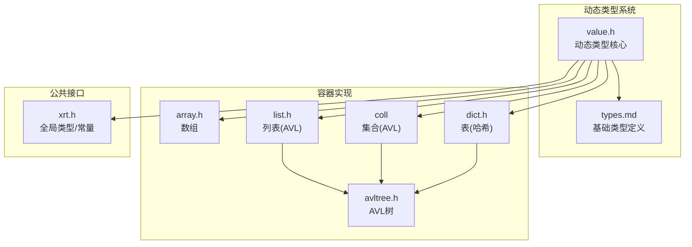
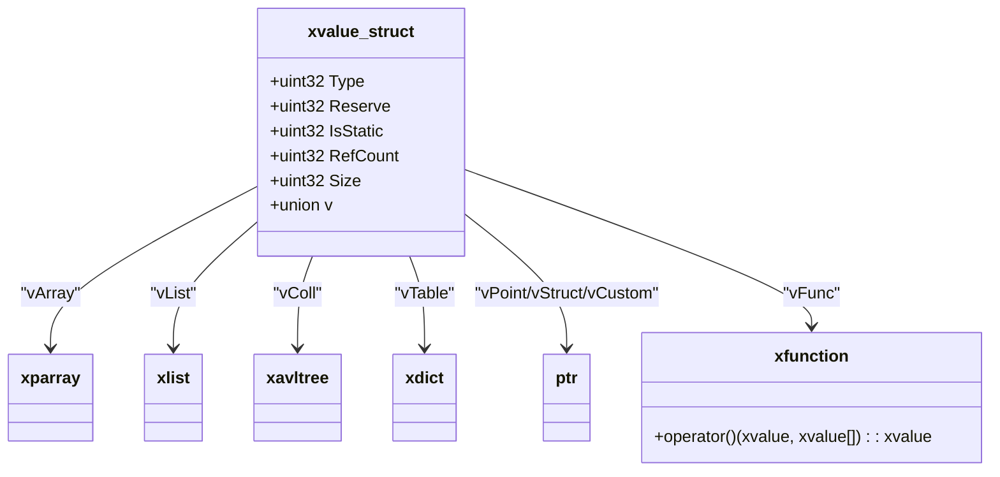
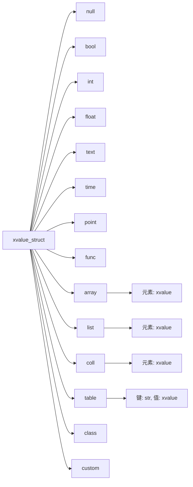
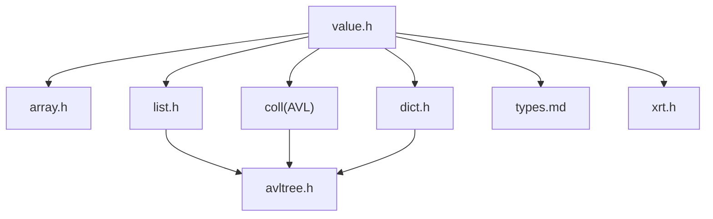

# 数据类型概览

<cite>
**本文档引用的文件**
- [lib/value.h](file://lib/value.h)
- [docs/api-value.md](file://docs/api-value.md)
- [docs/types.md](file://docs/types.md)
- [lib/array.h](file://lib/array.h)
- [lib/list.h](file://lib/list.h)
- [lib/dict.h](file://lib/dict.h)
- [lib/avltree.h](file://lib/avltree.h)
- [xrt.h](file://xrt.h)
</cite>

## 目录
1. [简介](#简介)
2. [项目结构](#项目结构)
3. [核心组件](#核心组件)
4. [架构总览](#架构总览)
5. [详细组件分析](#详细组件分析)
6. [依赖关系分析](#依赖关系分析)
7. [性能考虑](#性能考虑)
8. [故障排除指南](#故障排除指南)
9. [结论](#结论)
10. [附录](#附录)

## 简介
本文件面向XRT动态类型系统，提供16种数据类型的综合概览：null空值类型、bool布尔类型、int整数类型、float浮点类型、text文本类型、time时间类型、point指针类型、func函数类型、array数组类型、list列表类型、coll集合类型、table字典类型、class类类型、custom自定义类型。文档涵盖每种类型的用途、特点、适用场景、内部存储结构、内存布局、性能特征，并提供类型选择指南与层次关系说明。

## 项目结构
XRT动态类型系统的核心实现位于lib/value.h，配套文档位于docs/api-value.md；容器类型（数组、列表、集合、表）分别由独立模块实现，底层依赖AVL树与哈希表结构。

图表来源
- [lib/value.h](file://lib/value.h#L1-L120)
- [lib/array.h](file://lib/array.h#L1-L180)
- [lib/list.h](file://lib/list.h#L1-L188)
- [lib/dict.h](file://lib/dict.h#L1-L200)
- [lib/avltree.h](file://lib/avltree.h#L1-L126)
- [docs/types.md](file://docs/types.md#L1-L120)
- [xrt.h](file://xrt.h#L50-L120)

章节来源
- [lib/value.h](file://lib/value.h#L1-L120)
- [docs/types.md](file://docs/types.md#L1-L120)
- [xrt.h](file://xrt.h#L50-L120)

## 核心组件
- 动态类型值结构：统一的xvalue_struct，包含类型标识、引用计数、大小字段与联合体存储，支持16种类型。
- 引用计数管理：xvoAddRef/xvoUnref实现自动生命周期管理，避免内存泄漏。
- 容器类型：数组、列表、集合、表分别采用不同底层结构，满足不同访问与性能需求。
- 基础类型：整数、浮点、布尔、文本、时间、指针、函数、类、自定义等基础类型封装。

章节来源
- [docs/api-value.md](file://docs/api-value.md#L25-L75)
- [lib/value.h](file://lib/value.h#L33-L96)

## 架构总览
XRT动态类型系统以xvalue为核心，通过统一的类型枚举与联合体存储实现多态；容器类型通过组合底层数据结构（数组、AVL树、哈希表）实现复杂数据组织。

图表来源
- [docs/api-value.md](file://docs/api-value.md#L46-L74)
- [lib/value.h](file://lib/value.h#L101-L316)

章节来源
- [docs/api-value.md](file://docs/api-value.md#L25-L75)
- [lib/value.h](file://lib/value.h#L101-L316)

## 详细组件分析

### null空值类型
- 用途：表示缺失或未赋值的状态，常用于默认返回值与占位。
- 特点：静态单例，无需释放；引用计数不参与。
- 存储：xvalue_struct中Type=XVO_DT_NULL，Size=0，IsStatic=TRUE。
- 性能：极轻量，适合频繁使用且不占用额外内存。
- 适用场景：初始化占位、条件分支默认值、可选参数缺省。

章节来源
- [lib/value.h](file://lib/value.h#L101-L104)
- [docs/api-value.md](file://docs/api-value.md#L125-L138)

### bool布尔类型
- 用途：逻辑判断与条件控制。
- 特点：静态单例（true/false），节省内存与比较成本。
- 存储：vBool字段，Size=sizeof(bool)。
- 性能：常量折叠与快速比较，内存占用最小。
- 适用场景：开关标志、条件判断、状态查询。

章节来源
- [lib/value.h](file://lib/value.h#L105-L112)
- [docs/api-value.md](file://docs/api-value.md#L141-L151)

### int整数类型
- 用途：整数值存储与计算。
- 特点：vInt字段，Size=sizeof(int64)，支持大范围整数。
- 存储：直接存储64位整数。
- 性能：算术运算高效，内存紧凑。
- 适用场景：计数、索引、ID、货币（以整数表示）。

章节来源
- [lib/value.h](file://lib/value.h#L113-L124)
- [docs/api-value.md](file://docs/api-value.md#L154-L164)

### float浮点类型
- 用途：实数计算与科学计算。
- 特点：vFloat字段，Size=sizeof(double)。
- 存储：双精度浮点数。
- 性能：运算开销高于整数，注意精度与舍入误差。
- 适用场景：数学运算、物理量、统计数据。

章节来源
- [lib/value.h](file://lib/value.h#L125-L136)
- [docs/api-value.md](file://docs/api-value.md#L167-L176)

### text文本类型
- 用途：字符串存储与处理。
- 特点：vText为指针，支持托管模式（bColloc）决定是否复制。
- 存储：托管模式直接持有指针，非托管模式复制内容。
- 性能：托管模式零拷贝，适合常量字符串；非托管模式有复制开销。
- 适用场景：配置项、日志、用户输入、网络协议文本。

章节来源
- [lib/value.h](file://lib/value.h#L137-L167)
- [docs/api-value.md](file://docs/api-value.md#L178-L198)

### time时间类型
- 用途：时间与时序数据。
- 特点：vTime为int64，单位通常为秒；提供构造与格式化工具。
- 存储：64位整数编码时间序列。
- 性能：比较与运算高效，格式化输出需额外处理。
- 适用场景：日志时间戳、定时任务、时序分析。

章节来源
- [lib/value.h](file://lib/value.h#L168-L191)
- [docs/api-value.md](file://docs/api-value.md#L199-L200)

### point指针类型
- 用途：通用指针存储。
- 特点：vPoint为void*，Size=sizeof(ptr)。
- 存储：直接存储指针值。
- 性能：极轻量，但需确保生命周期安全。
- 适用场景：C结构体指针、资源句柄、回调上下文。

章节来源
- [lib/value.h](file://lib/value.h#L192-L203)
- [docs/api-value.md](file://docs/api-value.md#L200-L200)

### func函数类型
- 用途：函数指针封装。
- 特点：vFunc为函数指针类型，Size=sizeof(ptr)。
- 存储：直接存储函数地址。
- 性能：调用开销取决于目标函数，封装带来灵活性。
- 适用场景：回调机制、策略模式、插件接口。

章节来源
- [lib/value.h](file://lib/value.h#L204-L215)
- [docs/api-value.md](file://docs/api-value.md#L200-L200)

### array数组类型
- 用途：有序、可索引的动态数组。
- 特点：底层为可扩容数组，支持插入、删除、交换、合并、排序。
- 存储：xparray封装，元素为xvalue，支持引用计数传递。
- 性能：随机访问O(1)，插入/删除均摊O(n)，排序O(n log n)。
- 适用场景：动态序列、队列、栈、批处理数据。

章节来源
- [lib/value.h](file://lib/value.h#L216-L232)
- [lib/array.h](file://lib/array.h#L1-L180)
- [docs/api-value.md](file://docs/api-value.md#L200-L200)

### list列表类型
- 用途：有序、可索引的动态列表（基于AVL树）。
- 特点：键为int64索引，值为xvalue，保持插入顺序。
- 存储：AVL树节点，每个节点包含键与值。
- 性能：插入/删除/查找O(log n)，适合频繁随机访问与更新。
- 适用场景：有序序列、缓存、LRU等。

章节来源
- [lib/value.h](file://lib/value.h#L233-L249)
- [lib/list.h](file://lib/list.h#L1-L188)
- [lib/avltree.h](file://lib/avltree.h#L1-L126)

### coll集合类型
- 用途：无序去重集合。
- 特点：基于AVL树，元素唯一；提供差集、交集、并集、合并等集合运算。
- 存储：AVL树节点，键由元素类型与哈希组合生成。
- 性能：插入/删除/查找O(log n)，集合运算按元素数量线性扫描。
- 适用场景：去重、权限集合、唯一标识集合。

章节来源
- [lib/value.h](file://lib/value.h#L250-L267)
- [lib/avltree.h](file://lib/avltree.h#L1-L126)
- [xrt.h](file://xrt.h#L2118-L2142)

### table字典类型
- 用途：键值对映射。
- 特点：基于哈希表（AVL+哈希），键为字符串，值为xvalue。
- 存储：Dict_Key+AVL节点，键哈希与长度参与排序。
- 性能：平均O(1)查找/插入/删除，最坏O(n)退化（极端哈希冲突）。
- 适用场景：配置表、缓存、对象属性、JSON风格数据。

章节来源
- [lib/value.h](file://lib/value.h#L268-L284)
- [lib/dict.h](file://lib/dict.h#L1-L200)
- [lib/avltree.h](file://lib/avltree.h#L1-L126)

### class类类型
- 用途：自定义结构体容器。
- 特点：vStruct指向一块连续内存，大小由创建时指定。
- 存储：原始内存块，不包含引用计数。
- 性能：零拷贝，内存紧凑，但需自行管理生命周期。
- 适用场景：C结构体封装、跨语言交互、高性能数据块。

章节来源
- [lib/value.h](file://lib/value.h#L285-L316)
- [docs/api-value.md](file://docs/api-value.md#L200-L200)

### custom自定义类型
- 用途：任意自定义对象指针。
- 特点：vCustom为通用指针，Size=0。
- 存储：直接存储指针，不参与引用计数。
- 性能：零拷贝，灵活但需谨慎管理。
- 适用场景：第三方库对象、系统资源句柄、插件对象。

章节来源
- [lib/value.h](file://lib/value.h#L305-L316)
- [docs/api-value.md](file://docs/api-value.md#L200-L200)

### 类型选择指南
- 优先使用null/bool/int/float/text/time等基础类型，保证性能与可读性。
- 需要有序序列且频繁随机访问：使用array；需要频繁插入/删除中间元素：使用list。
- 需要去重集合：使用coll；需要键值映射：使用table。
- 需要自定义结构体：使用class；需要跨语言/系统对象：使用custom。
- 文本处理：优先托管模式（bColloc=TRUE）以避免复制开销。
- 避免在容器中存储大量基础类型而不进行colloc，以免产生过多引用计数。

章节来源
- [lib/value.h](file://lib/value.h#L540-L700)
- [docs/api-value.md](file://docs/api-value.md#L1166-L1221)

### 层次关系与继承结构
XRT动态类型系统采用“统一值类型 + 容器组合”的设计，不存在传统面向对象的继承关系。各类型通过xvalue_struct统一承载，容器类型通过组合底层数据结构实现：

图表来源
- [docs/api-value.md](file://docs/api-value.md#L25-L75)
- [lib/value.h](file://lib/value.h#L101-L316)

章节来源
- [docs/api-value.md](file://docs/api-value.md#L25-L75)
- [lib/value.h](file://lib/value.h#L101-L316)

## 依赖关系分析
- value.h依赖基础类型定义与全局常量（来自xrt.h与types.md）。
- 容器类型相互独立，但共享AVL树与哈希表基础设施。
- 引用计数管理贯穿所有容器与复合类型，确保内存安全。

图表来源
- [lib/value.h](file://lib/value.h#L1-L120)
- [lib/array.h](file://lib/array.h#L1-L180)
- [lib/list.h](file://lib/list.h#L1-L188)
- [lib/dict.h](file://lib/dict.h#L1-L200)
- [lib/avltree.h](file://lib/avltree.h#L1-L126)
- [docs/types.md](file://docs/types.md#L1-L120)
- [xrt.h](file://xrt.h#L50-L120)

章节来源
- [lib/value.h](file://lib/value.h#L1-L120)
- [lib/array.h](file://lib/array.h#L1-L180)
- [lib/list.h](file://lib/list.h#L1-L188)
- [lib/dict.h](file://lib/dict.h#L1-L200)
- [lib/avltree.h](file://lib/avltree.h#L1-L126)
- [docs/types.md](file://docs/types.md#L1-L120)
- [xrt.h](file://xrt.h#L50-L120)

## 性能考虑
- 引用计数：xvoAddRef/xvoUnref为O(1)，但过度引用会增加CPU负担；合理使用colloc可减少引用计数操作。
- 文本托管：bColloc=TRUE避免复制，适合常量字符串；频繁变更文本建议非托管模式。
- 容器选择：array适合随机访问；list适合频繁插入/删除；coll/table在键空间较大时注意哈希分布。
- AVL树与哈希：AVL树平衡性好，适合稳定查找；哈希表在均匀分布下性能最佳，需防碰撞攻击。

## 故障排除指南
- 内存泄漏：确保每次xvoCreateXXX后在合适时机调用xvoUnref；避免循环引用。
- 错误处理：通过xrtSetError设置错误信息，使用xrtClearError清理。
- 临时内存：xrtTempMemory提供环形临时内存，适合短生命周期对象。

章节来源
- [lib/value.h](file://lib/value.h#L33-L96)
- [lib/base.h](file://lib/base.h#L88-L132)

## 结论
XRT动态类型系统以统一的xvalue结构为核心，结合高效的容器实现与完善的引用计数管理，提供了灵活而高性能的数据抽象。通过合理选择基础类型与容器类型，并遵循引用计数与托管模式的最佳实践，可在保证性能的同时提升开发效率与代码可维护性。

## 附录
- 类型常量定义参考：XVO_DT_NULL到XVO_DT_CUSTOM。
- 基础类型别名与说明参考types.md。
- 容器API与实现细节参考对应模块头文件。

章节来源
- [docs/api-value.md](file://docs/api-value.md#L25-L44)
- [docs/types.md](file://docs/types.md#L1-L120)
- [xrt.h](file://xrt.h#L50-L120)