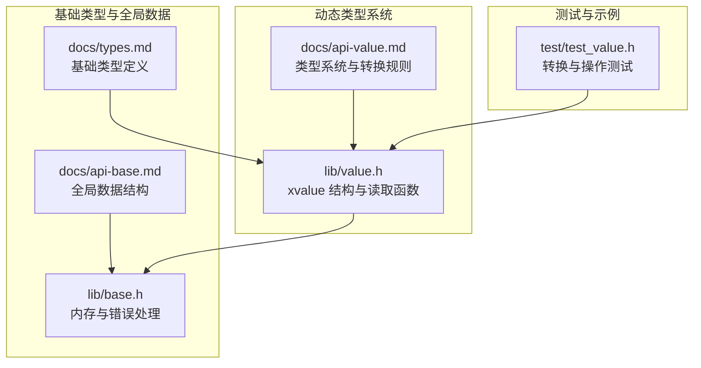
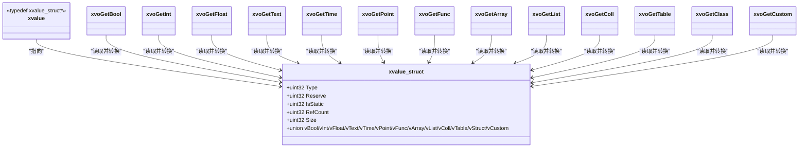
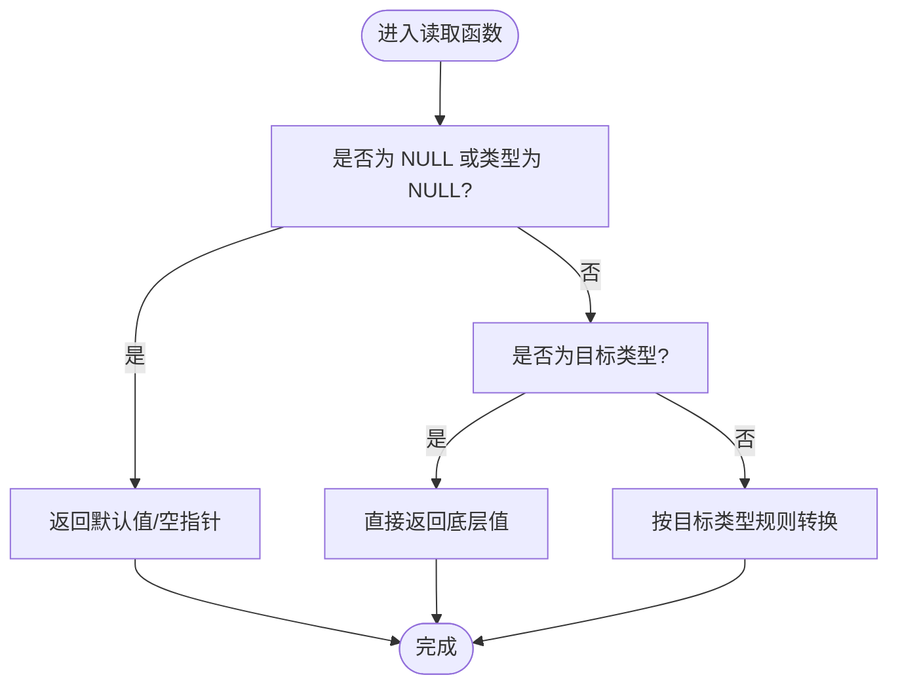
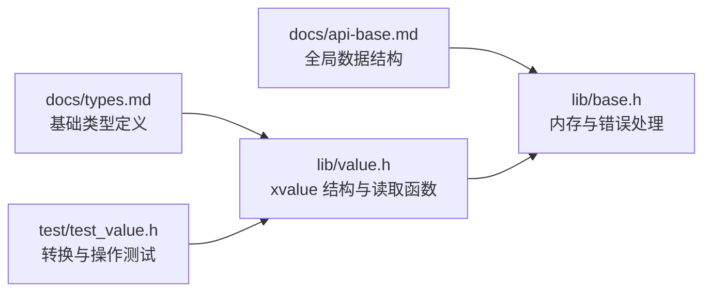

# 类型转换规则

<cite>
**本文档引用的文件**
- [docs/api-value.md](file://docs/api-value.md)
- [lib/value.h](file://lib/value.h)
- [docs/types.md](file://docs/types.md)
- [docs/api-base.md](file://docs/api-base.md)
- [lib/base.h](file://lib/base.h)
- [test/test_value.h](file://test/test_value.h)
</cite>

## 目录
1. [简介](#简介)
2. [项目结构](#项目结构)
3. [核心组件](#核心组件)
4. [架构总览](#架构总览)
5. [详细组件分析](#详细组件分析)
6. [依赖关系分析](#依赖关系分析)
7. [性能考量](#性能考量)
8. [故障排查指南](#故障排查指南)
9. [结论](#结论)
10. [附录](#附录)

## 简介
本文件系统化梳理 XRT 动态类型系统中的 16 种数据类型之间的隐式与显式转换规则，覆盖数值类型（整数↔浮点）、布尔、文本、时间、指针、函数、以及复合容器（数组、列表、集合、表、类、自定义）的转换行为；明确转换优先级、精度损失处理、边界情况、安全检查与错误处理策略，并提供丰富的转换示例与扩展方法说明，帮助开发者在不同场景下正确、安全地进行类型转换与性能优化。

## 项目结构
围绕类型转换主题，主要涉及以下模块：
- 动态类型系统与读取接口：Value 动态类型库（类型常量、结构、读取函数）
- 基础类型与全局数据：基础类型定义、全局数据结构与错误处理
- 测试与示例：全面的功能测试，验证各类型转换行为

图表来源
- [lib/value.h](file://lib/value.h#L49-L74)
- [docs/api-value.md](file://docs/api-value.md#L25-L74)
- [docs/types.md](file://docs/types.md#L80-L244)
- [docs/api-base.md](file://docs/api-base.md#L56-L120)
- [lib/base.h](file://lib/base.h#L5-L132)
- [test/test_value.h](file://test/test_value.h#L568-L767)

章节来源
- [docs/api-value.md](file://docs/api-value.md#L25-L74)
- [lib/value.h](file://lib/value.h#L49-L74)
- [docs/types.md](file://docs/types.md#L80-L244)
- [docs/api-base.md](file://docs/api-base.md#L56-L120)
- [lib/base.h](file://lib/base.h#L5-L132)
- [test/test_value.h](file://test/test_value.h#L568-L767)

## 核心组件
- 动态类型常量与结构
  - 类型常量：XVO_DT_NULL、XVO_DT_BOOL、XVO_DT_INT、XVO_DT_FLOAT、XVO_DT_TEXT、XVO_DT_TIME、XVO_DT_POINT、XVO_DT_FUNC、XVO_DT_ARRAY、XVO_DT_LIST、XVO_DT_COLL、XVO_DT_TABLE、XVO_DT_CLASS、XVO_DT_CUSTOM
  - xvalue 结构：包含类型字段、静态标志、引用计数、数据大小与联合体存储
- 读取函数族：xvoGetBool、xvoGetInt、xvoGetFloat、xvoGetText、xvoGetTime、xvoGetPoint、xvoGetFunc、以及各类容器的获取函数
- 基础类型与全局数据：基础类型定义、全局数据结构（含错误处理、临时内存、内存分配器）
- 测试用例：覆盖各类型创建、转换、容器操作与边界条件

章节来源
- [docs/api-value.md](file://docs/api-value.md#L25-L74)
- [lib/value.h](file://lib/value.h#L49-L74)
- [docs/types.md](file://docs/types.md#L80-L244)
- [docs/api-base.md](file://docs/api-base.md#L56-L120)
- [test/test_value.h](file://test/test_value.h#L568-L767)

## 架构总览
动态类型系统通过统一的 xvalue 结构承载 16 种类型，读取函数根据目标类型对底层数据进行隐式转换。转换遵循“目标类型优先”的原则：当读取某类型值时，若底层实际类型不同，则按该类型规则进行转换；若底层为 NULL 或未匹配，则采用默认值策略。

图表来源
- [lib/value.h](file://lib/value.h#L49-L74)
- [lib/value.h](file://lib/value.h#L321-L517)

章节来源
- [lib/value.h](file://lib/value.h#L49-L74)
- [lib/value.h](file://lib/value.h#L321-L517)

## 详细组件分析

### 16 种数据类型与转换规则总览
- 类型常量与结构
  - 类型常量：见“类型系统”章节
  - xvalue 结构：包含类型、静态标志、引用计数、大小与联合体存储
- 读取函数与隐式转换
  - xvoGetBool：NULL→FALSE；BOOL→原值；INT→非0为TRUE；FLOAT→非0.0为TRUE；其他→TRUE
  - xvoGetInt：NULL→0；BOOL→1或0；INT→原值；FLOAT→截断为整数；TEXT→解析字符串；其他→0
  - xvoGetFloat：NULL→0.0；BOOL→1.0或0.0；INT→原值；FLOAT→原值；TEXT→解析字符串；其他→0.0
  - xvoGetText：NULL→空字符串；TEXT→原字符串；INT→十进制字符串；FLOAT→数字字符串；BOOL→"true"/"false"；TIME→格式化时间字符串；POINT/FUNC/ARRAY/LIST/COLL/TABLE/CLASS/CUSTOM→描述性字符串；其他→空字符串
  - xvoGetTime：NULL→0；TIME→原值；TEXT→未来支持字符串转xtime（当前返回0）
  - xvoGetPoint/xvoGetFunc/xvoGetArray/xvoGetList/xvoGetColl/xvoGetTable/xvoGetClass/xvoGetCustom：NULL→对应空指针；类型匹配→返回底层指针；否则→NULL

章节来源
- [docs/api-value.md](file://docs/api-value.md#L25-L74)
- [lib/value.h](file://lib/value.h#L321-L517)

### 数值类型转换（int↔float）
- INT→FLOAT：保持数值不变
- FLOAT→INT：截断小数部分（向零取整）
- TEXT→INT/TEXT→FLOAT：解析字符串；解析失败返回0或0.0
- 示例参考测试用例中 Float→Int 的行为验证

章节来源
- [lib/value.h](file://lib/value.h#L335-L366)
- [test/test_value.h](file://test/test_value.h#L614-L625)

### 布尔类型转换
- NULL→FALSE
- BOOL→原值
- INT→非0为TRUE，0为FALSE
- FLOAT→非0.0为TRUE，0.0为FALSE
- 其他类型→TRUE
- 示例参考测试用例中 Bool 类型与 Int/Float→Bool 的行为

章节来源
- [lib/value.h](file://lib/value.h#L321-L334)
- [test/test_value.h](file://test/test_value.h#L589-L612)

### 文本类型转换
- NULL/TEXT→原值
- INT→十进制字符串
- FLOAT→数字字符串
- BOOL→"true"/"false"
- TIME→格式化时间字符串
- POINT/FUNC/ARRAY/LIST/COLL/TABLE/CLASS/CUSTOM→描述性字符串
- 示例参考测试用例中 Text 类型与 Time→Text 的行为

章节来源
- [lib/value.h](file://lib/value.h#L367-L425)
- [test/test_value.h](file://test/test_value.h#L627-L656)

### 时间类型转换
- NULL→0
- TIME→原值
- TEXT→未来支持字符串转xtime（当前返回0）
- 示例参考测试用例中 Time 类型与 Time→Text 的行为

章节来源
- [lib/value.h](file://lib/value.h#L426-L437)
- [test/test_value.h](file://test/test_value.h#L644-L656)

### 指针与函数类型转换
- NULL→对应空指针
- POINT/FUNC→原值
- 其他类型→NULL
- 注意：指针与函数类型不参与数值/文本解析，直接返回底层指针

章节来源
- [lib/value.h](file://lib/value.h#L438-L457)

### 容器类型转换
- NULL→对应空容器指针
- 类型匹配→返回底层容器指针
- 其他类型→NULL
- 容器内部元素遵循各自转换规则

章节来源
- [lib/value.h](file://lib/value.h#L458-L517)

### 类与自定义类型转换
- NULL→NULL
- 类型匹配→返回底层数据指针
- 其他类型→NULL
- 注意：xvoGetClass/xvoGetCustom 仅返回底层指针，不进行深层转换

章节来源
- [lib/value.h](file://lib/value.h#L498-L517)

### 显式转换与安全检查
- 显式转换：通过创建函数（如 xvoCreateInt、xvoCreateFloat、xvoCreateText 等）显式指定目标类型
- 安全检查：
  - 读取函数对 NULL 输入返回默认值（如 xvoGetInt(NULL)→0）
  - 容器写入时支持托管模式（bColloc）与引用计数控制
  - 容器操作（Append/Set/Insert/Remove）均进行类型检查与空指针保护
- 错误处理：全局错误信息 LastError 与 OnError 回调，配合 xrtSetError/xrtClearError 使用

章节来源
- [lib/value.h](file://lib/value.h#L101-L316)
- [lib/base.h](file://lib/base.h#L89-L132)
- [docs/api-base.md](file://docs/api-base.md#L56-L120)

### 边界情况与精度损失
- 精度损失：
  - FLOAT→INT：小数部分丢失
  - TEXT→INT/TEXT→FLOAT：解析失败返回默认值（0/0.0）
- 边界情况：
  - NULL 输入：返回默认值或空指针
  - 非匹配类型：返回默认值或空指针
  - 时间字符串解析：当前返回0（未来支持）

章节来源
- [lib/value.h](file://lib/value.h#L335-L366)
- [lib/value.h](file://lib/value.h#L426-L437)

### 转换流程与决策图

图表来源
- [lib/value.h](file://lib/value.h#L321-L517)

## 依赖关系分析
- 类型系统依赖基础类型定义与全局数据结构
- 读取函数依赖全局数据结构中的临时返回值与错误处理
- 容器操作依赖底层容器实现（数组、列表、集合、表）
- 测试用例验证转换规则与边界条件

图表来源
- [docs/types.md](file://docs/types.md#L80-L244)
- [lib/value.h](file://lib/value.h#L49-L74)
- [docs/api-base.md](file://docs/api-base.md#L56-L120)
- [lib/base.h](file://lib/base.h#L5-L132)
- [test/test_value.h](file://test/test_value.h#L568-L767)

章节来源
- [docs/types.md](file://docs/types.md#L80-L244)
- [lib/value.h](file://lib/value.h#L49-L74)
- [docs/api-base.md](file://docs/api-base.md#L56-L120)
- [lib/base.h](file://lib/base.h#L5-L132)
- [test/test_value.h](file://test/test_value.h#L568-L767)

## 性能考量
- 静态单例：NULL/TRUE/FALSE 使用静态单例，避免分配与释放开销
- 临时内存：xrtTempMemory 用于短生命周期字符串与中间结果，减少频繁分配
- 预分配：数组支持预分配容量（xvoArrayAlloc），降低扩容成本
- 托管模式：字符串创建支持托管模式（bColloc），避免不必要的字符串复制
- 引用计数：容器元素自动管理引用计数，避免重复复制

章节来源
- [lib/value.h](file://lib/value.h#L5-L28)
- [lib/base.h](file://lib/base.h#L49-L84)
- [docs/api-value.md](file://docs/api-value.md#L1202-L1218)

## 故障排查指南
- 常见问题
  - 读取结果与预期不符：确认是否发生了精度损失（如浮点→整数）
  - 文本解析失败：检查输入字符串是否符合目标类型格式
  - 容器元素为空：确认写入时的托管模式与引用计数设置
  - 错误信息未显示：检查是否设置了 OnError 回调并调用了 xrtClearError
- 定位步骤
  - 使用 xvoPrintValue 打印结构，核对类型与值
  - 检查 NULL 输入与类型匹配情况
  - 验证容器操作的返回值与元素数量

章节来源
- [docs/api-value.md](file://docs/api-value.md#L1054-L1090)
- [lib/base.h](file://lib/base.h#L89-L132)
- [test/test_value.h](file://test/test_value.h#L26-L51)

## 结论
XRT 动态类型系统通过统一的 xvalue 结构与完善的读取函数族，实现了 16 种类型间的隐式转换与安全检查。转换遵循“目标类型优先”的原则，结合默认值策略与错误处理机制，确保在复杂场景下的稳定性与可维护性。通过合理使用托管模式、临时内存与预分配策略，可在保证正确性的前提下获得良好的性能表现。

## 附录

### 转换示例（来自测试用例）
- Null/Bool/Int/Float/Text/Time/Point/Func/Class/Custom 类型的创建与转换验证
- Array/List/Coll/Table 的基本操作与类型检查
- 深拷贝与浅拷贝的行为差异

章节来源
- [test/test_value.h](file://test/test_value.h#L568-L767)

### 自定义类型转换扩展方法
- 使用 xvoCreateCustom 存储自定义对象指针
- 通过 xvoGetCustom 获取底层指针，自行实现类型转换逻辑
- 注意：自定义类型不参与内置转换规则，需在业务层严格管理生命周期与类型一致性

章节来源
- [lib/value.h](file://lib/value.h#L305-L316)
- [lib/value.h](file://lib/value.h#L508-L517)