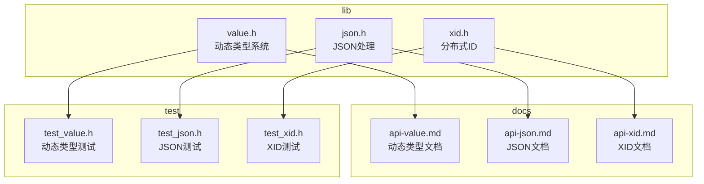
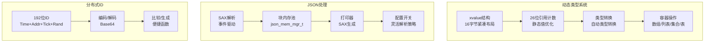
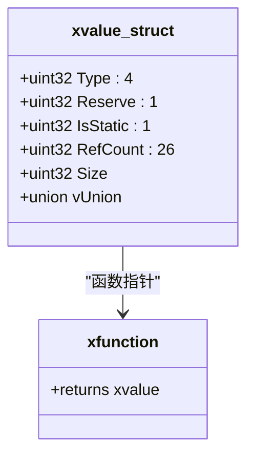
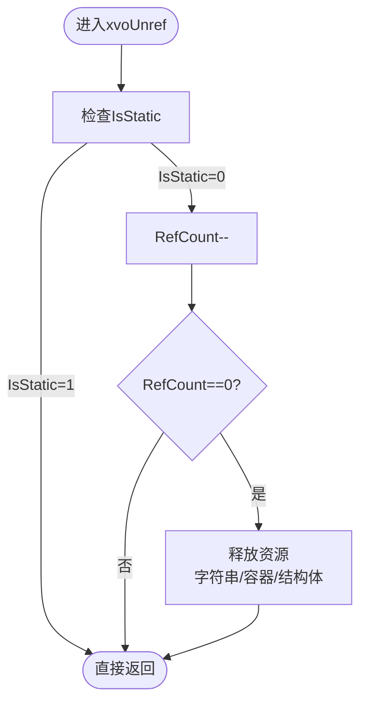
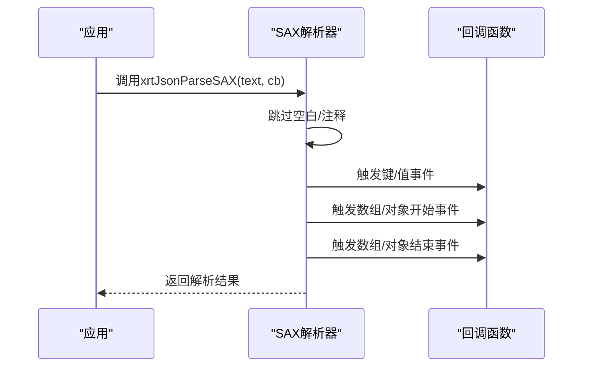
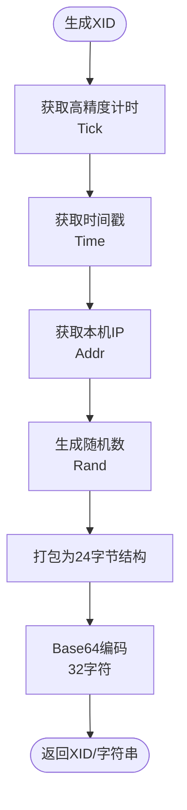
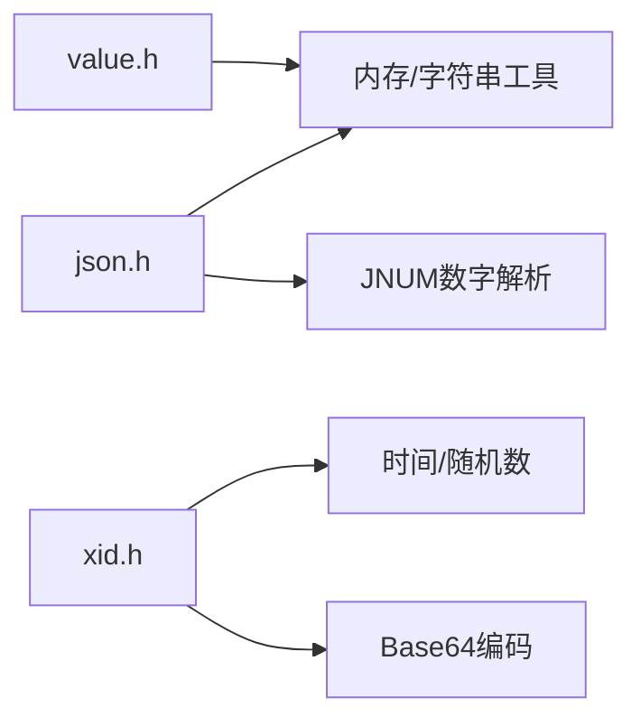

# 高级功能层

<cite>
**本文档引用的文件**
- [lib/value.h](file://lib/value.h)
- [lib/json.h](file://lib/json.h)
- [lib/xid.h](file://lib/xid.h)
- [docs/api-value.md](file://docs/api-value.md)
- [docs/api-json.md](file://docs/api-json.md)
- [docs/api-xid.md](file://docs/api-xid.md)
- [test/test_value.h](file://test/test_value.h)
- [test/test_json.h](file://test/test_json.h)
- [test/test_xid.h](file://test/test_xid.h)
</cite>

## 目录
1. [简介](#简介)
2. [项目结构](#项目结构)
3. [核心组件](#核心组件)
4. [架构总览](#架构总览)
5. [详细组件分析](#详细组件分析)
6. [依赖关系分析](#依赖关系分析)
7. [性能考量](#性能考量)
8. [故障排查指南](#故障排查指南)
9. [结论](#结论)
10. [附录](#附录)

## 简介
本文件面向XRT高级功能层，聚焦三大核心模块：
- 动态类型系统（value）：16种数据类型、26位引用计数机制与类型转换
- JSON处理（json）：SAX模式解析、事件驱动处理与无DOM开销设计
- 分布式ID（xid）：192位唯一ID生成、时间戳处理与IP地址集成

我们将从设计理念、实现复杂性、应用场景出发，提供使用指南、性能优化建议与最佳实践，并给出集成示例与排障要点。

## 项目结构
高级功能层位于lib目录下，配套文档在docs目录，测试样例在test目录：
- 动态类型系统：lib/value.h + docs/api-value.md + test/test_value.h
- JSON处理：lib/json.h + docs/api-json.md + test/test_json.h
- 分布式ID：lib/xid.h + docs/api-xid.md + test/test_xid.h

图表来源
- [lib/value.h](file://lib/value.h#L1-L120)
- [lib/json.h](file://lib/json.h#L1-L120)
- [lib/xid.h](file://lib/xid.h#L1-L75)
- [docs/api-value.md](file://docs/api-value.md#L1-L80)
- [docs/api-json.md](file://docs/api-json.md#L1-L80)
- [docs/api-xid.md](file://docs/api-xid.md#L1-L80)
- [test/test_value.h](file://test/test_value.h#L1-L60)
- [test/test_json.h](file://test/test_json.h#L1-L60)
- [test/test_xid.h](file://test/test_xid.h#L1-L23)

章节来源
- [lib/value.h](file://lib/value.h#L1-L120)
- [lib/json.h](file://lib/json.h#L1-L120)
- [lib/xid.h](file://lib/xid.h#L1-L75)

## 核心组件
- 动态类型系统（value）
  - 支持16种数据类型，包含基础类型（null/bool/int/float/text/time/point/func）与复合类型（array/list/coll/table/class/custom）
  - 采用26位引用计数（最大约6700万）与静态值优化，自动内存管理
  - 提供丰富的类型转换与容器操作API
- JSON处理（json）
  - SAX解析与生成，事件驱动，无DOM开销
  - 内置块内存池管理，提升解析/打印性能
  - 支持多种配置开关，兼顾标准与扩展特性
- 分布式ID（xid）
  - 192位（24字节）唯一ID，包含时间戳、IP地址、高精度计时与随机数
  - 支持字符串编码/解码，便于存储与传输

章节来源
- [docs/api-value.md](file://docs/api-value.md#L25-L75)
- [docs/api-json.md](file://docs/api-json.md#L28-L80)
- [docs/api-xid.md](file://docs/api-xid.md#L20-L63)

## 架构总览
高级功能层以“轻量、高性能、易用”为目标，围绕以下设计原则：
- 动态类型系统：以紧凑结构体承载值，结合引用计数与静态值单例，降低内存碎片与GC压力
- JSON处理：SAX模式避免一次性构建完整DOM树，配合块内存池减少频繁分配
- 分布式ID：组合多维度信息形成全局唯一且可排序的ID，便于分布式追踪与审计

图表来源
- [lib/value.h](file://lib/value.h#L49-L70)
- [lib/json.h](file://lib/json.h#L23-L74)
- [lib/xid.h](file://lib/xid.h#L5-L16)

## 详细组件分析

### 动态类型系统（value）

#### 设计理念与数据模型
- 16种数据类型覆盖常见需求，基础类型与复合类型分离，便于按需扩展
- xvalue结构仅16字节，其中：
  - Type:4位（标识类型）
  - Reserve:1位（保留）
  - IsStatic:1位（是否静态值）
  - RefCount:26位（引用计数上限约6700万）
  - Size:32位（数据大小）
  - 联合体vUnion承载具体值
- 静态值单例（null/true/false）减少分配与释放成本

图表来源
- [lib/value.h](file://lib/value.h#L49-L70)

章节来源
- [lib/value.h](file://lib/value.h#L49-L70)
- [docs/api-value.md](file://docs/api-value.md#L25-L75)

#### 引用计数与生命周期管理
- xvoAddRef/xvoUnref负责引用计数增减
- 当引用计数达到上限（0x3FFFFFF）时，自动转为静态值，避免溢出
- 容器类型（数组/列表/集合/表）在销毁时递归释放子元素
- 静态值（IsStatic=1）不参与释放流程

图表来源
- [lib/value.h](file://lib/value.h#L59-L96)

章节来源
- [lib/value.h](file://lib/value.h#L33-L96)
- [docs/api-value.md](file://docs/api-value.md#L78-L121)

#### 类型转换与读取
- 提供统一的读取接口：xvoGetBool/xvoGetInt/xvoGetFloat/xvoGetText/xvoGetTime/xvoGetPoint/xvoGetFunc/xvoGetArray/xvoGetList/xvoGetColl/xvoGetTable/xvoGetClass/xvoGetCustom
- 转换规则明确：如NULL转为0/空字符串，整数转浮点截断，文本转数字解析等
- 非TEXT类型返回临时字符串，无需额外释放

章节来源
- [lib/value.h](file://lib/value.h#L321-L517)
- [docs/api-value.md](file://docs/api-value.md#L360-L470)

#### 容器操作与最佳实践
- 数组/列表/集合/表均提供创建、插入、设置、删除、清空、合并等操作
- 建议使用collocate模式（bColloc=TRUE）处理常量字符串，避免重复复制
- 预分配容量（xvoArrayAlloc）可显著降低扩容成本
- 深拷贝/浅拷贝策略清晰，注意避免循环引用导致泄漏

章节来源
- [lib/value.h](file://lib/value.h#L541-L1035)
- [docs/api-value.md](file://docs/api-value.md#L541-L800)

### JSON处理（json）

#### SAX解析与事件驱动
- SAX解析器逐词法单元推进，通过回调函数接收事件（键、值、数组/对象起止）
- 解析状态包含当前深度、索引与键栈，支持嵌套结构的准确跟踪
- 支持多种配置开关：注释、尾逗号、空键、特殊字符、十六进制数、特殊双精度、单值开头、尾随字符等

图表来源
- [lib/json.h](file://lib/json.h#L1557-L1596)

章节来源
- [lib/json.h](file://lib/json.h#L82-L136)
- [lib/json.h](file://lib/json.h#L118-L174)
- [docs/api-json.md](file://docs/api-json.md#L82-L175)

#### 无DOM开销设计与块内存池
- 解析阶段不构建完整DOM树，仅在回调中消费数据，内存占用低
- 内置json_mem_mgr_t与json_mem_t，按对象/键/字符串分别管理块内存，减少碎片与分配次数
- 打印器同样采用块内存池与增量扩容策略，提升序列化性能

章节来源
- [lib/json.h](file://lib/json.h#L23-L74)
- [lib/json.h](file://lib/json.h#L547-L560)
- [lib/json.h](file://lib/json.h#L741-L790)

#### JSON生成与字符串处理
- SAX打印器支持格式化/压缩输出，提供便捷的start/finish宏
- 字符串信息结构（json_strinfo_t）记录长度、转义标记与分配状态，自动更新长度与转义标记
- 支持UTF-16转义序列解析与编码，确保国际化字符正确处理

章节来源
- [lib/json.h](file://lib/json.h#L199-L298)
- [lib/json.h](file://lib/json.h#L268-L274)
- [lib/json.h](file://lib/json.h#L850-L916)

### 分布式ID（xid）

#### 192位ID结构与生成策略
- 结构：Time(64位)+Addr(32位)+Tick(32位)+Rand(64位)，共192位（24字节）
- 生成策略：
  - Time：使用xrtNow()获取时间戳（秒）
  - Addr：使用xCore.LocalAddr获取本机IP地址
  - Tick：Windows使用QueryPerformanceCounter，Linux使用clock_gettime(CLOCK_MONOTONIC)
  - Rand：使用PCG算法生成64位随机数
- 编码/解码：Base64编码（32字符），URL与文件名安全

图表来源
- [lib/xid.h](file://lib/xid.h#L21-L60)
- [lib/xid.h](file://lib/xid.h#L5-L16)

章节来源
- [lib/xid.h](file://lib/xid.h#L25-L62)
- [docs/api-xid.md](file://docs/api-xid.md#L20-L63)

#### 使用场景与注意事项
- 唯一订单号、分布式追踪ID、数据库主键、临时文件名等
- 注意网络初始化：若未获取到IP，Addr字段为0，仍可生成ID但唯一性依赖其他字段
- 内存管理：生成的对象与字符串均需调用xrtFree释放

章节来源
- [docs/api-xid.md](file://docs/api-xid.md#L326-L462)
- [docs/api-xid.md](file://docs/api-xid.md#L465-L523)

## 依赖关系分析
- 动态类型系统（value）依赖通用内存分配与字符串工具（xrtMalloc/xrtFree/xrtCopyStr等）
- JSON处理（json）依赖JNUM数字解析、字符串工具与内存管理
- 分布式ID（xid）依赖时间与随机数工具、Base64编码

图表来源
- [lib/value.h](file://lib/value.h#L1-L120)
- [lib/json.h](file://lib/json.h#L1-L120)
- [lib/xid.h](file://lib/xid.h#L1-L75)

章节来源
- [lib/value.h](file://lib/value.h#L1-L120)
- [lib/json.h](file://lib/json.h#L1-L120)
- [lib/xid.h](file://lib/xid.h#L1-L75)

## 性能考量
- 动态类型系统
  - 静态值单例（null/true/false）减少分配与释放
  - 26位引用计数上限避免溢出，同时允许大量共享引用
  - 建议使用collocate模式处理常量字符串，避免复制
  - 预分配容量（xvoArrayAlloc）降低扩容成本
- JSON处理
  - SAX解析无DOM开销，适合大文件与流式场景
  - 块内存池减少频繁分配，提升吞吐
  - 合理设置打印参数（item_total/plus_size）控制内存增长
- 分布式ID
  - 高精度计时与随机数组合保证唯一性与时序性
  - Base64编码紧凑，便于存储与传输

## 故障排查指南
- 动态类型系统
  - 内存泄漏：检查是否遗漏xvoUnref，避免循环引用
  - 类型转换异常：确认输入类型与转换规则，注意NULL与空字符串的处理
- JSON处理
  - 解析失败：检查配置开关与输入格式，关注错误打印
  - 内存不足：调整块内存池参数或减少一次性解析的数据量
- 分布式ID
  - IP未获取：网络初始化问题，Addr字段为0但仍可生成ID
  - 编码/解码异常：确认Base64模板与长度（32字符）

章节来源
- [docs/api-value.md](file://docs/api-value.md#L1166-L1221)
- [docs/api-json.md](file://docs/api-json.md#L1-L80)
- [docs/api-xid.md](file://docs/api-xid.md#L465-L523)

## 结论
XRT高级功能层通过精心设计的数据模型与算法，在保证易用性的同时实现了高性能与可扩展性：
- 动态类型系统以紧凑结构与智能引用计数实现高效内存管理
- JSON处理以SAX模式与块内存池实现低开销的流式处理
- 分布式ID以多维组合信息实现全局唯一且可排序的ID生成

建议在生产环境中遵循最佳实践，合理选择collocate模式、预分配容量与打印参数，并严格管理内存生命周期。

## 附录

### 动态类型的使用指南
- 创建与读取：优先使用静态值单例（null/true/false），基础类型使用对应创建函数
- 容器操作：根据场景选择数组/列表/集合/表，注意bColloc参数与引用计数
- 类型转换：利用统一读取接口，注意转换规则与返回值语义

章节来源
- [docs/api-value.md](file://docs/api-value.md#L123-L540)

### JSON处理的性能优化
- 解析：启用SAX模式，合理设置配置开关，避免不必要的转义与注释解析
- 打印：选择合适的格式化/压缩模式，预估item_total与plus_size，减少内存重分配

章节来源
- [docs/api-json.md](file://docs/api-json.md#L177-L300)
- [docs/api-json.md](file://docs/api-json.md#L301-L437)

### 分布式ID的生成策略
- 生成：直接使用xrtMakeXID或xrtMakeXIDS，前者返回对象，后者返回字符串
- 比较：使用xrtCompXID比较两个XID对象是否完全一致
- 编码：xrtEncodeXID将XID对象编码为32字符Base64字符串

章节来源
- [docs/api-xid.md](file://docs/api-xid.md#L65-L160)
- [docs/api-xid.md](file://docs/api-xid.md#L269-L323)
- [docs/api-xid.md](file://docs/api-xid.md#L163-L230)