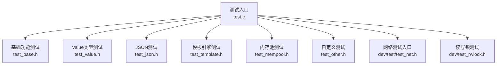
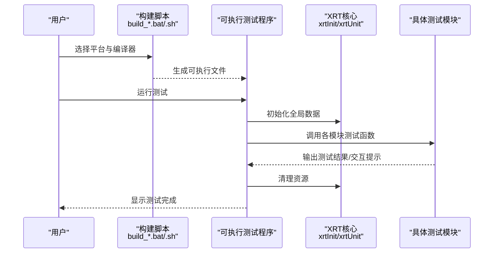
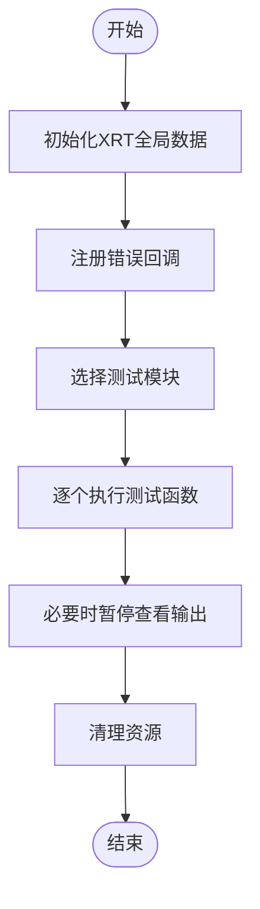
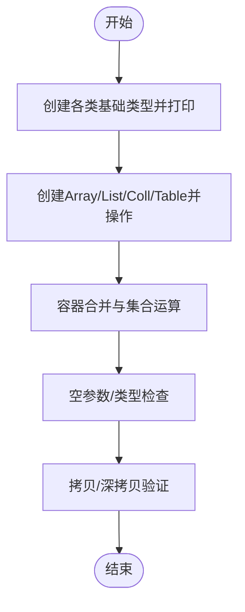
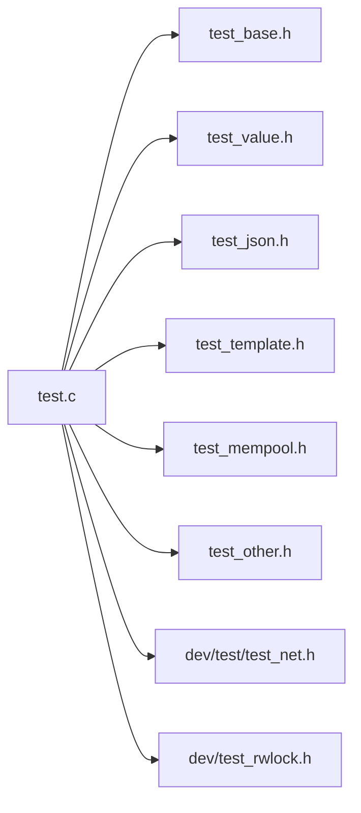

# 测试与调试

<cite>
**本文引用的文件**
- [test.c](file://test.c)
- [README.md](file://README.md)
- [build_test.sh](file://build_test.sh)
- [build_GCC_TEST_x64.bat](file://build_GCC_TEST_x64.bat)
- [build_TCC_TEST_x64.bat](file://build_TCC_TEST_x64.bat)
- [test_base.h](file://test/test_base.h)
- [test_value.h](file://test/test_value.h)
- [test_json.h](file://test/test_json.h)
- [test_template.h](file://test/test_template.h)
- [test_mempool.h](file://test/test_mempool.h)
- [test_other.h](file://test/test_other.h)
- [test_net.h](file://dev/test/test_net.h)
- [dev_test_rwlock.h](file://dev/test_rwlock.h)
</cite>

## 目录
1. [简介](#简介)
2. [项目结构](#项目结构)
3. [核心组件](#核心组件)
4. [架构总览](#架构总览)
5. [详细组件分析](#详细组件分析)
6. [依赖关系分析](#依赖关系分析)
7. [性能考量](#性能考量)
8. [故障排查指南](#故障排查指南)
9. [结论](#结论)
10. [附录](#附录)

## 简介
本指南面向XRT项目的测试与调试工作，围绕31个测试模块的组织结构与覆盖范围展开，涵盖基础功能、数据结构、内存管理、集成测试等多个维度。同时提供测试环境搭建、测试运行、结果分析方法与工具；介绍调试技巧与工具使用（如内存泄漏检测、性能分析、错误诊断）；给出常见问题排查与解决方案，并总结单元测试编写规范与最佳实践。

## 项目结构
XRT采用“单头文件 + 多模块库”的设计，测试入口位于根目录的测试程序，按模块拆分测试文件，分别覆盖基础功能、数据结构、内存管理、高级功能与网络等模块族。构建脚本支持多平台与多编译器，便于快速运行测试。

图表来源
- [test.c](file://test.c#L11-L43)
- [test_base.h](file://test/test_base.h#L5-L10)
- [test_value.h](file://test/test_value.h#L14-L262)
- [test_json.h](file://test/test_json.h#L5-L102)
- [test_template.h](file://test/test_template.h#L5-L625)
- [test_mempool.h](file://test/test_mempool.h#L25-L184)
- [test_other.h](file://test/test_other.h#L91-L119)
- [test_net.h](file://dev/test/test_net.h#L5-L62)
- [dev_test_rwlock.h](file://dev/test_rwlock.h#L277-L281)

章节来源
- [test.c](file://test.c#L11-L43)
- [README.md](file://README.md#L641-L680)

## 核心组件
- 测试入口与调度
  - 测试入口负责初始化XRT全局数据、注册错误回调、按需启用各模块测试、统一收尾清理。
  - 构建脚本提供跨平台一键编译与运行能力，便于快速验证。
- 测试模块分类
  - 基础功能：base、charset、os、math、string、path、time、file、thread、hash、network、xid。
  - 数据结构：buffer、array_ptr、array_struct、bsmm、memunit、mempool_fs、mempool。
  - 栈结构：stack_ptr、stack、dynstack_ptr、dynstack。
  - 树/字典：llist、avltree、dict、list。
  - 高级功能：value、json、template。
- 调试与诊断
  - 错误回调OnError用于捕获运行期错误。
  - 部分测试模块提供可视化输出与交互暂停，便于观察中间状态。
  - 网络与读写锁测试包含性能对比与并发验证。

章节来源
- [test.c](file://test.c#L47-L179)
- [README.md](file://README.md#L641-L680)

## 架构总览
测试体系以“测试入口 + 模块化测试文件”为核心，配合构建脚本与运行时初始化，形成从编译到执行再到结果呈现的闭环。

图表来源
- [build_GCC_TEST_x64.bat](file://build_GCC_TEST_x64.bat#L1-L11)
- [build_TCC_TEST_x64.bat](file://build_TCC_TEST_x64.bat#L1-L11)
- [build_test.sh](file://build_test.sh#L1-L6)
- [test.c](file://test.c#L54-L179)

## 详细组件分析

### 测试入口与运行流程
- 初始化与错误回调
  - 初始化XRT全局数据，注册错误回调，确保异常可捕获。
  - 测试过程中可通过回调打印错误信息，便于定位问题。
- 模块启用策略
  - 通过注释/取消注释的方式启用目标模块测试，便于按需聚焦。
- 清理与退出
  - 测试结束后统一调用清理接口，释放资源。

图表来源
- [test.c](file://test.c#L54-L179)

章节来源
- [test.c](file://test.c#L47-L179)

### 基础功能测试（base）
- 覆盖内容
  - 输出应用路径与文件信息，验证基础运行环境。
- 使用建议
  - 作为首个测试模块，便于确认环境变量与路径解析正常。

章节来源
- [test_base.h](file://test/test_base.h#L5-L10)

### Value类型系统测试（value）
- 覆盖内容
  - 基础类型打印与转换：Null、Bool、Int、Float、Text、Time、Point、Func、Class、Custom。
  - 容器类型：Array、List、Coll、Table的增删改查、合并、集合运算、父子关系。
  - 操作健壮性：空参数检查、内存释放、类型校验、拷贝/深拷贝。
- 测试要点
  - 通过逐步输出与交互暂停，观察不同类型的打印与内部结构。
  - 验证容器合并与集合运算的边界条件与错误输入。

图表来源
- [test_value.h](file://test/test_value.h#L14-L262)
- [test_value.h](file://test/test_value.h#L267-L564)
- [test_value.h](file://test/test_value.h#L569-L1004)

章节来源
- [test_value.h](file://test/test_value.h#L14-L1004)

### JSON处理测试（json）
- 覆盖内容
  - 从文件解析JSON到Value，打印结构，再序列化为格式化/非格式化输出。
- 测试要点
  - 使用测试数据文件验证解析与生成一致性。
  - 观察序列化后的文件内容与格式控制。

章节来源
- [test_json.h](file://test/test_json.h#L5-L102)

### 模板引擎测试（template）
- 覆盖内容
  - 词法分析器空格支持、路径解析器、表达式解析器、控制语句（if/elseif/else、for、foreach）、break/continue、循环次数限制、AST缓存、错误检测等。
- 测试要点
  - 通过多阶段测试（Phase 2/3/4/5）逐步验证语法与性能优化。
  - 使用嵌套数据结构与复杂模板验证路径与控制流。

章节来源
- [test_template.h](file://test/test_template.h#L5-L625)

### 内存池测试（mempool）
- 覆盖内容
  - 打印小块/普通块规划树、创建对象、分配/释放内存、结构体单元与销毁。
- 测试要点
  - 通过树形打印观察内存块分配策略。
  - 验证分配/释放后内部计数与状态变化。

章节来源
- [test_mempool.h](file://test/test_mempool.h#L25-L184)

### 自定义测试（other）
- 覆盖内容
  - 提供自定义测试入口与样例代码片段，便于扩展新测试或临时验证。
- 测试要点
  - 可结合JSON SAX解析回调进行深入分析。

章节来源
- [test_other.h](file://test/test_other.h#L91-L119)

### 网络测试（dev/test/test_net.h）
- 覆盖内容
  - TCP/UDP服务器与客户端、TLS（OpenSSL/BUILTIN）变体的选择与交互。
- 测试要点
  - 通过菜单选择运行不同变体，验证网络库初始化与清理流程。

章节来源
- [test_net.h](file://dev/test/test_net.h#L5-L62)

### 读写锁测试（dev/test_rwlock.h）
- 覆盖内容
  - 功能测试：读写锁基本操作、TryLock、锁降级/升级、调试信息。
  - 性能测试：与Mutex对比、多线程并发读写。
- 测试要点
  - 多线程场景下统计读/写次数与列表元素数，评估吞吐与公平性。

章节来源
- [dev_test_rwlock.h](file://dev/test_rwlock.h#L65-L173)
- [dev_test_rwlock.h](file://dev/test_rwlock.h#L178-L281)

## 依赖关系分析
- 模块间依赖
  - 测试入口依赖各模块头文件；部分模块（如模板引擎）依赖Value类型系统。
- 外部依赖
  - 网络测试依赖系统网络库（Windows下WS2_32/IPHLPAPI）。
- 构建依赖
  - 多平台多编译器支持，脚本自动选择编译器与链接参数。

图表来源
- [test.c](file://test.c#L11-L43)
- [test_net.h](file://dev/test/test_net.h#L1-L3)
- [dev_test_rwlock.h](file://dev/test_rwlock.h#L3)

章节来源
- [test.c](file://test.c#L11-L43)
- [build_GCC_TEST_x64.bat](file://build_GCC_TEST_x64.bat#L1)

## 性能考量
- 性能测试方法
  - 读写锁测试中使用计时器对比Mutex与RWLock在相同负载下的耗时差异。
  - 通过多线程并发读写场景统计吞吐与锁竞争情况。
- 优化建议
  - 在高并发读场景优先使用读写锁，减少写锁争用。
  - 合理设置循环次数上限，避免极端场景导致的资源耗尽。

章节来源
- [dev_test_rwlock.h](file://dev/test_rwlock.h#L65-L131)

## 故障排查指南
- 常见问题与定位
  - 环境初始化失败：检查构建脚本与平台依赖（Windows下网络库）。
  - 测试输出异常：确认测试模块启用状态与路径拼接是否正确。
  - 内存相关问题：使用内存池测试观察分配/释放状态，结合调试宏输出。
  - 网络测试失败：确认本地网络服务可用性与防火墙设置。
- 调试技巧
  - 使用交互暂停观察中间状态，逐步缩小问题范围。
  - 通过错误回调捕获异常信息，结合日志定位。
  - 对比功能测试与性能测试结果，识别潜在瓶颈或竞态。

章节来源
- [test.c](file://test.c#L47-L66)
- [test_mempool.h](file://test/test_mempool.h#L33-L45)
- [test_net.h](file://dev/test/test_net.h#L9-L12)

## 结论
XRT测试体系覆盖全面，模块化程度高，便于按需启用与扩展。通过构建脚本与测试入口，可快速完成跨平台验证。建议在日常开发中遵循“先功能后性能、先单模块后集成”的策略，结合调试工具与性能测试，持续提升代码质量与稳定性。

## 附录

### 测试环境搭建与运行
- Windows
  - TCC编译（推荐）：双击相应批处理脚本，自动编译并运行。
  - GCC编译：使用对应脚本生成DLL或测试程序。
- Linux/macOS
  - 使用shell脚本一键编译并运行测试程序。

章节来源
- [README.md](file://README.md#L213-L229)
- [build_test.sh](file://build_test.sh#L1-L6)
- [build_GCC_TEST_x64.bat](file://build_GCC_TEST_x64.bat#L1-L11)
- [build_TCC_TEST_x64.bat](file://build_TCC_TEST_x64.bat#L1-L11)

### 测试运行与结果分析
- 运行方式
  - Windows：批处理脚本自动进入release目录并执行测试程序。
  - Linux/macOS：直接运行生成的可执行文件。
- 结果分析
  - 通过模块内打印与交互暂停，观察关键状态与输出。
  - 对比预期结果，记录通过/失败数量，定位失败用例。

章节来源
- [build_GCC_TEST_x64.bat](file://build_GCC_TEST_x64.bat#L6-L10)
- [build_TCC_TEST_x64.bat](file://build_TCC_TEST_x64.bat#L6-L10)
- [build_test.sh](file://build_test.sh#L5)

### 调试技巧与工具
- 内存泄漏检测
  - 使用内存池测试观察分配/释放状态，结合调试宏输出定位异常。
- 性能分析
  - 读写锁性能测试提供对比参考，建议在关键路径上进行基准测试。
- 错误诊断
  - 注册错误回调，捕获异常信息；结合交互暂停逐步排查。

章节来源
- [test.c](file://test.c#L47-L66)
- [dev_test_rwlock.h](file://dev/test_rwlock.h#L65-L131)
- [test_mempool.h](file://test/test_mempool.h#L33-L45)

### 单元测试编写指南与最佳实践
- 模块化设计
  - 将测试拆分为独立模块，便于启用/禁用与并行执行。
- 可观测性
  - 在关键步骤输出状态信息，必要时暂停等待人工确认。
- 边界与异常
  - 覆盖空参数、错误类型、越界访问等边界条件。
- 性能与并发
  - 在高并发场景下验证正确性与性能表现，避免死锁与资源泄露。
- 可重复性
  - 使用确定性输入与可控环境，确保测试结果可复现。