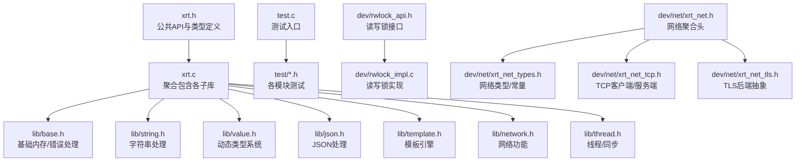
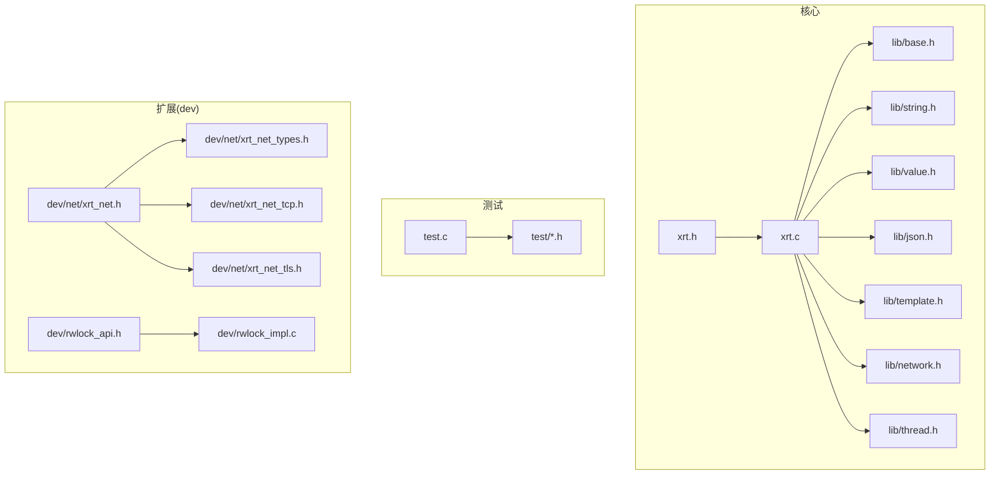
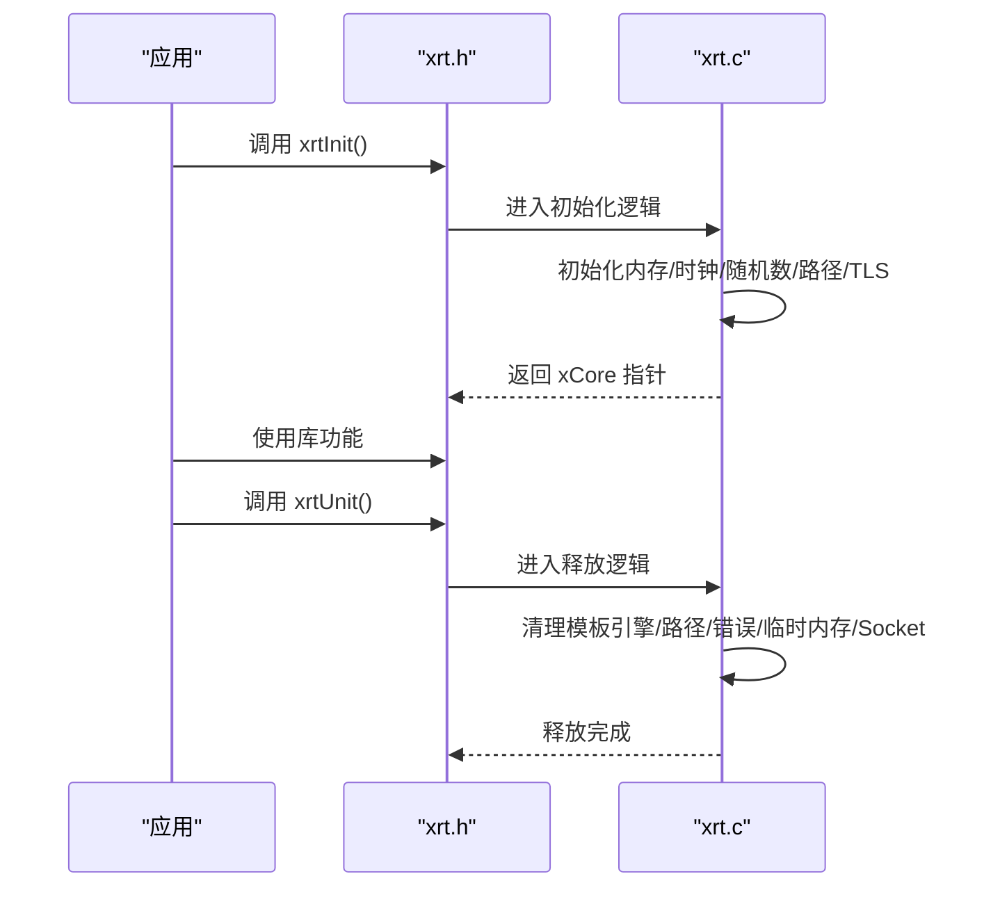
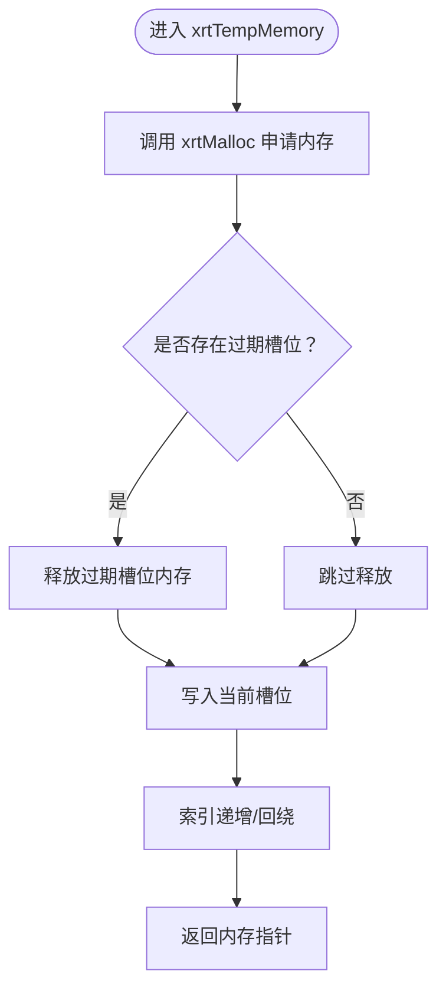
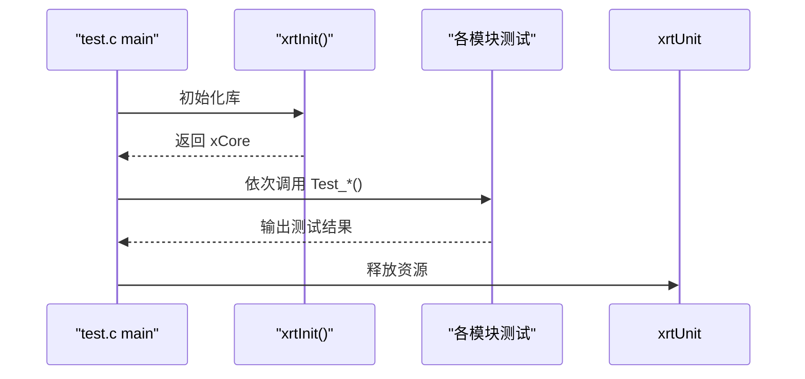
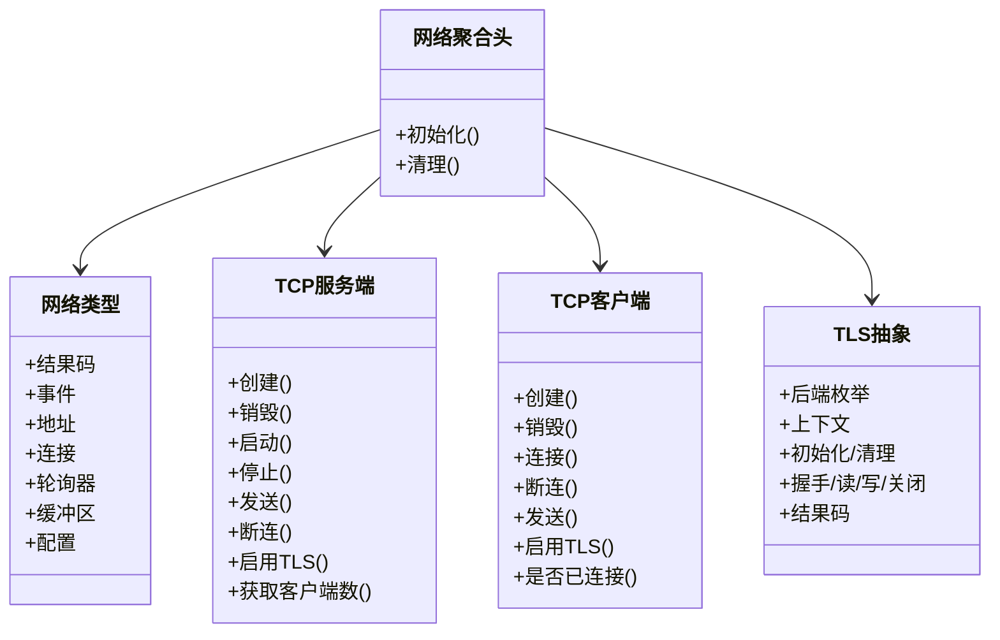
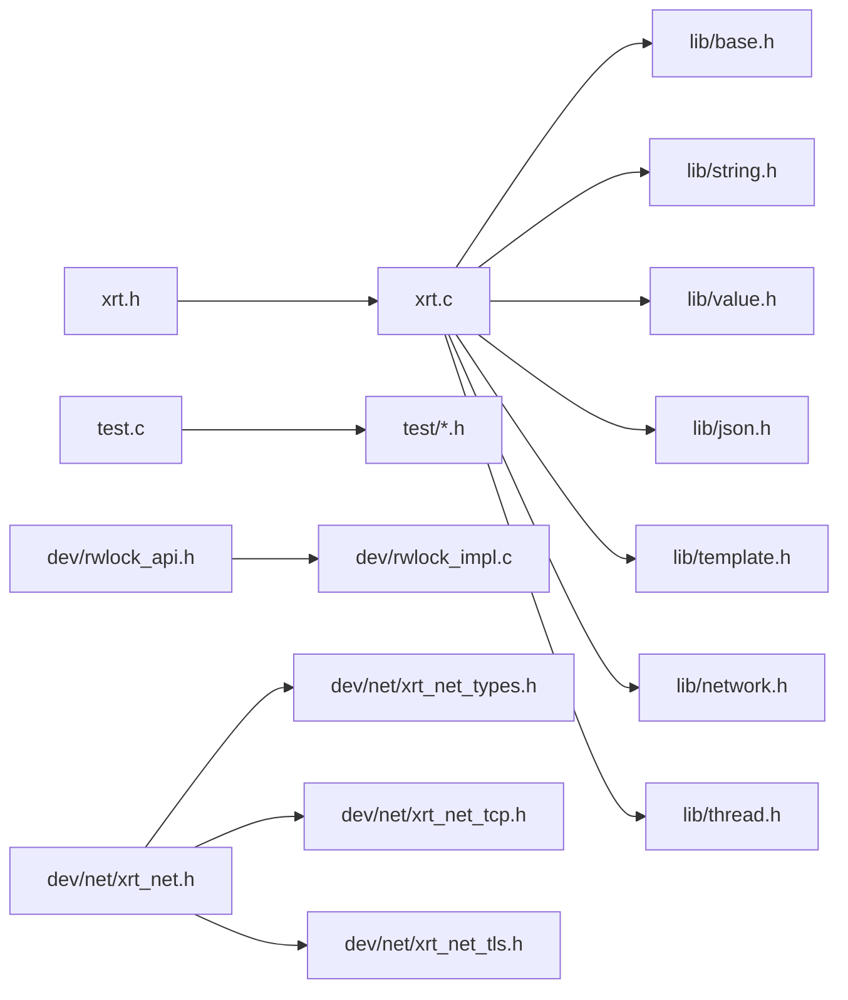

# 贡献与开发

<cite>
**本文引用的文件**   
- [README.md](file://README.md)
- [README.en.md](file://README.en.md)
- [xrt.h](file://xrt.h)
- [xrt.c](file://xrt.c)
- [test.c](file://test.c)
- [build.sh](file://build.sh)
- [build_test.sh](file://build_test.sh)
- [lib/base.h](file://lib/base.h)
- [dev/rwlock_api.h](file://dev/rwlock_api.h)
- [dev/rwlock_impl.c](file://dev/rwlock_impl.c)
- [dev/net/xrt_net.h](file://dev/net/xrt_net.h)
- [dev/net/xrt_net_types.h](file://dev/net/xrt_net_types.h)
- [dev/net/xrt_net_tcp.h](file://dev/net/xrt_net_tcp.h)
- [dev/net/xrt_net_tls.h](file://dev/net/xrt_net_tls.h)
</cite>

## 目录
1. [简介](#简介)
2. [项目结构](#项目结构)
3. [核心组件](#核心组件)
4. [架构总览](#架构总览)
5. [详细组件分析](#详细组件分析)
6. [依赖关系分析](#依赖关系分析)
7. [性能考量](#性能考量)
8. [故障排查指南](#故障排查指南)
9. [结论](#结论)
10. [附录](#附录)

## 简介
本指南面向希望参与 XRT（X Runtime Library）项目贡献与开发的工程师，覆盖从 Fork 仓库、创建分支、提交与 PR 的标准流程，到代码规范、风格与注释要求、新模块开发指南、扩展开发方法（插件、性能优化、调试技巧）、以及开发环境搭建与最佳实践。XRT 是一个零外部依赖、单头文件设计、跨平台的高性能 C 语言运行时库，包含 32 个功能模块与完善的测试体系。

## 项目结构
XRT 采用“主头文件 + 多子库”的组织方式，核心入口为单头文件与实现文件，子模块按功能拆分至 lib/，配套测试位于 test/，网络与并发扩展位于 dev/ 下的子目录。构建脚本提供跨平台编译与测试执行。

图示来源
- [xrt.h](file://xrt.h#L1-L200)
- [xrt.c](file://xrt.c#L54-L84)
- [lib/base.h](file://lib/base.h#L1-L132)
- [test.c](file://test.c#L11-L43)
- [dev/rwlock_api.h](file://dev/rwlock_api.h#L1-L93)
- [dev/rwlock_impl.c](file://dev/rwlock_impl.c#L40-L112)
- [dev/net/xrt_net.h](file://dev/net/xrt_net.h#L1-L14)
- [dev/net/xrt_net_types.h](file://dev/net/xrt_net_types.h#L1-L120)
- [dev/net/xrt_net_tcp.h](file://dev/net/xrt_net_tcp.h#L1-L50)
- [dev/net/xrt_net_tls.h](file://dev/net/xrt_net_tls.h#L1-L85)

章节来源
- [README.md](file://README.md#L355-L398)
- [README.en.md](file://README.en.md#L355-L398)

## 核心组件
- 全局初始化与生命周期管理：xrtInit()/xrtUnit() 负责全局状态初始化、引用计数、平台资源清理与模板引擎初始化。
- 基础内存与错误处理：提供内存分配、环形临时内存、错误设置与清理等能力。
- 测试框架：test.c 作为统一入口，按模块启用测试，便于回归验证。

章节来源
- [xrt.c](file://xrt.c#L87-L226)
- [lib/base.h](file://lib/base.h#L4-L132)
- [test.c](file://test.c#L54-L179)

## 架构总览
XRT 的核心由单头文件声明与实现文件聚合组成，实现文件通过包含 lib/* 子库形成完整功能；测试入口集中调用各模块测试；dev/ 下提供网络与并发扩展的接口与实现。

图示来源
- [xrt.h](file://xrt.h#L1-L200)
- [xrt.c](file://xrt.c#L54-L84)
- [test.c](file://test.c#L11-L43)
- [dev/rwlock_api.h](file://dev/rwlock_api.h#L1-L93)
- [dev/rwlock_impl.c](file://dev/rwlock_impl.c#L40-L112)
- [dev/net/xrt_net.h](file://dev/net/xrt_net.h#L1-L14)
- [dev/net/xrt_net_types.h](file://dev/net/xrt_net_types.h#L1-L120)
- [dev/net/xrt_net_tcp.h](file://dev/net/xrt_net_tcp.h#L1-L50)
- [dev/net/xrt_net_tls.h](file://dev/net/xrt_net_tls.h#L1-L85)

## 详细组件分析

### 组件A：全局初始化与生命周期（xrtInit/xrtUnit）
- 初始化流程要点
  - 引用计数增加，避免重复初始化
  - 初始化内存函数指针、环形临时内存槽位、高精度时钟频率、随机数生成器
  - 约等于配置默认值（整数/浮点/时间/字符串）
  - 获取应用文件与路径、初始化 socket、获取本机 IP、初始化模板引擎
- 释放流程要点
  - 引用计数减少，归零时清理模板引擎、应用路径、错误信息、环形临时内存、socket
- 并发注意
  - 全局状态与临时内存为线程不安全，需在单线程或自行保护

图示来源
- [xrt.c](file://xrt.c#L87-L226)
- [xrt.h](file://xrt.h#L188-L193)

章节来源
- [xrt.c](file://xrt.c#L87-L226)
- [xrt.h](file://xrt.h#L122-L193)

### 组件B：基础内存与错误处理（lib/base.h）
- 内存管理
  - 分配/重新分配/释放，失败时设置错误
  - 环形临时内存：32 槽位循环使用，自动释放过期内存
- 错误处理
  - 设置/清除错误，支持回调 OnError
- 线程安全提示
  - 环形临时内存与错误信息为线程不安全

图示来源
- [lib/base.h](file://lib/base.h#L49-L84)

章节来源
- [lib/base.h](file://lib/base.h#L4-L132)

### 组件C：测试框架与回归验证（test.c）
- 测试入口
  - 初始化 xCore 并注册错误回调
  - 逐模块启用测试（如 base、string、value、json、template 等）
- 运行方式
  - Windows：批处理脚本构建并运行 release/x64/test.exe
  - Linux/macOS：脚本构建并运行 release/x64/xrt_test

图示来源
- [test.c](file://test.c#L54-L179)
- [build_test.sh](file://build_test.sh#L1-L6)

章节来源
- [test.c](file://test.c#L54-L179)
- [build_test.sh](file://build_test.sh#L1-L6)

### 组件D：读写锁扩展（dev/rwlock_api.h / dev/rwlock_impl.c）
- 设计原则
  - 跨平台（Windows SRWLOCK、Linux pthread_rwlock）
  - 高性能、高可靠性、公平性（写优先）、调试支持（递归锁检测、持有者跟踪）
- 接口能力
  - 创建/销毁、初始化/释放
  - 读锁/写锁获取与尝试获取、释放
  - 降级（写锁转读锁）、升级（读锁转写锁，存在风险）
  - 调试辅助（状态查询）

图示来源
- [dev/rwlock_api.h](file://dev/rwlock_api.h#L11-L93)
- [dev/rwlock_impl.c](file://dev/rwlock_impl.c#L40-L380)

章节来源
- [dev/rwlock_api.h](file://dev/rwlock_api.h#L1-L93)
- [dev/rwlock_impl.c](file://dev/rwlock_impl.c#L40-L380)

### 组件E：网络扩展（dev/net）
- 聚合头与类型
  - xrt_net.h 聚合 TCP/UDP/TLS 类型与平台抽象
  - xrt_net_types.h 定义网络结果码、事件、地址、连接、轮询器、缓冲区、配置等
- TCP 客户端/服务端
  - 服务器：监听、接受连接、广播/定向发送、断连、TLS 启用、统计客户端数
  - 客户端：连接、断连、发送、TLS 启用、连接状态查询
- TLS 抽象
  - 后端枚举（mbedTLS/OpenSSL/wolfSSL/Built-in）
  - 上下文创建/销毁、握手、读写、关闭、结果码与后端查询

图示来源
- [dev/net/xrt_net.h](file://dev/net/xrt_net.h#L1-L14)
- [dev/net/xrt_net_types.h](file://dev/net/xrt_net_types.h#L27-L98)
- [dev/net/xrt_net_tcp.h](file://dev/net/xrt_net_tcp.h#L8-L47)
- [dev/net/xrt_net_tls.h](file://dev/net/xrt_net_tls.h#L6-L71)

章节来源
- [dev/net/xrt_net.h](file://dev/net/xrt_net.h#L1-L14)
- [dev/net/xrt_net_types.h](file://dev/net/xrt_net_types.h#L1-L208)
- [dev/net/xrt_net_tcp.h](file://dev/net/xrt_net_tcp.h#L1-L50)
- [dev/net/xrt_net_tls.h](file://dev/net/xrt_net_tls.h#L1-L85)

## 依赖关系分析
- 模块耦合
  - xrt.c 通过包含 lib/* 实现功能聚合，模块间通过 xrt.h 的公共 API 间接耦合
  - dev/ 扩展模块独立于核心，通过各自头文件暴露接口
- 外部依赖
  - 标准 C 库与平台 API（Windows Winsock、Linux socket/poll），无第三方库
- 构建与测试
  - Linux/macOS 使用 gcc 构建共享库与测试程序；Windows 提供批处理脚本

图示来源
- [xrt.c](file://xrt.c#L54-L84)
- [test.c](file://test.c#L11-L43)
- [dev/rwlock_api.h](file://dev/rwlock_api.h#L1-L93)
- [dev/rwlock_impl.c](file://dev/rwlock_impl.c#L40-L112)
- [dev/net/xrt_net.h](file://dev/net/xrt_net.h#L1-L14)
- [dev/net/xrt_net_types.h](file://dev/net/xrt_net_types.h#L1-L120)
- [dev/net/xrt_net_tcp.h](file://dev/net/xrt_net_tcp.h#L1-L50)
- [dev/net/xrt_net_tls.h](file://dev/net/xrt_net_tls.h#L1-L85)

章节来源
- [xrt.c](file://xrt.c#L54-L84)
- [test.c](file://test.c#L11-L43)

## 性能考量
- 内存管理
  - 环形临时内存：32 槽位循环使用，降低频繁分配/释放成本
  - 多级内存池与固定大小块（FSB）：平衡碎片与分配效率
- 算法与数据结构
  - AVL 树：字典/集合查找/插入/删除 O(log n)
  - 高效哈希：nmhash32x/rapidhash，适配不同位宽
  - 内联优化：关键路径提供 Inline 版本
- 线程与并发
  - 读写锁：跨平台高性能实现，写优先防止写饥饿，支持降级/升级（注意风险）
- 网络
  - 轮询器与事件驱动模型，结合缓冲区扩容策略，提升吞吐

## 故障排查指南
- 常见问题
  - 内存泄漏：确认使用 xrtFree 释放由库分配的内存；避免重复释放
  - 线程安全：环形临时内存与错误信息非线程安全，需自行保护
  - TLS 握手失败：检查证书/密钥路径与主机名校验配置
  - 网络阻塞：关注 AGAIN/TIMEOUT 等返回码，合理设置轮询超时
- 调试技巧
  - 启用 OnError 回调捕获错误信息
  - 读写锁调试宏：记录等待读者/写者数量、持有者线程 ID、递归写锁检测
  - 网络缓冲区：使用 reserve/append/clear/consume 管理数据流

章节来源
- [lib/base.h](file://lib/base.h#L88-L132)
- [dev/rwlock_impl.c](file://dev/rwlock_impl.c#L14-L37)
- [dev/net/xrt_net_types.h](file://dev/net/xrt_net_types.h#L99-L110)
- [dev/net/xrt_net_types.h](file://dev/net/xrt_net_types.h#L145-L205)

## 结论
XRT 提供了高度模块化、跨平台且性能优异的 C 语言运行时能力。贡献者应遵循本文的流程与规范，确保新增模块与扩展在正确分支上开发并通过测试验证，同时关注线程安全与性能影响，共同维护高质量的代码生态。

## 附录

### A. 贡献流程（Fork/分支/PR）
- Fork 仓库
- 新建特性分支：git checkout -b feature/AmazingFeature
- 提交更改：git commit -m 'Add some AmazingFeature'
- 推送分支：git push origin feature/AmazingFeature
- 提交 Pull Request

章节来源
- [README.md](file://README.md#L722-L731)
- [README.en.md](file://README.en.md#L722-L731)

### B. 代码规范与风格
- 命名约定
  - API 前缀：xrt*（基础/字符串/时间/文件/线程/哈希/网络/XID）、xvo*（Value 类型）、xrtNet*（网络扩展）
  - 类型与结构：x*struct 名称（如 xthread_struct、xrwlock_struct）
  - 宏与枚举：XRT_*、XRT_TLS_*、XRT_NET_* 等
- 注释规范
  - 公共 API 与关键数据结构应提供清晰注释，说明用途、参数、返回值与注意事项
  - 平台差异与线程安全说明
- 错误处理
  - 失败路径统一设置错误信息并通过回调通知
  - 释放资源时注意幂等性与边界检查

章节来源
- [xrt.h](file://xrt.h#L209-L800)
- [lib/base.h](file://lib/base.h#L88-L132)

### C. 新模块开发指南
- 模块设计原则
  - 单一职责、与现有子库解耦
  - 通过 lib/<module>.h 暴露 API，并在 xrt.c 中包含
- API 设计规范
  - 前缀统一、参数与返回值明确、错误处理一致
  - 对外暴露的类型与常量使用清晰命名
- 测试要求
  - 在 test.c 中添加对应测试入口
  - 覆盖正常/异常路径，关注平台差异

章节来源
- [xrt.c](file://xrt.c#L54-L84)
- [test.c](file://test.c#L11-L43)

### D. 扩展开发方法
- 插件/扩展接口
  - 读写锁：跨平台高性能实现，支持调试追踪
  - 网络：事件驱动、TLS 后端可插拔
- 性能优化
  - 使用环形临时内存与多级内存池
  - 选择合适的数据结构（AVL/哈希/内存池）
  - 避免不必要的内存复制，利用缓冲区扩容策略
- 调试技巧
  - 启用调试宏，记录锁状态与线程 ID
  - 网络层关注 AGAIN/TIMEOUT，合理设置轮询与缓冲区

章节来源
- [dev/rwlock_api.h](file://dev/rwlock_api.h#L1-L93)
- [dev/rwlock_impl.c](file://dev/rwlock_impl.c#L40-L380)
- [dev/net/xrt_net_types.h](file://dev/net/xrt_net_types.h#L99-L205)

### E. 开发环境搭建与最佳实践
- 环境准备
  - Windows：TCC/GCC/MSVC 均可；提供批处理脚本
  - Linux/macOS：使用 gcc，提供构建脚本
- 最佳实践
  - 使用 xrtInit/xrtUnit 管理生命周期
  - 严格遵循命名与注释规范
  - 在 PR 前运行完整测试套件

章节来源
- [README.md](file://README.md#L201-L229)
- [README.en.md](file://README.en.md#L201-L229)
- [build.sh](file://build.sh#L1-L5)
- [build_test.sh](file://build_test.sh#L1-L6)