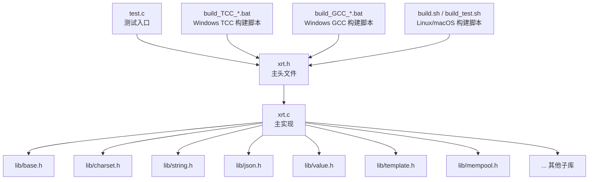
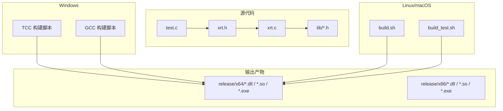
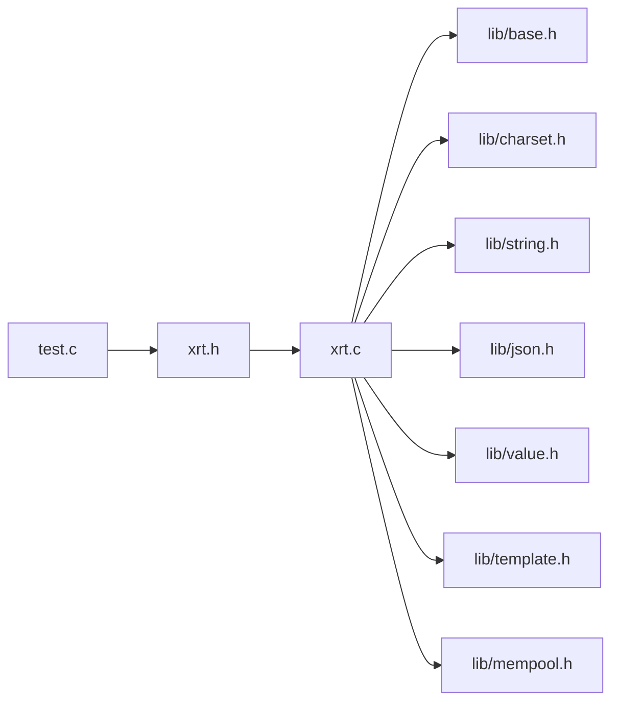

# 安装指南

<cite>
**本文引用的文件**
- [README.md](file://README.md)
- [README.en.md](file://README.en.md)
- [build.sh](file://build.sh)
- [build_test.sh](file://build_test.sh)
- [build_TCC_DLL_x64.bat](file://build_TCC_DLL_x64.bat)
- [build_TCC_DLL_x86.bat](file://build_TCC_DLL_x86.bat)
- [build_TCC_OBJ_x64.bat](file://build_TCC_OBJ_x64.bat)
- [build_TCC_OBJ_x86.bat](file://build_TCC_OBJ_x86.bat)
- [build_TCC_TEST_x64.bat](file://build_TCC_TEST_x64.bat)
- [build_TCC_TEST_x86.bat](file://build_TCC_TEST_x86.bat)
- [build_GCC_DLL_x64.bat](file://build_GCC_DLL_x64.bat)
- [build_GCC_TEST_x64.bat](file://build_GCC_TEST_x64.bat)
- [xrt.h](file://xrt.h)
- [xrt.c](file://xrt.c)
- [test.c](file://test.c)
</cite>

## 目录
1. [简介](#简介)
2. [项目结构](#项目结构)
3. [核心组件](#核心组件)
4. [架构总览](#架构总览)
5. [详细组件分析](#详细组件分析)
6. [依赖关系分析](#依赖关系分析)
7. [性能注意事项](#性能注意事项)
8. [故障排查指南](#故障排查指南)
9. [结论](#结论)
10. [附录](#附录)

## 简介
本指南面向希望在多平台、多编译器环境下安装与配置 XRT 的开发者。XRT 是一个零依赖、单头文件设计的 C 语言运行时库，提供跨平台支持与多种构建目标（DLL、OBJ、TEST）。本指南将覆盖：
- 多平台安装与编译流程（Windows TCC/GCC、Linux/macOS GCC/Clang）
- 构建目标选择与使用场景
- 环境变量与路径配置建议
- 常见问题排查
- Docker 与包管理器安装思路（概念性指导）

## 项目结构
XRT 采用“单头文件 + 多子库”的组织方式，核心入口为 xrt.h 与 xrt.c，配合 lib/ 下的模块化子库与 docs/ API 文档。测试入口位于 test.c，构建脚本分布在根目录。

图表来源
- [xrt.h](file://xrt.h#L1-L120)
- [xrt.c](file://xrt.c#L48-L84)
- [test.c](file://test.c#L11-L43)

章节来源
- [README.md](file://README.md#L355-L398)
- [README.en.md](file://README.en.md#L355-L398)

## 核心组件
- 单头文件 API：xrt.h 提供 2320 行 API 声明，统一对外接口。
- 主实现聚合：xrt.c 通过包含 lib/*.h 将各子库整合为单一可链接单元。
- 构建脚本：Windows 提供 TCC/GCC 批处理脚本；Linux/macOS 提供 Bash 脚本。
- 测试入口：test.c 汇聚 31 个测试模块，便于功能验证。

章节来源
- [xrt.h](file://xrt.h#L114-L118)
- [xrt.c](file://xrt.c#L48-L84)
- [test.c](file://test.c#L11-L43)

## 架构总览
XRT 的构建与运行架构如下：

图表来源
- [build_TCC_DLL_x64.bat](file://build_TCC_DLL_x64.bat#L1-L7)
- [build_GCC_DLL_x64.bat](file://build_GCC_DLL_x64.bat#L1-L7)
- [build.sh](file://build.sh#L1-L5)
- [build_test.sh](file://build_test.sh#L1-L6)

## 详细组件分析

### Windows 平台安装与编译（TCC、GCC、MSVC）
- TCC（毫秒级编译）
  - 64 位 DLL：使用 build_TCC_DLL_x64.bat，目标输出 release/x64/xrt.dll。
  - 32 位 DLL：使用 build_TCC_DLL_x86.bat，目标输出 release/x86/xrt.dll。
  - 64 位 OBJ：使用 build_TCC_OBJ_x64.bat，目标输出 release/x64/xrt.o。
  - 32 位 OBJ：使用 build_TCC_OBJ_x86.bat，目标输出 release/x86/xrt.o。
  - 64 位 TEST：使用 build_TCC_TEST_x64.bat，目标输出 release/x64/test.exe 并自动运行。
  - 32 位 TEST：使用 build_TCC_TEST_x86.bat，目标输出 release/x86/test.exe 并自动运行。
- GCC（64 位）
  - 64 位 DLL：使用 build_GCC_DLL_x64.bat，链接 Windows Socket 与 IP Helper 库。
  - 64 位 TEST：使用 build_GCC_TEST_x64.bat，链接相同库并运行测试。
- MSVC（Visual Studio）
  - 项目可直接以 xrt.c 作为源文件，包含 xrt.h，并在链接阶段添加 Windows Socket 与 IP Helper 库（Ws2_32.lib、IPHLPAPI.lib）。

构建目标与输出
- DLL：动态链接库，适用于共享库分发与集成。
- OBJ：静态目标文件，适用于自定义链接策略。
- TEST：可执行测试程序，便于快速验证功能。

章节来源
- [build_TCC_DLL_x64.bat](file://build_TCC_DLL_x64.bat#L1-L7)
- [build_TCC_DLL_x86.bat](file://build_TCC_DLL_x86.bat#L1-L7)
- [build_TCC_OBJ_x64.bat](file://build_TCC_OBJ_x64.bat#L1-L7)
- [build_TCC_OBJ_x86.bat](file://build_TCC_OBJ_x86.bat#L1-L7)
- [build_TCC_TEST_x64.bat](file://build_TCC_TEST_x64.bat#L1-L11)
- [build_TCC_TEST_x86.bat](file://build_TCC_TEST_x86.bat#L1-L11)
- [build_GCC_DLL_x64.bat](file://build_GCC_DLL_x64.bat#L1-L7)
- [build_GCC_TEST_x64.bat](file://build_GCC_TEST_x64.bat#L1-L11)
- [README.md](file://README.md#L402-L429)

### Linux/macOS 平台安装与编译（GCC、Clang）
- 使用 Bash 脚本一键构建：
  - 构建 64 位共享库：bash build.sh。
  - 构建 64 位测试程序并运行：bash build_test.sh。
- Clang 亦可直接编译，命令风格与 GCC 类似，遵循相同的优化与链接参数。

章节来源
- [build.sh](file://build.sh#L1-L5)
- [build_test.sh](file://build_test.sh#L1-L6)
- [README.md](file://README.md#L402-L429)

### 构建目标选择与使用场景
- DLL：适合需要动态加载、跨项目复用的场景。
- OBJ：适合静态链接或自定义链接策略。
- TEST：适合快速验证功能与回归测试。

章节来源
- [README.md](file://README.md#L421-L429)

### 环境变量与路径配置
- Windows
  - 确保 TCC/GCC 可执行文件在 PATH 中，或在脚本所在目录可用。
  - 若使用 MSVC，确保 Visual Studio 开发者命令行或 VS IDE 已正确初始化。
  - 链接库：Ws2_32.lib、IPHLPAPI.lib（GCC/MSVC 需在链接阶段指定）。
- Linux/macOS
  - 确保 GCC/Clang 已安装并可用。
  - 构建脚本默认使用 gcc，若需 clang，可自行替换命令。
- 输出路径
  - 所有构建产物输出至 release/x64 或 release/x86，按架构区分。

章节来源
- [build_GCC_DLL_x64.bat](file://build_GCC_DLL_x64.bat#L1-L7)
- [build_GCC_TEST_x64.bat](file://build_GCC_TEST_x64.bat#L1-L11)
- [build.sh](file://build.sh#L1-L5)
- [build_test.sh](file://build_test.sh#L1-L6)

### 依赖检查清单
- 标准 C 库：XRT 除标准库外无其他外部依赖。
- 平台相关库
  - Windows：Ws2_32（Socket）、IPHLPAPI（网络接口）。
  - Linux/macOS：无需额外链接库（脚本未显式链接）。
- 头文件路径：确保编译器能找到 xrt.h 与 lib/*.h。

章节来源
- [xrt.h](file://xrt.h#L32-L44)
- [xrt.c](file://xrt.c#L8-L38)
- [build_GCC_DLL_x64.bat](file://build_GCC_DLL_x64.bat#L1-L7)
- [build_GCC_TEST_x64.bat](file://build_GCC_TEST_x64.bat#L1-L11)

### Docker 容器化部署（概念性方案）
- Windows（WSL2/容器）
  - 在容器内安装 TCC/GCC，复制源码，执行对应构建脚本。
- Linux/macOS
  - 在容器内安装 gcc/clang，执行 bash build.sh 或 bash build_test.sh。
- 注意事项
  - 容器镜像需包含编译器与标准库。
  - 构建产物建议挂载到宿主机目录以便后续使用。

[本节为概念性指导，不直接映射具体源文件]

### 包管理器安装（概念性方案）
- Windows
  - 使用 vcpkg/Conan 等管理器安装 GCC/Clang，再按脚本构建。
- Linux/macOS
  - 使用 apt/yum/brew 安装 gcc/clang，再按脚本构建。
- 注意事项
  - 包管理器安装的是编译器工具链，XRT 仍需按本指南的脚本方式构建。

[本节为概念性指导，不直接映射具体源文件]

## 依赖关系分析
XRT 的依赖关系简洁明确：xrt.c 聚合 lib/*.h，test.c 聚合 test/*.h，构建脚本负责编译与链接。

图表来源
- [xrt.c](file://xrt.c#L48-L84)
- [test.c](file://test.c#L11-L43)

章节来源
- [xrt.c](file://xrt.c#L48-L84)
- [test.c](file://test.c#L11-L43)

## 性能注意事项
- 优化级别：构建脚本普遍使用 -O2 与链接时的符号丢弃与节回收，有助于减小体积与提升加载性能。
- 平台差异：Windows 上链接 Socket 与 IP Helper 库，确保网络功能正常。
- 构建目标：DLL 与共享库在运行时按需加载，TEST 适合快速验证。

章节来源
- [build.sh](file://build.sh#L3-L5)
- [build_test.sh](file://build_test.sh#L3-L5)
- [build_GCC_DLL_x64.bat](file://build_GCC_DLL_x64.bat#L1-L7)
- [build_GCC_TEST_x64.bat](file://build_GCC_TEST_x64.bat#L1-L11)

## 故障排查指南
- Windows：找不到 TCC/GCC
  - 将编译器加入 PATH，或在脚本所在目录执行。
- Windows：链接错误（未定义的外部符号）
  - 确认链接了 Ws2_32.lib 与 IPHLPAPI.lib（GCC/MSVC）。
- Windows：控制台中文显示异常
  - 测试程序已在 main 中设置 UTF-8 输出代码页，若仍异常，检查终端设置。
- Linux/macOS：权限不足
  - 为脚本赋予执行权限后再运行：chmod +x build.sh；chmod +x build_test.sh。
- 产物缺失
  - 确认脚本执行成功且 release/x64 或 release/x86 目录存在。

章节来源
- [build_GCC_DLL_x64.bat](file://build_GCC_DLL_x64.bat#L1-L7)
- [build_GCC_TEST_x64.bat](file://build_GCC_TEST_x64.bat#L1-L11)
- [test.c](file://test.c#L54-L66)

## 结论
通过本指南，您可以在 Windows（TCC/GCC/MSVC）、Linux 与 macOS（GCC/Clang）上完成 XRT 的安装与构建。建议优先使用 TCC 进行快速开发与调试，使用 GCC/Clang 进行生产构建。按需选择 DLL/OBJ/TEST 目标，并参考本文的环境与故障排查建议，即可顺利完成配置。

## 附录

### 快速命令参考
- Windows（TCC）
  - 64 位 DLL：build_TCC_DLL_x64.bat
  - 32 位 DLL：build_TCC_DLL_x86.bat
  - 64 位 OBJ：build_TCC_OBJ_x64.bat
  - 32 位 OBJ：build_TCC_OBJ_x86.bat
  - 64 位 TEST：build_TCC_TEST_x64.bat
  - 32 位 TEST：build_TCC_TEST_x86.bat
- Windows（GCC）
  - 64 位 DLL：build_GCC_DLL_x64.bat
  - 64 位 TEST：build_GCC_TEST_x64.bat
- Linux/macOS
  - 构建共享库：bash build.sh
  - 构建并运行测试：bash build_test.sh

章节来源
- [build_TCC_DLL_x64.bat](file://build_TCC_DLL_x64.bat#L1-L7)
- [build_TCC_DLL_x86.bat](file://build_TCC_DLL_x86.bat#L1-L7)
- [build_TCC_OBJ_x64.bat](file://build_TCC_OBJ_x64.bat#L1-L7)
- [build_TCC_OBJ_x86.bat](file://build_TCC_OBJ_x86.bat#L1-L7)
- [build_TCC_TEST_x64.bat](file://build_TCC_TEST_x64.bat#L1-L11)
- [build_TCC_TEST_x86.bat](file://build_TCC_TEST_x86.bat#L1-L11)
- [build_GCC_DLL_x64.bat](file://build_GCC_DLL_x64.bat#L1-L7)
- [build_GCC_TEST_x64.bat](file://build_GCC_TEST_x64.bat#L1-L11)
- [build.sh](file://build.sh#L1-L5)
- [build_test.sh](file://build_test.sh#L1-L6)