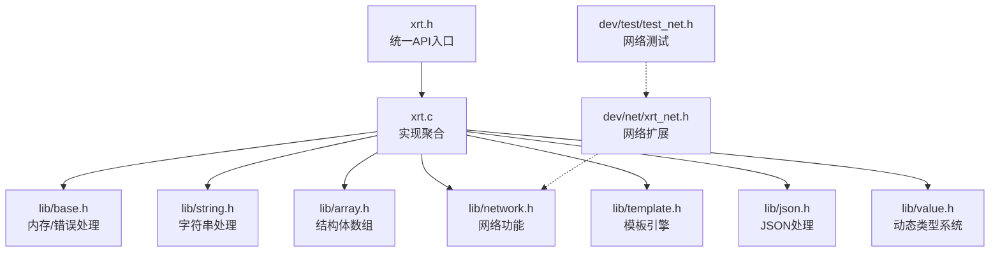
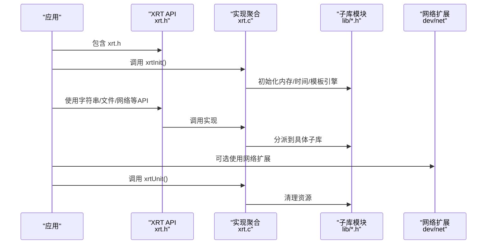
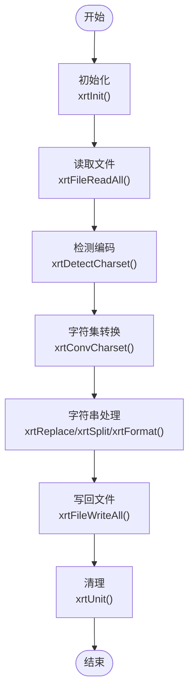
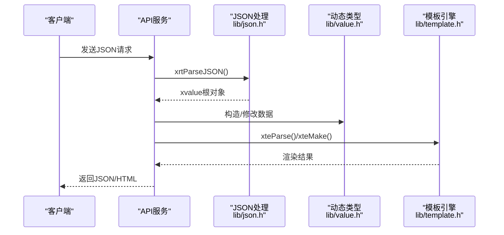
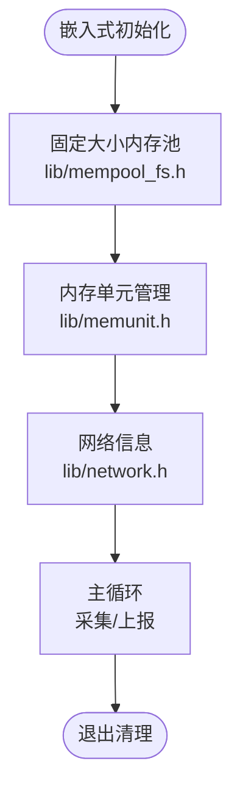
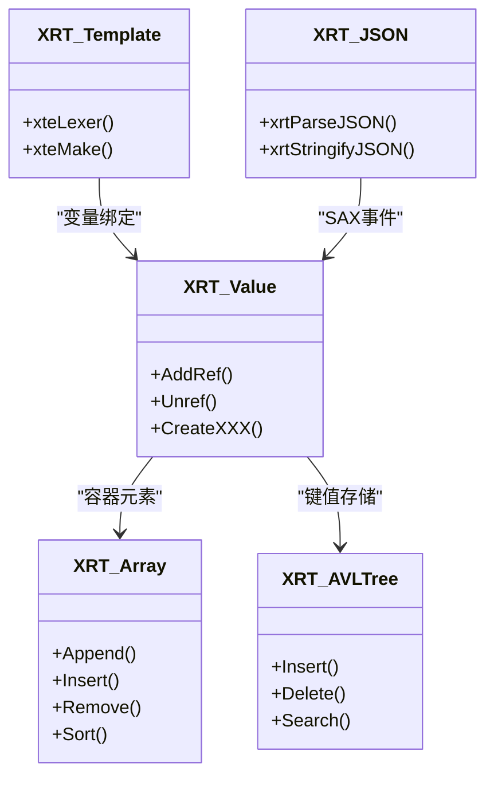
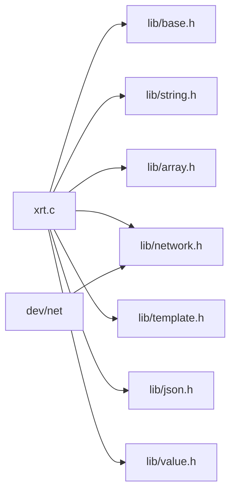

# 应用场景

<cite>
**本文引用的文件**
- [README.md](file://README.md)
- [xrt.h](file://xrt.h)
- [xrt.c](file://xrt.c)
- [lib/base.h](file://lib/base.h)
- [lib/string.h](file://lib/string.h)
- [lib/array.h](file://lib/array.h)
- [lib/network.h](file://lib/network.h)
- [lib/template.h](file://lib/template.h)
- [lib/json.h](file://lib/json.h)
- [lib/value.h](file://lib/value.h)
- [dev/net/xrt_net.h](file://dev/net/xrt_net.h)
- [dev/test/test_net.h](file://dev/test/test_net.h)
- [build_test.sh](file://build_test.sh)
- [build_GCC_DLL_x64.bat](file://build_GCC_DLL_x64.bat)
</cite>

## 目录
1. [简介](#简介)
2. [项目结构](#项目结构)
3. [核心组件](#核心组件)
4. [架构总览](#架构总览)
5. [详细场景分析](#详细场景分析)
6. [依赖关系分析](#依赖关系分析)
7. [性能考量](#性能考量)
8. [故障排查指南](#故障排查指南)
9. [结论](#结论)
10. [附录](#附录)

## 简介
XRT 是一个“轻量级、高性能、功能完备”的 C 语言运行时库，提供统一的单头文件 API，覆盖内存管理、字符集、文件、时间、网络、线程、数据结构、动态类型系统、JSON、模板引擎等完整能力链。其设计目标是让 C 语言开发者像使用现代高级语言一样便捷地进行开发，同时保持极高的性能与跨平台兼容性。

## 项目结构
XRT 采用模块化子库 + 统一头文件的架构：
- 单头文件入口：xrt.h（2320 行 API 声明）
- 实现聚合：xrt.c（包含 lib 下所有子库）
- 子库模块：lib/ 下 32 个功能子库（基础、系统交互、字符串处理、数据结构、内存管理、高级功能等）
- 开发扩展：dev/ 下网络与测试示例
- 文档：docs/ 下各模块 API 文档
- 测试：test/ 下 31 个测试模块
- 构建：多平台构建脚本

图表来源
- [xrt.h](file://xrt.h#L1-L800)
- [xrt.c](file://xrt.c#L54-L84)
- [lib/base.h](file://lib/base.h#L1-L132)
- [lib/string.h](file://lib/string.h#L1-L800)
- [lib/array.h](file://lib/array.h#L1-L180)
- [lib/network.h](file://lib/network.h#L1-L214)
- [lib/template.h](file://lib/template.h#L1-L800)
- [lib/json.h](file://lib/json.h#L1-L800)
- [lib/value.h](file://lib/value.h#L1-L800)
- [dev/net/xrt_net.h](file://dev/net/xrt_net.h#L1-L14)
- [dev/test/test_net.h](file://dev/test/test_net.h#L1-L63)

章节来源
- [README.md](file://README.md#L355-L398)
- [xrt.h](file://xrt.h#L1-L800)
- [xrt.c](file://xrt.c#L54-L84)

## 核心组件
- 初始化与生命周期：xrtInit()/xrtUnit()，负责全局状态、内存函数、时钟频率、随机数、模板引擎初始化与清理
- 基础设施：内存管理（xrtMalloc/xrtFree/xrtTempMemory）、错误处理、环形临时内存（32 槽位自动释放）
- 字符串与字符集：复制/查找/替换/分割/格式化、UTF-8/16/32 互转、编码检测
- 文件与路径：文件读写、目录扫描、路径拼接与解析
- 时间与时钟：高精度计时、时间计算、格式化与解析
- 网络与线程：本机 IP/MAC/名称获取、线程封装
- 数据结构：动态缓冲区、数组、栈、双向链表、AVL 平衡树、字典、列表
- 内存管理：块结构内存管理、内存单元管理、固定大小内存池、通用内存池
- 高级功能：动态类型系统（16 种类型，26 位引用计数）、JSON（SAX 解析/生成）、分布式 ID

章节来源
- [xrt.c](file://xrt.c#L87-L226)
- [lib/base.h](file://lib/base.h#L1-L132)
- [lib/string.h](file://lib/string.h#L1-L800)
- [lib/network.h](file://lib/network.h#L1-L214)
- [lib/value.h](file://lib/value.h#L1-L800)
- [lib/json.h](file://lib/json.h#L1-L800)
- [lib/template.h](file://lib/template.h#L1-L800)

## 架构总览
XRT 的架构围绕“单头文件 + 子库模块”展开，xrt.c 将所有子库实现聚合，运行时通过 xrtInit() 初始化全局状态，xrtUnit() 负责资源回收。网络扩展位于 dev/net，提供 TCP/UDP/TLS 的平台适配与测试入口。

图表来源
- [xrt.h](file://xrt.h#L188-L193)
- [xrt.c](file://xrt.c#L87-L226)
- [dev/net/xrt_net.h](file://dev/net/xrt_net.h#L1-L14)

章节来源
- [xrt.c](file://xrt.c#L87-L226)
- [dev/net/xrt_net.h](file://dev/net/xrt_net.h#L1-L14)

## 详细场景分析

### 工具类开发（命令行工具、系统辅助程序、文件处理工具）
- 需求分析
  - 需要稳定的字符串处理（查找/替换/分割/格式化）
  - 需要文件读写与目录扫描
  - 需要跨平台路径处理与随机路径生成
  - 需要字符集自动转换与编码检测
  - 需要高精度时间与定时
- 技术选型理由
  - 字符串与路径：lib/string.h 与 lib/path.h 提供统一 API，支持大小写/通配符/相似度匹配
  - 文件与编码：lib/file.h 与 lib/charset.h 支持字符集自动转换与 BOM 检测
  - 时间与时钟：lib/time.h 提供高精度计时与格式化
  - 内存管理：lib/base.h 的环形临时内存适合函数内临时返回值，减少泄漏风险
- 实现方案
  - 初始化：调用 xrtInit()，完成全局状态与模板引擎初始化
  - 字符串处理：使用 xrtReplace/xrtSplit/xrtFormat
  - 文件处理：使用 xrtFileReadAll/xrtFileWriteAll/xrtDirScan
  - 路径处理：使用 xrtPathJoin/xrtPathRandom
  - 编码处理：使用 xrtDetectCharset/xrtConvCharset
  - 时间处理：使用 xrtNow/xrtTimeToStr
  - 清理：调用 xrtUnit() 释放资源
- 最佳实践
  - 使用 xrtTempMemory() 处理临时字符串，避免手动释放
  - 使用 xrtFreeTempMemory() 在函数结束时统一释放
  - 对于大文件读写，优先使用流式 API（如 JSON SAX）降低内存峰值
- 性能对比与成本效益
  - 相比引入第三方库，XRT 以单头文件形式集成，编译时间短、部署简单
  - 字符串与路径 API 统一，减少重复实现与维护成本
- 典型用例
  - 批量文件转换：读取目录 -> 逐文件转换编码 -> 写回
  - 配置解析：读取配置文件 -> 解析 JSON/文本 -> 生成报告

图表来源
- [lib/file.h](file://lib/file.h#L706-L714)
- [lib/charset.h](file://lib/charset.h#L283-L284)
- [lib/string.h](file://lib/string.h#L732-L771)
- [xrt.c](file://xrt.c#L87-L226)

章节来源
- [lib/string.h](file://lib/string.h#L1-L800)
- [lib/file.h](file://lib/file.h#L650-L769)
- [lib/charset.h](file://lib/charset.h#L240-L288)
- [lib/time.h](file://lib/time.h#L456-L646)
- [lib/base.h](file://lib/base.h#L49-L84)
- [xrt.c](file://xrt.c#L87-L226)

### 服务端开发（轻量级 Web 服务、JSON API 服务、模板驱动内容生成）
- 需求分析
  - 需要 JSON 解析与生成（SAX 模式低内存占用）
  - 需要模板引擎渲染（变量替换、条件/循环、子模板）
  - 需要动态类型系统支撑复杂数据结构
  - 需要网络与线程支持并发
- 技术选型理由
  - JSON：lib/json.h 提供 SAX 解析/生成，支持注释、尾逗号、十六进制、特殊浮点数
  - 模板引擎：lib/template.h 支持 define/if/for/foreach/include/script 等语法
  - 动态类型：lib/value.h 提供 16 种类型与引用计数，简化对象生命周期管理
  - 网络：lib/network.h 提供本机网络信息查询；dev/net 提供 TCP/UDP/TLS 扩展
- 实现方案
  - 初始化：xrtInit() + 模板引擎私有初始化
  - 请求处理：SAX 解析 JSON -> 构造 xvalue 数据结构 -> 模板渲染 -> 生成响应
  - 并发：使用线程封装（lib/thread.h）或网络扩展（dev/net）
  - 清理：xrtUnit() 释放资源
- 最佳实践
  - 使用 xvoCreateTable()/xvoCreateArray() 构造响应数据
  - 使用 xrtStringifyJSON() 生成 JSON，注意格式化与压缩的选择
  - 模板变量通过 xvalue 传递，避免字符串拼接
- 性能对比与成本效益
  - SAX 模式相比 DOM 模式显著降低内存峰值，适合高并发场景
  - 模板引擎支持脚本扩展，减少业务逻辑重复
- 典型用例
  - JSON API：接收请求 -> 解析 JSON -> 业务处理 -> 生成 JSON 响应
  - 模板渲染：读取模板 -> 绑定变量 -> 渲染输出

图表来源
- [lib/json.h](file://lib/json.h#L1-L800)
- [lib/value.h](file://lib/value.h#L1-L800)
- [lib/template.h](file://lib/template.h#L1-L800)

章节来源
- [lib/json.h](file://lib/json.h#L1-L800)
- [lib/value.h](file://lib/value.h#L1-L800)
- [lib/template.h](file://lib/template.h#L1-L800)
- [lib/network.h](file://lib/network.h#L1-L214)
- [dev/net/xrt_net.h](file://dev/net/xrt_net.h#L1-L14)

### 嵌入式开发（资源受限环境、跨平台嵌入式系统）
- 需求分析
  - 需要精细内存控制（固定大小内存池、内存单元管理）
  - 需要跨平台编译（Windows/Linux/macOS）
  - 需要轻量级网络与线程支持
- 技术选型理由
  - 内存管理：lib/mempool_fs.h 与 lib/memunit.h 支持高频小对象分配与 GC 标记回收
  - 跨平台：xrtInit() 内部完成平台差异抽象（socket 初始化、时钟频率）
  - 网络：lib/network.h 提供本机网络信息查询，dev/net 提供 TCP/UDP/TLS 扩展
- 实现方案
  - 使用固定大小内存池（lib/mempool_fs.h）管理热点对象
  - 使用内存单元管理（lib/memunit.h）进行批量回收
  - 初始化平台相关资源（socket、时钟）
- 最佳实践
  - 在嵌入式设备上优先使用固定大小内存池，减少碎片
  - 使用 xrtTempMemory() 管理函数内的临时字符串，避免泄漏
  - 避免在中断上下文中进行大内存分配
- 性能对比与成本效益
  - 固定大小内存池分配时间复杂度 O(log n)，适合高频分配场景
  - 相比通用内存池，固定大小内存池在小对象场景更高效
- 典型用例
  - 设备监控：周期性采集传感器数据 -> JSON 序列化 -> 通过网络上报

图表来源
- [lib/mempool_fs.h](file://lib/mempool_fs.h#L1-L200)
- [lib/memunit.h](file://lib/memunit.h#L1-L200)
- [lib/network.h](file://lib/network.h#L1-L214)

章节来源
- [lib/mempool_fs.h](file://lib/mempool_fs.h#L1-L200)
- [lib/memunit.h](file://lib/memunit.h#L1-L200)
- [lib/network.h](file://lib/network.h#L1-L214)
- [xrt.c](file://xrt.c#L173-L184)

### 学习用途（C语言数据结构学习、内存管理机制研究）
- 需求分析
  - 需要完整的数据结构实现（数组、栈、链表、AVL 树、字典、列表）
  - 需要内存管理机制（环形临时内存、引用计数、内存池）
  - 需要模板引擎与 JSON 解析作为编译器原理实践案例
- 技术选型理由
  - 数据结构：lib/array.h、lib/stack.h、lib/llist.h、lib/avltree.h、lib/dict.h、lib/list.h
  - 内存管理：lib/base.h（环形临时内存）、lib/value.h（引用计数）、lib/mempool.h（通用内存池）
  - 编译器实践：lib/template.h、lib/json.h 提供词法/语法解析与生成示例
- 实现方案
  - 通过 lib/array.h 与 lib/avltree.h 研究动态数组与平衡树的实现细节
  - 通过 lib/value.h 研究引用计数与对象生命周期管理
  - 通过 lib/template.h 与 lib/json.h 研究词法分析与 SAX 生成
- 最佳实践
  - 从最小可用模块开始（如 array/avltree），逐步扩展到复杂数据结构
  - 使用测试用例（test/）验证实现正确性
- 性能对比与成本效益
  - AVL 树查找/插入/删除均为 O(log n)，适合教学演示
  - 引用计数避免了复杂的垃圾回收，便于理解
- 典型用例
  - 实验：实现自定义内存池 -> 与 XRT 内存池对比性能 -> 分析分配策略

图表来源
- [lib/array.h](file://lib/array.h#L1-L180)
- [lib/avltree.h](file://lib/avltree.h#L1-L200)
- [lib/value.h](file://lib/value.h#L1-L800)
- [lib/template.h](file://lib/template.h#L1-L800)
- [lib/json.h](file://lib/json.h#L1-L800)

章节来源
- [lib/array.h](file://lib/array.h#L1-L180)
- [lib/avltree.h](file://lib/avltree.h#L1-L200)
- [lib/value.h](file://lib/value.h#L1-L800)
- [lib/template.h](file://lib/template.h#L1-L800)
- [lib/json.h](file://lib/json.h#L1-L800)

## 依赖关系分析
- 模块耦合
  - xrt.c 聚合所有子库，形成强耦合的实现入口
  - 子库之间低耦合，通过 xrt.h 统一对外暴露
  - dev/net 作为扩展模块，依赖 lib/network.h
- 外部依赖
  - 标准 C 库（无第三方依赖）
  - 平台相关：Windows（Winsock/IPHLPAPI）、Linux（sys/socket、ioctl、dirent）
- 构建与运行
  - 多平台构建脚本：Windows 批处理与 Linux Shell
  - DLL 构建：通过 BUILD_DLL 宏导出符号

图表来源
- [xrt.c](file://xrt.c#L54-L84)
- [dev/net/xrt_net.h](file://dev/net/xrt_net.h#L1-L14)

章节来源
- [xrt.c](file://xrt.c#L54-L84)
- [build_test.sh](file://build_test.sh#L1-L6)
- [build_GCC_DLL_x64.bat](file://build_GCC_DLL_x64.bat#L1-L7)

## 性能考量
- 内存管理
  - 环形临时内存（32 槽位）：适合函数内临时返回值，消除泄漏风险
  - 引用计数（26 位）：自动释放，避免 GC 开销
  - 多级内存池：固定大小内存池（FSB）分配时间复杂度 O(log n)
- 字符串与字符集
  - 字符串 API 支持大小写/通配符/相似度匹配，UTF-8/16/32 互转与 BOM 检测
- JSON
  - SAX 模式解析/生成，低内存占用，支持注释、尾逗号、十六进制、特殊浮点数
- 模板引擎
  - 词法分析与块结构处理，支持 define/if/for/foreach/include/script
- 时间与时钟
  - 高精度计时与格式化，支持多种时间单位与格式

## 故障排查指南
- 初始化失败
  - 检查 xrtInit() 返回值与错误回调（xrtSetError）
  - 确认平台相关资源（socket、时钟）初始化成功
- 内存泄漏
  - 使用 xrtTempMemory() 管理临时内存，避免手动释放
  - 对于动态类型对象，确保 xvoUnref() 调用次数与引用计数一致
- 文件与编码
  - 使用 xrtDetectCharset() 自动检测编码，必要时使用 xrtConvCharset() 转换
  - 注意 BOM 处理与文件权限
- 网络问题
  - 使用 lib/network.h 查询本机 IP/MAC/名称
  - dev/net 提供 TCP/UDP/TLS 测试入口，便于定位网络问题

章节来源
- [lib/base.h](file://lib/base.h#L88-L130)
- [lib/value.h](file://lib/value.h#L59-L96)
- [lib/network.h](file://lib/network.h#L4-L214)
- [dev/test/test_net.h](file://dev/test/test_net.h#L1-L63)

## 结论
XRT 通过单头文件与模块化子库的设计，在保持极简依赖的同时提供了完备的功能链。它特别适合以下场景：
- 工具类开发：统一的字符串、文件、路径、编码 API，大幅降低开发与维护成本
- 服务端开发：JSON SAX 与模板引擎组合，兼顾性能与灵活性
- 嵌入式开发：精细内存控制与跨平台支持，满足资源受限环境需求
- 学习用途：完整的数据结构与内存管理实现，便于深入理解 C 语言编程范式

对于需要快速原型开发、跨平台部署与高性能的项目，XRT 是一个值得优先考虑的选择。

## 附录
- 构建与运行
  - Windows：使用批处理脚本构建 DLL/测试程序
  - Linux/macOS：使用 Shell 脚本构建测试程序
- 测试
  - 31 个测试模块覆盖基础功能、数据结构、栈结构、树/字典、高级功能等

章节来源
- [build_test.sh](file://build_test.sh#L1-L6)
- [build_GCC_DLL_x64.bat](file://build_GCC_DLL_x64.bat#L1-L7)
- [README.md](file://README.md#L641-L679)