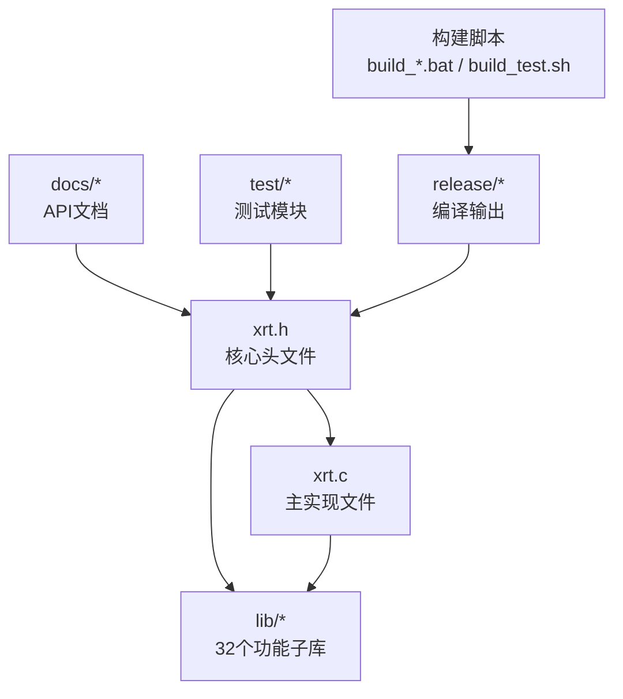
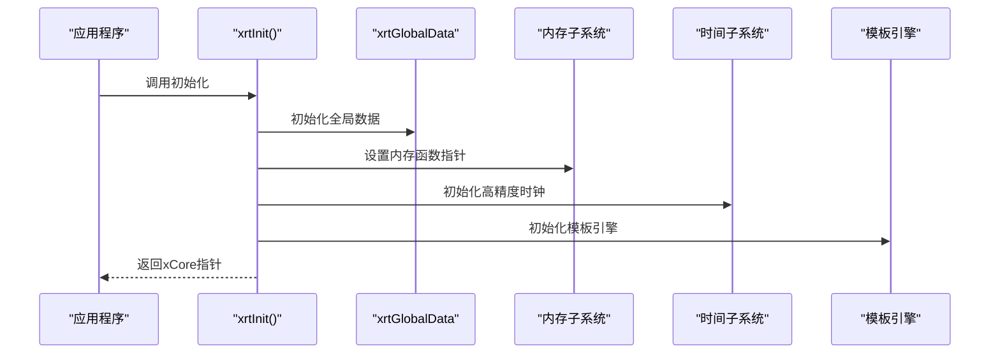
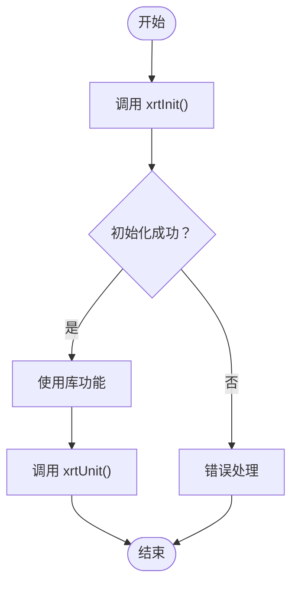
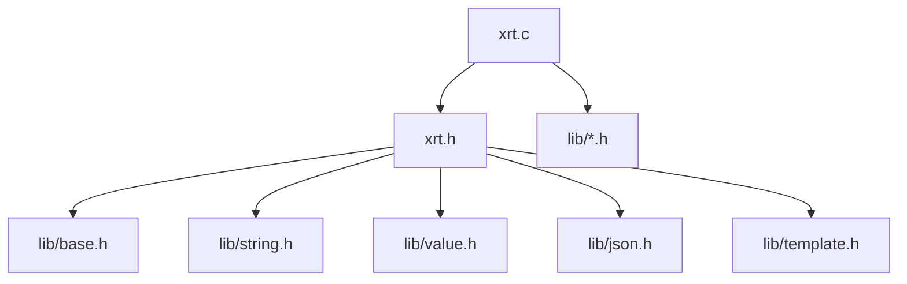

# 快速开始

<cite>
**本文引用的文件**
- [README.md](file://README.md)
- [README.en.md](file://README.en.md)
- [xrt.h](file://xrt.h)
- [xrt.c](file://xrt.c)
- [test.c](file://test.c)
- [build_TCC_TEST_x64.bat](file://build_TCC_TEST_x64.bat)
- [build_GCC_TEST_x64.bat](file://build_GCC_TEST_x64.bat)
- [build_test.sh](file://build_test.sh)
- [docs/api-string.md](file://docs/api-string.md)
- [docs/api-value.md](file://docs/api-value.md)
- [docs/api-json.md](file://docs/api-json.md)
- [docs/api-template.md](file://docs/api-template.md)
- [test/test_string.h](file://test/test_string.h)
- [test/test_value.h](file://test/test_value.h)
- [test/test_json.h](file://test/test_json.h)
- [test/test_template.h](file://test/test_template.h)
</cite>

## 目录
1. [简介](#简介)
2. [项目结构](#项目结构)
3. [核心组件](#核心组件)
4. [架构总览](#架构总览)
5. [详细组件分析](#详细组件分析)
6. [依赖关系分析](#依赖关系分析)
7. [性能考虑](#性能考虑)
8. [故障排查指南](#故障排查指南)
9. [结论](#结论)
10. [附录](#附录)

## 简介
XRT 是一个“轻量级、高性能、功能完备”的 C 语言运行时库，采用单头文件设计，零外部依赖，支持跨平台编译。它提供内存管理、字符集转换、文件处理、数据结构、动态类型系统（Value）、JSON 处理、模板引擎等完整功能链，适合工具类开发、服务端开发、嵌入式开发以及学习用途。

## 项目结构
- 核心头文件与实现：xrt.h（API 声明，2320 行）、xrt.c（主实现，包含所有 lib/*.h）
- 子模块库：lib/ 下的 32 个功能子库（基础、字符串、Value、JSON、模板引擎等）
- 文档：docs/ 下的 33 份 API 文档
- 测试：test/ 下的 31 个测试模块
- 发布产物：release/ 下的 x64/x86 输出
- 构建脚本：Windows 的 build_TCC_*.bat、build_GCC_*.bat；Linux/macOS 的 build_test.sh

图示来源
- [xrt.h](file://xrt.h#L1-L200)
- [xrt.c](file://xrt.c#L42-L84)

章节来源
- [README.md](file://README.md#L355-L398)
- [README.en.md](file://README.en.md#L355-L398)

## 核心组件
- 初始化与清理
  - 初始化：xrtInit()，负责全局数据初始化、内存函数设置、随机数种子、模板引擎初始化等
  - 清理：xrtUnit()，负责模板引擎清理、路径释放、临时内存释放、Socket 清理等
- 内存管理
  - 基础分配：xrtMalloc、xrtCalloc、xrtRealloc、xrtFree
  - 临时内存：xrtTempMemory（32槽位环形自动释放）
- 字符串处理
  - 基础操作：复制、查找、替换、分割、裁剪、格式化、编码转换
  - 高级能力：Base64、HEX 编解码、通配符匹配、相似度计算
- 动态类型系统（Value）
  - 16 种数据类型：Empty/Null/Bool/Int/Float/Text/Time/Point/Func/Array/List/Coll/Table/Struct/Object/Custom
  - 引用计数：xvoAddRef、xvoUnref，自动内存管理
- JSON 处理
  - SAX 模式解析/生成，支持注释、尾逗号、十六进制、特殊浮点数
- 模板引擎
  - 语法：变量替换、条件、循环、子模板、脚本扩展等
- 其他基础设施
  - 字符集转换、时间处理、文件操作、哈希、网络、线程、路径处理等

章节来源
- [xrt.h](file://xrt.h#L188-L227)
- [xrt.c](file://xrt.c#L87-L226)
- [README.md](file://README.md#L435-L535)
- [README.en.md](file://README.en.md#L435-L535)

## 架构总览
XRT 的核心是单头文件 xrt.h，xrt.c 作为实现文件包含所有 lib/*.h 子模块。初始化阶段会设置全局数据结构 xrtGlobalData，并初始化各子系统（内存、时间、模板引擎等）。对外提供统一 API，内部通过模块化子库实现具体功能。

图示来源
- [xrt.c](file://xrt.c#L87-L186)

章节来源
- [xrt.c](file://xrt.c#L42-L84)
- [xrt.h](file://xrt.h#L188-L227)

## 详细组件分析

### 安装与编译（Windows）
- 使用 TCC（推荐用于快速开发）
  - 构建脚本：build_TCC_TEST_x64.bat
  - 作用：使用 TCC 编译 test.c + xrt.c，输出 release/x64/test.exe 并直接运行
- 使用 GCC（推荐用于生产）
  - 构建脚本：build_GCC_TEST_x64.bat
  - 作用：使用 GCC 编译 test.c + xrt.c，链接 Ws2_32、IPHLPAPI，输出 release/x64/test.exe 并直接运行

章节来源
- [README.md](file://README.md#L213-L228)
- [README.en.md](file://README.en.md#L213-L228)
- [build_TCC_TEST_x64.bat](file://build_TCC_TEST_x64.bat#L1-L11)
- [build_GCC_TEST_x64.bat](file://build_GCC_TEST_x64.bat#L1-L11)

### 安装与编译（Linux/macOS）
- 构建脚本：build_test.sh
  - 作用：使用 GCC 编译 test.c + xrt.c，链接优化选项，输出 release/x64/xrt_test 并直接运行

章节来源
- [README.md](file://README.md#L223-L228)
- [README.en.md](file://README.en.md#L223-L228)
- [build_test.sh](file://build_test.sh#L1-L6)

### 基础使用示例（字符串处理）
- 示例目标：展示字符串复制、查找、替换、格式化、时间格式化
- 关键 API：xrtReplace、xrtFormat、xrtTimeToStr、xrtNow、xrtFree
- 编译与运行：使用上述任一构建脚本编译并运行

预期输出（示例）
- 替换后的字符串
- 当前时间字符串

章节来源
- [README.md](file://README.md#L232-L256)
- [README.en.md](file://README.en.md#L232-L256)

### 动态类型系统（Value）示例
- 示例目标：创建数组与表，添加元素，读取值，释放资源
- 关键 API：xvoCreateArray、xvoCreateTable、xvoArrayAppend*、xvoTableSet*、xvoTableGet*、xvoUnref
- 内存管理：Value 使用 26 位引用计数，xvoUnref 归零自动释放

预期输出（示例）
- 读取到的名称字段值

章节来源
- [README.md](file://README.md#L258-L288)
- [README.en.md](file://README.en.md#L258-L288)
- [docs/api-value.md](file://docs/api-value.md#L1094-L1134)

### JSON 处理示例
- 示例目标：解析 JSON 字符串，读取字段，生成格式化 JSON
- 关键 API：xrtParseJSON、xvoTableGet*、xrtStringifyJSON、xrtStringifyJSON_File
- 文件操作：xrtParseJSON_File、xrtStringifyJSON_File

预期输出（示例）
- 项目名称
- 格式化输出的 JSON 字符串

章节来源
- [README.md](file://README.md#L290-L321)
- [README.en.md](file://README.en.md#L290-L321)
- [docs/api-json.md](file://docs/api-json.md#L258-L366)

### 模板引擎示例
- 示例目标：创建模板变量，解析模板，生成输出
- 关键 API：xteParse、xteMake、xteParseFree、xvoCreateTable、xvoTableSet*
- 输出：模板变量替换后的结果

预期输出（示例）
- 模板变量替换后的字符串

章节来源
- [README.md](file://README.md#L323-L351)
- [README.en.md](file://README.en.md#L323-L351)
- [docs/api-template.md](file://docs/api-template.md#L1096-L1159)

### 初始化与清理流程
- 初始化流程
  - 调用 xrtInit()，设置全局数据、内存函数、随机数、模板引擎、应用路径、网络初始化等
- 清理流程
  - 调用 xrtUnit()，模板引擎清理、路径释放、临时内存释放、Socket 清理

图示来源
- [xrt.c](file://xrt.c#L87-L226)

章节来源
- [xrt.c](file://xrt.c#L87-L226)

### 内存管理注意事项
- 基础内存
  - 使用 xrtMalloc/xrtCalloc/xrtRealloc/xrtFree 进行分配与释放
  - 临时内存：xrtTempMemory（32槽位环形自动释放），适合函数内临时返回值
- Value 类型
  - 26 位引用计数，xvoAddRef 增加引用，xvoUnref 减少引用，归零自动释放
  - bColloc 参数决定是否托管子元素释放
- 字符串与文件
  - 返回的字符串、二进制数据、文件内容均需使用 xrtFree 或相应接口释放

章节来源
- [README.md](file://README.md#L435-L443)
- [README.en.md](file://README.en.md#L435-L443)
- [docs/api-value.md](file://docs/api-value.md#L1166-L1188)

## 依赖关系分析
- 模块耦合
  - xrt.c 通过包含 lib/*.h 实现模块化功能
  - xrt.h 定义全局数据结构 xrtGlobalData，贯穿各子系统
- 外部依赖
  - 标准 C 库（stdio、stdlib、string、time、math、windows.h 等）
  - Windows 平台：Winsock2、IPHLPAPI、ShellAPI
  - Linux/macOS：sys/socket、netdb、dirent、sys/wait、errno 等

图示来源
- [xrt.c](file://xrt.c#L54-L84)
- [xrt.h](file://xrt.h#L1-L120)

章节来源
- [xrt.c](file://xrt.c#L8-L38)

## 性能考虑
- 内存池架构：二叉树索引的固定大小内存块（FSB），分配时间复杂度 O(log n)
- 高效哈希算法：32位使用 nmhash32x，64位使用 rapidhash
- AVL 平衡树：字典和集合采用 AVL 树实现，查找/插入/删除均为 O(log n)
- 内联函数优化：关键路径提供 Inline 版本，减少函数调用开销
- PCG 随机数：高质量伪随机数生成，支持 32/64 位
- 256 元素内存页：内存管理单元采用 256 元素/页设计，快速分配和释放

## 故障排查指南
- 构建失败（Windows）
  - TCC：确认已安装 TCC，使用 build_TCC_TEST_x64.bat
  - GCC：确认已安装 MinGW-w64，使用 build_GCC_TEST_x64.bat
- 构建失败（Linux/macOS）
  - 使用 build_test.sh，确认 GCC 可用
- 运行测试
  - Windows：进入 release/x64，双击 test.exe 或在脚本中运行
  - Linux/macOS：./release/x64/xrt_test
- 常见问题
  - 内存泄漏：确保使用 xrtFree 释放字符串、二进制数据；使用 xvoUnref 释放 Value；使用 xteParseFree 释放模板对象
  - 字符串编码：使用 xrtConvCharset、xrtUTF8to16、xrtUTF16to8 等进行编码转换
  - JSON 解析：确认输入格式正确，支持注释、尾逗号、十六进制、特殊浮点数

章节来源
- [README.md](file://README.md#L667-L679)
- [README.en.md](file://README.en.md#L667-L679)
- [test.c](file://test.c#L54-L179)

## 结论
通过本快速开始指南，您可以在 30 分钟内完成 XRT 的环境搭建与首次运行。建议优先使用 TCC 进行快速开发验证，再切换到 GCC 进行生产构建。结合 Value、JSON、模板引擎三大核心功能，您可以快速实现字符串处理、动态数据结构与内容生成等常见需求。

## 附录

### API 快速参考
- 内存管理
  - xrtMalloc、xrtCalloc、xrtRealloc、xrtFree、xrtTempMemory、xrtFreeTempMemory
- 字符串处理
  - xrtCopyStr、xrtFindStr、xrtReplace、xrtSplit、xrtFormat、xrtTrim、xrtBase64Encode/Decode
- 时间处理
  - xrtNow、xrtTimeToStr、xrtDateAdd、xrtDateDiff、xrtWeekOfYear 等
- Value 类型
  - xvoCreate*、xvoArray*、xvoList*、xvoColl*、xvoTable*、xvoAddRef、xvoUnref
- JSON 处理
  - xrtParseJSON、xrtParseJSON_File、xrtStringifyJSON、xrtStringifyJSON_File
- 模板引擎
  - xteParse、xteMake、xteParseFree、xteExprEvalBool、xteResolvePath

章节来源
- [README.md](file://README.md#L435-L535)
- [README.en.md](file://README.en.md#L435-L535)