# 架构概览

<cite>
**本文档引用的文件**
- [xrt.h](file://xrt.h)
- [xrt.c](file://xrt.c)
- [README.md](file://README.md)
- [lib/base.h](file://lib/base.h)
- [lib/charset.h](file://lib/charset.h)
- [lib/string.h](file://lib/string.h)
- [lib/array.h](file://lib/array.h)
- [lib/value.h](file://lib/value.h)
- [lib/json.h](file://lib/json.h)
- [lib/template.h](file://lib/template.h)
- [lib/network.h](file://lib/network.h)
- [lib/mempool.h](file://lib/mempool.h)
- [lib/suplib.h](file://lib/suplib.h)
- [dev/net/xrt_net.h](file://dev/net/xrt_net.h)
- [dev/net/xrt_net_platform.c](file://dev/net/xrt_net_platform.c)
- [dev/net/xrt_net_platform.h](file://dev/net/xrt_net_platform.h)
</cite>

## 目录
1. [简介](#简介)
2. [项目结构](#项目结构)
3. [核心组件](#核心组件)
4. [架构总览](#架构总览)
5. [详细组件分析](#详细组件分析)
6. [依赖关系分析](#依赖关系分析)
7. [性能考量](#性能考量)
8. [故障排查指南](#故障排查指南)
9. [结论](#结论)

## 简介
XRT 是一个面向 C 语言的现代化运行时库，采用“单头文件设计”和“模块化子库”的架构，提供跨平台的基础设施能力。项目包含 32 个功能模块，覆盖内存管理、字符集转换、文件系统、数据结构、动态类型系统、JSON 处理、模板引擎等完整功能链，并通过统一的 API 接口对外暴露。

## 项目结构
XRT 的核心由一个主头文件和一个主实现文件组成，同时包含 32 个功能模块的头文件，以及配套的 API 文档与测试用例。其结构如下：

- 主头文件：集中声明所有 API，提供统一的使用入口
- 主实现文件：包含所有 lib 子模块头文件，完成模块装配与初始化
- lib 子模块：按功能域划分的 32 个独立模块头文件
- docs 文档：各模块的 API 文档与类型说明
- dev 网络抽象：网络子系统的跨平台抽象与实现
- test 测试：覆盖基础功能、数据结构、内存管理、高级功能等模块的测试

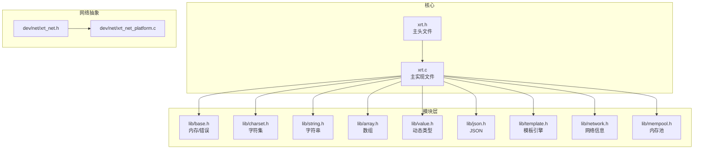

**图表来源**
- [xrt.h](file://xrt.h#L1-L2740)
- [xrt.c](file://xrt.c#L54-L84)
- [lib/base.h](file://lib/base.h#L1-L132)
- [lib/charset.h](file://lib/charset.h#L1-L200)
- [lib/string.h](file://lib/string.h#L1-L200)
- [lib/array.h](file://lib/array.h#L1-L180)
- [lib/value.h](file://lib/value.h#L1-L200)
- [lib/json.h](file://lib/json.h#L1-L200)
- [lib/template.h](file://lib/template.h#L1-L200)
- [lib/network.h](file://lib/network.h#L1-L200)
- [lib/mempool.h](file://lib/mempool.h#L1-L200)
- [dev/net/xrt_net.h](file://dev/net/xrt_net.h#L1-L14)
- [dev/net/xrt_net_platform.c](file://dev/net/xrt_net_platform.c#L1-L67)

**章节来源**
- [README.md](file://README.md#L355-L398)
- [xrt.c](file://xrt.c#L54-L84)

## 核心组件
XRT 的核心组件围绕“单头文件 + 模块化子库”的设计展开，主要职责如下：

- 单头文件（xrt.h）：集中声明所有 API，提供全局数据结构、初始化/清理流程、跨平台宏与类型定义
- 主实现文件（xrt.c）：包含所有子模块头文件，完成模块装配、全局初始化（含内存函数、时钟频率、随机数、模板引擎等）
- 模块化子库（lib/*.h）：按功能域拆分，每个模块独立实现特定能力，通过统一的 API 前缀与命名规范对外暴露
- 网络抽象（dev/net）：提供跨平台网络抽象，屏蔽 Windows 与类 Unix 的差异

**章节来源**
- [xrt.h](file://xrt.h#L48-L193)
- [xrt.c](file://xrt.c#L54-L186)
- [lib/suplib.h](file://lib/suplib.h#L1-L55)

## 架构总览
XRT 的整体架构采用“单头文件 + 多模块子库”的组合模式，配合跨平台抽象层与统一的命名规范，形成清晰的层次化设计：

- 基础设施层：提供内存管理、字符集转换、数学与随机数、时间处理等基础能力
- 系统交互层：封装操作系统相关能力，如文件系统、路径处理、线程与网络信息
- 字符串处理层：提供字符串操作、数字转换与模板引擎
- 数据结构层：提供缓冲区、数组、栈、链表、平衡树、字典与列表等数据结构
- 内存管理层：提供块结构内存管理、内存单元管理、固定大小内存池与通用内存池
- 高级功能层：动态类型系统、JSON 处理与分布式 ID 生成

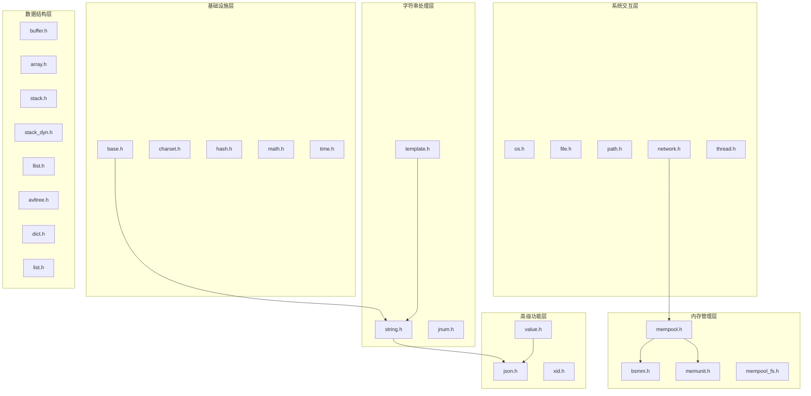

**图表来源**
- [README.md](file://README.md#L72-L133)
- [xrt.c](file://xrt.c#L54-L84)

## 详细组件分析

### 单头文件设计与模块装配
- 单头文件（xrt.h）集中声明所有 API，包含基本类型、全局数据结构、初始化/清理函数、模块 API 前缀与常量等
- 主实现文件（xrt.c）通过包含 lib/*.h 完成模块装配，并在初始化阶段完成全局状态的构建（内存函数、时钟频率、随机数、模板引擎等）

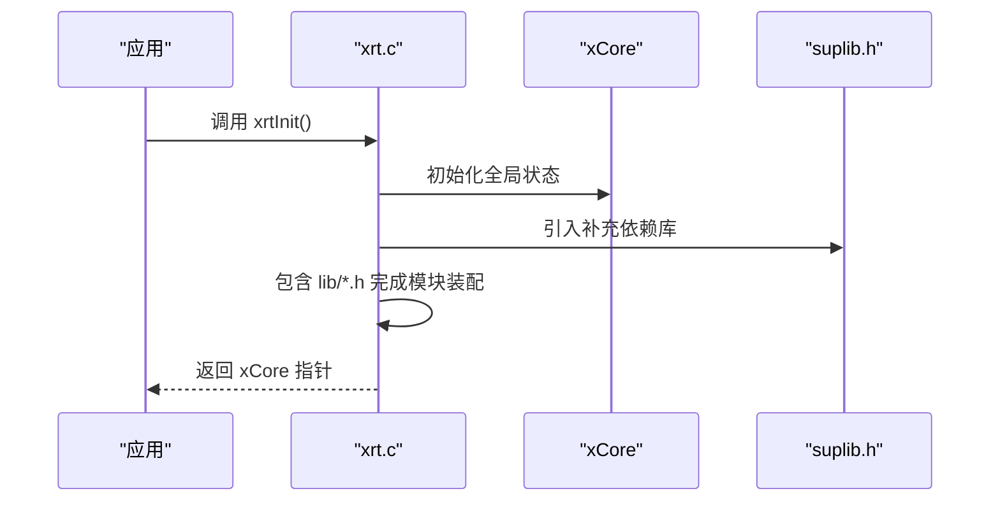

**图表来源**
- [xrt.c](file://xrt.c#L87-L186)
- [lib/suplib.h](file://lib/suplib.h#L1-L55)

**章节来源**
- [xrt.h](file://xrt.h#L48-L193)
- [xrt.c](file://xrt.c#L54-L186)

### 跨平台抽象层（网络）
XRT 的网络模块通过 dev/net 提供跨平台抽象，屏蔽 Windows 与类 Unix 的差异：

- 抽象头文件（xrt_net.h）：聚合网络相关头文件，提供统一的初始化/清理接口
- 平台适配（xrt_net_platform.*）：封装 socket 创建、关闭、非阻塞设置、地址绑定等平台差异
- 网络信息（lib/network.h）：提供本机 IP/MAC 获取等通用网络信息查询

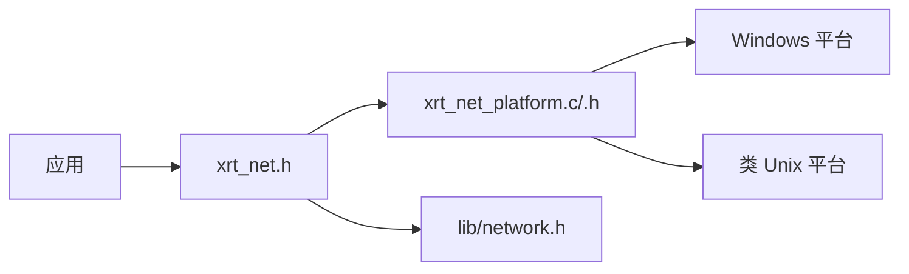

**图表来源**
- [dev/net/xrt_net.h](file://dev/net/xrt_net.h#L1-L14)
- [dev/net/xrt_net_platform.c](file://dev/net/xrt_net_platform.c#L1-L67)
- [dev/net/xrt_net_platform.h](file://dev/net/xrt_net_platform.h#L1-L35)
- [lib/network.h](file://lib/network.h#L1-L200)

**章节来源**
- [dev/net/xrt_net.h](file://dev/net/xrt_net.h#L1-L14)
- [dev/net/xrt_net_platform.c](file://dev/net/xrt_net_platform.c#L9-L36)
- [lib/network.h](file://lib/network.h#L4-L70)

### 基础设施层（base、charset、hash、math、time）
- base：提供内存分配/释放、临时内存环、错误处理等基础能力
- charset：提供 UTF-8/16/32 互转、编码检测、BOM 处理等字符集转换能力
- math：提供 PCG 随机数生成、近似比较等数学与随机数能力
- time：提供高精度计时、时间解析/格式化、时间区间计算等时间处理能力

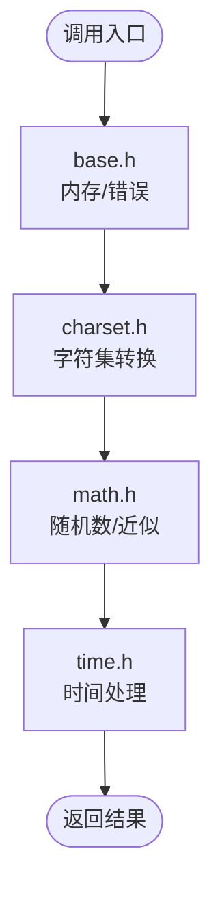

**图表来源**
- [lib/base.h](file://lib/base.h#L4-L132)
- [lib/charset.h](file://lib/charset.h#L18-L156)
- [lib/string.h](file://lib/string.h#L50-L114)
- [lib/array.h](file://lib/array.h#L152-L166)

**章节来源**
- [lib/base.h](file://lib/base.h#L4-L132)
- [lib/charset.h](file://lib/charset.h#L18-L156)
- [lib/string.h](file://lib/string.h#L50-L114)
- [lib/array.h](file://lib/array.h#L152-L166)

### 系统交互层（os、file、path、network、thread）
- os：提供进程启动、文件打开、链式调用等系统操作
- file：提供文件打开/读写、路径存在性判断、目录扫描/创建/复制/移动/删除等文件系统操作
- path：提供路径拼接、文件名/扩展名/目录提取、绝对路径判断等路径处理
- network：提供本机 IP/MAC 获取、主机名解析等网络信息查询
- thread：提供线程创建、互斥体、信号量等线程同步原语

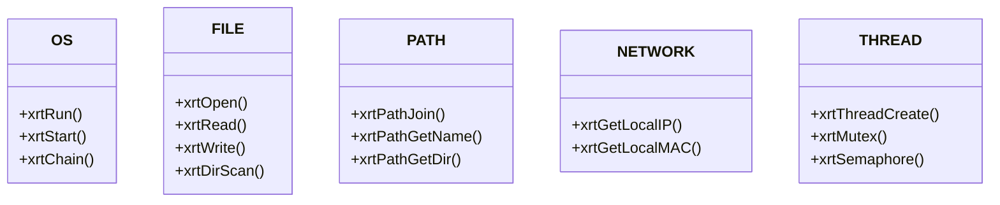

**图表来源**
- [lib/network.h](file://lib/network.h#L4-L139)
- [lib/string.h](file://lib/string.h#L1-L200)
- [lib/array.h](file://lib/array.h#L1-L180)

**章节来源**
- [lib/network.h](file://lib/network.h#L4-L139)
- [lib/string.h](file://lib/string.h#L1-L200)
- [lib/array.h](file://lib/array.h#L1-L180)

### 字符串处理层（string、jnum、template）
- string：提供字符串复制、比较、大小写转换、查找/替换/分割、格式化、Base64/HEX 编解码等
- jnum：提供高性能数字解析与格式化（支持十六进制等）
- template：提供完整的模板语法（变量替换、条件、循环、子模板、脚本扩展等）

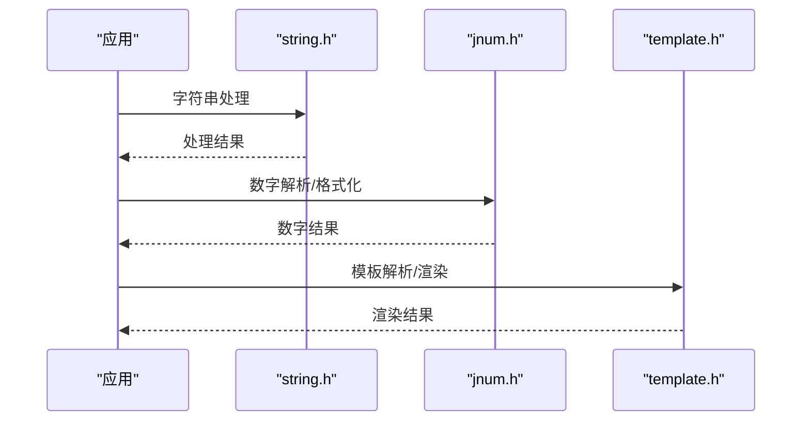

**图表来源**
- [lib/string.h](file://lib/string.h#L4-L200)
- [lib/json.h](file://lib/json.h#L190-L200)
- [lib/template.h](file://lib/template.h#L1-L200)

**章节来源**
- [lib/string.h](file://lib/string.h#L4-L200)
- [lib/json.h](file://lib/json.h#L190-L200)
- [lib/template.h](file://lib/template.h#L1-L200)

### 数据结构层（buffer、array、stack、llist、avltree、dict、list）
- buffer：动态缓冲区，支持自动扩容与预分配
- array：结构体数组，支持步进扩容、排序、交换
- stack/dynstack：静态/动态栈，支持固定/自动扩容
- llist：双向链表，内置内存池，支持 O(1) 插入/删除
- avltree：AVL 平衡树，支持父子树关联与节点缓存
- dict：字典（字符串键值对），基于 AVL 树 + 内存池
- list：列表（整数索引），基于 AVL 树实现稀疏存储

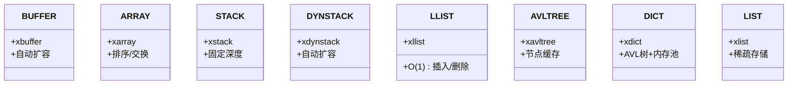

**图表来源**
- [lib/array.h](file://lib/array.h#L4-L180)
- [lib/string.h](file://lib/string.h#L1-L200)
- [lib/value.h](file://lib/value.h#L1-L200)

**章节来源**
- [lib/array.h](file://lib/array.h#L4-L180)
- [lib/string.h](file://lib/string.h#L1-L200)
- [lib/value.h](file://lib/value.h#L1-L200)

### 内存管理层（bsmm、memunit、mempool_fs、mempool）
- bsmm：块结构内存管理，256 元素/页，释放链表复用
- memunit：内存单元管理，256 字节页，支持 GC 标记回收
- mempool_fs：固定大小内存池，空闲/满载链表分组
- mempool：通用内存池，二叉树索引 FSB，支持 15/31 级分块

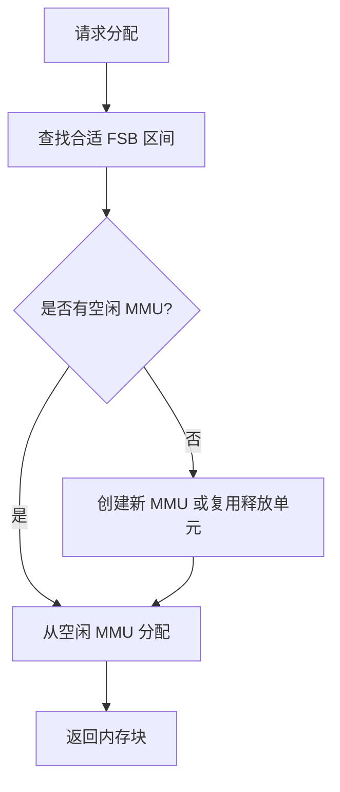

**图表来源**
- [lib/mempool.h](file://lib/mempool.h#L147-L200)

**章节来源**
- [lib/mempool.h](file://lib/mempool.h#L4-L200)

### 高级功能层（value、json、xid）
- value：16 种动态类型，26 位引用计数，支持集合运算、父子关联、深浅拷贝
- json：SAX 模式解析/生成，支持注释、尾逗号、十六进制、特殊浮点数
- xid：192 位分布式 ID，时间戳 + IP + CPU 时钟 + 随机数组合

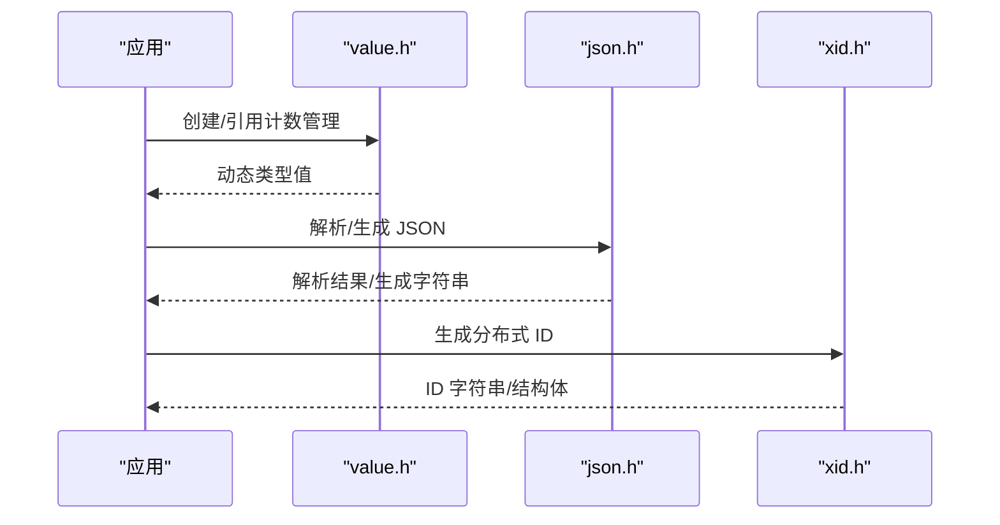

**图表来源**
- [lib/value.h](file://lib/value.h#L32-L96)
- [lib/json.h](file://lib/json.h#L1-L200)
- [lib/string.h](file://lib/string.h#L1-L200)

**章节来源**
- [lib/value.h](file://lib/value.h#L32-L96)
- [lib/json.h](file://lib/json.h#L1-L200)
- [lib/string.h](file://lib/string.h#L1-L200)

## 依赖关系分析
XRT 的模块依赖遵循“低耦合、高内聚”的原则，通过统一的 API 前缀与命名规范降低模块间的耦合度。总体依赖关系如下：

- 基础设施层为其他模块提供底层支撑（内存、字符集、数学、时间）
- 字符串处理层与数据结构层相互协作，字符串处理为 JSON 与模板引擎提供基础能力
- 内存管理层为所有需要频繁分配/释放的模块提供高性能内存支持
- 网络抽象层为系统交互层提供跨平台能力

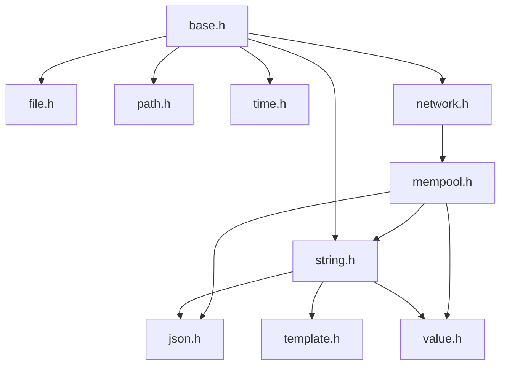

**图表来源**
- [xrt.c](file://xrt.c#L54-L84)
- [lib/mempool.h](file://lib/mempool.h#L1-L200)
- [lib/json.h](file://lib/json.h#L1-L200)
- [lib/value.h](file://lib/value.h#L1-L200)

**章节来源**
- [xrt.c](file://xrt.c#L54-L84)

## 性能考量
- 多级内存池架构：二叉树索引的固定大小内存块（FSB），分配时间复杂度 O(log n)
- 高效哈希算法：32 位使用 nmhash32x，64 位使用 rapidhash
- AVL 平衡树：字典与集合采用 AVL 树实现，查找/插入/删除均为 O(log n)
- 内联函数优化：关键路径提供 Inline 版本，减少函数调用开销
- PCG 随机数：使用 PCG 算法生成高质量伪随机数，支持 32/64 位
- 256 元素内存页：内存管理单元采用 256 元素/页设计，快速分配和释放

## 故障排查指南
- 错误处理：通过全局错误回调与错误字符串记录，定位问题来源
- 临时内存：32 槽位环形自动释放，避免临时内存泄漏
- 内存池：检查内存池初始化参数与分配策略，确保满足业务需求
- 网络模块：确认平台初始化与 socket 创建是否成功，注意非阻塞与地址绑定设置

**章节来源**
- [lib/base.h](file://lib/base.h#L88-L132)
- [lib/mempool.h](file://lib/mempool.h#L35-L145)
- [dev/net/xrt_net_platform.c](file://dev/net/xrt_net_platform.c#L9-L36)

## 结论
XRT 通过“单头文件 + 模块化子库”的设计，结合跨平台抽象层与统一的命名规范，形成了清晰、可扩展且高性能的 C 语言运行时库架构。其 32 个功能模块覆盖了从基础设施到高级功能的完整能力链，既适合工具类开发，也适用于服务端与嵌入式场景。开发者可通过统一的 API 入口快速集成所需功能，并借助模块化的组织方式按需裁剪与扩展。