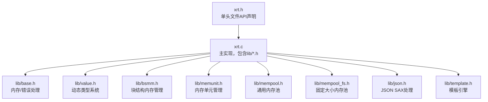
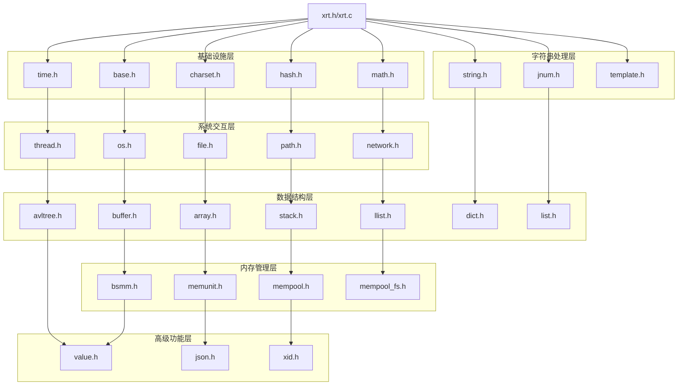
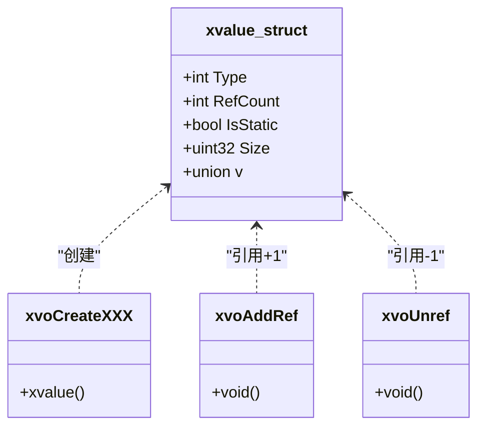
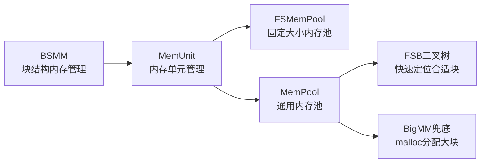
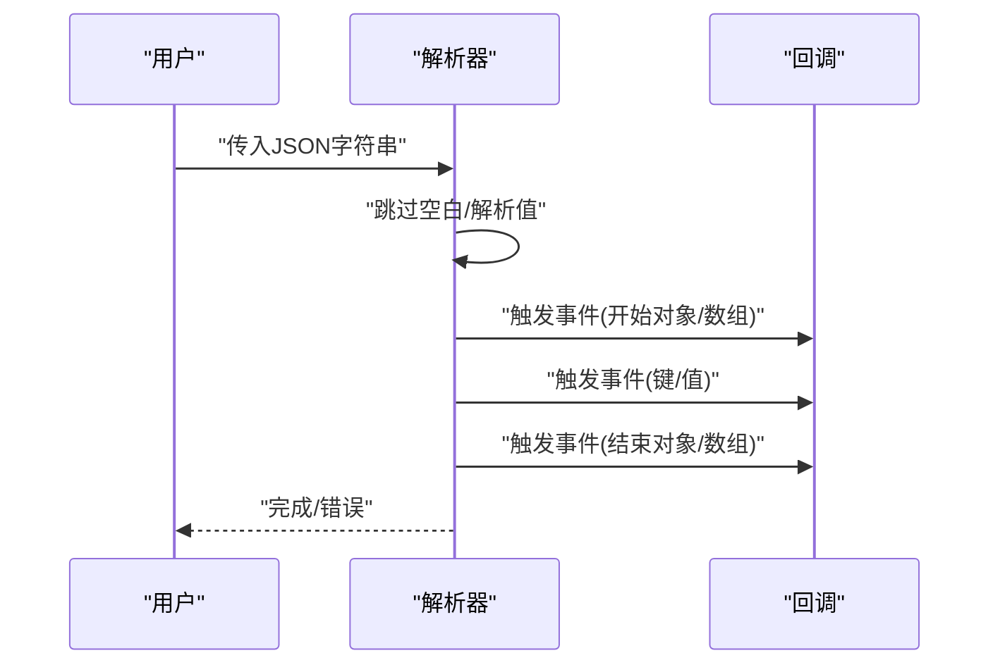
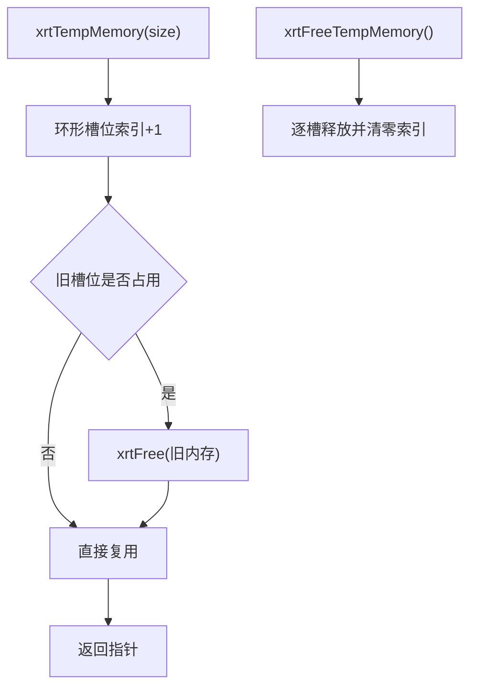
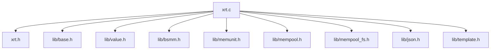

# 核心特性

<cite>
**本文引用的文件**
- [xrt.h](file://xrt.h)
- [xrt.c](file://xrt.c)
- [lib/base.h](file://lib/base.h)
- [lib/value.h](file://lib/value.h)
- [lib/bsmm.h](file://lib/bsmm.h)
- [lib/memunit.h](file://lib/memunit.h)
- [lib/mempool.h](file://lib/mempool.h)
- [lib/mempool_fs.h](file://lib/mempool_fs.h)
- [lib/json.h](file://lib/json.h)
- [lib/template.h](file://lib/template.h)
- [README.md](file://README.md)
- [README.en.md](file://README.en.md)
- [docs/api-mempool.md](file://docs/api-mempool.md)
</cite>

## 目录
1. [引言](#引言)
2. [项目结构](#项目结构)
3. [核心组件](#核心组件)
4. [架构总览](#架构总览)
5. [详细组件分析](#详细组件分析)
6. [依赖关系分析](#依赖关系分析)
7. [性能考量](#性能考量)
8. [故障排查指南](#故障排查指南)
9. [结论](#结论)
10. [附录](#附录)

## 引言
本文件围绕 XRT 项目的八大核心特性展开，系统阐述其设计理念、实现原理、性能优势与典型使用场景，并结合源码路径给出可追溯的“章节来源”和“图表来源”。读者可据此快速理解 XRT 在零依赖、单头文件、32 模块化子库、全平台支持、四大编译器兼容、极致性能优化、16 种动态类型、智能内存管理等方面的工程价值。

## 项目结构
XRT 采用“单头文件 + 32 个子库”的组织方式：
- 单头文件统一暴露 API：xrt.h（2320 行声明）
- 主实现文件引入并组合各子库：xrt.c
- 子库按功能拆分：基础、字符集、字符串、时间、文件、网络、线程、数据结构、内存管理、动态类型、JSON、模板引擎等
- 文档与测试配套完善：docs/ 与 test/



**图表来源**
- [xrt.c](file://xrt.c#L54-L84)
- [xrt.h](file://xrt.h#L1-L120)

**章节来源**
- [README.md](file://README.md#L23-L44)
- [README.en.md](file://README.en.md#L357-L443)

## 核心组件
- 零依赖设计：除标准 C 库外无外部依赖，跨平台编译无需额外配置
- 单头文件架构：xrt.h 统一声明，xrt.c 组合子库，引入即用
- 32 模块化子库：功能解耦，按需使用，最小化体积
- 全平台支持：Windows/Linux/macOS，x86/x64/ARM64
- 四大编译器兼容：TCC/GCC/Clang/MSVC
- 极致性能优化：多级内存池、26 位引用计数、内联优化、二叉树索引
- 16 种动态类型：Empty/Null/Bool/Int/Float/Text/Time/Point/Func/Array/List/Coll/Table/Struct/Object/Custom
- 智能内存管理：32 槽位环形临时内存、GC 标记回收、多层次内存池

**章节来源**
- [README.md](file://README.md#L29-L41)
- [README.en.md](file://README.en.md#L404-L428)

## 架构总览
XRT 的整体架构由“基础设施层（基础/字符集/哈希/数学/时间）+ 系统交互层（OS/文件/路径/网络/线程）+ 字符串处理层（字符串/JNUM/模板）+ 数据结构层（缓冲区/数组/栈/链表/AVL/字典/列表）+ 内存管理层（BSMM/MemUnit/MemPool/FSMemPool）+ 高级功能层（Value/JSON/XID）”构成。



**图表来源**
- [README.md](file://README.md#L72-L134)
- [xrt.c](file://xrt.c#L54-L84)

**章节来源**
- [README.md](file://README.md#L72-L134)

## 详细组件分析

### 动态类型系统（16 种数据类型、26 位引用计数、GC 标记回收）
- 数据类型覆盖：Empty/Null/Bool/Int/Float/Text/Time/Point/Func/Array/List/Coll/Table/Struct/Object/Custom
- 引用计数：xvalue 结构体包含 26 位引用计数字段，超过阈值自动转为静态值，避免溢出
- 生命周期管理：xvoAddRef/xvoUnref 实现自动释放；集合支持差集/交集/并集/对称差集
- 输出与调试：xvoPrintValue 支持完整结构输出，便于调试
- 深浅拷贝：xvoCopy/xvoDeepCopy 支持不同复制策略



**图表来源**
- [lib/value.h](file://lib/value.h#L32-L96)
- [lib/value.h](file://lib/value.h#L100-L316)
- [lib/value.h](file://lib/value.h#L861-L894)

**章节来源**
- [lib/value.h](file://lib/value.h#L32-L96)
- [lib/value.h](file://lib/value.h#L100-L316)
- [lib/value.h](file://lib/value.h#L861-L894)
- [README.md](file://README.md#L137-L157)

### 多级内存池架构（BSMM、MemUnit、FSMemPool、MemPool）
- BSMM（块结构内存管理）：固定大小结构体分配，256 元素/页，释放链表复用
- MemUnit（内存单元管理）：256 元素/页的内存页，支持 GC 标记位，快速批量回收
- FSMemPool（固定大小内存池）：空闲/满载链表分组，智能选择分配单元
- MemPool（通用内存池）：二叉树索引 FSB，支持 15/31 级分块，超范围使用 malloc



**图表来源**
- [lib/bsmm.h](file://lib/bsmm.h#L24-L49)
- [lib/memunit.h](file://lib/memunit.h#L5-L18)
- [lib/mempool_fs.h](file://lib/mempool_fs.h#L24-L49)
- [lib/mempool.h](file://lib/mempool.h#L35-L119)

**章节来源**
- [lib/bsmm.h](file://lib/bsmm.h#L24-L49)
- [lib/memunit.h](file://lib/memunit.h#L5-L18)
- [lib/mempool_fs.h](file://lib/mempool_fs.h#L24-L49)
- [lib/mempool.h](file://lib/mempool.h#L35-L119)
- [docs/api-mempool.md](file://docs/api-mempool.md#L22-L34)

### 企业级模板引擎（完整语法支持）
- 语法覆盖：变量替换、数字/时间格式化、布尔三元、数组迭代、函数调用、子模板、注释、条件/循环/脚本/包含
- 词法解析：支持花括号/方括号等符号，转义规则明确，错误定位精确
- 路径解析：支持 a.b.c、arr[0]、obj["key"] 等组合访问

```mermaid
flowchart TD
Start(["开始解析"]) --> ModeText["文本模式采集"]
ModeText --> Detect["检测模板符号"]
Detect --> |{{| Block["转义处理"]
Detect --> |{!| Comment["注释模式"]
Detect --> |{$| Var["变量模式"]
Detect --> |{%| Num["数字模式"]
Detect --> |{&| Time["时间模式"]
Detect --> |{?| Bool["布尔模式"]
Detect --> |{*| Arr["数组模式"]
Detect --> |{=| Sub["子模板模式"]
Detect --> |{#| Symbol["指令模式"]
Comment --> End(["结束"])
Var --> End
Num --> End
Time --> End
Bool --> End
Arr --> End
Sub --> End
Symbol --> End
```

**图表来源**
- [lib/template.h](file://lib/template.h#L240-L587)

**章节来源**
- [lib/template.h](file://lib/template.h#L15-L56)
- [lib/template.h](file://lib/template.h#L240-L587)
- [README.md](file://README.md#L159-L183)

### JSON SAX 模式处理
- SAX 解析：事件驱动，低内存占用，支持注释、尾逗号、十六进制、特殊浮点数、单值 JSON
- SAX 生成：增量式写入，智能扩容，格式化/压缩输出，跨平台换行处理
- 内存池：块内存节点管理，统一申请统一释放，提升小 JSON 频繁解析性能



**图表来源**
- [lib/json.h](file://lib/json.h#L219-L236)
- [lib/json.h](file://lib/json.h#L562-L740)

**章节来源**
- [lib/json.h](file://lib/json.h#L80-L136)
- [lib/json.h](file://lib/json.h#L562-L740)
- [README.md](file://README.md#L184-L198)

### 智能内存管理（32 槽位环形临时内存、GC 标记回收）
- 环形临时内存：xrtTempMemory 申请，xrtFreeTempMemory 一键释放，避免临时内存泄漏
- GC 标记回收：MemUnit/MemPool 支持标记-清除，按需回收未标记内存
- 错误处理：xrtSetError/xrtClearError 提供统一错误上报与清理



**图表来源**
- [lib/base.h](file://lib/base.h#L49-L84)

**章节来源**
- [lib/base.h](file://lib/base.h#L49-L84)
- [lib/mempool.h](file://lib/mempool.h#L387-L465)
- [lib/memunit.h](file://lib/memunit.h#L88-L140)

### 零依赖与单头文件架构
- 零依赖：除标准 C 库外无外部依赖，跨平台编译无需额外配置
- 单头文件：xrt.h 统一声明，xrt.c 通过包含 lib/*.h 组合子库，引入即用

**章节来源**
- [README.md](file://README.md#L29-L33)
- [xrt.c](file://xrt.c#L54-L84)

### 全平台支持与四大编译器兼容
- 平台：Windows/Linux/macOS，x86/x64/ARM64
- 编译器：TCC（毫秒级编译）、GCC、Clang、MSVC

**章节来源**
- [README.md](file://README.md#L404-L428)
- [README.en.md](file://README.en.md#L404-L428)

## 依赖关系分析
XRT 的依赖关系以 xrt.c 为核心，向上依赖 xrt.h 的全局数据与 API 声明，向下组合 32 个子库模块。子库之间按功能耦合度较低，形成清晰的层次化依赖。



**图表来源**
- [xrt.c](file://xrt.c#L54-L84)
- [xrt.h](file://xrt.h#L183-L185)

**章节来源**
- [xrt.c](file://xrt.c#L54-L84)

## 性能考量
- 内存池架构：FSB 二叉树索引，分配时间复杂度 O(log n)，256 元素/页减少碎片
- 高效哈希：nmhash32x（32 位）+ rapidhash（64 位），BSD-2 协议
- 平衡树：AVL 树实现字典/集合，查找/插入/删除 O(log n)
- 内联优化：关键路径提供 Inline 版本，消除函数调用开销
- 随机数：PCG 算法，支持 32/64 位高质量伪随机数
- 临时内存：32 槽位环形自动释放，避免临时内存泄漏

**章节来源**
- [README.md](file://README.md#L61-L69)

## 故障排查指南
- 错误设置与清理：xrtSetError/xrtClearError 提供统一错误上报与清理
- 内存池异常：MemPool/FSMemPool 提供错误信息与边界检查，避免非法释放
- 动态类型越界：引用计数溢出自动降级为静态值，避免崩溃
- 模板语法错误：词法解析器提供精确的行列定位与错误描述

**章节来源**
- [lib/base.h](file://lib/base.h#L88-L132)
- [lib/mempool.h](file://lib/mempool.h#L335-L385)
- [lib/mempool_fs.h](file://lib/mempool_fs.h#L199-L221)
- [lib/template.h](file://lib/template.h#L209-L237)

## 结论
XRT 通过“单头文件 + 32 模块化子库”的架构，在零依赖、全平台、四大编译器兼容的前提下，提供了从基础设施到高级功能的完整能力矩阵。其动态类型系统、多级内存池、SAX 模式 JSON 处理与企业级模板引擎，共同构成了面向生产的高性能运行时库。开发者可按需引入子库，获得接近现代高级语言的开发体验，同时保持 C 语言的性能与可控性。

## 附录
- API 文档入口：docs/README.md
- 测试入口：test.c
- 构建脚本：build_TCC_*.bat、build_GCC_*.bat、build*.sh

**章节来源**
- [README.md](file://README.md#L431-L443)
- [README.en.md](file://README.en.md#L431-L443)