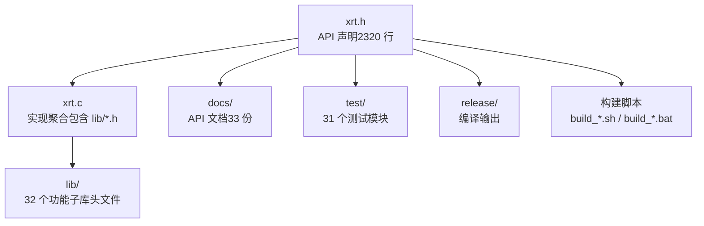
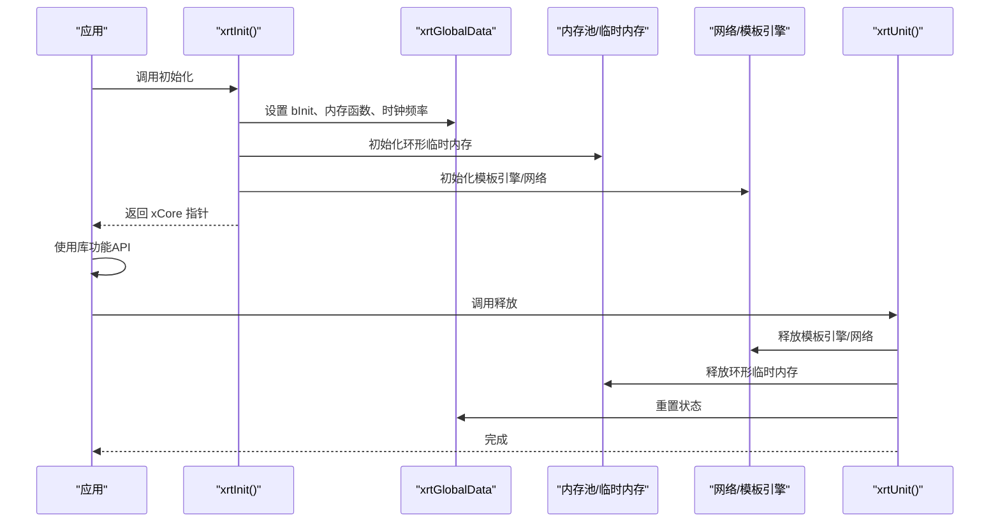
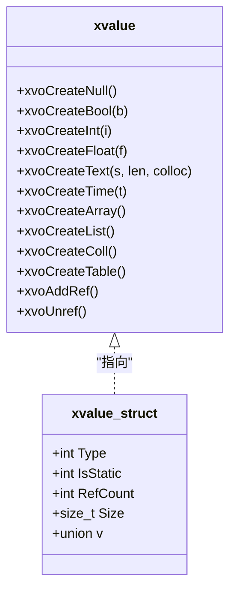
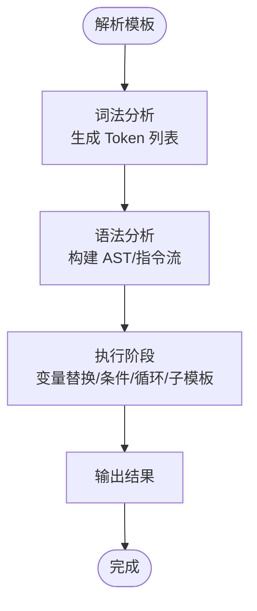
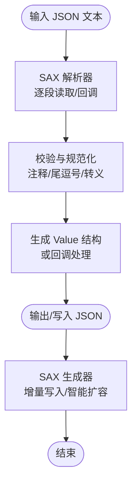
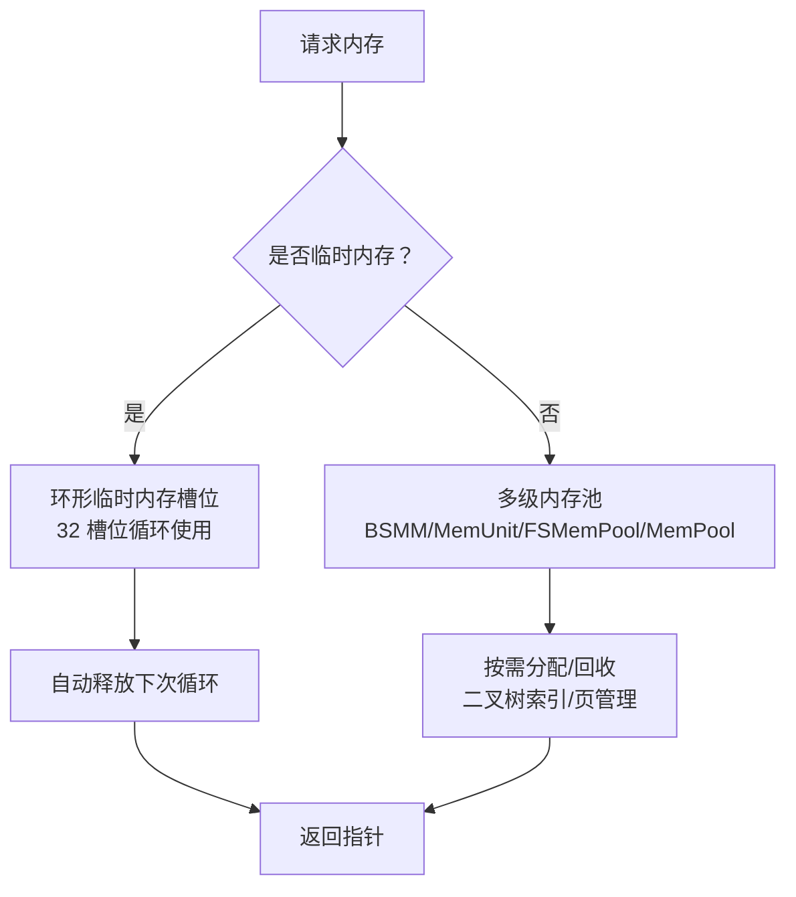
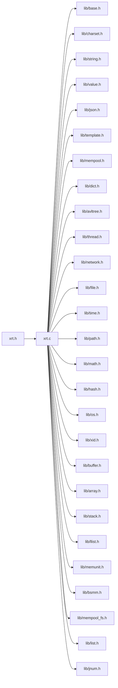

# 项目概述

<cite>
**本文引用的文件**
- [README.md](file://README.md)
- [README.en.md](file://README.en.md)
- [xrt.h](file://xrt.h)
- [xrt.c](file://xrt.c)
- [test.c](file://test.c)
- [lib/value.h](file://lib/value.h)
- [lib/json.h](file://lib/json.h)
- [lib/template.h](file://lib/template.h)
- [docs/README.md](file://docs/README.md)
- [build_test.sh](file://build_test.sh)
- [build_TCC_TEST_x64.bat](file://build_TCC_TEST_x64.bat)
</cite>

## 目录
1. [简介](#简介)
2. [项目结构](#项目结构)
3. [核心组件](#核心组件)
4. [架构总览](#架构总览)
5. [详细组件分析](#详细组件分析)
6. [依赖关系分析](#依赖关系分析)
7. [性能考量](#性能考量)
8. [故障排查指南](#故障排查指南)
9. [结论](#结论)
10. [附录](#附录)

## 简介
XRT（X Runtime Library）是一个轻量、高性能、功能完备的 C 语言运行时库。它以“单头文件 + 零外部依赖”的方式提供现代化的基础设施能力，覆盖内存管理、字符集转换、文件与路径处理、时间日期、数据结构、动态类型系统、JSON 处理、模板引擎、网络与线程等完整功能链。项目包含 32 个功能模块、2320 行 API 声明、31 个测试模块与 33 份 API 文档，并支持 Windows、Linux、macOS 三大平台以及 TCC、GCC、Clang、MSVC 四大编译器。

XRT 的设计理念在于：
- 以“单头文件”降低集成成本，引入即用；
- 以“模块化子库”实现功能解耦与按需使用；
- 以“零外部依赖”简化部署与跨平台移植；
- 以“高性能内存管理”与“内联优化”提升运行效率；
- 以“动态类型系统”“模板引擎”“JSON 处理”等高级能力，让 C 语言具备接近现代高级语言的开发体验。

## 项目结构
XRT 采用“主头文件 + 实现聚合 + 子库模块 + 文档 + 测试 + 构建脚本”的组织方式。核心入口为 xrt.h（API 声明）与 xrt.c（包含所有子库），并通过 docs/ 提供详尽 API 文档，test/ 提供 31 个测试模块，release/ 产出编译产物，build_* 脚本覆盖多平台多编译器。

图表来源
- [xrt.h](file://xrt.h#L1-L2740)
- [xrt.c](file://xrt.c#L54-L84)
- [docs/README.md](file://docs/README.md#L1-L200)

章节来源
- [README.md](file://README.md#L355-L398)
- [docs/README.md](file://docs/README.md#L1-L200)

## 核心组件
- 单头文件与实现聚合：xrt.h 统一声明所有 API；xrt.c 通过包含 lib/*.h 将各模块实现整合为单一编译单元，便于 TCC 等编译器快速编译。
- 32 个功能模块：按层次划分为基础设施层（base、charset、hash、math、time）、系统交互层（os、file、path、network、thread）、字符串处理层（string、jnum、template）、数据结构层（buffer、array、stack、llist、avltree、dict、list）、内存管理层（bsmm、memunit、mempool_fs、mempool）与高级功能层（value、json、xid）。
- 动态类型系统（Value）：提供 16 种数据类型与 26 位引用计数，支持集合运算、父子关联、深浅拷贝与调试输出。
- 模板引擎（Template）：支持变量替换、条件判断、循环迭代、子模板嵌套、脚本扩展等完整语法。
- JSON 处理（JSON）：SAX 模式解析/生成，支持注释、尾逗号、十六进制、特殊浮点数等扩展，低内存占用。
- 跨平台与编译器兼容：Windows/Linux/macOS 与 TCC/GCC/Clang/MSVC 的广泛支持。
- 内存管理：环形临时内存（32 槽位）、多级内存池、256 元素/页设计、GC 标记回收等。

章节来源
- [README.md](file://README.md#L72-L132)
- [README.en.md](file://README.en.md#L72-L133)
- [xrt.h](file://xrt.h#L122-L182)
- [xrt.c](file://xrt.c#L88-L186)

## 架构总览
XRT 的整体架构围绕“单头文件 API + 实现聚合 + 子库模块 + 全局状态 + 构建脚本”展开。初始化流程负责设置全局状态、内存函数、时钟频率、随机数种子、应用路径、网络与模板引擎等；单元化流程负责逆向释放资源，确保生命周期可控。

图表来源
- [xrt.c](file://xrt.c#L88-L186)
- [xrt.c](file://xrt.c#L191-L226)

章节来源
- [xrt.c](file://xrt.c#L88-L186)
- [xrt.c](file://xrt.c#L191-L226)

## 详细组件分析

### 动态类型系统（Value）
- 数据类型：Empty、Null、Bool、Int、Float、Text、Time、Point、Func、Array、List、Coll、Table、Struct、Object、Custom。
- 引用计数：26 位引用计数，超过上限自动转为静态值；提供 xvoAddRef/xvoUnref 管理生命周期。
- 集合运算：支持差集、交集、并集、对称差集；List/Coll/Table 支持父子关联与继承查找。
- 深浅拷贝：xvoCopy 与 xvoDeepCopy；调试输出：xvoPrintValue。
- 内存布局：紧凑 16 字节结构，按类型存放不同字段，减少碎片与提升缓存友好性。

图表来源
- [lib/value.h](file://lib/value.h#L1-L200)

章节来源
- [README.md](file://README.md#L137-L158)
- [lib/value.h](file://lib/value.h#L33-L96)

### 模板引擎（Template）
- 语法：变量替换 {$var}、数字格式化 {%num}、时间格式化 {&time}、条件表达式 {?bool:a:b}、数组迭代 {*arr:tpl}、函数调用 {@func:args}、子模板调用 {=sub}、注释 {!comment}。
- 高级语法：{#define:...}{#end}、{#if:...}{#elseif:...}{#else}{#end}、{#for:from:to:step}{#end}、{#foreach:var}{#end}、{#include:file}、{#script:lang}...{#end}。
- 安全与性能：循环最大迭代次数限制、关键字列表、词法/语法错误码、脚本块不解析转义符等设计。

图表来源
- [lib/template.h](file://lib/template.h#L1-L200)

章节来源
- [README.md](file://README.md#L159-L183)
- [lib/template.h](file://lib/template.h#L14-L56)

### JSON 处理（JSON）
- SAX 模式：事件驱动解析/生成，低内存占用，支持注释、尾逗号、十六进制、特殊浮点数、单值 JSON、转义字符校验等扩展。
- 内存池：块内存节点与管理器，加速频繁解析小型 JSON 文件，统一申请统一释放。
- 配置项：可配置是否允许注释、尾逗号、空键、特殊字符、单引号/无引号键、十六进制数、特殊双精度数、单值 JSON、结尾字符等。

图表来源
- [lib/json.h](file://lib/json.h#L1-L200)

章节来源
- [README.md](file://README.md#L184-L199)
- [lib/json.h](file://lib/json.h#L80-L136)

### 内存管理与临时内存
- 环形临时内存：32 槽位循环使用，自动释放，适合函数内临时返回值，消除内存泄漏风险。
- 多级内存池：BSMM（块结构内存管理）、MemUnit（256 字节页管理）、FSMemPool（固定大小内存池）、MemPool（通用内存池，二叉树索引 FSB，15/31 级分块）。
- 引用计数 GC：Value 类型系统采用 26 位引用计数自动管理内存，超过上限自动转为静态值，避免溢出。

图表来源
- [xrt.h](file://xrt.h#L156-L159)
- [xrt.c](file://xrt.c#L110-L115)

章节来源
- [README.md](file://README.md#L540-L562)
- [README.md](file://README.md#L563-L583)
- [xrt.h](file://xrt.h#L156-L159)
- [xrt.c](file://xrt.c#L110-L115)

### 跨平台与编译器支持
- 平台：Windows、Linux、macOS；x86/x64/ARM64。
- 编译器：TCC（毫秒级编译）、GCC、Clang、MSVC。
- 构建脚本：Windows 下提供 TCC/GCC 的 DLL/OBJ/TEST 构建批处理；Linux/macOS 提供 Bash 脚本一键编译与运行测试。

章节来源
- [README.md](file://README.md#L404-L428)
- [README.en.md](file://README.en.md#L404-L429)
- [build_test.sh](file://build_test.sh#L1-L6)
- [build_TCC_TEST_x64.bat](file://build_TCC_TEST_x64.bat#L1-L11)

## 依赖关系分析
XRT 的依赖关系以“单头文件 API + 实现聚合 + 子库模块”为核心，形成清晰的层次化依赖：
- xrt.h 为 API 声明入口，xrt.c 通过包含 lib/*.h 将各模块实现整合；
- 各子库模块相互独立，按功能划分，避免交叉耦合；
- 全局状态 xrtGlobalData 由 xrtInit 初始化，xrtUnit 释放，贯穿生命周期；
- 测试入口 test.c 通过包含各模块测试头文件，按需启用测试。

图表来源
- [xrt.c](file://xrt.c#L54-L84)

章节来源
- [xrt.c](file://xrt.c#L54-L84)

## 性能考量
- 内存池架构：二叉树索引的固定大小内存块（FSB），分配时间复杂度 O(log n)。
- 高效哈希算法：32 位使用 nmhash32x，64 位使用 rapidhash，BSD-2 协议。
- AVL 平衡树：字典与集合采用 AVL 树实现，查找/插入/删除均为 O(log n)。
- 内联函数优化：关键路径提供 Inline 版本，消除函数调用开销。
- PCG 随机数：使用 PCG 算法生成高质量伪随机数，支持 32/64 位。
- 256 元素内存页：内存管理单元采用 256 元素/页设计，快速分配和释放。
- 环形临时内存：32 槽位循环使用，自动释放，避免频繁分配/释放带来的开销。

章节来源
- [README.md](file://README.md#L61-L69)
- [README.en.md](file://README.en.md#L61-L69)

## 故障排查指南
- 初始化与清理：确保在使用任何功能前调用 xrtInit，在程序退出时调用 xrtUnit，避免资源泄漏。
- 内存释放：遵循 API 注释中“需使用 xrtFree 释放”的规则；临时内存（xrtTempMemory）无需手动释放。
- 错误处理：可通过 xCore.OnError 回调捕获错误信息；也可使用 xrtSetError/xrtClearError 设置/清除错误。
- 测试运行：Windows 使用 TCC/GCC 构建脚本；Linux/macOS 使用 Bash 脚本一键编译与运行测试。
- 平台差异：Windows 平台涉及 Winsock、IPHLPAPI 等库；Linux/macOS 涉及 dirent、netdb、ioctl 等系统调用。

章节来源
- [xrt.c](file://xrt.c#L88-L186)
- [xrt.c](file://xrt.c#L191-L226)
- [test.c](file://test.c#L47-L51)
- [build_test.sh](file://build_test.sh#L1-L6)
- [build_TCC_TEST_x64.bat](file://build_TCC_TEST_x64.bat#L1-L11)

## 结论
XRT 以“单头文件 + 零外部依赖 + 模块化子库 + 全面跨平台支持 + 高性能内存管理”为核心优势，提供了从基础内存/字符集/文件/时间到高级动态类型、JSON、模板引擎的完整能力矩阵。对于初学者，XRT 降低了 C 语言的使用门槛；对于经验丰富的开发者，XRT 的高性能内存池、SAX JSON、模板引擎与多级内存管理等特性，使其成为构建高性能、可维护 C 语言应用的理想选择。

## 附录

### 快速开始
- 安装：克隆仓库并进入目录。
- 编译：
  - Windows：使用 TCC/GCC 构建脚本（例如 build_TCC_TEST_x64.bat、build_GCC_DLL_x64.bat）。
  - Linux/macOS：使用 Bash 脚本（例如 build_test.sh）。
- 基本使用：包含 xrt.h，调用 xrtInit 初始化，使用相应模块 API，最后调用 xrtUnit 清理。

章节来源
- [README.md](file://README.md#L201-L229)
- [README.en.md](file://README.en.md#L201-L229)
- [build_test.sh](file://build_test.sh#L1-L6)
- [build_TCC_TEST_x64.bat](file://build_TCC_TEST_x64.bat#L1-L11)