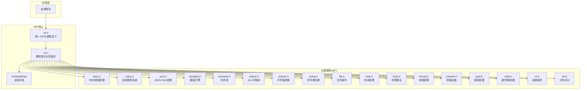
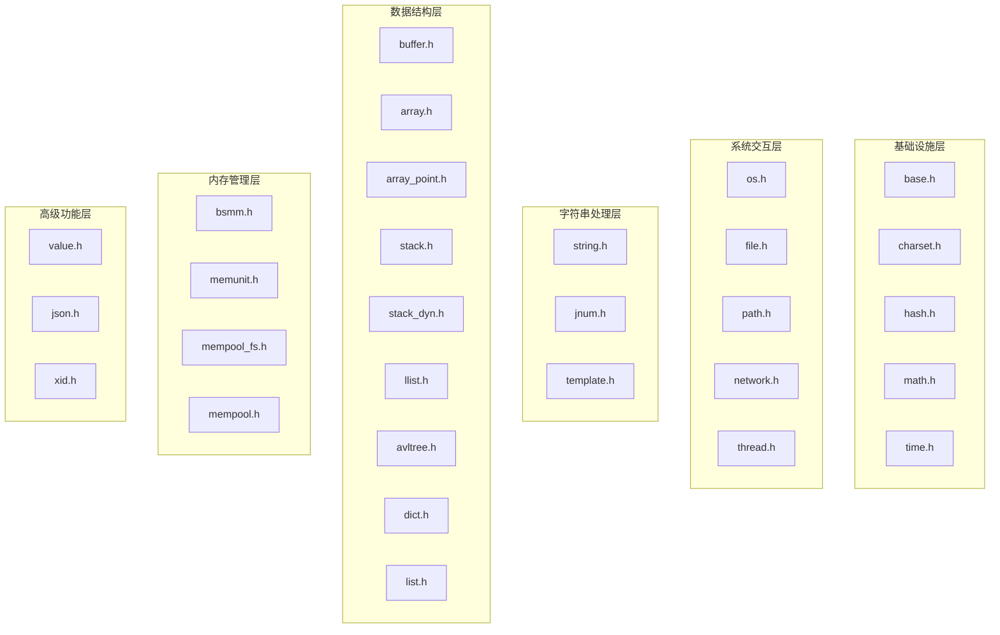
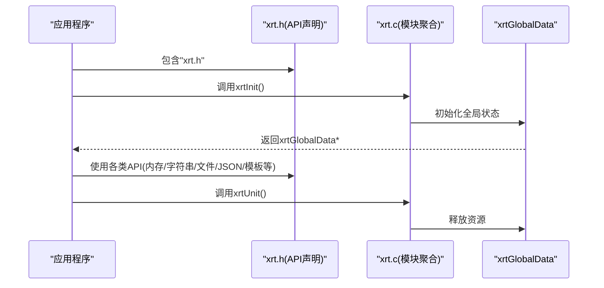
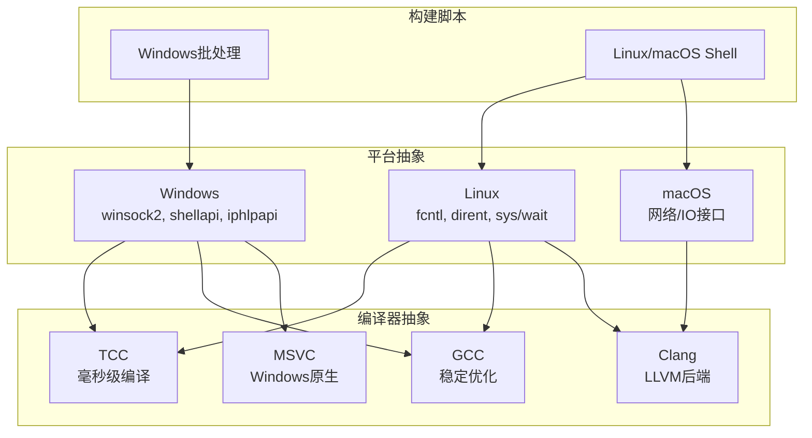
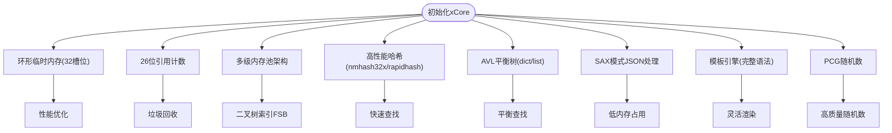
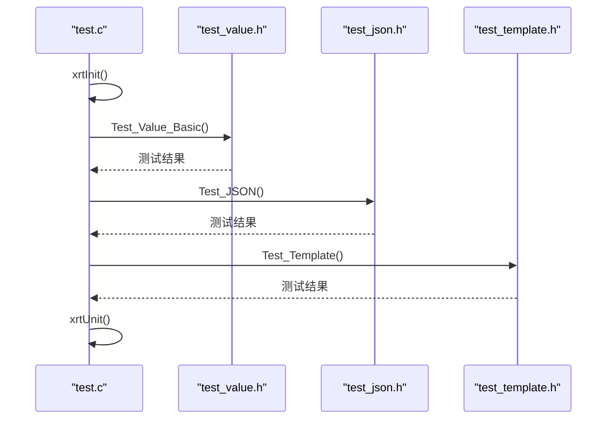

# 项目简介

<cite>
**本文档引用的文件**
- [README.md](file://README.md)
- [README.en.md](file://README.en.md)
- [xrt.h](file://xrt.h)
- [xrt.c](file://xrt.c)
- [lib/base.h](file://lib/base.h)
- [lib/value.h](file://lib/value.h)
- [lib/json.h](file://lib/json.h)
- [lib/template.h](file://lib/template.h)
- [lib/mempool.h](file://lib/mempool.h)
- [lib/avltree.h](file://lib/avltree.h)
- [test.c](file://test.c)
- [build_test.sh](file://build_test.sh)
- [test/test_value.h](file://test/test_value.h)
- [test/test_json.h](file://test/test_json.h)
- [test/test_template.h](file://test/test_template.h)
</cite>

## 目录
1. [项目概述](#项目概述)
2. [核心价值主张](#核心价值主张)
3. [发展历程与设计理念](#发展历程与设计理念)
4. [架构总览](#架构总览)
5. [核心组件详解](#核心组件详解)
6. [统一接口设计](#统一接口设计)
7. [跨平台与编译器兼容性](#跨平台与编译器兼容性)
8. [创新技术亮点](#创新技术亮点)
9. [应用场景与价值定位](#应用场景与价值定位)
10. [测试体系与质量保障](#测试体系与质量保障)
11. [性能特征与优化策略](#性能特征与优化策略)
12. [结语](#结语)

## 项目概述
XRT（X Runtime Library）是一个功能完备的轻量级、高性能、零外部依赖的C语言运行时库。项目以“单头文件”为核心架构，提供32个功能模块、2320行API声明、31个测试模块与33份API文档，覆盖内存管理、字符集转换、文件处理、数据结构、动态类型系统、JSON处理、模板引擎等完整功能链，让C语言开发者能够像使用现代高级语言一样便捷地进行开发。

- **统一入口**：通过单一头文件xrt.h暴露全部API，引入即用
- **模块化设计**：32个功能子库按需组合，最小化代码体积
- **零依赖原则**：除标准C库外无任何外部依赖
- **跨平台支持**：Windows、Linux、macOS三大平台，x86/x64/ARM64多架构
- **四大编译器兼容**：TCC（毫秒级编译）、GCC、Clang、MSVC全面支持

**章节来源**
- file://README.md#L23-L41
- file://README.en.md#L23-L41

## 核心价值主张
XRT的核心价值在于“以极简代价获得现代化C语言开发体验”。它解决了传统C语言在内存管理、数据类型抽象、字符串处理、JSON解析、模板渲染等方面的痛点，提供：

- **零心智负担的内存管理**：环形临时内存自动释放 + 引用计数GC，消除内存泄漏风险
- **统一的动态类型系统**：16种数据类型（Empty/Null/Bool/Int/Float/Text/Time/Point/Func/Array/List/Coll/Table/Struct/Object/Custom），支持自动内存管理与类型转换
- **高性能JSON处理**：SAX模式解析/生成，低内存占用，支持注释、尾逗号、十六进制、特殊浮点数等
- **企业级模板引擎**：支持变量替换、条件判断、循环迭代、子模板嵌套、脚本扩展的完整语法
- **跨平台与编译器友好**：统一抽象层，代码一次编写多平台运行；TCC支持毫秒级编译

**章节来源**
- file://README.md#L44-L69
- file://README.en.md#L44-L69

## 发展历程与设计理念
XRT的设计理念围绕“轻量、高性能、功能完备”展开，强调“以最小成本提供最大价值”。项目采用“单头文件 + 多模块”的架构，将32个功能模块以include方式整合到xrt.c中，形成统一的API入口，同时保持模块间的低耦合与高内聚。

- **模块化演进**：从基础内存管理、字符集转换、文件操作等基础设施层，逐步扩展到数据结构、内存管理、高级功能（Value、JSON、模板引擎）
- **性能优先**：多级内存池、AVL平衡树、26位引用计数、内联函数优化、PCG随机数等核心技术确保极致性能
- **工程化落地**：完善的测试体系（31个测试模块）、构建脚本（Windows批处理、Linux/macOS Shell）、文档体系（33份API文档）

**章节来源**
- file://README.md#L72-L133
- file://README.en.md#L72-L133

## 架构总览
XRT的整体架构由“统一入口 + 模块化子库 + 全局状态管理”构成。xrt.h定义统一API与类型，xrt.c负责模块聚合与初始化，各lib/*.h提供具体功能实现，test.c提供测试入口。

**图表来源**
- [xrt.h](file://xrt.h#L122-L184)
- [xrt.c](file://xrt.c#L54-L84)
- [lib/base.h](file://lib/base.h#L1-L132)
- [lib/value.h](file://lib/value.h#L1-L200)
- [lib/json.h](file://lib/json.h#L1-L200)
- [lib/template.h](file://lib/template.h#L1-L200)
- [lib/mempool.h](file://lib/mempool.h#L1-L200)
- [lib/avltree.h](file://lib/avltree.h#L1-L126)

**章节来源**
- file://README.md#L355-L398
- file://README.en.md#L355-L398

## 核心组件详解
XRT的核心组件围绕“基础设施层、系统交互层、字符串处理层、数据结构层、内存管理层、高级功能层”六大层次组织，每个模块职责明确、接口统一。

- **基础设施层（5模块）**：base（内存/错误）、charset（字符集）、hash（哈希）、math（随机数）、time（时间）
- **系统交互层（5模块）**：os（系统操作）、file（文件）、path（路径）、network（网络）、thread（线程）
- **字符串处理层（3模块）**：string（字符串）、jnum（数字转换）、template（模板引擎）
- **数据结构层（9模块）**：buffer（动态缓冲区）、array/array_point（数组）、stack/stack_dyn（栈）、llist（双向链表）、avltree（AVL树）、dict（字典）、list（列表）
- **内存管理层（4模块）**：bsmm（块结构内存管理）、memunit（内存单元管理）、mempool_fs（固定大小内存池）、mempool（通用内存池）
- **高级功能层（3模块）**：value（动态类型系统）、json（JSON处理）、xid（分布式ID）

**图表来源**
- [README.md](file://README.md#L74-L132)
- [README.en.md](file://README.en.md#L74-L132)

**章节来源**
- file://README.md#L72-L133
- file://README.en.md#L72-L133

## 统一接口设计
XRT的统一接口设计体现在“单头文件API声明 + 模块化实现 + 全局状态管理”三个方面。xrt.h集中定义所有API，采用XXAPI宏控制导出/导入，配合xrt.c的模块聚合，形成“引入xrt.h即可使用全部功能”的开发体验。

- **API声明集中化**：xrt.h包含2320行API声明，涵盖内存管理、字符集、字符串、文件、时间、数据结构、动态类型、JSON、模板引擎、网络、线程、哈希、数学、系统操作、路径、分布式ID等
- **模块化实现**：xrt.c通过#include lib/*.h的方式将32个模块整合，形成统一的实现入口
- **全局状态管理**：xrtGlobalData统一管理全局数据、错误处理、临时内存、随机数、应用信息等

**图表来源**
- [xrt.h](file://xrt.h#L122-L193)
- [xrt.c](file://xrt.c#L87-L226)

**章节来源**
- file://xrt.h#L1-L800
- file://xrt.c#L1-L254

## 跨平台与编译器兼容性
XRT在跨平台与编译器兼容性方面做了充分设计，确保在不同平台和编译器环境下的一致行为。

- **平台支持**：Windows（x86/x64）、Linux（x86/x64）、macOS（x64/ARM64）
- **编译器支持**：TCC（毫秒级编译）、GCC、Clang、MSVC
- **平台适配**：xrt.c中通过条件编译包含不同平台的头文件与库（如Windows的winsock2、iphlpapi，Linux的fcntl、dirent、sys/wait等）
- **构建脚本**：Windows提供批处理脚本，Linux/macOS提供Shell脚本，支持一键编译与测试

**图表来源**
- [xrt.c](file://xrt.c#L8-L38)
- [build_test.sh](file://build_test.sh#L1-L6)

**章节来源**
- file://README.md#L402-L429
- file://README.en.md#L402-L429
- file://build_test.sh#L1-L6

## 创新技术亮点
XRT在多个技术领域实现了创新设计，显著提升了C语言的开发效率与运行性能。

- **环形临时内存**：32槽位循环使用，自动释放，消除内存泄漏风险，适合函数内临时返回值
- **26位引用计数GC**：支持最多约6700万次引用，超过阈值自动转为静态值，避免溢出
- **多级内存池架构**：BSMM（块结构内存管理）、MemUnit（256字节页管理）、FSMemPool（固定大小内存池）、MemPool（通用内存池，二叉树索引FSB）
- **高性能哈希算法**：nmhash32x（32位）+ rapidhash（64位），BSD-2协议
- **AVL平衡树**：字典与集合采用AVL树实现，查找/插入/删除均为O(log n)
- **SAX模式JSON处理**：事件驱动解析/生成，低内存占用，支持注释、尾逗号、十六进制、特殊浮点数
- **企业级模板引擎**：完整语法支持if/for/foreach/define/include/script，支持子模板嵌套与脚本扩展
- **PCG随机数**：高质量伪随机数生成器，支持32/64位

**图表来源**
- [lib/base.h](file://lib/base.h#L49-L84)
- [lib/value.h](file://lib/value.h#L32-L96)
- [lib/mempool.h](file://lib/mempool.h#L35-L145)
- [lib/json.h](file://lib/json.h#L80-L135)
- [lib/template.h](file://lib/template.h#L15-L55)
- [lib/avltree.h](file://lib/avltree.h#L24-L59)

**章节来源**
- file://README.md#L538-L638
- file://README.en.md#L538-L638

## 应用场景与价值定位
XRT适用于多种开发场景，为不同层次的开发者提供清晰的价值定位：

- **工具类开发**：命令行工具、系统辅助程序、文件处理/批量转换工具、配置文件解析器
- **服务端开发**：轻量级Web服务、JSON API服务、模板驱动的内容生成
- **嵌入式开发**：资源受限环境、需要精细内存控制、跨平台嵌入式系统
- **学习用途**：C语言数据结构学习、内存管理机制研究、编译器原理实践（模板引擎、JSON解析）

XRT的价值定位是“以极简代价提供现代化C语言开发体验”，既满足专业开发者对性能与功能的需求，又降低学习与使用成本。

**章节来源**
- file://README.md#L682-L705
- file://README.en.md#L682-L705

## 测试体系与质量保障
XRT拥有完善的测试体系，覆盖所有功能模块，确保代码质量与稳定性。

- **测试模块数量**：31个测试模块，100%覆盖所有功能
- **测试分类**：基础功能（base、charset、os、math、string、path、time、file、thread、hash、network、xid）、数据结构（buffer、array_ptr、array_struct、bsmm、memunit、mempool_fs、mempool）、栈结构（stack_ptr、stack、dynstack_ptr、dynstack）、树/字典（llist、avltree、dict、list）、高级功能（value、json、template）
- **测试入口**：test.c集中包含所有测试模块，并提供统一的测试执行流程
- **测试示例**：test_value.h、test_json.h、test_template.h展示了典型功能测试方法

**图表来源**
- [test.c](file://test.c#L11-L43)
- [test.c](file://test.c#L54-L179)
- [test/test_value.h](file://test/test_value.h#L14-L200)
- [test/test_json.h](file://test/test_json.h#L5-L105)
- [test/test_template.h](file://test/test_template.h#L5-L200)

**章节来源**
- file://README.md#L641-L679
- file://README.en.md#L641-L679
- file://test.c#L1-L182

## 性能特征与优化策略
XRT在性能方面采取了多项优化策略，确保在不同场景下的高效运行。

- **内存池架构**：二叉树索引的固定大小内存块（FSB），分配时间复杂度O(log n)
- **高效哈希算法**：32位使用nmhash32x，64位使用rapidhash，BSD-2协议
- **AVL平衡树**：字典和集合采用AVL树实现，查找/插入/删除均为O(log n)
- **内联函数优化**：关键路径提供_inline版本，消除函数调用开销
- **PCG随机数**：使用PCG算法生成高质量伪随机数，支持32/64位
- **256元素内存页**：内存管理单元采用256元素/页设计，快速分配和释放

这些优化策略共同构成了XRT的高性能基石，使其在内存密集型与数据处理型应用中表现卓越。

**章节来源**
- file://README.md#L61-L69
- file://README.en.md#L61-L69

## 结语
XRT项目以“轻量、高性能、功能完备”为核心目标，通过“单头文件 + 模块化子库 + 全局状态管理”的架构设计，为C语言开发者提供了现代化的基础设施支持。其在内存管理、动态类型系统、模板引擎、JSON处理等方面的创新设计，显著提升了C语言的开发效率与运行性能。完善的测试体系与跨平台、多编译器兼容性，进一步保障了项目的稳定性与可移植性。无论是工具类开发、服务端应用、嵌入式系统还是学习研究，XRT都能为不同层次的开发者提供清晰的价值定位与可靠的技术支撑。