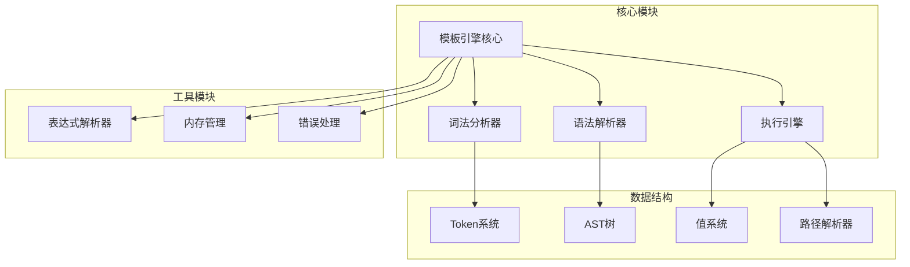
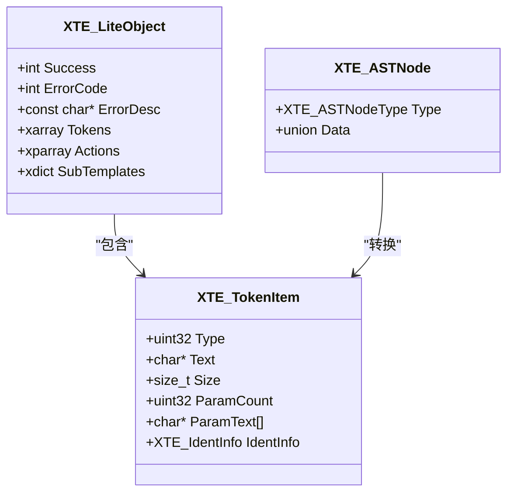
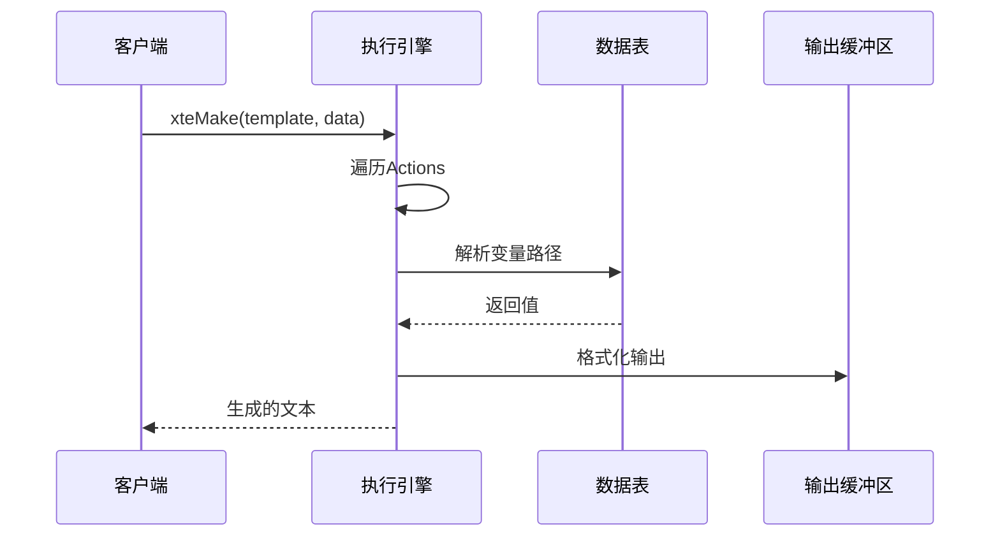
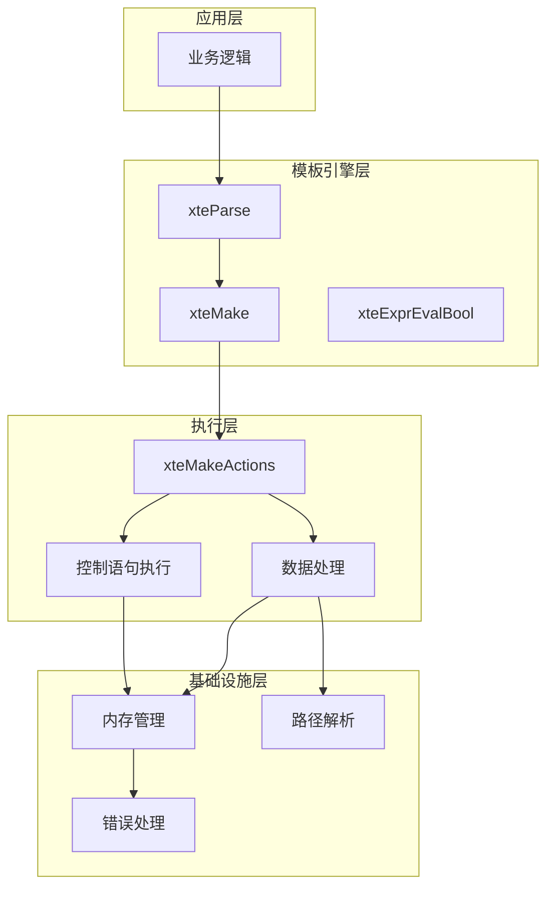
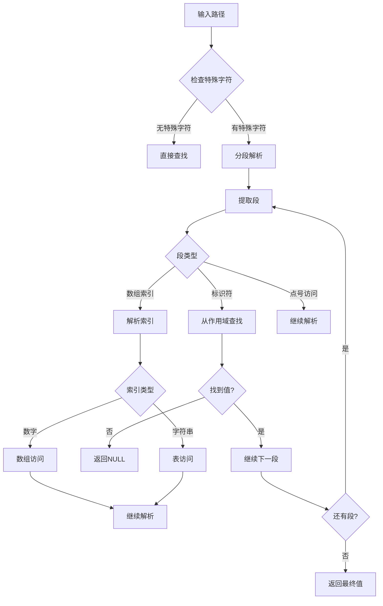
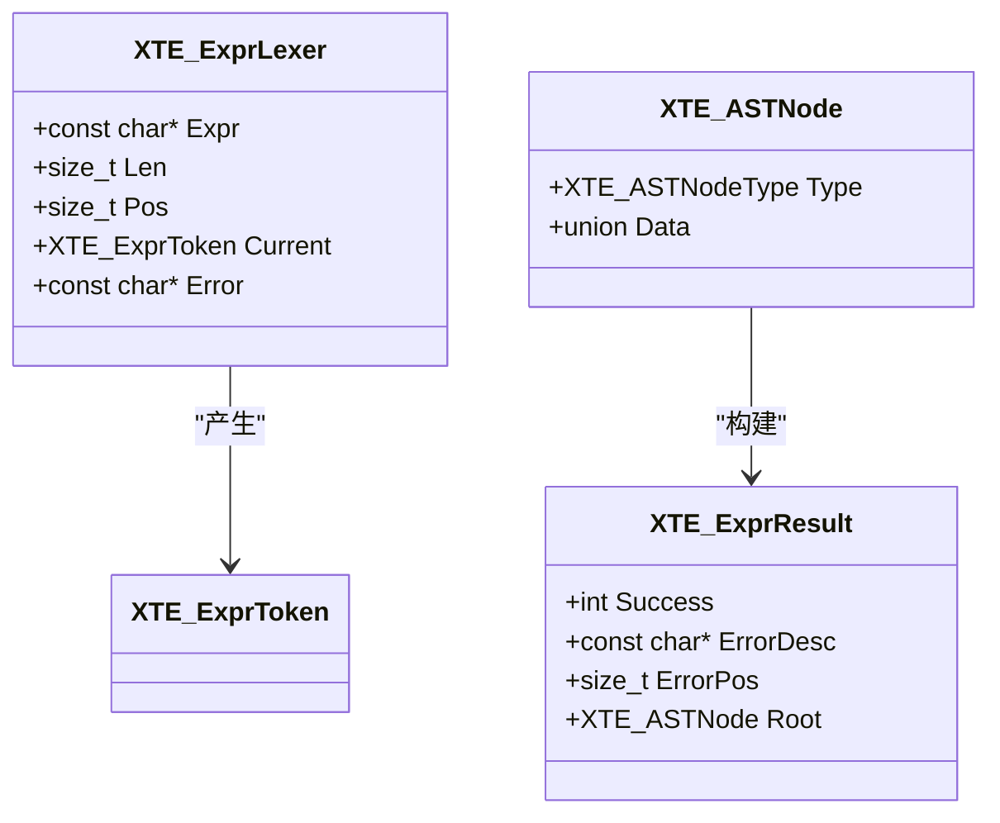
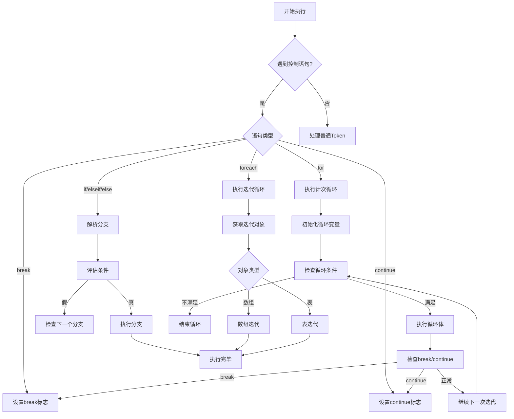
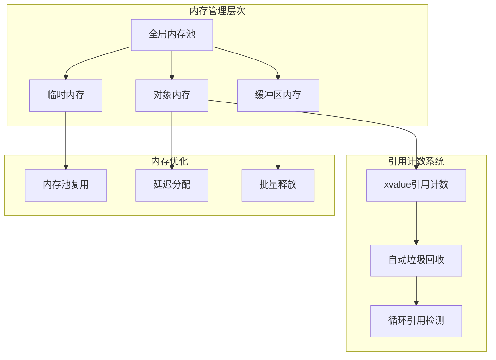
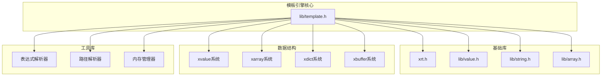

# 企业级模板引擎

<cite>
**本文档引用的文件**
- [lib/template.h](file://lib/template.h)
- [docs/api-template.md](file://docs/api-template.md)
- [test/test_template.h](file://test/test_template.h)
- [lib/value.h](file://lib/value.h)
- [xrt.h](file://xrt.h)
</cite>

## 目录
1. [项目概述](#项目概述)
2. [项目结构](#项目结构)
3. [核心组件](#核心组件)
4. [架构概览](#架构概览)
5. [详细组件分析](#详细组件分析)
6. [依赖关系分析](#依赖关系分析)
7. [性能考虑](#性能考虑)
8. [故障排除指南](#故障排除指南)
9. [结论](#结论)
10. [附录](#附录)

## 项目概述

XRT企业级模板引擎是一个高性能、功能完整的模板处理系统，专为企业级应用设计。该引擎提供了完整的模板语法支持，包括变量替换、条件判断、循环迭代、子模板定义与调用、脚本扩展等高级特性。

### 主要特性

- **多层架构设计**：从词法分析到执行引擎的完整流水线
- **丰富的模板语法**：支持变量替换、条件判断、循环控制等
- **高性能执行**：内置表达式AST缓存和循环限制机制
- **内存安全**：完善的内存管理和引用计数机制
- **扩展性**：支持自定义标识符和用户扩展

## 项目结构

XRT模板引擎采用模块化设计，主要包含以下核心模块：



**图表来源**
- [lib/template.h](file://lib/template.h#L1-L200)
- [docs/api-template.md](file://docs/api-template.md#L1-L100)

**章节来源**
- [lib/template.h](file://lib/template.h#L1-L200)
- [docs/api-template.md](file://docs/api-template.md#L1-L100)

## 核心组件

### 1. 词法分析器 (Lexer)

词法分析器负责将模板文本转换为Token序列，支持多种模板语法标记：

```mermaid
flowchart TD
A[输入模板文本] --> B[扫描字符]
B --> C{识别模板符号}
C --> |{{| D[转义处理]
C --> |{!| E[注释Token]
C --> |{$| F[变量Token]
C --> |{%| G[数字Token]
C --> |{&| H[时间Token]
C --> |{?| I[布尔Token]
C --> |{*| J[数组Token]
C --> |{=| K[子模板Token]
C --> |{#| L[控制语句Token]
D --> M[文本Token]
E --> N[结束]
F --> N
G --> N
H --> N
I --> N
J --> N
K --> N
L --> N
M --> N
```

**图表来源**
- [lib/template.h](file://lib/template.h#L240-L587)

### 2. 语法解析器 (Parser)

语法解析器将Token序列转换为抽象语法树(AST)，支持复杂的嵌套结构：



**图表来源**
- [lib/template.h](file://lib/template.h#L335-L397)
- [lib/template.h](file://lib/template.h#L846-L848)

### 3. 执行引擎

执行引擎负责执行编译后的模板，支持完整的控制流和数据操作：



**图表来源**
- [lib/template.h](file://lib/template.h#L1301-L2121)

**章节来源**
- [lib/template.h](file://lib/template.h#L240-L587)
- [lib/template.h](file://lib/template.h#L858-L968)
- [lib/template.h](file://lib/template.h#L1301-L2121)

## 架构概览

XRT模板引擎采用分层架构设计，确保了良好的模块化和可维护性：



**图表来源**
- [lib/template.h](file://lib/template.h#L1049-L1062)
- [lib/template.h](file://lib/template.h#L2118-L2121)

### 模板语法支持

引擎支持完整的模板语法，包括：

| 语法类别 | 支持的语法 | 示例 |
|---------|-----------|------|
| 变量替换 | `{$variable}` | `{$name}`, `{$age}` |
| 数字格式化 | `{%variable:format}` | `{%price:.2f}` |
| 时间格式化 | `{&variable:format}` | `{&date:yyyy-MM-dd}` |
| 条件判断 | `{#if:condition}...{#end}` | `{#if:age>=18}` |
| 循环控制 | `{#for:start:end:step}` | `{#for:1:10:1}` |
| 数组迭代 | `{#foreach:array}` | `{#foreach:items}` |
| 子模板 | `{=name}` | `{=item}` |
| 注释 | `{!comment}` | `{! this is comment}` |

**章节来源**
- [docs/api-template.md](file://docs/api-template.md#L23-L250)
- [docs/api-template.md](file://docs/api-template.md#L254-L312)

## 详细组件分析

### 1. 路径解析器

路径解析器是模板引擎的核心组件之一，支持复杂的嵌套访问语法：



**图表来源**
- [lib/template.h](file://lib/template.h#L603-L773)

路径解析器支持以下语法：

- `a.b.c` - 通过点号访问嵌套属性
- `arr[0]` - 通过数字索引访问数组
- `obj["key"]` - 通过字符串键访问表
- `arr[0].name` - 组合访问

**章节来源**
- [lib/template.h](file://lib/template.h#L591-L773)

### 2. 表达式解析器

表达式解析器实现了完整的表达式计算功能，支持多种数据类型和运算符：



**图表来源**
- [lib/template.h](file://lib/template.h#L2137-L2144)
- [lib/template.h](file://lib/template.h#L2409-L2426)

表达式支持的操作符：

| 操作符 | 描述 | 示例 |
|-------|------|------|
| `and` | 逻辑与 | `age>18 and active` |
| `or` | 逻辑或 | `admin or manager` |
| `not` | 逻辑非 | `not disabled` |
| `=` | 等于 | `name="Alice"` |
| `!=` | 不等于 | `status!="active"` |
| `~=` | 约等于 | `price~=100` |
| `>` | 大于 | `score>60` |
| `<` | 小于 | `count<10` |
| `>=` | 大于等于 | `level>=5` |
| `<=` | 小于等于 | `age<=65` |

**章节来源**
- [lib/template.h](file://lib/template.h#L2125-L2987)

### 3. 控制语句执行

控制语句执行器支持完整的控制流结构，包括条件判断、循环控制等：



**图表来源**
- [lib/template.h](file://lib/template.h#L1684-L1892)

**章节来源**
- [lib/template.h](file://lib/template.h#L1120-L1892)

### 4. 内存管理系统

XRT模板引擎采用了高效的内存管理策略，确保在高并发场景下的性能和稳定性：



**图表来源**
- [lib/value.h](file://lib/value.h#L32-L96)

**章节来源**
- [lib/value.h](file://lib/value.h#L32-L96)

## 依赖关系分析

XRT模板引擎的依赖关系体现了清晰的模块化设计：



**图表来源**
- [lib/template.h](file://lib/template.h#L1-L50)
- [xrt.h](file://xrt.h#L1-L120)

### 关键依赖关系

1. **模板引擎依赖基础库**：模板引擎依赖XRT核心库提供的基础功能
2. **数据结构依赖值系统**：所有数据操作都通过xvalue系统进行
3. **执行引擎依赖内存管理**：执行过程中需要高效的内存分配和释放
4. **表达式解析依赖路径解析**：表达式求值需要路径解析能力

**章节来源**
- [lib/template.h](file://lib/template.h#L1-L50)
- [xrt.h](file://xrt.h#L1-L120)

## 性能考虑

### 1. 循环限制机制

为了防止恶意或意外的无限循环，模板引擎实现了循环限制机制：

- **默认最大迭代次数**：100,000次循环
- **自动步长修正**：步长为0时自动修正为1或-1
- **方向检查**：防止步长方向与边界条件不匹配导致的无限循环

### 2. 表达式AST缓存

表达式解析器实现了智能缓存机制：

- **AST缓存**：解析后的表达式AST存储在缓存中
- **重复使用**：相同表达式多次调用时直接使用缓存
- **内存管理**：缓存具有生命周期管理，避免内存泄漏

### 3. 内存池优化

模板引擎采用了多种内存优化策略：

- **批量分配**：大量小对象采用批量分配减少系统调用
- **对象复用**：常用对象在内存池中复用
- **延迟释放**：非紧急内存采用延迟释放策略

### 4. 执行优化

执行引擎实现了多项优化技术：

- **快速路径**：简单路径直接查找，避免复杂解析
- **内联优化**：频繁调用的函数采用内联优化
- **分支预测**：热点代码采用分支预测优化

**章节来源**
- [lib/template.h](file://lib/template.h#L62-L65)
- [lib/template.h](file://lib/template.h#L1005-L1014)
- [lib/template.h](file://lib/template.h#L1769-L1772)

## 故障排除指南

### 1. 常见错误类型

模板引擎定义了完整的错误处理机制：

| 错误代码 | 错误描述 | 可能原因 | 解决方案 |
|---------|----------|----------|----------|
| 0 | success | 成功 | 无需处理 |
| 1 | malloc failed | 内存分配失败 | 检查系统内存 |
| 2 | token list append failed | Token列表添加失败 | 检查Token有效性 |
| 3 | unrecognized symbols | 无法识别的符号 | 检查模板语法 |
| 4 | empty symbols are not allowed | 空符号不允许 | 检查标签完整性 |
| 5 | too many parameters | 参数过多 | 检查参数数量 |
| 6 | statement not ended | 语句未结束 | 检查配对标签 |
| 7 | Undefined identifier | 未定义标识符 | 检查标识符拼写 |
| 8 | Missing parameters | 缺少参数 | 检查参数完整性 |
| 9 | Nesting of define statements is not allowed | 不允许嵌套define | 检查模板结构 |

### 2. 调试技巧

- **启用详细错误信息**：利用ErrorDesc获取详细的错误描述
- **检查Token列表**：通过Tokens数组检查词法分析结果
- **验证数据结构**：确保传入的数据结构符合预期
- **监控内存使用**：定期检查内存分配和释放情况

### 3. 性能诊断

- **循环性能监控**：检查循环次数是否超过限制
- **表达式缓存效果**：监控表达式AST缓存命中率
- **内存泄漏检测**：使用引用计数检查内存泄漏
- **执行时间分析**：分析各阶段的执行时间

**章节来源**
- [lib/template.h](file://lib/template.h#L69-L92)
- [lib/template.h](file://lib/template.h#L852-L854)

## 结论

XRT企业级模板引擎是一个设计精良、功能完整的模板处理系统。其特点包括：

1. **完整的功能支持**：支持所有常见的模板语法和高级特性
2. **高性能设计**：通过多种优化技术确保执行效率
3. **内存安全**：完善的内存管理和错误处理机制
4. **扩展性强**：支持自定义标识符和用户扩展
5. **易于使用**：简洁的API设计和丰富的示例

该模板引擎适合企业级应用开发，能够满足高性能、高可靠性的需求。

## 附录

### 实际应用示例

模板引擎提供了丰富的测试用例，展示了各种使用场景：

```c
// 基本变量替换
const char* tpl1 = "Hello {$name}!";
// 条件判断
const char* tpl2 = "{#if:age>=18}Adult{#else}Minor{#end}";
// 数组循环
const char* tpl3 = "{#foreach:items}{$name},{#end}";
// 子模板定义
const char* tpl4 = "{#define:item}<li>{$__self__}</li>{#end}";
```

### 最佳实践建议

1. **模板设计**：保持模板结构清晰，合理使用子模板
2. **数据准备**：确保数据结构完整性和一致性
3. **性能优化**：利用表达式缓存和循环限制机制
4. **错误处理**：妥善处理各种错误情况
5. **内存管理**：正确释放模板对象和生成的文本

### 版本兼容性

模板引擎遵循向后兼容原则，新版本会保持API的稳定性，同时提供性能改进和新功能。