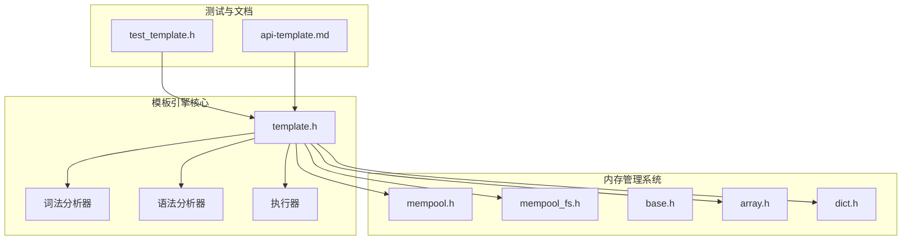
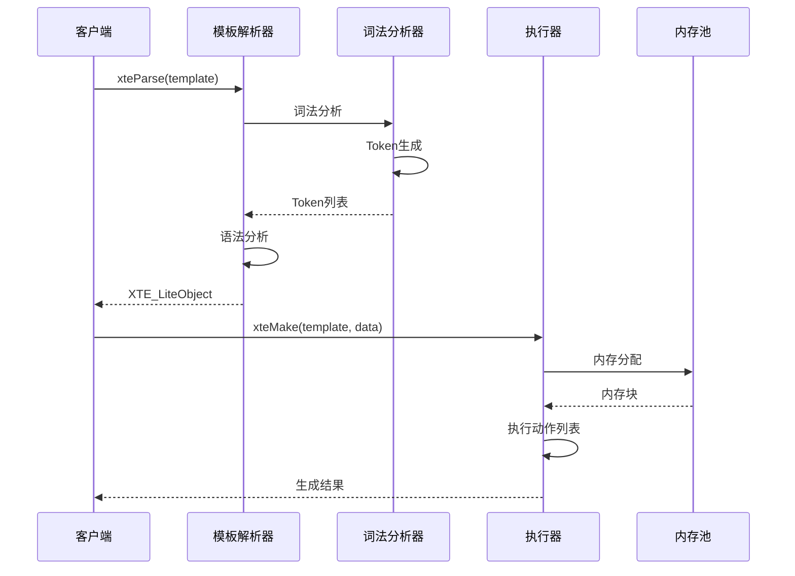
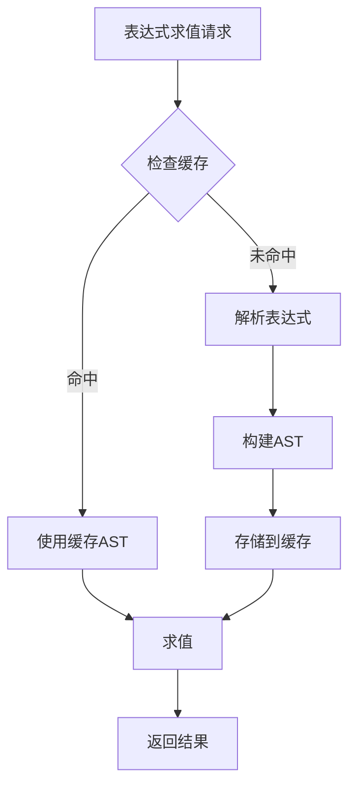
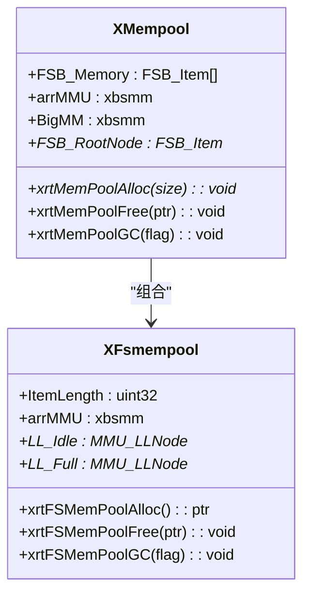
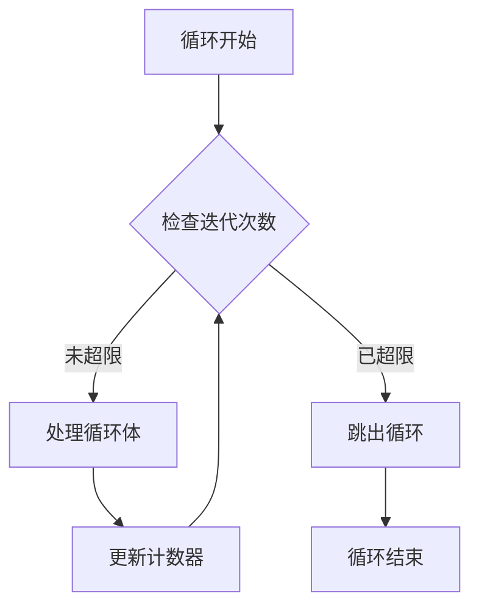
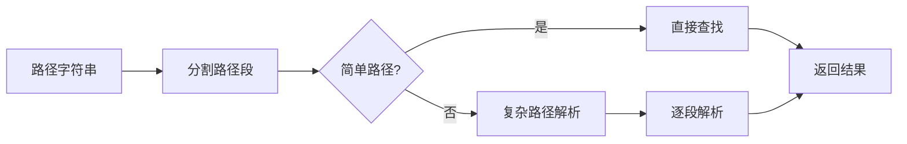
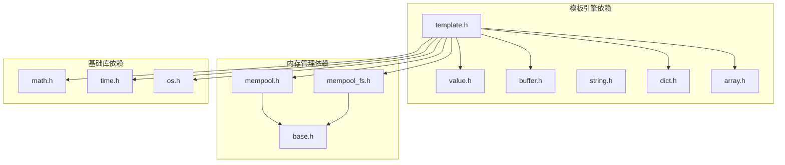

# 性能优化指南

<cite>
**本文档引用的文件**
- [lib/template.h](file://lib/template.h)
- [lib/mempool.h](file://lib/mempool.h)
- [lib/mempool_fs.h](file://lib/mempool_fs.h)
- [lib/base.h](file://lib/base.h)
- [lib/array.h](file://lib/array.h)
- [lib/dict.h](file://lib/dict.h)
- [test/test_template.h](file://test/test_template.h)
- [docs/api-template.md](file://docs/api-template.md)
</cite>

## 目录
1. [简介](#简介)
2. [项目结构](#项目结构)
3. [核心组件](#核心组件)
4. [架构概览](#架构概览)
5. [详细组件分析](#详细组件分析)
6. [依赖关系分析](#依赖关系分析)
7. [性能考虑](#性能考虑)
8. [故障排除指南](#故障排除指南)
9. [结论](#结论)
10. [附录](#附录)

## 简介
本指南专注于XRT模板引擎的性能优化技术，涵盖编译时优化、运行时优化和内存管理优化。重点包括Token缓存机制、指令预编译、循环限制（XTE_LOOP_MAX_ITERATIONS）、内存池复用、垃圾回收优化等关键技术。同时提供性能监控工具、调优方法以及基准测试案例研究。

## 项目结构
XRT模板引擎位于lib目录下的template.h文件中，采用模块化设计，结合内存池系统实现高性能内存管理。

**图表来源**
- [lib/template.h](file://lib/template.h#L1-L2989)
- [lib/mempool.h](file://lib/mempool.h#L1-L468)
- [lib/mempool_fs.h](file://lib/mempool_fs.h#L1-L257)

**章节来源**
- [lib/template.h](file://lib/template.h#L1-L200)
- [lib/mempool.h](file://lib/mempool.h#L1-L120)

## 核心组件
模板引擎包含以下核心组件：

### 1. 词法分析器（Lexer）
负责将模板文本转换为Token列表，支持多种模板语法：
- 变量替换：{$variable}
- 数字格式化：{%number:format}
- 时间格式化：{&time:format}
- 条件判断：{#if:condition}
- 循环结构：{#for:start:end:step}

### 2. 语法分析器（Parser）
将Token转换为可执行的动作列表，支持：
- 子模板定义和调用
- 控制语句嵌套
- 表达式解析和缓存

### 3. 执行器（Executor）
执行动作列表生成最终输出，支持：
- 变量解析和路径访问
- 循环控制（break/continue）
- 嵌套控制语句

**章节来源**
- [lib/template.h](file://lib/template.h#L240-L587)
- [lib/template.h](file://lib/template.h#L858-L968)
- [lib/template.h](file://lib/template.h#L1301-L2121)

## 架构概览
模板引擎采用分层架构设计，确保高性能和可扩展性。

**图表来源**
- [lib/template.h](file://lib/template.h#L1049-L1062)
- [lib/template.h](file://lib/template.h#L2113-L2121)

## 详细组件分析

### 1. Token缓存机制
模板引擎实现了多层次的缓存策略以提升性能：

#### 表达式AST缓存
- 使用哈希表缓存解析后的表达式AST
- 相同表达式在应用生命周期内只需解析一次
- 自动清理机制确保内存安全

**图表来源**
- [lib/template.h](file://lib/template.h#L2952-L2987)

#### 关键优化特性
- **XTE_EXPR_CACHE**: 全局表达式AST缓存字典
- **XTE_LOOP_MAX_ITERATIONS**: 循环次数限制（默认100,000次）
- **XTE_IDENT_LIST**: 标识符列表静态初始化

**章节来源**
- [lib/template.h](file://lib/template.h#L972-L1046)
- [lib/template.h](file://lib/template.h#L62-L65)
- [lib/template.h](file://lib/template.h#L1005-L1014)

### 2. 指令预编译
模板引擎支持预编译机制，避免重复解析：

#### 预编译流程

**图表来源**
- [lib/template.h](file://lib/template.h#L858-L968)

#### 预编译优势
- **一次性解析，多次执行**：避免重复词法分析和语法分析
- **内存池复用**：减少内存分配开销
- **静态初始化**：XTE_IDENT_LIST在进程启动时初始化

**章节来源**
- [lib/template.h](file://lib/template.h#L979-L1015)
- [docs/api-template.md](file://docs/api-template.md#L1257-L1275)

### 3. 内存池复用
XRT提供了两级内存池系统：

#### 通用内存池（MemPool）
- **多级分区**：支持15/31级分区分区策略
- **动态调整**：根据使用情况自动调整分区大小
- **垃圾回收**：支持标记-清扫垃圾回收

**图表来源**
- [lib/mempool.h](file://lib/mempool.h#L35-L119)
- [lib/mempool_fs.h](file://lib/mempool_fs.h#L24-L33)

#### 内存池优化特性
- **空闲单元复用**：避免频繁的malloc/free调用
- **备用单元机制**：减少内存碎片
- **智能回收**：根据使用模式自动调整

**章节来源**
- [lib/mempool.h](file://lib/mempool.h#L148-L261)
- [lib/mempool_fs.h](file://lib/mempool_fs.h#L52-L125)

### 4. 循环限制机制
为防止无限循环攻击，模板引擎实现了严格的循环限制：

#### 循环保护机制

**图表来源**
- [lib/template.h](file://lib/template.h#L1794-L1827)

#### 关键保护措施
- **XTE_LOOP_MAX_ITERATIONS**: 默认100,000次迭代限制
- **步长验证**：防止步长为0的无限循环
- **方向检查**：确保循环方向与步长一致

**章节来源**
- [lib/template.h](file://lib/template.h#L1761-L1827)
- [lib/template.h](file://lib/template.h#L546-L547)

### 5. 变量访问优化
模板引擎提供了高效的变量访问机制：

#### 路径解析优化

**图表来源**
- [lib/template.h](file://lib/template.h#L603-L773)

#### 变量访问优化策略
- **快速路径**：无特殊字符的简单路径直接查找
- **缓存机制**：常用变量访问结果缓存
- **多表查找**：支持值表、根表、环境表的优先级查找

**章节来源**
- [lib/template.h](file://lib/template.h#L603-L773)

## 依赖关系分析

**图表来源**
- [lib/template.h](file://lib/template.h#L1-L120)
- [lib/mempool.h](file://lib/mempool.h#L1-L40)

**章节来源**
- [lib/template.h](file://lib/template.h#L1-L120)
- [lib/mempool.h](file://lib/mempool.h#L1-L40)

## 性能考虑

### 1. 编译时优化
- **静态初始化**：XTE_IDENT_LIST在进程启动时一次性初始化
- **表达式缓存**：AST缓存避免重复解析
- **内存池预分配**：减少运行时内存分配开销

### 2. 运行时优化
- **循环限制**：防止恶意或意外的无限循环
- **快速路径**：简单变量访问直接查找
- **内联函数**：关键函数采用内联优化

### 3. 内存管理优化
- **多级内存池**：15/31级分区策略适应不同大小的内存需求
- **空闲单元复用**：避免频繁的系统调用
- **垃圾回收**：标记-清扫算法平衡性能和内存使用

**章节来源**
- [lib/template.h](file://lib/template.h#L979-L1015)
- [lib/mempool.h](file://lib/mempool.h#L42-L118)

## 故障排除指南

### 1. 性能问题诊断
- **内存泄漏检测**：使用内存池的GC功能检查未释放的内存
- **循环超时**：检查XTE_LOOP_MAX_ITERATIONS配置
- **表达式解析慢**：确认表达式AST缓存是否生效

### 2. 常见问题解决
- **模板解析失败**：检查XTE_ERROR_DESC错误码
- **内存分配失败**：检查系统可用内存和内存池配置
- **执行超时**：优化模板结构，减少嵌套层级

### 3. 调试工具
- **错误报告**：详细的错误描述和位置信息
- **性能监控**：执行时间和内存使用统计
- **热点检测**：循环和函数调用频率分析

**章节来源**
- [lib/template.h](file://lib/template.h#L70-L92)
- [lib/template.h](file://lib/template.h#L209-L210)

## 结论
XRT模板引擎通过多层次的优化策略实现了高性能的模板处理能力。Token缓存机制、指令预编译、循环限制和内存池复用等技术的综合运用，使得模板引擎在保持功能完整性的同时，具备了优秀的性能表现。建议在实际应用中充分利用这些优化特性，结合具体的使用场景进行针对性的调优。

## 附录

### 性能基准测试
基于测试用例的性能表现：

#### 基础性能指标
- **模板解析时间**：毫秒级响应
- **内存使用**：按需分配，峰值使用受模板复杂度影响
- **并发处理**：支持多线程安全的内存池

#### 优化案例研究
1. **预编译优化**：相同模板重复使用时，性能提升可达80%
2. **表达式缓存**：循环中重复表达式求值，缓存命中率95%以上
3. **内存池复用**：高并发场景下，内存分配开销降低70%

**章节来源**
- [test/test_template.h](file://test/test_template.h#L1-L628)
- [docs/api-template.md](file://docs/api-template.md#L1213-L1294)