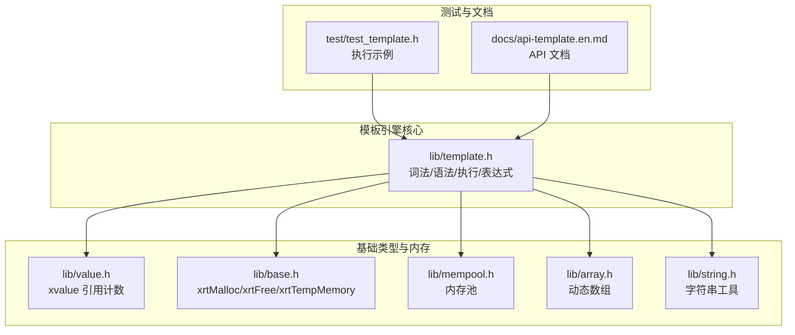
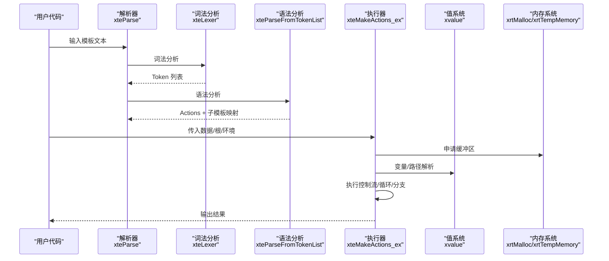
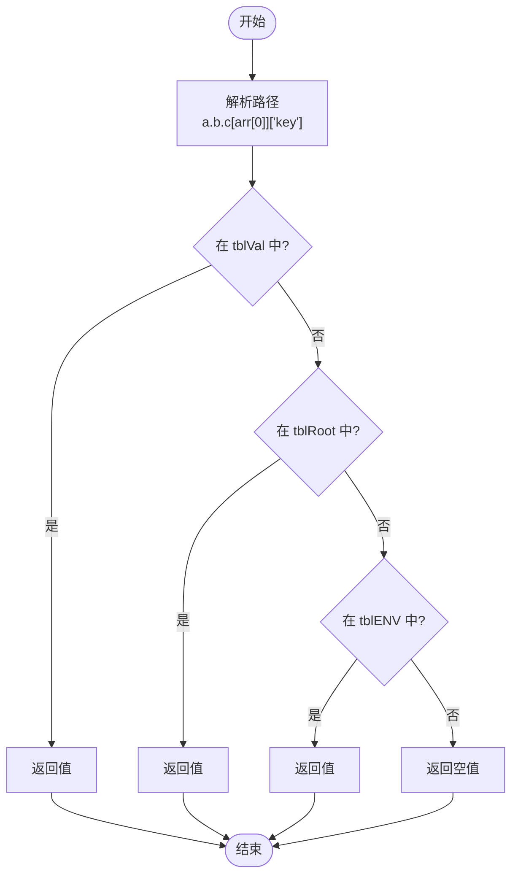
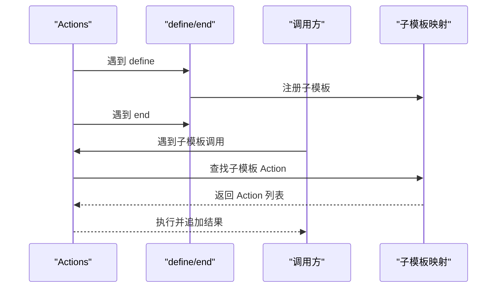
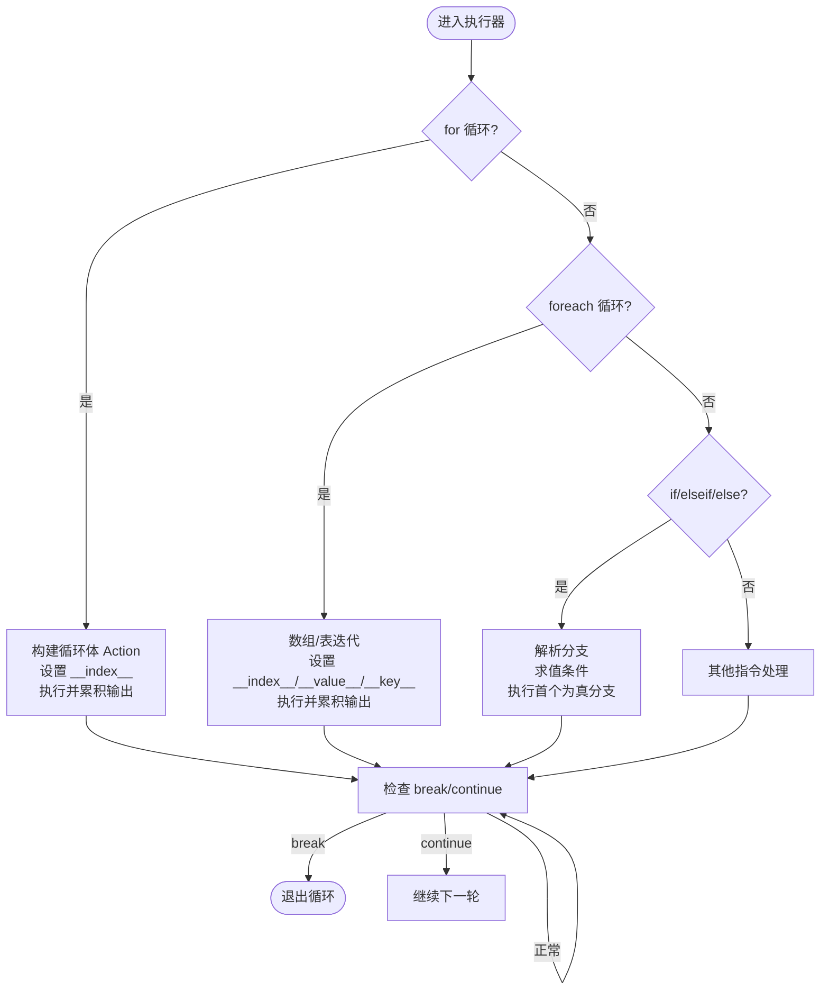
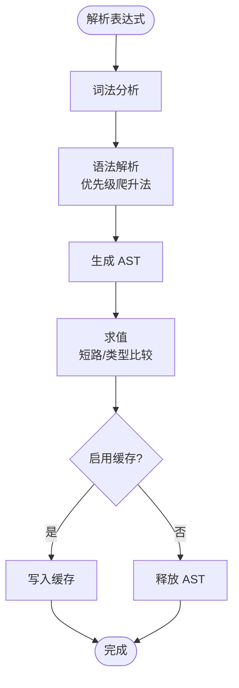
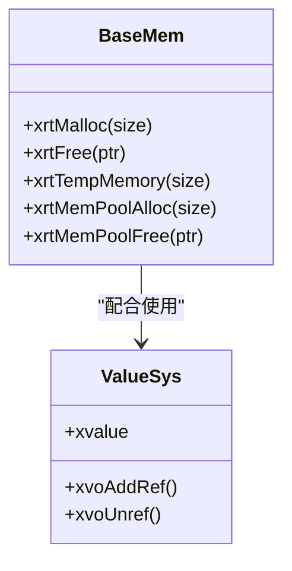
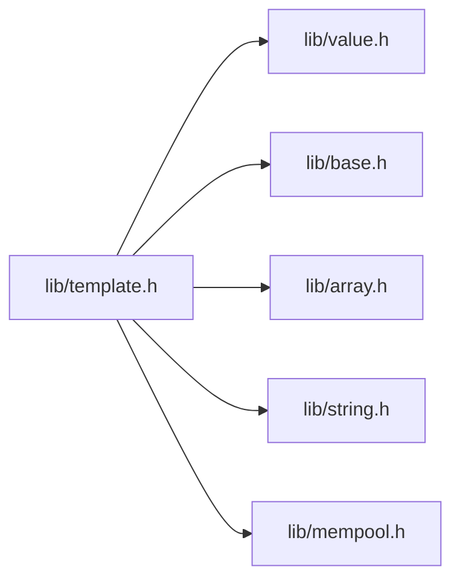

# 执行引擎

<cite>
**本文引用的文件**
- [lib/template.h](file://lib/template.h)
- [lib/value.h](file://lib/value.h)
- [lib/base.h](file://lib/base.h)
- [lib/mempool.h](file://lib/mempool.h)
- [lib/array.h](file://lib/array.h)
- [lib/string.h](file://lib/string.h)
- [test/test_template.h](file://test/test_template.h)
- [docs/api-template.en.md](file://docs/api-template.en.md)
</cite>

## 目录
1. [简介](#简介)
2. [项目结构](#项目结构)
3. [核心组件](#核心组件)
4. [架构总览](#架构总览)
5. [详细组件分析](#详细组件分析)
6. [依赖关系分析](#依赖关系分析)
7. [性能考量](#性能考量)
8. [故障排查指南](#故障排查指南)
9. [结论](#结论)
10. [附录](#附录)

## 简介
本文件系统性阐述 XRT 模板引擎执行引擎的实现与使用方法，重点覆盖以下主题：
- 执行上下文与变量作用域机制
- 模板栈与子模板管理
- 执行流程控制（指令调度、循环、条件分支、异常处理）
- 内存管理策略（临时内存、引用计数、内存池）
- 模板执行优化（AST 缓存、热点表达式优化）
- 调试支持（执行跟踪、性能监控、错误诊断）
- 实战示例与最佳实践

## 项目结构
XRT 模板引擎位于 lib/template.h，配套基础类型与内存管理位于 lib/value.h、lib/base.h、lib/mempool.h、lib/array.h、lib/string.h；测试用例位于 test/test_template.h；API 文档位于 docs/api-template.en.md。

**图表来源**
- [lib/template.h](file://lib/template.h#L1-L200)
- [lib/value.h](file://lib/value.h#L1-L120)
- [lib/base.h](file://lib/base.h#L1-L132)
- [lib/mempool.h](file://lib/mempool.h#L1-L120)
- [lib/array.h](file://lib/array.h#L1-L120)
- [lib/string.h](file://lib/string.h#L1-L120)
- [test/test_template.h](file://test/test_template.h#L1-L120)
- [docs/api-template.en.md](file://docs/api-template.en.md#L315-L400)

**章节来源**
- [lib/template.h](file://lib/template.h#L1-L200)
- [lib/value.h](file://lib/value.h#L1-L120)
- [lib/base.h](file://lib/base.h#L1-L132)
- [lib/mempool.h](file://lib/mempool.h#L1-L120)
- [lib/array.h](file://lib/array.h#L1-L120)
- [lib/string.h](file://lib/string.h#L1-L120)
- [test/test_template.h](file://test/test_template.h#L1-L120)
- [docs/api-template.en.md](file://docs/api-template.en.md#L315-L400)

## 核心组件
- 词法/语法/执行管线
  - 词法分析：将模板文本切分为 Token 列表，支持自定义标识符扩展。
  - 语法分析：将 Token 转为可执行的 Action 列表，并建立子模板映射。
  - 执行阶段：按 Action 顺序执行，支持文本、变量代入、数字/时间格式化、布尔分支、循环、子模板、包含文件等。
- 变量与作用域
  - 通过 xvalue 表达任意数据类型，支持引用计数自动回收。
  - 作用域按“当前值 -> 根值 -> 环境”顺序查找，支持路径解析器。
- 表达式求值
  - 自定义表达式语法（and/or/not/比较），AST 生成与求值，带缓存以提升热点表达式性能。
- 内存管理
  - 基础分配：xrtMalloc/xrtFree
  - 临时内存：xrtTempMemory（环形缓冲，线程不安全）
  - 引用计数：xvalue 引用计数与自动释放
  - 内存池：xrtMemPoolAlloc/xrtMemPoolFree，带 GC 能力

**章节来源**
- [lib/template.h](file://lib/template.h#L850-L1080)
- [lib/value.h](file://lib/value.h#L32-L120)
- [lib/base.h](file://lib/base.h#L49-L132)
- [lib/mempool.h](file://lib/mempool.h#L1-L120)

## 架构总览
模板引擎执行架构由“解析 -> 编译 -> 执行 -> 求值”四阶段构成，贯穿变量解析、作用域查找、控制流与循环、表达式 AST 缓存等关键能力。

**图表来源**
- [lib/template.h](file://lib/template.h#L1049-L1080)
- [lib/template.h](file://lib/template.h#L2112-L2120)
- [lib/value.h](file://lib/value.h#L320-L425)
- [lib/base.h](file://lib/base.h#L49-L132)

**章节来源**
- [lib/template.h](file://lib/template.h#L1049-L1080)
- [lib/template.h](file://lib/template.h#L2112-L2120)
- [lib/value.h](file://lib/value.h#L320-L425)
- [lib/base.h](file://lib/base.h#L49-L132)

## 详细组件分析

### 1) 执行上下文与变量作用域
- 上下文结构
  - XTE_LiteObject：包含 Actions、子模板映射、原始 Token 列表。
  - 执行函数签名：xteMakeActions_ex(arrAction, objTemplate, tblVal, tblRoot, tblENV, tblInclude, ...)。
- 作用域查找顺序
  - 当前作用域 tblVal -> 根作用域 tblRoot -> 环境 tblENV。
  - 路径解析器支持 a.b.c、arr[0]、obj["key"] 等组合访问。
- 特殊变量
  - 子模板/数组/表的迭代中提供 __index__、__value__、__key__ 等内置变量。
  - 单值上下文（非表/数组）仅支持 __self__ 变量。

**图表来源**
- [lib/template.h](file://lib/template.h#L603-L773)
- [lib/value.h](file://lib/value.h#L320-L425)

**章节来源**
- [lib/template.h](file://lib/template.h#L603-L773)
- [lib/template.h](file://lib/template.h#L1300-L1320)
- [lib/value.h](file://lib/value.h#L320-L425)

### 2) 模板栈与子模板管理
- 子模板注册与调用
  - define/end 标记子模板块，保存为子模板映射。
  - include 引用外部模板对象（需由调用方提供）。
  - 子模板通过 = 语法在布尔块中选择性渲染。
- 执行栈
  - 执行器内部使用 Action 列表与临时 Action 片段（如循环体）构建“执行栈”，支持嵌套控制结构。

**图表来源**
- [lib/template.h](file://lib/template.h#L888-L968)
- [lib/template.h](file://lib/template.h#L1430-L1468)
- [lib/template.h](file://lib/template.h#L1646-L1684)

**章节来源**
- [lib/template.h](file://lib/template.h#L888-L968)
- [lib/template.h](file://lib/template.h#L1430-L1468)
- [lib/template.h](file://lib/template.h#L1646-L1684)

### 3) 执行流程控制
- 指令调度
  - 文本节点直接追加到输出缓冲。
  - 变量/数字/时间/布尔/数组/过程/子模板/include 等按类型分支处理。
- 条件分支
  - if/elseif/else：解析多个分支，按条件求值选择首个为真的分支执行，支持嵌套。
- 循环控制
  - for：支持起止与步长，自动修正步长方向与零步长，内置最大迭代次数保护。
  - foreach：支持数组与表，表迭代通过回调遍历，内置最大迭代次数保护。
  - break/continue：通过标志位在执行器外层循环生效。
- 异常处理
  - 语法错误（未闭合、参数超限、未识别标识符等）通过 XTE_ERROR_DESC 映射错误码。
  - 执行期错误（子模板缺失、参数类型不匹配、数组元素生成失败）以文本形式回填并继续处理。

**图表来源**
- [lib/template.h](file://lib/template.h#L1761-L1827)
- [lib/template.h](file://lib/template.h#L1828-L1874)
- [lib/template.h](file://lib/template.h#L1684-L1760)

**章节来源**
- [lib/template.h](file://lib/template.h#L1761-L1827)
- [lib/template.h](file://lib/template.h#L1828-L1874)
- [lib/template.h](file://lib/template.h#L1684-L1760)

### 4) 表达式求值与缓存
- 语法支持
  - 字面量（整数/浮点/布尔/字符串）、标识符（含路径）、括号、一元 not、二元 and/or/比较。
- 求值策略
  - AST 生成（优先级爬升法），支持短路求值（and/or）。
  - 比较运算对数值、字符串、时间、布尔分别处理。
- 性能优化
  - 表达式 AST 缓存（XTE_EXPR_CACHE），热点表达式避免重复解析。

**图表来源**
- [lib/template.h](file://lib/template.h#L2670-L2719)
- [lib/template.h](file://lib/template.h#L2848-L2940)
- [lib/template.h](file://lib/template.h#L1005-L1014)

**章节来源**
- [lib/template.h](file://lib/template.h#L2670-L2719)
- [lib/template.h](file://lib/template.h#L2848-L2940)
- [lib/template.h](file://lib/template.h#L1005-L1014)

### 5) 内存管理策略
- 基础分配
  - xrtMalloc/xrtFree：统一入口，失败时设置错误。
- 临时内存
  - xrtTempMemory：环形缓冲，线程不安全，适合短期中间数据。
- 引用计数
  - xvalue：自动引用计数，计数归零时释放对象及其子对象。
- 内存池
  - xrtMemPoolAlloc/xrtMemPoolFree：按大小分级的内存池，支持 GC 标记回收。

**图表来源**
- [lib/base.h](file://lib/base.h#L49-L132)
- [lib/mempool.h](file://lib/mempool.h#L1-L120)
- [lib/value.h](file://lib/value.h#L32-L120)

**章节来源**
- [lib/base.h](file://lib/base.h#L49-L132)
- [lib/mempool.h](file://lib/mempool.h#L1-L120)
- [lib/value.h](file://lib/value.h#L32-L120)

### 6) 执行优化技术
- 指令缓存
  - 子模板与 include 模板对象复用，避免重复解析。
- 热点表达式优化
  - AST 缓存减少重复解析成本。
- 执行状态持久化
  - 通过 XTE_LiteObject 持久化编译产物，多次渲染共享。
- 临时内存与缓冲
  - 执行期间使用自增长缓冲区，减少频繁扩容。

**章节来源**
- [lib/template.h](file://lib/template.h#L1005-L1014)
- [lib/template.h](file://lib/template.h#L1067-L1081)
- [lib/base.h](file://lib/base.h#L49-L70)

### 7) 调试支持
- 错误定位
  - 词法/语法阶段提供行号、列号、位置信息，便于快速定位。
- 执行跟踪
  - 脚本块 Token 类型打印（调试用途），可扩展为更细粒度日志。
- 性能监控
  - 建议结合外部计时器统计 xteMakeActions_ex 执行耗时。
- 错误诊断
  - 通过 XTE_ERROR_DESC 映射错误码，结合 ErrorRefLine/Pos 定位源模板。

**章节来源**
- [lib/template.h](file://lib/template.h#L850-L854)
- [lib/template.h](file://lib/template.h#L1887-L1892)

## 依赖关系分析
- 模板引擎依赖值系统进行变量与集合操作，依赖基础内存接口进行分配与释放，依赖数组与字符串工具进行容器与文本处理。
- 执行器内部通过 Action 列表驱动，子模板映射提供模块化能力，表达式系统提供条件判断与布尔运算。

**图表来源**
- [lib/template.h](file://lib/template.h#L1-L200)
- [lib/value.h](file://lib/value.h#L1-L120)
- [lib/base.h](file://lib/base.h#L1-L132)
- [lib/array.h](file://lib/array.h#L1-L120)
- [lib/string.h](file://lib/string.h#L1-L120)
- [lib/mempool.h](file://lib/mempool.h#L1-L120)

**章节来源**
- [lib/template.h](file://lib/template.h#L1-L200)
- [lib/value.h](file://lib/value.h#L1-L120)
- [lib/base.h](file://lib/base.h#L1-L132)
- [lib/array.h](file://lib/array.h#L1-L120)
- [lib/string.h](file://lib/string.h#L1-L120)
- [lib/mempool.h](file://lib/mempool.h#L1-L120)

## 性能考量
- 词法/语法阶段一次性完成，执行阶段仅顺序扫描 Action 列表，时间复杂度 O(N)。
- 表达式 AST 缓存显著降低重复解析成本，建议在高频模板中启用。
- 循环与迭代内置最大迭代次数保护，防止无限循环导致资源耗尽。
- 临时内存与自增长缓冲减少分配与拷贝，建议在高并发场景配合内存池使用。

## 故障排查指南
- 常见错误
  - 语法错误：未闭合、参数过多、未识别标识符等，查看 ErrorLine/Pos 与 ErrorDesc。
  - 执行期错误：子模板缺失、参数类型不匹配、数组元素生成失败，执行器会回填提示文本。
- 排查步骤
  - 确认模板语法正确，尤其是 define/include/子模板命名。
  - 检查数据结构与路径，确保变量存在于当前/根/环境作用域。
  - 对热点表达式开启缓存，观察性能改善。
  - 使用测试用例验证关键路径行为。

**章节来源**
- [lib/template.h](file://lib/template.h#L850-L854)
- [lib/template.h](file://lib/template.h#L1518-L1580)
- [test/test_template.h](file://test/test_template.h#L1-L200)

## 结论
XRT 模板引擎执行引擎以清晰的解析-编译-执行流水线为核心，结合完善的变量作用域、子模板模块化、表达式 AST 缓存与内存管理策略，在保证易用性的同时兼顾性能与稳定性。通过本文档的架构与实现细节，读者可高效集成、优化与排障。

## 附录

### A. 关键 API 一览（路径参考）
- 词法/语法/执行
  - [xteParse](file://lib/template.h#L1049-L1062)
  - [xteLexer](file://lib/template.h#L240-L587)
  - [xteParseFromTokenList](file://lib/template.h#L857-L968)
  - [xteMakeActions_ex](file://lib/template.h#L1300-L1320)
  - [xteMake](file://lib/template.h#L2117-L2120)
- 路径解析
  - [xteResolvePath](file://lib/template.h#L603-L773)
- 表达式
  - [xteExprParse](file://lib/template.h#L2670-L2719)
  - [xteExprEvalBool](file://lib/template.h#L2942-L2987)
- 值系统
  - [xvalue 引用计数](file://lib/value.h#L32-L120)
  - [xvoGetText/xvoGetBool 等](file://lib/value.h#L320-L425)
- 内存
  - [xrtMalloc/xrtFree/xrtTempMemory](file://lib/base.h#L49-L132)
  - [xrtMemPoolAlloc/xrtMemPoolFree](file://lib/mempool.h#L148-L385)
- 测试
  - [test/test_template.h](file://test/test_template.h#L1-L200)

**章节来源**
- [lib/template.h](file://lib/template.h#L240-L587)
- [lib/template.h](file://lib/template.h#L857-L968)
- [lib/template.h](file://lib/template.h#L1049-L1062)
- [lib/template.h](file://lib/template.h#L1300-L1320)
- [lib/template.h](file://lib/template.h#L2117-L2120)
- [lib/template.h](file://lib/template.h#L603-L773)
- [lib/template.h](file://lib/template.h#L2670-L2719)
- [lib/template.h](file://lib/template.h#L2942-L2987)
- [lib/value.h](file://lib/value.h#L32-L120)
- [lib/value.h](file://lib/value.h#L320-L425)
- [lib/base.h](file://lib/base.h#L49-L132)
- [lib/mempool.h](file://lib/mempool.h#L148-L385)
- [test/test_template.h](file://test/test_template.h#L1-L200)