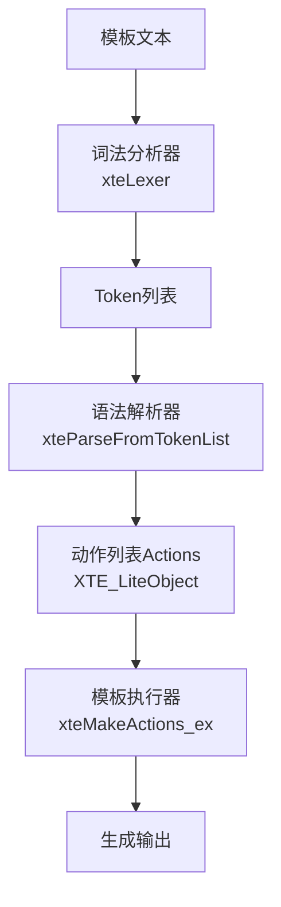
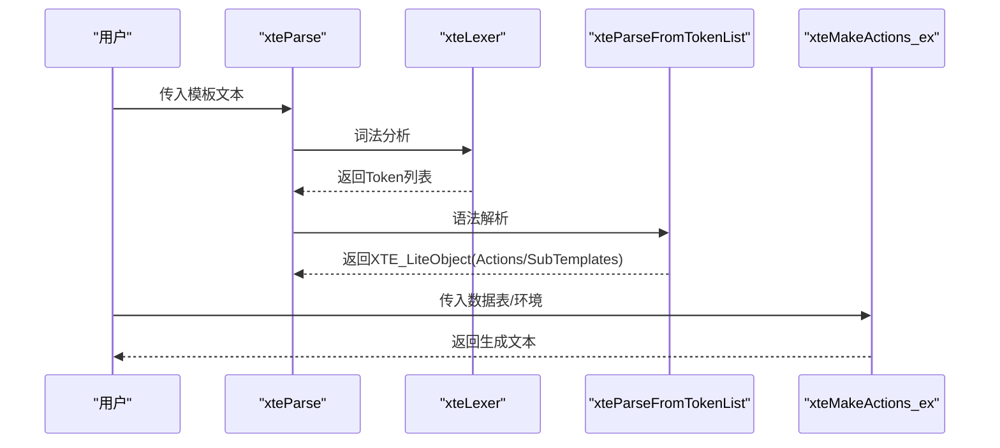
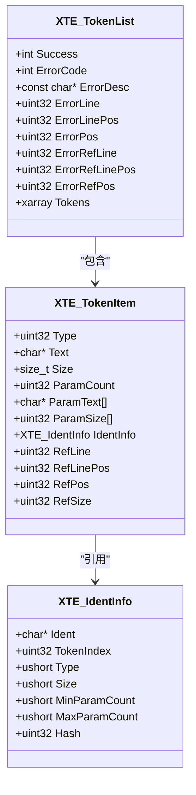
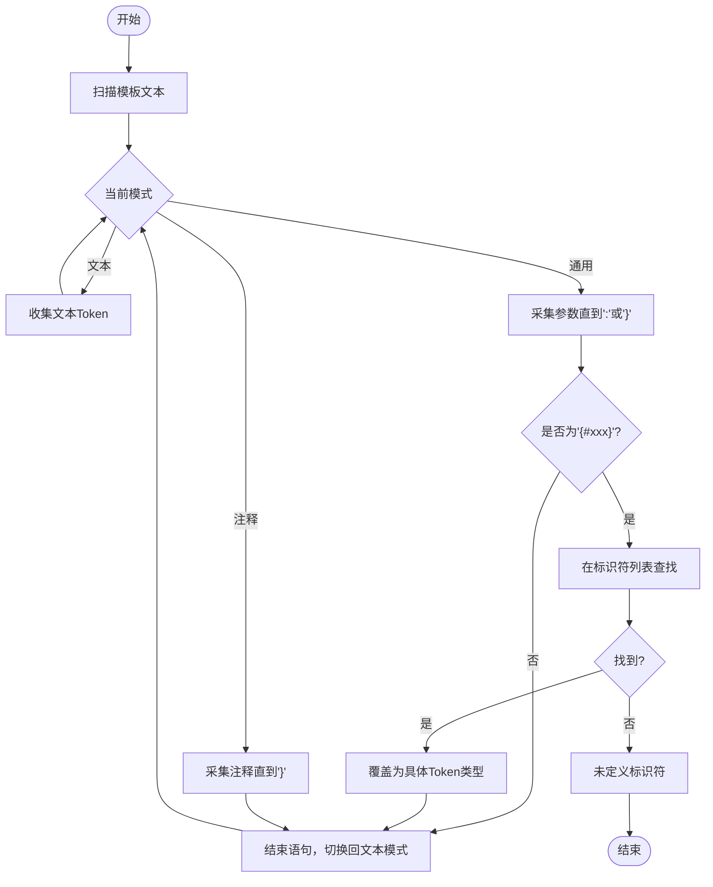
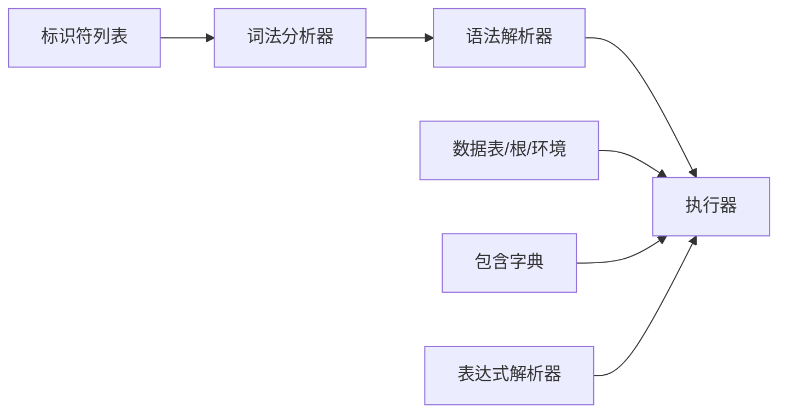

# 模板语法详解

<cite>
**本文档引用的文件**
- [lib/template.h](file://lib/template.h)
- [docs/api-template.md](file://docs/api-template.md)
- [test/test_template.h](file://test/test_template.h)
</cite>

## 目录
1. [简介](#简介)
2. [项目结构](#项目结构)
3. [核心组件](#核心组件)
4. [架构总览](#架构总览)
5. [详细组件分析](#详细组件分析)
6. [依赖关系分析](#依赖关系分析)
7. [性能考量](#性能考量)
8. [故障排查指南](#故障排查指南)
9. [结论](#结论)
10. [附录](#附录)

## 简介
本文件面向XRT模板引擎的使用者与开发者，系统性梳理模板语法规范与实现细节，涵盖：
- 模板语法结构与符号体系
- 操作符与参数传递机制
- 各类模板指令（变量代入、控制流、结构、特殊指令）
- 语法扩展机制（自定义指令注册、参数校验、错误处理）
- 语法解析规则（嵌套、作用域、优先级）
- 丰富的示例与最佳实践

## 项目结构
XRT模板引擎位于lib/template.h，配套API文档在docs/api-template.md，行为验证在test/test_template.h中。整体采用“词法分析→语法解析→动作编译→执行”的流水线设计。

图表来源
- [lib/template.h](file://lib/template.h#L240-L587)
- [lib/template.h](file://lib/template.h#L858-L968)
- [lib/template.h](file://lib/template.h#L1301-L2121)

章节来源
- [lib/template.h](file://lib/template.h#L240-L587)
- [docs/api-template.md](file://docs/api-template.md#L1-L200)

## 核心组件
- 词法分析器：负责扫描模板文本，识别Token类型与参数，支持转义与块模式。
- 语法解析器：将Token列表转换为动作列表与子模板字典，校验语句闭合与嵌套。
- 执行器：按动作序列执行，支持变量解析、路径访问、控制流、循环与子模板调用。
- 表达式解析器：独立的布尔表达式求值器，支持AST缓存与短路求值。

章节来源
- [lib/template.h](file://lib/template.h#L858-L968)
- [lib/template.h](file://lib/template.h#L1301-L2121)
- [lib/template.h](file://lib/template.h#L2125-L2988)

## 架构总览
模板引擎采用“轻量级”与“完整版”双阶段设计：
- 轻量级阶段：支持基础变量代入与子模板调用，适合简单场景。
- 完整版阶段：支持控制流、循环、break/continue、include等，需注册内置标识符。

图表来源
- [lib/template.h](file://lib/template.h#L1049-L1062)
- [lib/template.h](file://lib/template.h#L858-L968)
- [lib/template.h](file://lib/template.h#L1301-L2121)

## 详细组件分析

### 1. 基本语法与符号体系
- 模板起始与结束：由花括号{}包裹；若需输出字面量{或}，使用{{或}}转义。
- 操作符：
  - 变量代入：{$var}、{%num}、{&time}、{?bool}
  - 数组/子模板：{*arr}、{=subtpl}
  - 控制流：{#if}、{#elseif}、{#else}、{#end}、{#for}、{#foreach}、{#break}、{#continue}
  - 结构：{#define}、{#include}、{#script}
  - 特殊：{!comment}、{@proc}
- 参数分隔符：冒号:，支持转义\:
- 转义规则：语句内转义符\，用于转义{、}、:、\本身。

章节来源
- [lib/template.h](file://lib/template.h#L4-L11)
- [docs/api-template.md](file://docs/api-template.md#L1351-L1361)

### 2. 变量代入指令
- {$var[:fmt]}：字符串变量，支持默认值与格式化（如数字格式）。
- {%var[:fmt]}：数值变量，支持整数/浮点/字符串解析与格式化。
- {&var[:format]}：时间变量，支持自定义格式或默认格式。
- {?var[:true-part][:false-part]}：布尔条件代入，支持模板/函数/字符串三种参数形式。
- {*arr[:alias]}：数组/表迭代，内部可使用__index/__value/__key。
- {=subtpl[:param...]}：子模板代入，支持参数传递与__self。

章节来源
- [docs/api-template.md](file://docs/api-template.md#L23-L110)
- [lib/template.h](file://lib/template.h#L1325-L1514)
- [lib/template.h](file://lib/template.h#L1608-L1645)

### 3. 控制流指令
- {#if:expr}...{#elseif:expr}...{#else}...{#end}：条件分支，表达式支持比较与逻辑运算。
- {#for:start:end:step}...{#end}：计次循环，内部可用__index。
- {#foreach:items[:alias]}...{#end}：迭代循环，数组用__index/__value，表用__key/__value。
- {#break}/{#continue}：循环控制，仅影响最近一层循环。

章节来源
- [docs/api-template.md](file://docs/api-template.md#L82-L198)
- [lib/template.h](file://lib/template.h#L1684-L1760)
- [lib/template.h](file://lib/template.h#L1761-L1827)
- [lib/template.h](file://lib/template.h#L1828-L1874)
- [lib/template.h](file://lib/template.h#L1875-L1886)

### 4. 结构指令
- {#define:name}...{#end}：定义子模板，内部可使用{$__self}访问代入值；子模板不可嵌套。
- {#include:name}：引用外部模板（需提供包含字典）。
- {#script:lang}...{#end}：脚本块（当前未启用具体脚本执行）。

章节来源
- [docs/api-template.md](file://docs/api-template.md#L989-L1011)
- [lib/template.h](file://lib/template.h#L892-L903)
- [lib/template.h](file://lib/template.h#L1646-L1683)

### 5. 特殊指令
- {!comment}：注释，不参与输出。
- {@proc[:params...]}：函数/流程调用（当前未启用具体实现）。
- {=subtpl}：子模板调用（同上）。

章节来源
- [docs/api-template.md](file://docs/api-template.md#L232-L237)
- [lib/template.h](file://lib/template.h#L1581-L1607)

### 6. 语法扩展机制
- 自定义指令注册：通过xteCreateIdentList/xteAddIdentToList注册，支持单语句与语句块两类。
- 参数校验：最小/最大参数数量约束，参数过多/过少时报错。
- 错误处理：统一错误码与描述，定位源文件行列与位置。

图表来源
- [docs/api-template.md](file://docs/api-template.md#L315-L397)
- [lib/template.h](file://lib/template.h#L119-L173)

章节来源
- [docs/api-template.md](file://docs/api-template.md#L401-L466)
- [lib/template.h](file://lib/template.h#L979-L1014)

### 7. 语法解析规则
- 嵌套规则：支持任意层级嵌套，通过匹配end索引推进。
- 作用域规则：变量解析顺序为当前作用域→根作用域→环境变量；子模板内部可用__self。
- 优先级规则：表达式解析采用优先级爬升法，支持括号与短路求值。
- 循环限制：for/foreach默认最大迭代次数（防止无限循环）。

图表来源
- [lib/template.h](file://lib/template.h#L299-L549)

章节来源
- [lib/template.h](file://lib/template.h#L240-L587)
- [lib/template.h](file://lib/template.h#L1122-L1200)

### 8. 执行与数据模型
- 路径解析：支持a.b.c、arr[0]、obj["key"]、arr[0].name等组合访问。
- 变量解析：优先当前作用域，其次根作用域，最后环境变量。
- 子模板：通过字典管理，define块内不可嵌套define。

章节来源
- [docs/api-template.md](file://docs/api-template.md#L527-L591)
- [lib/template.h](file://lib/template.h#L603-L773)
- [lib/template.h](file://lib/template.h#L892-L944)

### 9. 表达式解析与求值
- 支持运算符：=、!=、~=、>、<、>=、<=、and、or、not、()。
- AST缓存：相同表达式首次解析后缓存，提升重复求值性能。
- 短路求值：and/or支持短路，减少不必要的求值。

章节来源
- [docs/api-template.md](file://docs/api-template.md#L254-L312)
- [lib/template.h](file://lib/template.h#L2125-L2988)

## 依赖关系分析
- 词法分析依赖标识符列表（内置标识符在初始化时注册）。
- 语法解析依赖Token列表与标识符信息，生成Actions与SubTemplates。
- 执行依赖数据表、根作用域、环境变量与包含字典。
- 表达式解析独立于模板执行，但共享AST缓存。

图表来源
- [lib/template.h](file://lib/template.h#L979-L1014)
- [lib/template.h](file://lib/template.h#L858-L968)
- [lib/template.h](file://lib/template.h#L1301-L2121)

章节来源
- [lib/template.h](file://lib/template.h#L979-L1046)

## 性能考量
- 表达式AST缓存：相同表达式仅解析一次，显著降低重复求值开销。
- 循环次数限制：默认最大迭代次数，防止超大循环造成资源耗尽。
- 内存管理：Token/动作/子模板均采用动态数组与字典管理，释放需遵循相应接口。

章节来源
- [docs/api-template.md](file://docs/api-template.md#L1238-L1291)
- [lib/template.h](file://lib/template.h#L62-L65)
- [lib/template.h](file://lib/template.h#L1067-L1081)

## 故障排查指南
常见错误与定位方法：
- 语法错误：检查是否遗漏{#end}、标识符未注册、参数过多/过少。
- 变量未定义：确认变量存在于当前/根/环境作用域。
- 循环异常：检查步长与方向是否匹配，避免无限循环。
- 子模板缺失：确认{=subtpl}引用的子模板已定义且名称正确。

章节来源
- [docs/api-template.md](file://docs/api-template.md#L1333-L1347)
- [test/test_template.h](file://test/test_template.h#L583-L591)

## 结论
XRT模板引擎提供了简洁而强大的模板语法，既能满足快速开发需求，又具备良好的扩展性与性能保障。通过清晰的语法规范、完善的错误处理与AST缓存机制，可在复杂业务场景中稳定高效地生成目标文本。

## 附录

### A. 语法示例与最佳实践
- 变量代入与格式化：参考测试用例中对{$name}、{%price:.2}、{&time:yyyy-mm-dd}的使用。
- 条件判断：使用{#if}、{#elseif}、{#else}配合表达式求值。
- 循环与控制：for计次循环、foreach数组/表迭代，结合{#break}/{#continue}。
- 子模板：使用{#define}定义，{=subtpl}调用，并在子模板内使用{$__self}。
- include：通过包含字典传入外部模板，实现模块化复用。
- 错误处理：始终检查解析与执行结果，及时释放资源。

章节来源
- [test/test_template.h](file://test/test_template.h#L13-L58)
- [test/test_template.h](file://test/test_template.h#L206-L358)
- [test/test_template.h](file://test/test_template.h#L583-L622)
- [docs/api-template.md](file://docs/api-template.md#L1134-L1291)