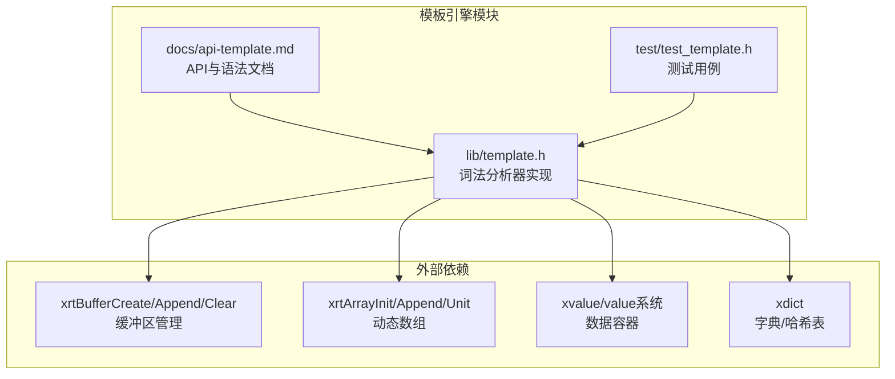
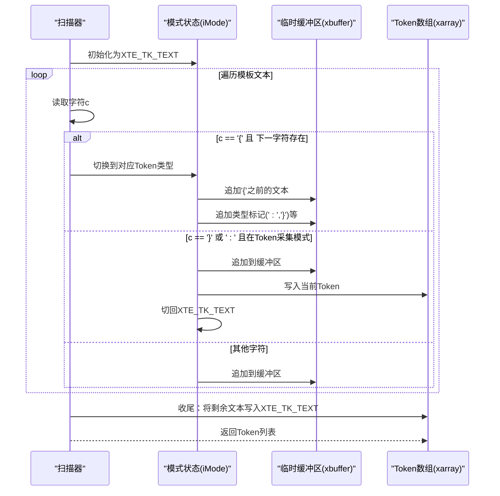
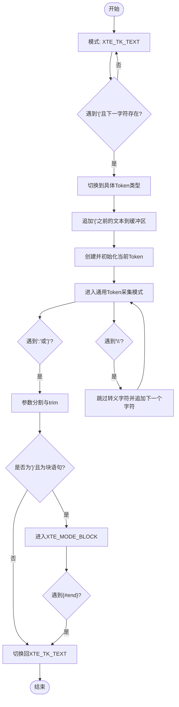
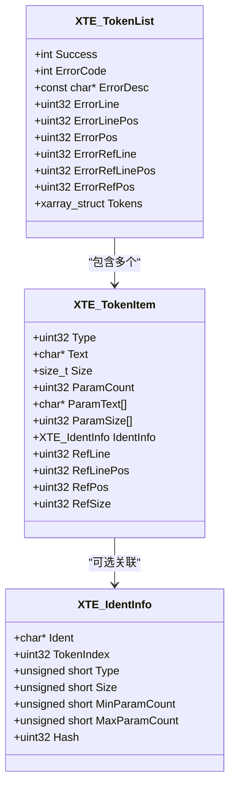
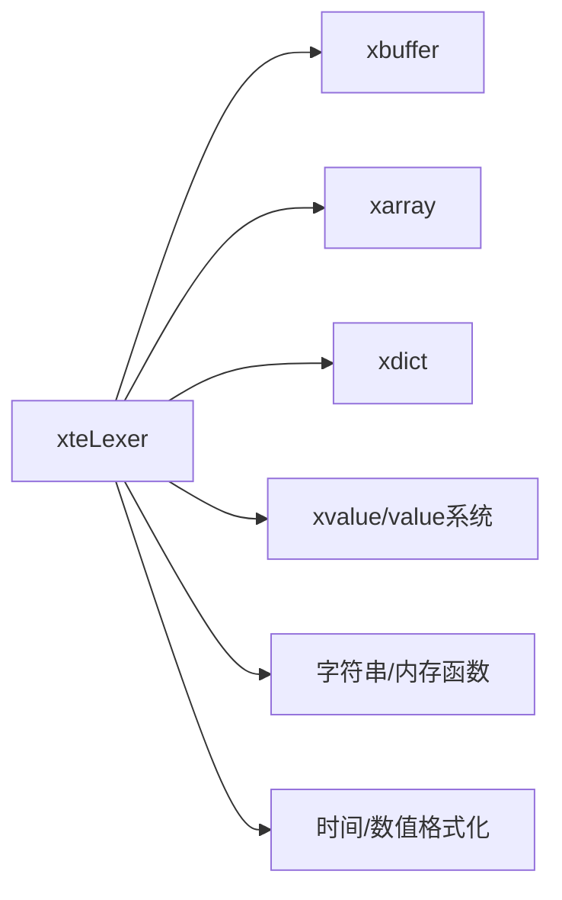

# 词法分析器

<cite>
**本文档引用的文件**
- [lib/template.h](file://lib/template.h)
- [docs/api-template.md](file://docs/api-template.md)
- [test/test_template.h](file://test/test_template.h)
</cite>

## 目录
1. [简介](#简介)
2. [项目结构](#项目结构)
3. [核心组件](#核心组件)
4. [架构总览](#架构总览)
5. [详细组件分析](#详细组件分析)
6. [依赖关系分析](#依赖关系分析)
7. [性能考虑](#性能考虑)
8. [故障排查指南](#故障排查指南)
9. [结论](#结论)
10. [附录](#附录)

## 简介
本文件面向XRT模板引擎的词法分析器，系统性阐述其架构设计、Token类型体系、扫描模式切换机制、转义符处理策略、模板符号系统、Token列表构建过程、错误处理机制以及性能优化技巧。文档既适合初学者快速理解，也提供足够深度的技术细节供进阶开发者参考。

## 项目结构
XRT模板引擎位于lib目录下的template.h中，配套文档在docs/api-template.md，测试用例在test/test_template.h。词法分析器的核心实现集中在xteLexer函数及其相关工具函数中，配合标识符注册、Token结构体定义、错误码与调试信息收集机制共同构成完整的词法分析体系。

图表来源
- [lib/template.h](file://lib/template.h#L240-L587)
- [docs/api-template.md](file://docs/api-template.md#L401-L525)

章节来源
- [lib/template.h](file://lib/template.h#L1-L120)
- [docs/api-template.md](file://docs/api-template.md#L1-L120)

## 核心组件
- Token类型定义：涵盖基础文本、变量、数字、时间、布尔、数组、过程、子模板、符号等，以及扩展控制语句类型与块模式。
- 扫描模式切换：从XTE_TK_TEXT到各Token类型的采集模式，以及XTE_MODE_BLOCK块采集模式。
- 转义符处理：针对模板符号、参数分隔符、语句内转义的统一策略。
- 模板符号系统：花括号{{}}转义、操作符识别、参数分隔符处理。
- Token列表构建：从模板文本到Token数组的转换算法，缓冲区与内存管理。
- 错误处理：语法错误定位、错误码定义、调试信息收集。
- 性能优化：跳过转义符的注释模式、参数trim、最大迭代次数限制等。

章节来源
- [lib/template.h](file://lib/template.h#L25-L61)
- [lib/template.h](file://lib/template.h#L240-L587)
- [docs/api-template.md](file://docs/api-template.md#L401-L525)

## 架构总览
词法分析器采用“状态机+缓冲区”的设计：以iMode为状态机核心，按字符流逐个扫描，遇到模板起始符号'{'时切换到相应Token采集模式；在采集过程中利用xbuffer累积片段，遇到'}'或':'时进行参数分割与trim处理；对于{#xxx}块语句，进入XTE_MODE_BLOCK直到遇到{#end}才退出。最终将所有Token写入xarray数组，形成Token列表。

图表来源
- [lib/template.h](file://lib/template.h#L282-L550)

## 详细组件分析

### Token类型与标识符体系
- 基础Token：
  - XTE_TK_TEXT：普通文本
  - XTE_TK_COMMEN：注释{! ... }
  - XTE_TK_VAR：变量{$ ...}
  - XTE_TK_NUM：数字{% ...}
  - XTE_TK_TIME：时间{& ...}
  - XTE_TK_BOOL：条件{? ...}
  - XTE_TK_ARR：数组{* ...}
  - XTE_TK_PROC：过程{@ ...}
  - XTE_TK_SUBTEMPLATE：子模板{= ...}
  - XTE_TK_SYMBOL：符号{# ...}
- 扩展控制语句：
  - XTE_TK_IF/ELSEIF/ELSE/XTE_TK_FOR/XTE_TK_FOREACH/XTE_TK_BREAK/XTE_TK_CONTINUE/XTE_TK_END等
- 标识符类型：
  - XTE_IDTPE_DEFAULT：单语句
  - XTE_IDTPE_BLOCK：独立语句块（以{#end}结尾）

章节来源
- [lib/template.h](file://lib/template.h#L25-L61)
- [docs/api-template.md](file://docs/api-template.md#L315-L374)

### 扫描模式切换机制
- XTE_TK_TEXT：默认采集模式，遇'{'触发类型识别。
- XTE_TK_COMMEN：注释模式，跳过转义符，不处理参数列表。
- 通用Token模式：遇到'\'进行转义处理，遇到':'或'}'进行参数分割与trim。
- XTE_MODE_BLOCK：块采集模式，仅在遇到{#end}时退出。

图表来源
- [lib/template.h](file://lib/template.h#L298-L549)

章节来源
- [lib/template.h](file://lib/template.h#L281-L550)

### 转义符处理策略
- 语句内转义：'\\'在通用Token模式中被识别为转义符，跳过下一个字符并将其追加到缓冲区。
- 注释模式：XTE_TK_COMMEN跳过转义符，不处理参数列表，提高效率。
- 花括号转义：'{{'被视为普通文本，不会触发模板解析。
- 参数分隔符转义：':'在注释模式外的通用Token模式中作为参数分隔符，遇到'\\:'时按普通字符处理。

章节来源
- [lib/template.h](file://lib/template.h#L415-L451)
- [lib/template.h](file://lib/template.h#L417-L419)
- [lib/template.h](file://lib/template.h#L301-L306)

### 模板符号系统
- 起始符号：'{'，需转义为'{{'
- 结束符号：'}'，用于结束模板标签
- 操作符识别：! $ % & ? * = @ # 用于区分不同类型Token
- 参数分隔符：':'，用于分隔参数；遇到'\\:'时按普通字符处理
- 花括号转义：'{{'不触发模板解析，作为普通文本输出

章节来源
- [lib/template.h](file://lib/template.h#L4-L11)
- [lib/template.h](file://lib/template.h#L346-L377)

### Token列表构建过程
- 输入：模板文本sText与长度iSize，可选标识符列表objIdentList与模板符号sBracket
- 输出：XTE_TokenList结构体，包含Success、ErrorCode、ErrorDesc、错误位置信息与Token数组
- 关键步骤：
  - 初始化返回结构体与Token数组
  - 遍历字符流，维护行号与列号信息
  - 使用xbuffer累积文本片段
  - 遇到'{'时根据下一字符确定Token类型并切换模式
  - 通用模式下遇到':'或'}'进行参数分割与trim
  - {#xxx}块语句进入XTE_MODE_BLOCK直到{#end}
  - 收尾阶段将剩余文本写入XTE_TK_TEXT
  - 返回Token列表

图表来源
- [docs/api-template.md](file://docs/api-template.md#L315-L374)
- [docs/api-template.md](file://docs/api-template.md#L317-L331)

章节来源
- [lib/template.h](file://lib/template.h#L240-L587)
- [docs/api-template.md](file://docs/api-template.md#L470-L525)

### 错误处理机制
- 错误码定义：包含内存申请失败、Token列表添加失败、无法识别的符号、不允许使用空符号、参数数量过多、语句未结束、未定义标识符、缺失参数、define嵌套错误、语法错误等
- 错误定位：记录ErrorLine、ErrorLinePos、ErrorPos与ErrorRefLine、ErrorRefLinePos、ErrorRefPos，便于定位源码位置
- 错误处理宏：
  - XTE_OnLexerError：词法分析阶段错误处理，释放缓冲区与Token列表
  - XTE_OnParseError：语法分析阶段错误处理，设置错误位置信息
- 调试信息：通过ErrorDesc与错误码组合，提供清晰的错误描述

章节来源
- [lib/template.h](file://lib/template.h#L69-L92)
- [lib/template.h](file://lib/template.h#L208-L210)
- [lib/template.h](file://lib/template.h#L852-L854)

### 性能优化技巧
- 注释模式优化：XTE_TK_COMMEN跳过转义符，不处理参数列表，减少不必要的trim与内存分配
- 参数trim：在参数分割时对缓冲区进行trim，避免多余空白字符
- 最大迭代次数限制：XTE_LOOP_MAX_ITERATIONS防止无限循环攻击
- 内存管理：使用xrtBufferCreate/Append/Clear与xrtArrayInit/Append/Unit，避免碎片化
- 跳过转义符：在注释模式与通用模式中，遇到'\\'直接跳过下一个字符，减少字符串处理开销

章节来源
- [lib/template.h](file://lib/template.h#L62-L65)
- [lib/template.h](file://lib/template.h#L415-L451)
- [lib/template.h](file://lib/template.h#L178-L206)

## 依赖关系分析
- 内部依赖：
  - xbuffer：用于累积文本片段，支持UTF-8编码
  - xarray：动态数组，用于存储Token列表
  - xvalue/value系统：用于数据容器与路径解析
  - xdict：用于子模板与包含模板的字典存储
- 外部依赖：
  - 字符串处理：strlen、memcpy、memmove、strncmp等
  - 内存管理：xrtMalloc/xrtFree、xrtBufferCreate/Destroy、xrtArrayInit/Unit
  - 时间与数值格式化：xrtTimeFormat、xrtNumFormat、xrtIntFormat等

图表来源
- [lib/template.h](file://lib/template.h#L240-L587)

章节来源
- [lib/template.h](file://lib/template.h#L178-L237)
- [lib/template.h](file://lib/template.h#L1048-L1081)

## 性能考虑
- 时间复杂度：线性扫描O(n)，每个字符最多常数次操作
- 空间复杂度：O(n)用于Token列表与缓冲区
- 优化要点：
  - 使用xbuffer减少频繁realloc
  - 在注释模式跳过转义符处理，降低CPU消耗
  - 参数分割时trim缓冲区，避免多余内存占用
  - 最大迭代次数限制防止极端输入导致资源耗尽
  - 标识符哈希查找，避免全量字符串比较

## 故障排查指南
- 常见错误与定位：
  - 语法错误：检查{#end}是否匹配，确认块语句闭合
  - 参数过多：确认参数数量不超过XTE_PARAM_MAXCOUNT
  - 未定义标识符：检查objIdentList是否正确注册
  - 语句未结束：确认所有模板标签都正确闭合
- 调试建议：
  - 启用错误行号与位置信息，结合ErrorDesc定位问题
  - 使用测试用例验证转义符与参数分隔符行为
  - 对超大模板进行压力测试，观察最大迭代次数限制效果

章节来源
- [lib/template.h](file://lib/template.h#L69-L92)
- [lib/template.h](file://lib/template.h#L578-L581)
- [test/test_template.h](file://test/test_template.h#L583-L591)

## 结论
XRT模板引擎词法分析器通过清晰的状态机与缓冲区管理，实现了对模板符号系统的高效解析。其转义符处理策略、参数分隔符识别与块语句支持，使得模板语法既灵活又安全。配合完善的错误处理与性能优化机制，能够在保证正确性的前提下提供良好的运行效率。建议在生产环境中充分利用错误定位信息与最大迭代次数限制，确保系统的稳定性与安全性。

## 附录
- 实际使用示例可参考测试用例中的模板语法与路径解析示例，涵盖空格支持、时间格式化、路径解析、表达式求值与控制语句等场景。

章节来源
- [test/test_template.h](file://test/test_template.h#L9-L200)
- [test/test_template.h](file://test/test_template.h#L200-L625)