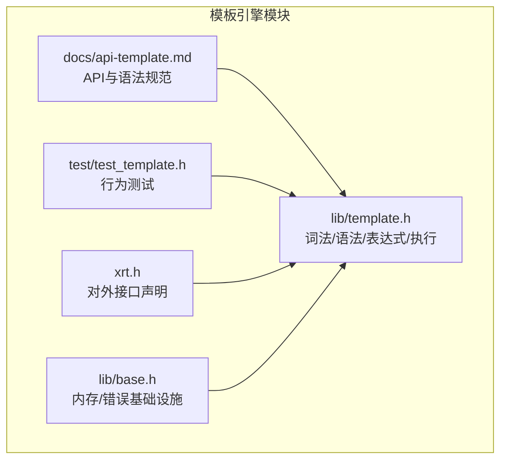
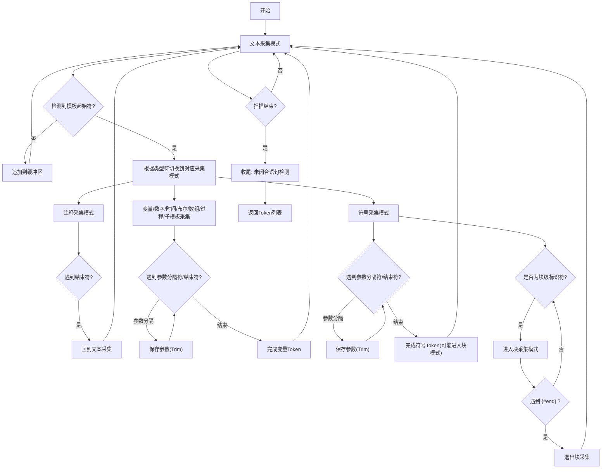
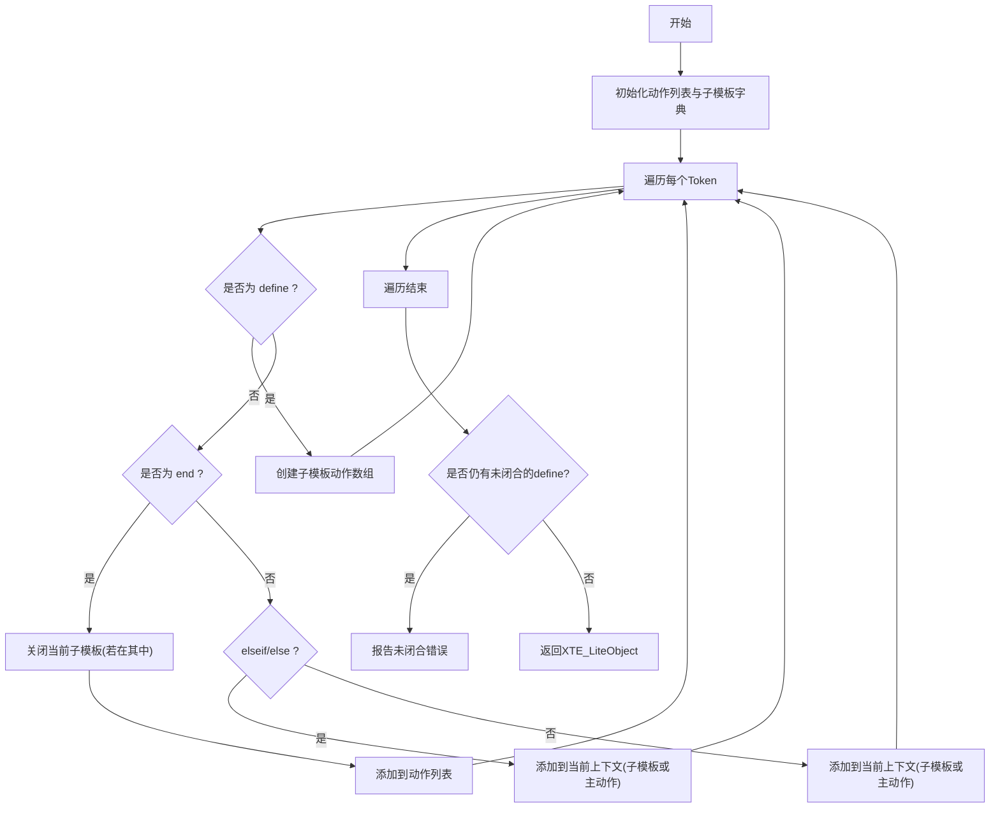
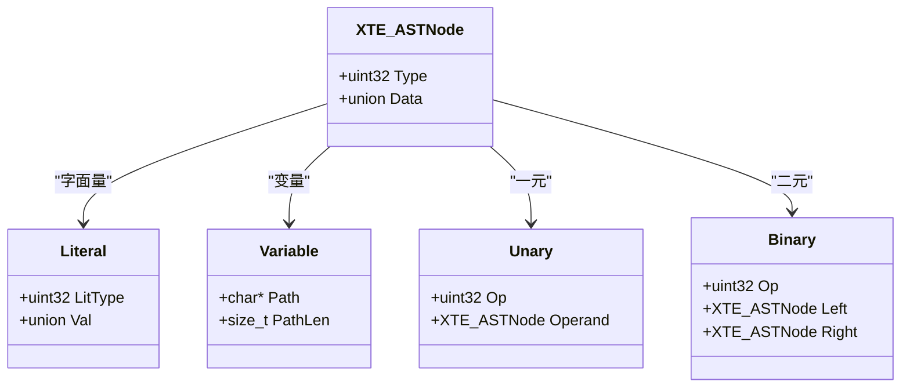
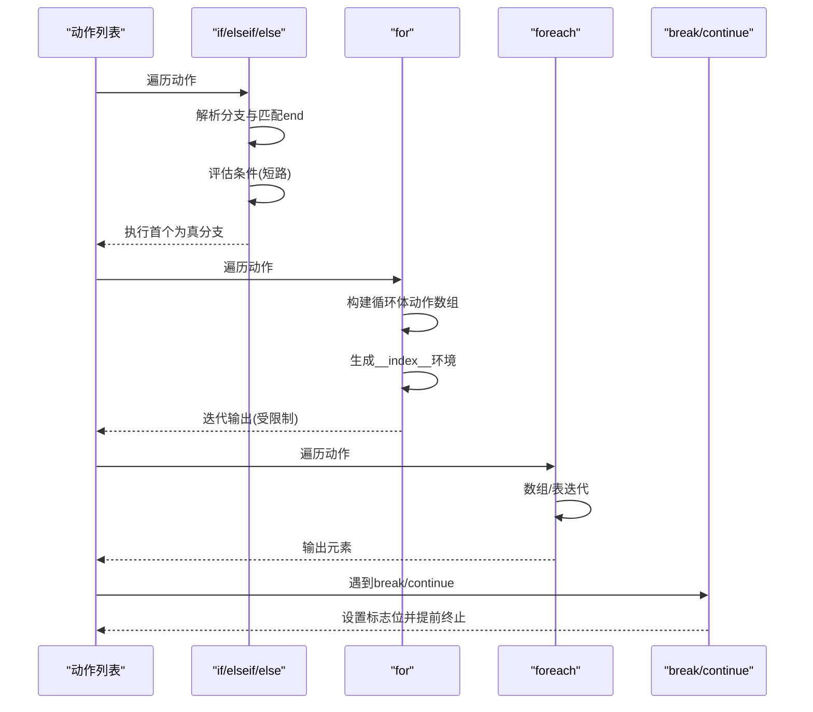
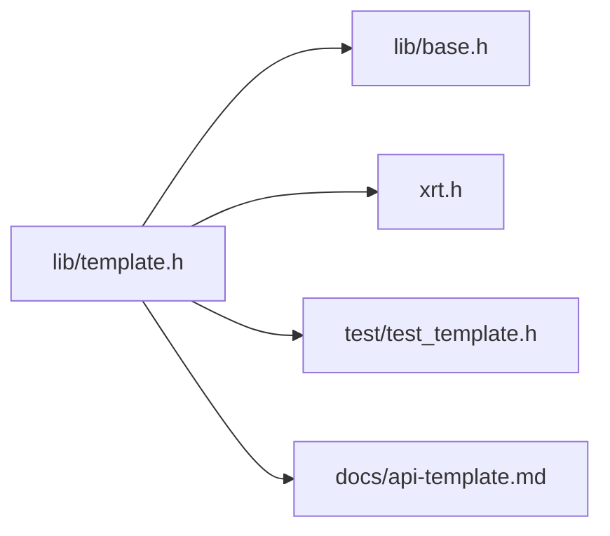

# 语法解析器

<cite>
**本文档引用的文件**
- [lib/template.h](file://lib/template.h)
- [docs/api-template.md](file://docs/api-template.md)
- [test/test_template.h](file://test/test_template.h)
- [xrt.h](file://xrt.h)
- [lib/base.h](file://lib/base.h)
</cite>

## 目录
1. [简介](#简介)
2. [项目结构](#项目结构)
3. [核心组件](#核心组件)
4. [架构总览](#架构总览)
5. [详细组件分析](#详细组件分析)
6. [依赖关系分析](#依赖关系分析)
7. [性能考量](#性能考量)
8. [故障排查指南](#故障排查指南)
9. [结论](#结论)
10. [附录](#附录)

## 简介
本文件系统性梳理 XRT 模板引擎的语法解析器实现，重点覆盖：
- 词法分析阶段：符号识别、转义处理、参数解析、错误定位
- 语法分析阶段：Token 列表到动作列表的转换，子模板注册与作用域管理
- AST（抽象语法树）构建：表达式解析器的递归下降与优先级爬升算法
- 语法规则与验证：参数数量校验、嵌套结构验证、语法冲突检测
- 执行期：控制流节点（if/for/foreach/break/continue）的执行与循环限制
- 性能优化与错误恢复：内存池、表达式 AST 缓存、循环次数限制、错误定位

## 项目结构
XRT 模板引擎位于 lib/template.h，配套 API 文档在 docs/api-template.md，行为验证在 test/test_template.h，对外接口声明在 xrt.h。基础内存分配等基础设施在 lib/base.h。



图表来源
- [lib/template.h](file://lib/template.h#L1-L120)
- [docs/api-template.md](file://docs/api-template.md#L1-L120)
- [test/test_template.h](file://test/test_template.h#L1-L60)
- [xrt.h](file://xrt.h#L2600-L2625)
- [lib/base.h](file://lib/base.h#L1-L132)

章节来源
- [lib/template.h](file://lib/template.h#L1-L120)
- [docs/api-template.md](file://docs/api-template.md#L1-L120)
- [test/test_template.h](file://test/test_template.h#L1-L60)
- [xrt.h](file://xrt.h#L2600-L2625)
- [lib/base.h](file://lib/base.h#L1-L132)

## 核心组件
- 词法分析器：将模板文本切分为 Token，支持转义、参数分隔、块采集模式
- 语法分析器：将 Token 列表转换为动作列表，注册子模板，校验未闭合块
- 表达式解析器：递归下降 + 优先级爬升，构建 AST；求值器支持短路与多类型比较
- 执行器：按动作列表生成最终文本，支持 if/for/foreach/break/continue
- 路径解析器：支持 a.b.c 与 arr[0] 的变量路径访问

章节来源
- [lib/template.h](file://lib/template.h#L240-L587)
- [lib/template.h](file://lib/template.h#L858-L968)
- [lib/template.h](file://lib/template.h#L1049-L1062)
- [lib/template.h](file://lib/template.h#L1272-L2121)
- [lib/template.h](file://lib/template.h#L591-L773)
- [lib/template.h](file://lib/template.h#L2125-L2989)

## 架构总览
模板引擎采用“词法分析 → 语法分析 → 执行”的流水线式设计。词法分析阶段产出 Token 列表；语法分析阶段将 Token 转换为动作列表，并注册子模板；执行阶段按动作列表生成输出，期间处理控制流与循环限制。

```mermaid
sequenceDiagram
participant U as "用户"
participant API as "xteParse"
participant LEX as "xteLexer"
participant PAR as "xteParseFromTokenList"
participant ACT as "动作列表"
participant EXE as "xteMake/xteMakeActions"
participant OUT as "输出"
U->>API : 调用 xteParse(模板文本)
API->>LEX : 词法分析
LEX-->>API : XTE_TokenList
API->>PAR : 语法分析
PAR-->>API : XTE_LiteObject(含 Actions/SubTemplates)
U->>EXE : 调用 xteMake(模板对象, 数据)
EXE->>ACT : 遍历动作
ACT-->>EXE : 生成片段
EXE-->>OUT : 最终文本
```

图表来源
- [lib/template.h](file://lib/template.h#L1049-L1062)
- [lib/template.h](file://lib/template.h#L240-L587)
- [lib/template.h](file://lib/template.h#L858-L968)
- [lib/template.h](file://lib/template.h#L1272-L2121)

## 详细组件分析

### 词法分析器（xteLexer）
职责
- 识别模板符号与类型，支持转义与参数分隔
- 识别块级语句（如 {#define}/{#script} 等）并进入专用采集模式
- 参数解析与空格 trim，参数数量上限检查
- 未闭合语句检测与错误定位

关键流程
- 文本采集模式与各 Token 采集模式切换
- 通用 Token 采集：参数分隔与转义处理
- 块采集模式：直到遇到 {#end} 才结束
- 未闭合语句错误处理



图表来源
- [lib/template.h](file://lib/template.h#L240-L587)

章节来源
- [lib/template.h](file://lib/template.h#L240-L587)

### 语法分析器（xteParseFromTokenList）
职责
- 将 Token 列表转换为动作列表
- 注册子模板：define 语句开始时创建子模板动作数组，直到 end 结束
- 校验 define 块未闭合
- else/elseif 语句的正确落盘



图表来源
- [lib/template.h](file://lib/template.h#L858-L968)

章节来源
- [lib/template.h](file://lib/template.h#L858-L968)

### AST 与表达式解析器（递归下降 + 优先级爬升）
职责
- 词法分析：数字/字符串/布尔/标识符/括号/运算符
- 语法分析：优先级爬升法构建 AST
- 求值：短路求值、多类型比较、路径解析



图表来源
- [xrt.h](file://xrt.h#L2676-L2713)

章节来源
- [lib/template.h](file://lib/template.h#L2410-L2667)
- [lib/template.h](file://lib/template.h#L2670-L2719)
- [lib/template.h](file://lib/template.h#L2848-L2940)

### 执行器（控制流与循环）
职责
- 遍历动作列表，按 Token 类型生成输出
- if/elseif/else：解析分支，评估表达式，短路执行首个为真的分支
- for：计次循环，支持正负步长与反向循环，内置最大迭代次数限制
- foreach：数组/表迭代，表迭代使用回调遍历，支持 break/continue
- break/continue：通过标志位在上层循环检查并提前终止



图表来源
- [lib/template.h](file://lib/template.h#L1684-L1892)
- [lib/template.h](file://lib/template.h#L1761-L1827)
- [lib/template.h](file://lib/template.h#L1828-L1874)
- [lib/template.h](file://lib/template.h#L1875-L1886)

章节来源
- [lib/template.h](file://lib/template.h#L1684-L1892)
- [lib/template.h](file://lib/template.h#L1761-L1827)
- [lib/template.h](file://lib/template.h#L1828-L1874)
- [lib/template.h](file://lib/template.h#L1875-L1886)

### 语法树节点类型
- 叶子节点：字面量（整数/浮点/布尔/字符串）
- 分支节点：变量引用（支持路径）
- 控制流节点：一元（not）、二元（and/or/比较）

章节来源
- [xrt.h](file://xrt.h#L2664-L2713)
- [lib/template.h](file://lib/template.h#L2428-L2523)

### 语法规则与验证机制
- 参数数量检查：符号 Token 解析时依据标识符信息的最小/最大参数数量进行校验
- 嵌套结构验证：块级标识符（如 define/script）进入专用采集模式，直到 {#end} 结束
- 语法冲突检测：未闭合块、空标识符、参数过多、参数不足、未识别符号等
- 错误定位：记录错误行、列、位置与参考位置

章节来源
- [lib/template.h](file://lib/template.h#L486-L531)
- [lib/template.h](file://lib/template.h#L526-L547)
- [lib/template.h](file://lib/template.h#L946-L961)
- [lib/template.h](file://lib/template.h#L852-L853)

## 依赖关系分析
- 模块内依赖
  - 词法/语法/执行/表达式解析均在 lib/template.h 实现
  - 执行器依赖路径解析器与表达式求值器
- 外部依赖
  - 基础设施：lib/base.h 提供内存分配与错误处理
  - 接口声明：xrt.h 暴露对外 API
  - 行为验证：test/test_template.h 提供端到端测试



图表来源
- [lib/template.h](file://lib/template.h#L1-L120)
- [lib/base.h](file://lib/base.h#L1-L132)
- [xrt.h](file://xrt.h#L2600-L2625)
- [test/test_template.h](file://test/test_template.h#L1-L60)
- [docs/api-template.md](file://docs/api-template.md#L1-L120)

章节来源
- [lib/template.h](file://lib/template.h#L1-L120)
- [lib/base.h](file://lib/base.h#L1-L132)
- [xrt.h](file://xrt.h#L2600-L2625)
- [test/test_template.h](file://test/test_template.h#L1-L60)
- [docs/api-template.md](file://docs/api-template.md#L1-L120)

## 性能考量
- 内存管理
  - 统一使用 xrtMalloc/xrtFree，减少碎片
  - 临时内存池：xrtTempMemory 用于短期分配，降低频繁分配开销
- 表达式 AST 缓存
  - 表达式解析结果缓存于字典，避免重复解析
- 循环限制
  - for/foreach/表迭代均设置最大迭代次数，防止无限循环
- 词法优化
  - 注释采集模式跳过参数解析，提高效率
  - 参数解析前 trim 空白，减少后续处理负担
- 执行优化
  - 短路求值：and/or 在左侧为假/真时提前返回
  - break/continue 通过标志位快速终止，避免多余遍历

章节来源
- [lib/base.h](file://lib/base.h#L49-L84)
- [lib/template.h](file://lib/template.h#L1005-L1014)
- [lib/template.h](file://lib/template.h#L1769-L1772)
- [lib/template.h](file://lib/template.h#L1846-L1847)
- [lib/template.h](file://lib/template.h#L1891-L1892)
- [lib/template.h](file://lib/template.h#L2955-L2975)

## 故障排查指南
常见错误与定位
- 未闭合块：define/script 等块级标识符未以 {#end} 结束
- 参数不足/过多：标识符参数数量不符合最小/最大限制
- 未识别符号：{#xxx} 未在标识符列表中注册
- 空标识符：标识符长度为 0
- 语法错误：转义符使用不当或参数分隔符缺失
- 循环超限：for/foreach 迭代次数超过限制

定位方法
- 查看错误码与错误描述
- 通过错误行/列/位置与参考位置定位源模板

章节来源
- [lib/template.h](file://lib/template.h#L69-L92)
- [lib/template.h](file://lib/template.h#L526-L547)
- [lib/template.h](file://lib/template.h#L946-L961)
- [lib/template.h](file://lib/template.h#L1794-L1798)
- [lib/template.h](file://lib/template.h#L1846-L1847)

## 结论
XRT 模板引擎语法解析器采用清晰的分层设计：词法分析负责符号与参数识别，语法分析负责结构化转换，表达式解析器提供强大的布尔表达式能力，执行器支持丰富的控制流与循环。通过参数校验、嵌套结构验证与错误定位，保证了语法的严谨性；通过 AST 缓存、循环限制与短路求值等优化，兼顾了性能与安全性。

## 附录
- 模板语法要点
  - 变量替换：{$var}、{%num}、{&time}
  - 条件判断：{#if}/{#elseif}/{#else}/{#end}
  - 循环：{#for start:end:step}/{#foreach var}/{#end}
  - 子模板：{#define name}...{#end}、{=name}
  - 脚本：{#script lang}...{#end}
- 表达式支持
  - 运算符：=, !=, ~=, >, <, >=, <=, and, or, not
  - 字面量：数字、字符串、布尔
  - 路径：a.b.c、arr[0]、obj["key"]

章节来源
- [docs/api-template.md](file://docs/api-template.md#L23-L312)
- [test/test_template.h](file://test/test_template.h#L203-L625)