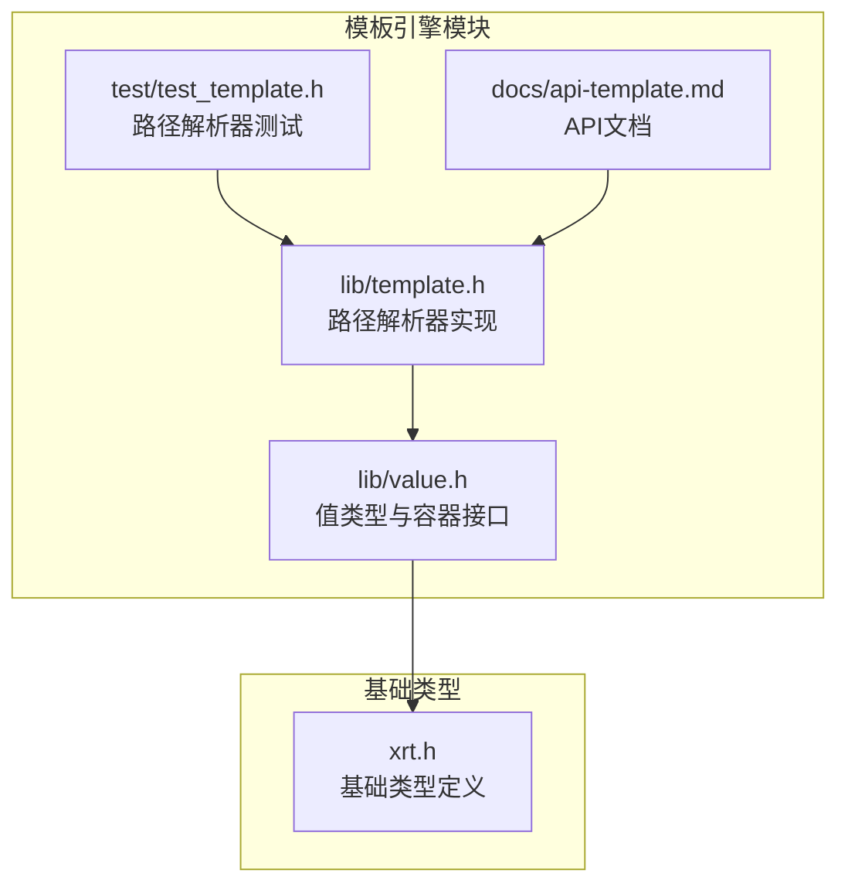
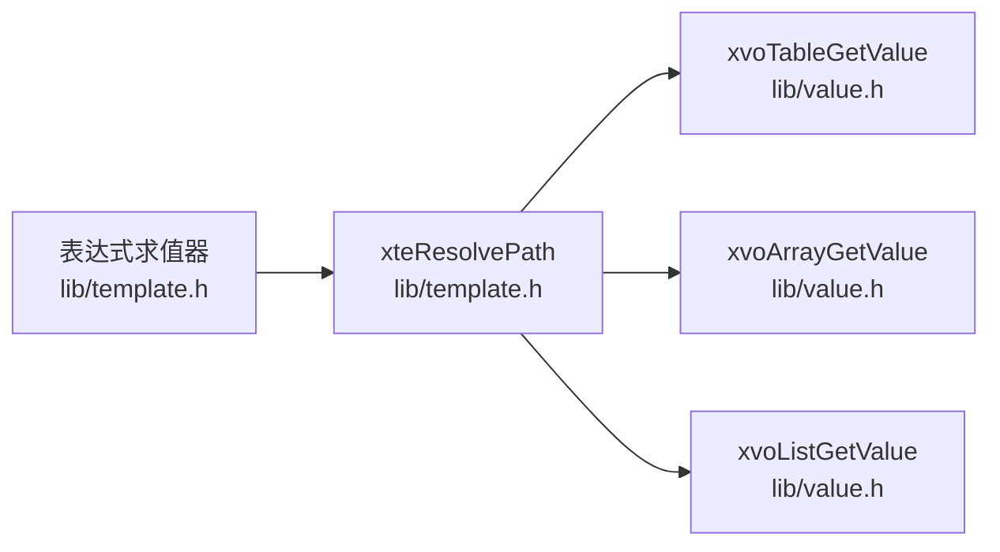

# 路径解析器

<cite>
**本文档引用的文件**
- [lib/template.h](file://lib/template.h)
- [test/test_template.h](file://test/test_template.h)
- [docs/api-template.md](file://docs/api-template.md)
- [docs/api-value.md](file://docs/api-value.md)
- [xrt.h](file://xrt.h)
- [lib/value.h](file://lib/value.h)
</cite>

## 目录
1. [简介](#简介)
2. [项目结构](#项目结构)
3. [核心组件](#核心组件)
4. [架构总览](#架构总览)
5. [详细组件分析](#详细组件分析)
6. [依赖关系分析](#依赖关系分析)
7. [性能考量](#性能考量)
8. [故障排查指南](#故障排查指南)
9. [结论](#结论)
10. [附录](#附录)

## 简介
本文件面向XRT模板引擎的“路径解析器”，系统性阐述其架构与实现细节，包括：
- 支持的路径语法（点号访问、数组索引、字符串键访问、组合访问）
- 解析算法与多级查找策略（本地变量→根变量→环境变量）
- 类型推断与错误处理
- 性能优化（快速路径、缓存机制等）
- 实际应用场景与使用示例

## 项目结构
与路径解析器直接相关的核心文件位于模板引擎模块中，路径解析器位于模板头文件中，配套的单元测试位于测试模块中，API文档位于文档目录中。



图表来源
- [lib/template.h](file://lib/template.h#L590-L773)
- [lib/value.h](file://lib/value.h#L1-L200)
- [xrt.h](file://xrt.h#L1894-L1914)
- [docs/api-template.md](file://docs/api-template.md#L527-L593)
- [test/test_template.h](file://test/test_template.h#L60-L134)

章节来源
- [lib/template.h](file://lib/template.h#L590-L773)
- [docs/api-template.md](file://docs/api-template.md#L527-L593)
- [test/test_template.h](file://test/test_template.h#L60-L134)

## 核心组件
- 路径解析器：对外提供统一的路径解析入口，支持点号嵌套、数组索引、字符串键访问及组合访问，并按优先级在多个作用域表中查找。
- 值类型与容器接口：提供表、数组、列表等容器的元素访问接口，路径解析器基于这些接口进行逐层解析。
- 表达式求值：表达式解析器在求值阶段会复用路径解析器，以解析变量路径。

章节来源
- [lib/template.h](file://lib/template.h#L590-L773)
- [lib/value.h](file://lib/value.h#L1-L200)
- [docs/api-template.md](file://docs/api-template.md#L527-L593)

## 架构总览
路径解析器采用“两阶段”设计：
- 快速路径：当路径不含访问器（.或[）时，直接在三个作用域表中顺序查找。
- 复杂路径：当路径包含访问器时，按段解析，逐层深入，支持数组索引与表键访问。

```mermaid
flowchart TD
Start(["入口: xteResolvePath"]) --> CheckEmpty["检查路径是否为空"]
CheckEmpty --> |为空| ReturnNull["返回空值"]
CheckEmpty --> |非空| HasAccessors{"是否包含访问器(.或[)?"}
HasAccessors --> |否| QuickLookup["快速路径: 在本地→根→环境依次查找"]
HasAccessors --> |是| ParseLoop["复杂路径解析循环"]
QuickLookup --> Done(["返回解析结果"])
ParseLoop --> Segment["提取当前段(直到.或[或结尾)"]
Segment --> FirstSeg{"是否首段?"}
FirstSeg --> |是| LookupFirst["在本地→根→环境查找首段键"]
FirstSeg --> |否| LookupNext["在当前值中查找下一段键"]
LookupFirst --> NextSep{"遇到.或[或结尾?"}
LookupNext --> NextSep
NextSep --> |是且[| IndexParse["解析[]索引: 数字索引或字符串键"]
NextSep --> |是且.或结尾| Continue["继续下一段"]
IndexParse --> Continue
Continue --> EndCheck{"到达末尾?"}
EndCheck --> |否| Segment
EndCheck --> |是| Done
```

图表来源
- [lib/template.h](file://lib/template.h#L603-L773)

## 详细组件分析

### 路径解析器算法与策略
- 语法支持
  - 点号访问：a.b.c
  - 数组索引：arr[0]
  - 字符串键访问：obj["key"]
  - 组合访问：arr[0].name
- 解析策略
  - 优先级查找顺序：本地变量表 → 根变量表 → 环境变量表
  - 类型推断：根据当前值类型决定后续访问方式（表→键访问；数组/列表→索引访问；数字键在表中也可作为键）
  - 错误处理：遇到无效索引、缺失键、类型不匹配等情况返回空值
- 快速路径优化
  - 若路径不含访问器，直接在三个表中查找，避免不必要的分段与循环开销

章节来源
- [lib/template.h](file://lib/template.h#L593-L599)
- [lib/template.h](file://lib/template.h#L603-L773)

### 关键流程图：复杂路径解析
```mermaid
flowchart TD
S(["开始"]) --> Init["初始化: current=NULL, pos=0, segStart=0, isFirst=1"]
Init --> Loop{"pos <= pathLen?"}
Loop --> |否| Ret["返回 current 或空值"]
Loop --> |是| Char["ch = path[pos] 或 '\\0'"]
Char --> Sep{"ch 是 . 或 [ 或 \\0 ?"}
Sep --> |是| Extract["提取当前段 seg=path[segStart..pos-1]"]
Sep --> |否| Inc["pos++"] --> Loop
Extract --> First{"isFirst ?"}
First --> |是| LookupFirst["在本地→根→环境查找 seg"]
First --> |否| LookupNext["current 是否有效且为表?"]
LookupNext --> |否| NullRet["返回空值"]
LookupNext --> |是| LookupInCurrent["在 current 中查找 seg"]
LookupFirst --> NextSep{"遇到.或[或结尾?"}
LookupInCurrent --> NextSep
NextSep --> |是且[| Bracket["扫描到 ']'; 解析索引"]
NextSep --> |是且.或结尾| Advance["segStart=pos+1; 继续"]
NextSep --> |否| Loop
Bracket --> IndexType{"索引类型?"}
IndexType --> |字符串键| StrKey["去掉引号后作为键查找"]
IndexType --> |数字索引| NumIdx["转为整数索引"]
NumIdx --> Container{"current 类型?"}
Container --> |数组| ArrGet["xvoArrayGetValue"]
Container --> |列表| ListGet["xvoListGetValue"]
Container --> |表| TblGet["xvoTableGetValue(数字键)"]
Container --> |其他| NullRet
StrKey --> Advance
ArrGet --> Advance
ListGet --> Advance
TblGet --> Advance
Advance --> Loop
```

图表来源
- [lib/template.h](file://lib/template.h#L639-L773)

### 与值类型的交互
- 表（XVO_DT_TABLE）：支持键访问与数字键作为键
- 数组（XVO_DT_ARRAY）：支持整数索引访问
- 列表（XVO_DT_LIST）：支持整数索引访问
- 空值（XVO_DT_NULL）：作为“未找到”的占位返回

章节来源
- [lib/value.h](file://lib/value.h#L1-L200)
- [xrt.h](file://xrt.h#L1894-L1914)

### API与使用示例
- 函数原型与参数说明参见API文档
- 单元测试展示了典型用法：嵌套表、数组、数组元素属性访问、不存在路径的处理

章节来源
- [docs/api-template.md](file://docs/api-template.md#L527-L593)
- [test/test_template.h](file://test/test_template.h#L60-L134)

## 依赖关系分析
- 路径解析器依赖值类型与容器接口（表、数组、列表）进行元素访问
- 表达式求值器在解析变量节点时会调用路径解析器，形成“解析→求值”的链路



图表来源
- [lib/template.h](file://lib/template.h#L603-L773)
- [lib/template.h](file://lib/template.h#L2870-L2883)
- [lib/value.h](file://lib/value.h#L1-L200)

章节来源
- [lib/template.h](file://lib/template.h#L2870-L2883)
- [lib/value.h](file://lib/value.h#L1-L200)

## 性能考量
- 快速路径优化
  - 对不含访问器的简单路径，直接在三个表中查找，避免分段与循环
- 内存访问模式
  - 顺序扫描路径，局部性良好；仅在必要时分配临时缓冲
- 类型判定与分支
  - 通过类型字段快速判断容器类型，减少额外查询
- 缓存机制
  - 表达式求值器具备AST缓存，可显著降低重复表达式的解析成本（路径解析器本身未显式公开缓存，但可复用表达式求值器的缓存）

章节来源
- [lib/template.h](file://lib/template.h#L615-L637)
- [lib/template.h](file://lib/template.h#L2942-L2987)

## 故障排查指南
- 常见问题
  - 路径为空：返回空值
  - [] 缺失右括号：返回空值
  - 首段前出现 []：返回空值
  - 当前值不是表/数组/列表：返回空值
  - 数字索引越界或类型不匹配：返回空值
  - 字符串键不在表中：返回空值
- 定位建议
  - 检查路径语法是否符合支持的组合规则
  - 确认当前值类型与访问方式一致
  - 使用单元测试中的场景对照定位问题

章节来源
- [lib/template.h](file://lib/template.h#L681-L744)
- [test/test_template.h](file://test/test_template.h#L125-L131)

## 结论
路径解析器以简洁高效的算法实现了对模板变量路径的多级查找与类型推断，结合快速路径与类型判定，能够在常见场景下获得良好的性能表现。配合表达式求值器与单元测试，可满足大多数模板渲染与条件判断需求。

## 附录
- 支持的路径语法
  - 点号访问：a.b.c
  - 数组索引：arr[0]
  - 字符串键访问：obj["key"]
  - 组合访问：arr[0].name
- 查找顺序
  - 本地变量表 → 根变量表 → 环境变量表
- API参考
  - 路径解析函数原型与示例参见API文档

章节来源
- [docs/api-template.md](file://docs/api-template.md#L527-L593)
- [lib/template.h](file://lib/template.h#L593-L599)