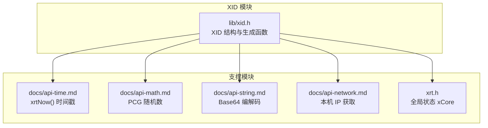
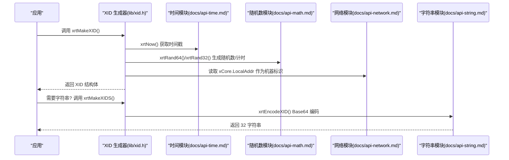
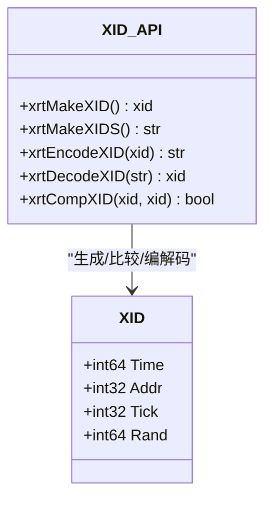
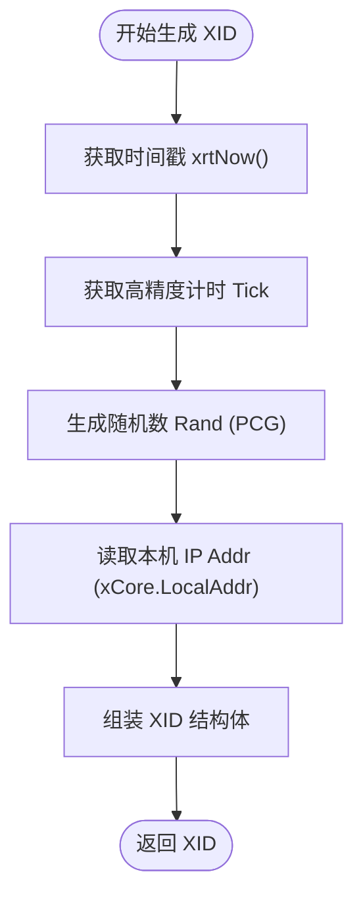
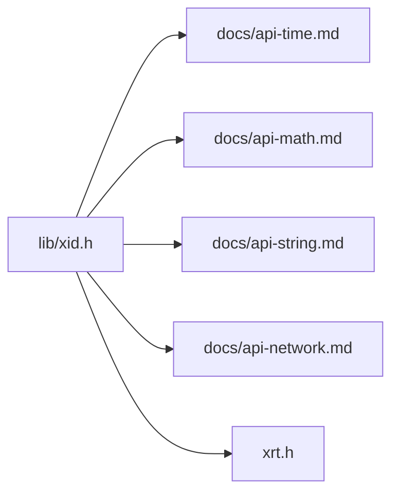

# 分布式ID生成器

<cite>
**本文引用的文件**
- [lib/xid.h](file://lib/xid.h)
- [docs/api-xid.md](file://docs/api-xid.md)
- [docs/api-math.md](file://docs/api-math.md)
- [docs/api-time.md](file://docs/api-time.md)
- [docs/api-string.md](file://docs/api-string.md)
- [docs/api-network.md](file://docs/api-network.md)
- [lib/string.h](file://lib/string.h)
- [lib/math.h](file://lib/math.h)
- [lib/network.h](file://lib/network.h)
- [xrt.h](file://xrt.h)
- [test/test_xid.h](file://test/test_xid.h)
- [test.c](file://test.c)
- [README.md](file://README.md)
</cite>

## 目录
1. [简介](#简介)
2. [项目结构](#项目结构)
3. [核心组件](#核心组件)
4. [架构总览](#架构总览)
5. [详细组件分析](#详细组件分析)
6. [依赖关系分析](#依赖关系分析)
7. [性能考量](#性能考量)
8. [故障排查指南](#故障排查指南)
9. [结论](#结论)
10. [附录](#附录)

## 简介
XID 是 XRT 运行时库提供的 192 位分布式唯一 ID 生成器，具备时间有序、机器标识、高随机性与全局唯一性等特性。其结构由时间戳（64 位）、机器 IP（32 位）、高精度计时器（32 位）与随机数（64 位）组合而成，既可作为字符串（Base64 编码，32 字符）使用，也可直接作为结构体对象处理。XID 无需中心协调，支持多节点并发生成，满足分布式系统的主键、日志追踪、订单号等场景需求。

## 项目结构
XID 位于 XRT 的“高级功能层”，与基础模块（内存、时间、字符串、网络、数学）协同工作：
- 结构体与生成：lib/xid.h
- API 文档与使用示例：docs/api-xid.md
- 随机数与 PCG 算法：docs/api-math.md、lib/math.h
- 时间戳与高精度计时：docs/api-time.md
- 字符串与 Base64 编解码：docs/api-string.md、lib/string.h
- 网络与本机 IP：docs/api-network.md、lib/network.h
- 全局状态与类型定义：xrt.h
- 测试与示例：test/test_xid.h、test.c

图表来源
- [lib/xid.h](file://lib/xid.h#L20-L60)
- [docs/api-time.md](file://docs/api-time.md#L70-L101)
- [docs/api-math.md](file://docs/api-math.md#L1150-L1166)
- [docs/api-string.md](file://docs/api-string.md#L1578-L1629)
- [docs/api-network.md](file://docs/api-network.md#L24-L63)
- [xrt.h](file://xrt.h#L120-L185)

章节来源
- [README.md](file://README.md#L125-L132)
- [docs/api-xid.md](file://docs/api-xid.md#L20-L63)

## 核心组件
- XID 结构与生成
  - 结构体包含时间戳（64 位）、本机 IP（32 位）、高精度计时（32 位）、随机数（64 位），共 192 位（24 字节）。
  - 生成函数：xrtMakeXID（返回结构体指针）、xrtMakeXIDS（一步生成并返回 Base64 字符串）。
- 编解码与比较
  - xrtEncodeXID：将 XID 结构体编码为 32 字符 Base64 字符串。
  - xrtDecodeXID：将 32 字符 Base64 字符串解码为 XID 结构体。
  - xrtCompXID：逐字段比较两个 XID 是否完全一致。
- 依赖支撑
  - 时间戳：xrtNow() 提供秒级时间戳。
  - 随机数：PCG 算法，提供高质量伪随机数。
  - 本机 IP：xCore.LocalAddr 由网络模块初始化，作为机器标识。
  - 字符串：Base64 编解码由字符串模块提供。

章节来源
- [lib/xid.h](file://lib/xid.h#L20-L75)
- [docs/api-xid.md](file://docs/api-xid.md#L67-L160)
- [docs/api-string.md](file://docs/api-string.md#L1578-L1629)
- [docs/api-math.md](file://docs/api-math.md#L1150-L1166)
- [docs/api-network.md](file://docs/api-network.md#L24-L63)

## 架构总览
XID 的生成流程围绕“时间 + 机器 + 精度计时 + 随机数”四要素展开，确保全局唯一与时间有序。

图表来源
- [lib/xid.h](file://lib/xid.h#L20-L60)
- [docs/api-time.md](file://docs/api-time.md#L70-L101)
- [docs/api-math.md](file://docs/api-math.md#L1150-L1166)
- [docs/api-network.md](file://docs/api-network.md#L24-L63)
- [docs/api-string.md](file://docs/api-string.md#L1578-L1629)

## 详细组件分析

### XID 结构与字段
- 字段与大小
  - Time：64 位时间戳（秒）
  - Addr：32 位本机 IP
  - Tick：32 位高精度计时器
  - Rand：64 位 PCG 随机数
- 特性
  - 全局唯一：时间戳 + IP + 精度计时 + 随机数组合
  - 时间有序：时间戳保证可排序
  - 机器标识：Addr 可追溯来源
  - 分布式安全：无需中心协调

图表来源
- [docs/api-xid.md](file://docs/api-xid.md#L20-L63)
- [lib/xid.h](file://lib/xid.h#L20-L75)

章节来源
- [docs/api-xid.md](file://docs/api-xid.md#L20-L63)

### 生成算法与关键技术
- 高精度时间获取
  - Windows：QueryPerformanceCounter 或 GetTickCount
  - Linux/macOS：clock_gettime(CLOCK_MONOTONIC)
- CPU 时钟利用
  - 将纳秒/高精度计数映射到 32 位 Tick，提升序列唯一性
- 随机数生成
  - PCG 算法，提供高质量伪随机数，Rand 字段降低碰撞概率
- 机器标识
  - 通过网络模块初始化 xCore.LocalAddr，作为 Addr 字段

图表来源
- [lib/xid.h](file://lib/xid.h#L27-L47)
- [docs/api-time.md](file://docs/api-time.md#L70-L101)
- [docs/api-math.md](file://docs/api-math.md#L1150-L1166)
- [docs/api-network.md](file://docs/api-network.md#L24-L63)

章节来源
- [lib/xid.h](file://lib/xid.h#L27-L47)
- [docs/api-math.md](file://docs/api-math.md#L1150-L1166)

### 分布式去重机制
- 全局唯一性保障
  - 时间戳（秒）保证不同节点生成的 ID 在时间维度上不冲突
  - 本机 IP（Addr）区分不同机器，避免同一时刻同一机器生成重复
  - 高精度计时（Tick）与随机数（Rand）进一步降低极短时间内重复的概率
- 并发与多节点
  - 无需中心协调，每个节点独立生成，天然支持多节点并发
  - 若网络未连接导致 Addr 为 0，仍可生成 ID，但 Addr 字段不具备唯一性，建议在网络可用时初始化

章节来源
- [docs/api-xid.md](file://docs/api-xid.md#L56-L62)
- [docs/api-network.md](file://docs/api-network.md#L350-L376)

### 有序性与排序
- 时间有序
  - Time 字段为秒级时间戳，天然支持按时间排序
- 字符串排序
  - Base64 编码后字符串在 ASCII 码序下保持一定顺序性，便于数据库索引与检索

章节来源
- [docs/api-xid.md](file://docs/api-xid.md#L59-L61)
- [docs/api-string.md](file://docs/api-string.md#L1578-L1629)

### API 使用示例与场景
- 唯一订单号
  - 直接使用 xrtMakeXIDS() 生成 32 字符字符串作为订单号
- 分布式追踪 ID
  - 生成 trace_id 与 span_id，分别用于请求追踪与跨度标识
- 数据库主键
  - 生成 XID 字符串作为主键，避免全局自增键的热点问题
- 临时文件名
  - 以 xrtMakeXIDS() 作为文件名，避免冲突

章节来源
- [docs/api-xid.md](file://docs/api-xid.md#L326-L462)

### ID 格式解析与验证
- 解析
  - 使用 xrtDecodeXID 将 32 字符 Base64 字符串还原为 XID 结构体
- 验证
  - 使用 xrtCompXID 比较两个 XID 是否完全一致
- 故障恢复
  - 若网络未连接导致 Addr 为 0，不影响 ID 生成，但建议在网络可用时重新初始化

章节来源
- [lib/xid.h](file://lib/xid.h#L12-L75)
- [docs/api-xid.md](file://docs/api-xid.md#L269-L323)
- [docs/api-network.md](file://docs/api-network.md#L350-L376)

## 依赖关系分析
XID 依赖于多个模块协作：
- 时间模块：提供秒级时间戳
- 数学模块：提供 PCG 随机数
- 字符串模块：提供 Base64 编解码
- 网络模块：提供本机 IP
- 全局状态：xCore 提供全局配置与状态

图表来源
- [lib/xid.h](file://lib/xid.h#L20-L60)
- [docs/api-time.md](file://docs/api-time.md#L70-L101)
- [docs/api-math.md](file://docs/api-math.md#L1150-L1166)
- [docs/api-string.md](file://docs/api-string.md#L1578-L1629)
- [docs/api-network.md](file://docs/api-network.md#L24-L63)
- [xrt.h](file://xrt.h#L120-L185)

章节来源
- [xrt.h](file://xrt.h#L120-L185)
- [lib/network.h](file://lib/network.h#L4-L70)

## 性能考量
- 生成成本
  - 生成 XID 仅涉及少量内存分配与少量系统调用（时间戳、随机数、IP 读取），开销极低
- 内存占用
  - XID 结构体为 24 字节；字符串形式为 32 字符（Base64），额外包含字符串终止符
- 并发能力
  - 由于使用高精度计时与 PCG 随机数，多线程/多进程并发生成不会出现碰撞
- 延迟测量
  - 可通过在调用前后记录时间戳评估生成延迟，但具体数值取决于平台与系统负载

[本节为通用性能讨论，不直接分析具体文件]

## 故障排查指南
- 网络未连接导致 Addr 为 0
  - 现象：Addr 字段为 0，影响机器唯一性
  - 处理：确保网络初始化后再生成 ID，或在网络可用时重新初始化
- 内存管理
  - xrtMakeXID 返回的结构体需使用 xrtFree 释放
  - xrtMakeXIDS 返回的字符串同样需要释放
  - 编解码产生的中间对象也需释放
- 测试验证
  - 可参考测试模块中的 XID 测试用例，验证生成、编码、解码与比较流程

章节来源
- [docs/api-xid.md](file://docs/api-xid.md#L465-L522)
- [test/test_xid.h](file://test/test_xid.h#L5-L23)
- [test.c](file://test.c#L106-L107)

## 结论
XID 通过“时间戳 + 机器 IP + 高精度计时 + 随机数”的组合，在不依赖中心协调的前提下实现了全局唯一、时间有序且易于排序的 192 位 ID。其与 XRT 的时间、随机数、字符串与网络模块紧密集成，提供了简洁稳定的 API，并适用于数据库主键、日志追踪、订单号等多种场景。在分布式环境中，建议确保网络初始化以获得有效的机器标识，从而最大化唯一性保障。

## 附录
- 相关文档与模块
  - XID 结构与 API：docs/api-xid.md
  - 时间处理：docs/api-time.md
  - 随机数与 PCG：docs/api-math.md
  - 字符串与 Base64：docs/api-string.md
  - 网络与本机 IP：docs/api-network.md
  - 全局状态与类型：xrt.h
  - 测试入口：test.c
  - XID 测试：test/test_xid.h

章节来源
- [README.md](file://README.md#L125-L132)
- [docs/api-xid.md](file://docs/api-xid.md#L526-L541)
- [test.c](file://test.c#L106-L107)
- [test/test_xid.h](file://test/test_xid.h#L5-L23)