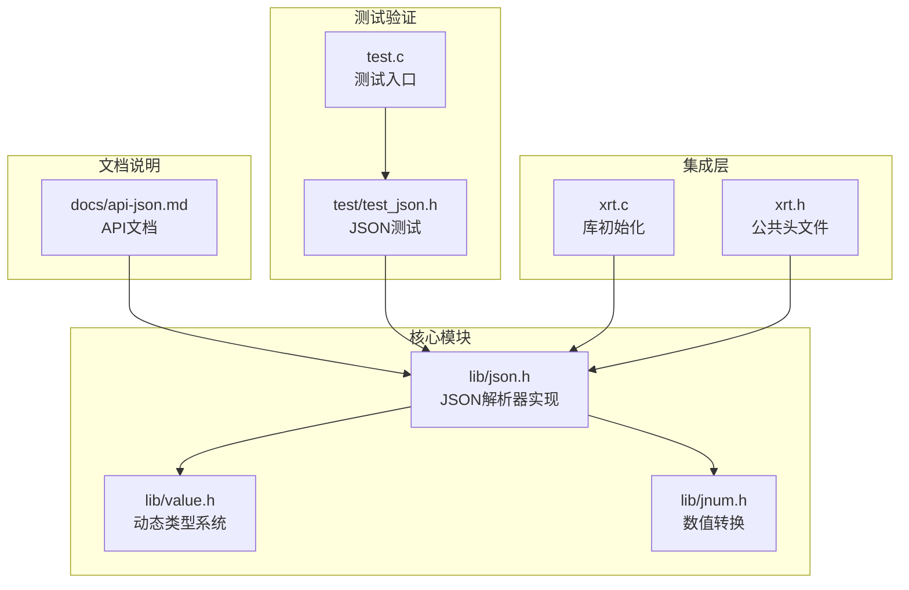
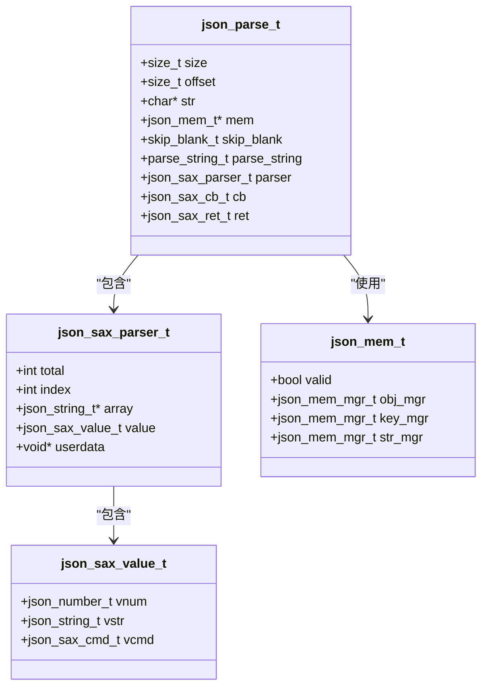
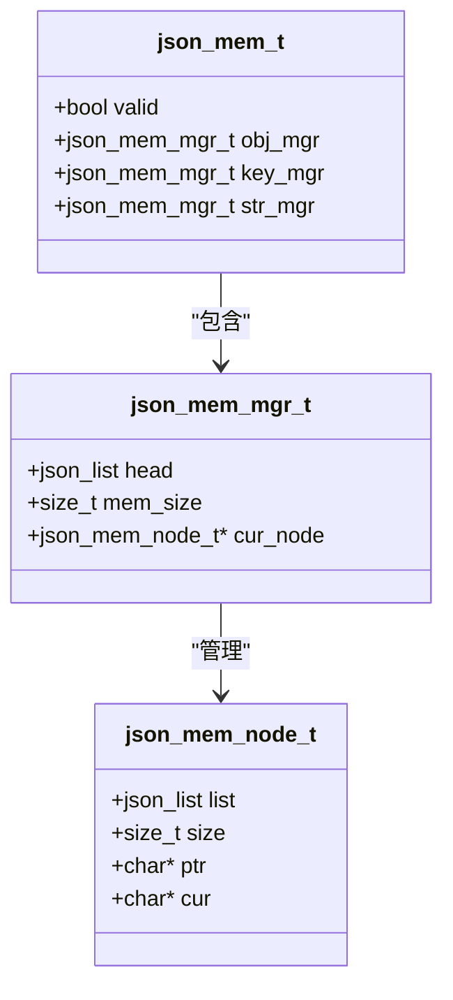
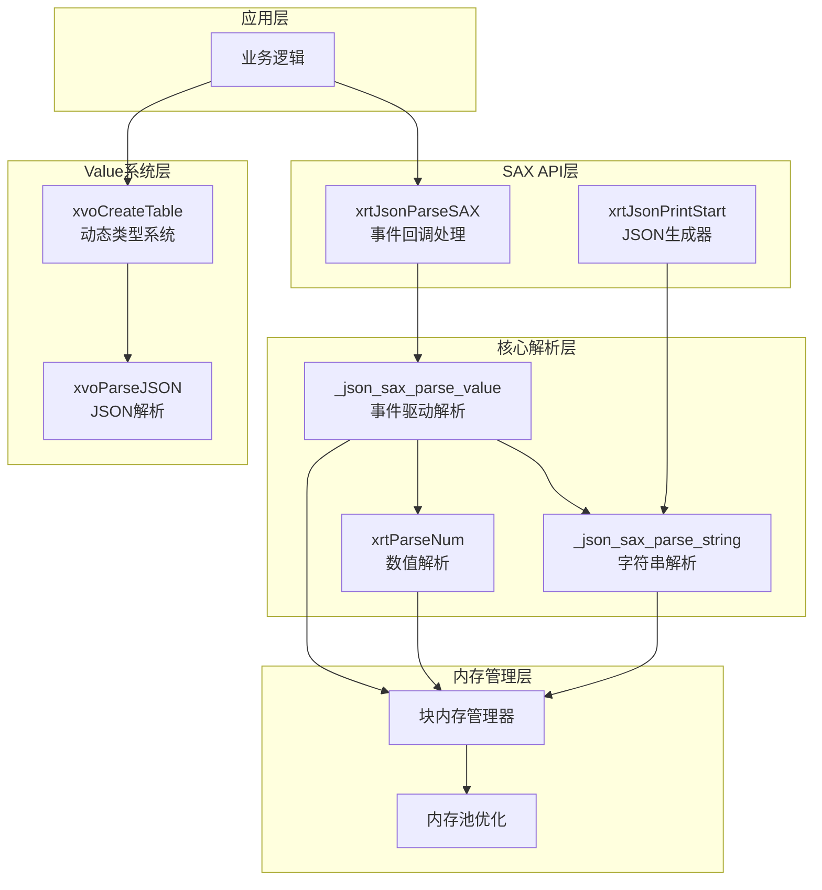
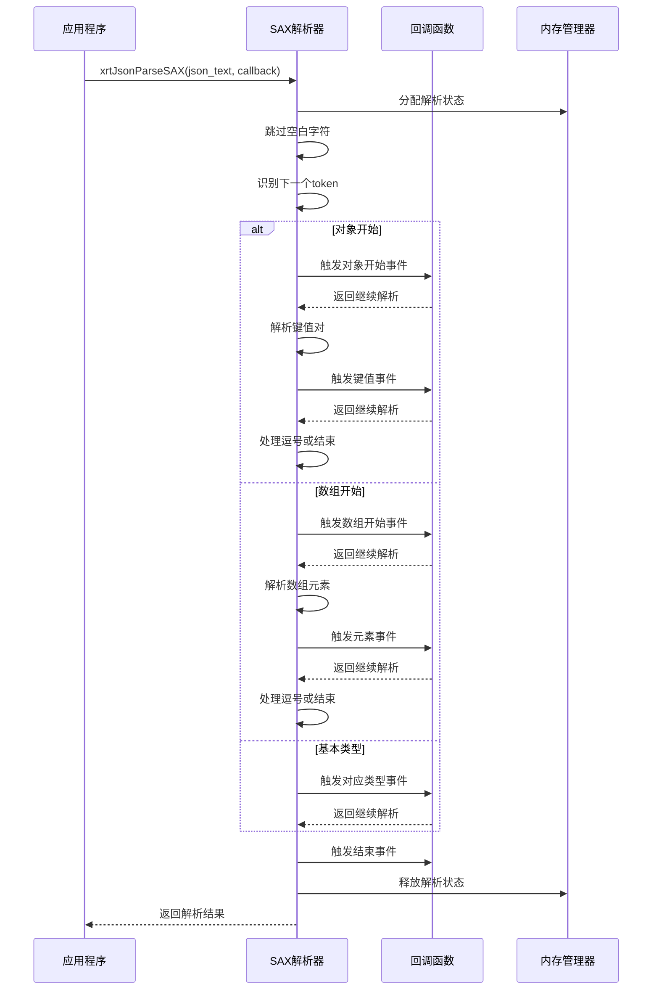
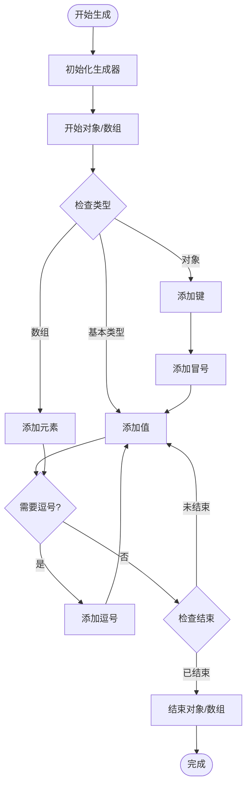
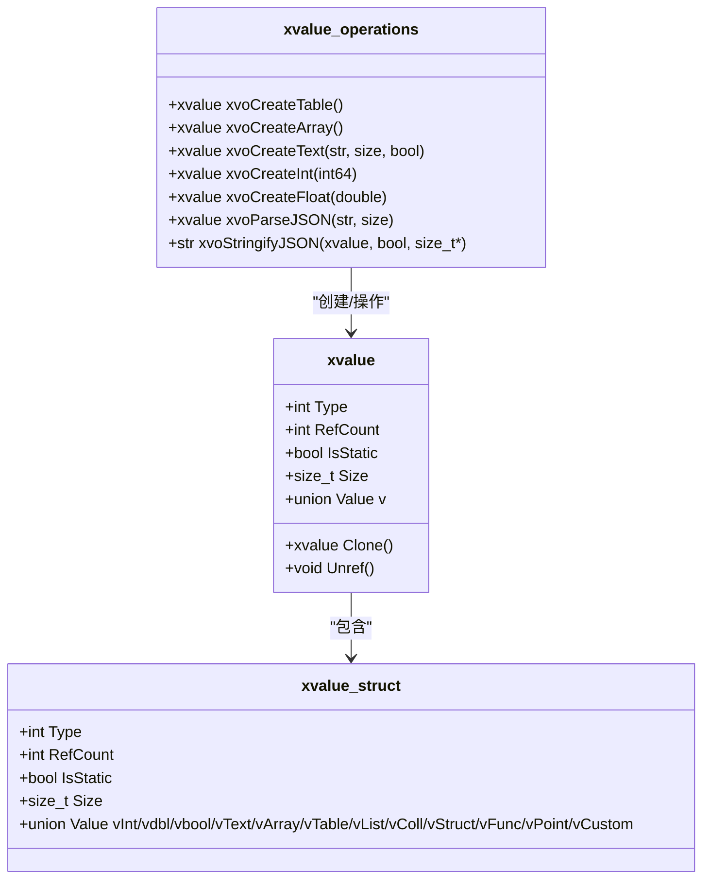
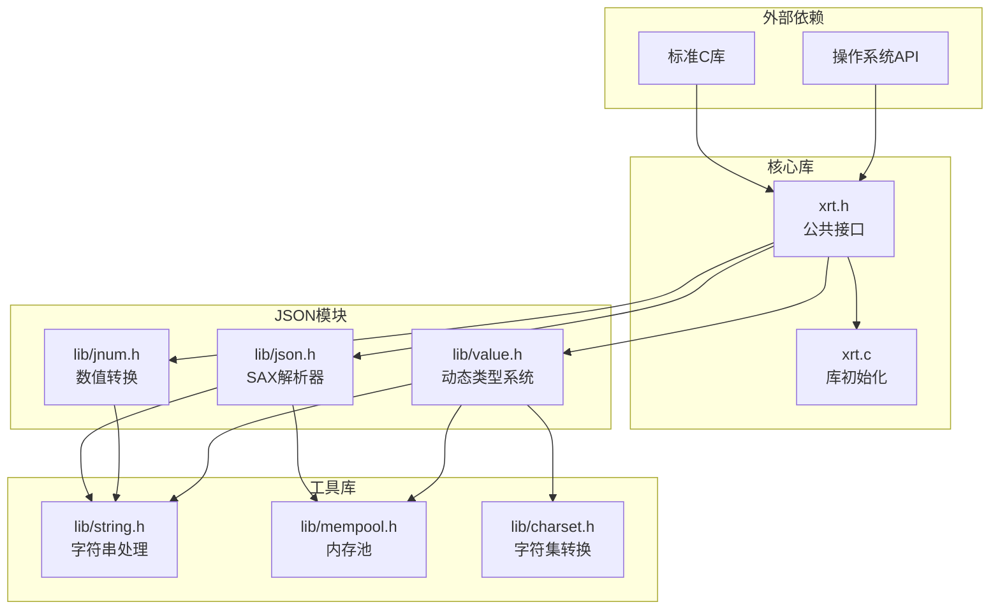
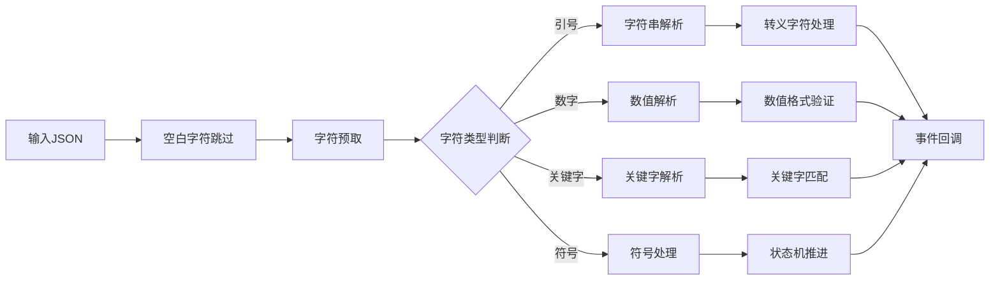
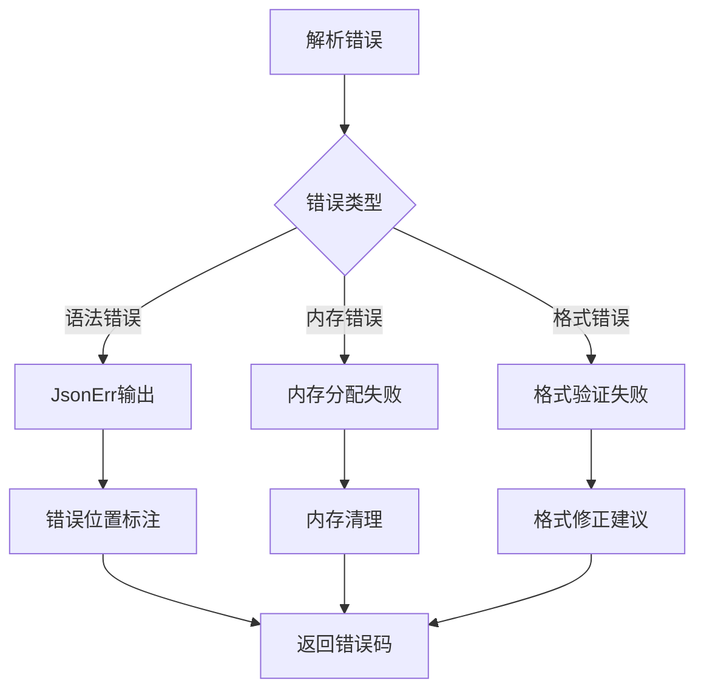

# 高性能JSON处理

<cite>
**本文档引用的文件**
- [lib/json.h](file://lib/json.h)
- [docs/api-json.md](file://docs/api-json.md)
- [lib/value.h](file://lib/value.h)
- [lib/jnum.h](file://lib/jnum.h)
- [test/test_json.h](file://test/test_json.h)
- [xrt.c](file://xrt.c)
- [test.c](file://test.c)
- [xrt.h](file://xrt.h)
</cite>

## 目录
1. [简介](#简介)
2. [项目结构](#项目结构)
3. [核心组件](#核心组件)
4. [架构概览](#架构概览)
5. [详细组件分析](#详细组件分析)
6. [依赖关系分析](#依赖关系分析)
7. [性能考虑](#性能考虑)
8. [故障排除指南](#故障排除指南)
9. [结论](#结论)
10. [附录](#附录)

## 简介

XRT高性能JSON处理模块是一个基于事件驱动架构的JSON解析和生成库，采用SAX模式实现，具有以下核心特点：

- **事件驱动架构**：基于回调机制的流式解析，无需构建完整DOM树
- **无DOM开销设计**：直接在内存中解析和生成JSON，避免中间数据结构
- **内存优化策略**：使用块内存管理器减少内存分配开销
- **高级特性支持**：注释支持、尾逗号处理、Unicode转义等
- **双向转换能力**：支持JSON与动态类型系统的无缝转换

该模块提供了两种使用方式：底层的SAX API和基于Value系统的高层封装，满足不同场景的性能和易用性需求。

## 项目结构

XRT项目采用模块化设计，JSON处理模块位于lib目录下，核心文件包括：



**图表来源**
- [lib/json.h](file://lib/json.h#L1-L100)
- [lib/value.h](file://lib/value.h#L1-L100)
- [docs/api-json.md](file://docs/api-json.md#L1-L50)

**章节来源**
- [lib/json.h](file://lib/json.h#L1-L200)
- [xrt.c](file://xrt.c#L54-L84)

## 核心组件

### JSON解析器架构

JSON解析器采用事件驱动的SAX模式，通过回调函数向应用程序传递解析事件：



**图表来源**
- [lib/json.h](file://lib/json.h#L219-L235)
- [lib/json.h](file://lib/json.h#L100-L106)
- [lib/json.h](file://lib/json.h#L69-L74)

### 内存管理系统

JSON解析器使用块内存管理器来优化内存分配：



**图表来源**
- [lib/json.h](file://lib/json.h#L44-L48)
- [lib/json.h](file://lib/json.h#L23-L28)
- [lib/json.h](file://lib/json.h#L69-L74)

**章节来源**
- [lib/json.h](file://lib/json.h#L1-L200)
- [lib/json.h](file://lib/json.h#L800-L1200)

## 架构概览

XRT JSON处理模块采用分层架构设计，从底层到高层的抽象层次如下：



**图表来源**
- [lib/json.h](file://lib/json.h#L1557-L1596)
- [lib/value.h](file://lib/value.h#L268-L284)
- [lib/jnum.h](file://lib/jnum.h#L293-L361)

## 详细组件分析

### SAX解析器实现

SAX解析器采用递归下降解析算法，通过状态机处理JSON语法：



**图表来源**
- [lib/json.h](file://lib/json.h#L1383-L1537)
- [lib/json.h](file://lib/json.h#L1431-L1463)

#### 事件回调机制

SAX解析器支持多种事件类型，每种事件都通过回调函数传递给应用程序：

| 事件类型 | 触发时机 | 回调参数 | 用途 |
|---------|----------|----------|------|
| 对象开始 | `{` 出现时 | `JSON_OBJECT, JSON_SAX_START` | 开始处理对象内容 |
| 对象结束 | `}` 出现时 | `JSON_OBJECT, JSON_SAX_FINISH` | 完成对象处理 |
| 数组开始 | `[` 出现时 | `JSON_ARRAY, JSON_SAX_START` | 开始处理数组内容 |
| 数组结束 | `]` 出现时 | `JSON_ARRAY, JSON_SAX_FINISH` | 完成数组处理 |
| 字符串值 | 字符串值出现时 | `JSON_STRING, value` | 处理字符串内容 |
| 数字值 | 数字值出现时 | `JSON_INT/DOUBLE, value` | 处理数值内容 |
| 布尔值 | `true/false` 出现时 | `JSON_BOOL, value` | 处理布尔值 |
| null值 | `null` 出现时 | `JSON_NULL` | 处理空值 |

**章节来源**
- [lib/json.h](file://lib/json.h#L1383-L1537)
- [docs/api-json.md](file://docs/api-json.md#L82-L175)

### JSON生成器实现

JSON生成器采用事件驱动的方式生成JSON字符串，支持格式化和压缩输出：



**图表来源**
- [lib/json.h](file://lib/json.h#L562-L739)
- [lib/json.h](file://lib/json.h#L741-L790)

#### 生成器配置选项

JSON生成器支持多种配置选项来优化输出格式：

| 配置项 | 默认值 | 说明 |
|--------|--------|------|
| `format_flag` | false | 是否格式化输出（包含缩进和换行） |
| `plus_size` | 8192 | 内存扩容步长 |
| `item_size` | 24/32 | 单项预估大小（压缩/格式化） |
| `item_total` | 1024 | 预估项数 |
| `ptr` | NULL | 可选的复用缓冲区 |

**章节来源**
- [lib/json.h](file://lib/json.h#L562-L790)
- [docs/api-json.md](file://docs/api-json.md#L177-L298)

### 动态类型系统集成

XRT提供了强大的动态类型系统，支持JSON与C语言数据结构之间的无缝转换：



**图表来源**
- [lib/value.h](file://lib/value.h#L1-L100)
- [lib/value.h](file://lib/value.h#L101-L200)

#### 类型系统支持

动态类型系统支持以下JSON类型：

| JSON类型 | C类型 | Value系统API |
|----------|-------|-------------|
| null | `NULL` | `xvoCreateNull()` |
| boolean | `bool` | `xvoCreateBool(bool)` |
| integer | `int32/int64` | `xvoCreateInt(int64)` |
| float | `double` | `xvoCreateFloat(double)` |
| string | `char*` | `xvoCreateText(str, size, bool)` |
| array | `xvalue[]` | `xvoCreateArray()` |
| object | `xvalue[key]` | `xvoCreateTable()` |

**章节来源**
- [lib/value.h](file://lib/value.h#L101-L316)
- [docs/api-json.md](file://docs/api-json.md#L301-L436)

## 依赖关系分析

XRT JSON处理模块的依赖关系呈现清晰的分层结构：



**图表来源**
- [xrt.c](file://xrt.c#L54-L84)
- [lib/json.h](file://lib/json.h#L1-L50)
- [lib/jnum.h](file://lib/jnum.h#L1-L30)

### 模块耦合度分析

- **低耦合设计**：JSON模块独立于其他模块，通过明确的接口进行交互
- **高内聚性**：相关功能集中在同一模块中，便于维护和扩展
- **接口稳定性**：公共接口保持稳定，内部实现可以灵活调整

**章节来源**
- [xrt.c](file://xrt.c#L54-L84)
- [lib/json.h](file://lib/json.h#L1-L100)

## 性能考虑

### 内存优化策略

XRT JSON模块采用了多种内存优化技术：

1. **块内存管理**：使用固定大小的内存块减少碎片化
2. **引用计数**：动态类型系统中的引用计数避免不必要的复制
3. **零拷贝优化**：字符串解析时尽量避免不必要的内存分配
4. **批量分配**：对象、键和字符串分别使用专用的内存管理器

### 解析性能优化



**图表来源**
- [lib/json.h](file://lib/json.h#L1162-L1196)
- [lib/json.h](file://lib/json.h#L1198-L1312)

### 性能基准测试

由于代码库中未包含具体的性能基准测试数据，以下是基于实现特性的理论性能分析：

| 特性 | 性能影响 | 优化策略 |
|------|----------|----------|
| 事件驱动解析 | 低内存占用 | 避免DOM构建 |
| 块内存管理 | 减少分配次数 | 批量内存分配 |
| 循环展开 | 提高解析速度 | 手动循环展开 |
| 内联函数 | 减少函数调用开销 | 关键路径内联 |
| 预分配缓冲区 | 避免动态扩容 | 预估输出大小 |

**章节来源**
- [lib/json.h](file://lib/json.h#L169-L179)
- [lib/json.h](file://lib/json.h#L800-L1200)

## 故障排除指南

### 常见错误类型

JSON解析器提供了详细的错误报告机制：



**图表来源**
- [lib/json.h](file://lib/json.h#L144-L163)
- [lib/json.h](file://lib/json.h#L150-L158)

### 调试技巧

1. **启用详细错误输出**：通过`JSON_ERROR_PRINT_ENABLE`宏控制错误输出
2. **使用断点调试**：在回调函数中设置断点观察解析状态
3. **内存泄漏检测**：使用块内存管理器确保正确释放
4. **边界条件测试**：测试空字符串、特殊字符、超大数值等边界情况

**章节来源**
- [lib/json.h](file://lib/json.h#L144-L163)
- [test/test_json.h](file://test/test_json.h#L1-L105)

## 结论

XRT高性能JSON处理模块通过事件驱动架构实现了高效的JSON解析和生成，具有以下优势：

1. **高性能**：SAX模式避免了DOM构建的内存开销
2. **灵活性**：支持多种配置选项和扩展机制
3. **易用性**：提供Value系统简化日常开发
4. **可靠性**：完善的错误处理和内存管理机制

该模块特别适用于需要处理大量JSON数据的应用场景，如Web服务、数据交换、配置文件处理等。通过合理配置和使用，可以获得比传统DOM解析器更好的性能表现。

## 附录

### API使用示例

#### 基本SAX解析示例

```c
// 示例：简单的JSON解析回调
json_sax_ret_t MyCallback(json_sax_parser_t *parser) {
    json_string_t *jkey = &parser->array[parser->index];
    json_type_t type = jkey->info.type;
    
    switch (type) {
        case JSON_STRING:
            printf("字符串: %.*s\n", 
                   parser->value.vstr.info.len, 
                   parser->value.vstr.str);
            break;
        case JSON_INT:
            printf("整数: %d\n", parser->value.vnum.vint);
            break;
        case JSON_DOUBLE:
            printf("浮点数: %f\n", parser->value.vnum.vdbl);
            break;
        case JSON_BOOL:
            printf("布尔值: %s\n", parser->value.vnum.vbool ? "true" : "false");
            break;
        case JSON_NULL:
            printf("空值\n");
            break;
        case JSON_ARRAY:
        case JSON_OBJECT:
            if (parser->value.vcmd == JSON_SAX_START)
                printf("%s开始\n", type == JSON_ARRAY ? "数组" : "对象");
            else
                printf("%s结束\n", type == JSON_ARRAY ? "数组" : "对象");
            break;
    }
    
    return JSON_SAX_PARSE_CONTINUE;
}

// 使用示例
str json = "{\"name\":\"Tom\",\"age\":25}";
xrtJsonParseSAX(json, strlen(json), MyCallback);
```

#### Value系统使用示例

```c
// 解析JSON并访问数据
str jsonStr = "{\"name\":\"Tom\",\"age\":25}";
xvalue data = xrtParseJSON(jsonStr, 0);

// 访问数据
xvalue name = xvoTableGetValue(data, "name", 4);
printf("姓名: %s\n", xvoGetText(name));

// 修改数据
xvoTableSetInt(data, "age", 3, 26);

// 序列化为JSON
size_t len;
str result = xrtStringifyJSON(data, TRUE, &len);
printf("%s\n", result);
xrtFree(result);

xvoUnref(data);
```

**章节来源**
- [docs/api-json.md](file://docs/api-json.md#L135-L174)
- [docs/api-json.md](file://docs/api-json.md#L330-L350)