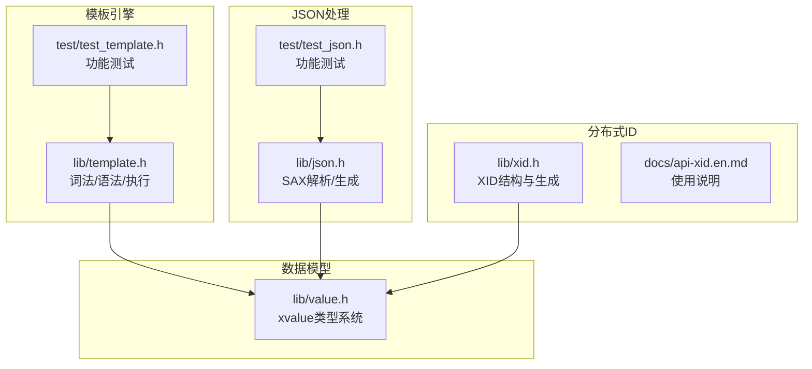
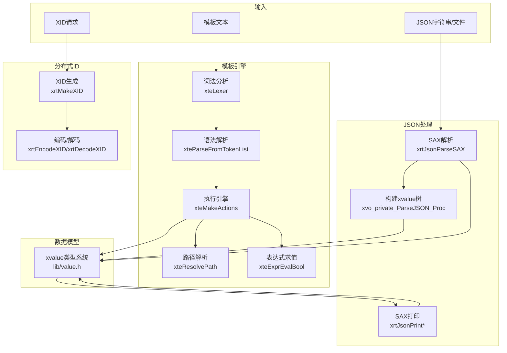
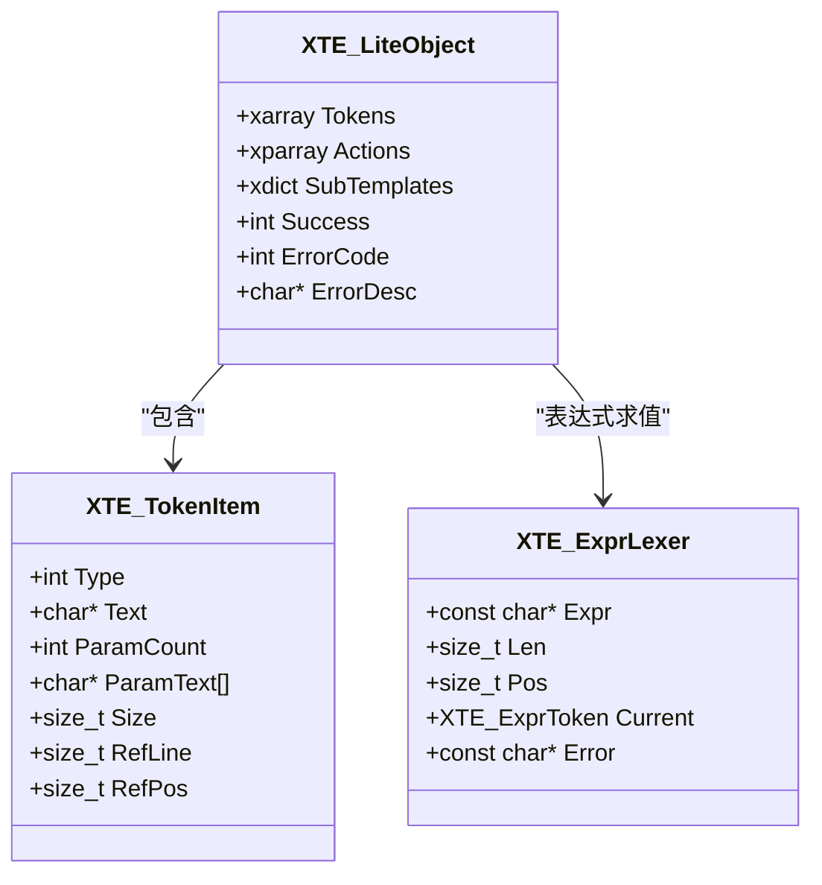
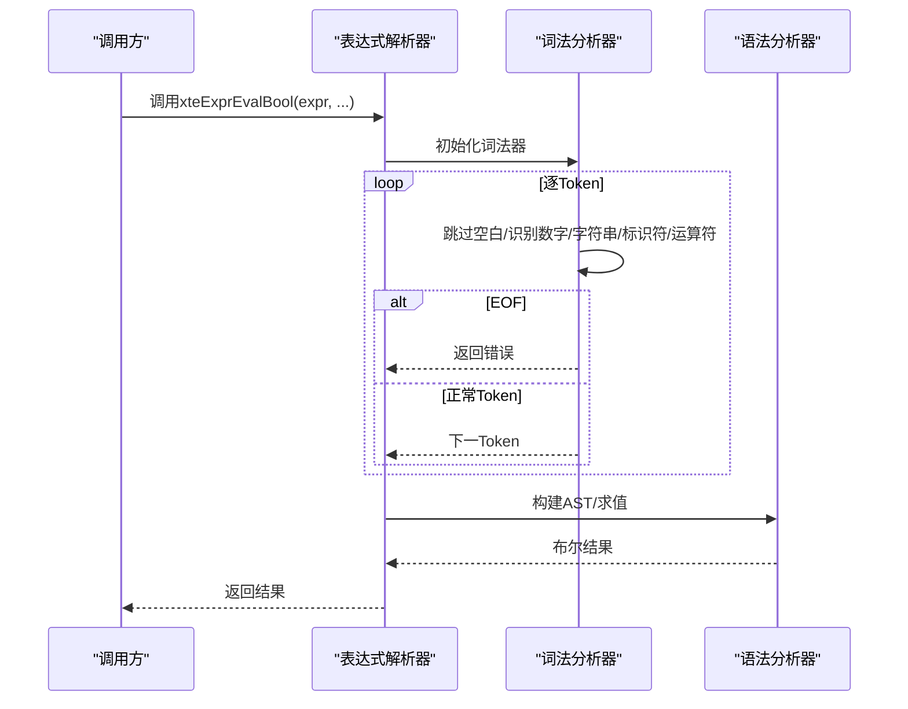
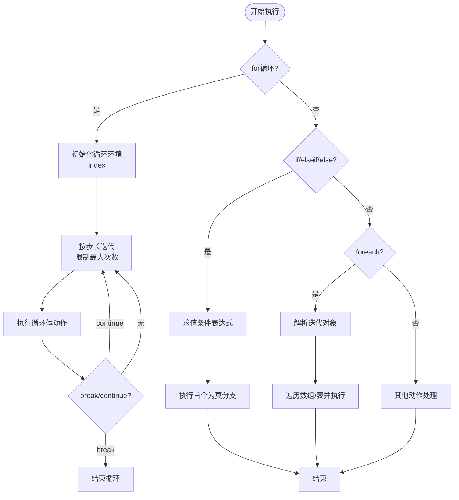
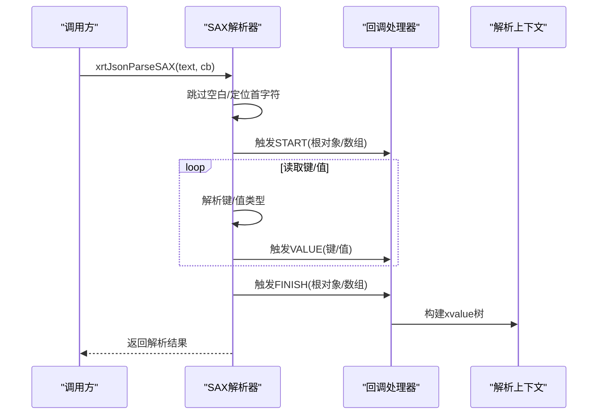
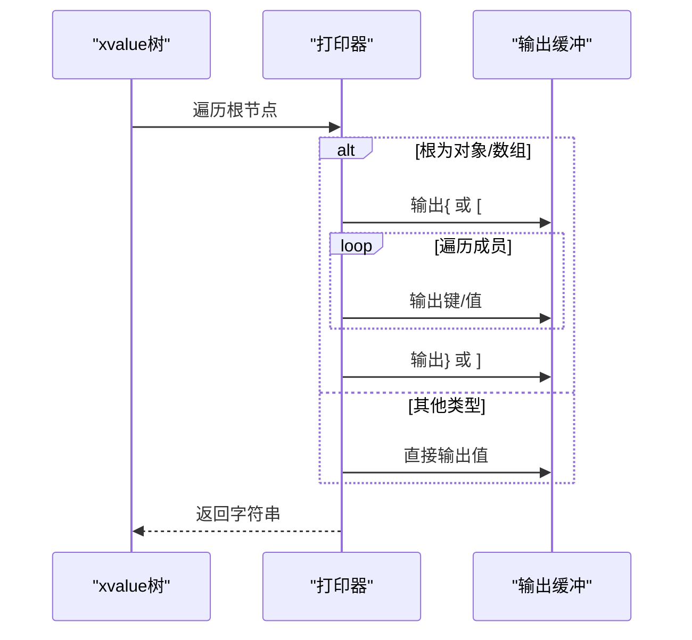
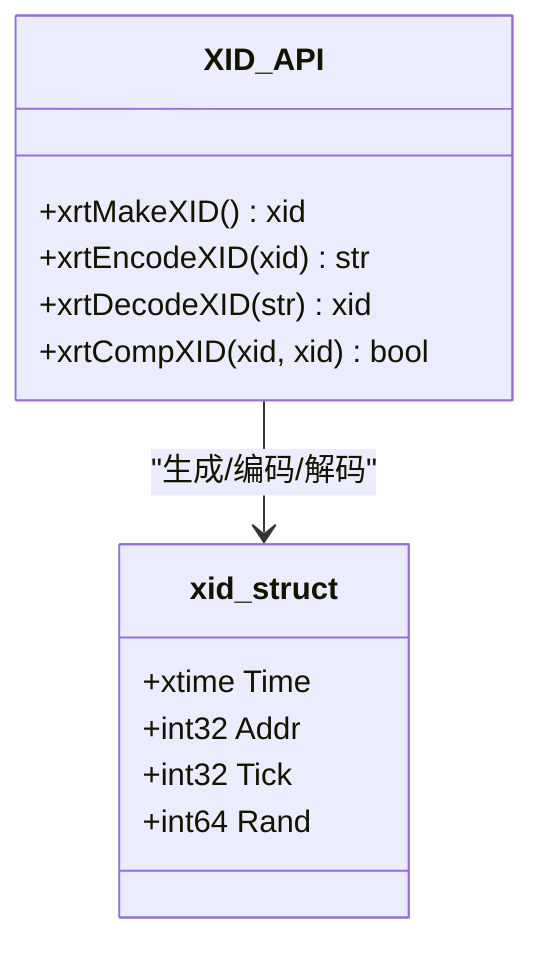
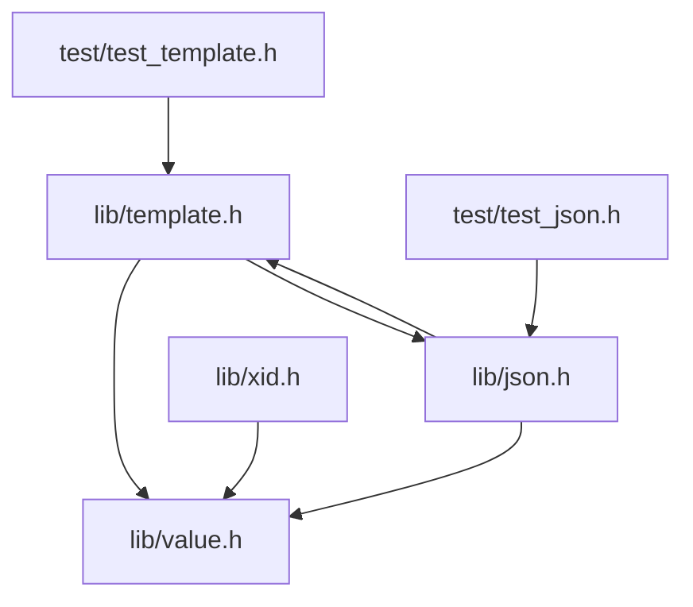

# 高级功能

<cite>
**本文档引用的文件**
- [lib/template.h](file://lib/template.h)
- [lib/json.h](file://lib/json.h)
- [lib/xid.h](file://lib/xid.h)
- [lib/value.h](file://lib/value.h)
- [test/test_template.h](file://test/test_template.h)
- [test/test_json.h](file://test/test_json.h)
- [docs/api-template.en.md](file://docs/api-template.en.md)
- [docs/api-xid.en.md](file://docs/api-xid.en.md)
</cite>

## 目录
1. [简介](#简介)
2. [项目结构](#项目结构)
3. [核心组件](#核心组件)
4. [架构总览](#架构总览)
5. [详细组件分析](#详细组件分析)
6. [依赖关系分析](#依赖关系分析)
7. [性能考虑](#性能考虑)
8. [故障排查指南](#故障排查指南)
9. [结论](#结论)
10. [附录](#附录)

## 简介
本文件面向XRT高级功能模块，系统性阐述以下能力：
- 企业级模板引擎：完整语法支持（变量替换、条件判断、循环迭代、子模板嵌套、脚本扩展等），以及路径解析、表达式求值、循环限制与缓存优化。
- JSON处理：SAX模式解析/生成技术，事件驱动、无DOM开销、注释支持、尾逗号处理等特性。
- 分布式ID生成器：192位唯一ID设计，包含时间戳、IP地址、CPU时钟与随机数的组合策略。

目标是帮助读者快速掌握这些模块的设计思想、实现细节与最佳实践，并提供性能优化建议与典型应用场景。

## 项目结构
XRT采用模块化组织，高级功能主要分布在以下文件：
- 模板引擎：lib/template.h（词法/语法/执行）、test/test_template.h（功能测试）
- JSON处理：lib/json.h（SAX解析/生成）、test/test_json.h（功能测试）
- 分布式ID：lib/xid.h（XID结构与生成）、docs/api-xid.en.md（使用说明）
- 数据模型：lib/value.h（xvalue类型系统，用于模板与JSON桥接）



**图表来源**
- [lib/template.h](file://lib/template.h#L1-L120)
- [lib/json.h](file://lib/json.h#L1-L120)
- [lib/xid.h](file://lib/xid.h#L1-L75)
- [lib/value.h](file://lib/value.h#L1-L120)

**章节来源**
- [lib/template.h](file://lib/template.h#L1-L120)
- [lib/json.h](file://lib/json.h#L1-L120)
- [lib/xid.h](file://lib/xid.h#L1-L75)
- [lib/value.h](file://lib/value.h#L1-L120)

## 核心组件
- 企业级模板引擎
  - 词法分析：支持多种Token类型（变量、数字、时间、布尔、数组、过程、子模板、符号等），并具备转义与注释处理。
  - 语法解析：将Token序列转换为可执行的动作列表，支持define/for/foreach/if/elseif/else/break/continue等控制结构。
  - 执行引擎：按动作序列生成最终文本，支持路径解析、表达式求值、循环限制与缓存优化。
  - 路径解析：支持a.b.c、arr[0]、obj["key"]等组合访问。
  - 表达式解析：支持and/or/not、比较运算、括号、字面量等。
- JSON处理（SAX）
  - 解析：事件驱动，逐节点触发回调，无DOM开销，支持注释、尾逗号、特殊字符等配置。
  - 生成：基于SAX回调的打印器，支持格式化/非格式化输出。
- 分布式ID（XID）
  - 结构：192位（时间戳64位 + IP地址32位 + CPU时钟32位 + 随机数64位）。
  - 生成：跨平台高精度时钟、本地IP地址、PCG随机数。
  - 转换：Base64编码/解码。

**章节来源**
- [lib/template.h](file://lib/template.h#L16-L92)
- [lib/json.h](file://lib/json.h#L80-L136)
- [lib/xid.h](file://lib/xid.h#L24-L31)
- [docs/api-xid.en.md](file://docs/api-xid.en.md#L24-L31)

## 架构总览
模板引擎与JSON处理共享xvalue类型系统，形成“SAX解析 → xvalue树 → SAX打印”的闭环。XID作为独立模块提供全局唯一ID。



**图表来源**
- [lib/template.h](file://lib/template.h#L240-L587)
- [lib/json.h](file://lib/json.h#L1557-L1596)
- [lib/json.h](file://lib/json.h#L1617-L1782)
- [lib/json.h](file://lib/json.h#L1823-L1860)
- [lib/json.h](file://lib/json.h#L1925-L1955)
- [lib/value.h](file://lib/value.h#L100-L316)
- [lib/xid.h](file://lib/xid.h#L21-L60)

## 详细组件分析

### 企业级模板引擎

#### 语法与Token体系
- Token类型覆盖：文本、注释、变量、数字、时间、布尔、数组、过程、子模板、符号（含include/define/script等扩展）。
- 控制结构：if/elseif/else、for、foreach、break、continue、define（子模板）。
- 语法规则：支持参数数量校验、嵌套匹配、未闭合检测、错误定位与报告。



**图表来源**
- [lib/template.h](file://lib/template.h#L846-L848)
- [lib/template.h](file://lib/template.h#L240-L587)
- [lib/template.h](file://lib/template.h#L2137-L2143)

**章节来源**
- [lib/template.h](file://lib/template.h#L16-L92)
- [lib/template.h](file://lib/template.h#L240-L587)
- [lib/template.h](file://lib/template.h#L846-L848)
- [lib/template.h](file://lib/template.h#L2125-L2394)

#### 路径解析器
- 支持点号访问与数组索引，组合访问如a.b.c[arr[0].name]。
- 优先在当前表、根表、ENV表中查找，返回xvalue或空值。

```mermaid
flowchart TD
Start(["入口: 路径解析"]) --> CheckEmpty["检查路径长度"]
CheckEmpty --> HasAccessor{"包含 . 或 ["}
HasAccessor --> |否| LookupSimple["直接在三处表查找"]
HasAccessor --> |是| Loop["逐段解析"]
Loop --> DotOrIdx{"遇到 . 或 ["}
DotOrIdx --> |.| AccessProp["属性访问"]
DotOrIdx --> |[| AccessIdx["索引访问"]
AccessProp --> NextSeg["继续下一段"]
AccessIdx --> NextSeg
NextSeg --> EndCheck{"到达末尾?"}
EndCheck --> |否| Loop
EndCheck --> |是| Return["返回结果"]
LookupSimple --> Return
```

**图表来源**
- [lib/template.h](file://lib/template.h#L603-L773)

**章节来源**
- [lib/template.h](file://lib/template.h#L603-L773)

#### 表达式解析器
- 词法：支持数字、字符串、标识符/关键字（and/or/not/true/false）、运算符与括号。
- 语法：支持比较运算、逻辑运算、括号、路径访问（a.b.c[arr[0]]）。
- 性能：AST缓存减少重复解析成本。



**图表来源**
- [lib/template.h](file://lib/template.h#L2125-L2394)

**章节来源**
- [lib/template.h](file://lib/template.h#L2125-L2394)

#### 执行引擎与控制流
- 执行流程：遍历动作列表，按类型处理文本、变量、数字、时间、布尔、数组、过程、子模板、include、控制结构等。
- 控制结构：if/elseif/else链、for计次循环、foreach迭代循环，支持break/continue与嵌套。
- 优化：循环次数限制（默认10万次）、步长修复（0步长自动修正）、表达式AST缓存。



**图表来源**
- [lib/template.h](file://lib/template.h#L1684-L1760)
- [lib/template.h](file://lib/template.h#L1761-L1827)
- [lib/template.h](file://lib/template.h#L1828-L1874)

**章节来源**
- [lib/template.h](file://lib/template.h#L1684-L1874)
- [lib/template.h](file://lib/template.h#L1875-L2110)

#### 测试与用例
- 模板测试覆盖：空格支持、时间格式化、路径解析、表达式求值、控制结构（if/for/foreach/break/continue）、循环限制、表迭代等。
- JSON测试覆盖：多文件解析、字符串化输出（格式化/非格式化）。

**章节来源**
- [test/test_template.h](file://test/test_template.h#L1-L628)
- [test/test_json.h](file://test/test_json.h#L1-L105)

### JSON处理（SAX模式）

#### SAX解析流程
- 事件驱动：遇到{[触发START，遇到}]触发FINISH，中间节点触发VALUE事件。
- 上下文：使用栈维护当前容器（数组/对象），键名与值类型分离存储。
- 错误处理：严格的位置追踪与错误信息输出。



**图表来源**
- [lib/json.h](file://lib/json.h#L1557-L1596)
- [lib/json.h](file://lib/json.h#L1617-L1782)

**章节来源**
- [lib/json.h](file://lib/json.h#L1557-L1596)
- [lib/json.h](file://lib/json.h#L1617-L1782)

#### SAX生成流程
- 从xvalue树出发，按类型递归打印，支持格式化/非格式化。
- 通过回调将事件序列化为字符串，避免一次性构建完整DOM。



**图表来源**
- [lib/json.h](file://lib/json.h#L1866-L1955)

**章节来源**
- [lib/json.h](file://lib/json.h#L1866-L1955)

#### 配置与特性
- 注释支持：可选开启C风格单行/多行注释跳过。
- 尾逗号支持：可选允许数组/对象最后元素后的逗号。
- 特殊字符：可选允许字符串内的换行等特殊字符。
- 单值解析：可选允许非对象/数组的单一值解析。
- 完整性检查：可选禁止解析结束后存在多余字符。

**章节来源**
- [lib/json.h](file://lib/json.h#L87-L136)

### 分布式ID生成器（XID）

#### 结构与生成
- 结构：时间戳（64位）、IP地址（32位）、CPU时钟（32位）、随机数（64位），共192位。
- 生成：跨平台高精度时钟、本地IP地址、PCG随机数，保证全局唯一性与高吞吐。



**图表来源**
- [lib/xid.h](file://lib/xid.h#L24-L31)
- [lib/xid.h](file://lib/xid.h#L21-L60)
- [docs/api-xid.en.md](file://docs/api-xid.en.md#L24-L31)

**章节来源**
- [lib/xid.h](file://lib/xid.h#L24-L31)
- [lib/xid.h](file://lib/xid.h#L21-L60)
- [docs/api-xid.en.md](file://docs/api-xid.en.md#L24-L31)

## 依赖关系分析



**图表来源**
- [lib/template.h](file://lib/template.h#L1-L120)
- [lib/json.h](file://lib/json.h#L1-L120)
- [lib/xid.h](file://lib/xid.h#L1-L75)
- [lib/value.h](file://lib/value.h#L1-L120)

**章节来源**
- [lib/template.h](file://lib/template.h#L1-L120)
- [lib/json.h](file://lib/json.h#L1-L120)
- [lib/xid.h](file://lib/xid.h#L1-L75)
- [lib/value.h](file://lib/value.h#L1-L120)

## 性能考虑
- 模板引擎
  - 词法/语法阶段尽量减少内存分配，使用池化与预分配策略。
  - 执行阶段采用自增缓冲区与按需扩容，避免频繁realloc。
  - 表达式AST缓存显著降低重复解析成本。
  - 循环限制（默认10万次）防止恶意模板导致CPU风暴。
- JSON处理（SAX）
  - 事件驱动避免一次性构建完整DOM，内存占用低、延迟小。
  - 字符串转义/转义拷贝路径采用LUT与手动展开循环提升性能。
  - 打印器支持增量扩容与深度数组/对象的动态扩展。
- 分布式ID
  - 高精度时钟与PCG随机数保证唯一性与性能平衡。
  - Base64编码/解码为紧凑字符串表示，便于传输与存储。

[本节为通用指导，不直接分析具体文件]

## 故障排查指南
- 模板引擎
  - 语法错误：检查{#end}是否匹配、define块是否闭合、参数数量是否超限。
  - 表达式错误：确认标识符存在、括号匹配、比较运算符使用正确。
  - 循环异常：关注步长为0的修复、方向不匹配导致的空循环。
- JSON处理（SAX）
  - 解析错误：检查注释、尾逗号、特殊字符配置是否符合预期。
  - 生成错误：确认xvalue类型与键名合法性，避免非法UTF-16转义。
- 分布式ID
  - 编码/解码失败：确认Base64模板一致且长度匹配。
  - 唯一性冲突：检查时钟回拨、IP地址变更或随机数种子问题。

**章节来源**
- [lib/template.h](file://lib/template.h#L70-L92)
- [lib/json.h](file://lib/json.h#L144-L163)
- [lib/xid.h](file://lib/xid.h#L5-L16)

## 结论
XRT的高级功能模块以“事件驱动 + 类型系统 + 池化优化”为核心设计思路：
- 企业级模板引擎提供完整的语法支持与强大的执行能力，适合复杂页面渲染与业务模板。
- JSON处理采用SAX模式，兼顾性能与灵活性，适用于大数据量与实时场景。
- 分布式ID以192位结构确保唯一性与可追踪性，适合作为全局主键与分布式追踪ID。

[本节为总结性内容，不直接分析具体文件]

## 附录

### 实际应用场景
- 模板引擎：报表生成、邮件模板、配置文件渲染、动态页面拼装。
- JSON处理：日志序列化、消息队列传输、API响应构造、配置下发。
- 分布式ID：数据库主键、分布式追踪ID、审计日志主键、缓存键前缀。

[本节为概念性内容，不直接分析具体文件]