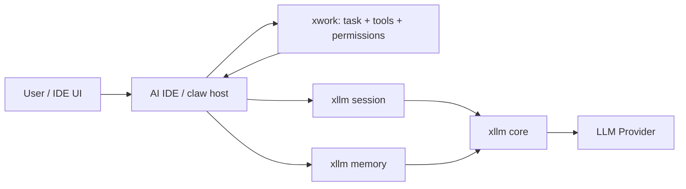

# xllm Agent Infrastructure 集成架构

本文档定义 `xllm` 作为 AI IDE / claw 基础设施库时，与 `xwork` 和宿主产品的职责边界、调用链和最小 agent loop。

## 1. 定位

`xllm` 是 LLM 基础设施库，负责模型直接相关能力：

- provider/runtime/profile/adapter。
- request/response/output/stream/error 统一抽象。
- tool call / tool result 协议建模，但不执行具体工具业务。
- session 短期上下文管理。
- memory 长期记忆、知识入库、检索、上下文注入。
- diagnostics、smoke、release gate 等 LLM 库质量保障。

`xwork` 是 agent 执行基础设施，负责模型之外的执行能力：

- task planning、调度、状态机、工作流。
- tool registry、tool execution、权限和沙箱。
- 文件、进程、终端、浏览器、IDE、VCS 等环境操作。
- 人机协作、审批、中断、恢复和审计。

AI IDE / claw 是产品宿主，负责产品策略：

- 用户交互、UI 状态、项目/用户配置。
- agent 模式选择、模型选择、默认策略。
- 是否允许长期记忆写入、是否需要用户确认。
- 多工作区、多用户、多项目隔离。

## 2. 模块职责边界

| 模块 | 负责 | 不负责 |
| --- | --- | --- |
| `xllm core` | 模型调用、provider 差异归一、stream/tool/error 语义 | 工具业务执行、任务编排、配置文件加载 |
| `xllm session` | 单会话短期上下文、历史、summary/compact、state export/import | 长期持久化、RAG 索引、跨项目状态 |
| `xllm memory` | 本地长期记忆、workspace/file ingest、检索、context apply | 工具执行、文档业务解析、远程向量数据库默认依赖 |
| `xllm memory bridge` | opt-in 的 session+memory convenience glue | 默认自动写长期记忆、替代宿主策略 |
| `xwork` | agent task、工具宿主、执行环境、权限和恢复 | provider 协议适配、memory schema、LLM response 归一 |
| AI IDE / claw | 产品策略、UX、项目配置、人机协作 | 底层 provider 协议细节、memory 内部索引实现 |

## 3. 推荐依赖方向

依赖方向必须保持单向，避免把 agent 产品逻辑塞回 `xllm`。



关键规则：

- `xllm core` 不依赖 `xwork`。
- `xllm session` 不依赖 `memory`。
- `xllm memory` 不依赖 `xwork`。
- `xllm memory bridge` 可以依赖 `session + memory`，但必须 opt-in。
- AI IDE / claw 负责把 `xllm` 和 `xwork` 组合起来。

## 4. 最小 Agent Loop

推荐的最小闭环如下：

1. AI IDE / claw 接收用户输入或任务事件，创建 `xwork` task。
2. 宿主根据 task 和当前 IDE 状态构建 `xllm_turn`。
3. 宿主使用 `xllm_memory_search_and_apply_from_turn_to_turn` 或等价两步调用，把相关 memory 注入 turn。
4. 宿主调用 `xllm_session_chat_ex`，由 session 组织短期上下文并调用 provider。
5. 如果 response 包含 tool call，宿主把 tool call 转交给 `xwork` 执行。
6. `xwork` 执行工具，返回 tool result、artifact 或错误。
7. 宿主将 tool result 作为下一轮 turn 输入，继续调用 `xllm_session_chat_ex`。
8. response 完成后，宿主按策略决定是否写入长期 memory。
9. 如需写入，宿主显式调用 `xllm_memory_ingest_turn_response` 或后续 typed extraction API。
10. 宿主提交 task 状态、UI 展示、日志和审计。

伪代码结构：

```c
xllm_turn tTurn;
xllm_response *pResponse = NULL;

xllm_turn_init(&tTurn);
xllm_turn_add_user_text(&tTurn, user_text);

xllm_memory_search_and_apply_from_turn_to_turn(
    pMemory,
    &tTurn,
    &tTurn,
    &tMemoryApplyOptions,
    &tError
);

xllm_session_chat_ex(pSession, &tTurnRequest, &tCallOptions, &pResponse, &tError);

while (xllm_response_get_tool_call_count(pResponse) > 0) {
    /* Host maps xllm tool calls to xwork tool execution. */
    run_tools_with_xwork(pResponse, &tToolResultTurn);
    xllm_response_free(pResponse);
    pResponse = NULL;
    xllm_session_chat_ex(pSession, &tToolResultTurnRequest, &tCallOptions, &pResponse, &tError);
}

if (host_policy_allows_memory_write) {
    xllm_memory_ingest_turn_response(pMemory, &tTurn, pResponse, &tIngestOptions, &tError);
}
```

## 5. Session Policy

AI IDE / claw 推荐默认 session policy：

- `session` 保存当前任务的短期对话历史。
- tool result 默认进入短期 session，但不默认进入长期 memory。
- 大型 tool result 应优先以 artifact/reference 进入上下文，而不是全文塞入。
- summary/compact 由 token budget 触发，宿主应记录 summary 是否来自模型压缩。
- session state 可随 task/checkpoint 保存，用于恢复当前任务。
- session 不跨项目复用，跨项目信息应通过明确的 memory namespace 管理。

推荐上下文优先级：

1. 当前用户 turn 和系统约束。
2. 活动文件、选区、诊断、当前 task state。
3. xwork tool result 的必要摘要或引用。
4. memory search 注入的高相关 chunk。
5. session summary。
6. 低优先级历史和低相关 memory。

## 6. Memory Policy

默认长期记忆策略必须保守：

- 不默认保存完整原始对话。
- bridge 默认只做 search-before-chat，`bIngestAfterChat=false`。
- 只有宿主显式允许时才写入长期 memory。
- 写入 conversation memory 时使用 typed metadata，例如 `memory_type` 和 `extraction_policy`。
- 可删除性是生产要求，宿主必须保留按 project/user/conversation/metadata 清理的能力。

推荐 namespace：

- 每个 workspace/project 使用独立 namespace。
- 用户全局偏好使用独立 namespace。
- 临时任务或实验性记忆使用可丢弃 namespace。

## 7. Workspace RAG Flow

AI IDE workspace RAG 推荐流程：

1. 打开项目时创建或打开 project memory namespace。
2. 对 workspace 执行 `xllm_memory_ingest_workspace` 或 `xllm_memory_sync_workspace`。
3. 文件变化由 `xwork` 或 IDE watcher 捕获，再推送给 `xllm_memory_watcher_worker`。
4. 查询时从用户 turn 构造 search query。
5. 使用 metadata/source filters 限制项目、路径、语言或 conversation 类型。
6. 使用 context apply 将结果注入 request/turn。
7. UI 展示 answer 时同时展示 source URI、chunk id、byte range 或路径引用。

当前默认仍应避免索引敏感文件。敏感文件策略见 `XLLM_AGENT_INFRA_SPEC.md` 的 Security / Privacy 任务。

## 8. Tool Call 责任划分

`xllm` 只负责这些 tool 语义：

- 统一 tool definition。
- 统一 tool choice policy。
- 解析 provider tool call。
- 生成 tool result 输入。
- 支持自动工具循环所需的协议层能力。

`xwork` 负责这些工具执行语义：

- 工具发现、注册、权限检查。
- 文件/终端/浏览器/IDE/VCS 操作。
- 超时、取消、重试、sandbox。
- tool artifact 管理。
- 人工审批。

宿主负责这些产品策略：

- 哪些工具暴露给模型。
- 哪些工具需要确认。
- tool result 是否进入 session、memory 或 artifact store。
- tool failure 是否继续、重试或转人工。

## 9. Diagnostics Flow

集成时建议每次任务保留这些诊断信息：

- provider/profile/model id。
- upstream status、request id、response id，后续由 provider diagnostics 任务补齐。
- session state version 和 compact 次数。
- memory namespace、profile、schema version、record/chunk count。
- search query、hit count、top hit source/chunk/profile。
- tool call count、tool result status、xwork execution id。

默认不得外发 telemetry。诊断输出应由宿主显式收集和持久化。

## 10. 推荐落地顺序

1. 用 `xllm core + session` 跑通基础对话。
2. 接入 `xwork` tool executor，跑通 tool call loop。
3. 接入 workspace memory，跑通本地项目 RAG。
4. 接入 conversation memory，但默认只 search-before-chat。
5. 根据产品策略开启 explicit memory writes。
6. 增加 diagnostics 面板和 smoke/eval 报告。

## 11. 不做事项

这些能力不应放入 `xllm`：

- agent task planner。
- IDE UI 和交互逻辑。
- 文件系统权限模型。
- 终端/浏览器/IDE 具体操作。
- 长期任务状态机。
- 远程配置系统。

如果某个功能既像 LLM 能力又像 agent 能力，默认先放在宿主或 `xwork`，只有当它可被多个宿主复用且不依赖具体工具环境时，再考虑下沉到 `xllm`。
