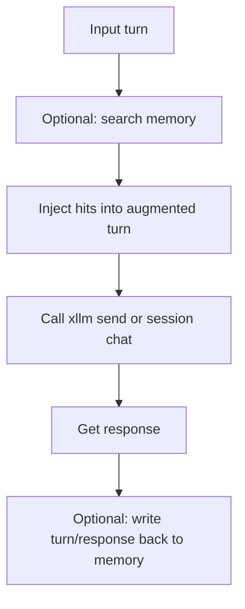

# xllm Memory Bridge API

> Header: `xllm-memory-bridge.h`

Memory Bridge combines "retrieval context" and "chat calls". It can automatically search memory and inject relevant content into a turn before sending it to the model, and it can write the turn/response back into memory after the model replies.

The default behavior is conservative: **search before chat is enabled, ingest after chat is disabled**. This means it helps the model use existing memory, but it will not automatically save new memory unless you explicitly allow it.

## Core Flow



## Types

### xllm_memory_chat_bridge_options

**Purpose:** controls what bridge does before and after chat.

```c
typedef struct {
    bool bSearchBeforeChat;
    bool bIngestAfterChat;
    xllm_memory_turn_search_apply_options tSearch;
    xllm_memory_ingest_turn_response_options tIngest;
    xvalue tVendorExtra;
} xllm_memory_chat_bridge_options;
```

| Field | Meaning |
| --- | --- |
| `bSearchBeforeChat` | Whether to search memory and inject context before chat. Default is `true`. |
| `bIngestAfterChat` | Whether to write turn/response back to memory after chat. Default is `false`. |
| `tSearch` | Search and context injection configuration. |
| `tIngest` | Post-chat ingest configuration. |
| `tVendorExtra` | Extension field. |

**Notes:** If you enable `bIngestAfterChat`, carefully set `tIngest`, such as conversation ID, turn ID, extraction policy, and whether to include system/context/thinking.

## API

### xllm_memory_chat_bridge_options_init

Initializes bridge options.

```c
XLLM_API void xllm_memory_chat_bridge_options_init(
    xllm_memory_chat_bridge_options *pOptions
);
```

Defaults:

| Field | Default |
| --- | --- |
| `bSearchBeforeChat` | `true` |
| `bIngestAfterChat` | `false` |
| `tSearch` | Defaults from `xllm_memory_turn_search_apply_options_init` |
| `tIngest` | Defaults from `xllm_memory_ingest_turn_response_options_init` |

### xllm_memory_bridge_send

Performs one memory-aware send on a lightweight `xllm` object.

```c
XLLM_API int xllm_memory_bridge_send(
    xllm_memory *pMemory,
    xllm *pLlm,
    const xllm_turn *pTurn,
    const xllm_call_options *pCallOptions,
    const xllm_memory_chat_bridge_options *pBridgeOptions,
    xllm_response **ppResponse
);
```

| Parameter | Description |
| --- | --- |
| `pMemory` | Memory object. Required when search or ingest is enabled. |
| `pLlm` | Created `xllm` object. |
| `pTurn` | Current turn input. |
| `pCallOptions` | Call options, may be `NULL`. |
| `pBridgeOptions` | Bridge configuration, may be `NULL` for defaults. |
| `ppResponse` | Output response. Free with `xllm_response_free`. |

Returns `XRT_NET_OK` on success and `XRT_NET_ERROR` on failure.

### xllm_memory_bridge_send_ex

Send version with `xllm_error`.

```c
XLLM_API int xllm_memory_bridge_send_ex(
    xllm_memory *pMemory,
    xllm *pLlm,
    const xllm_turn *pTurn,
    const xllm_call_options *pCallOptions,
    const xllm_memory_chat_bridge_options *pBridgeOptions,
    xllm_response **ppResponse,
    xllm_error *pError
);
```

Prefer the `_ex` version when learning and debugging, because it tells you whether failure happened during search, turn cloning, model call, or memory write-back.

### Send Async Series

```c
XLLM_API xfuture *xllm_memory_bridge_send_async_thread(
    xllm_memory *pMemory,
    xllm *pLlm,
    const xllm_turn *pTurn,
    const xllm_call_options *pCallOptions,
    const xllm_memory_chat_bridge_options *pBridgeOptions
);

XLLM_API xfuture *xllm_memory_bridge_send_async_engine(
    xllm_memory *pMemory,
    xllm *pLlm,
    xnetengine *pEngine,
    uint32 uAffinityKey,
    const xllm_turn *pTurn,
    const xllm_call_options *pCallOptions,
    const xllm_memory_chat_bridge_options *pBridgeOptions
);

XLLM_API xfuture *xllm_memory_bridge_send_async_co(
    xllm_memory *pMemory,
    xllm *pLlm,
    xcosched *pSched,
    const xllm_turn *pTurn,
    const xllm_call_options *pCallOptions,
    const xllm_memory_chat_bridge_options *pBridgeOptions,
    size_t iStackSize
);
```

| Function | Best For |
| --- | --- |
| `send_async_thread` | Run in a normal thread. |
| `send_async_engine` | Run in `xnetengine`, with affinity scheduling. |
| `send_async_co` | Run in a coroutine scheduler. |

Returns `xfuture *`. Invalid parameters also return a future representing an error.

### xllm_memory_bridge_session_chat

Performs one memory-aware chat on `xllm_session`.

```c
XLLM_API int xllm_memory_bridge_session_chat(
    xllm_memory *pMemory,
    xllm_session *pSession,
    const xllm_turn_request *pTurn,
    const xllm_call_options *pCallOptions,
    const xllm_memory_chat_bridge_options *pBridgeOptions,
    xllm_response **ppResponse
);
```

| Parameter | Description |
| --- | --- |
| `pMemory` | Memory object. |
| `pSession` | Session object. |
| `pTurn` | Turn request. |
| `pCallOptions` | Call options, may be `NULL`. |
| `pBridgeOptions` | Bridge configuration, may be `NULL`. |
| `ppResponse` | Output response. |

### xllm_memory_bridge_session_chat_ex

Session chat version with `xllm_error`.

```c
XLLM_API int xllm_memory_bridge_session_chat_ex(
    xllm_memory *pMemory,
    xllm_session *pSession,
    const xllm_turn_request *pTurn,
    const xllm_call_options *pCallOptions,
    const xllm_memory_chat_bridge_options *pBridgeOptions,
    xllm_response **ppResponse,
    xllm_error *pError
);
```

### Session Async Series

```c
XLLM_API xfuture *xllm_memory_bridge_session_chat_async_thread(
    xllm_memory *pMemory,
    xllm_session *pSession,
    const xllm_turn_request *pTurn,
    const xllm_call_options *pCallOptions,
    const xllm_memory_chat_bridge_options *pBridgeOptions
);

XLLM_API xfuture *xllm_memory_bridge_session_chat_async_engine(
    xllm_memory *pMemory,
    xllm_session *pSession,
    xnetengine *pEngine,
    uint32 uAffinityKey,
    const xllm_turn_request *pTurn,
    const xllm_call_options *pCallOptions,
    const xllm_memory_chat_bridge_options *pBridgeOptions
);

XLLM_API xfuture *xllm_memory_bridge_session_chat_async_co(
    xllm_memory *pMemory,
    xllm_session *pSession,
    xcosched *pSched,
    const xllm_turn_request *pTurn,
    const xllm_call_options *pCallOptions,
    const xllm_memory_chat_bridge_options *pBridgeOptions,
    size_t iStackSize
);
```

## Example: Search Before Chat, No Write-Back

```c
xllm_memory_chat_bridge_options bridge;
xllm_response *response = NULL;
xllm_error error;

xllm_error_init(&error);
xllm_memory_chat_bridge_options_init(&bridge);

bridge.bSearchBeforeChat = true;
bridge.bIngestAfterChat = false;
bridge.tSearch.tSearchOptions.eScope = XLLM_MEMORY_SCOPE_ANY;
bridge.tSearch.tContextOptions.uMaxHits = 4;
bridge.tSearch.tContextOptions.uMaxCharsPerHit = 600;

if (xllm_memory_bridge_send_ex(
        memory,
        llm,
        &turn,
        NULL,
        &bridge,
        &response,
        &error) != XRT_NET_OK) {
    fprintf(stderr, "bridge failed: %s\n", error.sMessage);
}

xllm_response_free(response);
xllm_error_reset(&error);
```

## Example: Write Conversation Memory After Chat

```c
xllm_memory_chat_bridge_options bridge;
xllm_memory_chat_bridge_options_init(&bridge);

bridge.bSearchBeforeChat = true;
bridge.bIngestAfterChat = true;
bridge.tIngest.sConversationId = "conv-001";
bridge.tIngest.sTurnId = "turn-008";
bridge.tIngest.sRecordId = "memory:conv-001:turn-008";
bridge.tIngest.eExtractionPolicy = XLLM_MEMORY_EXTRACTION_POLICY_TURN_RESPONSE;
bridge.tIngest.bIncludeSystemPrompt = false;
bridge.tIngest.bIncludeContextBlocks = false;

xllm_memory_bridge_session_chat(
    memory,
    session,
    &turn_request,
    NULL,
    &bridge,
    &response);
```

## Common Mistakes

### Enabling write-back without stable IDs

If `bIngestAfterChat = true`, set `sConversationId`, `sTurnId`, and a stable `sRecordId`. Otherwise repeated calls may generate multiple hard-to-manage memory records.

### Ignoring that bridge clones the turn

Bridge clones the input turn, injects memory context into the cloned turn, then calls underlying chat. The original turn is not modified.

### Not freeing response

Every `xllm_response *` returned by bridge chat is freed by the caller.

## Related Documentation

- [Memory Search API](api-memory-search.en.md)
- [Memory Ingest API](api-memory-ingest.en.md)
- [Session API](api-session.en.md)
- [Back to API Index](README.en.md)
