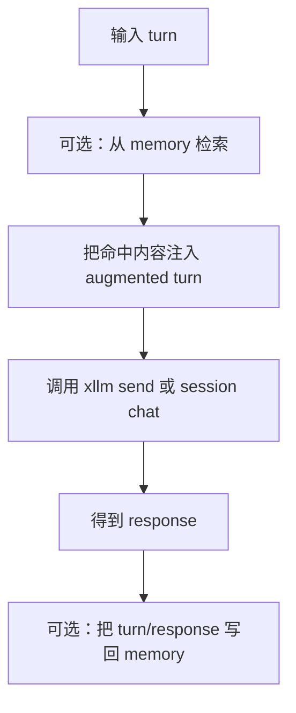

# xllm Memory Bridge API

> 状态：中文初稿已生成，待审阅。  
> 头文件：`xllm-memory-bridge.h`

Memory Bridge 把“检索上下文”和“聊天调用”组合在一起。它可以在发送给模型之前自动从 memory 检索相关内容并注入 turn，也可以在模型回复后把本轮对话写回 memory。

默认行为很保守：**发送前检索开启，聊天后写入关闭**。这意味着它会帮助模型利用已有记忆，但不会在你没明确允许时自动保存新记忆。

## 核心流程



## 类型

### xllm_memory_chat_bridge_options

**功能**：控制 bridge 在 chat 前后做什么。

```c
typedef struct {
    bool bSearchBeforeChat;
    bool bIngestAfterChat;
    xllm_memory_turn_search_apply_options tSearch;
    xllm_memory_ingest_turn_response_options tIngest;
    xvalue tVendorExtra;
} xllm_memory_chat_bridge_options;
```

| 字段 | 含义 |
| --- | --- |
| `bSearchBeforeChat` | chat 前是否检索 memory 并注入上下文。默认 `true`。 |
| `bIngestAfterChat` | chat 后是否把 turn/response 写回 memory。默认 `false`。 |
| `tSearch` | 搜索和上下文注入配置。 |
| `tIngest` | chat 后入库配置。 |
| `tVendorExtra` | 扩展字段。 |

**补充说明**：如果你打开 `bIngestAfterChat`，需要认真设置 `tIngest`，例如 conversation id、turn id、提取策略、是否包含 system/context/thinking。

## API

### xllm_memory_chat_bridge_options_init

**功能**：初始化 bridge options。

**原型**：

```c
XLLM_API void xllm_memory_chat_bridge_options_init(
    xllm_memory_chat_bridge_options *pOptions
);
```

**默认值**：

| 字段 | 默认值 |
| --- | --- |
| `bSearchBeforeChat` | `true` |
| `bIngestAfterChat` | `false` |
| `tSearch` | `xllm_memory_turn_search_apply_options_init` 的默认值 |
| `tIngest` | `xllm_memory_ingest_turn_response_options_init` 的默认值 |

### xllm_memory_bridge_send

**功能**：对轻量 `xllm` 对象执行一次 memory-aware send。

**原型**：

```c
XLLM_API int xllm_memory_bridge_send(
    xllm_memory *pMemory,
    xllm *pLlm,
    const xllm_turn *pTurn,
    const xllm_call_options *pCallOptions,
    const xllm_memory_chat_bridge_options *pBridgeOptions,
    xllm_response **ppResponse
);
```

**参数**：

| 参数 | 说明 |
| --- | --- |
| `pMemory` | memory 对象。启用搜索或写入时需要。 |
| `pLlm` | 已创建的 `xllm` 对象。 |
| `pTurn` | 本轮输入。 |
| `pCallOptions` | 调用参数，可为 `NULL`。 |
| `pBridgeOptions` | bridge 配置，可为 `NULL` 使用默认值。 |
| `ppResponse` | 输出 response。使用后调用 `xllm_response_free`。 |

**返回值**：成功返回 `XRT_NET_OK`，失败返回 `XRT_NET_ERROR`。

### xllm_memory_bridge_send_ex

**功能**：带 `xllm_error` 的 send 版本。

```c
XLLM_API int xllm_memory_bridge_send_ex(
    xllm_memory *pMemory,
    xllm *pLlm,
    const xllm_turn *pTurn,
    const xllm_call_options *pCallOptions,
    const xllm_memory_chat_bridge_options *pBridgeOptions,
    xllm_response **ppResponse,
    xllm_error *pError
);
```

**补充说明**：学习和调试时优先使用 `_ex` 版本，因为它能告诉你失败发生在搜索、turn clone、模型调用还是写回 memory。

### send async 系列

**功能**：异步执行 memory-aware send。

```c
XLLM_API xfuture *xllm_memory_bridge_send_async_thread(
    xllm_memory *pMemory,
    xllm *pLlm,
    const xllm_turn *pTurn,
    const xllm_call_options *pCallOptions,
    const xllm_memory_chat_bridge_options *pBridgeOptions
);

XLLM_API xfuture *xllm_memory_bridge_send_async_engine(
    xllm_memory *pMemory,
    xllm *pLlm,
    xnetengine *pEngine,
    uint32 uAffinityKey,
    const xllm_turn *pTurn,
    const xllm_call_options *pCallOptions,
    const xllm_memory_chat_bridge_options *pBridgeOptions
);

XLLM_API xfuture *xllm_memory_bridge_send_async_co(
    xllm_memory *pMemory,
    xllm *pLlm,
    xcosched *pSched,
    const xllm_turn *pTurn,
    const xllm_call_options *pCallOptions,
    const xllm_memory_chat_bridge_options *pBridgeOptions,
    size_t iStackSize
);
```

| 函数 | 适合场景 |
| --- | --- |
| `send_async_thread` | 用普通线程执行。 |
| `send_async_engine` | 放到 `xnetengine` 中执行，可用 affinity 控制调度。 |
| `send_async_co` | 放到协程调度器中执行。 |

**返回值**：返回 `xfuture *`。如果参数无效，也会返回一个表示错误的 future。

### xllm_memory_bridge_session_chat

**功能**：对 `xllm_session` 执行一次 memory-aware chat。

**原型**：

```c
XLLM_API int xllm_memory_bridge_session_chat(
    xllm_memory *pMemory,
    xllm_session *pSession,
    const xllm_turn_request *pTurn,
    const xllm_call_options *pCallOptions,
    const xllm_memory_chat_bridge_options *pBridgeOptions,
    xllm_response **ppResponse
);
```

**参数**：

| 参数 | 说明 |
| --- | --- |
| `pMemory` | memory 对象。 |
| `pSession` | session 对象。 |
| `pTurn` | turn request。 |
| `pCallOptions` | 调用参数，可为 `NULL`。 |
| `pBridgeOptions` | bridge 配置，可为 `NULL`。 |
| `ppResponse` | 输出 response。 |

### xllm_memory_bridge_session_chat_ex

**功能**：带 `xllm_error` 的 session chat 版本。

```c
XLLM_API int xllm_memory_bridge_session_chat_ex(
    xllm_memory *pMemory,
    xllm_session *pSession,
    const xllm_turn_request *pTurn,
    const xllm_call_options *pCallOptions,
    const xllm_memory_chat_bridge_options *pBridgeOptions,
    xllm_response **ppResponse,
    xllm_error *pError
);
```

### session async 系列

**功能**：异步执行 memory-aware session chat。

```c
XLLM_API xfuture *xllm_memory_bridge_session_chat_async_thread(
    xllm_memory *pMemory,
    xllm_session *pSession,
    const xllm_turn_request *pTurn,
    const xllm_call_options *pCallOptions,
    const xllm_memory_chat_bridge_options *pBridgeOptions
);

XLLM_API xfuture *xllm_memory_bridge_session_chat_async_engine(
    xllm_memory *pMemory,
    xllm_session *pSession,
    xnetengine *pEngine,
    uint32 uAffinityKey,
    const xllm_turn_request *pTurn,
    const xllm_call_options *pCallOptions,
    const xllm_memory_chat_bridge_options *pBridgeOptions
);

XLLM_API xfuture *xllm_memory_bridge_session_chat_async_co(
    xllm_memory *pMemory,
    xllm_session *pSession,
    xcosched *pSched,
    const xllm_turn_request *pTurn,
    const xllm_call_options *pCallOptions,
    const xllm_memory_chat_bridge_options *pBridgeOptions,
    size_t iStackSize
);
```

## 范例：chat 前检索，chat 后不写入

```c
xllm_memory_chat_bridge_options bridge;
xllm_response *response = NULL;
xllm_error error;

xllm_error_init(&error);
xllm_memory_chat_bridge_options_init(&bridge);

bridge.bSearchBeforeChat = true;
bridge.bIngestAfterChat = false;
bridge.tSearch.tSearchOptions.eScope = XLLM_MEMORY_SCOPE_ANY;
bridge.tSearch.tContextOptions.uMaxHits = 4;
bridge.tSearch.tContextOptions.uMaxCharsPerHit = 600;

if (xllm_memory_bridge_send_ex(
        memory,
        llm,
        &turn,
        NULL,
        &bridge,
        &response,
        &error) != XRT_NET_OK) {
    fprintf(stderr, "bridge failed: %s\n", error.sMessage);
}

xllm_response_free(response);
xllm_error_reset(&error);
```

## 范例：chat 后写回对话记忆

```c
xllm_memory_chat_bridge_options bridge;
xllm_memory_chat_bridge_options_init(&bridge);

bridge.bSearchBeforeChat = true;
bridge.bIngestAfterChat = true;
bridge.tIngest.sConversationId = "conv-001";
bridge.tIngest.sTurnId = "turn-008";
bridge.tIngest.sRecordId = "memory:conv-001:turn-008";
bridge.tIngest.eExtractionPolicy = XLLM_MEMORY_EXTRACTION_POLICY_TURN_RESPONSE;
bridge.tIngest.bIncludeSystemPrompt = false;
bridge.tIngest.bIncludeContextBlocks = false;

xllm_memory_bridge_session_chat(
    memory,
    session,
    &turn_request,
    NULL,
    &bridge,
    &response);
```

## 常见错误

### 打开写回但没有设置稳定 ID

如果 `bIngestAfterChat = true`，建议设置 `sConversationId`、`sTurnId` 和稳定的 `sRecordId`。否则重复调用时可能生成多条难以管理的记忆。

### 忽略 bridge 会克隆 turn

bridge 会克隆输入 turn，在克隆后的 turn 上注入 memory context，再调用底层 chat。原始 turn 不会被改写。

### 不释放 response

所有 bridge chat 成功返回的 `xllm_response *` 都由调用方释放。

## 相关文档

- [Memory Search API](api-memory-search.md)
- [Memory Ingest API](api-memory-ingest.md)
- [Session API](api-session.md)
- [返回 API 索引](README.md)
