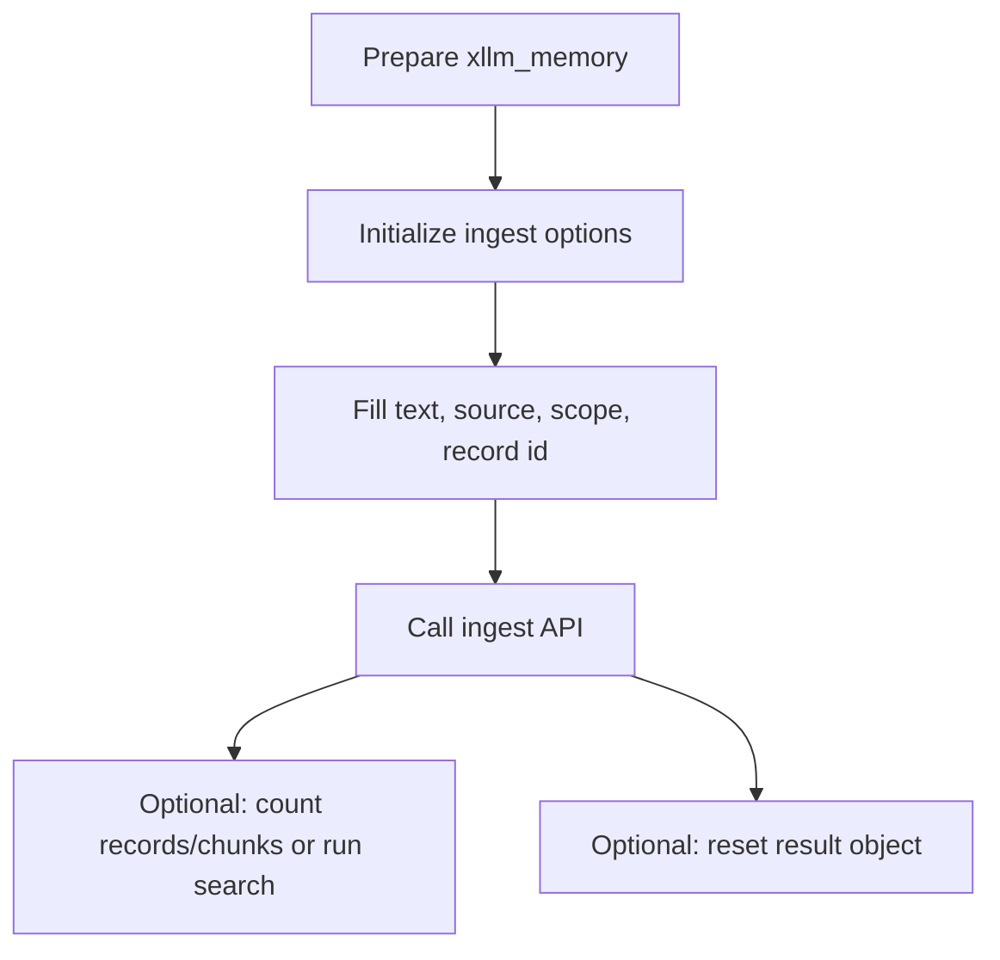

# xllm Memory Ingest API

> Header: `xllm-memory.h`

This page explains how to write content into xllm memory. Ingest APIs cover common inputs: one text block, one conversation response, tasks, facts, preferences, a single file, a directory, and a workspace.

When learning, remember one core action: **initialize options first, fill the fields you care about, then call the ingest function**.

## Ingest Flow



## Types

### xllm_memory_ingest_options

**Purpose:** configuration for normal text ingest.

```c
typedef struct {
    xllm_memory_scope eScope;
    const char *sRecordId;
    const char *sTitle;
    const char *sSourceUri;
    const char *sText;
    bool bReplaceExisting;
    uint32 uChunkChars;
    uint32 uChunkOverlapChars;
    xvalue tMetadata;
    xvalue tVendorExtra;
} xllm_memory_ingest_options;
```

| Field | Meaning |
| --- | --- |
| `eScope` | Target scope. Default is `KNOWLEDGE`. |
| `sRecordId` | Record ID. If empty, xllm generates or derives an ID. |
| `sTitle` | Title, usually used for display and debugging. |
| `sSourceUri` | Source URI, such as `file:///...` or `conversation://...`. |
| `sText` | Text to ingest. |
| `bReplaceExisting` | Whether to replace an existing record with the same ID. Default is `true`. |
| `uChunkChars` | Chunk character count for this ingest. `0` uses memory default. |
| `uChunkOverlapChars` | Chunk overlap character count for this ingest. `0` uses memory default. |
| `tMetadata` | Metadata object. |
| `tVendorExtra` | Extension field. |

### xllm_memory_ingest_turn_response_options

**Purpose:** turns one turn and response into conversation memory.

```c
typedef struct {
    xllm_memory_scope eScope;
    xllm_memory_extraction_policy eExtractionPolicy;
    const xllm_turn *pTurn;
    const xllm_response *pResponse;
    const char *sSummaryText;
    const char *sConversationId;
    const char *sTurnId;
    const char *sRecordId;
    const char *sTitle;
    const char *sSourceUri;
    bool bReplaceExisting;
    bool bUseStableIdentity;
    int32 iPriority;
    int64 iExpiresAtUnix;
    int64 iUpdatedAtUnix;
    bool bIncludeSystemPrompt;
    bool bIncludeContextBlocks;
    bool bIncludeThinking;
    uint32 uChunkChars;
    uint32 uChunkOverlapChars;
    xvalue tMetadata;
    xvalue tVendorExtra;
} xllm_memory_ingest_turn_response_options;
```

**Defaults:** scope is `MEMORY`, extraction policy is `TURN_RESPONSE`, existing records with the same ID are replaced, and system prompt, context blocks, and thinking are not included.

**Learning advice:** If you already have summary text, prefer filling `sSummaryText`. If you want xllm to organize text from the turn/response, fill `pTurn` and `pResponse`.

### xllm_memory_extraction_policy

**Purpose:** describes what kind of content should be extracted during conversation ingest.

```c
typedef enum {
    XLLM_MEMORY_EXTRACTION_POLICY_DEFAULT = 0,
    XLLM_MEMORY_EXTRACTION_POLICY_NONE,
    XLLM_MEMORY_EXTRACTION_POLICY_TURN_RESPONSE,
    XLLM_MEMORY_EXTRACTION_POLICY_SUMMARY,
    XLLM_MEMORY_EXTRACTION_POLICY_TASK,
    XLLM_MEMORY_EXTRACTION_POLICY_FACT,
    XLLM_MEMORY_EXTRACTION_POLICY_PREFERENCE
} xllm_memory_extraction_policy;
```

| Value | Meaning |
| --- | --- |
| `DEFAULT` | Use default policy. |
| `NONE` | Do no extra extraction; use provided text directly. |
| `TURN_RESPONSE` | Record this turn's question/answer content. |
| `SUMMARY` | Ingest a summary. |
| `TASK` | Ingest task memory. |
| `FACT` | Ingest fact memory. |
| `PREFERENCE` | Ingest preference memory. |

### xllm_memory_ingest_task_options

**Purpose:** ingests one task.

```c
typedef struct {
    xllm_memory_scope eScope;
    xllm_memory_task_status eStatus;
    const char *sTaskId;
    const char *sOwner;
    int64 iDeadlineUnix;
    const char *sSourceConversationId;
    const char *sSourceTurnId;
    const char *sRecordId;
    const char *sTitle;
    const char *sSourceUri;
    const char *sText;
    bool bReplaceExisting;
    int32 iPriority;
    int64 iExpiresAtUnix;
    int64 iUpdatedAtUnix;
    uint32 uChunkChars;
    uint32 uChunkOverlapChars;
    xvalue tMetadata;
    xvalue tVendorExtra;
} xllm_memory_ingest_task_options;
```

**Defaults:** scope is `MEMORY`, status is `OPEN`, same-ID records are replaced, and priority/expires/updated are `0`.

### xllm_memory_task_status

**Purpose:** describes task status.

```c
typedef enum {
    XLLM_MEMORY_TASK_STATUS_OPEN = 0,
    XLLM_MEMORY_TASK_STATUS_DONE,
    XLLM_MEMORY_TASK_STATUS_CANCELED
} xllm_memory_task_status;
```

### xllm_memory_ingest_fact_options

**Purpose:** ingests one structured fact.

```c
typedef struct {
    xllm_memory_scope eScope;
    const char *sFactId;
    const char *sSubject;
    const char *sPredicate;
    const char *sObject;
    const char *sSourceConversationId;
    const char *sSourceTurnId;
    const char *sRecordId;
    const char *sTitle;
    const char *sSourceUri;
    const char *sText;
    bool bReplaceExisting;
    int32 iPriority;
    int64 iExpiresAtUnix;
    int64 iUpdatedAtUnix;
    uint32 uChunkChars;
    uint32 uChunkOverlapChars;
    xvalue tMetadata;
    xvalue tVendorExtra;
} xllm_memory_ingest_fact_options;
```

**Example:** `subject = "user"`, `predicate = "works_on"`, `object = "xllm documentation"`.

### xllm_memory_ingest_preference_options

**Purpose:** ingests one user or conversation preference.

```c
typedef struct {
    xllm_memory_scope eScope;
    const char *sPreferenceId;
    const char *sSubject;
    const char *sKey;
    const char *sValue;
    const char *sSourceConversationId;
    const char *sSourceTurnId;
    const char *sRecordId;
    const char *sTitle;
    const char *sSourceUri;
    const char *sText;
    bool bReplaceExisting;
    int32 iPriority;
    int64 iExpiresAtUnix;
    int64 iUpdatedAtUnix;
    uint32 uChunkChars;
    uint32 uChunkOverlapChars;
    xvalue tMetadata;
    xvalue tVendorExtra;
} xllm_memory_ingest_preference_options;
```

**Example:** `subject = "user"`, `key = "answer_style"`, `value = "concise Chinese"`.

### xllm_memory_ingest_file_options

**Purpose:** ingests a single file.

```c
typedef struct {
    xllm_memory_scope eScope;
    const char *sPath;
    const char *sRecordId;
    const char *sTitle;
    const char *sSourceUri;
    bool bReplaceExisting;
    uint64 uMaxFileBytes;
    uint32 uChunkChars;
    uint32 uChunkOverlapChars;
    xvalue tMetadata;
    xvalue tVendorExtra;
} xllm_memory_ingest_file_options;
```

| Field | Meaning |
| --- | --- |
| `sPath` | File path, required. |
| `uMaxFileBytes` | File size limit. `0` means use default or no limit. |
| `sSourceUri` | Source URI. If empty, xllm derives one from the path. |

### Directory Ingest Progress Types

**Purpose:** during directory and workspace ingest, the callback tells you the processing status for each file.

```c
typedef enum {
    XLLM_MEMORY_INGEST_PROGRESS_VISITED = 1,
    XLLM_MEMORY_INGEST_PROGRESS_INGESTED,
    XLLM_MEMORY_INGEST_PROGRESS_SKIPPED,
    XLLM_MEMORY_INGEST_PROGRESS_FAILED
} xllm_memory_ingest_progress_kind;
```

| Value | Meaning |
| --- | --- |
| `VISITED` | File was visited. |
| `INGESTED` | File was ingested successfully. |
| `SKIPPED` | File was skipped by rules. |
| `FAILED` | File processing failed. |

### xllm_memory_skip_reason

**Purpose:** explains why a file was skipped.

```c
typedef enum {
    XLLM_MEMORY_SKIP_HIDDEN = 1,
    XLLM_MEMORY_SKIP_IGNORED_DIRECTORY,
    XLLM_MEMORY_SKIP_IGNORED_PATH_PATTERN,
    XLLM_MEMORY_SKIP_IGNORED_EXTENSION,
    XLLM_MEMORY_SKIP_DISALLOWED_EXTENSION,
    XLLM_MEMORY_SKIP_TOO_LARGE,
    XLLM_MEMORY_SKIP_UNCHANGED,
    XLLM_MEMORY_SKIP_SECRET_DETECTED
} xllm_memory_skip_reason;
```

These reasons are useful for learners. If fewer files are ingested than expected, first inspect skipped files instead of assuming retrieval is broken.

### xllm_memory_ingest_directory_options

**Purpose:** ingests files from a directory.

```c
typedef struct {
    xllm_memory_scope eScope;
    const char *sPath;
    const char *sRecordIdPrefix;
    const char *sAllowedExtensions;
    bool bRecursive;
    bool bReplaceExisting;
    bool bSkipHidden;
    bool bUseWorkspaceDefaults;
    bool bSkipUnchanged;
    const char *sIgnoredDirectories;
    const char *sIgnoredExtensions;
    const char *sIgnoredPathPatterns;
    const char *sSourceUriPrefix;
    uint64 uMaxFileBytes;
    uint32 uChunkChars;
    uint32 uChunkOverlapChars;
    xllm_memory_ingest_progress_fn pfnProgress;
    void *pProgressCtx;
    xvalue tMetadata;
    xvalue tVendorExtra;
} xllm_memory_ingest_directory_options;
```

**Defaults:** scope is `KNOWLEDGE`, traversal is recursive, same-ID records are replaced, hidden files are skipped, unchanged files are not skipped.

**Notes:** `sAllowedExtensions` limits file extensions. Use simple text-like extension sets in tutorials.

### xllm_memory_ingest_workspace_options

**Purpose:** ingests a directory using workspace rules.

```c
typedef struct {
    xllm_memory_scope eScope;
    const char *sPath;
    const char *sRecordIdPrefix;
    bool bRecursive;
    bool bReplaceExisting;
    bool bSkipHidden;
    bool bSkipUnchanged;
    bool bLoadGitIgnore;
    const char *sAllowedExtensions;
    const char *sIgnoredDirectories;
    const char *sIgnoredExtensions;
    const char *sIgnoredPathPatterns;
    const char *sIgnoreFiles;
    const char *sSourceUriPrefix;
    uint64 uMaxFileBytes;
    uint32 uChunkChars;
    uint32 uChunkOverlapChars;
    xllm_memory_ingest_progress_fn pfnProgress;
    void *pProgressCtx;
    xvalue tMetadata;
    xvalue tVendorExtra;
} xllm_memory_ingest_workspace_options;
```

**Defaults:** scope is `KNOWLEDGE`, traversal is recursive, same-ID records are replaced, hidden files and unchanged files are skipped, `.gitignore` is loaded, and default workspace source URI prefix and file-size limit are used.

### xllm_memory_ingest_directory_result

**Purpose:** stores directory or workspace ingest results.

```c
typedef struct {
    uint32 uVisitedFileCount;
    uint32 uIngestedFileCount;
    uint32 uCreatedRecordCount;
    uint32 uUpdatedRecordCount;
    uint32 uSkippedFileCount;
    uint32 uFailedFileCount;
    xllm_memory_record_info *pCreatedRecords;
    size_t iCreatedDetailCount;
    xllm_memory_record_info *pUpdatedRecords;
    size_t iUpdatedDetailCount;
    xllm_memory_skipped_file_info *pSkippedFiles;
    size_t iSkippedDetailCount;
    xllm_memory_failed_file_info *pFailedFiles;
    size_t iFailedDetailCount;
} xllm_memory_ingest_directory_result;
```

**Cleanup rule:** use `xllm_memory_ingest_directory_result_reset` to release detail arrays.

## API

### xllm_memory_ingest_options_init

**Purpose:** initializes normal text ingest options.

**Prototype:**

```c
XLLM_API void xllm_memory_ingest_options_init(
    xllm_memory_ingest_options *pOptions
);
```

**Parameters:**

| Parameter | Description |
| --- | --- |
| `pOptions` | Options to initialize. |

**Return Value:** none.

**Defaults:** scope is `KNOWLEDGE`, `bReplaceExisting = true`.

### xllm_memory_ingest_text

**Purpose:** writes one text block into memory.

**Prototype:**

```c
XLLM_API int xllm_memory_ingest_text(
    xllm_memory *pMemory,
    const xllm_memory_ingest_options *pOptions,
    xllm_error *pError
);
```

**Parameters:**

| Parameter | Description |
| --- | --- |
| `pMemory` | Memory object. |
| `pOptions` | Ingest configuration; usually must provide `sText`. |
| `pError` | Error object, may be `NULL`. |

**Return Value:**

| Return Value | Meaning |
| --- | --- |
| `XRT_NET_OK` | Ingest succeeded. |
| `XRT_NET_ERROR` | Invalid parameter, empty text, chunk generation failure, storage failure, or embedding failure. |

**Notes:** `sRecordId` determines replacement behavior. Use different IDs if you want a new record each time. Use a stable ID with `bReplaceExisting = true` if you want to update the same material repeatedly.

**Example Code:**

```c
xllm_memory_ingest_options ingest;
xllm_error error;

xllm_error_init(&error);
xllm_memory_ingest_options_init(&ingest);
ingest.eScope = XLLM_MEMORY_SCOPE_KNOWLEDGE;
ingest.sRecordId = "doc:intro";
ingest.sTitle = "xllm introduction";
ingest.sSourceUri = "manual://intro";
ingest.sText = "xllm is a C API library for LLM applications.";

if (xllm_memory_ingest_text(memory, &ingest, &error) != XRT_NET_OK) {
    fprintf(stderr, "ingest failed: %s\n", error.sMessage);
}
xllm_error_reset(&error);
```

### xllm_memory_ingest_turn_response_options_init

**Purpose:** initializes conversation response ingest options.

**Prototype:**

```c
XLLM_API void xllm_memory_ingest_turn_response_options_init(
    xllm_memory_ingest_turn_response_options *pOptions
);
```

**Defaults:** scope is `MEMORY`, policy is `TURN_RESPONSE`, same-ID records are replaced, and system/context/thinking are not included.

### xllm_memory_ingest_turn_response

**Purpose:** writes one conversation turn and model response as memory.

**Prototype:**

```c
XLLM_API int xllm_memory_ingest_turn_response(
    xllm_memory *pMemory,
    const xllm_memory_ingest_turn_response_options *pOptions,
    xllm_error *pError
);
```

**Parameters:**

| Parameter | Description |
| --- | --- |
| `pMemory` | Memory object. |
| `pOptions` | Conversation ingest configuration. |
| `pError` | Error object, may be `NULL`. |

**Return Value:** `XRT_NET_OK` on success, `XRT_NET_ERROR` on failure.

**Notes:** This API fits after one chat call completes. You can save complete Q&A content or provide `sSummaryText` for a shorter summary.

**Example Code:**

```c
xllm_memory_ingest_turn_response_options options;
xllm_memory_ingest_turn_response_options_init(&options);
options.sConversationId = "conv-001";
options.sTurnId = "turn-010";
options.sSummaryText = "User wants documentation in Chinese, organized for learners.";
options.sRecordId = "memory:conv-001:turn-010";
options.sTitle = "Documentation writing preference";

xllm_memory_ingest_turn_response(memory, &options, NULL);
```

### xllm_memory_ingest_task_options_init

**Purpose:** initializes task ingest options.

```c
XLLM_API void xllm_memory_ingest_task_options_init(
    xllm_memory_ingest_task_options *pOptions
);
```

**Defaults:** scope is `MEMORY`, status is `OPEN`, same-ID records are replaced.

### xllm_memory_ingest_task

**Purpose:** ingests one task.

```c
XLLM_API int xllm_memory_ingest_task(
    xllm_memory *pMemory,
    const xllm_memory_ingest_task_options *pOptions,
    xllm_error *pError
);
```

**Parameters:**

| Parameter | Description |
| --- | --- |
| `pMemory` | Memory object. |
| `pOptions` | Task content and metadata. |
| `pError` | Error object, may be `NULL`. |

**Return Value:** `XRT_NET_OK` on success, `XRT_NET_ERROR` on failure.

**Example Code:**

```c
xllm_memory_ingest_task_options task;
xllm_memory_ingest_task_options_init(&task);
task.sTaskId = "task-doc-api-memory";
task.sOwner = "docs";
task.sTitle = "Complete memory API documentation";
task.sText = "Complete xllm memory API docs using the xrt API documentation standard.";
task.iPriority = 10;

xllm_memory_ingest_task(memory, &task, NULL);
```

### xllm_memory_ingest_fact_options_init

**Purpose:** initializes fact ingest options.

```c
XLLM_API void xllm_memory_ingest_fact_options_init(
    xllm_memory_ingest_fact_options *pOptions
);
```

**Defaults:** scope is `MEMORY`, same-ID records are replaced.

### xllm_memory_ingest_fact

**Purpose:** ingests a structured fact.

```c
XLLM_API int xllm_memory_ingest_fact(
    xllm_memory *pMemory,
    const xllm_memory_ingest_fact_options *pOptions,
    xllm_error *pError
);
```

**Return Value:** `XRT_NET_OK` on success, `XRT_NET_ERROR` on failure.

**Notes:** Facts fit relatively stable information, such as "project xllm's documentation directory is docs/". If the information may change soon, set `iExpiresAtUnix`.

**Example Code:**

```c
xllm_memory_ingest_fact_options fact;
xllm_memory_ingest_fact_options_init(&fact);
fact.sFactId = "fact:xllm:docs-path";
fact.sSubject = "xllm";
fact.sPredicate = "docs_path";
fact.sObject = "docs/";
fact.sTitle = "xllm documentation directory";

xllm_memory_ingest_fact(memory, &fact, NULL);
```

### xllm_memory_ingest_preference_options_init

**Purpose:** initializes preference ingest options.

```c
XLLM_API void xllm_memory_ingest_preference_options_init(
    xllm_memory_ingest_preference_options *pOptions
);
```

**Defaults:** scope is `MEMORY`, same-ID records are replaced.

### xllm_memory_ingest_preference

**Purpose:** ingests a preference.

```c
XLLM_API int xllm_memory_ingest_preference(
    xllm_memory *pMemory,
    const xllm_memory_ingest_preference_options *pOptions,
    xllm_error *pError
);
```

**Return Value:** `XRT_NET_OK` on success, `XRT_NET_ERROR` on failure.

**Example Code:**

```c
xllm_memory_ingest_preference_options pref;
xllm_memory_ingest_preference_options_init(&pref);
pref.sPreferenceId = "pref:user:doc-language";
pref.sSubject = "user";
pref.sKey = "documentation_language";
pref.sValue = "en-US";
pref.sTitle = "Documentation language preference";

xllm_memory_ingest_preference(memory, &pref, NULL);
```

### xllm_memory_ingest_file_options_init

**Purpose:** initializes single-file ingest options.

```c
XLLM_API void xllm_memory_ingest_file_options_init(
    xllm_memory_ingest_file_options *pOptions
);
```

**Defaults:** scope is `KNOWLEDGE`, same-ID records are replaced.

### xllm_memory_ingest_file

**Purpose:** reads file content and writes it into memory.

```c
XLLM_API int xllm_memory_ingest_file(
    xllm_memory *pMemory,
    const xllm_memory_ingest_file_options *pOptions,
    xllm_error *pError
);
```

**Parameters:**

| Parameter | Description |
| --- | --- |
| `pMemory` | Memory object. |
| `pOptions` | File ingest configuration. `sPath` is required. |
| `pError` | Error object, may be `NULL`. |

**Return Value:** `XRT_NET_OK` on success, `XRT_NET_ERROR` on failure.

**Notes:** This API fits one note, configuration file, or document. For a whole directory, use `xllm_memory_ingest_directory` or `xllm_memory_ingest_workspace`.

**Example Code:**

```c
xllm_memory_ingest_file_options file_options;
xllm_memory_ingest_file_options_init(&file_options);
file_options.sPath = "README.md";
file_options.sRecordId = "file:README.md";
file_options.sTitle = "Project README";

xllm_memory_ingest_file(memory, &file_options, NULL);
```

### xllm_memory_ingest_directory_options_init

**Purpose:** initializes directory ingest options.

```c
XLLM_API void xllm_memory_ingest_directory_options_init(
    xllm_memory_ingest_directory_options *pOptions
);
```

**Defaults:** scope is `KNOWLEDGE`, traversal is recursive, same-ID records are replaced, hidden files are skipped, unchanged files are not skipped.

### xllm_memory_ingest_directory_result_init

**Purpose:** initializes a directory ingest result object.

```c
XLLM_API void xllm_memory_ingest_directory_result_init(
    xllm_memory_ingest_directory_result *pResult
);
```

**Return Value:** none.

### xllm_memory_ingest_directory_result_reset

**Purpose:** releases internal arrays in a directory ingest result object.

```c
XLLM_API void xllm_memory_ingest_directory_result_reset(
    xllm_memory_ingest_directory_result *pResult
);
```

**Notes:** If you pass a result object to `xllm_memory_ingest_directory`, reset it when you no longer need the result.

### xllm_memory_ingest_directory

**Purpose:** traverses a directory and ingests files that match the rules.

```c
XLLM_API int xllm_memory_ingest_directory(
    xllm_memory *pMemory,
    const xllm_memory_ingest_directory_options *pOptions,
    xllm_memory_ingest_directory_result *pResult,
    xllm_error *pError
);
```

**Parameters:**

| Parameter | Description |
| --- | --- |
| `pMemory` | Memory object. |
| `pOptions` | Directory ingest configuration. `sPath` is required. |
| `pResult` | Output result, may be `NULL`. |
| `pError` | Error object, may be `NULL`. |

**Return Value:** `XRT_NET_OK` on success, `XRT_NET_ERROR` on failure.

**Notes:** Even when the function succeeds, some files may be skipped. Inspect `uSkippedFileCount` and `pSkippedFiles`.

**Example Code:**

```c
xllm_memory_ingest_directory_options options;
xllm_memory_ingest_directory_result result;

xllm_memory_ingest_directory_options_init(&options);
xllm_memory_ingest_directory_result_init(&result);

options.sPath = "docs";
options.sRecordIdPrefix = "docs:";
options.sAllowedExtensions = ".md;.txt";
options.bRecursive = true;

if (xllm_memory_ingest_directory(memory, &options, &result, NULL) == XRT_NET_OK) {
    printf("visited=%u ingested=%u skipped=%u failed=%u\n",
        result.uVisitedFileCount,
        result.uIngestedFileCount,
        result.uSkippedFileCount,
        result.uFailedFileCount);
}

xllm_memory_ingest_directory_result_reset(&result);
```

### xllm_memory_ingest_workspace_options_init

**Purpose:** initializes workspace ingest options.

```c
XLLM_API void xllm_memory_ingest_workspace_options_init(
    xllm_memory_ingest_workspace_options *pOptions
);
```

**Defaults:** scope is `KNOWLEDGE`, traversal is recursive, same-ID records are replaced, hidden and unchanged files are skipped, and `.gitignore` is loaded.

### xllm_memory_ingest_workspace

**Purpose:** ingests a directory using workspace rules.

```c
XLLM_API int xllm_memory_ingest_workspace(
    xllm_memory *pMemory,
    const xllm_memory_ingest_workspace_options *pOptions,
    xllm_memory_ingest_directory_result *pResult,
    xllm_error *pError
);
```

**Parameters:**

| Parameter | Description |
| --- | --- |
| `pMemory` | Memory object. |
| `pOptions` | Workspace ingest configuration. `sPath` is required. |
| `pResult` | Output result, may be `NULL`. |
| `pError` | Error object, may be `NULL`. |

**Return Value:** `XRT_NET_OK` on success, `XRT_NET_ERROR` on failure.

**Notes:** Compared with normal directory ingest, workspace ingest is better for source repositories. It loads `.gitignore` by default and skips unchanged files, which fits repeated sync.

**Example Code:**

```c
xllm_memory_ingest_workspace_options ws;
xllm_memory_ingest_directory_result result;

xllm_memory_ingest_workspace_options_init(&ws);
xllm_memory_ingest_directory_result_init(&result);

ws.sPath = "D:/git/xllm";
ws.sRecordIdPrefix = "workspace:xllm:";
ws.sAllowedExtensions = ".h;.c;.md;.txt";

xllm_memory_ingest_workspace(memory, &ws, &result, NULL);

printf("workspace ingested files: %u\n", result.uIngestedFileCount);
xllm_memory_ingest_directory_result_reset(&result);
```

## Complete Example: Ingest Knowledge, Preference, and Task

```c
static int seed_memory(xllm_memory *memory)
{
    xllm_memory_ingest_options doc;
    xllm_memory_ingest_preference_options pref;
    xllm_memory_ingest_task_options task;

    xllm_memory_ingest_options_init(&doc);
    doc.eScope = XLLM_MEMORY_SCOPE_KNOWLEDGE;
    doc.sRecordId = "guide:memory";
    doc.sTitle = "memory usage guide";
    doc.sText = "memory can store knowledge material and long-term memory from conversations.";
    if (xllm_memory_ingest_text(memory, &doc, NULL) != XRT_NET_OK) {
        return XRT_NET_ERROR;
    }

    xllm_memory_ingest_preference_options_init(&pref);
    pref.sPreferenceId = "pref:user:language";
    pref.sSubject = "user";
    pref.sKey = "language";
    pref.sValue = "en-US";
    if (xllm_memory_ingest_preference(memory, &pref, NULL) != XRT_NET_OK) {
        return XRT_NET_ERROR;
    }

    xllm_memory_ingest_task_options_init(&task);
    task.sTaskId = "task:review-docs";
    task.sTitle = "Review documentation";
    task.sText = "Review the API documentation under docs/api page by page.";
    return xllm_memory_ingest_task(memory, &task, NULL);
}
```

## Common Mistakes

### Forgetting to initialize options

Declaring a structure and filling only a few fields may leave undefined values. Always call the matching `*_init` first.

### Unstable record ID

If you want repeated ingest of the same file to update the old record, use a stable `sRecordId` or `sRecordIdPrefix`. If the ID changes every time, memory keeps adding new records.

### Not resetting directory ingest result

`xllm_memory_ingest_directory_result` may contain detail arrays for created, updated, skipped, and failed files. Call `xllm_memory_ingest_directory_result_reset` after use.

### Using directory ingest instead of workspace sync

Normal directory ingest is suitable for one-time imports. For continuous source repository sync, prefer workspace or sync APIs because they handle unchanged files, gitignore, and deleted records better.

## Related Documentation

- [Memory API](api-memory.en.md)
- [Memory Search API](api-memory-search.en.md)
- [Memory Workspace API](api-memory-workspace.en.md)
- [Back to API Index](README.en.md)
