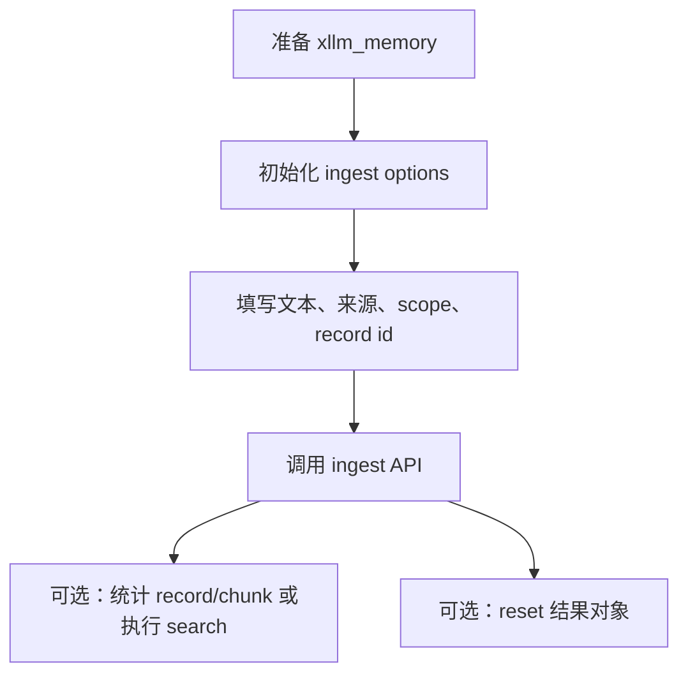

# xllm Memory Ingest API

> 状态：中文初稿已生成，待审阅。  
> 头文件：`xllm-memory.h`

本页讲解如何把内容写入 xllm memory。入库接口覆盖几类常见输入：一段文本、一次对话回复、任务、事实、偏好、单个文件、目录和工作区。

学习时请先记住一个核心动作：**先初始化 options，再填写你关心的字段，最后调用 ingest 函数**。

## 入库流程



## 类型

### xllm_memory_ingest_options

**功能**：普通文本入库的配置。

```c
typedef struct {
    xllm_memory_scope eScope;
    const char *sRecordId;
    const char *sTitle;
    const char *sSourceUri;
    const char *sText;
    bool bReplaceExisting;
    uint32 uChunkChars;
    uint32 uChunkOverlapChars;
    xvalue tMetadata;
    xvalue tVendorExtra;
} xllm_memory_ingest_options;
```

| 字段 | 含义 |
| --- | --- |
| `eScope` | 写入范围，默认是 `KNOWLEDGE`。 |
| `sRecordId` | 记录 ID。为空时 xllm 会生成或推导 ID。 |
| `sTitle` | 标题，通常用于展示和调试。 |
| `sSourceUri` | 来源 URI，例如 `file:///...`、`conversation://...`。 |
| `sText` | 要写入的文本。 |
| `bReplaceExisting` | 如果同 ID 已存在，是否替换。默认 `true`。 |
| `uChunkChars` | 本次入库的 chunk 字符数。为 `0` 使用 memory 默认值。 |
| `uChunkOverlapChars` | 本次入库的 chunk 重叠字符数。为 `0` 使用 memory 默认值。 |
| `tMetadata` | 元数据对象。 |
| `tVendorExtra` | 扩展字段。 |

### xllm_memory_ingest_turn_response_options

**功能**：把一次 turn 和 response 提炼成对话记忆。

```c
typedef struct {
    xllm_memory_scope eScope;
    xllm_memory_extraction_policy eExtractionPolicy;
    const xllm_turn *pTurn;
    const xllm_response *pResponse;
    const char *sSummaryText;
    const char *sConversationId;
    const char *sTurnId;
    const char *sRecordId;
    const char *sTitle;
    const char *sSourceUri;
    bool bReplaceExisting;
    bool bUseStableIdentity;
    int32 iPriority;
    int64 iExpiresAtUnix;
    int64 iUpdatedAtUnix;
    bool bIncludeSystemPrompt;
    bool bIncludeContextBlocks;
    bool bIncludeThinking;
    uint32 uChunkChars;
    uint32 uChunkOverlapChars;
    xvalue tMetadata;
    xvalue tVendorExtra;
} xllm_memory_ingest_turn_response_options;
```

**默认值**：scope 为 `MEMORY`，提取策略为 `TURN_RESPONSE`，替换同 ID 记录，不包含 system prompt、context blocks 和 thinking。

**学习建议**：如果你已经有摘要文本，优先填 `sSummaryText`；如果你想让 xllm 从 turn/response 组织文本，则填 `pTurn` 和 `pResponse`。

### xllm_memory_extraction_policy

**功能**：描述对话入库时希望提取哪类内容。

```c
typedef enum {
    XLLM_MEMORY_EXTRACTION_POLICY_DEFAULT = 0,
    XLLM_MEMORY_EXTRACTION_POLICY_NONE,
    XLLM_MEMORY_EXTRACTION_POLICY_TURN_RESPONSE,
    XLLM_MEMORY_EXTRACTION_POLICY_SUMMARY,
    XLLM_MEMORY_EXTRACTION_POLICY_TASK,
    XLLM_MEMORY_EXTRACTION_POLICY_FACT,
    XLLM_MEMORY_EXTRACTION_POLICY_PREFERENCE
} xllm_memory_extraction_policy;
```

| 值 | 含义 |
| --- | --- |
| `DEFAULT` | 使用默认策略。 |
| `NONE` | 不做额外提取，直接使用给定文本。 |
| `TURN_RESPONSE` | 记录本轮问答内容。 |
| `SUMMARY` | 写入摘要。 |
| `TASK` | 写入任务类记忆。 |
| `FACT` | 写入事实类记忆。 |
| `PREFERENCE` | 写入偏好类记忆。 |

### xllm_memory_ingest_task_options

**功能**：写入一个任务。

```c
typedef struct {
    xllm_memory_scope eScope;
    xllm_memory_task_status eStatus;
    const char *sTaskId;
    const char *sOwner;
    int64 iDeadlineUnix;
    const char *sSourceConversationId;
    const char *sSourceTurnId;
    const char *sRecordId;
    const char *sTitle;
    const char *sSourceUri;
    const char *sText;
    bool bReplaceExisting;
    int32 iPriority;
    int64 iExpiresAtUnix;
    int64 iUpdatedAtUnix;
    uint32 uChunkChars;
    uint32 uChunkOverlapChars;
    xvalue tMetadata;
    xvalue tVendorExtra;
} xllm_memory_ingest_task_options;
```

**默认值**：scope 为 `MEMORY`，状态为 `OPEN`，替换同 ID 记录，priority、expires、updated 均为 `0`。

### xllm_memory_task_status

**功能**：描述任务状态。

```c
typedef enum {
    XLLM_MEMORY_TASK_STATUS_OPEN = 0,
    XLLM_MEMORY_TASK_STATUS_DONE,
    XLLM_MEMORY_TASK_STATUS_CANCELED
} xllm_memory_task_status;
```

### xllm_memory_ingest_fact_options

**功能**：写入一个结构化事实。

```c
typedef struct {
    xllm_memory_scope eScope;
    const char *sFactId;
    const char *sSubject;
    const char *sPredicate;
    const char *sObject;
    const char *sSourceConversationId;
    const char *sSourceTurnId;
    const char *sRecordId;
    const char *sTitle;
    const char *sSourceUri;
    const char *sText;
    bool bReplaceExisting;
    int32 iPriority;
    int64 iExpiresAtUnix;
    int64 iUpdatedAtUnix;
    uint32 uChunkChars;
    uint32 uChunkOverlapChars;
    xvalue tMetadata;
    xvalue tVendorExtra;
} xllm_memory_ingest_fact_options;
```

**范例**：`subject = "user"`, `predicate = "works_on"`, `object = "xllm documentation"`。

### xllm_memory_ingest_preference_options

**功能**：写入一个用户或会话偏好。

```c
typedef struct {
    xllm_memory_scope eScope;
    const char *sPreferenceId;
    const char *sSubject;
    const char *sKey;
    const char *sValue;
    const char *sSourceConversationId;
    const char *sSourceTurnId;
    const char *sRecordId;
    const char *sTitle;
    const char *sSourceUri;
    const char *sText;
    bool bReplaceExisting;
    int32 iPriority;
    int64 iExpiresAtUnix;
    int64 iUpdatedAtUnix;
    uint32 uChunkChars;
    uint32 uChunkOverlapChars;
    xvalue tMetadata;
    xvalue tVendorExtra;
} xllm_memory_ingest_preference_options;
```

**范例**：`subject = "user"`, `key = "answer_style"`, `value = "concise Chinese"`。

### xllm_memory_ingest_file_options

**功能**：写入单个文件。

```c
typedef struct {
    xllm_memory_scope eScope;
    const char *sPath;
    const char *sRecordId;
    const char *sTitle;
    const char *sSourceUri;
    bool bReplaceExisting;
    uint64 uMaxFileBytes;
    uint32 uChunkChars;
    uint32 uChunkOverlapChars;
    xvalue tMetadata;
    xvalue tVendorExtra;
} xllm_memory_ingest_file_options;
```

| 字段 | 含义 |
| --- | --- |
| `sPath` | 文件路径，必填。 |
| `uMaxFileBytes` | 文件大小上限。为 `0` 表示使用默认或不限制。 |
| `sSourceUri` | 来源 URI。为空时 xllm 会根据路径构造。 |

### 目录入库进度类型

**功能**：目录和工作区入库时，回调会告诉你每个文件的处理状态。

```c
typedef enum {
    XLLM_MEMORY_INGEST_PROGRESS_VISITED = 1,
    XLLM_MEMORY_INGEST_PROGRESS_INGESTED,
    XLLM_MEMORY_INGEST_PROGRESS_SKIPPED,
    XLLM_MEMORY_INGEST_PROGRESS_FAILED
} xllm_memory_ingest_progress_kind;
```

| 值 | 含义 |
| --- | --- |
| `VISITED` | 文件已被遍历到。 |
| `INGESTED` | 文件已成功入库。 |
| `SKIPPED` | 文件被规则跳过。 |
| `FAILED` | 文件处理失败。 |

### xllm_memory_skip_reason

**功能**：说明文件为什么被跳过。

```c
typedef enum {
    XLLM_MEMORY_SKIP_HIDDEN = 1,
    XLLM_MEMORY_SKIP_IGNORED_DIRECTORY,
    XLLM_MEMORY_SKIP_IGNORED_PATH_PATTERN,
    XLLM_MEMORY_SKIP_IGNORED_EXTENSION,
    XLLM_MEMORY_SKIP_DISALLOWED_EXTENSION,
    XLLM_MEMORY_SKIP_TOO_LARGE,
    XLLM_MEMORY_SKIP_UNCHANGED,
    XLLM_MEMORY_SKIP_SECRET_DETECTED
} xllm_memory_skip_reason;
```

这些原因对学习者很有用：如果目录入库后发现文件数比预期少，可以先看 skipped 列表，而不是直接怀疑检索坏了。

### xllm_memory_ingest_directory_options

**功能**：写入一个目录中的文件。

```c
typedef struct {
    xllm_memory_scope eScope;
    const char *sPath;
    const char *sRecordIdPrefix;
    const char *sAllowedExtensions;
    bool bRecursive;
    bool bReplaceExisting;
    bool bSkipHidden;
    bool bUseWorkspaceDefaults;
    bool bSkipUnchanged;
    const char *sIgnoredDirectories;
    const char *sIgnoredExtensions;
    const char *sIgnoredPathPatterns;
    const char *sSourceUriPrefix;
    uint64 uMaxFileBytes;
    uint32 uChunkChars;
    uint32 uChunkOverlapChars;
    xllm_memory_ingest_progress_fn pfnProgress;
    void *pProgressCtx;
    xvalue tMetadata;
    xvalue tVendorExtra;
} xllm_memory_ingest_directory_options;
```

**默认值**：scope 为 `KNOWLEDGE`，递归遍历，替换同 ID 记录，跳过隐藏文件，不跳过 unchanged 文件。

**补充说明**：`sAllowedExtensions` 用来限制扩展名。实际格式应以当前实现支持的约定为准；建议在教程中使用简单的文本类扩展名集合。

### xllm_memory_ingest_workspace_options

**功能**：按工作区规则写入目录。

```c
typedef struct {
    xllm_memory_scope eScope;
    const char *sPath;
    const char *sRecordIdPrefix;
    bool bRecursive;
    bool bReplaceExisting;
    bool bSkipHidden;
    bool bSkipUnchanged;
    bool bLoadGitIgnore;
    const char *sAllowedExtensions;
    const char *sIgnoredDirectories;
    const char *sIgnoredExtensions;
    const char *sIgnoredPathPatterns;
    const char *sIgnoreFiles;
    const char *sSourceUriPrefix;
    uint64 uMaxFileBytes;
    uint32 uChunkChars;
    uint32 uChunkOverlapChars;
    xllm_memory_ingest_progress_fn pfnProgress;
    void *pProgressCtx;
    xvalue tMetadata;
    xvalue tVendorExtra;
} xllm_memory_ingest_workspace_options;
```

**默认值**：scope 为 `KNOWLEDGE`，递归遍历，替换同 ID 记录，跳过隐藏文件，跳过未变化文件，加载 `.gitignore`，使用默认 workspace source URI 前缀和默认文件大小上限。

### xllm_memory_ingest_directory_result

**功能**：保存目录或工作区入库结果。

```c
typedef struct {
    uint32 uVisitedFileCount;
    uint32 uIngestedFileCount;
    uint32 uCreatedRecordCount;
    uint32 uUpdatedRecordCount;
    uint32 uSkippedFileCount;
    uint32 uFailedFileCount;
    xllm_memory_record_info *pCreatedRecords;
    size_t iCreatedDetailCount;
    xllm_memory_record_info *pUpdatedRecords;
    size_t iUpdatedDetailCount;
    xllm_memory_skipped_file_info *pSkippedFiles;
    size_t iSkippedDetailCount;
    xllm_memory_failed_file_info *pFailedFiles;
    size_t iFailedDetailCount;
} xllm_memory_ingest_directory_result;
```

**释放规则**：使用 `xllm_memory_ingest_directory_result_reset` 释放其中的详情数组。

## API

### xllm_memory_ingest_options_init

**功能**：初始化普通文本入库 options。

**原型**：

```c
XLLM_API void xllm_memory_ingest_options_init(
    xllm_memory_ingest_options *pOptions
);
```

**参数**：

| 参数 | 说明 |
| --- | --- |
| `pOptions` | 要初始化的 options。 |

**返回值**：无。

**默认值**：scope 为 `KNOWLEDGE`，`bReplaceExisting = true`。

### xllm_memory_ingest_text

**功能**：把一段文本写入 memory。

**原型**：

```c
XLLM_API int xllm_memory_ingest_text(
    xllm_memory *pMemory,
    const xllm_memory_ingest_options *pOptions,
    xllm_error *pError
);
```

**参数**：

| 参数 | 说明 |
| --- | --- |
| `pMemory` | memory 对象。 |
| `pOptions` | 入库配置，通常必须提供 `sText`。 |
| `pError` | 错误对象，可为 `NULL`。 |

**返回值**：

| 返回值 | 含义 |
| --- | --- |
| `XRT_NET_OK` | 入库成功。 |
| `XRT_NET_ERROR` | 参数无效、文本为空、chunk 生成失败、存储失败或 embedding 失败。 |

**补充说明**：`sRecordId` 决定替换行为。如果你希望每次都写入新记录，可以使用不同 ID；如果你希望同一资料反复更新，使用稳定 ID 并保持 `bReplaceExisting = true`。

**范例代码**：

```c
xllm_memory_ingest_options ingest;
xllm_error error;

xllm_error_init(&error);
xllm_memory_ingest_options_init(&ingest);
ingest.eScope = XLLM_MEMORY_SCOPE_KNOWLEDGE;
ingest.sRecordId = "doc:intro";
ingest.sTitle = "xllm 简介";
ingest.sSourceUri = "manual://intro";
ingest.sText = "xllm 是一个面向 LLM 应用的 C API 库。";

if (xllm_memory_ingest_text(memory, &ingest, &error) != XRT_NET_OK) {
    fprintf(stderr, "ingest failed: %s\n", error.sMessage);
}
xllm_error_reset(&error);
```

### xllm_memory_ingest_turn_response_options_init

**功能**：初始化对话回复入库 options。

**原型**：

```c
XLLM_API void xllm_memory_ingest_turn_response_options_init(
    xllm_memory_ingest_turn_response_options *pOptions
);
```

**参数**：

| 参数 | 说明 |
| --- | --- |
| `pOptions` | 要初始化的 options。 |

**返回值**：无。

**默认值**：scope 为 `MEMORY`，policy 为 `TURN_RESPONSE`，替换同 ID，不包含 system/context/thinking。

### xllm_memory_ingest_turn_response

**功能**：把一次对话 turn 和模型 response 写成记忆。

**原型**：

```c
XLLM_API int xllm_memory_ingest_turn_response(
    xllm_memory *pMemory,
    const xllm_memory_ingest_turn_response_options *pOptions,
    xllm_error *pError
);
```

**参数**：

| 参数 | 说明 |
| --- | --- |
| `pMemory` | memory 对象。 |
| `pOptions` | 对话入库配置。 |
| `pError` | 错误对象，可为 `NULL`。 |

**返回值**：成功返回 `XRT_NET_OK`，失败返回 `XRT_NET_ERROR`。

**补充说明**：这个 API 适合在一次 chat 完成后调用。你可以保存完整问答，也可以提供 `sSummaryText` 保存更短的摘要。

**范例代码**：

```c
xllm_memory_ingest_turn_response_options options;
xllm_memory_ingest_turn_response_options_init(&options);
options.sConversationId = "conv-001";
options.sTurnId = "turn-010";
options.sSummaryText = "用户希望文档使用中文，并以学习者视角组织。";
options.sRecordId = "memory:conv-001:turn-010";
options.sTitle = "文档写作偏好";

xllm_memory_ingest_turn_response(memory, &options, NULL);
```

### xllm_memory_ingest_task_options_init

**功能**：初始化任务入库 options。

**原型**：

```c
XLLM_API void xllm_memory_ingest_task_options_init(
    xllm_memory_ingest_task_options *pOptions
);
```

**默认值**：scope 为 `MEMORY`，状态为 `OPEN`，替换同 ID。

### xllm_memory_ingest_task

**功能**：写入一个任务。

**原型**：

```c
XLLM_API int xllm_memory_ingest_task(
    xllm_memory *pMemory,
    const xllm_memory_ingest_task_options *pOptions,
    xllm_error *pError
);
```

**参数**：

| 参数 | 说明 |
| --- | --- |
| `pMemory` | memory 对象。 |
| `pOptions` | 任务内容和元数据。 |
| `pError` | 错误对象，可为 `NULL`。 |

**返回值**：成功返回 `XRT_NET_OK`，失败返回 `XRT_NET_ERROR`。

**范例代码**：

```c
xllm_memory_ingest_task_options task;
xllm_memory_ingest_task_options_init(&task);
task.sTaskId = "task-doc-api-memory";
task.sOwner = "docs";
task.sTitle = "补全 memory API 文档";
task.sText = "按照 xrt API 文档标准补全 xllm memory API。";
task.iPriority = 10;

xllm_memory_ingest_task(memory, &task, NULL);
```

### xllm_memory_ingest_fact_options_init

**功能**：初始化事实入库 options。

**原型**：

```c
XLLM_API void xllm_memory_ingest_fact_options_init(
    xllm_memory_ingest_fact_options *pOptions
);
```

**默认值**：scope 为 `MEMORY`，替换同 ID。

### xllm_memory_ingest_fact

**功能**：写入结构化事实。

**原型**：

```c
XLLM_API int xllm_memory_ingest_fact(
    xllm_memory *pMemory,
    const xllm_memory_ingest_fact_options *pOptions,
    xllm_error *pError
);
```

**返回值**：成功返回 `XRT_NET_OK`，失败返回 `XRT_NET_ERROR`。

**补充说明**：事实适合保存相对稳定的信息，例如“项目 xllm 的文档目录位于 docs/”。如果信息可能很快变化，可以设置 `iExpiresAtUnix`。

**范例代码**：

```c
xllm_memory_ingest_fact_options fact;
xllm_memory_ingest_fact_options_init(&fact);
fact.sFactId = "fact:xllm:docs-path";
fact.sSubject = "xllm";
fact.sPredicate = "docs_path";
fact.sObject = "docs/";
fact.sTitle = "xllm 文档目录";

xllm_memory_ingest_fact(memory, &fact, NULL);
```

### xllm_memory_ingest_preference_options_init

**功能**：初始化偏好入库 options。

**原型**：

```c
XLLM_API void xllm_memory_ingest_preference_options_init(
    xllm_memory_ingest_preference_options *pOptions
);
```

**默认值**：scope 为 `MEMORY`，替换同 ID。

### xllm_memory_ingest_preference

**功能**：写入偏好。

**原型**：

```c
XLLM_API int xllm_memory_ingest_preference(
    xllm_memory *pMemory,
    const xllm_memory_ingest_preference_options *pOptions,
    xllm_error *pError
);
```

**返回值**：成功返回 `XRT_NET_OK`，失败返回 `XRT_NET_ERROR`。

**范例代码**：

```c
xllm_memory_ingest_preference_options pref;
xllm_memory_ingest_preference_options_init(&pref);
pref.sPreferenceId = "pref:user:doc-language";
pref.sSubject = "user";
pref.sKey = "documentation_language";
pref.sValue = "zh-CN";
pref.sTitle = "文档语言偏好";

xllm_memory_ingest_preference(memory, &pref, NULL);
```

### xllm_memory_ingest_file_options_init

**功能**：初始化单文件入库 options。

**原型**：

```c
XLLM_API void xllm_memory_ingest_file_options_init(
    xllm_memory_ingest_file_options *pOptions
);
```

**默认值**：scope 为 `KNOWLEDGE`，替换同 ID。

### xllm_memory_ingest_file

**功能**：读取文件内容并写入 memory。

**原型**：

```c
XLLM_API int xllm_memory_ingest_file(
    xllm_memory *pMemory,
    const xllm_memory_ingest_file_options *pOptions,
    xllm_error *pError
);
```

**参数**：

| 参数 | 说明 |
| --- | --- |
| `pMemory` | memory 对象。 |
| `pOptions` | 文件入库配置，`sPath` 必填。 |
| `pError` | 错误对象，可为 `NULL`。 |

**返回值**：成功返回 `XRT_NET_OK`，失败返回 `XRT_NET_ERROR`。

**补充说明**：这个 API 适合把一个说明文件、配置文件或单篇文档放入知识库。如果你要处理整个目录，请使用 `xllm_memory_ingest_directory` 或 `xllm_memory_ingest_workspace`。

**范例代码**：

```c
xllm_memory_ingest_file_options file_options;
xllm_memory_ingest_file_options_init(&file_options);
file_options.sPath = "README.md";
file_options.sRecordId = "file:README.md";
file_options.sTitle = "项目 README";

xllm_memory_ingest_file(memory, &file_options, NULL);
```

### xllm_memory_ingest_directory_options_init

**功能**：初始化目录入库 options。

**原型**：

```c
XLLM_API void xllm_memory_ingest_directory_options_init(
    xllm_memory_ingest_directory_options *pOptions
);
```

**默认值**：scope 为 `KNOWLEDGE`，递归遍历，替换同 ID，跳过隐藏文件，不跳过 unchanged 文件。

### xllm_memory_ingest_directory_result_init

**功能**：初始化目录入库结果对象。

**原型**：

```c
XLLM_API void xllm_memory_ingest_directory_result_init(
    xllm_memory_ingest_directory_result *pResult
);
```

**返回值**：无。

### xllm_memory_ingest_directory_result_reset

**功能**：释放目录入库结果对象内部数组。

**原型**：

```c
XLLM_API void xllm_memory_ingest_directory_result_reset(
    xllm_memory_ingest_directory_result *pResult
);
```

**补充说明**：只要你向 `xllm_memory_ingest_directory` 传入了 result，并且调用完成，就应该在不再使用结果时 reset。

### xllm_memory_ingest_directory

**功能**：遍历目录并写入符合规则的文件。

**原型**：

```c
XLLM_API int xllm_memory_ingest_directory(
    xllm_memory *pMemory,
    const xllm_memory_ingest_directory_options *pOptions,
    xllm_memory_ingest_directory_result *pResult,
    xllm_error *pError
);
```

**参数**：

| 参数 | 说明 |
| --- | --- |
| `pMemory` | memory 对象。 |
| `pOptions` | 目录入库配置，`sPath` 必填。 |
| `pResult` | 输出结果，可为 `NULL`。 |
| `pError` | 错误对象，可为 `NULL`。 |

**返回值**：成功返回 `XRT_NET_OK`，失败返回 `XRT_NET_ERROR`。

**补充说明**：即使返回成功，也可能有部分文件被跳过。请查看 `uSkippedFileCount` 和 `pSkippedFiles`。

**范例代码**：

```c
xllm_memory_ingest_directory_options options;
xllm_memory_ingest_directory_result result;

xllm_memory_ingest_directory_options_init(&options);
xllm_memory_ingest_directory_result_init(&result);

options.sPath = "docs";
options.sRecordIdPrefix = "docs:";
options.sAllowedExtensions = ".md;.txt";
options.bRecursive = true;

if (xllm_memory_ingest_directory(memory, &options, &result, NULL) == XRT_NET_OK) {
    printf("visited=%u ingested=%u skipped=%u failed=%u\n",
        result.uVisitedFileCount,
        result.uIngestedFileCount,
        result.uSkippedFileCount,
        result.uFailedFileCount);
}

xllm_memory_ingest_directory_result_reset(&result);
```

### xllm_memory_ingest_workspace_options_init

**功能**：初始化工作区入库 options。

**原型**：

```c
XLLM_API void xllm_memory_ingest_workspace_options_init(
    xllm_memory_ingest_workspace_options *pOptions
);
```

**默认值**：scope 为 `KNOWLEDGE`，递归遍历，替换同 ID，跳过隐藏文件，跳过 unchanged 文件，加载 `.gitignore`。

### xllm_memory_ingest_workspace

**功能**：按工作区规则写入目录。

**原型**：

```c
XLLM_API int xllm_memory_ingest_workspace(
    xllm_memory *pMemory,
    const xllm_memory_ingest_workspace_options *pOptions,
    xllm_memory_ingest_directory_result *pResult,
    xllm_error *pError
);
```

**参数**：

| 参数 | 说明 |
| --- | --- |
| `pMemory` | memory 对象。 |
| `pOptions` | 工作区入库配置，`sPath` 必填。 |
| `pResult` | 输出结果，可为 `NULL`。 |
| `pError` | 错误对象，可为 `NULL`。 |

**返回值**：成功返回 `XRT_NET_OK`，失败返回 `XRT_NET_ERROR`。

**补充说明**：和普通目录入库相比，workspace 入库更适合源码仓库。它默认加载 `.gitignore`，并跳过未变化文件，适合重复同步。

**范例代码**：

```c
xllm_memory_ingest_workspace_options ws;
xllm_memory_ingest_directory_result result;

xllm_memory_ingest_workspace_options_init(&ws);
xllm_memory_ingest_directory_result_init(&result);

ws.sPath = "D:/git/xllm";
ws.sRecordIdPrefix = "workspace:xllm:";
ws.sAllowedExtensions = ".h;.c;.md;.txt";

xllm_memory_ingest_workspace(memory, &ws, &result, NULL);

printf("workspace ingested files: %u\n", result.uIngestedFileCount);
xllm_memory_ingest_directory_result_reset(&result);
```

## 完整范例：写入知识、偏好和任务

```c
static int seed_memory(xllm_memory *memory)
{
    xllm_memory_ingest_options doc;
    xllm_memory_ingest_preference_options pref;
    xllm_memory_ingest_task_options task;

    xllm_memory_ingest_options_init(&doc);
    doc.eScope = XLLM_MEMORY_SCOPE_KNOWLEDGE;
    doc.sRecordId = "guide:memory";
    doc.sTitle = "memory 使用说明";
    doc.sText = "memory 可以保存知识资料，也可以保存对话中的长期记忆。";
    if (xllm_memory_ingest_text(memory, &doc, NULL) != XRT_NET_OK) {
        return XRT_NET_ERROR;
    }

    xllm_memory_ingest_preference_options_init(&pref);
    pref.sPreferenceId = "pref:user:language";
    pref.sSubject = "user";
    pref.sKey = "language";
    pref.sValue = "zh-CN";
    if (xllm_memory_ingest_preference(memory, &pref, NULL) != XRT_NET_OK) {
        return XRT_NET_ERROR;
    }

    xllm_memory_ingest_task_options_init(&task);
    task.sTaskId = "task:review-docs";
    task.sTitle = "审阅中文文档";
    task.sText = "逐页审阅 docs/api 下的中文 API 文档。";
    return xllm_memory_ingest_task(memory, &task, NULL);
}
```

## 常见错误

### 忘记初始化 options

直接声明结构体然后只填几个字段，可能留下未定义值。正确做法是始终先调用对应的 `*_init`。

### record id 不稳定

如果你希望重复入库同一个文件时更新旧记录，请使用稳定的 `sRecordId` 或 `sRecordIdPrefix`。如果 ID 每次都不同，memory 会不断增加新记录。

### 目录入库后没有 reset result

`xllm_memory_ingest_directory_result` 里可能包含 created、updated、skipped、failed 的详情数组。使用后调用 `xllm_memory_ingest_directory_result_reset`。

### 用目录入库替代 workspace 同步

普通目录入库适合一次性导入。对源码仓库做持续同步时，优先使用 workspace 或 sync API，因为它们提供更好的 unchanged、gitignore 和删除记录处理。

## 相关文档

- [Memory API](api-memory.md)
- [Memory Search API](api-memory-search.md)
- [Memory Workspace API](api-memory-workspace.md)
- [返回 API 索引](README.md)
